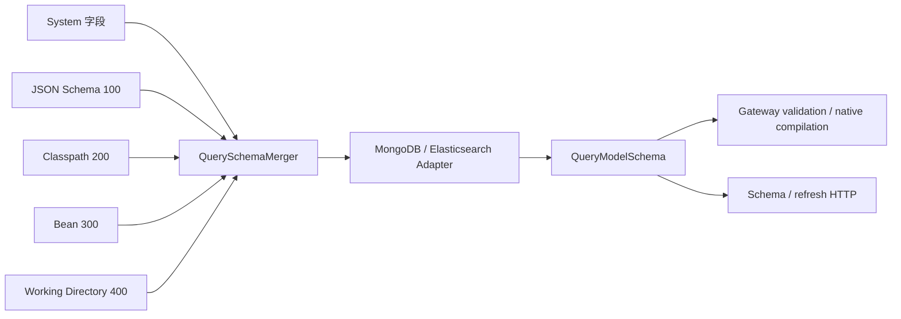

# 查询模型 Schema

## Schema 解决什么问题

`QueryModelSchema` 发布一个查询模型的不可变事实：共享 `LogicalQuerySchema` 值树，以及按 `QueryPathTemplate` 索引的后端 binding。Schema 自身不执行 Query、不决定权限、不重写请求。Gateway 校验逻辑输入；Backend 读取 binding 后编译原生表达式。

## 递归值树

`QueryValueSchema.kind` 区分 `SCALAR`、`OBJECT`、`ARRAY`、`NULL`、`UNION` 和 `UNKNOWN`：

- OBJECT 的固定属性在 `properties`，动态 Map 值在 `additionalProperties`；明确属性优先于 Map 默认值。
- ARRAY 的成员定义在 `items`，容器不复制成员的 valueTypes 或时间语义。
- UNION 保留 `alternatives`；UNKNOWN 保留类型不确定性，不能据此开放带值操作。
- 值可带 title、description、enumValues、nullable、required 和 semanticType。脱敏规则留在内存，公开 metadata 只提供 `masked` 标记。

例如 `Map<String, List<Address>>` 的声明：

```kotlin
querySchemaRegistration(Order::class, QueryModel.SNAPSHOT) {
    field("state.addresses") {
        kind(QueryValueKind.OBJECT)
        additionalProperties {
            kind(QueryValueKind.ARRAY)
            items {
                kind(QueryValueKind.OBJECT)
                property("city") { valueTypes(QueryValueType.STRING) }
            }
        }
    }
}
```

`state.addresses.home` 是对象数组；在 `elementMatch` 中使用相对字段 `city`。`state.addresses.home.city.extra` 不存在，不能回退到物理字段。字符串或数值数组的 eq/in/range 使用一层直接 items 值域；不会穿透匿名的第二层数组。普通字段、数组和 Map 值各自保留定义。

## 来源优先级与合并

运行时来源链如下，括号内数字越大，优先级越高：



- `System` 为 Snapshot 和 EventStream 提供各自的系统字段。扩展只能位于 Snapshot 的 `state` 或 EventStream 的 `body.body` 根下；已经由系统设置的字段叶不能被覆盖。
- `JsonQuerySchemaSource (100)` 从聚合状态的 JSON 形状推断 Snapshot 字段，并从领域事件 payload 推断 EventStream 的 `body.body.*` 字段。
- `ClasspathQuerySchemaSource (200)` 读取 `META-INF/wow/query-schema/{context}.{aggregate}.{model}.json`；`WorkingDirectoryQuerySchemaSource (400)` 读取 `config/wow/query-schema/{context}.{aggregate}.{model}.json`。`model` 段使用小写：`snapshot` 或 `event_stream`；点号是 Wow 保留的命名聚合分隔符。仅当新路径没有资源时，每个 source 才回退到 `wow-query-schema/{context}/{aggregate}/{model}.json`。source 优先级、classpath 合并与刷新行为保持不变。
- `BeanQuerySchemaSource (300)` 合并当前上下文注册的 `QuerySchemaRegistration`。

`QuerySchemaMerger` 按数字从小到大合并，后来的高优先级来源只覆盖其显式设置的叶，未设置的叶沿用低优先级值。同一优先级的多个声明若对同一叶给出不同值会抛出 Schema conflict，而不是依赖加载顺序。刷新只重新加载当前进程中的来源与后端事实并替换缓存；它不会修改索引、mapping、validator 或历史数据。


## 原生绑定与能力

`QueryPathTemplate` 明确区分 Property、Item 和 Key。`QueryValueBindings` 按 capability 存储 `QueryFieldBindingTemplate(physicalPath, storageTypes)`，另有 projectionPath 与 responsePath。具体 `schema.field(QueryField(...))` 返回逻辑值、完整元素祖先和具体 binding；固定 key 的原生约束不能被 Map 默认 binding 绕过。

MongoDB adapter 读取索引与可选 validator；数组/items/additionalProperties 与组合类型证据分别保留。缺少原生类型事实时只能使用已知声明和 codec；已知冲突拒绝。Temporal.Date 不开放 EQ/RANGE，时间聚合还要求原生时间类型证据。Elasticsearch adapter 使用 mapping、nested、multi-field、doc values、alias/runtime facts；不会从调用者字段名猜测物理路径。

| 能力 | 用途 |
| --- | --- |
| PRESENCE | 存在、缺失、null、空集合 |
| EXACT_MATCH / LITERAL_MATCH / RANGE | 精确值、字面字符串和范围比较 |
| FULL_TEXT_TERMS / FULL_TEXT_PHRASE | 模型或字段支持的全文搜索 |
| SORT / CURSOR_SORT | 普通排序 / 独立的游标排序能力 |
| ELEMENT_SCOPE | 进入已证明的对象数组元素作用域 |
| AGGREGATE_TERMS / AGGREGATE_NUMERIC / AGGREGATE_TEMPORAL | 分组、数值和时间聚合 |

数值 `EXACT_MATCH`/`RANGE` 表示按原生存储精度比较，不表示 source 任意精度相等，见[数值比较](./filter-expression.md)。`AGGREGATE_NUMERIC` 不等于自动展开数组；直接字段与算术叶子按[数值参与值合同](./aggregation-query.md#numeric-contributions)读取。逻辑声明及 runtime 输出必须符合该数值模型。精度来自 Backend 的原生事实，本次不新增公共 precision 或 scalingFactor 字段。

原生能力不因 Mask 被删除。公共游标和聚合准入另行拒绝受保护的字段及其原生别名；公开 metadata 应用于发现可用操作，不能替代最终请求校验。

## 严格准入与刷新

未知字段、未知后缀、缺失 capability、错误值类型或不完整元素作用域都会拒绝。没有可配置的宽松字段回退。公共 Query 保持逻辑路径；`validateQuery(query, schema)` 返回同一个逻辑输入，不产生物理 Query。

每次 Gateway 订阅取得一次 Schema，准备、公共校验、Backend 和响应 Mask 使用同一实例。Provider 失败不缓存为成功结果，也不会绕过校验执行；refresh 发布新实例，已开始的订阅继续使用原实例。直接 Backend 调用必须显式传入 Schema，边界见[查询后端](./query-backend.md)。

## HTTP 与 OpenAPI 扩展

`GET snapshot/schema`、`POST snapshot/schema/refresh`、`GET event/schema`、`POST event/schema/refresh` 返回 `QueryModelSchemaMetadata(model, capabilities, root)`。root 是递归 `QueryValueSchemaMetadata`，保留 properties/items/additionalProperties/alternatives，不暴露 native path、storageTypes、Mask strategy 或可执行规则。

`x-wow-query-fields` 仍是 Snapshot request-body component 的静态候选逻辑字段扩展，不是请求字段，也不证明运行时能力。[API Client](./query-api-client.md)不会代替服务器读取和验证运行时 Schema。
