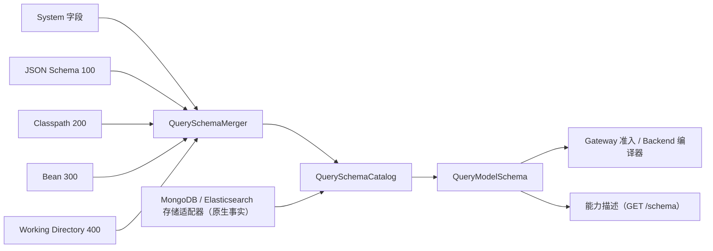

# 查询模型 Schema

## Schema 解决什么问题

`QueryModelSchema` 发布一个查询模型的不可变事实：共享 `LogicalQuerySchema` 值树，以及按 `QueryPathTemplate` 索引的后端 binding。Schema 自身不执行 Query、不决定权限、不重写请求。Gateway 校验逻辑输入；Backend 读取 binding 后编译原生表达式。

## 递归值树

`QueryValueSchema.kind` 区分 `SCALAR`、`OBJECT`、`ARRAY`、`NULL`、`UNION` 和 `UNKNOWN`：

- OBJECT 的固定属性在 `properties`，动态 Map 值在 `additionalProperties`；明确属性优先于 Map 默认值。
- ARRAY 的成员定义在 `items`，容器不复制成员的 valueTypes 或时间语义。
- UNION 保留 `alternatives`；UNKNOWN 保留类型不确定性，不能据此开放带值操作。
- 值可带 title、description、enumValues、nullable、required 和 semanticType。脱敏规则留在内存，能力描述只公开字段的 `sensitivity`。

例如 `Map<String, List<Address>>` 的声明：

```kotlin
querySchemaRegistration(Order::class, QueryModel.SNAPSHOT) {
    field("state.addresses") {
        values {
            items {
                property("city") { types(QueryValueType.STRING) }
            }
        }
    }
}
```

`state.addresses.home` 是对象数组；在 `elementMatch` 中使用相对字段 `city`。`state.addresses.home.city.extra` 不存在，不能回退到物理字段。字符串或数值数组的 eq/in/range 使用一层直接 items 值域；不会穿透匿名的第二层数组。普通字段、数组和 Map 值各自保留定义。

## 字段别名与弃用

字段改名时用 `@QueryAlias`（位于 `me.ahoo.wow.api.query.annotation`）保留旧名，只为旧调用方保留的字段用 Kotlin 标准的 `@Deprecated` 标记：

```kotlin
data class OrderState(
    @field:QueryAlias("state.customer")
    val buyer: Buyer,
    @Deprecated("Use state.buyer.")
    val customerName: String,
)
```

- 别名是完整的逻辑路径。过滤、排序、投影与聚合都可以使用别名或别名之下的路径（`state.customer.name`）；准入最先把它换成规范名。
- 结果与投影只出现规范名。排序唯一性、敏感等级与游标都按规范名判断，别名无法绕过规范名上的保护。
- 别名与已有字段重名、被两个字段同时声明，或者位于 Map 键之下时，Schema 编译失败。
- 能力描述中每个字段只按规范名列出一次，并在 `aliases` 中列出别名；弃用的字段仍可查询，带有 `deprecated`（`{ "message": … }`）。

## 来源优先级与合并

运行时来源链如下，括号内数字越大，优先级越高：


```mermaid
flowchart LR
    System["System 字段"] --> Merger["QuerySchemaMerger"]
    Json["JSON Schema 100"] --> Merger
    Classpath["Classpath 200"] --> Merger
    Bean["Bean 300"] --> Merger
    Working["Working Directory 400"] --> Merger
    Merger --> Catalog["QuerySchemaCatalog"]
    Adapter["MongoDB / Elasticsearch 存储适配器（原生事实）"] --> Catalog
    Catalog --> Schema["QueryModelSchema"]
    Schema --> Gateway["Gateway 准入 / Backend 编译器"]
    Schema --> HTTP["能力描述（GET /schema）"]
```

- `System` 为 Snapshot 和 EventStream 提供各自的系统字段。扩展只能位于 Snapshot 的 `state` 或 EventStream 的 `body.body` 根下；已经由系统设置的字段叶不能被覆盖。
- `InferredQuerySchemaSource (100)` 从聚合状态的 JSON 形状推断 Snapshot 字段，并从领域事件 payload 推断 EventStream 的 `body.body.*` 字段：每种事件一个变体，并以 `bodyType` 标记。类型推断是一个 `QueryModelSource` Bean：默认的 `JsonQueryModelSource`（wow-schema）只报告序列化 JSON 的原始事实（路径、类型、可空、枚举、格式提示、成员注解），这些事实对查询的含义由 wow-query 决定。标准时间类型自动识别为时间；`@QueryTemporal(unit = TimeUnit.SECONDS)` 声明整数时间戳，`@QueryTemporal(pattern = "yyyy-MM-dd")` 声明格式化的字符串时间；`@QueryDecimal` 与 `@QueryMoney` 声明[小数与金额精度](#decimal-money)，`@QueryDuration` 与 `@QueryReference` 声明[时长与引用](#duration-reference)（都在 `me.ahoo.wow.api.query.annotation`）；类型为 `AggregateId` 的属性无需注解即是引用。`@Sensitive` 见[字段脱敏](./masking.md)。
- `ClasspathQuerySchemaSource (200)` 读取 `META-INF/wow/query-schema/{context}.{aggregate}.{model}.json`；`WorkingDirectoryQuerySchemaSource (400)` 读取 `config/wow/query-schema/{context}.{aggregate}.{model}.json`。模型段为小写的 `snapshot` 或 `event_stream`；点号是 Wow 命名聚合保留的分隔符。9.1 的备用位置 `wow-query-schema/{context}/{aggregate}/{model}.json` 不再读取。若没有任何来源（classpath、工作目录或注册 Bean）以 9.2 格式声明该模型，那里的文件会产生一条警告日志，写明 9.2 文件应放在哪里，该模型使用推断的 schema；设置 `wow.query.schema.legacy-declarations=fail` 则改为让该模型的 schema 不可用。9.1 位置在每个模型首次加载时扫描一次，定期重新校验不再扫描。见下文[迁移 9.1 的声明文件](#declaration-91)。
- `BeanQuerySchemaSource (300)` 合并当前上下文注册的 `QuerySchemaRegistration`。

### 声明文件与代码注册

声明只补充推断不出来的内容，主要是 `Map`、`JsonNode` 或 `Any` 背后的取值，使用与能力描述相同的词汇：

```json
{
  "fields": {
    "state.status": { "types": ["STRING"], "enum": [{ "value": "PAID", "description": "Paid" }, { "value": "SHIPPED" }] },
    "state.placedOn": { "types": ["STRING"], "semantic": { "type": "TEMPORAL_FORMATTED", "pattern": "yyyy-MM-dd" } },
    "state.attributes": { "kind": "OBJECT", "values": { "kind": "ARRAY", "items": { "types": ["STRING"], "nullable": false } } }
  }
}
```

| 键 | 含义 |
|---|---|
| `kind` | `SCALAR`、`OBJECT` 或 `ARRAY`；省略时由 `types`、`properties`/`values` 或 `items` 推出。联合、`null` 与未知值只能推断，不能声明。自 9.3.0 起，`OBJECT` 可以打开推断为未知的值（`ObjectNode` 或 `Any` 字段），以便声明它的 `properties`；它不会把标量或数组变成对象 |
| `types` | 标量类型：`STRING`、`INTEGER`、`DECIMAL`、`BOOLEAN` |
| `nullable` | 是否会出现 JSON `null` |
| `enum` | 声明的取值，每项为 `{ "value": …, "description"?: … }`；说明会进入能力描述的 `enum` |
| `semantic` | 一种语义类型：时间编码 `TEMPORAL_EPOCH`（`timeUnit`）、`TEMPORAL_DATE`、`TEMPORAL_FORMATTED`（`pattern`）；或数值格式 `DECIMAL`（`scale`）、`MONEY`（`currency` 或 `currencyField`、`scale`），见[下文](#decimal-money)；或 `DURATION`（`timeUnit`）、`REFERENCE`（`contextName` 与 `aggregateName`，或 `contextNameField` 与 `aggregateNameField`），见[下文](#duration-reference) |
| `description` | 字段的含义 |
| `properties`、`items`、`values` | 对象的具名属性、数组的元素、Map 中每个键的取值 |

其他键一律拒绝。敏感等级、别名与弃用只能在领域字段上声明（`@Sensitive`、`@QueryAlias`、`@Deprecated`）；显示名属于视图定义。`querySchemaRegistration { field(...) { … } }` 使用同一套词汇：`kind`、`types`、`nullable`、`enumValue(value, description)`、`semantic`/`temporalEpoch`/`temporalFormatted`、`description`、`property`、`items`、`values`。

#### 迁移 9.1 的声明文件 {#declaration-91}

9.1.5 先读取 `META-INF/wow/query-schema/{context}.{aggregate}.{model}.json`（以及工作目录中的 `config/wow/query-schema/…`），两者都不存在时才回退到 `wow-query-schema/{context}/{aggregate}/{model}.json`；这些文件都是 9.1 格式。9.2 只读取前两个路径，且只接受 9.2 格式。两个版本都拒绝不认识的键，因此当 9.1 与 9.2 节点同时运行，或同一个领域模块被两个版本读取时：

- 位于 `META-INF/wow/query-schema/…` 或 `config/wow/query-schema/…` 的 9.1 格式文件，9.2 同样无法读取：它会让 9.2 节点上该模型的 schema 不可用（`Unknown query schema properties`）；
- 位于这些路径的 9.2 格式文件会让 9.1 节点上该模型的 schema 不可用，除非它只使用两个版本都能读取的 `kind`、`nullable`、`description`、`properties` 与 `items`；
- 位于 `wow-query-schema/…` 的文件只有 9.1 节点读取；9.2 节点记录警告，并使用该模型推断的 schema（默认 `wow.query.schema.legacy-declarations=warn`）。

升级期间若要让两边都保留该模型的声明，可以任选其一：

1. **逐节点：** 9.1 文件只保留在 `wow-query-schema/{context}/{aggregate}/{model}.json`（不要放在 `META-INF/wow/query-schema/…`），并为每个 9.2 节点在其工作目录的 `config/wow/query-schema/{context}.{aggregate}.{model}.json` 放置 9.2 文件。9.1 节点回退读取 9.1 文件；9.2 节点读取工作目录中的文件，只记录 9.1 文件被忽略。
2. **共同子集：** 在 `META-INF/wow/query-schema/{context}.{aggregate}.{model}.json` 放一个只使用上述两版共有键、且不含 `null` 值的文件。

不再有 9.1 节点读取后，把文件以 9.2 格式移到 `META-INF/wow/query-schema/{context}.{aggregate}.{model}.json`（或 `config/wow/query-schema/…`），删除 9.1 文件；可再设置 `wow.query.schema.legacy-declarations=fail`，让遗漏的 9.1 文件使其模型不可用。键的变化如下；9.2 不接受 `null` 值（改为省略该键）：

| 9.1 键 | 9.2 键 |
|---|---|
| `valueTypes` | `types`（可声明：`STRING`、`INTEGER`、`DECIMAL`、`BOOLEAN`） |
| `enumValues: [v, …]` | `enum: [{ "value": v }, …]` |
| `semanticType` | `semantic` |
| `additionalProperties` | `values` |
| `kind`、`nullable`、`description`、`properties`、`items` | 不变；`kind` 取 `SCALAR`、`OBJECT` 或 `ARRAY` |
| `title` | 删除：显示名属于视图定义 |
| `required`、`alternatives` | 删除：由推断得出，不再声明 |

`QuerySchemaMerger` 按数字从小到大合并，后来的高优先级来源只覆盖其显式设置的叶，未设置的叶沿用低优先级值。同一优先级的多个声明若对同一叶给出不同值会抛出 Schema conflict，而不是依赖加载顺序。刷新只重新加载当前进程中的来源与后端事实，schema 有变化时才替换缓存：版本与存储绑定都不变时，保留已发布的 schema 及其缓存的描述。它不会修改索引、mapping、validator 或历史数据。


### 小数与金额精度 {#decimal-money}

数值字段可以声明它应当如何解读，视图引擎与 Agent 据此正确地格式化和合计。这是展示与合计语义，不是存储规则：它不改变任何查询，也不增加任何能力。

- `DECIMAL(scale)`：定点小数，`scale` 为小数位数。
- `MONEY`：金额，币种二选一：固定的 ISO 4217 币种 `currency`（如 `CNY`），或同级字符串属性 `currencyField` 中的币种。固定币种时 `scale` 缺省取该币种的标准小数位（`CNY` 为 2，`JPY` 为 0；`XAU` 等没有标准小数位的币种必须给出）；使用 `currencyField` 时 `scale` 必填。

```kotlin
data class OrderState(
    @field:QueryDecimal(scale = 4) val exchangeRate: BigDecimal,
    @field:QueryMoney(currency = "CNY") val total: BigDecimal,
    @field:QueryMoney(currencyField = "currency", scale = 2) val paid: BigDecimal,
    val currency: String,
)
```

声明文件中写作 `"semantic": { "type": "DECIMAL", "scale": 2 }` 或 `"semantic": { "type": "MONEY", "currency": "CNY" }`。精度不会自动推断：`BigDecimal` 看不出精度，猜错比不声明更糟。

构建 Schema 时，错误的声明作为 Schema 冲突拒绝，而不会被忽略：字段必须是数值；`currencyField` 必须是同一对象（元素内的字段则为同一元素）中的单值字符串属性；`currency` 与 `currencyField` 恰好给出一个；一个字段只有一种语义类型，因此不能同时是时间。能力描述在字段的 `semantic` 中输出该格式，并给出解析后的 `scale`，例如 `{ "type": "MONEY", "currency": "CNY", "scale": 2 }`。

### 时长与引用 {#duration-reference}

字段还能声明两项事实，同样只供读取：不改变任何查询，也不在 MongoDB 或 Elasticsearch 上增加任何能力。

- `DURATION(timeUnit)`：以 `timeUnit` 计的一段时长，如以秒计的超时，视图引擎据此按时长格式化，而不必把单位写进口径。用 `@QueryDuration(unit)` 声明；单位必填，`Int` 看不出单位。
- `REFERENCE`：值是某个聚合的 id，用于查找与跳转。要么是固定的聚合 `contextName` 与 `aggregateName`，用 `@QueryReference(aggregateName, contextName)` 声明，省略 `contextName` 即声明字段的模型自己的限界上下文；要么逐条记录由同级字符串属性 `contextNameField` 与 `aggregateNameField` 给出。后一种对每个 `AggregateId` 类型的属性自动推断：它的 `aggregateId` 指向它自己的 `contextName` 与 `aggregateName` 所指的聚合。引用总是指向聚合的 id，不指向别的键。记录自身的 `aggregateId` 不带引用：它的角色 `AGGREGATE_ID` 与所在端点已经说明是哪个聚合。

```kotlin
interface IRetrySpec {
    @get:QueryDuration(TimeUnit.SECONDS) val minBackoff: Int
}

data class OrderState(
    @field:QueryReference("member") val memberId: String,
    @field:QueryReference("product", contextName = "catalog") val productIds: List<String>,
    val source: AggregateId,
)
```

声明文件中写作 `"semantic": { "type": "DURATION", "timeUnit": "SECONDS" }` 或 `"semantic": { "type": "REFERENCE", "contextName": "example", "aggregateName": "member" }`。构建 Schema 时拒绝：非数值字段上的时长、既非字符串也非整数的字段上的引用（由它们组成的数组可以）、不是同一对象中单值字符串的同级名称字段，以及同一字段上的第二种语义类型。被引用的聚合只校验名称语法，因为它可能在另一个服务里。

读取能力描述的客户端可能遇到自己版本还不认识的语义 `type`（来自更新的服务端）：Kotlin 的 `QuerySemanticType` 把它读作 `QuerySemanticType.Unknown`，客户端视同没有语义类型。声明文件或代码注册中写了未知的 `type` 仍会被拒绝。

## 原生绑定与能力

`QueryPathTemplate` 明确区分 Property、Item 和 Key。`QueryValueBindings` 按 capability 存储 `QueryFieldBindingTemplate(physicalPath, storageTypes)`，另有 projectionPath 与 responsePath。具体 `schema.field(QueryField(...))` 返回逻辑值、完整元素祖先和具体 binding；固定 key 的原生约束不能被 Map 默认 binding 绕过。

MongoDB adapter 读取索引与可选 validator；数组/items/additionalProperties 与组合类型证据分别保留。缺少原生类型事实时只能使用已知声明和 codec；已知冲突拒绝。Temporal.Date 仅在 validator 声明其为 BSON `date`（不含 `timestamp`）时开放 EQ/RANGE，操作数（ISO-8601 日期、日期时间或 epoch 毫秒）编译为 BSON date；时间聚合还要求原生时间类型证据。Elasticsearch adapter 使用 mapping、nested、multi-field、doc values、alias/runtime facts；不会从调用者字段名猜测物理路径。

| 能力 | 用途 |
| --- | --- |
| PRESENCE | 存在、缺失、null、空集合 |
| EXACT_MATCH / LITERAL_MATCH / RANGE | 精确值、字面字符串和范围比较 |
| FULL_TEXT_TERMS / FULL_TEXT_PHRASE | 模型或字段支持的全文搜索 |
| SORT / CURSOR_SORT | 普通排序 / 独立的游标排序能力 |
| ELEMENT_SCOPE | 进入已证明的对象数组元素作用域 |
| AGGREGATE_TERMS / AGGREGATE_NUMERIC / AGGREGATE_TEMPORAL | 分组、数值和时间聚合 |

数值 `EXACT_MATCH`/`RANGE` 表示按原生存储精度比较，不表示 source 任意精度相等，见[数值比较](./filter-expression.md)。`AGGREGATE_NUMERIC` 不等于自动展开数组；直接字段与算术叶子按[数值参与值合同](./aggregation-query.md#numeric-contributions)读取。逻辑声明及 runtime 输出必须符合该数值模型。精度来自 Backend 的原生事实，本次不新增公共 precision 或 scalingFactor 字段。

原生能力不因 Mask 被删除。公共游标和聚合准入另行拒绝受保护的字段及其原生别名；公开 metadata 应用于发现可用操作，不能替代最终请求校验。

## 严格准入与重新校验

未知字段、未知后缀、缺失 capability、错误值类型或不完整元素作用域都会拒绝。没有可配置的宽松字段回退。公共 Query 保持逻辑路径。准入在一次遍历中校验并解析每个字段引用：`QueryAdmission.Trusted` 返回的 `AdmittedQuery` 中查询仍用逻辑名，每个引用的物理绑定随附在旁，不产生物理 Query。

每次 Gateway 订阅只使用一个 Schema 版本：准备、准入与响应 Mask 都读取它，Backend 的编译器消费准入按它解析、由 `AdmittedQuery` 携带的字段。Provider 失败不缓存为成功结果，也不会绕过校验执行；重新校验（每隔 `wow.query.schema.revalidate-interval`，或经 `wowQuerySchema` actuator 端点按需触发）发布新版本，已开始的订阅继续使用自己的版本。直接调用 Backend 时经 `QueryAdmission.Trusted` 取得 `AdmittedQuery`，边界见[查询后端](./query-backend.md)。

## HTTP 与 OpenAPI 扩展

`GET snapshot/schema` 与 `GET event/schema` 返回模型在 HTTP 入口上的能力描述：这个模型经 HTTP 能被怎样查询。存储事实（索引、mapping、validator）会在部署之外变化，所以每个实例按 `wow.query.schema.revalidate-interval`（默认 `5m`，`0s` 关闭）定期重新加载全部查询 schema；编译失败时保留上一个版本并记录日志。引入 Spring Boot Actuator 后，`wowQuerySchema` 端点可以查看本实例各 schema 的版本（读操作），也可以立即重新校验，可只针对一个 `aggregate`（写操作）。9.1 的 `POST /{aggregate}/snapshot/schema/refresh` 与 `POST /{aggregate}/event/schema/refresh` 作为弃用别名保留到 10.0.0：在作答的实例上只重新加载该聚合对应的模型（Snapshot 或 EventStream），并发请求共用同一次进行中的加载，再像 `GET …/schema` 那样返回能力描述。描述只发布结论，不发布存储事实：

- `fields`：每个逻辑路径一条（元素内字段写完整路径，并在 `scope` 中给出所在元素），包含 `role`（系统字段才有：系统字段过滤的目标，如 `AGGREGATE_ID`、`TENANT_ID`，或模型的时间：Snapshot 的 `eventTime` 与 EventStream 的 `createTime` 为 `EVENT_TIME`，Snapshot 的 `firstEventTime` 为 `FIRST_EVENT_TIME`）、`types`、`kind`、`semantic`、`enum`、`sensitivity`、`deprecated`、`aliases`、允许的 `filter.operators`、`sort`（`paged`、`cursor`）与 `aggregate`（分组、函数、`distinctCount`、`percentile`、`any`、`inMetricFilter` 等）；
- `record`：身份字段、分页方式、默认删除范围、根运算符与全文检索（`search.modes` 为模型级 `SEARCH` 可用的方式，`search.fields` 为记录级字段）；
- `limits`：HTTP 入口的有效限额（预算与协议限额取较小者，`null` 为不限）与 `defaultListSize`；
- `analysis`：指标类型、`approximate`（本后端估算的指标：MongoDB 为 `PERCENTILE`，Elasticsearch 为 `DISTINCT_COUNT` 与 `PERCENTILE`）、`DATE_HISTOGRAM` 可用的 `dateUnits`、`DATE_PART` 可用的 `dateParts`、`DATE_DIFF` 可用的 `dateDiffUnits`（不允许表达式时为空），以及 having、排序与 dense 支持；
- `elements`（各带 `search`：写在对它的 `ELEMENT_MATCH` 内的 `SEARCH` 可以指定的字段，以及这些字段都支持的方式；存储一个都不能检索时省略）、`dynamic`（映射键写作 `{key}`，每个模式一条，数组元素与字段一样隐含其中）与 `constraints`（例如 `CURSOR_UNIQUE_SORT`，以及关闭昂贵运算时的 `COUNT_REQUIRES_FILTER` / `STARTS_WITH_REQUIRES_PREFIX`，以及存储（如 MongoDB）不能按两个独立数组排序时的 `PARALLEL_ARRAY_SORT`，`fields` 列出数组型排序字段，一次排序最多使用其中一个；Elasticsearch 上还有 `NULL_OR_EMPTY_AS_MISSING`，`fields` 列出存储的 `null` 或空数组会被存在性运算符当作缺失的字段，以及 `ARRAY_EQUALITY`：那里的 `EQ` / `NE` 只接受标量操作数，数组操作数以该代码拒绝）。
- `variants`（仅 EventStream）：`body` 元素中的事件类型，以判别字段 `bodyType` 区分，每种带说明与相对元素的 payload `fields`（如 `body.amount`）。针对某种事件字段的条件要与 `bodyType` 一起写在对 `body` 的 `ELEMENT_MATCH` 内，才能作用在同一个事件上。

列出的每一项单独使用时一定能被准入，没列出的一定会被拒绝；取值、范围与策略仍可能在运行时拒绝查询，并在 `bindingErrors` 中给出代码。描述不包含物理路径、存储类型或 Mask 策略。`version` 是内容哈希，同时作为 ETag：带上 `If-None-Match`，内容未变时返回 304。跨源浏览器只有在服务端把 `ETag` 列入 `Access-Control-Expose-Headers` 时才能读到这个响应头；CORS 配置不归 Wow 管，请在那里加上（例如 Spring `CorsConfiguration` 的 `exposedHeaders("ETag")`）。从响应体读取 `version` 的客户端不需要这个头。

`x-wow-query-fields` 仍是 Snapshot request-body component 的静态候选逻辑字段扩展，不是请求字段，也不证明运行时能力。[API Client](./query-api-client.md)不会代替服务器读取和验证运行时 Schema。
