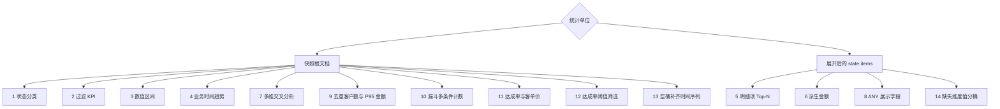

# 快照聚合

快照聚合以聚合的当前物化状态为事实来源，返回以 group 和 metric alias 为列名的动态表格行。公共 AST、别名、排序与结构限制见[聚合查询](./aggregation-query.md)；本页只说明如何把该合同应用到快照。

数值 `FIELD` 与算术叶子按[数值参与值与精度](./aggregation-query.md#numeric-contributions)读取：每条当前记录忽略 null 后恰有一个存储数值才贡献值，重复项计为多个；COUNT 仍统计记录。该规则保留 singleton 数组支持，不改变直方图分桶合同。

## 能力与入口

- **JVM Gateway**：通过 Spring 注入聚合级 `SnapshotQueryGateway<OrderState>`，构造 `AggregationQuery` 后调用 `query.query(snapshotQueryGateway)`。该 Bean 经 [QueryGateway](./query-gateway.md) 执行策略链；直接 Backend Factory 的绕过条件见[查询后端](./query-backend.md)。
- **HTTP / OpenAPI**：示例域已发布 `POST /sales-order/snapshot/aggregation`、`POST /tenant/{tenantId}/sales-order/snapshot/aggregation` 和 `POST /owner/{ownerId}/sales-order/snapshot/aggregation`。请求体是 `AggregationQuery` JSON，响应可协商 `application/json` 或 `text/event-stream`；准确路径与作用域参数以运行实例生成的 [OpenAPI](../open-api.md) 为准。
- **快照 API Client**：响应式与同步客户端分别使用独立的 `ReactiveSnapshotAggregationQueryApi` 和 `SynchronousSnapshotAggregationQueryApi`，不会合并进普通快照查询接口。依赖与调用方式见[通用 API Client 指南](./query-api-client.md)。

下面每个 HTTP JSON 都是上述 `snapshot/aggregation` 路由的请求体；结果只是代表性动态行，不是固定业务数据。

## 字段路径与统计单位

没有 `elements` 时，根 filter、group 和 metric 使用快照绝对逻辑路径，例如 `state.status`；一条记录是一份当前快照根文档。`state` 下的业务字段必须由 [Query Model Schema（当前说明）](./query-model-schema.md) 发布相应过滤、分组或数值能力。

调用 `expand("state.items")` 后，统计单位变为展开后的单个订单项。首个 Element 路径仍是绝对路径；它的 filter 以及后续 group、metric 和表达式字段都相对该元素，因此使用 `quantity`、`productId`、`price`，不能再写成 `state.items.quantity`。Group 只负责分桶，不改变统计单位；`COUNT` 始终统计当前最内层作用域。



## 场景 1：状态分类统计

**业务问题**

当前各订单状态分别有多少份快照？

**统计单位**

快照根文档；每份当前订单快照计数一次。

**Kotlin DSL**

```kotlin
val query = aggregation {
    terms("state.status", "status")
    count("count")
}
```

**HTTP JSON 与结果解读**

```json
{
  "groupBy": [
    {"type": "TERMS", "field": "state.status", "alias": "status"}
  ],
  "metrics": [
    {"type": "COUNT", "alias": "count"}
  ]
}
```

```json
[
  {"status": "PAID", "count": 42},
  {"status": "FAILED", "count": 8}
]
```

`status` 是分组列，`count` 是各组的快照数。`state.status` 必须具备 TERMS 聚合能力；例如 Elasticsearch 通常需要可聚合的 keyword 字段，不能把任意 text mapping 当作等价能力。

## 场景 2：过滤后的 KPI

**业务问题**

失败订单共有多少份，它们平均重试了多少次？

**统计单位**

满足 `state.status = FAILED` 的失败快照；没有 group，因此所有失败快照汇总成一行。

**Kotlin DSL**

```kotlin
val query = aggregation {
    filter { "state.status" eq "FAILED" }
    count("failedCount")
    avg("state.retryState.retries", "averageRetries")
}
```

**HTTP JSON 与结果解读**

```json
{
  "filter": {"op": "EQ", "field": "state.status", "value": "FAILED"},
  "metrics": [
    {"type": "COUNT", "alias": "failedCount"},
    {
      "type": "NUMERIC",
      "function": "AVG",
      "expression": {"type": "FIELD", "field": "state.retryState.retries"},
      "alias": "averageRetries"
    }
  ]
}
```

```json
[
  {"failedCount": 8, "averageRetries": 2.5}
]
```

`failedCount` 统计失败快照，`averageRetries` 只对参与计算的数值重试次数求平均；没有数值参与时该指标为 `null`。字段分别需要精确匹配与数值聚合能力。

## 场景 3：数值区间分布

**业务问题**

当前订单金额主要分布在哪些 100 元区间？

**统计单位**

快照根文档；每份当前订单快照进入一个金额桶。

**Kotlin DSL**

```kotlin
val query = aggregation {
    histogram("state.totalAmount", 100.0, "amountRange")
    count("orderCount")
}
```

**HTTP JSON 与结果解读**

```json
{
  "groupBy": [
    {
      "type": "HISTOGRAM",
      "field": "state.totalAmount",
      "alias": "amountRange",
      "interval": 100
    }
  ],
  "metrics": [
    {"type": "COUNT", "alias": "orderCount"}
  ]
}
```

```json
[
  {"amountRange": 0.0, "orderCount": 12},
  {"amountRange": 100.0, "orderCount": 27}
]
```

`amountRange` 是间隔为 `100` 的桶下界，`orderCount` 是桶内快照数。`state.totalAmount` 必须具备数值直方图能力；无效或非数值字段不能仅靠 JSON 形状变为可聚合字段。

## 场景 4：业务时间趋势

**业务问题**

按上海业务日观察当前订单的创建趋势。

**统计单位**

快照根文档；每份当前订单快照按业务字段 `state.createdAt` 落入一天。

**Kotlin DSL**

```kotlin
val query = aggregation {
    dateHistogram(
        "state.createdAt",
        AggregationDateUnit.DAY,
        "day",
        ZoneId.of("Asia/Shanghai"),
    )
    count("createdCount")
}
```

**HTTP JSON 与结果解读**

```json
{
  "groupBy": [
    {
      "type": "DATE_HISTOGRAM",
      "field": "state.createdAt",
      "alias": "day",
      "unit": "DAY",
      "timeZone": "Asia/Shanghai"
    }
  ],
  "metrics": [
    {"type": "COUNT", "alias": "createdCount"}
  ]
}
```

```json
[
  {"day": 1787846400000, "createdCount": 31},
  {"day": 1787932800000, "createdCount": 24}
]
```

`day` 是按 `Asia/Shanghai` 对齐的桶起点 epoch 毫秒，`createdCount` 是桶内快照数。`state.createdAt` 是订单状态定义的业务时间；根 `createTime` 是事件流记录字段，不属于 `MaterializedSnapshot` 快照根模型，不能在本场景中替代它。MongoDB 需证明 BSON Date 或已声明的数值 epoch，Elasticsearch 需证明 date/date_nanos 或已声明 epoch 的 runtime date 能力；格式化字符串不会只因 date pattern 自动获得日期分桶能力。

## 场景 5：明细项 Top-N

**业务问题**

已支付订单中，哪些商品的有效购买数量最高？

**统计单位**

展开后的订单项；只有根状态为 `PAID` 且元素 `quantity > 0` 的订单项参与统计。一个订单的多个明细分别计数和求和。

**Kotlin DSL**

```kotlin
val query = aggregation {
    filter { "state.status" eq "PAID" }
    expand("state.items") { "quantity" gt 0 }
    terms("productId", "productId")
    sum("quantity", "totalQuantity")
    sort { "totalQuantity".desc() }
    limit(10)
}
```

**HTTP JSON 与结果解读**

```json
{
  "filter": {"op": "EQ", "field": "state.status", "value": "PAID"},
  "elements": [
    {
      "path": "state.items",
      "filter": {"op": "GT", "field": "quantity", "value": 0}
    }
  ],
  "groupBy": [
    {"type": "TERMS", "field": "productId", "alias": "productId"}
  ],
  "metrics": [
    {
      "type": "NUMERIC",
      "function": "SUM",
      "expression": {"type": "FIELD", "field": "quantity"},
      "alias": "totalQuantity"
    }
  ],
  "sort": [
    {"field": "totalQuantity", "direction": "DESC"}
  ],
  "limit": 10
}
```

```json
[
  {"productId": "product-1", "totalQuantity": 96.0},
  {"productId": "product-2", "totalQuantity": 71.0}
]
```

排序引用指标 alias `totalQuantity`，`limit: 10` 才形成 Top-N。`state.items` 必须具备 Element scope；展开后 `productId` 与 `quantity` 都是元素相对路径。Elasticsearch 需要对应 nested mapping 才能保持同一订单项内字段的关联；HTTP 禁止高成本操作符时会拒绝 Elements 和按指标 alias 排序。

## 场景 6：派生金额指标

**业务问题**

每种商品在所有订单项中的净金额 `price × quantity - discount` 是多少？

**统计单位**

展开后的订单项；先为每个订单项计算派生金额，再按商品汇总。

**Kotlin DSL**

```kotlin
val query = aggregation {
    expand("state.items")
    terms("productId", "productId")
    sum(
        field("price") * field("quantity") - field("discount"),
        "netAmount",
    )
}
```

**HTTP JSON 与结果解读**

```json
{
  "elements": [
    {"path": "state.items"}
  ],
  "groupBy": [
    {"type": "TERMS", "field": "productId", "alias": "productId"}
  ],
  "metrics": [
    {
      "type": "NUMERIC",
      "function": "SUM",
      "expression": {
        "type": "BINARY",
        "operator": "SUBTRACT",
        "left": {
          "type": "BINARY",
          "operator": "MULTIPLY",
          "left": {"type": "FIELD", "field": "price"},
          "right": {"type": "FIELD", "field": "quantity"}
        },
        "right": {"type": "FIELD", "field": "discount"}
      },
      "alias": "netAmount"
    }
  ]
}
```

```json
[
  {"productId": "product-1", "netAmount": 1280.0},
  {"productId": "product-2", "netAmount": 930.0}
]
```

`netAmount` 是组内有效数值表达式贡献值的总和。三个操作数都相对单个订单项，并且必须具备数值聚合能力；HTTP `allow-expensive-operators=false` 时会拒绝这种非单 Field 表达式。

## 场景 7：多维交叉分析

**业务问题**

当前订单在“状态 × 渠道”两个维度上的数量如何分布？

**统计单位**

快照根文档；每份当前订单快照进入一个状态与渠道组合。

**Kotlin DSL**

```kotlin
val query = aggregation {
    terms("state.status", "status")
    terms("state.channel", "channel")
    count("count")
}
```

**HTTP JSON 与结果解读**

```json
{
  "groupBy": [
    {"type": "TERMS", "field": "state.status", "alias": "status"},
    {"type": "TERMS", "field": "state.channel", "alias": "channel"}
  ],
  "metrics": [
    {"type": "COUNT", "alias": "count"}
  ]
}
```

```json
[
  {"status": "PAID", "channel": "APP", "count": 28},
  {"status": "PAID", "channel": "WEB", "count": 14}
]
```

group 的声明顺序固定为 `status` 后 `channel`，结果行用两个 alias 表示交叉桶。两个字段都必须具备 TERMS 能力；组合数仍受查询 `limit` 和 HTTP 结果上限约束。

## 场景 8：分组展示字段

**业务问题**

按商品 ID 统计订单项数量，同时为每组补充一个商品名称用于展示。

**统计单位**

展开后的订单项；`lineCount` 统计每个商品组中的订单项数量，而不是订单快照数量。

**Kotlin DSL**

```kotlin
val query = aggregation {
    expand("state.items")
    terms("productId", "productId")
    any("name", "name")
    count("lineCount")
}
```

**HTTP JSON 与结果解读**

```json
{
  "elements": [
    {"path": "state.items"}
  ],
  "groupBy": [
    {"type": "TERMS", "field": "productId", "alias": "productId"}
  ],
  "metrics": [
    {"type": "ANY", "field": "name", "alias": "name"},
    {"type": "COUNT", "alias": "lineCount"}
  ]
}
```

```json
[
  {"productId": "product-1", "name": "Keyboard", "lineCount": 19},
  {"productId": "product-2", "name": "Mouse", "lineCount": 15}
]
```

`ANY` 只适合 `productId` 组内值稳定的展示字段。如果同一商品 ID 下存在多个 `name`，选中的非 null 值在不同执行或后端间不稳定；需要确定结果时，应修复业务数据或把名称建模为确定性 group key，而不是依赖 `ANY`。

## 场景 9：去重客户数与 P95 金额

**业务问题**

各订单状态分别涉及多少去重客户？这些订单金额的 P95 与总体标准差是多少？

**统计单位**

快照根文档；每份当前订单快照贡献一个客户 ID 参与值和一个金额参与值。

**Kotlin DSL**

```kotlin
val query = aggregation {
    filter { deletion(DeletionState.ACTIVE) }
    terms("state.status", "status")
    distinctCount("state.customerId", "customers")
    percentile("state.totalAmount", 95.0, "p95Amount")
    stddev("state.totalAmount", "amountStddev")
    sort { "customers".desc() }
}
```

**HTTP JSON 与结果解读**

```json
{
  "filter": {"op": "DELETION", "state": "ACTIVE"},
  "groupBy": [
    {"type": "TERMS", "field": "state.status", "alias": "status"}
  ],
  "metrics": [
    {
      "type": "DISTINCT_COUNT",
      "expression": {"type": "FIELD", "field": "state.customerId"},
      "alias": "customers"
    },
    {
      "type": "PERCENTILE",
      "expression": {"type": "FIELD", "field": "state.totalAmount"},
      "percentile": 95,
      "alias": "p95Amount"
    },
    {
      "type": "NUMERIC",
      "function": "STDDEV",
      "expression": {"type": "FIELD", "field": "state.totalAmount"},
      "alias": "amountStddev"
    }
  ],
  "sort": [
    {"field": "customers", "direction": "DESC"}
  ]
}
```

```json
[
  {"status": "PAID", "customers": 35, "p95Amount": 812.5, "amountStddev": 143.2},
  {"status": "FAILED", "customers": 6, "p95Amount": 240.0, "amountStddev": 87.6}
]
```

`customers` 是组内去重客户数：`DISTINCT_COUNT` 只对非空参与值去重，空集为 `0`，数组字段按元素逐个参与，参与规则与 `NUMERIC` 不同（见[数值参与值与精度](./aggregation-query.md#numeric-contributions)）。`p95Amount` 与 `amountStddev` 遵循与 `SUM`/`AVG` 相同的数值参与规则，无有效贡献时为 `null`；`amountStddev` 为总体口径，单个贡献值为 `0`；`p95Amount` 由 t-digest 近似计算。`PERCENTILE` 在 MongoDB 后端需要服务端 7.0+。显式 `deletion` 过滤与 Gateway 默认追加的 `DELETION = ACTIVE` 一致。

## 场景 10：漏斗：同图多条件计数

**业务问题**

不发起多次查询，如何在同一张结果表里得到“全部订单 → 已支付订单”两级漏斗的数量？

**统计单位**

快照根文档；`orderCount` 统计每份当前快照，`paidCount` 只统计 `state.status = PAID` 的快照。

**Kotlin DSL**

```kotlin
val query = aggregation {
    count("orderCount")
    count("paidCount") { "state.status" eq "PAID" }
}
```

**HTTP JSON 与结果解读**

```json
{
  "metrics": [
    {"type": "COUNT", "alias": "orderCount"},
    {"type": "COUNT", "alias": "paidCount", "filter": {"op": "EQ", "field": "state.status", "value": "PAID"}}
  ]
}
```

```json
[
  {"orderCount": 50, "paidCount": 42}
]
```

两个指标共享同一统计单位与根过滤，metric filter 只作用于各自的指标，因此 `paidCount ≤ orderCount` 恒成立。漏斗的每一级都是一个带 filter 的独立 COUNT，需要更多层级时继续追加即可，不必拆成多次查询。metric filter 的空集语义、限制与版本要求见[指标级过滤](./aggregation-query.md#metric-filter)。

## 场景 11：达成率与客单价

**业务问题**

同一张结果表中，各订单状态的已支付金额相对目标金额的达成率是多少？已支付客单价最高的状态是哪个？

**统计单位**

快照根文档；`paid` 与 `paidAmount` 只统计 `state.status = PAID` 的快照，`targetAmount` 统计组内全部快照，两个派生指标在聚合完成后对三者做商。

**Kotlin DSL**

```kotlin
val query = aggregation {
    terms("state.status", "status")
    count("paid") { "state.status" eq "PAID" }
    sum("state.totalAmount", "paidAmount") { "state.status" eq "PAID" }
    derived("paidAov") { ref("paidAmount") / ref("paid") }
    sum("state.targetAmount", "targetAmount")
    derived("attainment") { ref("paidAmount") / ref("targetAmount") }
    sort { "paidAov".desc() }
}
```

**HTTP JSON 与结果解读**

```json
{
  "groupBy": [
    {"type": "TERMS", "field": "state.status", "alias": "status"}
  ],
  "metrics": [
    {"type": "COUNT", "alias": "paid", "filter": {"op": "EQ", "field": "state.status", "value": "PAID"}},
    {
      "type": "NUMERIC",
      "function": "SUM",
      "expression": {"type": "FIELD", "field": "state.totalAmount"},
      "alias": "paidAmount",
      "filter": {"op": "EQ", "field": "state.status", "value": "PAID"}
    },
    {
      "type": "DERIVED",
      "alias": "paidAov",
      "expression": {
        "type": "BINARY",
        "operator": "DIVIDE",
        "left": {"type": "METRIC_REF", "metric": "paidAmount"},
        "right": {"type": "METRIC_REF", "metric": "paid"}
      }
    },
    {
      "type": "NUMERIC",
      "function": "SUM",
      "expression": {"type": "FIELD", "field": "state.targetAmount"},
      "alias": "targetAmount"
    },
    {
      "type": "DERIVED",
      "alias": "attainment",
      "expression": {
        "type": "BINARY",
        "operator": "DIVIDE",
        "left": {"type": "METRIC_REF", "metric": "paidAmount"},
        "right": {"type": "METRIC_REF", "metric": "targetAmount"}
      }
    }
  ],
  "sort": [
    {"field": "paidAov", "direction": "DESC"}
  ]
}
```

```json
[
  {"status": "PAID", "paid": 42, "paidAmount": 21420.0, "paidAov": 510.0, "targetAmount": 30000.0, "attainment": 0.714},
  {"status": "FAILED", "paid": 0, "paidAmount": null, "paidAov": null, "targetAmount": 8000.0, "attainment": null}
]
```

`paidAov = paidAmount / paid`，`attainment = paidAmount / targetAmount`。FAILED 行演示空集语义：`paidAmount` 在组内无 PAID 记录、空集为 `null`，任一操作数为 `null` 即传播为 `null`，因此两个派生指标都是 `null`（除以 `paid = 0` 同样得到 `null`）。派生指标本身不能带 metric filter，它与指标级过滤的组合方式是引用带 filter 的 metric；sort 可以直接引用派生 alias。HTTP 禁用高成本操作符时会拒绝派生指标这类算术表达式。引用规则与语义详见[派生指标](./aggregation-query.md#derived-metrics)。

## 场景 12：达成率阈值筛选

**业务问题**

哪些订单状态的已支付金额相对固定目标（6000 元）的达成率不低于 80%，且已支付订单超过 10 单？

**统计单位**

快照根文档；`paid` 与 `paidAmount` 只统计 `state.status = PAID` 的快照，达成率在聚合完成后计算，having 再按聚合值筛选分组行。

**Kotlin DSL**

```kotlin
val query = aggregation {
    terms("state.status", "status")
    count("paid") { "state.status" eq "PAID" }
    sum("state.totalAmount", "paidAmount") { "state.status" eq "PAID" }
    derived("attainment") { ref("paidAmount") / constant(6000.0) }
    having {
        ("attainment" gte 0.8) and ("paid" gt 10.0)
    }
    sort { "attainment".desc() }
    limit(20)
}
```

**HTTP JSON 与结果解读**

```json
{
  "groupBy": [
    {"type": "TERMS", "field": "state.status", "alias": "status"}
  ],
  "metrics": [
    {"type": "COUNT", "alias": "paid", "filter": {"op": "EQ", "field": "state.status", "value": "PAID"}},
    {
      "type": "NUMERIC",
      "function": "SUM",
      "expression": {"type": "FIELD", "field": "state.totalAmount"},
      "alias": "paidAmount",
      "filter": {"op": "EQ", "field": "state.status", "value": "PAID"}
    },
    {
      "type": "DERIVED",
      "alias": "attainment",
      "expression": {
        "type": "BINARY",
        "operator": "DIVIDE",
        "left": {"type": "METRIC_REF", "metric": "paidAmount"},
        "right": {"type": "CONSTANT", "value": 6000.0}
      }
    }
  ],
  "having": {"type": "AND", "operands": [
    {"type": "CONDITION", "metric": "attainment", "operator": "GTE", "value": 0.8},
    {"type": "CONDITION", "metric": "paid", "operator": "GT", "value": 10}
  ]},
  "sort": [
    {"field": "attainment", "direction": "DESC"}
  ],
  "limit": 20
}
```

```json
[
  {"status": "PAID", "paid": 42, "paidAmount": 5400.0, "attainment": 0.9}
]
```

having 在聚合完成后按每行的 metric 结果筛选分组，只保留“`attainment ≥ 0.8` 且 `paid > 10`”的状态；`sort` 与 `limit` 作用于筛选后的行，未达标的状态（如 `attainment = 0.5` 或 `paid ≤ 10`）不占用 `limit` 名额。null 判假：`paidAmount` 为 `null` 的组（如组内没有 PAID 记录）在任何比较下都不成立，需要捕获这些组时改用 `isNull()`。本例中这一语义尤为直接：两个 metric 都只保留 PAID 记录而查询按 `state.status` 分组，因此所有非 PAID 组的 `paid = 0`、`attainment = null`，必然被滤除——只有 `PAID` 行可能存活；若要度量非 PAID 组，应改按独立维度（商品、客户）分组。having 只能引用已声明的 metric alias（group alias 与未知名字被拒绝），不能引用 `ANY` metric；引用派生指标没有声明顺序限制。HTTP 护栏把 filter 与 having 节点计入同一份 `max-filter-nodes` 预算、比较取值计入 `max-filter-values`。成本取决于所需排序语义：metric 值 Top-N 必然扫描全部桶（having 不增加额外扫描），group 排序 + 高选择性 having 收满 `limit` 个存活行即提前终止，仅当存活行稀疏时才退化为全桶扫描。语义与规则详见 [HAVING](./aggregation-query.md#having)。

## 场景 13：空桶补齐时间序列

**业务问题**

按天观察订单创建趋势时，没有订单的日期也必须在图表上占位——缺口日的指标是什么？

**统计单位**

快照根文档；每份当前订单快照按业务字段 `state.createdAt` 落入一天，`dense: true` 把首个到末个实际桶之间的日期补齐为连续序列。

**Kotlin DSL**

```kotlin
val query = aggregation {
    dateHistogram(
        "state.createdAt",
        AggregationDateUnit.DAY,
        "day",
        dense = true,
    )
    count("count")
    sum("state.totalAmount", "total")
    derived("aov") { ref("total") / ref("count") }
}
```

**HTTP JSON 与结果解读**

```json
{
  "groupBy": [
    {
      "type": "DATE_HISTOGRAM",
      "field": "state.createdAt",
      "alias": "day",
      "unit": "DAY",
      "timeZone": "UTC",
      "dense": true
    }
  ],
  "metrics": [
    {"type": "COUNT", "alias": "count"},
    {
      "type": "NUMERIC",
      "function": "SUM",
      "expression": {"type": "FIELD", "field": "state.totalAmount"},
      "alias": "total"
    },
    {
      "type": "DERIVED",
      "alias": "aov",
      "expression": {
        "type": "BINARY",
        "operator": "DIVIDE",
        "left": {"type": "METRIC_REF", "metric": "total"},
        "right": {"type": "METRIC_REF", "metric": "count"}
      }
    }
  ]
}
```

```json
[
  {"day": 1767225600000, "count": 1, "total": 10.0, "aov": 10.0},
  {"day": 1767312000000, "count": 2, "total": 40.0, "aov": 20.0},
  {"day": 1767398400000, "count": 1, "total": 30.0, "aov": 30.0},
  {"day": 1767484800000, "count": 0, "total": null, "aov": null},
  {"day": 1767571200000, "count": 0, "total": null, "aov": null},
  {"day": 1769904000000, "count": 1, "total": null, "aov": null},
  {"day": 1769990400000, "count": 1, "total": 50.0, "aov": 50.0}
]
```

`day` 是 UTC 对齐的桶起点 epoch 毫秒。窗口从首个实际桶 `2026-01-01` 到末个实际桶 `2026-02-02`，仅补内部间隙：上例省略了 `2026-01-06..2026-01-31` 的中间补齐日，完整结果共 33 行，其中 28 行是补齐行。补齐行遵循空语义——`count` 为 `0`、`total` 为 `null`，派生指标 `aov` 对空值求值同样为 `null`；注意 `2026-02-01` 是 `count = 1` 的实际桶，它的 `total` 为 `null` 只因当天快照的金额无有效贡献，与补齐行的 `count = 0` 不同。补齐行参与排序、`having` 与 `limit`：`sort { "day".desc() }` 让补齐行按网格倒序落位，`having { "count" gte 1.0 }` 恰好滤除全部补齐行，`limit(5)` 会把补齐行计入名额。`dense` 要求 `DATE_HISTOGRAM` 是唯一分组维度；MongoDB 后端需要服务端 5.1+。语义详见[空桶补齐](./aggregation-query.md#dense)。

## 场景 14：缺失维度值分桶

**业务问题**

按商品名统计订单项时，商品名缺失或为 null 的明细项如何在结果中占位，而不是凭空消失？

**统计单位**

展开后的订单项；`productName` 是可空的单值字符串，缺失或为 null 的订单项归入哨兵键 `__missing__` 桶。

**Kotlin DSL**

```kotlin
val query = aggregation {
    expand("state.items")
    terms("productName", "name", missingKey = "__missing__")
    count("lineCount")
}
```

**HTTP JSON 与结果解读**

```json
{
  "elements": [
    {"path": "state.items"}
  ],
  "groupBy": [
    {"type": "TERMS", "field": "productName", "alias": "name", "missingKey": "__missing__"}
  ],
  "metrics": [
    {"type": "COUNT", "alias": "lineCount"}
  ]
}
```

```json
[
  {"name": "Alpha", "lineCount": 1},
  {"name": "Alpha 2026", "lineCount": 1},
  {"name": "__missing__", "lineCount": 4}
]
```

`__missing__` 桶收拢示例中 6 个订单项里没有商品名的 4 个。哨兵以普通字符串参与字典序排序——`"Alpha" < "Alpha 2026" < "__missing__"`（`A` 为 `0x41`、`_` 为 `0x5F`），MongoDB 与 Elasticsearch 行为一致；哨兵没有固定的首位或末位语义，位置随字典序落定。哨兵与真实键共享键空间：若数据中确实存在与哨兵相同的商品名，两者合并为同一桶。`missingKey` 只能声明在单值字符串字段上——可空字符串正是典型场景；多值/数值/布尔字段在构造或 schema 校验时拒绝，`HISTOGRAM`/`DATE_HISTOGRAM` 不提供缺失桶。语义详见[缺失桶](./aggregation-query.md#missing-key)。

## 后端能力与稳定性边界

- Snapshot Gateway 默认追加 `DELETION = ACTIVE`；直接调用 Backend 时必须显式提供删除范围，Normalizer 与 Compiler 不注入默认值。根 filter 先筛选快照，Element filter 再筛选展开后的单个元素。
- 逻辑字段能否用于精确匹配、范围、Element、TERMS、数值或时间聚合，由运行时 Query Model Schema 和所选 MongoDB / Elasticsearch mapping 共同证明；请求 DTO 合法不等于后端支持。
- HTTP Handler 用 QueryRequestScope 与独立 `HttpQueryGuard` 处理作用域和成本，再调用 `SnapshotQueryGateway`。禁用高成本操作符时，Elements、按 metric alias 排序和算术表达式会被拒绝；进程内 JVM 调用不自动获得这组 HTTP 专用限制。
- 脱敏字段仍可用于普通 filter、全文 search 与 sort；group、字段 metric 或算术 expression 引用该字段时会在 Gateway 公共校验阶段被拒绝，`COUNT` 不变。完整矩阵见[字段脱敏](./masking.md)。
- MongoDB 与 Elasticsearch 共享公共 AST，但不承诺物理 pipeline、mapping、空值或桶细节完全一致。`ANY` 尤其不提供跨执行或跨后端稳定值。
- 自定义 `SnapshotQueryBackend` 必须实现聚合合同；数据查询路由可用或 OpenAPI 已发布，不能单独证明该 Backend 会执行聚合。
