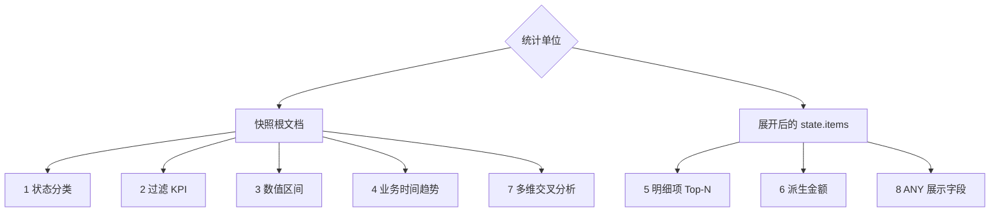

# 快照聚合

快照聚合以聚合的当前物化状态为事实来源，返回以 group 和 metric alias 为列名的动态表格行。公共 AST、别名、排序与结构限制见[聚合查询](./aggregation-query.md)；本页只说明如何把该合同应用到快照。

## 能力与入口

- **JVM Gateway**：通过 Spring 注入聚合级 `SnapshotQueryGateway<OrderState>`，构造 `AggregationQuery` 后调用 `query.query(snapshotQueryGateway)`。该 Bean 经 [QueryGateway](./query-gateway.md) 执行策略链；直接 Backend Factory 的绕过条件见[查询后端](./query-backend.md)。
- **HTTP / OpenAPI**：示例域已发布 `POST /sales-order/snapshot/aggregation`、`POST /tenant/{tenantId}/sales-order/snapshot/aggregation` 和 `POST /owner/{ownerId}/sales-order/snapshot/aggregation`。请求体是 `AggregationQuery` JSON，响应可协商 `application/json` 或 `text/event-stream`；准确路径与作用域参数以运行实例生成的 [OpenAPI](../open-api.md) 为准。
- **快照 API Client**：响应式与同步客户端分别使用独立的 `ReactiveSnapshotAggregationQueryApi` 和 `SynchronousSnapshotAggregationQueryApi`，不会合并进普通快照查询接口。依赖与调用方式见[通用 API Client 指南](./query-api-client.md)。

下面每个 HTTP JSON 都是上述 `snapshot/aggregation` 路由的请求体；结果只是代表性动态行，不是固定业务数据。

## 字段路径与统计单位

没有 `elements` 时，根 filter、group 和 metric 使用快照绝对逻辑路径，例如 `state.status`；一条记录是一份当前快照根文档。`state` 下的业务字段必须由 [Query Model Schema（当前说明）](./query-model-schema.md) 发布相应过滤、分组或数值能力。

调用 `expand("state.items")` 后，统计单位变为展开后的单个订单项。首个 Element 路径仍是绝对路径；它的 filter 以及后续 group、metric 和表达式字段都相对该元素，因此使用 `quantity`、`productId`、`price`，不能再写成 `state.items.quantity`。Group 只负责分桶，不改变统计单位；`COUNT` 始终统计当前最内层作用域。



## 场景 1：状态分类统计

**业务问题**

当前各订单状态分别有多少份快照？

**统计单位**

快照根文档；每份当前订单快照计数一次。

**Kotlin DSL**

```kotlin
val query = aggregation {
    terms("state.status", "status")
    count("count")
}
```

**HTTP JSON 与结果解读**

```json
{
  "groupBy": [
    {"type": "TERMS", "field": "state.status", "alias": "status"}
  ],
  "metrics": [
    {"type": "COUNT", "alias": "count"}
  ]
}
```

```json
[
  {"status": "PAID", "count": 42},
  {"status": "FAILED", "count": 8}
]
```

`status` 是分组列，`count` 是各组的快照数。`state.status` 必须具备 TERMS 聚合能力；例如 Elasticsearch 通常需要可聚合的 keyword 字段，不能把任意 text mapping 当作等价能力。

## 场景 2：过滤后的 KPI

**业务问题**

失败订单共有多少份，它们平均重试了多少次？

**统计单位**

满足 `state.status = FAILED` 的失败快照；没有 group，因此所有失败快照汇总成一行。

**Kotlin DSL**

```kotlin
val query = aggregation {
    filter { "state.status" eq "FAILED" }
    count("failedCount")
    avg("state.retryState.retries", "averageRetries")
}
```

**HTTP JSON 与结果解读**

```json
{
  "filter": {"op": "EQ", "field": "state.status", "value": "FAILED"},
  "metrics": [
    {"type": "COUNT", "alias": "failedCount"},
    {
      "type": "NUMERIC",
      "function": "AVG",
      "expression": {"type": "FIELD", "field": "state.retryState.retries"},
      "alias": "averageRetries"
    }
  ]
}
```

```json
[
  {"failedCount": 8, "averageRetries": 2.5}
]
```

`failedCount` 统计失败快照，`averageRetries` 只对参与计算的数值重试次数求平均；没有数值参与时该指标为 `null`。字段分别需要精确匹配与数值聚合能力。

## 场景 3：数值区间分布

**业务问题**

当前订单金额主要分布在哪些 100 元区间？

**统计单位**

快照根文档；每份当前订单快照进入一个金额桶。

**Kotlin DSL**

```kotlin
val query = aggregation {
    histogram("state.totalAmount", 100.0, "amountRange")
    count("orderCount")
}
```

**HTTP JSON 与结果解读**

```json
{
  "groupBy": [
    {
      "type": "HISTOGRAM",
      "field": "state.totalAmount",
      "alias": "amountRange",
      "interval": 100
    }
  ],
  "metrics": [
    {"type": "COUNT", "alias": "orderCount"}
  ]
}
```

```json
[
  {"amountRange": 0.0, "orderCount": 12},
  {"amountRange": 100.0, "orderCount": 27}
]
```

`amountRange` 是间隔为 `100` 的桶下界，`orderCount` 是桶内快照数。`state.totalAmount` 必须具备数值直方图能力；无效或非数值字段不能仅靠 JSON 形状变为可聚合字段。

## 场景 4：业务时间趋势

**业务问题**

按上海业务日观察当前订单的创建趋势。

**统计单位**

快照根文档；每份当前订单快照按业务字段 `state.createdAt` 落入一天。

**Kotlin DSL**

```kotlin
val query = aggregation {
    dateHistogram(
        "state.createdAt",
        AggregationDateUnit.DAY,
        "day",
        ZoneId.of("Asia/Shanghai"),
    )
    count("createdCount")
}
```

**HTTP JSON 与结果解读**

```json
{
  "groupBy": [
    {
      "type": "DATE_HISTOGRAM",
      "field": "state.createdAt",
      "alias": "day",
      "unit": "DAY",
      "timeZone": "Asia/Shanghai"
    }
  ],
  "metrics": [
    {"type": "COUNT", "alias": "createdCount"}
  ]
}
```

```json
[
  {"day": 1787846400000, "createdCount": 31},
  {"day": 1787932800000, "createdCount": 24}
]
```

`day` 是按 `Asia/Shanghai` 对齐的桶起点 epoch 毫秒，`createdCount` 是桶内快照数。`state.createdAt` 是订单状态定义的业务时间；根 `createTime` 是事件流记录字段，不属于 `MaterializedSnapshot` 快照根模型，不能在本场景中替代它。MongoDB 需证明 BSON Date 或已声明的数值 epoch，Elasticsearch 需证明 date/date_nanos 或已声明 epoch 的 runtime date 能力；格式化字符串不会只因 date pattern 自动获得日期分桶能力。

## 场景 5：明细项 Top-N

**业务问题**

已支付订单中，哪些商品的有效购买数量最高？

**统计单位**

展开后的订单项；只有根状态为 `PAID` 且元素 `quantity > 0` 的订单项参与统计。一个订单的多个明细分别计数和求和。

**Kotlin DSL**

```kotlin
val query = aggregation {
    filter { "state.status" eq "PAID" }
    expand("state.items") { "quantity" gt 0 }
    terms("productId", "productId")
    sum("quantity", "totalQuantity")
    sort { "totalQuantity".desc() }
    limit(10)
}
```

**HTTP JSON 与结果解读**

```json
{
  "filter": {"op": "EQ", "field": "state.status", "value": "PAID"},
  "elements": [
    {
      "path": "state.items",
      "filter": {"op": "GT", "field": "quantity", "value": 0}
    }
  ],
  "groupBy": [
    {"type": "TERMS", "field": "productId", "alias": "productId"}
  ],
  "metrics": [
    {
      "type": "NUMERIC",
      "function": "SUM",
      "expression": {"type": "FIELD", "field": "quantity"},
      "alias": "totalQuantity"
    }
  ],
  "sort": [
    {"field": "totalQuantity", "direction": "DESC"}
  ],
  "limit": 10
}
```

```json
[
  {"productId": "product-1", "totalQuantity": 96.0},
  {"productId": "product-2", "totalQuantity": 71.0}
]
```

排序引用指标 alias `totalQuantity`，`limit: 10` 才形成 Top-N。`state.items` 必须具备 Element scope；展开后 `productId` 与 `quantity` 都是元素相对路径。Elasticsearch 需要对应 nested mapping 才能保持同一订单项内字段的关联；HTTP 禁止高成本操作符时会拒绝 Elements 和按指标 alias 排序。

## 场景 6：派生金额指标

**业务问题**

每种商品在所有订单项中的净金额 `price × quantity - discount` 是多少？

**统计单位**

展开后的订单项；先为每个订单项计算派生金额，再按商品汇总。

**Kotlin DSL**

```kotlin
val query = aggregation {
    expand("state.items")
    terms("productId", "productId")
    sum(
        field("price") * field("quantity") - field("discount"),
        "netAmount",
    )
}
```

**HTTP JSON 与结果解读**

```json
{
  "elements": [
    {"path": "state.items"}
  ],
  "groupBy": [
    {"type": "TERMS", "field": "productId", "alias": "productId"}
  ],
  "metrics": [
    {
      "type": "NUMERIC",
      "function": "SUM",
      "expression": {
        "type": "BINARY",
        "operator": "SUBTRACT",
        "left": {
          "type": "BINARY",
          "operator": "MULTIPLY",
          "left": {"type": "FIELD", "field": "price"},
          "right": {"type": "FIELD", "field": "quantity"}
        },
        "right": {"type": "FIELD", "field": "discount"}
      },
      "alias": "netAmount"
    }
  ]
}
```

```json
[
  {"productId": "product-1", "netAmount": 1280.0},
  {"productId": "product-2", "netAmount": 930.0}
]
```

`netAmount` 是组内有效数值表达式贡献值的总和。三个操作数都相对单个订单项，并且必须具备数值聚合能力；HTTP `allow-expensive-operators=false` 时会拒绝这种非单 Field 表达式。

## 场景 7：多维交叉分析

**业务问题**

当前订单在“状态 × 渠道”两个维度上的数量如何分布？

**统计单位**

快照根文档；每份当前订单快照进入一个状态与渠道组合。

**Kotlin DSL**

```kotlin
val query = aggregation {
    terms("state.status", "status")
    terms("state.channel", "channel")
    count("count")
}
```

**HTTP JSON 与结果解读**

```json
{
  "groupBy": [
    {"type": "TERMS", "field": "state.status", "alias": "status"},
    {"type": "TERMS", "field": "state.channel", "alias": "channel"}
  ],
  "metrics": [
    {"type": "COUNT", "alias": "count"}
  ]
}
```

```json
[
  {"status": "PAID", "channel": "APP", "count": 28},
  {"status": "PAID", "channel": "WEB", "count": 14}
]
```

group 的声明顺序固定为 `status` 后 `channel`，结果行用两个 alias 表示交叉桶。两个字段都必须具备 TERMS 能力；组合数仍受查询 `limit` 和 HTTP 结果上限约束。

## 场景 8：分组展示字段

**业务问题**

按商品 ID 统计订单项数量，同时为每组补充一个商品名称用于展示。

**统计单位**

展开后的订单项；`lineCount` 统计每个商品组中的订单项数量，而不是订单快照数量。

**Kotlin DSL**

```kotlin
val query = aggregation {
    expand("state.items")
    terms("productId", "productId")
    any("name", "name")
    count("lineCount")
}
```

**HTTP JSON 与结果解读**

```json
{
  "elements": [
    {"path": "state.items"}
  ],
  "groupBy": [
    {"type": "TERMS", "field": "productId", "alias": "productId"}
  ],
  "metrics": [
    {"type": "ANY", "field": "name", "alias": "name"},
    {"type": "COUNT", "alias": "lineCount"}
  ]
}
```

```json
[
  {"productId": "product-1", "name": "Keyboard", "lineCount": 19},
  {"productId": "product-2", "name": "Mouse", "lineCount": 15}
]
```

`ANY` 只适合 `productId` 组内值稳定的展示字段。如果同一商品 ID 下存在多个 `name`，选中的非 null 值在不同执行或后端间不稳定；需要确定结果时，应修复业务数据或把名称建模为确定性 group key，而不是依赖 `ANY`。

## 后端能力与稳定性边界

- 快照查询默认追加 `DELETION = ACTIVE`；根 filter 先筛选快照，Element filter 再筛选展开后的单个元素。
- 逻辑字段能否用于精确匹配、范围、Element、TERMS、数值或时间聚合，由运行时 Query Model Schema 和所选 MongoDB / Elasticsearch mapping 共同证明；请求 DTO 合法不等于后端支持。
- HTTP 路由经 `SnapshotQueryGateway`、请求作用域重写和 `HttpQueryGuardFilter`。禁用高成本操作符时，Elements、按 metric alias 排序和算术表达式会被拒绝；进程内 JVM 调用不自动获得这组 HTTP 专用限制。
- Mask 字段仍可用于普通 filter、全文 search 与 sort；这些操作只决定匹配和顺序，不直接返回聚合值。任何 group、字段 metric 或算术 expression 引用 Mask 字段都会被 Schema 判为 `INCOMPATIBLE` 并拒绝，避免聚合结果泄漏原值；`COUNT` 不读取字段值，语义不变。
- MongoDB 与 Elasticsearch 共享公共 AST，但不承诺物理 pipeline、mapping、空值或桶细节完全一致。`ANY` 尤其不提供跨执行或跨后端稳定值。
- 自定义 `SnapshotQueryBackend` 必须实现聚合合同；数据查询路由可用或 OpenAPI 已发布，不能单独证明该 Backend 会执行聚合。
