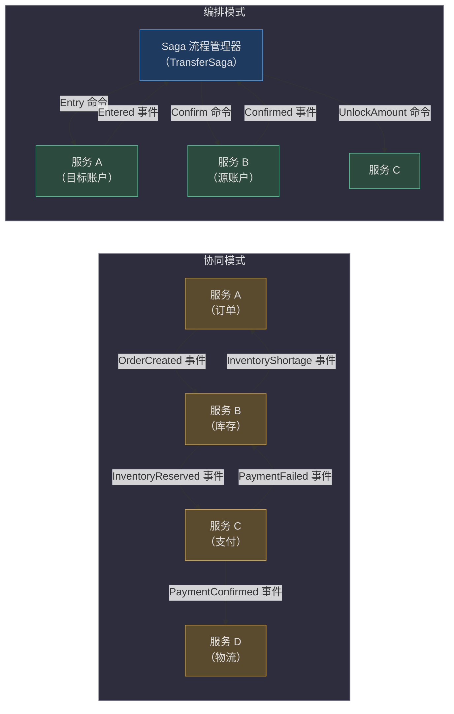
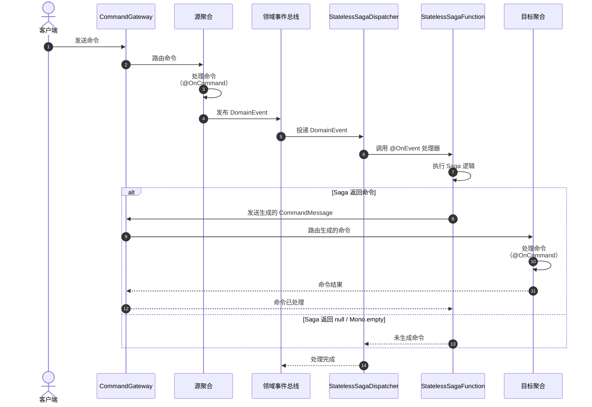
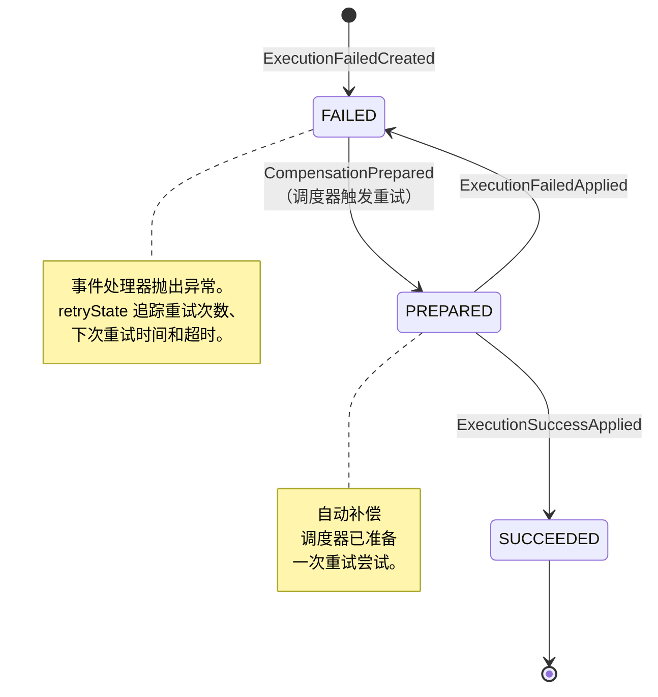
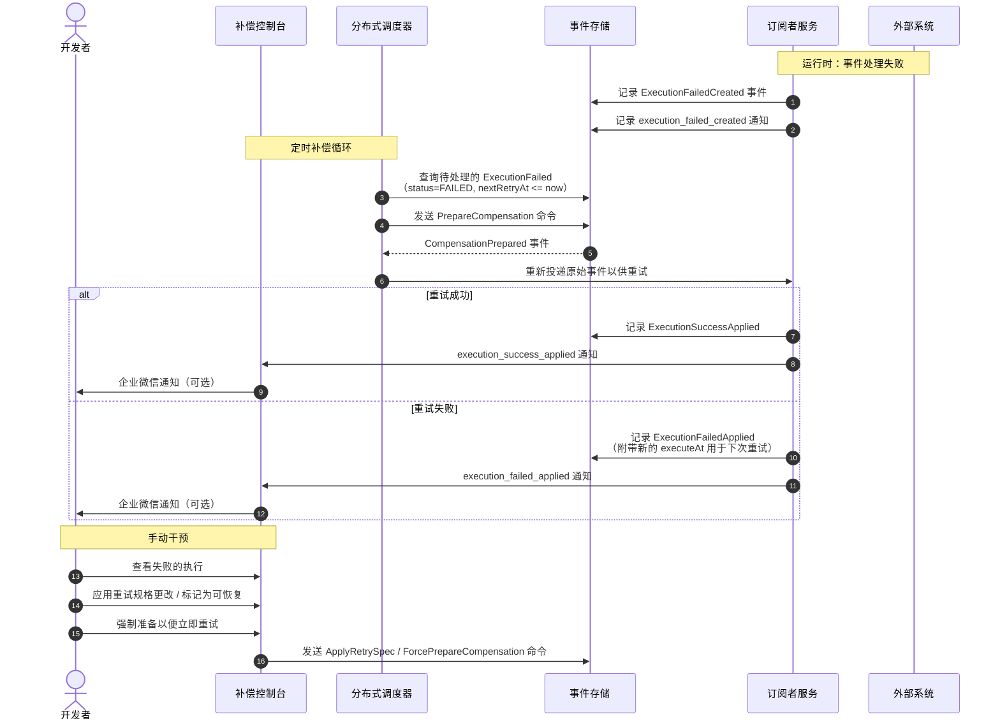

# 分布式事务（Saga）

在微服务架构中，单个业务操作可能跨越多个服务——每个服务都有自己的数据库。传统的 ACID 事务无法跨越服务边界。Saga 模式通过将分布式事务分解为一系列本地事务来解决这个问题，每个本地事务都有一个补偿操作，当后续步骤失败时可撤销其影响。

Wow 框架提供了基于**编排模式**的**无状态 Saga** 实现。它已在真实生产环境中经过三年以上的验证。无状态 Saga 更简单、更快，并且足以满足绝大多数用例。

## 概览一览

| 组件 | 职责 | 关键文件 | 源码 |
|---|---|---|---|
| `@StatelessSaga` | 将类标记为 Saga 流程管理器；触发自动发现 | `wow-api/src/main/kotlin/me/ahoo/wow/api/annotation/StatelessSaga.kt` | [StatelessSaga.kt:65-69](https://github.com/Ahoo-Wang/Wow/blob/main/wow-api/src/main/kotlin/me/ahoo/wow/api/annotation/StatelessSaga.kt#L65-L69) |
| `@OnEvent` | 将函数标记为领域事件处理器 | `wow-api/src/main/kotlin/me/ahoo/wow/api/annotation/OnEvent.kt` | [OnEvent.kt:62-79](https://github.com/Ahoo-Wang/Wow/blob/main/wow-api/src/main/kotlin/me/ahoo/wow/api/annotation/OnEvent.kt#L62-L79) |
| `@OnStateEvent` | 将函数标记为状态感知的事件处理器 | `wow-api/src/main/kotlin/me/ahoo/wow/api/annotation/OnStateEvent.kt` | [OnStateEvent.kt:66-81](https://github.com/Ahoo-Wang/Wow/blob/main/wow-api/src/main/kotlin/me/ahoo/wow/api/annotation/OnStateEvent.kt#L66-L81) |
| `@Retry` | 配置带指数退避的重试行为 | `wow-api/src/main/kotlin/me/ahoo/wow/api/annotation/Retry.kt` | [Retry.kt:73-100](https://github.com/Ahoo-Wang/Wow/blob/main/wow-api/src/main/kotlin/me/ahoo/wow/api/annotation/Retry.kt#L73-L100) |
| `StatelessSagaFunction` | 包装 Saga 处理器；将事件结果转换为通过 `CommandGateway` 发送的命令 | `wow-core/src/main/kotlin/me/ahoo/wow/saga/stateless/StatelessSagaFunction.kt` | [StatelessSagaFunction.kt:42-109](https://github.com/Ahoo-Wang/Wow/blob/main/wow-core/src/main/kotlin/me/ahoo/wow/saga/stateless/StatelessSagaFunction.kt#L42-L109) |
| `StatelessSagaDispatcher` | 将领域事件路由到已注册的 Saga 函数的事件分发器 | `wow-core/src/main/kotlin/me/ahoo/wow/saga/stateless/StatelessSagaDispatcher.kt` | [StatelessSagaDispatcher.kt:36-56](https://github.com/Ahoo-Wang/Wow/blob/main/wow-core/src/main/kotlin/me/ahoo/wow/saga/stateless/StatelessSagaDispatcher.kt#L36-L56) |
| `StatelessSagaHandler` | 将过滤器链应用于领域事件交换；出错时记录日志并恢复 | `wow-core/src/main/kotlin/me/ahoo/wow/saga/stateless/StatelessSagaHandler.kt` | [StatelessSagaHandler.kt:36-43](https://github.com/Ahoo-Wang/Wow/blob/main/wow-core/src/main/kotlin/me/ahoo/wow/saga/stateless/StatelessSagaHandler.kt#L36-L43) |
| `StatelessSagaFunctionRegistrar` | 通过解析 `@StatelessSaga` 元数据注册 Saga 函数 | `wow-core/src/main/kotlin/me/ahoo/wow/saga/stateless/StatelessSagaFunctionRegistrar.kt` | [StatelessSagaFunctionRegistrar.kt:34-55](https://github.com/Ahoo-Wang/Wow/blob/main/wow-core/src/main/kotlin/me/ahoo/wow/saga/stateless/StatelessSagaFunctionRegistrar.kt#L34-L55) |
| `ExecutionFailed` | 追踪和重试失败执行事件的聚合根 | `compensation/wow-compensation-domain/src/main/kotlin/me/ahoo/wow/compensation/domain/ExecutionFailed.kt` | [ExecutionFailed.kt:37-138](https://github.com/Ahoo-Wang/Wow/blob/main/compensation/wow-compensation-domain/src/main/kotlin/me/ahoo/wow/compensation/domain/ExecutionFailed.kt#L37-L138) |
| `SagaSpec` | 使用 Given-When-Expect 模式进行 Saga 单元测试的测试 DSL | `test/wow-test/src/main/kotlin/me/ahoo/wow/test/SagaSpec.kt` | [SagaSpec.kt:69-106](https://github.com/Ahoo-Wang/Wow/blob/main/test/wow-test/src/main/kotlin/me/ahoo/wow/test/SagaSpec.kt#L69-L106) |

## 编排模式 vs. 协同模式

Saga 模式有两种主要的实现风格：**编排模式**（集中式流程管理器）和**协同模式**（去中心化的事件交换）。Wow 框架实现了编排模式，但理解两者都至关重要。



<!-- Sources: wow-api/src/main/kotlin/me/ahoo/wow/api/annotation/StatelessSaga.kt:65-69 (orchestration annotation), wow-api/src/main/kotlin/me/ahoo/wow/api/annotation/OnEvent.kt:62-79 (event handler annotation) -->

关键区别：**编排模式**引入了一个了解整个工作流的中心协调器。在 Wow 中，这是一个标注了 `@StatelessSaga` 的类。它监听领域事件并发送命令作为响应。**协同模式**将工作流逻辑分布在参与者之间，参与者直接观察彼此的事件。

## 无状态 Saga 的工作原理

Wow 中的无状态 Saga 订阅由聚合发布的领域事件。当事件到达时，Saga 方法执行并可以返回命令，这些命令会自动发送到命令总线。框架处理所有管线工作——事件路由、命令构建、消息传播和错误处理。



<!-- Sources: wow-core/src/main/kotlin/me/ahoo/wow/saga/stateless/StatelessSagaFunction.kt:42-109 (saga function wraps delegate, sends commands via gateway), wow-core/src/main/kotlin/me/ahoo/wow/saga/stateless/StatelessSagaDispatcher.kt:36-56 (dispatcher routes events to saga functions), wow-core/src/main/kotlin/me/ahoo/wow/saga/stateless/StatelessSagaHandler.kt:36-43 (handler applies filter chain with error handling) -->

### 内部管道

1. **元数据解析**（`StatelessSagaMetadataParser`）：在注册时，框架扫描标注了 `@StatelessSaga` 的类，并识别标注了 `@OnEvent` / `@OnStateEvent` 的方法作为事件处理器。参见 [StatelessSagaMetadataParser.kt:30-32](https://github.com/Ahoo-Wang/Wow/blob/main/wow-core/src/main/kotlin/me/ahoo/wow/saga/annotation/StatelessSagaMetadataParser.kt#L30-L32)。

2. **函数注册**（`StatelessSagaFunctionRegistrar`）：每个处理器被包装在一个 `StatelessSagaFunction` 中，增加了命令网关能力。注册器解析 Saga 元数据并创建 `StatelessSagaFunction` 实例。参见 [StatelessSagaFunctionRegistrar.kt:48-54](https://github.com/Ahoo-Wang/Wow/blob/main/wow-core/src/main/kotlin/me/ahoo/wow/saga/stateless/StatelessSagaFunctionRegistrar.kt#L48-L54)。

3. **事件分发**（`StatelessSagaDispatcher`）：当领域事件发布时，分发器将其匹配到已注册的 Saga 函数并调用处理器链。参见 [StatelessSagaDispatcher.kt:36-56](https://github.com/Ahoo-Wang/Wow/blob/main/wow-core/src/main/kotlin/me/ahoo/wow/saga/stateless/StatelessSagaDispatcher.kt#L36-L56)。

4. **命令生成**（`StatelessSagaFunction`）：Saga 逻辑运行并返回结果。如果结果是命令体、`CommandBuilder` 或 `CommandMessage`，框架构建适当的命令消息——从源事件传播租户 ID、请求 ID 和追踪上下文。命令通过 `CommandGateway` 发送。参见 [StatelessSagaFunction.kt:57-68](https://github.com/Ahoo-Wang/Wow/blob/main/wow-core/src/main/kotlin/me/ahoo/wow/saga/stateless/StatelessSagaFunction.kt#L57-L68)。

5. **命令流**（`CommandStream`）：每个领域事件可以产生 0..N 个命令。命令被收集到一个 `DefaultCommandStream` 中，存储在事件交换属性中，键为 `__COMMAND_STREAM__`。参见 [CommandStream.kt:22-31](https://github.com/Ahoo-Wang/Wow/blob/main/wow-core/src/main/kotlin/me/ahoo/wow/saga/stateless/CommandStream.kt#L22-L31) 和 [ExchangeCommandStream.kt:17-38](https://github.com/Ahoo-Wang/Wow/blob/main/wow-core/src/main/kotlin/me/ahoo/wow/saga/stateless/ExchangeCommandStream.kt#L17-L38)。

## 定义 Saga

Saga 类用 `@StatelessSaga` 标记，并包含事件处理器方法。每个处理器的返回类型决定了接下来会发生什么：

| 处理器返回类型 | 行为 |
|---|---|
| `null` | 不生成命令 |
| 命令体（如 `Entry`） | 命令体被包装为 `CommandMessage` 并发送到命令总线 |
| `CommandBuilder` | Builder 用于构造 `CommandMessage`（允许自定义聚合 ID、租户 ID 等） |
| `CommandMessage<*>` | 预构建的命令消息直接发送 |
| 上述任何类型的 `Iterable` | 每个元素按上述方式处理（每个事件最多 N 个命令） |
| `Mono<Void>` / `Mono.empty()` | 响应式空操作——不生成命令 |

### 示例：银行转账 Saga（Java）

转账 Saga 编排了一个两步过程：（1）将转账金额存入目标账户，（2）在源账户上确认转账。如果存入失败，则解锁源账户的资金。

<!-- Source: example/transfer/example-transfer-domain/src/main/java/me/ahoo/wow/example/transfer/domain/TransferSaga.java:20-34 -->

```java
@StatelessSaga
public class TransferSaga {

    Entry onEvent(Prepared prepared, AggregateId aggregateId) {
        return new Entry(prepared.to(), aggregateId.getId(), prepared.amount());
    }

    Confirm onEvent(AmountEntered amountEntered) {
        return new Confirm(amountEntered.sourceId(), amountEntered.amount());
    }

    UnlockAmount onEvent(EntryFailed entryFailed) {
        return new UnlockAmount(entryFailed.sourceId(), entryFailed.amount());
    }
}
```

**工作原理**：当源账户发布 `Prepared` 事件（资金已被锁定）时，Saga 为目标账户生成 `Entry` 命令（存入）。如果目标账户响应 `AmountEntered`，Saga 通过 `Confirm` 命令确认源账户转账。如果存入失败（`EntryFailed`），Saga 通过发送 `UnlockAmount` 命令来补偿，释放锁定的资金。

### 示例：购物车清理 Saga（带重试，Kotlin）

这个 Saga 在订单创建后从购物车中移除商品——但仅当订单是从购物车发起的。它使用 `@Retry` 实现弹性，并使用 `@OnEvent` 进行显式处理器命名。

<!-- Source: example/example-domain/src/main/kotlin/me/ahoo/wow/example/domain/cart/CartSaga.kt:25-43 -->

```kotlin
@StatelessSaga
class CartSaga {

    @Retry(maxRetries = 5, minBackoff = 60, executionTimeout = 10)
    @OnEvent
    fun onOrderCreated(event: DomainEvent<OrderCreated>): CommandBuilder? {
        val orderCreated = event.body
        if (!orderCreated.fromCart) {
            return null
        }
        return RemoveCartItem(
            productIds = orderCreated.items.map { it.productId }.toSet(),
        ).commandBuilder()
            .aggregateId(event.ownerId)
    }
}
```

**展示的关键模式：**
- **条件命令生成**：当订单非来自购物车时返回 `null`——不发送命令。
- **`DomainEvent<T>` 参数**：除了事件体外，还可访问事件元数据（`ownerId`、`aggregateId`、`tenantId`）。
- **`CommandBuilder` 返回**：允许对目标聚合 ID（此处为购物车所有者的 ID）进行精细控制。
- **`@Retry` 注解**：配置最多 5 次重试，60 秒初始退避，10 秒执行超时。

## 事件补偿

Saga 处理器可能由于瞬时网络问题、下游服务不可用或意外异常而失败。Wow 框架提供了内置的**事件补偿**机制，追踪失败执行并以指数退避自动重试。

### 补偿状态机

每个失败的执行被追踪为一个 `ExecutionFailed` 聚合，在其状态之间转换：



<!-- Sources: compensation/wow-compensation-domain/src/main/kotlin/me/ahoo/wow/compensation/domain/ExecutionFailedState.kt:35-100 (state sourcing handlers), compensation/wow-compensation-domain/src/main/kotlin/me/ahoo/wow/compensation/domain/ExecutionFailed.kt:37-138 (aggregate command handlers) -->

状态转换在 `ExecutionFailed` 聚合上作为 `@OnCommand` 处理器实现。每个处理器验证前置条件——例如，仅当 `canRetry()` 返回 true 时才允许重新准备，仅当状态为 `PREPARED` 时才允许应用失败结果。参见 [ExecutionFailed.kt:61-65](https://github.com/Ahoo-Wang/Wow/blob/main/compensation/wow-compensation-domain/src/main/kotlin/me/ahoo/wow/compensation/domain/ExecutionFailed.kt#L61-L65) 了解前置条件检查。

### 指数退避重试策略

`NextRetryAtCalculator` 使用指数退避计算下次重试时间。公式为：

```
nextRetryAt = currentTime + (minBackoff * 2^retries * 1000) 毫秒
```

每次重试都有一个 `timeoutAt`，计算公式为 `currentTime + executionTimeout * 1000` 毫秒。超过此超时将标记重试为失败。参见 [NextRetryAtCalculator.kt:20-44](https://github.com/Ahoo-Wang/Wow/blob/main/compensation/wow-compensation-domain/src/main/kotlin/me/ahoo/wow/compensation/domain/NextRetryAtCalculator.kt#L20-L44)。

### 事件补偿仪表板

Wow 框架提供了一个功能齐全的补偿控制台——本身也是基于 Wow 框架构建的。该控制台提供可视化仪表板、自动化分布式调度以及企业微信通知。



<!-- Sources: compensation/wow-compensation-domain/src/main/kotlin/me/ahoo/wow/compensation/domain/ExecutionFailed.kt:37-138 (aggregate command handlers for all compensation states), compensation/wow-compensation-domain/src/main/kotlin/me/ahoo/wow/compensation/domain/ExecutionFailedState.kt:35-100 (state transitions) -->

补偿仪表板允许开发人员：
- 按状态（FAILED、PREPARED、SUCCEEDED）查询失败的执行
- 通过**强制准备**手动触发重试
- 通过**应用重试规格**修改重试参数（最大重试次数、退避、超时）
- 将执行标记为可恢复/不可恢复
- 清除不再需要的执行
- 使用 OpenAPI 接口进行编程集成

## 配置

### Saga 配置

Saga 共享事件处理基础设施。主要配置通过注解完成：

| 设置 | 注解/属性 | 默认值 | 描述 | 源码 |
|---|---|---|---|---|
| Saga 发现 | `@StatelessSaga` | N/A | 由 `StatelessSagaFunctionRegistrar` 自动发现 | [StatelessSagaFunctionRegistrar.kt:34-55](https://github.com/Ahoo-Wang/Wow/blob/main/wow-core/src/main/kotlin/me/ahoo/wow/saga/stateless/StatelessSagaFunctionRegistrar.kt#L34-L55) |
| 事件处理器 | `@OnEvent` | 方法名 `onEvent` | 响应领域事件 | [OnEvent.kt:62-79](https://github.com/Ahoo-Wang/Wow/blob/main/wow-api/src/main/kotlin/me/ahoo/wow/api/annotation/OnEvent.kt#L62-L79) |
| 状态感知处理器 | `@OnStateEvent` | 方法名 `onStateEvent` | 响应状态变更事件 | [OnStateEvent.kt:66-81](https://github.com/Ahoo-Wang/Wow/blob/main/wow-api/src/main/kotlin/me/ahoo/wow/api/annotation/OnStateEvent.kt#L66-L81) |
| 分发器并行度 | `MessageParallelism.DEFAULT_PARALLELISM` | 框架默认值 | 并行消息处理线程数 | [StatelessSagaDispatcher.kt:41](https://github.com/Ahoo-Wang/Wow/blob/main/wow-core/src/main/kotlin/me/ahoo/wow/saga/stateless/StatelessSagaDispatcher.kt#L41) |

### 重试配置

`@Retry` 注解提供了在每个处理器上对补偿行为的精细控制：

| 设置 | 属性 | 默认值 | 描述 |
|---|---|---|---|
| 启用/禁用 | `enabled` | `true` | 设置 `@Retry(enabled = false)` 以对特定处理器选择退出补偿 |
| 最大重试次数 | `maxRetries` | `10` | 放弃之前的最多重试次数 |
| 最小退避 | `minBackoff` | `180` 秒 | 初始退避时长；指数增长（`minBackoff * 2^retries`） |
| 执行超时 | `executionTimeout` | `120` 秒 | 每次执行尝试的最大允许时间 |
| 可恢复异常 | `recoverable` | `[]`（空） | 应触发重试的异常类型 |
| 不可恢复异常 | `unrecoverable` | `[]`（空） | 应立即失败而不重试的异常类型 |

参见 [Retry.kt:73-100](https://github.com/Ahoo-Wang/Wow/blob/main/wow-api/src/main/kotlin/me/ahoo/wow/api/annotation/Retry.kt#L73-L100) 了解注解定义。

### 补偿配置

补偿默认启用。全局禁用：

```yaml
wow:
  compensation:
    enabled: false
```

仪表板通知（企业微信）：

```yaml
wow:
  compensation:
    host: https://your-dashboard.example.com
    webhook:
      weixin:
        url: https://qyapi.weixin.qq.com/cgi-bin/webhook/send?key=YOUR_KEY
        events:
          - execution_failed_created
          - execution_failed_applied
          - execution_success_applied
```

## 单元测试

Wow 框架提供了两种测试 Saga 的方法：**`SagaSpec`** 基类（JUnit 5 `@TestFactory`）和 **`SagaVerifier`** 流式 API。

### SagaSpec（推荐）

`SagaSpec<T>` 是一个测试基类，从 DSL 规格生成动态 JUnit 5 测试。使用 Given-When-Expect 模式：

1. **Given**：定义领域事件（输入）
2. **When**：调用 `whenEvent(event)` 以调用 Saga
3. **Expect**：使用 `expectCommandType`、`expectCommandBody`、`expectNoCommand` 等断言生成的命令

<!-- Source: test/wow-test/src/main/kotlin/me/ahoo/wow/test/SagaSpec.kt:69-106 -->

```kotlin
class TransferSagaSpec : SagaSpec<TransferSaga>({
    on {
        val prepared = Prepared("to", 1)
        whenEvent(prepared) {
            expectNoError()
            expectCommandType(Entry::class)
            expectCommandBody<Entry> {
                id.assert().isEqualTo(prepared.to)
                amount.assert().isEqualTo(prepared.amount)
            }
        }
    }
    on {
        val amountEntered = AmountEntered("sourceId", 1)
        whenEvent(amountEntered) {
            expectNoError()
            expectCommandType(Confirm::class)
            expectCommandBody<Confirm> {
                id.assert().isEqualTo(amountEntered.sourceId)
                amount.assert().isEqualTo(amountEntered.amount)
            }
        }
    }
    on {
        val entryFailed = EntryFailed("sourceId", 1)
        whenEvent(entryFailed) {
            expectCommandType(UnlockAmount::class)
            expectCommandBody<UnlockAmount> {
                id.assert().isEqualTo(entryFailed.sourceId)
                amount.assert().isEqualTo(entryFailed.amount)
            }
        }
    }
})
```

**测试条件命令生成。**当条件不满足时，Saga 可以返回 `null`——使用 `expectNoCommand()` 断言：

<!-- Source: example/example-domain/src/test/kotlin/me/ahoo/wow/example/domain/cart/CartSagaSpec.kt:26-76 -->

```kotlin
class CartSagaSpec : SagaSpec<CartSaga>({
    on {
        val ownerId = generateGlobalId()
        whenEvent(
            event = mockk<OrderCreated> {
                every { items } returns listOf(orderItem)
                every { fromCart } returns true
            },
            ownerId = ownerId
        ) {
            expectCommandType(RemoveCartItem::class)
            expectCommand<RemoveCartItem> {
                aggregateId.id.assert().isEqualTo(ownerId)
                body.productIds.assert().hasSize(1)
            }
        }
    }
    on {
        name("NotFromCart")
        whenEvent(
            event = mockk<OrderCreated> {
                every { fromCart } returns false
            },
            ownerId = generateGlobalId()
        ) {
            expectNoCommand()
        }
    }
})
```

### SagaVerifier（流式 API）

对于编程式测试，`SagaVerifier` 提供了流式构建器：

```kotlin
SagaVerifier.sagaVerifier<OrderSaga>()
    .whenEvent(mockOrderCreatedEvent)
    .expectNoCommand()
    .verify()
```

验证器预配置了内存命令总线、测试验证器和空操作幂等性检查器，用于隔离测试。参见 [SagaVerifier.kt:59-182](https://github.com/Ahoo-Wang/Wow/blob/main/test/wow-test/src/main/kotlin/me/ahoo/wow/test/SagaVerifier.kt#L59-L182)。

### 可用的测试断言

| 断言 | 描述 |
|---|---|
| `expectNoError()` | 验证 Saga 执行期间未抛出异常 |
| `expectCommandType(T::class)` | 验证至少生成了一个给定类型的命令 |
| `expectCommandBody<T>(block)` | 访问命令体以进行详细的字段级断言 |
| `expectCommand<T>(block)` | 访问完整的 `CommandMessage`（包括 `aggregateId`、headers） |
| `expectNoCommand()` | 验证 Saga 返回了 `null`（未生成命令） |
| `name("Description")` | 为测试场景分配一个可读的名称 |

## 编排模式 vs. 协同模式：对比

| 方面 | 编排模式（Wow） | 协同模式 |
|---|---|---|
| **控制** | 集中在 Saga 流程管理器中 | 分布在参与者之间 |
| **可见性** | 单个类展示整个工作流 | 逻辑分散在多个服务中 |
| **耦合** | Saga 依赖参与者；参与者不知道 Saga | 参与者依赖彼此的事件 |
| **循环依赖** | 不可能——Saga 单向依赖参与者 | 存在循环事件链的风险 |
| **测试** | 简单——使用 `SagaSpec` 隔离测试 Saga | 需要所有参与者运行 |
| **添加步骤** | 在 Saga 类中添加处理器方法 | 修改多个服务 |
| **复杂度** | Saga 类随工作流复杂度增长 | 每个服务的逻辑独立增长 |
| **维护成本** | 一个额外组件（Saga） | 无额外组件，但更难推理 |
| **Wow 中的实现** | `@StatelessSaga` + `@OnEvent` 方法 | N/A（Wow 使用编排模式） |

## 等待计划集成

命令网关的 `CommandWaitChain` 策略使客户端能够等待**整个 Saga 链**完成后再接收响应。这对于分布式操作中的端到端请求-响应语义特别有用。

例如，发起银行转账的客户端可以等待 Saga 处理完 `Prepared` 事件（在 Saga 处理器上等待 `SAGA_HANDLED`）且结果目标账户命令已完全处理（在尾部等待 `SNAPSHOT`）。

```http
POST /account/sourceId/prepare
Command-Wait-Stage: SAGA_HANDLED
Command-Wait-Tail-Stage: SNAPSHOT
Command-Wait-Tail-Processor: TransferSaga
```

这保证了当 HTTP 响应返回时，整个分布式转账工作流——源账户锁定、Saga 协调、目标账户存入和快照——已完成。参见[命令网关](command-gateway.md)页面了解完整详情。

## 相关页面

| 页面 | 描述 |
|---|---|
| [事件补偿](event-compensation.md) | 完整的补偿生命周期、仪表板 UI、部署和 OpenAPI |
| [命令网关](command-gateway.md) | 命令发送、等待计划以及用于 Saga 感知等待的 `CommandWaitChain` |
| [事件处理器](event-processor.md) | 非 Saga 用例的通用事件处理 |
| [建模](modeling.md) | 使用聚合、命令和事件的领域建模 |
| [测试套件](test-suite.md) | 包括 `AggregateSpec` 和 `SagaSpec` 的测试 DSL |
