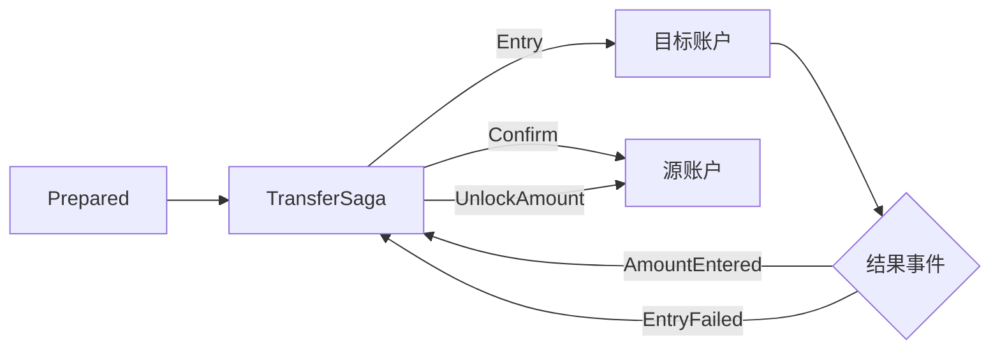
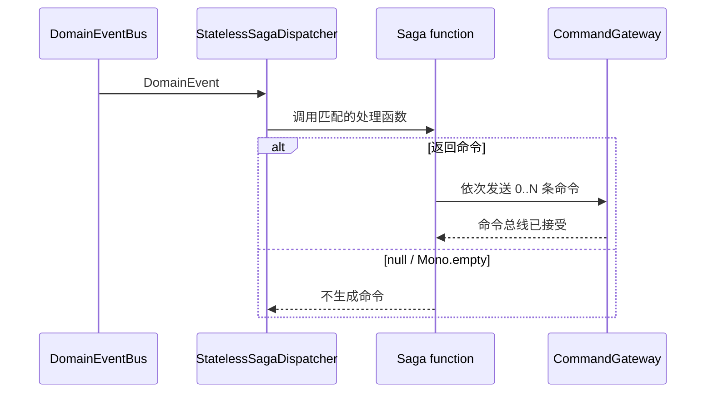
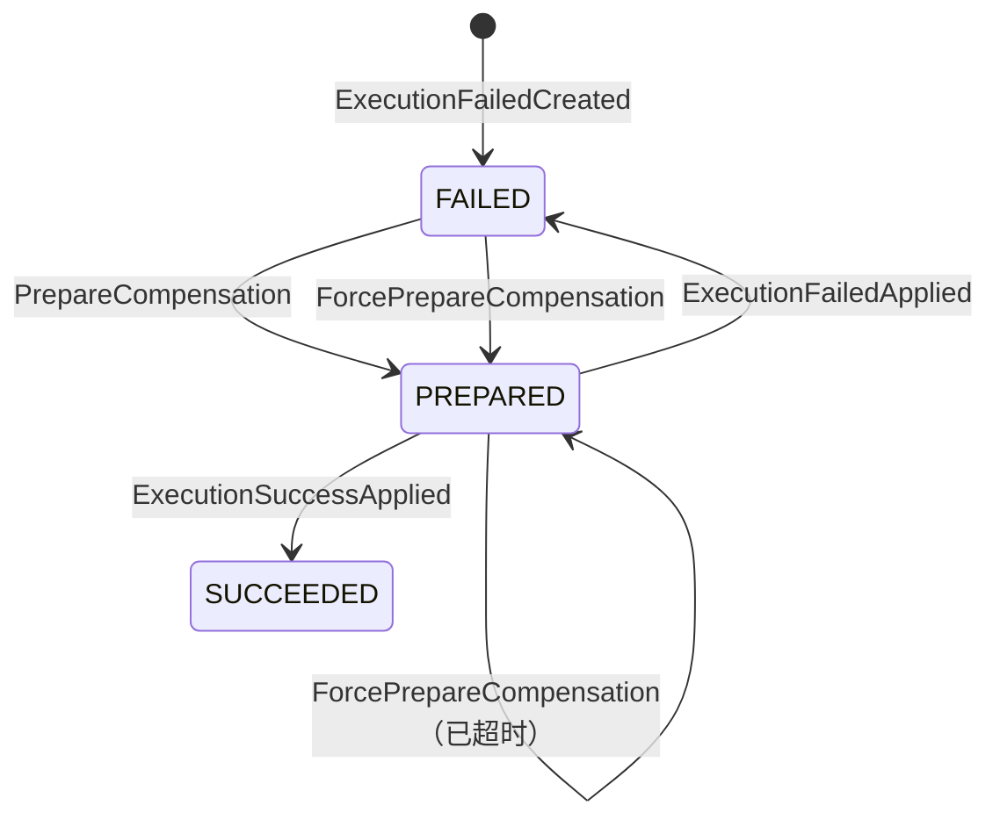

# 分布式事务（Saga）

Wow 的 `@StatelessSaga` 是一个**无状态编排器**：它接收领域事件或状态事件，并生成下一步命令。每条命令仍由目标聚合在自己的本地事务中处理；Saga 不创建跨服务 ACID 事务。

:::warning 边界
Saga 中的 `UnlockAmount` 等命令是显式的**业务补偿**。它们不会回滚数据库，也不会删除已经提交的领域事件。处理器失败后的重新投递属于[事件补偿](event-compensation.md)，是另一套恢复机制。
:::

## 概览一览

| 能力 | 用途 | 当前契约 |
| --- | --- | --- |
| [`@StatelessSaga`](https://github.com/Ahoo-Wang/Wow/blob/main/wow-api/src/main/kotlin/me/ahoo/wow/api/annotation/StatelessSaga.kt) | 注册无状态流程编排器 | 处理器不保存流程实例状态 |
| [`@OnEvent`](https://github.com/Ahoo-Wang/Wow/blob/main/wow-api/src/main/kotlin/me/ahoo/wow/api/annotation/OnEvent.kt) / [`@OnStateEvent`](https://github.com/Ahoo-Wang/Wow/blob/main/wow-api/src/main/kotlin/me/ahoo/wow/api/annotation/OnStateEvent.kt) | 声明领域事件或带状态事件处理函数 | 也支持约定方法名 `onEvent` / `onStateEvent` |
| [`StatelessSagaFunction`](https://github.com/Ahoo-Wang/Wow/blob/main/wow-core/src/main/kotlin/me/ahoo/wow/saga/stateless/StatelessSagaFunction.kt) 返回值 | 生成 0..N 条命令 | 支持命令体、`CommandBuilder`、`CommandMessage`、`Iterable` 与响应式结果 |
| [`@Retry`](https://github.com/Ahoo-Wang/Wow/blob/main/wow-api/src/main/kotlin/me/ahoo/wow/api/annotation/Retry.kt) | 描述失败记录的持久化补偿策略 | 不是 Saga 步骤定义，也不是运行时即时重试次数 |
| [`SagaSpec`](https://github.com/Ahoo-Wang/Wow/blob/main/test/wow-test/src/main/kotlin/me/ahoo/wow/test/SagaSpec.kt) | 隔离验证“事件 -> 命令” | 覆盖正常、条件不匹配和补偿命令分支 |

## 编排模式 vs. 协同模式

编排模式把跨聚合流程集中在 Saga；协同模式让参与方分别订阅彼此事件。Wow 提供的是前者：参与聚合只维护自己的命令和事件，Saga 决定收到某个事件后发送什么命令。


```mermaid
flowchart LR
    P[Prepared] --> S[TransferSaga]
    S -->|Entry| T[目标账户]
    T --> E{结果事件}
    E -->|AmountEntered| S
    S -->|Confirm| O[源账户]
    E -->|EntryFailed| S
    S -->|UnlockAmount| O
```

`EntryFailed -> UnlockAmount` 是业务设计中的反向动作。即使它成功，原来的 `Prepared` 和 `EntryFailed` 事件仍然保留。

## 无状态 Saga 的工作原理


```mermaid
sequenceDiagram
    participant Bus as DomainEventBus
    participant Dispatcher as StatelessSagaDispatcher
    participant Saga as Saga function
    participant Gateway as CommandGateway
    Bus->>Dispatcher: DomainEvent
    Dispatcher->>Saga: 调用匹配的处理函数
    alt 返回命令
        Saga->>Gateway: 依次发送 0..N 条命令
        Gateway-->>Saga: 命令总线已接受
    else null / Mono.empty
        Saga-->>Dispatcher: 不生成命令
    end
```

Saga 处理完成只表示处理函数完成，并且生成的命令已由 `CommandGateway.send` 发送。它不表示目标命令已经执行，更不表示整个业务流程已经完成。

### 内部管道

1. [`StatelessSagaMetadataParser`](https://github.com/Ahoo-Wang/Wow/blob/main/wow-core/src/main/kotlin/me/ahoo/wow/saga/annotation/StatelessSagaMetadataParser.kt) 解析元数据，[`StatelessSagaFunctionRegistrar`](https://github.com/Ahoo-Wang/Wow/blob/main/wow-core/src/main/kotlin/me/ahoo/wow/saga/stateless/StatelessSagaFunctionRegistrar.kt) 注册事件函数。
2. [`StatelessSagaDispatcher`](https://github.com/Ahoo-Wang/Wow/blob/main/wow-core/src/main/kotlin/me/ahoo/wow/saga/stateless/StatelessSagaDispatcher.kt) 为每个匹配函数创建事件交换对象，并由 [`StatelessSagaHandler`](https://github.com/Ahoo-Wang/Wow/blob/main/wow-core/src/main/kotlin/me/ahoo/wow/saga/stateless/StatelessSagaHandler.kt) 执行过滤器链。
3. [`StatelessSagaFunction`](https://github.com/Ahoo-Wang/Wow/blob/main/wow-core/src/main/kotlin/me/ahoo/wow/saga/stateless/StatelessSagaFunction.kt) 将返回值转换并按顺序发送；结果记录为 [`CommandStream`](https://github.com/Ahoo-Wang/Wow/blob/main/wow-core/src/main/kotlin/me/ahoo/wow/saga/stateless/CommandStream.kt)，并通过 [`ExchangeCommandStream`](https://github.com/Ahoo-Wang/Wow/blob/main/wow-core/src/main/kotlin/me/ahoo/wow/saga/stateless/ExchangeCommandStream.kt) 关联到事件交换。
4. 未显式提供请求 ID 时，生成命令使用 `${domainEvent.id}-${index}`；显式请求 ID 保持不变，见[请求 ID 测试](https://github.com/Ahoo-Wang/Wow/blob/main/wow-core/src/test/kotlin/me/ahoo/wow/saga/stateless/StatelessSagaFunctionRequestIdTest.kt)。
5. 处理函数或命令发送失败后，错误先经过 [`RetryableFilter`](https://github.com/Ahoo-Wang/Wow/blob/main/wow-core/src/main/kotlin/me/ahoo/wow/messaging/handler/RetryableFilter.kt)；仍失败时，启用的[事件补偿过滤器](https://github.com/Ahoo-Wang/Wow/blob/main/compensation/wow-compensation-core/src/main/kotlin/me/ahoo/wow/compensation/core/CompensationFilter.kt)才记录持久化失败。

确定性的请求 ID 让同一事件、同一命令顺序的重放能够与命令网关的幂等检查配合。它不替代处理器对数据库外副作用的幂等设计，也要求重放时不要随意改变命令顺序。

## 定义 Saga

处理函数可以返回命令体、`CommandBuilder`、预构造的 `CommandMessage`、它们的 `Iterable`，或返回空结果。使用 `CommandBuilder` 可以显式选择目标聚合 ID；框架会补齐缺失的传播信息。

| 返回值 | 结果 |
| --- | --- |
| `null` / `Mono.empty()` | 不发送命令 |
| 命令体 | 转换为 `CommandMessage` 后发送 |
| `CommandBuilder` | 使用 Builder 中的目标与自定义字段创建命令 |
| `CommandMessage<*>` | 保留命令本身，并传播上游 Header |
| `Iterable<*>` | 按顺序转换并发送多条命令 |

### 示例：银行转账 Saga（Java）

```java
@StatelessSaga
public class TransferSaga {

    Entry onEvent(Prepared prepared, AggregateId aggregateId) {
        return new Entry(prepared.to(), aggregateId.getId(), prepared.amount());
    }

    Confirm onEvent(AmountEntered amountEntered) {
        return new Confirm(amountEntered.sourceId(), amountEntered.amount());
    }

    UnlockAmount onEvent(EntryFailed entryFailed) {
        return new UnlockAmount(entryFailed.sourceId(), entryFailed.amount());
    }
}
```

正常路径是 `Prepared -> Entry -> AmountEntered -> Confirm`；失败路径是 `EntryFailed -> UnlockAmount`。[`TransferSaga`](https://github.com/Ahoo-Wang/Wow/blob/main/example/transfer/example-transfer-domain/src/main/java/me/ahoo/wow/example/transfer/domain/TransferSaga.java) 及其 [`TransferSagaSpec`](https://github.com/Ahoo-Wang/Wow/blob/main/example/transfer/example-transfer-domain/src/test/kotlin/me/ahoo/wow/example/transfer/domain/TransferSagaSpec.kt)分别实现并验证这些分支。

### 示例：购物车清理 Saga（带重试，Kotlin）

```kotlin
@StatelessSaga
class CartSaga {

    @Retry(maxRetries = 5, minBackoff = 60, executionTimeout = 10)
    @OnEvent
    fun onOrderCreated(event: DomainEvent<OrderCreated>): CommandBuilder? {
        val orderCreated = event.body
        if (!orderCreated.fromCart) {
            return null
        }
        return RemoveCartItem(
            productIds = orderCreated.items.map { it.productId }.toSet(),
        ).commandBuilder()
            .aggregateId(event.ownerId)
    }
}
```

从购物车下单时，[`CartSaga`](https://github.com/Ahoo-Wang/Wow/blob/main/example/example-domain/src/main/kotlin/me/ahoo/wow/example/domain/cart/CartSaga.kt) 向 `event.ownerId` 对应的购物车发送 `RemoveCartItem`；非购物车订单返回 `null`。[`CartSagaSpec`](https://github.com/Ahoo-Wang/Wow/blob/main/example/example-domain/src/test/kotlin/me/ahoo/wow/example/domain/cart/CartSagaSpec.kt)验证两条路径。这里的 `@Retry` 为该函数产生的持久化失败记录提供补偿参数，不改变流程分支。

## 事件补偿

Saga 编排与事件补偿可以组合，但职责不同：

| 路径 | Saga / 处理器行为 | 恢复行为 |
| --- | --- | --- |
| 正常 | 事件生成下一步命令，或明确不生成命令 | 不创建失败记录 |
| 可重试失败 | 可恢复异常先走内存内即时重试 | 仍失败时创建 `ExecutionFailed`，调度器稍后重放目标函数 |
| 不可恢复失败 | 记录被标记为 `UNRECOVERABLE` | 自动调度排除，等待运营判断 |
| 幂等重放 | 相同事件默认生成稳定的命令请求 ID | 处理器与外部系统仍需保证重复执行安全 |
| 人工处理 | 运营人员检查错误和副作用 | 可修改恢复性、重试参数或函数，并准备或强制准备 |

事件补偿重放原始事件给匹配的目标函数；它不是 Saga 自动生成“反向命令”，也不是数据库回滚。完整生命周期见[事件补偿](event-compensation.md)。

### 补偿状态机


```mermaid
stateDiagram-v2
    [*] --> FAILED: ExecutionFailedCreated
    FAILED --> PREPARED: PrepareCompensation
    FAILED --> PREPARED: ForcePrepareCompensation
    PREPARED --> PREPARED: PrepareCompensation（已超时）
    PREPARED --> PREPARED: ForcePrepareCompensation（已超时）
    PREPARED --> SUCCEEDED: ExecutionSuccessApplied
    PREPARED --> FAILED: ExecutionFailedApplied
```

真实 guard 定义在 [`IExecutionFailedState`](https://github.com/Ahoo-Wang/Wow/blob/main/compensation/wow-compensation-api/src/main/kotlin/me/ahoo/wow/compensation/api/IExecutionFailedState.kt)：普通 `PrepareCompensation` 只接受 `FAILED` 或已超时的 `PREPARED`，并且 `retries < maxRetries`；因此 `SUCCEEDED`、未超时的 `PREPARED` 或已达上限都会被拒绝。`ForcePrepareCompensation` 接受 `FAILED` 或已超时的 `PREPARED`，可越过重试上限，但仍拒绝 `SUCCEEDED` 和未超时的 `PREPARED`。两种再次准备都会增加 `retries` 并产生新的 `CompensationPrepared`，保持 `PREPARED` 状态；聚合命令及测试见 [`ExecutionFailed`](https://github.com/Ahoo-Wang/Wow/blob/main/compensation/wow-compensation-domain/src/main/kotlin/me/ahoo/wow/compensation/domain/ExecutionFailed.kt) 和 [`ExecutionFailedSpec`](https://github.com/Ahoo-Wang/Wow/blob/main/compensation/wow-compensation-domain/src/test/kotlin/me/ahoo/wow/compensation/domain/ExecutionFailedSpec.kt)。

### 指数退避重试策略

持久化补偿使用秒为单位的 `RetrySpec`：

```text
nextRetryAt = retryAt + minBackoff * 2^retries * 1000
timeoutAt   = retryAt + executionTimeout * 1000
```

创建失败记录时 `retries = 0`；每次准备补偿时计数加一。[`NextRetryAtCalculator`](https://github.com/Ahoo-Wang/Wow/blob/main/compensation/wow-compensation-domain/src/main/kotlin/me/ahoo/wow/compensation/domain/NextRetryAtCalculator.kt)要求 `maxRetries`、`minBackoff`、`executionTimeout` 非负，并拒绝会导致退避计算溢出的规格。

### 事件补偿仪表板

当前 Dashboard 将记录分为 **To Retry、Executing、Next Retry、Non Retryable、Succeeded、Unrecoverable**。详情页显示错误、原事件与聚合标识、目标函数、恢复性、重试进度和事件流历史，并提供：

- `Prepare compensation` 与需确认的 `Force prepare`；
- 修改 `maxRetries`、`minBackoff`、`executionTimeout`；
- 在 `RECOVERABLE`、`UNKNOWN`、`UNRECOVERABLE` 之间修改恢复性；
- 修改 `EVENT` / `STATE_EVENT` 目标函数；
- 按执行、事件、聚合和处理器字段精确筛选。

Dashboard 不替运营人员判断重放是否安全。当前 UI 不提供删除/恢复按钮；生成的 OpenAPI 客户端包含聚合删除/恢复端点，两者不能混为一谈。分类条件与操作约束可分别核对 [`RetryConditions`](https://github.com/Ahoo-Wang/Wow/blob/main/compensation/dashboard/src/features/Failed/RetryConditions.ts) 和 [`Actions`](https://github.com/Ahoo-Wang/Wow/blob/main/compensation/dashboard/src/features/Failed/Actions.tsx) 及其[测试](https://github.com/Ahoo-Wang/Wow/blob/main/compensation/dashboard/src/features/Failed/__tests__/Actions.test.tsx)。

## 配置

### Saga 配置

Saga 使用已有事件基础设施，不需要单独的流程存储：

| 配置点 | 作用 |
| --- | --- |
| `@StatelessSaga` | 注册 Saga 类 |
| `@OnEvent` | 显式声明领域事件函数 |
| `@OnStateEvent` | 显式声明需要聚合状态的事件函数 |
| `CommandBuilder.aggregateId(...)` | 选择目标聚合 ID |
| `@Retry(...)` | 为函数失败记录提供持久化补偿策略 |

### 重试配置

不要把两层重试合并理解：

| 层次 | 默认行为 | 配置来源 |
| --- | --- | --- |
| 即时重试 | 只对被运行时分类为 `RECOVERABLE` 的异常退避重试 3 次，最小退避 2 秒 | `RetryableFilter` |
| 持久化补偿 | 默认最多 10 次，首轮退避 180 秒，单轮超时 120 秒 | `@Retry` 或补偿服务默认 `RetrySpec` |

[`@Retry`](https://github.com/Ahoo-Wang/Wow/blob/main/wow-api/src/main/kotlin/me/ahoo/wow/api/annotation/Retry.kt) 的 `recoverable = [...]` / `unrecoverable = [...]` 决定失败记录的恢复性分类；`@Retry(enabled = false)` 让该函数失败时不创建或更新补偿记录。它不会改写 `RetryableFilter` 的即时重试策略。

### 补偿配置

在订阅方引入补偿核心模块后，Spring Boot Starter 默认启用补偿过滤器：

```kotlin
implementation("me.ahoo.wow:wow-compensation-core")
```

```yaml
wow:
  compensation:
    enabled: false # 仅在明确不需要持久化失败恢复时关闭
```

补偿服务负责持久化 `ExecutionFailed`、查询快照并运行调度器；订阅方负责加载原事件并重新投递给本地目标函数。两端需要共享可路由的消息基础设施和一致的模型元数据。

## 单元测试

Saga 测试应直接验证事件到命令的映射，不需要启动消息中间件或补偿服务。

### SagaSpec（推荐）

```kotlin
class CartSagaSpec : SagaSpec<CartSaga>({
    on {
        whenEvent(orderCreatedFromCart, ownerId = ownerId) {
            expectCommandType(RemoveCartItem::class)
            expectCommand<RemoveCartItem> {
                aggregateId.id.assert().isEqualTo(ownerId)
            }
        }
    }
    on {
        name("NotFromCart")
        whenEvent(orderCreatedNotFromCart, ownerId = ownerId) {
            expectNoCommand()
        }
    }
})
```

仓库中的 [`CartSagaSpec`](https://github.com/Ahoo-Wang/Wow/blob/main/example/example-domain/src/test/kotlin/me/ahoo/wow/example/domain/cart/CartSagaSpec.kt) 覆盖正常和无命令分支，[`TransferSagaSpec`](https://github.com/Ahoo-Wang/Wow/blob/main/example/transfer/example-transfer-domain/src/test/kotlin/me/ahoo/wow/example/transfer/domain/TransferSagaSpec.kt) 覆盖正常后续命令与业务补偿命令。

### SagaVerifier（流式 API）

需要在普通测试方法中组装场景时，可以使用：

```kotlin
SagaVerifier.sagaVerifier<OrderSaga>()
    .whenEvent(orderCreated)
    .expectNoCommand()
    .verify()
```

[`SagaVerifier`](https://github.com/Ahoo-Wang/Wow/blob/main/test/wow-test/src/main/kotlin/me/ahoo/wow/test/SagaVerifier.kt) 使用测试用命令总线与 No-op 幂等检查器；因此它验证 Saga 映射，不证明生产环境的消息去重或外部副作用幂等性。

### 可用的测试断言

| 断言 | 验证内容 |
| --- | --- |
| `expectNoError()` | Saga 调用未抛出异常 |
| `expectCommandType(T::class)` | 生成指定类型命令 |
| `expectCommandBody<T> { ... }` | 验证命令体 |
| `expectCommand<T> { ... }` | 验证完整命令及聚合 ID、Header |
| `expectNoCommand()` | 未生成命令 |

## 编排模式 vs. 协同模式：对比

| 方面 | Wow 编排式 Saga | 协同模式 |
| --- | --- | --- |
| 流程位置 | 集中在 `@StatelessSaga` | 分散在参与方事件处理器 |
| 参与方耦合 | Saga 依赖参与方命令与事件 | 参与方相互依赖事件 |
| 可见性 | 单个 Saga 展示主要分支 | 需要跨服务追踪 |
| 测试 | 可用 `SagaSpec` 隔离验证 | 通常需要组合多个参与方 |
| Wow 支持 | 内置 | 不作为 Saga API 提供 |

## 等待计划集成

`SAGA_HANDLED` 表示 Saga 已处理事件并完成生成命令的发送边界。若客户端还需要等待下游命令阶段，应按实际链路配置 `CommandWait.chain(...)`、Tail Stage 和 Tail Processor。

等待计划只能证明所配置的处理阶段已经发出信号；它不会自动证明所有业务参与方完成，也不会把分布式流程变成数据库事务。参阅[命令网关](command-gateway.md)了解等待阶段和链式等待。

## 相关页面

| 页面 | 内容 |
| --- | --- |
| [事件补偿](event-compensation.md) | 即时重试、持久化失败记录、调度和人工处理 |
| [命令网关](command-gateway.md) | 命令发送、幂等检查和等待计划 |
| [事件处理器](event-processor.md) | 非 Saga 事件处理函数 |
| [建模](modeling.md) | 聚合、命令与领域事件 |
| [测试套件](test-suite.md) | `AggregateSpec` 与 `SagaSpec` 测试 DSL |
