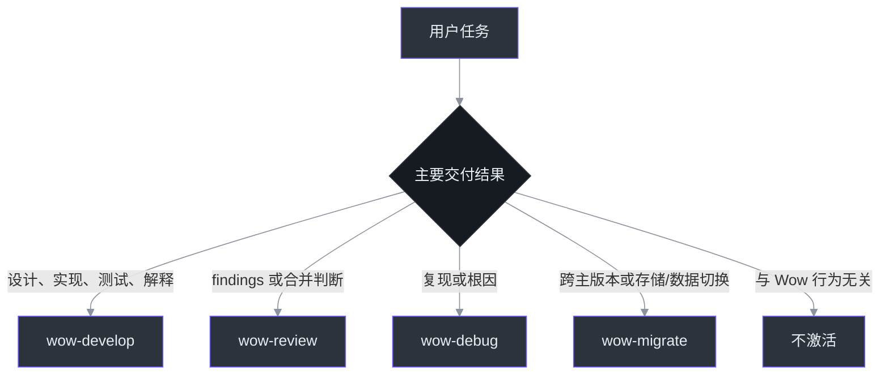
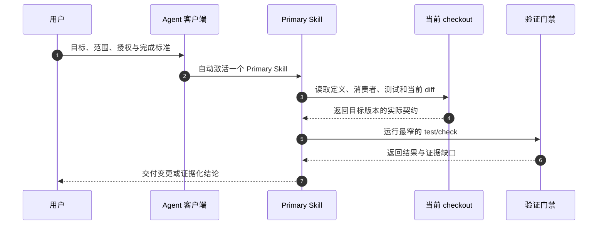

# Agent Skills

Wow Agent Skills 把框架特有的工作流、架构不变量、安全边界和完成证据组织成四个可复用 Skill。它们不复制 API 文档；注解参数、配置默认值、DSL 方法和生成契约必须在当前 checkout 或精确目标 tag 中重新确认。[`skills/README.md`](https://github.com/Ahoo-Wang/Wow/blob/main/skills/README.md)

| 入口 | 用途 |
|---|---|
| [Wow `skills/`](https://github.com/Ahoo-Wang/Wow/tree/main/skills) | Skill 内容、references、assets、evals 与插件源元数据 |
| [Ahoo Skills 站点](https://skills.ahoo.me/zh-CN/) | 插件目录、安装命令与分发说明 |
| [Ahoo-Wang/skills](https://github.com/Ahoo-Wang/skills) | Codex 与 Claude Code 的聚合市场 |
| [Agent Skills 规范](https://agentskills.io/) | `SKILL.md` 格式与渐进式披露模型 |

Wow 仓库拥有 Skill 内容；Ahoo Skills Hub 定期同步、校验并生成 `ahoo-wow-skills` 插件。不要直接修改聚合仓库中的生成副本。[`skills/README.md`](https://github.com/Ahoo-Wang/Wow/blob/main/skills/README.md#distribution)

## 四个 Primary Skills

客户端按用户的**主要交付结果**选择一个 Primary Skill，而不是按涉及的组件名选择。选定后，该 Skill 负责整个任务，不再切换到另一个 Wow Skill。[`skills/README.md`](https://github.com/Ahoo-Wang/Wow/blob/main/skills/README.md#selection-order)

| Skill | 何时使用 | 完整生命周期 |
|---|---|---|
| `wow-develop` | 设计、实现、测试、重构或解释 Wow 行为/API | 只读：Frame → Discover → Model → Prove facts → Verify → Report；授权变更：Frame → Discover → Model → Prove RED → Change → Verify → Report |
| `wow-review` | 输出 findings、质量判断、合并准备度，或执行 review-and-fix | Scope → Context → Findings → 授权修复 → Post-fix review |
| `wow-debug` | 复现和定位已有失败，或执行 diagnose-and-fix | Capture → Reproduce → Locate → Hypothesize → Test → Fix/Conclude |
| `wow-migrate` | 跨主版本迁移，或任意起始版本的存储/数据格式切换 | Baseline → Target → Matrix，之后仅执行已明确授权的适配、数据、验证与切换阶段 |

对应源文件：[`wow-develop`](https://github.com/Ahoo-Wang/Wow/blob/main/skills/wow-develop/SKILL.md#develop-wow-applications)、[`wow-review`](https://github.com/Ahoo-Wang/Wow/blob/main/skills/wow-review/SKILL.md#review-wow-changes)、[`wow-debug`](https://github.com/Ahoo-Wang/Wow/blob/main/skills/wow-debug/SKILL.md#debug-wow-failures)、[`wow-migrate`](https://github.com/Ahoo-Wang/Wow/blob/main/skills/wow-migrate/SKILL.md#migrate-wow-across-breaking-boundaries)。



### 选择顺序

1. v6→v8 兼容，或任意版本起点的存储/数据切换与回滚是主问题：`wow-migrate`。
2. 已有失败、hang、错误状态或 reproducer，目标是根因：`wow-debug`。
3. 目标是 findings、批准或合并准备度：`wow-review`。
4. 目标是设计、修改、测试或解释 Wow：`wow-develop`。
5. 纯 Kotlin/Gradle、dashboard 或不涉及框架语义的文档任务：不激活。

`review-and-fix` 始终留在 `wow-review`；`diagnose-and-fix` 始终留在 `wow-debug`。这样授权状态、证据和 diff 基线不会在 Skill 切换时丢失。

## 渐进式加载

每个 `SKILL.md` 只保存核心流程和选择规则，具体领域材料按需加载：[开发 Skill 的 reference 表](https://github.com/Ahoo-Wang/Wow/blob/main/skills/wow-develop/SKILL.md#load-one-domain-reference-first)。

| 任务 | 首个 reference |
|---|---|
| Aggregate、command、event、sourcing | `aggregate-sourcing.md` |
| Saga、Projection、EventProcessor | `saga-processors.md` |
| CommandGateway、wait、HTTP command route | `command-delivery.md` |
| Query DSL 与 read model | `query-read-model.md` |
| Starter、storage、bus | `starter-storage.md` |
| Runtime lifecycle | `runtime-lifecycle.md` |
| PrepareKey 唯一性与预留 | `prepare-key.md` |
| 测试层级与完成证据 | `verification-evidence.md` |

references 只保存稳定决策、源码发现方法和验证边界。完整注解参数、测试 DSL 方法表、配置键、默认值和后端枚举应直接从目标版本源码发现。[`skills/README.md`](https://github.com/Ahoo-Wang/Wow/blob/main/skills/README.md#content-model)

## 安装

### Codex

```bash
codex plugin marketplace add Ahoo-Wang/skills --ref main
codex plugin add ahoo-wow-skills@ahoo-skills
```

### Claude Code

```text
/plugin marketplace add https://github.com/Ahoo-Wang/skills
/plugin install ahoo-wow-skills
```

安装命令和当前发布状态以 [Ahoo Skills 中文站点](https://skills.ahoo.me/zh-CN/) 为准。插件更新后，使用客户端的刷新机制或新任务确认四个 Skill 已被发现。

四 Skill 架构是有意的破坏性重写：不分发旧名称或兼容别名。既有安装需要在发布后刷新或重新安装插件。

## 使用方式

请求至少应说明目标、范围、授权模式和完成证据：

| 信息 | 示例 |
|---|---|
| 目标 | “为 `Order` 增加取消能力并补测试” |
| 范围 | “只修改 `example-domain`，保持公开 API 兼容” |
| 模式 | “只 review，不修改”或“定位并修复” |
| 验证 | “运行 `:example-domain:test` 并报告准确结果” |



## 验证与维护

维护者运行：

```bash
python3 scripts/validate_wow_skills.py
python3 -m unittest scripts/test_validate_wow_skills.py scripts/test_run_wow_skill_evals.py
```

仓库自带的 validator 不依赖用户目录中的外部脚本；它校验四个 Skill 的标准 metadata、`openai.yaml`、显式插件清单、资源 containment、只做语法检查而不执行 `--help` 的 shell 校验，以及 activation/behavior contract。[`skills/README.md`](https://github.com/Ahoo-Wang/Wow/blob/main/skills/README.md#validation)

结构校验不能证明 eval 可执行、自动激活或行为正确。`scripts/run_wow_skill_evals.py` 会冻结 contract 与去除 `evals/` 的 runtime-only plugin copy，准备固定 revision 的隔离 fixture，并比较会记录目录且拒绝特殊文件的完整路径 manifest。`prepare` 阶段会由受保护 key 对 RUN v2 描述符做 domain-separated 签名，封印固定 adapter identity、case、repository、workspace、revision、contract、plugin 与 baseline；HMAC evidence 再独立签署 `requestSha256`。该值是磁盘上 `request.json` UTF-8 原始文件字节的 SHA-256，而不是 canonical JSON hash。验证只使用这份冻结快照，不回读实时 skills package，因此可编辑的 `run.json` 不能重建 baseline 或重定向结果，异步任务也不受后续源码更新影响。独立 review clone 会先由 runner 以 pack 传输精确 subject/base 的 object closure 再移除 remote，因此 detached commit 不依赖 advertised refs 或外部 object。它只接受固定版本 adapter 通过受保护 HMAC key 签署、workspace policy 已执行、且 command 已绑定根目录 cwd 与解析后 executable 的 v2 trace；activation run 必须在路由后立即停止。受信 cleanup 会重签完成后的生命周期状态；marker 损坏时，显式 recovery 要求保有受保护 key 与操作者提供的 source repository，只清理固定 runner-owned 路径，并写入由 key 签署的 tombstone 保证重试幂等；它不覆盖 trust key 同时丢失的场景。runner-owned oracle 还会独立验证 Cart 容量双分支、精确平台契约，以及 synthetic data 的中断恢复、幂等、checksum 与全量对账；数据中断门禁会封印不可预测、对 JSON 无语义影响的字节前缀，以拒绝从零重写。隐藏 Cart 测试只复用受信 RED/GREEN 命令填充的 workspace-local Gradle cache，强制以 `--offline` 重新执行任务；wrapper、dependency cache 或 Java toolchain 不可用时返回 `UNSUPPORTED` 而非 `FAIL`。缺少 trust、activation/tool trace 或 enforcement 时同样返回 `UNSUPPORTED`，证据畸形或被篡改时返回 `ERROR`，assertion 不满足时返回 `FAIL` 且 CLI 非零退出。`prepare`、`verify`、`cleanup` 的完整命令见 [runner contract](https://github.com/Ahoo-Wang/Wow/blob/main/skills/README.md#validation)。

## 相关页面

| 页面 | 关系 |
|---|---|
| [快速上手](./getting-started.md) | 建立可运行的 Wow 应用 |
| [聚合建模](./modeling.md) | `wow-develop` 的 Aggregate 建模背景 |
| [测试套件](./test-suite.md) | 当前 Aggregate/Saga 测试 API |
| [故障排查](./troubleshooting.md) | `wow-debug` 的运行与配置排障背景 |
| [Wow v6 迁移到 v8](./migration/v6-to-v8.md) | `wow-migrate` 的框架迁移专题 |
