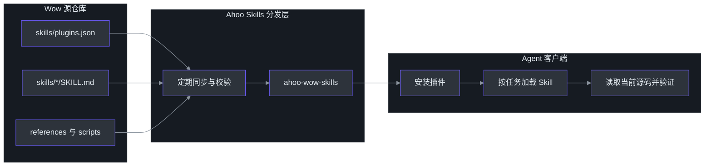
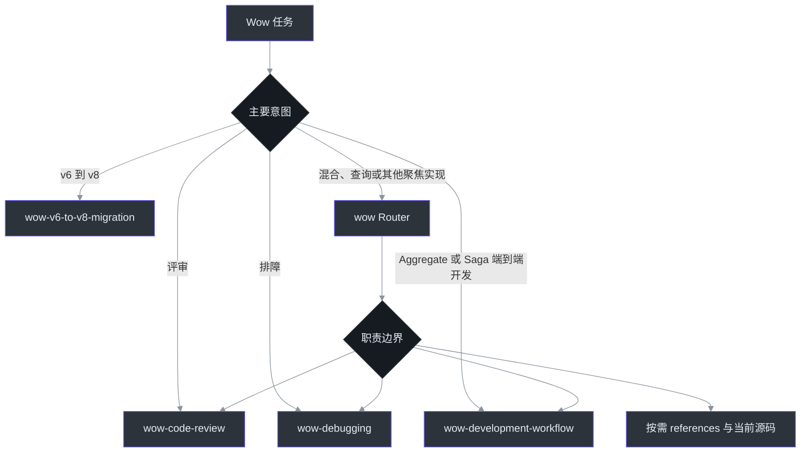
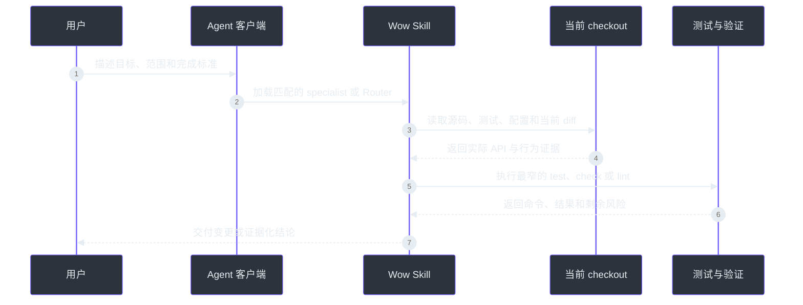

# Agent Skills

Wow Agent Skills 把框架的开发方法、评审规则、排障路径和迁移门禁组织成可复用的 Agent 工作流。它们不替代源码、测试或本文档；它们解决的是另一个问题：让支持 Agent Skills 的客户端在处理 Wow 任务时，先选择正确的工作流，再读取当前代码并留下可复核的验证证据。[`skills/README.md`](https://github.com/Ahoo-Wang/Wow/blob/main/skills/README.md#L1-L13)

| 入口 | 用途 | Source |
|---|---|---|
| 本仓库 `skills/` | Wow Skills 的源文件与维护规则 | [`skills/README.md`](https://github.com/Ahoo-Wang/Wow/blob/main/skills/README.md#L1-L15) |
| `ahoo-wow-skills` | 包含本仓库全部非 workspace skills 的分发插件 | [`skills/plugins.json`](https://github.com/Ahoo-Wang/Wow/blob/main/skills/plugins.json#L1-L13) |
| [Ahoo Skills 站点](https://skills.ahoo.me/zh-CN/) | 查看插件、安装命令与分发模型 | [skills.ahoo.me](https://skills.ahoo.me/zh-CN/) |
| [Ahoo-Wang/skills](https://github.com/Ahoo-Wang/skills) | Codex 与 Claude Code 的插件市场和聚合仓库 | [GitHub repository](https://github.com/Ahoo-Wang/skills) |

## 架构与分发

| 层次 | 职责 | Source |
|---|---|---|
| Source | Wow 仓库维护 skill 内容、references、脚本和插件源元数据 | [`skills/README.md`](https://github.com/Ahoo-Wang/Wow/blob/main/skills/README.md#L7-L15) |
| Distribution | Ahoo Skills 定期同步源仓库，并按项目生成独立插件 | [Ahoo Skills](https://skills.ahoo.me/zh-CN/) |
| Client | Codex、Claude Code 或其他兼容客户端安装插件并加载匹配的 skill | [`skills/README.md`](https://github.com/Ahoo-Wang/Wow/blob/main/skills/README.md#L1-L5) |
| Evidence | Skill 要求 Agent 回到当前 checkout 的源码、测试、配置和实际命令验证结论 | [`wow/SKILL.md`](https://github.com/Ahoo-Wang/Wow/blob/main/skills/wow/SKILL.md#L21-L34) |


<!-- Sources: skills/README.md:1-15, skills/plugins.json:1-13, skills/wow/SKILL.md:21-34, https://skills.ahoo.me/zh-CN/ -->

这里有两个需要刻意区分的边界：**Wow 仓库是内容源**，`Ahoo-Wang/skills` 是**分发入口**。聚合仓库会同步上游内容并生成 Codex、Claude Code 所需的市场清单，因此技能定义有更新时，应先修改 Wow 仓库中的 `skills/`，而不是修改生成后的插件副本。[`skills/README.md`](https://github.com/Ahoo-Wang/Wow/blob/main/skills/README.md#L114-L120) [Ahoo Skills distribution](https://skills.ahoo.me/zh-CN/)

## Skills 组件

当前 `ahoo-wow-skills` 通过 `include: ["*"]` 收录本仓库的非 workspace skills。[`skills/plugins.json`](https://github.com/Ahoo-Wang/Wow/blob/main/skills/plugins.json#L5-L13)

| Skill | 何时使用 | 核心边界 | Source |
|---|---|---|---|
| `wow` | 混合任务、单点框架问题，以及 Gateway、Query DSL、配置、Projection 等聚焦实现 | 作为 Router 选择 specialist 或按需 reference；修改前必须核对当前源码 | [`wow/SKILL.md`](https://github.com/Ahoo-Wang/Wow/blob/main/skills/wow/SKILL.md#L15-L55) |
| `wow-development-workflow` | 新增、完善或重构 Aggregate/Saga 行为 | 依次完成对齐、发现、建模、测试证明、实现、评审和验证；Projection 不在该 workflow 内 | [`wow-development-workflow/SKILL.md`](https://github.com/Ahoo-Wang/Wow/blob/main/skills/wow-development-workflow/SKILL.md#L6-L38) |
| `wow-code-review` | PR、diff、预合并变更或 Wow 语义审查 | 默认只读；优先检查 Event Sourcing、CQRS、路由、并发和测试契约 | [`wow-code-review/SKILL.md`](https://github.com/Ahoo-Wang/Wow/blob/main/skills/wow-code-review/SKILL.md#L6-L33) |
| `wow-debugging` | 命令未处理、状态错误、Saga 未触发、等待卡住、查询或配置异常 | 默认只读；先复现和定位失败阶段，再验证单一假设 | [`wow-debugging/SKILL.md`](https://github.com/Ahoo-Wang/Wow/blob/main/skills/wow-debugging/SKILL.md#L6-L16) |
| `wow-v6-to-v8-migration` | 评估、规划、实施或验证已有 Wow v6 应用迁移到固定的 Wow v8 版本 | 同时覆盖平台、源码、数据、runtime、发布和回滚门禁；不用于首次采用 Wow 或 v8 内常规升级 | [`wow-v6-to-v8-migration/SKILL.md`](https://github.com/Ahoo-Wang/Wow/blob/main/skills/wow-v6-to-v8-migration/SKILL.md#L1-L31) |

`wow/references/` 还按需提供建模、注解、测试、Command Gateway、Query DSL、配置和 PrepareKey 的聚焦参考；长篇事实材料放在 reference 中，Router 保持轻量。[`skills/README.md`](https://github.com/Ahoo-Wang/Wow/blob/main/skills/README.md#L67-L88) [`wow/SKILL.md`](https://github.com/Ahoo-Wang/Wow/blob/main/skills/wow/SKILL.md#L85-L95)

## 任务路由

| 任务示例 | 首选 Skill | Source |
|---|---|---|
| “为 Order 聚合增加取消能力并补测试” | `wow-development-workflow` | [`skills/README.md`](https://github.com/Ahoo-Wang/Wow/blob/main/skills/README.md#L96-L108) |
| “Review 当前分支的 Wow 变更” | `wow-code-review` | [`wow-code-review/SKILL.md`](https://github.com/Ahoo-Wang/Wow/blob/main/skills/wow-code-review/SKILL.md#L27-L43) |
| “为什么命令没有命中 handler？” | `wow-debugging` | [`wow-debugging/SKILL.md`](https://github.com/Ahoo-Wang/Wow/blob/main/skills/wow-debugging/SKILL.md#L29-L49) |
| “把已有应用从 Wow v6 迁到 v8” | `wow-v6-to-v8-migration` | [`wow-v6-to-v8-migration/SKILL.md`](https://github.com/Ahoo-Wang/Wow/blob/main/skills/wow-v6-to-v8-migration/SKILL.md#L21-L31) |
| “查询 `@CommandRoute` 并修改 WebFlux 路由” | `wow` | [`wow/SKILL.md`](https://github.com/Ahoo-Wang/Wow/blob/main/skills/wow/SKILL.md#L36-L55) |


<!-- Sources: skills/README.md:16-45, skills/README.md:96-112, skills/wow/SKILL.md:36-55, skills/wow-code-review/SKILL.md:27-43, skills/wow-debugging/SKILL.md:14-27, skills/wow-v6-to-v8-migration/SKILL.md:21-35 -->

路由的目的不是增加流程，而是保护职责边界。例如，代码审查和故障诊断默认保持只读；只有用户明确要求修复时，才进入获得授权的实现流程。[`wow-code-review/SKILL.md`](https://github.com/Ahoo-Wang/Wow/blob/main/skills/wow-code-review/SKILL.md#L10-L25) [`wow-debugging/SKILL.md`](https://github.com/Ahoo-Wang/Wow/blob/main/skills/wow-debugging/SKILL.md#L10-L12)

## 安装

插件市场会把 Wow Skills 作为独立的 `ahoo-wow-skills` 分发，不需要安装其他项目的 skill 包。[`skills/plugins.json`](https://github.com/Ahoo-Wang/Wow/blob/main/skills/plugins.json#L3-L39)

### Codex

```bash
codex plugin marketplace add Ahoo-Wang/skills --ref main
codex plugin add ahoo-wow-skills@ahoo-skills
```

### Claude Code

```text
/plugin marketplace add https://github.com/Ahoo-Wang/skills
/plugin install ahoo-wow-skills
```

安装命令与当前可分发插件以 [Ahoo Skills 中文站点](https://skills.ahoo.me/zh-CN/) 和 [Ahoo-Wang/skills](https://github.com/Ahoo-Wang/skills) 为准。客户端版本可能影响插件发现和刷新方式；安装后请使用该客户端提供的插件列表或新任务确认 `ahoo-wow-skills` 已可用。

## 使用流程

安装后，直接描述目标、范围和成功标准即可；如果客户端没有自动匹配，也可以明确点名所需 skill。无论采用哪种触发方式，skill 都要求 Agent 在当前 checkout 中重新读取相关源码和测试，而不是把 skill 内的示例当成框架 API 真相。[`wow/SKILL.md`](https://github.com/Ahoo-Wang/Wow/blob/main/skills/wow/SKILL.md#L21-L34)


<!-- Sources: skills/wow/SKILL.md:21-55, skills/wow-development-workflow/SKILL.md:26-38, skills/wow-development-workflow/SKILL.md:217-229, skills/wow-code-review/SKILL.md:27-33, skills/wow-debugging/SKILL.md:29-74 -->

建议在请求中至少写清楚：

| 信息 | 示例 | 为什么重要 | Source |
|---|---|---|---|
| 目标 | “为 `Order` 增加取消能力” | 决定业务结果与交付物 | [`wow-development-workflow/SKILL.md`](https://github.com/Ahoo-Wang/Wow/blob/main/skills/wow-development-workflow/SKILL.md#L83-L97) |
| 范围 | “只修改 `example-domain`，保持公开 API 兼容” | 防止跨模块或破坏性扩张 | [`wow-development-workflow/SKILL.md`](https://github.com/Ahoo-Wang/Wow/blob/main/skills/wow-development-workflow/SKILL.md#L89-L97) |
| 模式 | “只 review，不修改”或“定位并修复” | 区分只读取证与授权实现 | [`wow-code-review/SKILL.md`](https://github.com/Ahoo-Wang/Wow/blob/main/skills/wow-code-review/SKILL.md#L10-L25) |
| 验证 | “运行 `:example-domain:test`” | 让完成标准可以复核 | [`wow-development-workflow/SKILL.md`](https://github.com/Ahoo-Wang/Wow/blob/main/skills/wow-development-workflow/SKILL.md#L217-L229) |

## 约束与维护

| 原则 | 含义 | Source |
|---|---|---|
| Source first | Skill 是导航与工作流，不是当前 API 的替代品 | [`wow/SKILL.md`](https://github.com/Ahoo-Wang/Wow/blob/main/skills/wow/SKILL.md#L21-L34) |
| Test-backed | Aggregate/Saga 行为分别由对应 Spec 或 Verifier 证明，行为变更遵循 RED→GREEN→REFACTOR | [`wow-development-workflow/SKILL.md`](https://github.com/Ahoo-Wang/Wow/blob/main/skills/wow-development-workflow/SKILL.md#L14-L24) |
| Read-only by default | Review 和 diagnosis 不自动授权修改、回复、批准、合并或修复 | [`wow-code-review/SKILL.md`](https://github.com/Ahoo-Wang/Wow/blob/main/skills/wow-code-review/SKILL.md#L10-L18), [`wow-debugging/SKILL.md`](https://github.com/Ahoo-Wang/Wow/blob/main/skills/wow-debugging/SKILL.md#L10-L12) |
| Migration is a system change | v6→v8 不能以依赖解析、编译或启动成功代替数据、runtime、发布和回滚验证 | [`wow-v6-to-v8-migration/SKILL.md`](https://github.com/Ahoo-Wang/Wow/blob/main/skills/wow-v6-to-v8-migration/SKILL.md#L6-L31) |
| Upstream ownership | 修改 Wow Skills 时在本仓库维护并验证，再由聚合仓库同步分发 | [`skills/README.md`](https://github.com/Ahoo-Wang/Wow/blob/main/skills/README.md#L114-L150) |

## 参考资料

- [Ahoo Skills 中文站点](https://skills.ahoo.me/zh-CN/)
- [Ahoo-Wang/skills 聚合仓库](https://github.com/Ahoo-Wang/skills)
- [Wow `skills/` 源目录](https://github.com/Ahoo-Wang/Wow/tree/main/skills)
- [Agent Skills 规范](https://agentskills.io/)

## 相关页面

| 页面 | 关系 |
|---|---|
| [快速上手](./getting-started.md) | 建立一个可运行的 Wow 应用，再让 skills 辅助迭代 |
| [聚合建模](./modeling.md) | `wow` 和 development workflow 所依据的核心模型 |
| [测试套件](./test-suite.md) | Aggregate/Saga 行为验证使用的测试 DSL |
| [故障排查](./troubleshooting.md) | 与 `wow-debugging` 配合定位运行与配置问题 |
| [Wow v6 迁移到 v8](./migration/v6-to-v8.md) | `wow-v6-to-v8-migration` 的框架迁移专题 |
