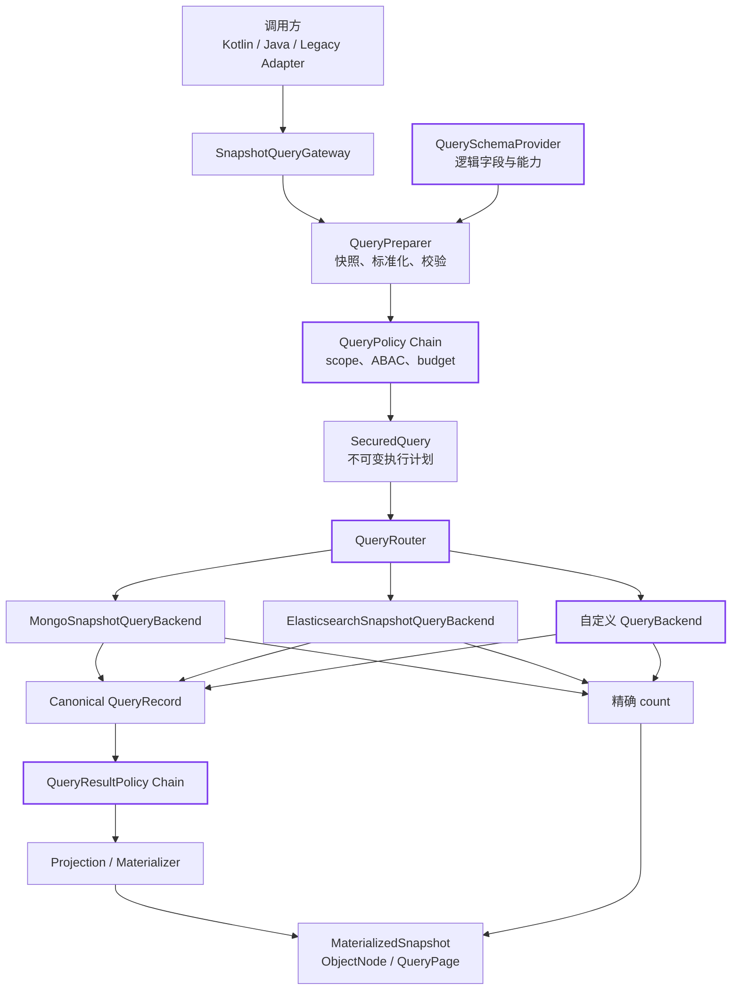
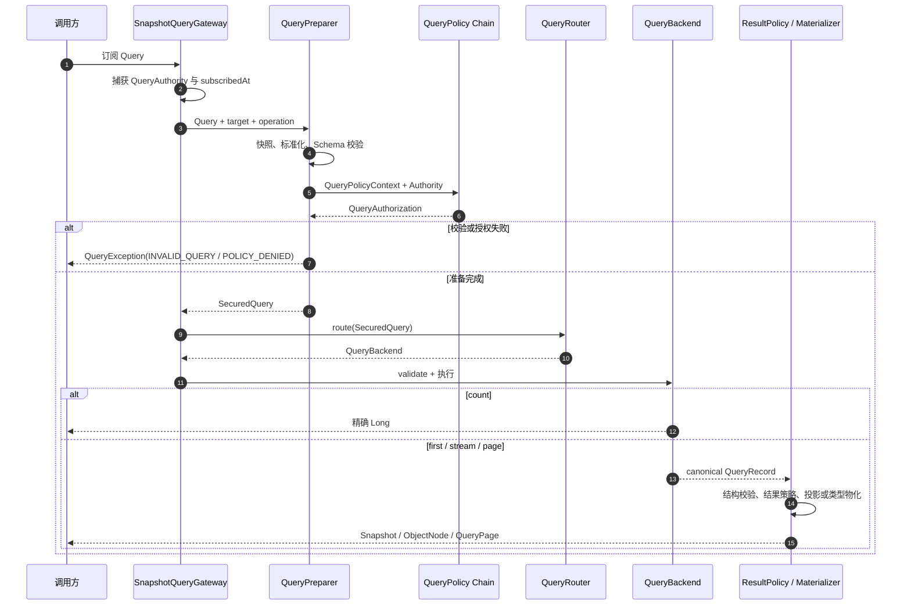

# 快照查询网关

`SnapshotQueryGateway<S>` 是后端中立的快照查询入口。Spring Boot 为每个聚合状态类型注册一个 Gateway，
并按 `wow.eventsourcing.storage-routing` 选择 MongoDB 或 Elasticsearch。查询在访问后端前固定经过 Schema
校验、授权策略、资源预算和路由；后端结果还会经过结构校验、结果策略和物化。

## 适用范围与前提

快照查询网关用于查询**单个聚合类型的当前快照**。跨聚合关联、分析宽表、独立生命周期读模型仍应使用
[投影](./projection.md)。Gateway 本身是进程内 Kotlin/Java API，不会额外生成一套 HTTP 路由；已有 WebFlux
快照查询端点继续通过兼容层调用同一 Gateway 管线。

自动装配需要满足：

1. `wow.eventsourcing.snapshot.enabled=true`；
2. 聚合已被 Wow 元数据扫描发现；
3. 至少存在一个可查询的 MongoDB 或 Elasticsearch `QueryBackend`；
4. 快照承担当前状态读模型时使用 `snapshot.strategy=all`，并等待命令的 `SNAPSHOT` 阶段后再要求写后读可见。

Spring 可按状态泛型直接注入对应 Gateway：

```kotlin
@Service
class OrderQueries(
    private val gateway: SnapshotQueryGateway<OrderState>
)
```

如果应用只配置 Redis 或内存快照存储且没有查询后端，不会凭空获得动态查询能力。混合存储应用中，路由到
不支持查询的聚合会返回 `BACKEND_NOT_READY`。

## 架构



紫色边框表示公开扩展点。Gateway 先把调用方的 `Query` 编译成 `SecuredQuery`，后端只能执行这份已经完成
Schema、授权和预算约束的不可变计划；后端返回统一的 canonical record，结果策略、投影和类型物化不会依赖
MongoDB BSON 或 Elasticsearch DSL。

## 基本用法

```kotlin
class OrderQueries(
    private val gateway: SnapshotQueryGateway<OrderState>
) {
    fun paidOrders(tenantId: String): Mono<QueryPage<ObjectNode>> =
        gateway.pageRecords(page = 1, size = 50) {
            filter { field("state.status") eq "PAID" }
            projection { include("aggregateId", "state.status", "eventTime") }
            sort { desc("eventTime") }
            scope { tenantId(tenantId) }
            budget {
                timeout(Duration.ofSeconds(3))
                maxRecords(50)
            }
        }.contextWrite(
            QueryContexts.withAuthority(QueryAuthority(tenantId = tenantId))
        )
}
```

- `first`、`stream`、`page` 返回完整的强类型快照，不接受字段投影。
- `firstRecord`、`streamRecords`、`pageRecords` 返回 `ObjectNode`，支持 include 或 exclude 投影。
- `count` 只返回精确计数；后端出现分片失败时不会接受部分结果。
- `QueryScope` 只能收窄 `QueryAuthority`，不能扩张租户、拥有者或命名空间范围。
- 查询已删除快照需要 `query:snapshot:deletion` 权限。

## API 速查

| 方法 | 返回值 | 投影 | 空结果 | 主要用途 |
|---|---|---|---|---|
| `first(query)` | `Mono<MaterializedSnapshot<S>>` | 仅 `All` | `Mono.empty()` | 获取第一条强类型快照 |
| `firstRecord(query)` | `Mono<ObjectNode>` | 支持 | `Mono.empty()` | 获取第一条动态记录 |
| `stream(query[, limit])` | `Flux<MaterializedSnapshot<S>>` | 仅 `All` | 空 Flux | 流式读取强类型快照 |
| `streamRecords(query[, limit])` | `Flux<ObjectNode>` | 支持 | 空 Flux | 流式读取动态记录或批量导出 |
| `page(query, page, size)` | `Mono<QueryPage<MaterializedSnapshot<S>>>` | 仅 `All` | `items=[]`、`total=0` | 强类型分页 |
| `pageRecords(query, page, size)` | `Mono<QueryPage<ObjectNode>>` | 支持 | `items=[]`、`total=0` | 动态分页 |
| `count(filter, scope, budget)` | `Mono<Long>` | 不适用 | `0` | 精确计数 |

`page` 从 1 开始。`limit`、page 和 size 必须为正数；page size 还受全局 `QueryLimits.maxPageSize` 限制。
未指定 sort 时后端不承诺业务稳定顺序，分页和可重复批处理应显式排序，并使用 `aggregateId` 作为最终
tie-breaker。

## Query DSL

Gateway DSL 分别构造 filter、projection、sort、scope 和 budget。每个单值设置只能声明一次，避免多个代码块
隐式覆盖或累积。

```kotlin
gateway.streamRecords(limit = 100) {
    filter {
        and(
            field("state.status") eq "PAID",
            field("state.total") gte 100
        )
    }
    projection { exclude("state.secret") }
    sort {
        desc("eventTime")
        asc("aggregateId")
    }
    budget {
        timeout(Duration.ofSeconds(5))
        maxRecords(100)
    }
}
```

`budget` 也可以直接接收 `QueryBudget`；DSL 形式等价于：

```kotlin
budget(QueryBudget(timeout = Duration.ofSeconds(5), maxRecords = 100))
```

## Query 模型

`Query` 是不可变请求值，订阅时会复制集合和 JSON literal，避免调用方在异步执行期间修改查询。

| 属性 | 默认值 | 说明 |
|---|---|---|
| `filter` | `MatchAll` | 逻辑表达式树 |
| `projection` | `QueryProjection.All` | 动态记录的 include 或 exclude 投影 |
| `sort` | 空列表 | 有序的排序字段列表 |
| `scope` | `QueryScope()` | 租户、拥有者、命名空间和删除范围 |
| `budget` | `QueryBudget()` | 单次调用的 timeout 与最大输出记录数 |

表达式最大深度为 128，节点数最多 10000。未知字段、字段类型不匹配、非法 literal、空逻辑表达式和重复
DSL 设置都会在访问后端前返回 `INVALID_QUERY`。

### 逻辑与字段操作符

```kotlin
filter {
    and(
        field("state.status") eq "PAID",
        or(
            field("state.total") between (100 to 500),
            field("state.customerLevel") inside listOf("VIP", "SVIP")
        ),
        nor(field("state.cancelled").isTrue())
    )
}
```

| DSL | `PredicateOperator` | 值数量 | 典型字段 |
|---|---|---:|---|
| `eq` / `ne` | `EQ` / `NE` | 1 | 标量 |
| `gt` / `lt` / `gte` / `lte` | 同名 | 1 | 数字、时间 |
| `between(a to b)` | `BETWEEN` | 2 | 数字、时间，闭区间 |
| `inside(values)` / `notInside(values)` | `IN` / `NOT_IN` | 至少 1 | 标量或标量集合 |
| `contains(value)` | `CONTAINS` | 1 | 字符串 |
| `containsAll(values)` | `CONTAINS_ALL` | 至少 1 | 标量集合 |
| `startsWith` / `endsWith` | 同名 | 1 | 字符串 |
| `isNull()` / `isNotNull()` | `IS_NULL` / `IS_NOT_NULL` | 0 | nullable 标量 |
| `isTrue()` / `isFalse()` | `IS_TRUE` / `IS_FALSE` | 0 | Boolean |
| `exists()` | `EXISTS` | 0 | 支持 presence 的字段 |
| `isEmpty()` | `IS_EMPTY` | 0 | 集合 |
| `field(path) search text` | `SearchExpression` | 1 | full-text 字符串 |

表中是 Schema 层允许的通用模型；后端可以进一步拒绝无法可靠实现的语义。例如 Elasticsearch 会拒绝部分
null/missing presence 操作，详见[后端约束](#后端约束)。

### 全文检索

单字段和多字段全文查询分别写为：

```kotlin
filter { field("state.name") search "wireless headset" }

filter {
    search(
        "wireless headset",
        "state.name",
        "state.description"
    )
}
```

全文检索与 `contains` 不同：`search` 使用后端全文索引和 analyzer；`contains` 是字段内模式匹配。调用方只
声明逻辑字段，不声明 MongoDB text index 名称或 Elasticsearch `.keyword` 子字段。

### 对象数组

`elementMatch` 要求数组中的**同一个元素**满足内部条件。内部字段使用相对于数组元素的路径：

```kotlin
filter {
    elementMatch("state.orders") {
        and(
            field("status") eq "PAID",
            elementMatch("lines") {
                and(
                    field("sku") eq "SKU-1",
                    field("quantity") gte 2
                )
            }
        )
    }
}
```

MongoDB 编译为嵌套 `$elemMatch`；Elasticsearch 要求 `state.orders` 与内部对象数组映射为 `nested`。

## 投影、排序与分页

投影只适用于 `*Record` 方法。include 与 exclude 是互斥模型，不能在同一查询中混用：

```kotlin
gateway.firstRecord {
    projection { include("aggregateId", "version", "state.status") }
}

gateway.firstRecord {
    projection { exclude("state.secret") }
}
```

选择父字段会包含或排除其全部已知子字段。强类型快照需要完整 state，因此在 `first`、`stream` 或 `page`
上使用投影会返回 `INVALID_QUERY`。后端记录先经过结果结构校验和 `QueryResultPolicy`，之后才执行投影，
敏感字段脱敏不会被投影绕过。

分页同时执行 items 查询和精确 total。大结果集不应递增 page 深翻页：MongoDB 会承受大 `skip`，
Elasticsearch 受 `maxResultWindow` 限制。批量读取应使用带稳定 sort、明确 limit、timeout 和 maxRecords 的
stream。

## Schema 与逻辑字段

`JacksonQuerySchemaProvider` 从聚合状态的 Jackson 序列化模型生成 Schema，并附加快照 envelope 字段：

| 字段组 | 示例 | 说明 |
|---|---|---|
| 身份 | `contextName`、`aggregateName`、`aggregateId`、`tenantId` | 系统字段，可过滤和排序 |
| 版本与操作人 | `version`、`eventId`、`operator`、`firstOperator` | 系统字段 |
| 时间 | `firstEventTime`、`eventTime`、`snapshotTime` | 系统 `TIME` 字段 |
| 生命周期 | `deleted`、`ownerId`、`spaceId` | 由 scope 和系统策略保护 |
| 状态 | `state.status`、`state.items.sku` | 从状态类型推导 |
| 动态结构 | `tags`、Map、递归对象 | 默认 opaque，不允许便携字段查询 |

逻辑字段由字母或下划线开头的点分段组成，例如 `state.order-items.sku`。Gateway 会依据字段的 value kind、
nullable、collection kind、queryable、sortable、projectable、elementMatch、operators 和 fullText 元数据在
PREPARATION 阶段拒绝非法用法。

- `Instant` 与 `Date` 推导为 `TIME`；其他 `Temporal` 类型按序列化字符串处理，不提供字符串模式操作或全文检索。
- `ByteArray` 使用 Base64 literal。
- Map、递归对象和动态 JSON 默认作为 opaque 字段；需要查询内部路径时应提供显式 `QuerySchemaProvider`。
- Schema 只描述逻辑能力；MongoDB/Elasticsearch 后端仍会验证真实索引是否具备对应物理语义。

自定义 Schema 时应装饰默认 Schema，不得删除或篡改 canonical envelope 字段：

```kotlin
@Bean
fun querySchemaProvider(objectMapper: ObjectMapper): QuerySchemaProvider {
    val delegate = JacksonQuerySchemaProvider(objectMapper)
    return QuerySchemaProvider { metadata ->
        val schema = delegate.getSchema(metadata)
        val path = LogicalField("state.description")
        QuerySchema(
            schema.fields + (path to schema.fields.getValue(path).copy(fullText = false))
        )
    }
}
```

## 授权边界

:::warning
Gateway 不负责认证。没有 `QueryAuthority` 时，默认系统策略不会自动推断租户、拥有者或命名空间；这种模式
只适用于受信任的单租户进程内调用。对外入口必须注入已认证 authority，或用自定义 `QueryPolicy` 拒绝匿名
调用。不要把 `filter { field("tenantId") ... }` 当作隔离边界。
:::

所有 `QueryPolicy` 都会执行：任一 `DENY` 拒绝查询，字段权限取交集，预算取最小值。所有
`QueryResultPolicy` 在投影和类型物化前执行，且不能修改快照的上下文、聚合、版本、租户等身份字段。
策略与结果转换必须保持非阻塞。

### QueryAuthority 与 Scope

| authority 字段 | 系统策略行为 |
|---|---|
| `subjectId` | 提供给自定义策略，不自动产生过滤条件 |
| `tenantId` | 强制添加 `tenantId == authority.tenantId` |
| `ownerId` | 强制添加 `ownerId == authority.ownerId` |
| `spaceIds` | `null` 不施加空间限制；空集合拒绝全部空间；非空集合是 allowlist |
| `permissions` | 控制 deleted/ALL 等特权能力 |

`scope` 是调用方请求的进一步收窄。`spaceIds=null` 时可以选择任一 space 做进一步收窄；存在 allowlist 时，
请求不在集合内的 space 会直接
`POLICY_DENIED`。`DeletionScope.DEFAULT` 与 `ACTIVE` 都只返回未删除快照；`DELETED` 和 `ALL` 需要
`query:snapshot:deletion`。

### 自定义授权策略

系统策略始终先参与合并。应用策略可以拒绝匿名调用、添加 mandatory filter、限制可用字段和收紧预算：

```kotlin
@Bean
fun authenticatedQueryPolicy() = QueryPolicy { context ->
    if (context.authority.subjectId == null) {
        Mono.just(QueryAuthorization(decision = QueryDecision.DENY))
    } else {
        Mono.just(
            QueryAuthorization(
                decision = QueryDecision.ABSTAIN,
                maximumBudget = QueryBudget(
                    timeout = Duration.ofSeconds(3),
                    maxRecords = 1_000
                )
            )
        )
    }
}
```

组合规则是 fail-closed：`DENY` 优先，字段集合取交集，mandatory filter 使用 AND 合并，预算取最小值，
请求需要的 capability 必须得到显式 `GRANT`。

### 结果策略

结果策略适合做字段脱敏或按 authority 变换 state。它不能修改 envelope 身份字段，也不能返回不符合 Schema
的结构：

```kotlin
@Bean
fun secretMaskingPolicy() = QueryResultPolicy { _, record ->
    (record["state"] as ObjectNode).remove("secret")
    record
}
```

## 资源边界

为兼容旧版 `IListQuery.limit == 0` 的无限流语义，默认 `QueryLimits.maximumBudget` 不设置超时和记录数。
生产环境必须显式提供边界；如果仍依赖旧版无限流，请先把调用迁移成有界分页或明确 limit，再启用
`maxRecords`。

```kotlin
@Bean
fun queryLimits() = QueryLimits(
    maxPageSize = 200,
    maximumBudget = QueryBudget(
        timeout = Duration.ofSeconds(5),
        maxRecords = 10_000
    )
)
```

流在已发出部分记录后失败时会返回 `INCOMPLETE_RESULT`。调用方必须丢弃该次流的部分结果并从头重试，
不能把它当作成功的截断结果。

有效预算是“请求预算、所有策略预算、全局预算”三者的最小值。timeout 从订阅时开始，覆盖准备、策略和后端执行；
`maxRecords` 限制输出记录数，不限制 count 得到的业务总数。请求 limit 或 page size 已经超过 maxRecords 时，
会在访问后端前返回 `BUDGET_EXCEEDED`。

## 后端约束

| 能力 | MongoDB | Elasticsearch |
|---|---|---|
| 精确查询/排序 | 使用 BSON 字段语义 | 字段必须具有严格 exact 语义；text 字段需唯一 keyword 子字段或显式 `exactSubfields` |
| 全文检索 | 请求字段集合必须与 collection 的 text index 字段集合一致 | 字段必须是可索引 text，当前只接受 standard analyzer 语义 |
| 对象数组匹配 | 使用 `$elemMatch` | 对应字段必须映射为 `nested` |
| 分页 | page size 默认最多 1000；offset 不得超过 `Int.MAX_VALUE` | `from + size` 默认不得超过 10000；流式读取使用 PIT + `search_after` |
| presence 语义 | 支持 null / missing 区分 | 拒绝 `NE`、`NOT_IN`、`IS_NULL`、`IS_NOT_NULL`、`EXISTS`、`IS_EMPTY`、`EQ null` 和含 null 的 `IN` |

Gateway 使用逻辑字段，例如 `state.code`；调用方不得传入 `.keyword` 等物理字段。映射不满足当前查询语义时，
Elasticsearch 返回 `BACKEND_NOT_READY`，不会降级成可能扩大结果的查询。

### 存储路由

默认快照存储和按聚合路由同时决定 Gateway 的查询后端。例如默认使用 MongoDB，仅把 order 快照路由到
Elasticsearch：

```yaml
wow:
  context-name: order-service
  eventsourcing:
    snapshot:
      enabled: true
      strategy: all
      storage: mongo
    storage-routing:
      aggregates:
        order:
          snapshot:
            storage: elasticsearch
```

切换 route 不会迁移历史快照。目标索引创建、历史重建、对账和回滚步骤见
[快照查询网关迁移与生产门禁](./migration/snapshot-query-gateway.md)。

### Elasticsearch 后端选项

需要指定 exact 子字段或调整 PIT 时，可提供自定义后端 Bean；自动配置会停止创建同类型默认 Bean：

```kotlin
@Bean
fun elasticsearchSnapshotQueryBackend(
    client: ReactiveElasticsearchClient
) = ElasticsearchSnapshotQueryBackend(
    client,
    ElasticsearchQueryBackendOptions(
        exactSubfields = mapOf(LogicalField("state.code") to "raw"),
        pitPageSize = 500,
        pitKeepAlive = "2m",
        maxResultWindow = 10_000,
        mappingCacheTtl = Duration.ofSeconds(30)
    )
)
```

`exactSubfields` 的值是相对于 text 字段的子字段名。实际 mapping 仍必须通过 exact semantics 和 doc-values
校验；配置不会替后端创建或修改 mapping。后端按实际 index 缓存 mapping/settings，默认 TTL 为 30 秒；读取
元数据时的传输故障返回 `BACKEND_FAILURE`，缺失或不兼容的 mapping 才返回 `BACKEND_NOT_READY`。

## 扩展能力

优先在最窄的职责层扩展，不要绕过准备管线或把存储细节泄漏到公共 Query：

| 扩展点 | 适合解决 | 必须保持的约束 |
|---|---|---|
| `QuerySchemaProvider` | 增减逻辑字段能力、全文或数组元数据 | 保留 canonical envelope；字段名不包含 `.keyword` 等物理路径 |
| `QueryPolicy` | ABAC、mandatory filter、字段权限、预算和 capability 授权 | 非阻塞；`DENY` 优先；scope 只能收窄 authority |
| `QueryRouter` | 按聚合把已授权查询路由到不同后端 | 只选择后端，不改写 `SecuredQuery` |
| `QueryBackend` | 接入新的快照存储或查询引擎 | 只执行 `SecuredQuery`；fail-closed；返回 canonical record |
| `QueryResultPolicy` | 脱敏或按 authority 变换 state | 在投影前执行；不得修改受保护的 envelope 身份字段 |

### 1. 扩展逻辑字段能力

装饰默认 `JacksonQuerySchemaProvider`，只覆盖确实与默认推导不同的字段。前文的
[Schema 与逻辑字段](#schema-与逻辑字段)示例关闭了单个字段的全文能力；同样可以显式描述 opaque 结构的
可查询子字段。Schema 是所有后端共同的公共契约，物理映射继续留在后端配置中。

### 2. 扩展授权与结果处理

使用 [自定义授权策略](#自定义授权策略) 增加 mandatory filter、字段白名单、预算或 capability 决策，使用
[结果策略](#结果策略) 做投影前脱敏。策略链自动合并所有 Bean；无需自行实现另一套 Gateway，也不能在
结果策略中把跨租户记录改造成当前租户记录。

### 3. 扩展路由

声明一个 `QueryRouter` Bean 即可替换默认存储路由。路由接收的已经是 `SecuredQuery`：

```kotlin
@Bean
fun queryRouter(
    mongo: MongoSnapshotQueryBackend,
    analytics: AnalyticsSnapshotQueryBackend
) = QueryRouter { query ->
    if (query.target.aggregateName == "order") analytics else mongo
}
```

路由只负责选择；查询转换、降级或重试应由相应后端明确实现，并保持错误码语义。

### 4. 扩展存储后端

新的查询引擎实现 `QueryBackend`，不需要复制 Gateway：

```kotlin
class AnalyticsSnapshotQueryBackend : QueryBackend {
    override val id: String = "analytics"

    override fun validate(query: SecuredQuery) {
        // 在发起 I/O 前拒绝不支持的表达式、能力或物理映射。
    }

    override fun stream(query: SecuredQuery): Flux<ObjectNode> = TODO()

    override fun page(query: SecuredQuery): Mono<QueryPage<ObjectNode>> = TODO()

    override fun count(query: SecuredQuery): Mono<Long> = TODO()
}
```

实现时必须满足：

1. `validate` 对无法准确实现的语义返回 `UNSUPPORTED_QUERY` 或 `BACKEND_NOT_READY`，不得扩大结果；
2. `stream` 和 `page` 返回完整 canonical envelope，投影和类型物化由 Gateway 完成；
3. `page.total` 与 `count` 是精确值，不能把分片失败或近似值包装成成功；
4. 全程保持 Reactor 非阻塞，响应取消、deadline 和 `maxRecords`，部分流失败使用 `INCOMPLETE_RESULT`；
5. 用同一组契约用例验证 filter、sort、page、count、null/missing、nested、全文和错误映射。

完成后，将后端声明为 Spring Bean，并通过自定义 `QueryRouter` 选择它。只有需要自定义 clock、zone 或统一
Gateway 构造策略时才替换 `SnapshotQueryGatewayFactory`；通常扩展 Schema、Policy、Router 或 Backend 已足够。

## 兼容层

旧 `SnapshotQueryService`、`Condition` 和 Query DSL 仍可使用。Spring 工厂把旧调用送入同一授权、预算、
路由和结果校验管线，但条件由所选后端原有的 converter 编译，从而保留 MongoDB/Elasticsearch 的历史
语义。旧 projection 的动态路径会在结果策略之后按原始路径执行，旧 sort 路径继续交给后端验证和编译；
投影同时包含 include 和 exclude 时会返回 `INVALID_QUERY`，请拆成单一模式。

`LegacyConditionExpression` 与 `QueryProjection.Legacy` 是进程内兼容细节，不属于新 Query JSON 的公开
subtype。新业务代码不要构造这些类型，也不要把 RAW 后端语句混入便携 Query。

## 执行阶段与错误



`QueryException` 只暴露稳定的 `code` 和 `stage`，不会把 filter、authority 或后端异常消息写入公共错误。

| 错误码 | 常见阶段 | 含义与处理 |
|---|---|---|
| `INVALID_QUERY` | `PREPARATION` | 字段、literal、投影、分页或表达式非法；修正请求，不重试 |
| `POLICY_DENIED` | `POLICY` | authority、scope、字段或 capability 被拒绝；不重试 |
| `POLICY_FAILURE` | `POLICY` | 自定义策略失败或返回空 Mono；修复策略 |
| `UNSUPPORTED_QUERY` | `ROUTING` / `BACKEND` | 所选后端不能可靠实现该语义；改写查询或换后端 |
| `BACKEND_NOT_READY` | `ROUTING` / `BACKEND` | route、collection/index、text index 或 mapping 未就绪；停止切流并修复 |
| `DEADLINE_EXCEEDED` | `POLICY` / `BACKEND` | 超过绝对 deadline；收窄查询或调整已验证预算 |
| `BUDGET_EXCEEDED` | `PREPARATION` / `BACKEND` | limit/page/stream 超过 maxRecords |
| `RESULT_INVALID` | `BACKEND` / `RESULT_POLICY` | 后端结果或结果策略破坏 canonical Schema；按数据事故处理 |
| `MATERIALIZATION_FAILED` | `MATERIALIZATION` | 完整 state 无法反序列化为聚合状态类型 |
| `BACKEND_FAILURE` | `BACKEND` | 后端请求、分片或 PIT 失败；确认健康后做有界重试 |
| `INCOMPLETE_RESULT` | `BACKEND` | stream 已输出部分数据后失败；丢弃全部部分结果并从头重试 |

## 测试

应用至少应留下三类验证：

1. DSL/Schema 单测：非法字段、投影、预算和 scope 在路由前失败；
2. 授权负向测试：跨租户、越权 space、deleted/ALL 和敏感字段访问被拒绝；
3. 真实后端集成测试：MongoDB 与 Elasticsearch 对代表性 filter、sort、page、count、nested 和全文查询返回
   预期语义。

```kotlin
gateway.firstRecord {
    filter { field("aggregateId") eq "order-1" }
    projection { include("aggregateId", "state.status") }
}.test()
    .assertNext { record ->
        record["aggregateId"].asString().assert().isEqualTo("order-1")
        record["state"]["status"].asString().assert().isEqualTo("PAID")
    }
    .verifyComplete()
```

Mock backend 只能验证网关管线，不能证明真实 mapping、analyzer、null/missing、嵌套数组或分页语义。上线前按
[迁移与生产门禁](./migration/snapshot-query-gateway.md)完成真实数据对账和故障演练。

## 故障排查

### 没有 `SnapshotQueryGateway<S>` Bean

确认快照已启用、聚合元数据已注册，并且应用存在 MongoDB/Elasticsearch 查询后端。仅有 Redis、内存或
自定义 `SnapshotStore` 不会自动产生 `QueryBackend`。

### `POLICY_DENIED`

检查 Reactor Context 是否在订阅链上通过 `QueryContexts.withAuthority(...)` 写入；不要在调用 `subscribe()`
之后设置 context。再核对请求 scope、删除权限、自定义字段访问和 capability 决策。

### `BACKEND_NOT_READY`

MongoDB 检查实际 collection 和 text index 字段集合。Elasticsearch 检查实际 index/alias 的 mapping 与
settings，而不是只看 template；重点核对 exact keyword、doc values、standard analyzer 和 nested mapping。

### `MATERIALIZATION_FAILED`

强类型方法要求完整、与当前 Jackson 状态模型兼容的 state。先用 `firstRecord` 检查 canonical 记录，再核对
历史快照字段、nullable/default 值和状态类型升级。不要用投影后的不完整 state 做强类型物化。

### `INCOMPLETE_RESULT`

这不是正常分页结束。已经收到的记录可能只是前缀，必须整体丢弃；修复后端或预算后从同一完整查询重新开始。

## 相关主题

- [查询服务](./query.md)：旧 `Condition` 与 Query DSL 操作符。
- [数据权限](./data-access.md)：租户、拥有者、命名空间和 ABAC。
- [快照查询网关迁移与生产门禁](./migration/snapshot-query-gateway.md)：已有索引、快照重建、对账、灰度和回滚。
