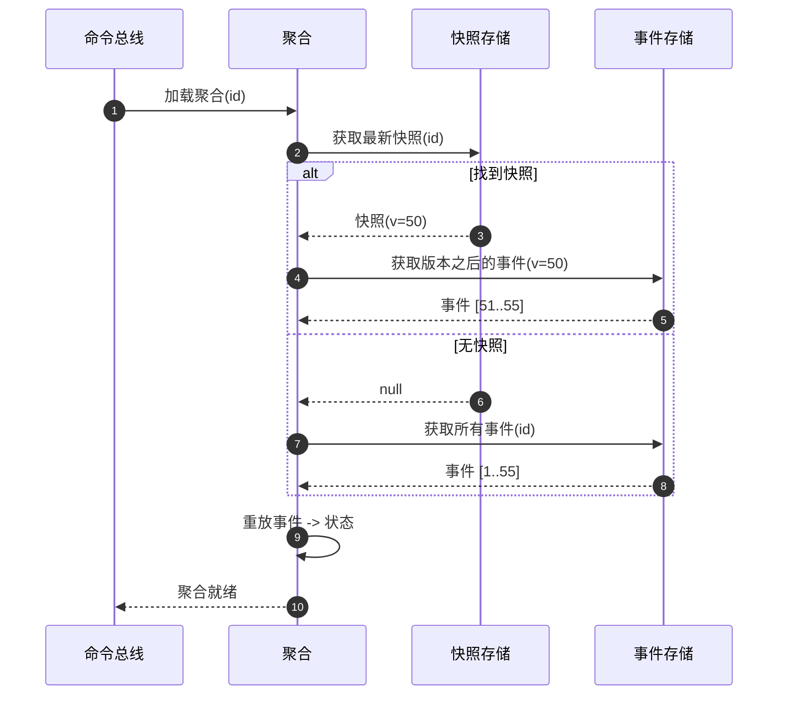
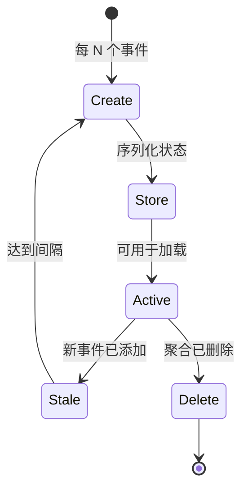

# 快照

快照是事件溯源架构中的重要优化机制，通过保存聚合根状态检查点来提升性能，减少事件重放次数。

## 快照机制

在事件溯源中，聚合根的状态通过重放所有历史事件来重建。随着事件数量的增加，重放所有事件变得越来越慢。快照机制通过定期保存聚合根的当前状态来解决此问题。

```kotlin
interface Snapshot<S : Any> : ReadOnlyStateAggregate<S>, SnapshotTimeCapable

data class SimpleSnapshot<S : Any>(
    override val delegate: ReadOnlyStateAggregate<S>,
    override val snapshotTime: Long = System.currentTimeMillis()
) : Snapshot<S>
```

## 快照加载流程

加载聚合时，首先查询快照存储。如果存在快照，则只需重放快照版本之后的事件。



<!-- Sources: wow-core/src/main/kotlin/me/ahoo/wow/event/snapshot/, wow-api/src/main/kotlin/me/ahoo/wow/api/event/snapshot/ -->

## 快照策略

快照策略决定何时创建快照。Wow 框架提供多种内置策略：

### 版本偏移策略 (VersionOffset)

当聚合根版本与上次快照版本的差值达到指定阈值时创建快照。

```kotlin
class VersionOffsetSnapshotStrategy(
    private val snapshotStore: SnapshotStore,
    private val versionOffset: Int = 5
) : SnapshotStrategy
```

### 全量策略 (All)

为每个状态事件创建快照。

```kotlin
class SimpleSnapshotStrategy(
    private val snapshotStore: SnapshotStore
) : SnapshotStrategy
```

### 无操作策略 (NoOp)

不创建任何快照。

```kotlin
object NoOp : SnapshotStrategy {
    override fun <S : Any> shouldSnapshot(stateEvent: StateEvent<S>): Boolean = false
}
```

## 快照生命周期



<!-- Sources: wow-core/src/main/kotlin/me/ahoo/wow/event/snapshot/SnapshotHandler.kt -->

## 快照存储

快照存储负责存储和检索快照。批量扫描聚合 ID 属于 `EventStore.scanAggregateId(...)`，而不是快照存储职责。

```kotlin
interface SnapshotStore : Named {
    fun <S : Any> load(aggregateId: AggregateId): Mono<Snapshot<S>>
    fun <S : Any> save(snapshot: Snapshot<S>): Mono<Void>
    fun getVersion(aggregateId: AggregateId): Mono<Int>
}

interface VersionedSnapshotStore : SnapshotStore {
    fun <S : Any> loadAtOrBefore(
        aggregateId: AggregateId,
        maxVersion: Int
    ): Mono<Snapshot<S>>

    fun <S : Any> saveCheckpoint(snapshot: Snapshot<S>): Mono<Void>
}
```

`SnapshotStore.save()` 仍只维护最新快照。`VersionedSnapshotStore` 在不改变该契约的前提下增加不可变
历史 checkpoint：读取不大于目标版本的最大 checkpoint。相同 aggregate/version 的重复写入采用
first-wins，存储错误会继续向上传播。

### 内存实现

```kotlin
class InMemorySnapshotStore : SnapshotStore {
    private val aggregateIdMapSnapshot = ConcurrentHashMap<AggregateId, String>()

    override fun <S : Any> load(aggregateId: AggregateId): Mono<Snapshot<S>> =
        Mono.fromCallable {
            aggregateIdMapSnapshot[aggregateId]?.toObject<Snapshot<S>>()
        }

    override fun <S : Any> save(snapshot: Snapshot<S>): Mono<Void> =
        Mono.fromRunnable {
            aggregateIdMapSnapshot[snapshot.aggregateId] = snapshot.toJsonString()
        }
}
```

### 支持的后端

| 后端 | 模块 | 状态 |
|---------|--------|--------|
| MongoDB | `wow-mongo` | 生产就绪 |
| Redis | `wow-redis` | 生产就绪 |

## 快照处理流程

1. **状态事件发布**：当聚合根状态变化时，发布状态事件
2. **策略评估**：快照策略评估是否需要创建快照
3. **快照创建**：如需要，创建当前状态的快照
4. **快照存储**：将快照保存到快照存储

## 配置

```yaml
wow:
  eventsourcing:
    snapshot:
      enabled: true  # 是否启用快照
      strategy: all  # 快照策略 (all, version_offset)
      version-offset: 5  # 版本偏移（仅对 version_offset 策略有效）
      checkpoint:
        enabled: false  # 默认关闭，先评估存储增长
        version-interval: 100
```

| 属性 | 默认值 | 描述 |
|----------|---------|-------------|
| `wow.eventsourcing.snapshot.enabled` | `true` | 启用最新快照 |
| `wow.eventsourcing.snapshot.checkpoint.enabled` | `false` | 启用不可变历史 checkpoint |
| `wow.eventsourcing.snapshot.checkpoint.version-interval` | `100` | checkpoint 版本间隔 |

启用后只会从新产生的匹配版本开始积累 checkpoint，不会自动回填旧历史。回滚只需关闭
`checkpoint.enabled`。MongoDB 将 checkpoint 存放在独立的
`<aggregate>_snapshot_checkpoint` sidecar。


## 聚合加载优化

快照极大地优化了聚合根的加载性能：

```kotlin
class EventSourcingOrderRepository(
    private val eventStore: EventStore,
    private val snapshotStore: SnapshotStore
) : OrderRepository {

    override fun load(orderId: String): Mono<OrderState> {
        val aggregateId = AggregateId("order", orderId)

        return snapshotStore.load<OrderState>(aggregateId)
            .flatMap { snapshot ->
                // 只重放快照版本之后的事件
                eventStore.load(aggregateId, snapshot.version + 1)
                    .collectList()
                    .map { eventStreams ->
                        val state = snapshot.state
                        eventStreams.forEach { stream ->
                            stream.events.forEach { event ->
                                state.apply(event)
                            }
                        }
                        state
                    }
            }
            .switchIfEmpty(
                // 无快照，加载所有事件
                eventStore.load(aggregateId)
                    .collectList()
                    .map { eventStreams ->
                        val state = OrderState(orderId)
                        eventStreams.forEach { stream ->
                            stream.events.forEach { event ->
                                state.apply(event)
                            }
                        }
                        state
                    }
            )
    }
}
```

## 性能影响

- **启用快照**：聚合加载时间与快照间隔成正比，而非总事件数
- **禁用快照**：每次加载都需要重放所有历史事件
- **存储成本**：需要额外的存储空间来保存快照数据

当快照间隔为 50 时，拥有 1000 个事件的聚合最多重放 49 个事件，而非全部 1000 个 -- 减少约 95%。

## 最佳实践

1. **选择合适的快照策略**：根据业务场景选择合适的快照频率
2. **监控快照效果**：定期检查快照是否显著改善了加载性能
3. **快照清理**：定期清理过期的快照以节省存储空间
4. **快照一致性**：确保快照版本与事件流的一致性
