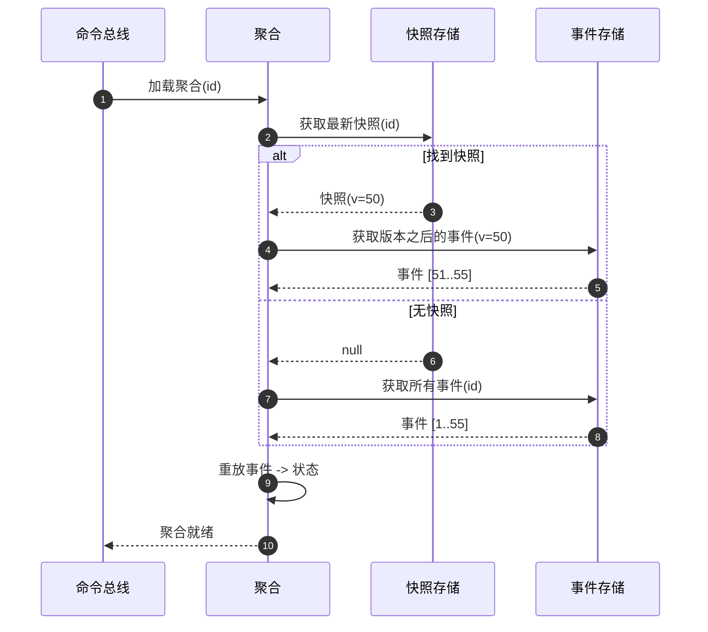
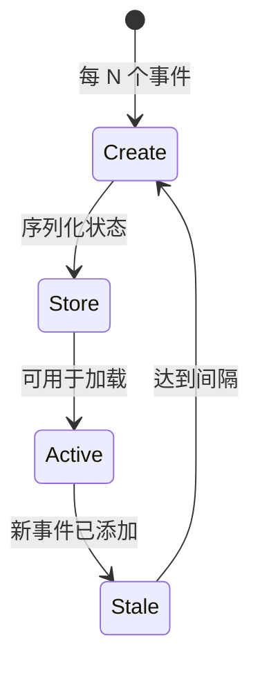
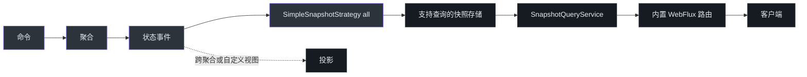

# 快照

快照通过保存聚合状态检查点来减少事件重放。采用推荐的 `all` 策略后，同一份数据还可通过 `SnapshotQueryService` 与 Wow 内置查询路由，直接作为默认的当前状态物化查询存储。

所有 Snapshot 查询入口都经过唯一 `QueryGateway`。强制租户/owner/space/ABAC 条件放在 `QueryPolicy`，脱敏放在 `ResultPolicy`；旧 Filter 迁移见 [Query Filter 迁移](./migration/query-filter-to-query-policy.md)。

## 快照机制

在事件溯源中，聚合根的状态通过重放所有历史事件来重建。随着事件数量的增加，重放所有事件变得越来越慢。快照机制通过定期保存聚合根的当前状态来解决此问题。

```kotlin
interface Snapshot<S : Any> : ReadOnlyStateAggregate<S>, SnapshotTimeCapable

data class SimpleSnapshot<S : Any>(
    override val delegate: ReadOnlyStateAggregate<S>,
    override val snapshotTime: Long = System.currentTimeMillis()
) : Snapshot<S>
```

## 快照加载流程

加载聚合时，首先查询快照存储。如果存在快照，则只需重放快照版本之后的事件。


```mermaid
sequenceDiagram
    autonumber
    participant CB as 命令总线
    participant AG as 聚合
    participant SS as 快照存储
    participant ES as 事件存储

    CB->>AG: 加载聚合(id)
    AG->>SS: 获取最新快照(id)
    alt 找到快照
        SS-->>AG: 快照(v=50)
        AG->>ES: 获取版本之后的事件(v=50)
        ES-->>AG: 事件 [51..55]
    else 无快照
        SS-->>AG: null
        AG->>ES: 获取所有事件(id)
        ES-->>AG: 事件 [1..55]
    end
    AG->>AG: 重放事件 -> 状态
    AG-->>CB: 聚合就绪
```

<!-- Sources: wow-core/src/main/kotlin/me/ahoo/wow/eventsourcing/snapshot/, wow-api/src/main/kotlin/me/ahoo/wow/api/modeling/ -->

## 快照策略

快照策略对每个状态事件作出响应，并决定是否持久化新的快照。策略契约是响应式的，
逐个处理 `StateEventExchange`，而不是返回布尔谓词：

```kotlin
interface SnapshotStrategy {
    fun onEvent(stateEventExchange: StateEventExchange<*>): Mono<Void>
}
```

Wow 框架提供以下内置策略：

### 版本偏移策略 (VersionOffset)

当聚合根版本与上次快照版本的差值达到指定阈值时创建快照。策略通过
`SnapshotStore.getVersion()` 读取已存储的版本，仅在达到偏移量时才保存，
因此快照频率与并发状态事件无关。

```kotlin
class VersionOffsetSnapshotStrategy(
    private val versionOffset: Int = DEFAULT_VERSION_OFFSET, // 5
    private val snapshotStore: SnapshotStore
) : SnapshotStrategy
```

### 全量策略 (All)

为每个状态事件保存快照。

```kotlin
class SimpleSnapshotStrategy(
    private val snapshotStore: SnapshotStore
) : SnapshotStrategy
```

### 无操作策略 (NoOp)

不创建任何快照。`NoOp` 嵌套在 `SnapshotStrategy` 接口内部作为伴生对象：

```kotlin
interface SnapshotStrategy {
    // ...
    companion object NoOp : SnapshotStrategy {
        override fun onEvent(stateEventExchange: StateEventExchange<*>): Mono<Void> = Mono.empty()
    }
}
```

## 快照生命周期


```mermaid
stateDiagram-v2
    [*] --> Create: 每 N 个事件
    Create --> Store: 序列化状态
    Store --> Active: 可用于加载
    Active --> Stale: 新事件已添加
    Stale --> Create: 达到间隔
```

<!-- Sources: wow-core/src/main/kotlin/me/ahoo/wow/eventsourcing/snapshot/SnapshotMaterializer.kt, wow-core/src/main/kotlin/me/ahoo/wow/eventsourcing/snapshot/dispatcher/SnapshotHandler.kt -->

## 快照存储

快照存储负责存储和检索快照。批量扫描聚合 ID 属于 `EventStore.scanAggregateId(...)`，而不是快照存储职责。

```kotlin
interface SnapshotStore : Named, AutoCloseable {
    fun <S : Any> load(aggregateId: AggregateId): Mono<Snapshot<S>>
    fun <S : Any> save(snapshot: Snapshot<S>): Mono<Void>
    fun getVersion(aggregateId: AggregateId): Mono<Int>
}
```

`SnapshotStore` 继承自 `AutoCloseable`。默认的 `close()` 为空操作，但存储后端
实现（以及批处理包装器）会在关闭时释放工作线程并刷新未完成的窗口；Spring 通过
正常生命周期关闭已配置的 Bean。

`SnapshotStore.save()` 以原子方式为每个聚合维护最新快照。聚合版本大于或等于
已存版本的候选快照会完整替换已存快照；只有较低版本为 no-op。同版本覆盖使快照
重建可以在聚合版本不变时修复状态。存储实现必须在同一个原子操作中完成版本比较
与写入，避免乱序状态事件导致快照版本倒退。

### 内存实现

```kotlin
class InMemorySnapshotStore : SnapshotStore {
    private val snapshots = ConcurrentHashMap<AggregateId, ObjectNode>()

    override fun <S : Any> load(aggregateId: AggregateId): Mono<Snapshot<S>> =
        Mono.defer {
            Mono.justOrEmpty(snapshots[aggregateId]?.toObject<Snapshot<S>>())
        }

    override fun <S : Any> save(snapshot: Snapshot<S>): Mono<Void> =
        Mono.fromRunnable {
            val candidate = snapshot.toJsonNode<ObjectNode>()
            val candidateVersion = candidate[MessageRecords.VERSION].asInt()
            snapshots.compute(snapshot.aggregateId) { _, stored ->
                if (
                    stored == null ||
                    candidateVersion >= stored[MessageRecords.VERSION].asInt()
                ) {
                    candidate
                } else {
                    stored
                }
            }
        }
}
```

### 支持的后端

| 后端 | 模块 | 快照存储 | 动态快照查询 |
|---------|--------|----------|--------------|
| 内存 | `wow-core` | 开发/测试 | 无内置查询工厂 |
| MongoDB | `wow-mongo` | 生产就绪 | 支持 |
| Redis | `wow-redis` | 生产就绪 | 无内置查询工厂 |
| Elasticsearch | `wow-elasticsearch` | 生产就绪 | 支持 |

## 快照处理流程

1. **状态事件发布**：当聚合根状态变化时，发布状态事件
2. **策略评估**：快照策略评估是否需要创建快照
3. **快照创建**：如需要，创建当前状态的快照
4. **快照存储**：将快照保存到快照存储

## 配置

```yaml
wow:
  eventsourcing:
    snapshot:
      enabled: true  # 是否启用快照
      strategy: all  # 快照策略 (all, version_offset)
      storage: mongo  # 快照存储后端 (mongo、redis、elasticsearch、in_memory)
```

| 属性 | 默认值 | 描述 |
|----------|---------|-------------|
| `wow.eventsourcing.snapshot.enabled` | `true` | 启用最新快照 |
| `wow.eventsourcing.snapshot.strategy` | `all` | 快照策略（`all` 或 `version_offset`） |
| `wow.eventsourcing.snapshot.version-offset` | `5` | 版本偏移阈值（仅 `version_offset` 使用） |
| `wow.eventsourcing.snapshot.storage` | `mongo` | 快照存储后端（共享 `StorageType` 枚举） |

## 将快照作为默认读模型

默认使用 `strategy: all`。`SimpleSnapshotStrategy` 会物化每个状态事件产生的状态，使快照存储在 `SNAPSHOT` 阶段完成后直接成为当前状态的实时查询存储，同时也作为聚合加载检查点。对于单一聚合类型的标准查询，这意味着无需再编写投影来复制聚合状态。

| 策略 | 存储状态 | 查询影响 | 建议 |
|---|---|---|---|
| `all` | 每个已处理状态事件都会更新最新快照 | 快照处理完成后，查询可读取最新物化聚合状态 | 推荐 |
| `version_offset` | 仅当版本差达到 `version-offset` 时写入快照 | 快照查询可能落后于聚合 | 仅在允许陈旧数据，或另有读模型承载实时查询时使用 |


```mermaid
flowchart LR
    Command[命令] --> Aggregate[聚合]
    Aggregate --> Event[状态事件]
    Event --> Strategy[SimpleSnapshotStrategy all]
    Strategy --> Store[支持查询的快照存储]
    Store --> Service[SnapshotQueryService]
    Service --> Routes[内置 WebFlux 路由]
    Routes --> Client[客户端]
    Event -. 跨聚合或自定义视图 .-> Projection[投影]

    classDef primary fill:#2d333b,stroke:#6d5dfc,color:#e6edf3
    classDef secondary fill:#161b22,stroke:#30363d,color:#e6edf3
    class Command,Aggregate,Event,Strategy primary
    class Store,Service,Routes,Client,Projection secondary
```

<!-- Sources: wow-core/src/main/kotlin/me/ahoo/wow/eventsourcing/snapshot/SimpleSnapshotStrategy.kt:19-38, wow-query/src/main/kotlin/me/ahoo/wow/query/snapshot/SnapshotQueryService.kt:30-61, wow-openapi/src/main/kotlin/me/ahoo/wow/openapi/contributor/aggregate/snapshot/SnapshotRouteContributor.kt:59-281, wow-spring-boot-starter/src/main/kotlin/me/ahoo/wow/spring/boot/starter/webflux/route/QueryRouteModule.kt:34-79 -->

启用 WebFlux 支持后，Wow 会为每个聚合生成标准快照查询端点：

| 查询形态 | 路由后缀 | 结果 |
|---|---|---|
| 计数 | `/snapshot/count` | 匹配的快照数量 |
| 列表 | `/snapshot/list` 与 `/snapshot/list/state` | 有上限的快照或状态列表 |
| 分页 | `/snapshot/paged` 与 `/snapshot/paged/state` | 分页快照或状态 |
| 单条 | `/snapshot/single` 与 `/snapshot/single/state` | 单个快照或状态 |

这些路由由 Query DSL 使用的同一个 `SnapshotQueryService` 契约提供能力；Spring 还会为每个聚合注册类型化的 `<aggregate>.SnapshotQueryService` Bean。因此，应用无需再为这些标准形态手写查询 API 端点（[SnapshotQueryService.kt:30-61](https://github.com/Ahoo-Wang/Wow/blob/main/wow-query/src/main/kotlin/me/ahoo/wow/query/snapshot/SnapshotQueryService.kt#L30-L61)、[SnapshotQueryServiceRegistrar.kt:28-61](https://github.com/Ahoo-Wang/Wow/blob/main/wow-spring/src/main/kotlin/me/ahoo/wow/spring/query/SnapshotQueryServiceRegistrar.kt#L28-L61)、[SnapshotRouteContributor.kt:59-281](https://github.com/Ahoo-Wang/Wow/blob/main/wow-openapi/src/main/kotlin/me/ahoo/wow/openapi/contributor/aggregate/snapshot/SnapshotRouteContributor.kt#L59-L281)）。

:::warning 查询能力与一致性边界
这条路径需要支持查询的后端。MongoDB 与 Elasticsearch 提供 `SnapshotQueryServiceFactory`；自定义后端必须提供对应的 binding。Redis 与内存快照存储支持持久化和加载，但自身不提供动态快照查询。租户/所有者过滤、授权与索引仍需显式设计。快照通过状态事件异步处理。使用 `strategy: all` 且查询服务绑定同一后端时，要求写后读可见性的调用方必须等待 `SNAPSHOT` 命令阶段。该阶段本身只证明快照处理完成；`version_offset` 未达到阈值时可能完成但不写入。事件流仍是真相来源。
:::

当读模型需要关联多个聚合、采用不同于聚合状态的反范式结构、服务分析场景或同步外部系统时，仍应使用投影。

## 聚合加载优化

聚合加载应复用框架的 `StateAggregateRepository`，不要在业务代码中自行组合
`SnapshotStore`、`EventStore` 和事件重放：

```kotlin
val aggregateId = namedAggregate.aggregateId(id = orderId, tenantId = tenantId)
val aggregate: Mono<StateAggregate<OrderState>> =
    stateAggregateRepository.load(aggregateId)
```

`EventSourcingStateAggregateRepository` 在加载最新版本时先尝试快照；随后从
`stateAggregate.expectedNextVersion` 开始读取 `EventStore`，并通过
`stateAggregate.onSourcing(eventStream)` 应用增量事件。查询历史版本时不会使用最新快照。

## 性能影响

- **`all` 策略**：快照处理完成后，最新快照已包含最新状态事件产生的状态
- **`version_offset` 策略**：聚合加载只需重放上次快照之后的事件，数量受配置偏移量限制
- **禁用快照**：每次加载都需要重放所有历史事件
- **存储成本**：需要额外的存储空间来保存快照数据

例如，显式选择 `strategy: version_offset` 并设置 `version-offset: 50`，可把聚合加载限制为最多重放 49 个事件，但直接快照查询也会承受同样的状态滞后。推荐的 `all` 策略优先保证当前状态查询存储，而不是减少快照写入。

## 最佳实践

1. **优先使用 `all`**：将最新快照作为默认当前状态读模型。
2. **复用查询服务与路由**：单聚合的标准 single/list/paged/count 查询无需复制状态到投影，也无需手写 Controller。
3. **选择支持查询的后端**：动态查询使用 MongoDB、Elasticsearch 或自定义 `SnapshotQueryServiceFactory`。
4. **设计查询安全与性能**：使用类生产数据验证授权、租户/所有者过滤、索引与查询计划。
5. **定义写后读行为**：使用 `all` 且查询同一可查询后端时，结果必须通过快照查询可见则等待 `SNAPSHOT`。
6. **把 `version_offset` 视为显式权衡**：仅在接受查询陈旧或已有其他当前状态读模型时使用。

`SnapshotStore` 当前没有通用删除 API；如需物理清理，必须按具体存储后端设计并验证，
不能把它当作 Wow 的框架级生命周期能力。

## 相关主题

- [生产最佳实践](./best-practices.md) -- 在完整生产检查清单中应用快照查询模式
- [查询服务](./query.md) -- 构建过滤条件并使用生成的快照查询端点
- [投影](./projection.md) -- 构建跨聚合或特定用途读模型
