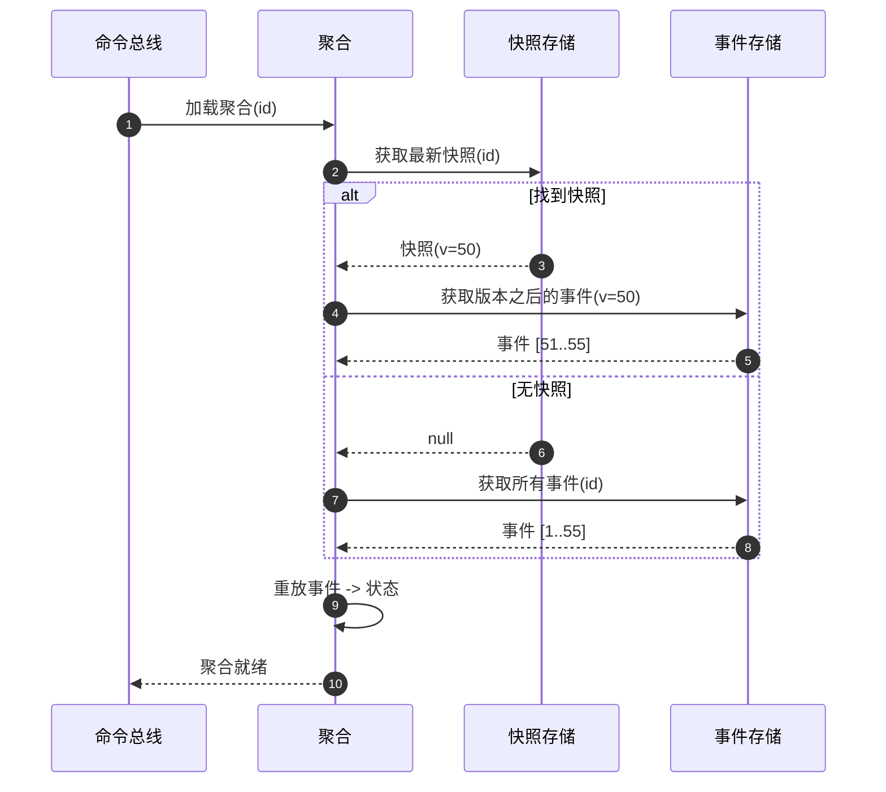
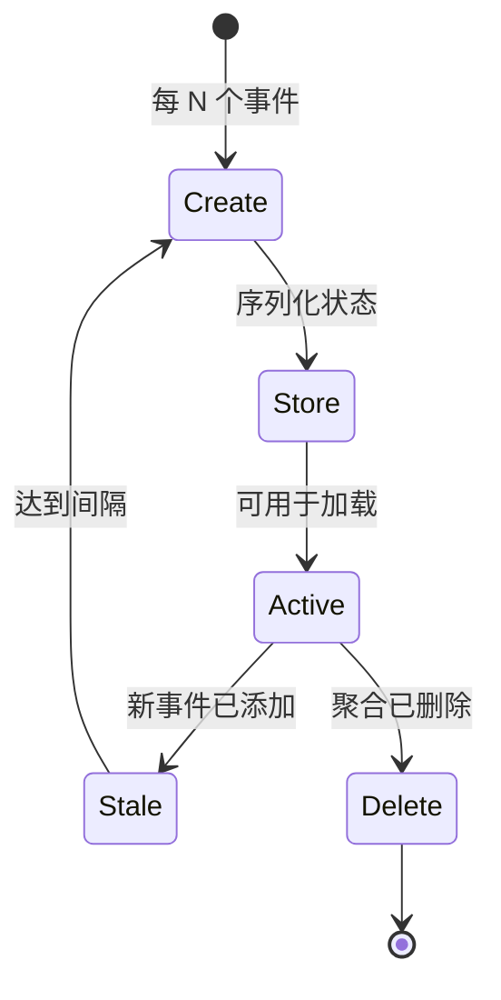

# 快照

快照是事件溯源架构中的重要优化机制，通过保存聚合根状态检查点来提升性能，减少事件重放次数。

## 快照机制

在事件溯源中，聚合根的状态通过重放所有历史事件来重建。随着事件数量的增加，重放所有事件变得越来越慢。快照机制通过定期保存聚合根的当前状态来解决此问题。

```kotlin
interface Snapshot<S : Any> : ReadOnlyStateAggregate<S>, SnapshotTimeCapable

data class SimpleSnapshot<S : Any>(
    override val delegate: ReadOnlyStateAggregate<S>,
    override val snapshotTime: Long = System.currentTimeMillis()
) : Snapshot<S>
```

## 快照加载流程

加载聚合时，首先查询快照存储。如果存在快照，则只需重放快照版本之后的事件。


```mermaid
sequenceDiagram
    autonumber
    participant CB as 命令总线
    participant AG as 聚合
    participant SS as 快照存储
    participant ES as 事件存储

    CB->>AG: 加载聚合(id)
    AG->>SS: 获取最新快照(id)
    alt 找到快照
        SS-->>AG: 快照(v=50)
        AG->>ES: 获取版本之后的事件(v=50)
        ES-->>AG: 事件 [51..55]
    else 无快照
        SS-->>AG: null
        AG->>ES: 获取所有事件(id)
        ES-->>AG: 事件 [1..55]
    end
    AG->>AG: 重放事件 -> 状态
    AG-->>CB: 聚合就绪
```

<!-- Sources: wow-core/src/main/kotlin/me/ahoo/wow/eventsourcing/snapshot/, wow-api/src/main/kotlin/me/ahoo/wow/api/modeling/ -->

## 快照策略

快照策略对每个状态事件作出响应，并决定是否持久化新的快照。策略契约是响应式的，
逐个处理 `StateEventExchange`，而不是返回布尔谓词：

```kotlin
interface SnapshotStrategy {
    fun onEvent(stateEventExchange: StateEventExchange<*>): Mono<Void>
}
```

Wow 框架提供以下内置策略：

### 版本偏移策略 (VersionOffset)

当聚合根版本与上次快照版本的差值达到指定阈值时创建快照。策略通过
`SnapshotStore.getVersion()` 读取已存储的版本，仅在达到偏移量时才保存，
因此快照频率与并发状态事件无关。

```kotlin
class VersionOffsetSnapshotStrategy(
    private val versionOffset: Int = DEFAULT_VERSION_OFFSET, // 5
    private val snapshotStore: SnapshotStore
) : SnapshotStrategy
```

### 全量策略 (All)

为每个状态事件保存快照。

```kotlin
class SimpleSnapshotStrategy(
    private val snapshotStore: SnapshotStore
) : SnapshotStrategy
```

### 无操作策略 (NoOp)

不创建任何快照。

```kotlin
companion object NoOp : SnapshotStrategy {
    override fun onEvent(stateEventExchange: StateEventExchange<*>): Mono<Void> = Mono.empty()
}
```

## 快照生命周期


```mermaid
stateDiagram-v2
    [*] --> Create: 每 N 个事件
    Create --> Store: 序列化状态
    Store --> Active: 可用于加载
    Active --> Stale: 新事件已添加
    Stale --> Create: 达到间隔
    Active --> Delete: 聚合已删除
    Delete --> [*]
```

<!-- Sources: wow-core/src/main/kotlin/me/ahoo/wow/eventsourcing/snapshot/SnapshotMaterializer.kt, dispatcher/SnapshotHandler.kt -->

## 快照存储

快照存储负责存储和检索快照。批量扫描聚合 ID 属于 `EventStore.scanAggregateId(...)`，而不是快照存储职责。

```kotlin
interface SnapshotStore : Named, AutoCloseable {
    fun <S : Any> load(aggregateId: AggregateId): Mono<Snapshot<S>>
    fun <S : Any> save(snapshot: Snapshot<S>): Mono<Void>
    fun getVersion(aggregateId: AggregateId): Mono<Int>
}
```

`SnapshotStore` 继承自 `AutoCloseable`。默认的 `close()` 为空操作，但存储后端
实现（以及批处理包装器）会在关闭时释放工作线程并刷新未完成的窗口；Spring 通过
正常生命周期关闭已配置的 Bean。

`SnapshotStore.save()` 以原子方式为每个聚合维护最新快照。聚合版本大于或等于
已存版本的候选快照会完整替换已存快照；只有较低版本为 no-op。同版本覆盖使快照
重建可以在聚合版本不变时修复状态。存储实现必须在同一个原子操作中完成版本比较
与写入，避免乱序状态事件导致快照版本倒退。

### 内存实现

```kotlin
class InMemorySnapshotStore : SnapshotStore {
    private val snapshots = ConcurrentHashMap<AggregateId, ObjectNode>()

    override fun <S : Any> load(aggregateId: AggregateId): Mono<Snapshot<S>> =
        Mono.defer {
            Mono.justOrEmpty(snapshots[aggregateId]?.toObject<Snapshot<S>>())
        }

    override fun <S : Any> save(snapshot: Snapshot<S>): Mono<Void> =
        Mono.fromRunnable {
            val candidate = snapshot.toJsonNode<ObjectNode>()
            val candidateVersion = candidate[MessageRecords.VERSION].asInt()
            snapshots.compute(snapshot.aggregateId) { _, stored ->
                if (
                    stored == null ||
                    candidateVersion >= stored[MessageRecords.VERSION].asInt()
                ) {
                    candidate
                } else {
                    stored
                }
            }
        }
}
```

### 支持的后端

| 后端 | 模块 | 状态 |
|---------|--------|--------|
| 内存 | `wow-core` | 开发/测试 |
| MongoDB | `wow-mongo` | 生产就绪 |
| Redis | `wow-redis` | 生产就绪 |
| Elasticsearch | `wow-elasticsearch` | 生产就绪 |

## 快照处理流程

1. **状态事件发布**：当聚合根状态变化时，发布状态事件
2. **策略评估**：快照策略评估是否需要创建快照
3. **快照创建**：如需要，创建当前状态的快照
4. **快照存储**：将快照保存到快照存储

## 配置

```yaml
wow:
  eventsourcing:
    snapshot:
      enabled: true  # 是否启用快照
      strategy: all  # 快照策略 (all, version_offset)
      version-offset: 5  # 版本偏移（仅对 version_offset 策略有效）
      storage: mongo  # 快照存储后端 (mongo、redis、elasticsearch、in_memory)
```

| 属性 | 默认值 | 描述 |
|----------|---------|-------------|
| `wow.eventsourcing.snapshot.enabled` | `true` | 启用最新快照 |
| `wow.eventsourcing.snapshot.strategy` | `all` | 快照策略（`all` 或 `version_offset`） |
| `wow.eventsourcing.snapshot.version-offset` | `5` | 版本偏移阈值（仅 `version_offset` 使用） |
| `wow.eventsourcing.snapshot.storage` | `mongo` | 快照存储后端（共享 `StorageType` 枚举） |


## 聚合加载优化

快照极大地优化了聚合根的加载性能：

```kotlin
class EventSourcingOrderRepository(
    private val eventStore: EventStore,
    private val snapshotStore: SnapshotStore
) : OrderRepository {

    override fun load(orderId: String): Mono<OrderState> {
        val aggregateId = AggregateId("order", orderId)

        return snapshotStore.load<OrderState>(aggregateId)
            .flatMap { snapshot ->
                // 只重放快照版本之后的事件
                eventStore.load(aggregateId, snapshot.version + 1)
                    .collectList()
                    .map { eventStreams ->
                        val state = snapshot.state
                        eventStreams.forEach { stream ->
                            stream.events.forEach { event ->
                                state.apply(event)
                            }
                        }
                        state
                    }
            }
            .switchIfEmpty(
                // 无快照，加载所有事件
                eventStore.load(aggregateId)
                    .collectList()
                    .map { eventStreams ->
                        val state = OrderState(orderId)
                        eventStreams.forEach { stream ->
                            stream.events.forEach { event ->
                                state.apply(event)
                            }
                        }
                        state
                    }
            )
    }
}
```

## 性能影响

- **启用快照**：聚合加载时间与快照间隔成正比，而非总事件数
- **禁用快照**：每次加载都需要重放所有历史事件
- **存储成本**：需要额外的存储空间来保存快照数据

当快照间隔为 50 时，拥有 1000 个事件的聚合最多重放 49 个事件，而非全部 1000 个 -- 减少约 95%。

## 最佳实践

1. **选择合适的快照策略**：根据业务场景选择合适的快照频率
2. **监控快照效果**：定期检查快照是否显著改善了加载性能
3. **快照清理**：定期清理过期的快照以节省存储空间
4. **快照一致性**：确保快照版本与事件流的一致性
