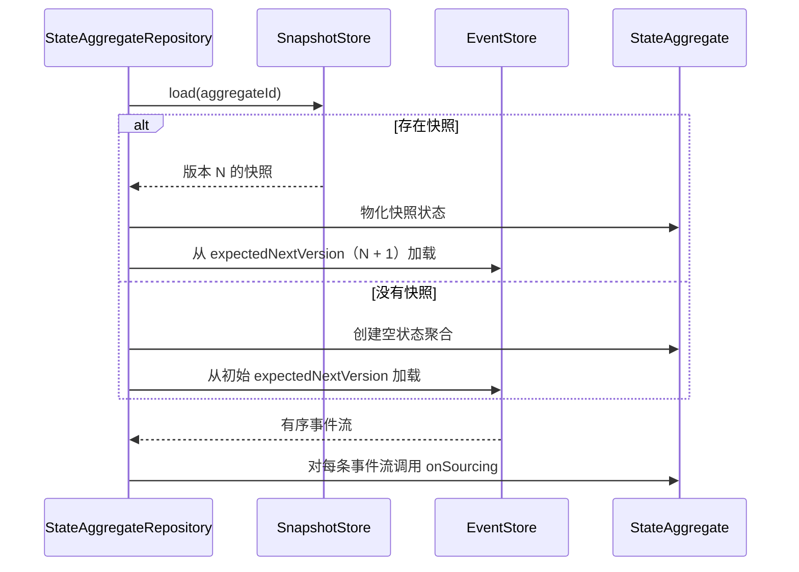
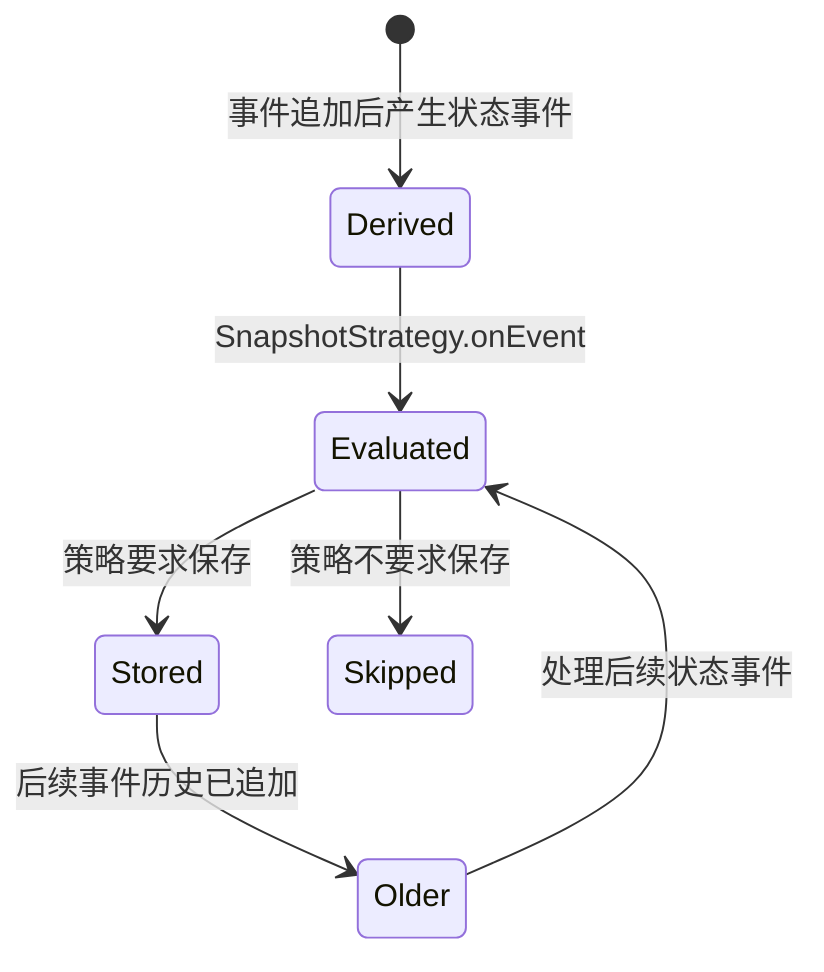
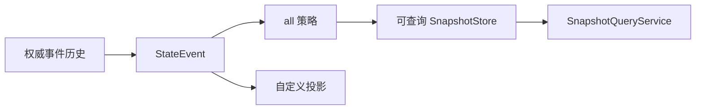

# 快照

快照是从事件历史派生的、带版本的聚合状态副本。它可以加速当前状态恢复，并可在后端支持查询时承载标准当前状态查询。它不是权威业务历史。

沿用 `CreateOrder` 示例：`PROCESSED` 证明 `OrderCreated` 已追加；之后的 `SNAPSHOT` 证明快照分发器针对结果状态事件完成了配置的策略。

## 快照机制

```kotlin
interface Snapshot<S : Any> :
    ReadOnlyStateAggregate<S>,
    SnapshotTimeCapable

data class SimpleSnapshot<S : Any>(
    override val delegate: ReadOnlyStateAggregate<S>,
    override val snapshotTime: Long = System.currentTimeMillis(),
) : Snapshot<S>
```

快照保存已知版本的状态与聚合元数据；事件存储仍保存解释该状态如何形成的事件。

## 快照加载流程

`EventSourcingStateAggregateRepository` 只在加载最新版本时使用快照：


```mermaid
sequenceDiagram
    participant R as StateAggregateRepository
    participant S as SnapshotStore
    participant E as EventStore
    participant A as StateAggregate

    R->>S: load(aggregateId)
    alt 存在快照
        S-->>R: 版本 N 的快照
        R->>A: 物化快照状态
        R->>E: 从 expectedNextVersion（N + 1）加载
    else 没有快照
        R->>A: 创建空状态聚合
        R->>E: 从初始 expectedNextVersion 加载
    end
    E-->>R: 有序事件流
    R->>A: 对每条事件流调用 onSourcing
```

历史版本/时间加载从空聚合开始重放权威事件，不会使用晚于目标时点的最新快照。

## 快照策略

`SnapshotStrategy.onEvent(StateEventExchange<*>)` 是响应式处理契约。完成表示所选策略已处理该状态事件；是否需要写入由策略决定。

### 版本偏移策略 (VersionOffset)

`VersionOffsetSnapshotStrategy` 读取已存快照版本，仅在下式成立时保存：

```text
stateEvent.version - storedSnapshotVersion >= versionOffset
```

默认偏移量是 5。未达到阈值时，策略成功完成但不会调用 `SnapshotStore.save`。因此使用该策略时，`stage: SNAPSHOT` 本身不能证明此命令写入了新快照。

### 全量策略 (All)

`SimpleSnapshotStrategy` 为每个状态事件创建 `SimpleSnapshot(stateEvent)`，并调用 `SnapshotStore.save`。使用该策略时，成功的 `SNAPSHOT` 完成包括该状态事件对应的保存操作。

快照查询作为应用标准当前状态读取路径时，这是最直接的选择。

### 无操作策略 (NoOp)

`SnapshotStrategy.NoOp` 返回 `Mono.empty()`，不会写入。它适合禁用快照或运行时明确不使用快照的场景。使用 no-op 策略时不要等待快照可见性。

## 快照生命周期


```mermaid
stateDiagram-v2
    [*] --> Derived: 事件追加后产生状态事件
    Derived --> Evaluated: SnapshotStrategy.onEvent
    Evaluated --> Stored: 策略要求保存
    Evaluated --> Skipped: 策略不要求保存
    Stored --> Older: 后续事件历史已追加
    Older --> Evaluated: 处理后续状态事件
```

快照可以滞后或重建，而不改变事件历史。快照缺失时，聚合恢复回退到事件重放。

## 快照存储

```kotlin
interface SnapshotStore : Named, AutoCloseable {
    fun <S : Any> load(aggregateId: AggregateId): Mono<Snapshot<S>>
    fun <S : Any> save(snapshot: Snapshot<S>): Mono<Void>
    fun getVersion(aggregateId: AggregateId): Mono<Int>
}
```

`save` 必须保证每个聚合的已存版本单调不减。高于或等于已存版本的候选值替换旧值；较低版本被忽略。存储实现必须按聚合原子地完成比较与写入。

该契约用于防止乱序状态事件使快照倒退。它不规定后端事务、索引、持久性或查询一致性，除非所选实现给出相应证据。

### 内存实现

`InMemorySnapshotStore` 适用于测试与单进程，且具有易失性。它可用于契约测试，但不能证明生产后端的持久性或并发实现。

### 支持的后端

| 模块 | 快照保存/加载 | 动态快照查询 |
|---|---:|---:|
| `wow-core` 内存实现 | 是 | 无内置查询工厂 |
| `wow-mongo` | 是 | 模块提供 |
| `wow-redis` | 是 | 无内置查询工厂 |
| `wow-elasticsearch` | 是 | 模块提供 |

依赖查询、原子保存或运维行为前，应验证所选模块的测试与配置。

## 快照处理流程

事件流追加且命令处理完成后：

1. 结果聚合状态由 `StateEvent` 携带；
2. `SnapshotDispatcher` 路由 exchange；
3. `SnapshotFunctionFilter` 调用配置的 `SnapshotStrategy`；
4. 策略保存或有意跳过；
5. filter chain 完成后，`SnapshotNotifierFilter` 产生 `SNAPSHOT`。

快照失败是权威事件追加之后的下游失败。恢复应从事件中重试/重建快照路径；不能为匹配一个失败缓存而伪造或修改事件历史。

## 配置

```yaml
wow:
  eventsourcing:
    snapshot:
      enabled: true
      strategy: all
      version-offset: 5
      storage: mongo
```

只有当减少快照写入足以抵偿额外重放与查询陈旧时，才选择 `version_offset`。

## 将快照作为默认读模型

使用 `strategy: all` 与支持查询的存储时，最新快照自然适合作为单一聚合类型的当前状态读模型。生成的快照查询服务/路由可覆盖 single、list、paged 与 count，无需把相同聚合状态复制到另一个投影。


```mermaid
flowchart LR
    EventHistory[权威事件历史] --> StateEvent
    StateEvent --> Strategy[all 策略]
    Strategy --> SnapshotStore[可查询 SnapshotStore]
    SnapshotStore --> Query[SnapshotQueryService]
    StateEvent --> Projection[自定义投影]
```

读模型需要关联多个聚合、拥有不同生命周期/Schema、服务分析，或同步其他系统时，使用投影。

::: warning 一致性边界
对于 `all`，等待 `SNAPSHOT` 是快照策略/保存完成的命令级证据。它仍不证明客户端缓存刷新、副本可见性、授权正确或无关投影完成。对于 `version_offset`，同一阶段可能完成而没有新写入。
:::

## 聚合加载优化

应用代码应依赖 `StateAggregateRepository`：

```kotlin
val aggregate: Mono<StateAggregate<OrderState>> =
    stateAggregateRepository.load(aggregateId)
```

Repository 负责快照选择、回退与从 `expectedNextVersion` 开始的事件重放。在应用代码中复制这套组合会形成第二套恢复算法，并可能错误使用陈旧或来自未来的检查点。

## 性能影响

| 策略 | 写入 | 最新加载重放 | 快照查询新鲜度 |
|---|---|---|---|
| `all` | 每个状态事件 | 通常只重放最新状态事件之后的事件 | 成功 `SNAPSHOT` 且后端可见后为当前状态 |
| `version_offset` | 仅达到阈值时 | 顺序处理下最多为配置间隔 | 可滞后同样的间隔 |
| no-op/禁用 | 无 | 全量事件历史 | 快照不可用 |

应使用真实聚合历史与所选后端测量。快照序列化、写入、查询索引与恢复重放都会产生成本。

## 最佳实践

1. 始终把事件历史作为恢复权威。
2. 标准当前状态快照查询重要时优先使用 `all`。
3. 只有响应确实要求快照可见时才等待 `SNAPSHOT`。
4. 解释 `SNAPSHOT` 时必须同时考虑配置的策略。
5. 在所选后端测试单调原子保存行为。
6. 从事件重建缺失/损坏快照，不要修改历史去修缓存。
7. 只有读模型与聚合状态存在实质差异时才使用投影。

`SnapshotStore` 没有通用删除 API。清理与保留属于后端特定运维工作。

## 相关主题

- [事件存储](./eventstore) -- 权威历史与聚合恢复
- [命令网关](./command-gateway) -- `PROCESSED` 与 `SNAPSHOT` 等待语义
- [查询](./query) -- 查询受支持的快照存储
- [投影](./projection) -- 自定义派生读模型
