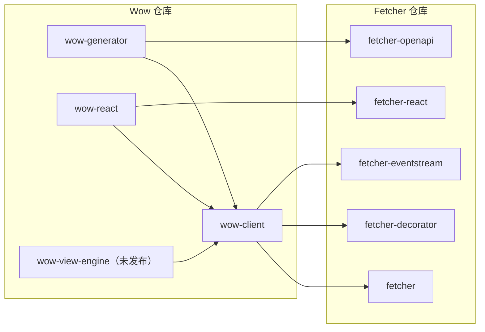

# TypeScript 客户端

本页回答：**浏览器或 Node 应用需要哪个 Wow TypeScript 包，它又依赖什么？**

Wow 仓库提供 Wow HTTP 契约的 TypeScript 端。这些包位于 [`typescript/`](https://github.com/Ahoo-Wang/Wow/tree/main/typescript)，建立在通用 HTTP 客户端 [Fetcher](https://fetcher.ahoo.me/zh/) 之上；Fetcher 保留自己的仓库和文档。

## 包

| 包 | 用途 | 状态 |
|---|---|---|
| `@ahoo-wang/wow-client` | 发送命令，读取快照与事件流，构造过滤、分页与聚合 | 已发布 |
| `@ahoo-wang/wow-generator` | 从 Wow OpenAPI 文档生成类型化模型、命令客户端和查询客户端 | 已发布；命令为 `wow-generator` |
| `@ahoo-wang/wow-react` | 在 React 组件中驱动 Wow 的单条、列表、分页、计数和流式查询 | 已发布 |
| `@ahoo-wang/wow-view-engine` | 让用户在 Wow 数据上筛选、分组、出图并保存视图 | 尚未发布 |

前三个包来自 Fetcher 仓库，原名分别是 `@ahoo-wang/fetcher-wow`、`@ahoo-wang/fetcher-generator` 以及 `@ahoo-wang/fetcher-react` 中的 Wow Hook。项目还在用旧包名时，先看[迁移指南](./migration.md)。

## 依赖关系

依赖只有一个方向：Wow 的包依赖 Fetcher 的包，反过来不行。对其他包的依赖一律是 peer 依赖，由应用自己安装并决定版本。



| peer 依赖 | 范围 |
|---|---|
| `@ahoo-wang/fetcher`、`fetcher-decorator`、`fetcher-eventstream`、`fetcher-openapi` | `^5.1 \|\| ^6` |
| `@ahoo-wang/fetcher-react`（`wow-react` 需要） | `^5.1.3 \|\| ^6` |
| `@ahoo-wang/wow-client`（其他 Wow 包需要） | 同一个小版本，`~x.y.z` |

## 版本

TypeScript 包与 Kotlin 模块共用一个版本号：例如 `@ahoo-wang/wow-client` 9.2.3 与 Wow 9.2.3 从同一个 tag 一起发布。选择与所调用 Wow 服务端相同的客户端版本，并同时升级各个 Wow 包。破坏性改动只在 `x.Y.0` 版本发布，并在[发布说明](https://github.com/Ahoo-Wang/Wow/releases)的 “Breaking” 一节列出。

在 Wow 9.x 期间，客户端和生成器仍能连接 Wow 8.x 服务端，已弃用的 `Condition` API 也继续可用；两者都在 v10 移除。

## 安装

```sh
pnpm add @ahoo-wang/fetcher @ahoo-wang/fetcher-decorator @ahoo-wang/fetcher-eventstream @ahoo-wang/wow-client
pnpm add -D @ahoo-wang/wow-generator @ahoo-wang/fetcher-openapi typescript
```

使用 React Hook 时再加上 `react`、`@ahoo-wang/fetcher-react` 和 `@ahoo-wang/wow-react`。各包的参考页给出了精确的安装命令。

## 按任务继续

| 任务 | 先读 | 再读 |
|---|---|---|
| 手写代码发送命令并读取状态 | [命令与查询](./commands-and-queries.md) | [wow-client 参考](../../reference/typescript/wow-client/) |
| 从服务端 OpenAPI 文档生成客户端 | [生成客户端](./generated-client.md) | [wow-generator 参考](../../reference/typescript/wow-generator/)和 [Wow 聚合发现](../../reference/typescript/wow-generator/wow-discovery.md) |
| 在 React 中展示查询结果 | [wow-react 查询 Hook](../../reference/typescript/wow-react/) | [快照查询](../../reference/typescript/wow-client/snapshot-queries.md) |
| 评估可保存的数据视图 | [视图引擎](./view-engine.md) | [wow-view-engine 参考](../../reference/typescript/wow-view-engine/) |
| 从 Fetcher 旧包名迁移 | [从 Fetcher 包迁移](./migration.md) | 各包的参考页 |

这些契约的服务端见[命令](../command/)、[查询](../query.md)和 [Open API](../open-api.md)。拦截器、取消、服务端推送事件等通用 Fetcher 主题仍在 [fetcher.ahoo.me](https://fetcher.ahoo.me/zh/)。

查询 Hook 与视图引擎的 Storybook 交互示例稍后随视图引擎一起上线。
