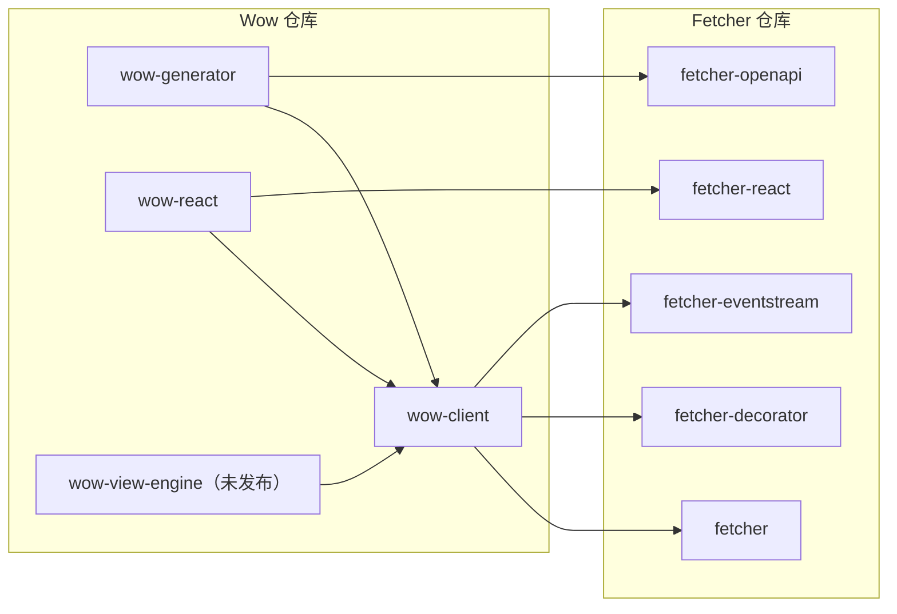

# TypeScript 客户端

本页回答：**浏览器或 Node 应用需要哪个 Wow TypeScript 包，它又依赖什么？**

Wow 仓库提供 Wow HTTP 契约的 TypeScript 端。这些包位于 [`typescript/`](https://github.com/Ahoo-Wang/Wow/tree/main/typescript)，建立在通用 HTTP 客户端 [Fetcher](https://fetcher.ahoo.me/zh/) 之上；Fetcher 保留自己的仓库和文档。

## 包

| 包 | 用途 | 状态 |
|---|---|---|
| `@ahoo-wang/wow-client` | 发送命令，读取快照与事件流，构造过滤、分页与聚合 | 随 Wow 9.2.0 发布 |
| `@ahoo-wang/wow-generator` | 从 Wow OpenAPI 文档生成类型化模型、命令客户端和查询客户端 | 随 Wow 9.2.0 发布；命令为 `wow-generator` |
| `@ahoo-wang/wow-react` | 在 React 组件中驱动 Wow 的单条、列表、分页、计数和流式查询 | 随 Wow 9.2.0 发布 |
| `@ahoo-wang/wow-view-engine` | 让用户在 Wow 数据上筛选、按维度与指标分析、出图并保存视图 | 尚未发布 |

这三个包的首个版本是 Wow 9.2.0；在它发布之前尚未上 npm，`pnpm add` 会返回 `E404`。发布状态、支持的服务端与运行环境、CI 验证了什么，见[兼容性与版本](./compatibility.md)。

前三个包来自 Fetcher 仓库，原名分别是 `@ahoo-wang/fetcher-wow`、`@ahoo-wang/fetcher-generator` 以及 `@ahoo-wang/fetcher-react` 中的 Wow Hook。项目还在用旧包名时，先看[迁移指南](./migration.md)。

## 依赖关系

依赖只有一个方向：Wow 的包依赖 Fetcher 的包，反过来不行。对其他包的依赖一律是 peer 依赖，由应用自己安装并决定版本。



| peer 依赖 | 范围 |
|---|---|
| `@ahoo-wang/fetcher`、`fetcher-decorator`、`fetcher-eventstream`、`fetcher-openapi` | `^5.1.4 \|\| ^6` |
| `@ahoo-wang/fetcher-react`（`wow-react` 需要） | `^5.1.4 \|\| ^6` |
| `react`、`react-dom`（`wow-react` 需要） | `^19.3.0`，不支持 React 18 |
| `@ahoo-wang/wow-client`（其他 Wow 包需要） | 同一个小版本，`~x.y.z` |

## 版本

TypeScript 包与 Kotlin 模块共用一个版本号，从同一个 tag 发布：`@ahoo-wang/wow-client` 9.2.0 与 Wow 9.2.0 一起发布。一个应用的所有 Wow 包使用同一个版本，最好就是所调用服务的版本。破坏性改动只在 `x.Y.0` 版本发布，并在[发布说明](https://github.com/Ahoo-Wang/Wow/releases)的 “Breaking” 一节列出。

支持的服务端：Wow 8.11 及以后通过 `filter` API，Wow 8.10 通过 `@ahoo-wang/wow-client/legacy`（已弃用的 `Condition` API）。CI 用同一提交构建的服务端运行客户端，并对 Wow 8.11.5 做冒烟测试；对 Wow 8.10.8 只检查生成代码的类型。两条 8.x 线和 `/legacy` 都在 v10 移除。详情见[兼容性矩阵](./compatibility.md)，其中也列出了 Node.js（22.12 或更高）、React（19.3 或更高）与 TypeScript 的要求。

## 安装

```sh
pnpm add @ahoo-wang/fetcher @ahoo-wang/fetcher-decorator @ahoo-wang/fetcher-eventstream @ahoo-wang/wow-client
pnpm add -D @ahoo-wang/wow-generator @ahoo-wang/fetcher-openapi typescript
```

使用 React Hook 时再加上 `react`、`react-dom`、`@ahoo-wang/fetcher-react` 和 `@ahoo-wang/wow-react`。`wow-react` 需要 React 19.3 或更高版本：它用 React Compiler 构建，会导入 React 18 没有的 `react/compiler-runtime`。各包的参考页给出了精确的安装命令。

## 按任务继续

| 任务 | 先读 | 再读 |
|---|---|---|
| 第一次从 TypeScript 调用 Wow 服务 | [快速开始](./quick-start.md) | [wow-generator 参考](../../reference/typescript/wow-generator/)和 [Wow 聚合识别](../../reference/typescript/wow-generator/wow-discovery.md) |
| 用用户的令牌签名请求，填入租户与所有者 | [认证与拦截器](./authentication.md) | [身份与资源归属](../../reference/typescript/wow-client/identity-and-attribution.md) |
| 处理失败的命令、查询与流 | [错误处理](./error-handling.md) | [错误参考](../../reference/typescript/wow-client/errors-and-utilities.md) |
| 不用生成代码，手写代码发送命令并读取状态 | [命令与查询](./commands-and-queries.md) | [wow-client 参考](../../reference/typescript/wow-client/) |
| 为不来自 Wow 的 OpenAPI 文档生成客户端 | [从任意 OpenAPI 文档生成客户端](./generated-client.md) | [生成结果](../../reference/typescript/wow-generator/generated-output.md) |
| 让生成代码与服务保持一致 | [在 CI 中重新生成](./regenerate-in-ci.md) | [生成器 CLI](../../reference/typescript/wow-generator/cli.md) |
| 在服务端、Node.js 或 Next.js 中运行 | [SSR 与 Node.js](./ssr-and-node.md) | [兼容性与版本](./compatibility.md) |
| 在 React 中展示查询结果 | [wow-react 查询 Hook](../../reference/typescript/wow-react/) | [快照查询](../../reference/typescript/wow-client/snapshot-queries.md) |
| 评估可保存的数据视图 | [视图引擎](./view-engine.md) | [wow-view-engine 参考](../../reference/typescript/wow-view-engine/) |
| 从 Fetcher 旧包名迁移 | [从 Fetcher 包迁移](./migration.md) | 各包的参考页 |
| 找出失败原因 | [排障](./troubleshooting.md) | [错误处理](./error-handling.md) |

这些契约的服务端见[命令](../command/)、[查询](../query.md)和 [Open API](../open-api.md)。拦截器内部机制、取消、服务端推送事件等通用 Fetcher 主题仍在 [fetcher.ahoo.me](https://fetcher.ahoo.me/zh/)。

## 在 Storybook 中试用

[Storybook](/storybook/) 用内存夹具运行查询 Hook 和视图引擎，下面每个示例都不需要服务端。Storybook 只有中文。

| 示例 | 展示内容 |
|---|---|
| [Wow 查询 Hook](/storybook/?path=/docs/react-hooks-wow-queries--docs) | 通过 `wow-react` 的 Hook 执行单条、列表、分页、计数和流式查询 |
| [视图引擎首页](/storybook/?path=/docs/view-engine-首页--docs) | 用嵌入仪表盘搭成的宿主应用落地页 |
| [记录视图工作台](/storybook/?path=/docs/view-engine-数据视图-record-工作台--docs) | 筛选、排序、列、分页和可保存的记录视图 |
| [分析工作台](/storybook/?path=/docs/view-engine-分析视图-分析工作台--docs) | 维度、指标、图表和带合计行的表格 |
| [仪表盘](/storybook/?path=/docs/view-engine-仪表盘视图-dashboard--docs) | 面板、整板筛选和跨仪表盘跳转 |
