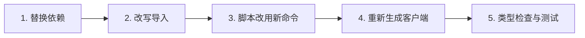

# 从 Fetcher 包迁移

本页回答：**使用 `@ahoo-wang/fetcher-wow`、`@ahoo-wang/fetcher-generator` 或 `@ahoo-wang/fetcher-react` 中 Wow Hook 的应用需要改什么？**

Wow 的 TypeScript 包已从 [Fetcher 仓库](https://github.com/Ahoo-Wang/fetcher)迁入 Wow 仓库，这样 Kotlin 契约、TypeScript 客户端和生成器可以在一个 PR 里改完、一起发布。导出的 API 没有变化，变化的是包名、命令名、peer 依赖范围和版本线。

## 变化一览

| 原来 | 现在 | 说明 |
|---|---|---|
| `@ahoo-wang/fetcher-wow` | `@ahoo-wang/wow-client` | 导出不变，包括 `/query/locale/en_US` 和 `/query/locale/zh_CN` 子路径 |
| `@ahoo-wang/fetcher-generator` | `@ahoo-wang/wow-generator` | 命令改名为 `wow-generator`；`fetcher-generator` 作为别名保留到 v10 |
| `@ahoo-wang/fetcher-react` 中的 Wow Hook | `@ahoo-wang/wow-react` | `useSingleQuery`、`useListQuery`、`usePagedQuery`、`useCountQuery`、`useListStreamQuery` 及对应的 `useFetcher*` 版本 |
| Fetcher 5.x 版本线 | Wow 版本线 | `wow-client` 9.x.y 与 Wow 9.x.y 一起发布 |
| `@ahoo-wang/fetcher-view-engine`（从未发布） | `@ahoo-wang/wow-view-engine` | 尚未发布，见[视图引擎](./view-engine.md) |

Fetcher 的核心包保留原名，文档仍在 [fetcher.ahoo.me](https://fetcher.ahoo.me/zh/)：`fetcher`、`fetcher-decorator`、`fetcher-eventstream`、`fetcher-openapi`、`fetcher-react` 和 `fetcher-cosec`。`@ahoo-wang/fetcher-viewer` 与 `fetcher-react` 的 `dataMonitor` Hook 没有迁移，留在 Fetcher 5.x。

## 步骤



### 1. 替换依赖

先升级 Fetcher 的 peer 依赖：`@ahoo-wang/fetcher-react` 必须是 5.1.3 或更高版本，因为 `wow-react` 只从它的 `/core` 和 `/fetcher` 子路径导入。然后替换迁走的包：

```sh
pnpm remove @ahoo-wang/fetcher-wow @ahoo-wang/fetcher-generator
pnpm add @ahoo-wang/wow-client
pnpm add -D @ahoo-wang/wow-generator
# 仅当应用使用 Wow 查询 Hook 时
pnpm add @ahoo-wang/wow-react
```

| 包 | peer 依赖 | 范围 |
|---|---|---|
| `wow-client` | `fetcher`、`fetcher-decorator`、`fetcher-eventstream` | `^5.1 \|\| ^6` |
| `wow-generator` | `fetcher`、`fetcher-decorator`、`fetcher-eventstream`、`fetcher-openapi` | `^5.1 \|\| ^6` |
| `wow-generator`、`wow-react` | `wow-client` | `~x.y.z`，即同一个小版本 |
| `wow-react` | `fetcher-react` | `^5.1.3 \|\| ^6` |
| `wow-react` | `fetcher`、`fetcher-eventstream`、`react` | 以包声明为准 |

从 `fetcher-react` 5.1.3 起，它对 `fetcher-wow` 的 peer 依赖是可选的，所以移除 `fetcher-wow` 后依赖图里只剩一份 Wow 类型。只有其他依赖仍然需要 `fetcher-wow` 时才保留它，并且不要在同一个应用里同时从两个包导入 Wow 类型：两套类型不能互换。

### 2. 改写导入

替换模块名即可，符号名不变。

```ts
// 迁移前
import { CommandClient, filter, pagedQuery } from '@ahoo-wang/fetcher-wow';
import { zh_CN } from '@ahoo-wang/fetcher-wow/query/locale/zh_CN';
import { usePagedQuery, useFetcher } from '@ahoo-wang/fetcher-react';

// 迁移后
import { CommandClient, filter, pagedQuery } from '@ahoo-wang/wow-client';
import { zh_CN } from '@ahoo-wang/wow-client/query/locale/zh_CN';
import { usePagedQuery } from '@ahoo-wang/wow-react';
import { useFetcher } from '@ahoo-wang/fetcher-react';
```

只有五个 Wow 查询 Hook 及其 `useFetcher*` 版本迁到了 `wow-react`。`useFetcher`、`useQuery`、`useFetcherQuery` 等其余 Hook 仍在 `@ahoo-wang/fetcher-react`。搜索 `fetcher-wow` 和这十个 Hook 名，就能找到所有要改的行。

### 3. 脚本改用新命令

```json
{
  "scripts": {
    "generate": "wow-generator generate -i ./openapi.json -o ./src/generated -t ./tsconfig.json"
  }
}
```

v10 之前 `fetcher-generator` 命令仍作为 `wow-generator` 的别名可用，所以完成第 1 步后，没改的脚本照样能跑。已有的命令选项不变。

把可选配置文件从 `fetcher-generator.config.json` 改名为 `wow-generator.config.json`。v10 之前，新文件名不存在时仍会读取旧名，并给出弃用警告。所有权清单改名为 `.wow-generator.json`：第一次重新生成会读取已有的 `.fetcher-generator.json`，照常清理过时文件，然后用新清单替换它；请提交新清单。

配置读不到、解析不了或选项形状不对时，现在会以退出码 3 失败，而不是被忽略；http(s) 输入返回非 2xx 状态时以退出码 2 失败。检查退出码的脚本能看到这些失败，见 [CLI 退出码](../../reference/typescript/wow-generator/cli.md#失败与退出码)。

### 4. 重新生成客户端

生成的代码改为从 `@ahoo-wang/wow-client` 而不是 `@ahoo-wang/fetcher-wow` 导入 Wow 类型。因此移除 `fetcher-wow` 后，由 `fetcher-generator` 生成的代码无法通过编译。用同一份 OpenAPI 文档重新生成：

```sh
pnpm exec wow-generator generate -i ./openapi.json -o ./src/generated -t ./tsconfig.json
```

检查 diff。除导入模块名外，9.x 生成器还会带来下列预期内的变化：

- 每个文件以 `// Code generated by wow-generator. DO NOT EDIT.` 开头，使用单引号，相对导入带 `.js` 扩展名。
- 方法以 operationId 的最后一段命名（`example.cart.add_cart_item` → `addCartItem`），不再取尚未被占用的最短后缀。方法名因此改变时，可以在[配置](../../reference/typescript/wow-generator/configuration.md)的 `apiClients[tag].methodNames` 中保留旧名。
- 命令客户端把构造器收到的 `apiMetadata` 合并到默认值之上，所以 `new CartCommandClient({ fetcher })` 保留限界上下文的基础路径。原先不带这个前缀直接访问服务的代码，现在需要传 `basePath: ''`。
- 查询客户端工厂的 `aggregateName` 是聚合的路由段，字段类型为 `` `${CartAggregatedFields}` ``。标注为 `ListQuery` 或 `FilterListQuery` 的查询需要写明字段类型：`` ListQuery<`${CartAggregatedFields}`> ``。
- 不是来自 Wow 的文档，其 API 客户端保留 `tenantId` 和 `ownerId` 路径参数；只有 Wow 文档默认把它们交给拦截器。

其他差异都属于生成器的变化，要像审查契约变更一样审查。请重新生成，不要手工改生成文件里的导入：这些文件归生成器所有，见[生成输出与重新生成](../../reference/typescript/wow-generator/generated-output.md)。

### 5. 类型检查与测试

```sh
pnpm exec tsc --noEmit
pnpm test
```

移除包之后，残留的 `@ahoo-wang/fetcher-wow` 导入会让类型检查失败。还要对真实的 Wow 服务端跑一遍应用的集成测试：类型检查不能证明路由和命令阶段的行为与之前一致。

## 此后的版本规则

- Wow 的 TypeScript 包跟随 Wow 发版。选择与 Wow 服务端一致的版本，并同时升级 `wow-client`、`wow-generator` 和 `wow-react`；它们之间以 `~x.y.z` 互相声明。
- 破坏性改动只在 `x.Y.0` 版本发布，发布说明逐条列出并写明迁移方法。
- 在 Wow 9.x 期间，客户端和生成器仍能连接 Wow 8.x 服务端，`fetcher-generator` 别名和 `fetcher-generator.config.json` 回退读取可用，已弃用的 `Condition` API 也可用。它们都在 v10 移除；在此之前请改用 `FilterExpression` 和 `filter.*` 构造器，见[过滤器](../../reference/typescript/wow-client/filters.md)。
- 新功能只进 Wow 的包。Fetcher 保留 5.x 分支只做修复，计划在 Fetcher 6.0 发布时对 `fetcher-wow` 和 `fetcher-generator` 执行 npm deprecate。

## 检查清单

| 检查项 | 完成标准 |
|---|---|
| 依赖 | `package.json` 中已没有 `fetcher-wow` 和 `fetcher-generator`，用到 `fetcher-react` 的地方版本不低于 5.1.3 |
| 导入 | 没有源文件导入 `@ahoo-wang/fetcher-wow`，Wow 查询 Hook 从 `@ahoo-wang/wow-react` 导入 |
| 生成代码 | 已用 `wow-generator` 重新生成，生成文件导入的是 `@ahoo-wang/wow-client` |
| 版本 | `wow-client`、`wow-generator`、`wow-react` 处于同一个小版本，并与 Wow 服务端一致 |
| 验证 | 类型检查以及针对真实 Wow 服务端的集成测试通过 |
