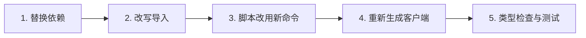

# 从 Fetcher 包迁移

本页回答：**使用 `@ahoo-wang/fetcher-wow`、`@ahoo-wang/fetcher-generator` 或 `@ahoo-wang/fetcher-react` 中 Wow Hook 的应用需要改什么？**

Wow 的 TypeScript 包已从 [Fetcher 仓库](https://github.com/Ahoo-Wang/fetcher)迁入 Wow 仓库，这样 Kotlin 契约、TypeScript 客户端和生成器可以在一个 PR 里改完、一起发布。变化的是包名、命令名、peer 依赖范围和版本线；已弃用的 `Condition` API 挪到了 `@ahoo-wang/wow-client/legacy` 子路径；`wow-client` 的首个版本还改动了一组 API——错误、命令头、取消参数、聚合构造器——列在[首个版本的 API 变化](#首个版本的-api-变化)中。

## 变化一览

| 原来 | 现在 | 说明 |
|---|---|---|
| `@ahoo-wang/fetcher-wow` | `@ahoo-wang/wow-client` | 见[API 变化](#首个版本的-api-变化)；另外已弃用的 `Condition` API（`Condition` 构造器、`Operator`、基于 `Condition` 的查询类型与工厂函数）和 `en_US` / `zh_CN` 操作符文案挪到了 `@ahoo-wang/wow-client/legacy`；`/query/locale/en_US` 和 `/query/locale/zh_CN` 子路径已不存在 |
| `@ahoo-wang/fetcher-generator` | `@ahoo-wang/wow-generator` | 命令改名为 `wow-generator`；`fetcher-generator` 作为别名保留到 v10 |
| `@ahoo-wang/fetcher-react` 中的 Wow Hook | `@ahoo-wang/wow-react` | `useSingleQuery`、`useListQuery`、`usePagedQuery`、`useCountQuery`、`useListStreamQuery` 及对应的 `useFetcher*` 版本 |
| Fetcher 5.x 版本线 | Wow 版本线 | `wow-client` 9.x.y 与 Wow 9.x.y 一起发布 |
| `@ahoo-wang/fetcher-view-engine`（从未发布） | `@ahoo-wang/wow-view-engine` | 尚未发布，见[视图引擎](./view-engine.md) |

Fetcher 的核心包保留原名，文档仍在 [fetcher.ahoo.me](https://fetcher.ahoo.me/zh/)：`fetcher`、`fetcher-decorator`、`fetcher-eventstream`、`fetcher-openapi`、`fetcher-react` 和 `fetcher-cosec`。`@ahoo-wang/fetcher-viewer` 与 `fetcher-react` 的 `dataMonitor` Hook 没有迁移，留在 Fetcher 5.x。

## 步骤



### 1. 替换依赖

先升级 peer 依赖：`wow-react` 需要 React 19.3 或更高版本（`react` 为 `^19.3.0`），不支持 React 18。它不再需要 `@ahoo-wang/fetcher-react`：只有还要用它的其他 Hook 时才保留，并且版本不低于 5.1.5，这样它对 `fetcher-wow` 的 peer 依赖是可选的。然后替换迁走的包：

```sh
pnpm remove @ahoo-wang/fetcher-wow @ahoo-wang/fetcher-generator
pnpm add @ahoo-wang/wow-client
pnpm add -D @ahoo-wang/wow-generator
# 仅当应用使用 Wow 查询 Hook 时
pnpm add react react-dom @ahoo-wang/wow-react
```

| 包 | peer 依赖 | 范围 |
|---|---|---|
| `wow-client` | `fetcher`、`fetcher-decorator`、`fetcher-eventstream` | `^5.1.5 \|\| ^6` |
| `wow-generator` | `fetcher`、`fetcher-decorator`、`fetcher-eventstream`、`fetcher-openapi` | `^5.1.5 \|\| ^6` |
| `wow-generator`、`wow-react` | `wow-client` | `~x.y.z`，即同一个小版本 |
| `wow-react` | `fetcher`、`fetcher-eventstream` | `^5.1.5 \|\| ^6` |
| `wow-react` | `react` | `^19.3.0`，不支持 React 18 |

应用仍在使用 `fetcher-react` 时，5.1.3 起它对 `fetcher-wow` 的 peer 依赖是可选的，所以移除 `fetcher-wow` 后依赖图里只剩一份 Wow 类型。只有其他依赖仍然需要 `fetcher-wow` 时才保留它，并且不要在同一个应用里同时从两个包导入 Wow 类型：两套类型不能互换。

### 2. 改写导入

先替换模块名，再按下文的[API 变化](#首个版本的-api-变化)修改调用。已弃用的 `Condition` API 和操作符文案从 `@ahoo-wang/wow-client/legacy` 导入，其余一切从根入口导入。

<!-- typecheck: skip — 迁移前后对照；“迁移前”一半导入已移除的 fetcher-wow -->

```ts
// 迁移前
import { CommandClient, filter, pagedQuery } from '@ahoo-wang/fetcher-wow';
import { zh_CN } from '@ahoo-wang/fetcher-wow/query/locale/zh_CN';
import { usePagedQuery, useFetcher } from '@ahoo-wang/fetcher-react';

// 迁移后
import { CommandClient, filter, pagedQuery } from '@ahoo-wang/wow-client';
import { zh_CN } from '@ahoo-wang/wow-client/legacy';
import { usePagedQuery } from '@ahoo-wang/wow-react';
import { useFetcher } from '@ahoo-wang/fetcher-react';
```

只有五个 Wow 查询 Hook 及其 `useFetcher*` 版本迁到了 `wow-react`。`useFetcher`、`useQuery`、`useFetcherQuery` 等其余 Hook 仍在 `@ahoo-wang/fetcher-react`。搜索 `fetcher-wow` 和这十个 Hook 名，就能找到所有要改的行。

两个列表流 Hook 的形态变了。`useListStreamQuery` 与 `useFetcherListStreamQuery` 不再把 `ReadableStream` 放进 `result` 交给组件读取，而是自己读取，以 `items` 返回已收到的行，流结束后 `done` 为 true；新查询、`abort()`、`reset()` 和组件卸载时都会取消流。删掉调用 `getReader()` 的 effect，直接渲染 `items`。`useFetcherListStreamQuery` 现在会发送 `Accept: text/event-stream`（缺少它时 Wow 服务端返回 JSON），并且不再接受 `resultExtractor`；流中出现错误事件时，`error` 是一个 `WowError`。

这些 Hook 的选项与返回类型现在由 `wow-react` 自己声明，不再扩展 `fetcher-react` 的 `UseQueryOptions`、`UseQueryReturn` 和 `UseFetcherQueryOptions`。下表各项都能由类型检查找出。

| `@ahoo-wang/fetcher-react` 中的 Wow Hook | `@ahoo-wang/wow-react` |
|---|---|
| `status` 是 fetcher-react 的 `PromiseStatus` 枚举，用 `PromiseStatus.SUCCESS` 比较 | `status` 是 `QueryStatus`，即字符串联合 `'idle' \| 'loading' \| 'success' \| 'error'`：直接用字符串字面量比较和赋值 |
| `E` 默认为 `FetcherError`，列表流为 `FetcherError \| WowError` | `E` 默认为 `Error`，因为自定义 `execute` 可能以任何错误拒绝。读取 `error.exchange` 的代码显式传入 `FetcherError` 作为 `E`，或用 `instanceof FetcherError` 收窄 |
| 选项 `initialStatus`、`propagateError`、`onAbort`，以及 `useFetcher*` 请求型 Hook 的 `resultExtractor` | 已删除。失败从 `error` 或 `onError` 读取；需要别的提取方式时，改用 `use*Query` Hook 并自己提供 `execute` |
| `attributes` 为 `Record<string, any> \| Map<string, any>` | `Record<string, unknown>`，与 wow-client 查询方法接受的类型一致 |
| 为 props、测试或 story 标类型而从 `@ahoo-wang/fetcher-react` 导入的选项与返回类型 | 从 `@ahoo-wang/wow-react` 导入 `QueryHookOptions`、`QueryHookReturn`、`QueryStatus` 和 `QueryExecutor` |

这些 Hook 也改为运行在 `wow-react` 自己的请求状态机上，不再用 fetcher-react 的。下面这些变化类型检查找不出来，依赖旧行为的代码需要逐处核对。

| `@ahoo-wang/fetcher-react` 中的 Wow Hook | `@ahoo-wang/wow-react` |
|---|---|
| 请求失败和 `abort()` 都会清空 `result` | 两者都保留上一次结果，刷新失败不会让界面变空白；只有 `reset()` 清空。为此自己保存「上一次成功结果」的组件可以删掉那份副本 |
| `reset()` 不中止进行中的请求，迟到的响应仍会写回 `result` 或 `error`，并调用 `onSuccess` 或 `onError` | `reset()` 中止该请求，它的任何结果都不会再到达 |
| `useFetcher*` Hook 的 `url` 变化要等下一次执行才生效 | `url` 变化会重新执行查询 |
| 请求型 Hook 每遇到新的 `fetcher` 实例就重跑，所以在渲染里写 `new Fetcher()` 会无限请求；流型 Hook 要等下一次执行 | 所有 `useFetcher*` Hook 在 Fetcher 的名字（没有名字时是 `baseURL`）变化时重跑；在渲染里写 `new Fetcher({ baseURL })` 只发一次请求 |
| `fetcher` 是未注册的名字时，请求型 Hook 在渲染时抛错 | 该次请求失败，`error` 给出原因 |
| 挂载即执行的 Hook，首帧（服务端也一样）是 `idle` | 首帧是 `loading`，服务端与客户端一致，骨架屏从第一帧就能显示 |

`Condition` API 挪到 `/legacy` 之后，根入口的 `singleQuery`、`listQuery`、`pagedQuery` 构造的内容也变了：它们接收 `filter` 而不是 `condition`，`filter` 默认为 `filter.matchAll()`。传了 `condition` 的调用，要改用 `/legacy` 里的同名工厂函数，或者用 `filter.*` 改写。

#### 首个版本的 API 变化

`@ahoo-wang/wow-client` 的首个版本也借机修正了 `fetcher-wow` 无法修改的 API。下表除最后一行的流行为外，都能由类型检查找出所有调用点。

| `@ahoo-wang/fetcher-wow` | `@ahoo-wang/wow-client` |
|---|---|
| `ErrorCodes.isSucceeded(code)` / `ErrorCodes.isError(code)` | 已删除：改为比较 `code === ErrorCodes.SUCCEEDED`。`ErrorCodes` 由类改为冻结的 `as const` 对象，并补充了查询 schema 与批处理错误码；`SUCCEEDED_MESSAGE`、`NOT_FOUND_MESSAGE` 已删除。`ErrorInfo.errorCode` 的类型是 `ErrorCode`（Wow 的错误码或任意其他字符串）。 |
| 手工读取失败请求的错误响应体 | `await toWowError(error)` 返回 `WowError`（`errorCode`、`errorMsg`、`bindingErrors`、`status`），Wow 没有应答时返回 `undefined`；`isErrorInfo(value)` 是类型守卫。参见[错误](../../reference/typescript/wow-client/errors-and-utilities.md)。 |
| `CommandHeaders` / `WowHeaders` 类 | 冻结的 `as const` 对象；`CommandHeaders.WAIT_STAGE` 等成员写法不变，但每个值现在是字面量类型。 |
| 所有头都必填且为 `string` 的 `CommandRequestHeaders` | 所有头可选并带类型：等待阶段是 `CommandStage` 名称，`Command-Aggregate-Version` 与 `Command-Wait-Timeout` 是整数字符串，`Command-Local-First` 是 `'true'` 或 `'false'`。用 `commandHeaders({ … })` 与 `waitStrategy({ … })` 构造，后者也支持等待链（`tail`）。 |
| `new CommandClient<C>(metadata)` | `new CommandClient(metadata)`；命令体类型移到调用处：`send<C>(request)`、`sendAndWaitStream<C>(request)`。 |
| 查询方法最后一个参数 `abortController?: AbortController` | 所有查询与加载方法改为 `abort?: AbortController \| AbortSignal`，可传入 `AbortSignal.timeout(ms)` 或数据请求库的 `signal`。传控制器的调用仍能编译；实现 `QueryApi` 或 `SnapshotQueryApi` 的类需要更新签名。`attributes` 的类型为 `Record<string, unknown>`。 |
| `terms(field, alias, missingKey?)` | `terms(field, alias, { missingKey })` |
| `histogram(field, { interval, alias })` | `histogram(field, alias, { interval })` |
| `dateHistogram(field, { unit, alias, timeZone?, dense? })` | `dateHistogram(field, alias, { unit, timeZone?, dense? })` |
| `count(alias, predicate?)`、`any(field, alias, predicate?)`、`sum`/`avg`/`min`/`max`/`stddev`/`variance`/`distinctCount(expression, alias, predicate?)` | 指标过滤移入选项对象：`count(alias, { filter })`、`sum(expression, alias, { filter })`…… |
| `percentile(expression, percentile, alias, predicate?)` | `percentile(expression, alias, { percentile, filter? })` |
| `QueryClientFactory#createOwnerLoadStateAggregateClient` | `createLoadOwnerStateAggregateClient` |
| `createQueryApiMetadata`、`SnapshotQueryEndpointPaths`、`EventStreamQueryEndpointPaths`、`LoadStateAggregateEndpointPaths`、`LoadOwnerStateAggregateEndpointPaths` | 不再公开：通过 `QueryClientFactory` 创建客户端并调用其方法。 |
| `getPropertyValue`、`requireElementScopedFilter`、`effectiveSort`、`DEFAULT_OWNER_ID` | 已删除。读取嵌套值请用自己的工具函数或工具库；空所有者 ID 直接用 `''`。 |
| 带 `contextName`、`aggregateName` 的 `MediumMaterializedSnapshot` / `SmallMaterializedSnapshot` | 这两个字段已删除，服务端从未发送过它们。 |
| 服务端中途失败时，错误作为又一个数据事件出现在流中 | `listStream`、`listStateStream`、`aggregateStream`、`sendAndWaitStream` 以 `WowError` 使流出错，`for await` 会抛出。原先检查 `event.event` 是否为错误名的代码应改为捕获异常。 |

新增且不破坏兼容：`@ahoo-wang/wow-client/dsl` 入口（不含 HTTP 代码的查询 DSL）、按版本范围读取的 `EventStreamQueryClient.load` / `loadStream`、`WowMetadataClient`，以及 `aggregation.query()` 与 `AGGREGATION_LIMITS`。

#### Wow 8.10 服务端

Wow 8.11 及以后的服务端支持 `FilterExpression`。Wow 8.10 服务端只认 `Condition` 模型，所以连接它的应用用 `@ahoo-wang/wow-client/legacy` 构造查询，其余一切从根入口导入；查询客户端两种查询都接受：

```ts
import type { SnapshotQueryClient } from '@ahoo-wang/wow-client';
import { and, eq, listQuery, ownerId } from '@ahoo-wang/wow-client/legacy';

declare const snapshots: SnapshotQueryClient<unknown>;

const carts = await snapshots.listState(
  listQuery({ condition: and(ownerId('u-42'), eq('state.status', 'ACTIVE')) }),
);
```

`SnapshotQueryClient.getById` 和 `getStateById` 发送的是 `FilterExpression`，需要 Wow 8.11 或更高版本；连接 8.10 时，改用 `single` 或 `singleState`，传入用 `/legacy` 的 `aggregateId(id)` 构造的查询。

### 3. 脚本改用新命令

```json
{
  "scripts": {
    "generate": "wow-generator generate -i ./openapi.json -o ./src/generated -t ./tsconfig.json"
  }
}
```

v10 之前 `fetcher-generator` 命令仍作为 `wow-generator` 的别名可用，所以完成第 1 步后，没改的脚本照样能跑。已有的命令选项不变。

把可选配置文件从 `fetcher-generator.config.json` 改名为 `wow-generator.config.json`。v10 之前，新文件名不存在时仍会读取旧名，并给出弃用警告。所有权清单改名为 `.wow-generator.json`：第一次重新生成会读取已有的 `.fetcher-generator.json`，照常清理过时文件，然后用新清单替换它；请提交新清单。

配置读不到、解析不了或选项形状不对时，现在会以退出码 3 失败，而不是被忽略；http(s) 输入返回非 2xx 状态时以退出码 2 失败。检查退出码的脚本能看到这些失败，见 [CLI 退出码](../../reference/typescript/wow-generator/cli.md#失败与退出码)。

### 4. 重新生成客户端

生成的代码改为从 `@ahoo-wang/wow-client` 而不是 `@ahoo-wang/fetcher-wow` 导入 Wow 类型。因此移除 `fetcher-wow` 后，由 `fetcher-generator` 生成的代码无法通过编译。用同一份 OpenAPI 文档重新生成：

```sh
pnpm exec wow-generator generate -i ./openapi.json -o ./src/generated -t ./tsconfig.json
```

检查 diff。除导入模块名外，9.x 生成器还会带来下列预期内的变化：

- 查询类型：带 `filter` 属性的 `ListQuery`、`PagedQuery` schema（Wow 8.11 及以后）现在映射为 `@ahoo-wang/wow-client` 的 `FilterListQuery`、`FilterPagedQuery`；`Condition`、`ConditionOptions`、`Operator` schema 以及 Wow 8.10 的 `ListQuery`、`PagedQuery` schema 映射为从 `@ahoo-wang/wow-client/legacy` 导入的类型。
- 每个文件以 `// Code generated by wow-generator. DO NOT EDIT.` 开头，使用单引号，相对导入带 `.js` 扩展名。
- 方法以 operationId 的最后一段命名（`example.cart.add_cart_item` → `addCartItem`），不再取尚未被占用的最短后缀。方法名因此改变时，可以在[配置](../../reference/typescript/wow-generator/configuration.md)的 `apiClients[tag].methodNames` 中保留旧名。
- 命令客户端把构造器收到的 `apiMetadata` 合并到默认值之上，所以 `new CartCommandClient({ fetcher })` 保留限界上下文的基础路径。原先不带这个前缀直接访问服务的代码，现在需要传 `basePath: ''`。
- 查询客户端工厂的 `aggregateName` 是聚合的路由段，字段类型为 `` `${CartAggregatedFields}` ``。标注为 `ListQuery` 或 `FilterListQuery` 的查询需要写明字段类型：`` ListQuery<`${CartAggregatedFields}`> ``。
- 不是来自 Wow 的文档，其 API 客户端保留 `tenantId` 和 `ownerId` 路径参数；只有 Wow 文档默认把它们交给拦截器。
- API 客户端方法把 query、header 参数和请求体作为带类型的位置参数，放在 `httpRequest` 之前，必填的在前。原先通过 `httpRequest`（`urlParams.query`、`headers`、`body`）传入它们的调用，现在改为按参数传入；`httpRequest` 仍用于其他内容。

其他差异都属于生成器的变化，要像审查契约变更一样审查。请重新生成，不要手工改生成文件里的导入：这些文件归生成器所有，见[生成输出与重新生成](../../reference/typescript/wow-generator/generated-output.md)。

### 5. 类型检查与测试

```sh
pnpm exec tsc --noEmit
pnpm test
```

移除包之后，残留的 `@ahoo-wang/fetcher-wow` 导入会让类型检查失败。还要对真实的 Wow 服务端跑一遍应用的集成测试：类型检查不能证明路由和命令阶段的行为与之前一致。

## 此后的版本规则

- Wow 的 TypeScript 包跟随 Wow 发版。选择与 Wow 服务端一致的版本，并同时升级 `wow-client`、`wow-generator` 和 `wow-react`；它们之间以 `~x.y.z` 互相声明。
- 破坏性改动只在 `x.Y.0` 版本发布，发布说明逐条列出并写明迁移方法。
- Wow 包的首个版本是 9.2.0；发布之前它们尚未上 npm，应用继续使用 5.x 的 `fetcher-wow` 和 `fetcher-generator`。
- 在 Wow 9.x 期间，客户端和生成器仍能连接 Wow 8.x 服务端（8.11 及以后用 `FilterExpression`，8.10 通过 `@ahoo-wang/wow-client/legacy`；CI 对各版本验证了什么，见[兼容性矩阵](./compatibility.md)），`fetcher-generator` 别名和 `fetcher-generator.config.json` 回退读取可用，已弃用的 `Condition` API 也可以从 `/legacy` 导入。它们都在 v10 移除；在此之前请改用 `FilterExpression` 和 `filter.*` 构造器，见[过滤器](../../reference/typescript/wow-client/filters.md)。
- 新功能只进 Wow 的包。Fetcher 保留 5.x 分支只做修复，计划在 Fetcher 6.0 发布时对 `fetcher-wow` 和 `fetcher-generator` 执行 npm deprecate。

## 检查清单

| 检查项 | 完成标准 |
|---|---|
| 依赖 | `package.json` 中已没有 `fetcher-wow` 和 `fetcher-generator`；应用若仍为其他 Hook 使用 `fetcher-react`，版本不低于 5.1.5 |
| 导入 | 没有源文件导入 `@ahoo-wang/fetcher-wow`，`Condition` API 和操作符文案从 `@ahoo-wang/wow-client/legacy` 导入，Wow 查询 Hook 从 `@ahoo-wang/wow-react` 导入 |
| 变化的 API | 不再调用 `ErrorCodes.isSucceeded`/`isError`、`getPropertyValue`、`createQueryApiMetadata`、`*EndpointPaths` 常量或 `createOwnerLoadStateAggregateClient`；聚合构造器按 `(目标, 别名, 选项)` 调用；命令头用 `commandHeaders()`/`waitStrategy()` 构造；失败调用用 `toWowError` 读取，流消费者捕获 `WowError`；Wow Hook 的 `status` 用字符串字面量比较，选项里不再传 `initialStatus`、`propagateError`、`onAbort` 或 `resultExtractor` |
| 生成代码 | 已用 `wow-generator` 重新生成，生成文件导入的是 `@ahoo-wang/wow-client` |
| 版本 | `wow-client`、`wow-generator`、`wow-react` 处于同一个小版本，并与 Wow 服务端一致 |
| 验证 | 类型检查以及针对真实 Wow 服务端的集成测试通过 |
