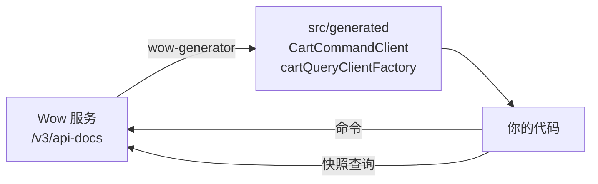

# 快速开始：调用 Wow 服务

本页回答：**TypeScript 应用从零开始，怎样调用一个 Wow 服务，发出命令并读回状态？**

路径总是同一条：服务发布自己的 OpenAPI 文档，`wow-generator` 把它变成每个聚合的类型化客户端，应用通过一个只配置一次的 [Fetcher](https://fetcher.ahoo.me/) 调用这些客户端。下面的步骤使用仓库里的示例服务（限界上下文 `example`，聚合 `cart`）；换成你自己服务的地址和聚合名即可。

<!-- typecheck-generated: typescript/integration-test/src/generated -->



::: tip 尚未上 npm
Wow 的 TypeScript 包随 Wow **9.2.0** 发布。在此之前，下面的安装命令会以 `E404` 失败；见[兼容性与版本](./compatibility.md#发布状态)。
:::

## 1. 前提

- Node.js **22.12** 或更高版本，TypeScript 5 或更高版本（样例用 TypeScript 6 检查）。
- 一个能访问到 OpenAPI 文档的 Wow 服务，**8.11 或更高版本**。Wow 8.10 通过旧版入口使用，见[兼容性与版本](./compatibility.md)。
- 要跟着示例服务操作，就在 Wow 仓库的克隆里按其 [agent 说明](https://github.com/Ahoo-Wang/Wow/blob/main/AGENTS.md)启动它（`./gradlew :example-server:run`），它监听 `http://localhost:8080`。快照查询需要它的 MongoDB 配置；默认的内存配置下命令可用，查询会返回 `QuerySchemaUnavailable`。

## 2. 安装

```bash
pnpm add @ahoo-wang/fetcher @ahoo-wang/fetcher-decorator \
  @ahoo-wang/fetcher-eventstream @ahoo-wang/wow-client
pnpm add -D @ahoo-wang/wow-generator @ahoo-wang/fetcher-openapi typescript
```

生成的客户端是装饰器类，编译它们的项目需要 `experimentalDecorators`。直接用 Node 运行编译产物的项目可以用下面的 `tsconfig.json`，并在 `package.json` 中设置 `"type": "module"`；使用打包器的项目保留自己的设置，只加这一个选项：

```json
{
  "compilerOptions": {
    "target": "ES2022",
    "module": "NodeNext",
    "moduleResolution": "NodeNext",
    "experimentalDecorators": true,
    "strict": true,
    "skipLibCheck": true,
    "rootDir": "src",
    "outDir": "dist"
  },
  "include": ["src/**/*.ts"]
}
```

## 3. 生成客户端

让生成器读取运行中的服务：

```bash
pnpm exec wow-generator generate -i http://localhost:8080/v3/api-docs \
  -o src/generated -t tsconfig.json
```

它输出一行摘要，例如 `Generated 14 files into src/generated`，并为每个限界上下文写一个目录：

| 文件 | 内容 |
|---|---|
| `src/generated/example/boundedContext.ts` | `EXAMPLE_BOUNDED_CONTEXT_ALIAS = 'example'` |
| `src/generated/example/cart/commandClient.ts` | `CartCommandClient`，每条命令一个方法（`addCartItem`、`changeQuantity`……）；以及逐阶段流式返回的 `CartStreamCommandClient` |
| `src/generated/example/cart/queryClient.ts` | `cartQueryClientFactory`，创建以 `CartState` 和购物车字段名定类型的快照、事件与状态客户端 |
| `src/generated/example/cart/types.ts` | 命令体、事件和 `CartState` |
| `src/generated/.wow-generator.json` | 本次运行拥有的文件清单；与输出一起提交 |

如果构建不想依赖运行中的服务，就把文档保存一次（`curl -o openapi/example.json http://localhost:8080/v3/api-docs`）并提交，再从文件生成；[在 CI 中重新生成](./regenerate-in-ci.md)讲怎样让两者保持一致。不要手改生成的文件：下一次运行会覆盖它们。

## 4. 只创建一次客户端

<!-- typecheck: file=cart.ts -->

```ts
// src/cart.ts
import { Fetcher } from '@ahoo-wang/fetcher';
import {
  CartCommandClient,
  cartQueryClientFactory,
} from './generated/index.js';

// 每个 Wow 服务一个 Fetcher：它的基础地址，以及之后的拦截器。
const exampleService = new Fetcher({
  baseURL: process.env.EXAMPLE_SERVICE_URL ?? 'http://localhost:8080',
});

export function cartClients(ownerId: string) {
  // 购物车路由按所有者划分（`owner/{ownerId}/cart/...`），这里为每个路径填入
  // `{ownerId}`。使用 CoSec 时由令牌的 subject 填入。
  const service = {
    fetcher: exampleService,
    urlParams: { path: { ownerId } },
  };
  return {
    // 直接调用服务，而不是经过按限界上下文路由的网关，
    // 所以清掉生成客户端默认加上的 `example` 前缀。
    commands: new CartCommandClient({ ...service, basePath: '' }),
    snapshots: cartQueryClientFactory.createSnapshotQueryClient({
      ...service,
      contextAlias: '',
    }),
  };
}
```

决定请求发往哪里的是三项设置：

- **`fetcher`**：发往哪个服务。不传时客户端使用 Fetcher 的默认实例，它没有基础地址。传入 `fetcher` 会保留生成客户端的其余默认值。
- **限界上下文前缀**：生成的客户端在每个路径前加上上下文别名（`/example/owner/…`），网关据此路由到服务。应用直接调用服务时，命令客户端用 `basePath: ''`、查询客户端用 `contextAlias: ''` 清掉它。
- **`{tenantId}` 与 `{ownerId}`**：按租户或所有者划分的聚合的路径变量。像这里一样通过 `urlParams.path` 给出，或者让 CoSec 从登录用户填入；见[认证与拦截器](./authentication.md)。

## 5. 发送命令并读取状态

```ts
// src/main.ts
import {
  CommandStage,
  commandHeaders,
  filter,
  pagedQuery,
  toWowError,
  waitStrategy,
} from '@ahoo-wang/wow-client';
import { cartClients } from './cart.js';

const ownerId = process.argv[2] ?? crypto.randomUUID();
const { commands, snapshots } = cartClients(ownerId);

try {
  // 1. 发送命令，并等到它的快照写入。
  const result = await commands.addCartItem({
    headers: {
      ...commandHeaders({ requestId: crypto.randomUUID() }),
      ...waitStrategy({ stage: CommandStage.SNAPSHOT, timeoutMs: 10_000 }),
    },
    body: { productId: 'book-1', quantity: 2 },
  });
  console.log(`${result.stage}: cart ${result.aggregateId} v${result.aggregateVersion}`);

  // 2. 读取它产生的状态。
  const cart = await snapshots.getStateById(result.aggregateId);
  console.log('items:', cart.items);

  // 3. 按条件查询快照。
  const page = await snapshots.pagedState(
    pagedQuery({
      filter: filter.elementMatch('state.items', filter.eq('productId', 'book-1')),
      pagination: { index: 1, size: 10 },
    }),
  );
  console.log(`carts holding book-1: ${page.total}`);
} catch (error) {
  // 被拒绝的命令或查询以异常的形式到达。
  const wowError = await toWowError(error);
  if (!wowError) throw error;
  console.error(`${wowError.errorCode}: ${wowError.errorMsg}`);
  process.exitCode = 1;
}
```

编译并运行：

```bash
pnpm exec tsc -p tsconfig.json
node dist/main.js
```

```text
SNAPSHOT: cart 0177e706-99ef-4f45-9e63-68ec369f35ee v1
items: [ { productId: 'book-1', quantity: 2 } ]
carts holding book-1: 1
```

每一步依赖的是：

- `waitStrategy({ stage: CommandStage.SNAPSHOT })` 让服务端在快照写入后才应答，所以随后的查询能看到它。不指定等待阶段时，命令处理完成即返回。见[完成语义](../command/completion.md)。
- 请求 ID 让重试变得安全：请求结果不确定时用同一个 `requestId` 再发一次，服务端会拒绝重复请求，而不是执行两次。
- `getStateById` 返回聚合的状态；`pagedState` 返回状态的 `{ total, list }`。过滤字段指向存储的快照，所以写作 `state.items`；数组元素里的字段用 `filter.elementMatch` 匹配。字段名的类型来自生成的 `CartAggregatedFields`，拼错的字段无法通过编译。
- 服务端拒绝的命令——校验失败、命令处理函数失败、版本冲突——以 fetcher 的错误拒绝，`toWowError` 从中读出 Wow 的 `errorCode`、`errorMsg` 和 `bindingErrors`。发送 `{ productId: '', quantity: 0 }` 会输出 `CommandValidation: …`。各种情况见[错误处理](./error-handling.md)。

## 下一步

| 接下来 | 阅读 |
|---|---|
| 给请求签名，从用户填入租户与所有者 | [认证与拦截器](./authentication.md) |
| 处理客户端可能遇到的每种失败 | [错误处理](./error-handling.md) |
| 在 React 中展示查询 | [wow-react 查询 Hook](../../reference/typescript/wow-react/) |
| 让生成代码与服务保持一致 | [在 CI 中重新生成](./regenerate-in-ci.md) |
| 在服务端或 Next.js 中运行 | [SSR 与 Node.js](./ssr-and-node.md) |
| 哪里不对 | [排障](./troubleshooting.md) |

生成的代码及其选项见 [wow-generator 参考](../../reference/typescript/wow-generator/)和 [Wow 聚合识别](../../reference/typescript/wow-generator/wow-discovery.md)。要为不来自 Wow 的 OpenAPI 文档生成客户端，见[从任意 OpenAPI 文档生成客户端](./generated-client.md)。
