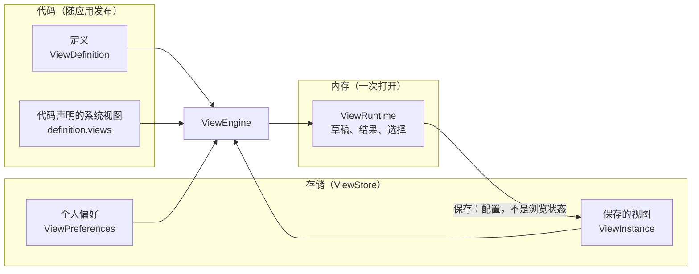

# 视图引擎的核心概念

本页回答：**视图引擎里的几样东西各是什么、住在哪里、谁能改？** 读完它，再读[写好一份定义](./view-engine-definitions.md)与[入门](./view-engine-getting-started.md)里的代码，每一行在模型里的位置就清楚了。

引擎立足于三条事实：**定义是代码，配置是数据，运行时状态是临时的**（[视图引擎](./view-engine.md#三条事实)）。下面每个概念都落在其中一格里。



## 一览

| 类型 | 作用 | 住在哪 |
|---|---|---|
| `ViewDefinition` | 一份数据**能**怎样观察：字段、类型、操作符，以及记录视图与分析视图的能力。用 `defineView` 从查询描述写出，或手写；运行时从不编辑 | 代码 |
| `ViewConfig` | 一次观察**怎样**看：`RecordViewConfig`、`AnalysisViewConfig` 或 `DashboardViewConfig`。保存的是意图（「最近 7 天」），不是编译后的值，也从不写组件名 | 数据 |
| `ViewInstance` | 已保存的 `ViewConfig`，加上 id、标题、范围（`system`、`shared` 或 `personal`）与不透明的 `revision`；store 存着的系统视图另带 `stored: true` | 存储 |
| `ViewPreferences` | 一个用户在一份定义上的习惯：视图的顺序、默认视图、分析的「改了就跑」、仪表盘上次看的标签页 | 存储 |
| `ViewRuntime` | 一个打开的视图：草稿、已应用的配置、结果、状态与选择，通过 `subscribe` 与 `getSnapshot` 暴露 | 内存 |
| `ViewEngine` | 定义、存储与已打开运行时的注册表；打开、保存、列出等命令的唯一入口，默认界面与自己拼的界面走同一条路 | 内存 |
| `ViewStore` | 持久化端口：Wow 服务端上是 `@ahoo-wang/wow-view-store` 的 `WowViewStore`，别的后端自己实现 | 应用 |
| `FieldKind` | 一种字段类型的操作符、校验、到 `FilterExpression` 的编译以及编辑器描述 | 注册表 |

## 定义

定义说一份数据**能**怎样观察：列出哪些字段、各叫什么、能怎样筛选、排序和聚合，以及随它发布的系统视图。它是代码，所以：

- **没有定义服务，也没有定义版本。** 改定义就是一次部署。已保存的视图在打开时按当前的定义校验：引用了已经不存在的字段，那个视图进入待修复，指出是哪一处，而不是打开一张空白页。
- **事实从查询描述来，选择归定义。** 服务端为每个聚合发布查询描述：有哪些路径、各是什么类型、枚举有哪些值。`defineView(descriptor, spec)` 从提交在定义旁边的描述快照取这些事实，`spec` 只写选择。操作符、排序、聚合这些**能力**随存储变，定义不写死，运行时按数据源当下的描述收窄。怎样写，见[写好一份定义](./view-engine-definitions.md)。
- **两种定义。** 数据定义（`kind: 'data'`）配一个数据源（`source`），承载这份数据的记录视图与分析视图；仪表盘定义（`kind: 'dashboard'`）没有数据源，只是仪表盘的归属目录，面板引用别的定义的视图。

## 视图：记录与分析

视图是对一份数据定义的一次观察方式，存下来就是一个 `ViewInstance`。一份数据定义同时承载两种视图，侧栏里以种类图标区分：

| 种类 | 回答 | 配置里有什么 |
|---|---|---|
| 记录视图（`record`） | 「哪些记录，按什么顺序」：一张能翻页的列表 | 条件、排序、每页条数、表尾汇总、列（顺序、宽度、固定、隐藏）、卡片布局 |
| 分析视图（`analysis`） | 「按什么分组，算什么」：一张聚合结果的表或图 | 条件、维度（`groups`）、指标（`metrics`）、「只保留」（`having`）、排序、前 N 组、表格与图表各一套设置 |

两种视图共用同一棵条件树（`FilterTree`），都只发 Wow 的查询：记录视图走分页或游标查询，分析视图走聚合查询。一个记录视图大致是这样（`kind`、`filter`、`refresh` 等成员两种视图都有）：

```ts
import type { RecordViewConfig } from '@ahoo-wang/wow-view-engine';

export const PAID_THIS_WEEK: RecordViewConfig = {
  kind: 'record',
  filter: {
    op: 'and',
    children: [
      { field: 'state.status', operator: 'IN', value: ['PAID'] },
      // 存的是「本周」这个意图：每次执行时按当下的日历求值。
      {
        field: 'firstEventTime',
        operator: 'BETWEEN',
        value: { type: 'preset', preset: 'thisWeek' },
      },
    ],
  },
  filterMode: 'simple',
  refresh: { interval: null },
  sort: [{ field: 'firstEventTime', direction: 'DESC' }],
  pageSize: 20,
  summaries: [{ field: 'state.totalAmount', fn: 'SUM' }],
  // 表格与卡片两套设置都存着，切换布局只改这一个成员。
  layout: 'table',
  table: {
    columns: [
      { field: 'aggregateId' },
      { field: 'state.totalAmount' },
      { field: 'firstEventTime' },
    ],
  },
  card: { title: 'aggregateId', fields: ['state.totalAmount'] },
};
```

配置是一份**意图模型**，这决定了几件事：

- **保存的是配置，不是浏览状态。** 选择、页码、游标和结果从不保存；重新打开时恢复配置，从第一页重新执行。
- **意图不编译后再存。** 「最近 7 天」存成 `{ type: 'relative', amount: 7, unit: 'day' }`，而不是两个具体时刻，所以保存的视图永远是新鲜的。
- **配置是纯 JSON，不写组件。** 编辑器由字段类型、操作符与值的形状推出，界面组件改名或重写不影响任何已保存的视图。
- **配置来自存储，所以不被信任。** 每次打开都按定义校验；新版本引擎写下、旧版本不认识的成员原样带过「打开 → 编辑 → 保存」，不认识的取值报错而不是被猜成别的。

## 仪表盘

仪表盘（看板）把几个视图放在同一页，用一组共同的筛选约束它们。它自己也是一个视图，配置是 `DashboardViewConfig`，存在仪表盘定义之下：

- **面板**落在一张 24 列的栅格上，可以分标签页。数据面板显示一个已保存的视图（`instanceId`），或一个**看板自己拥有**的分析（`owned`，只活在这块板里）；内容面板是标题、Markdown 文本、图片与链接。
- **板子的筛选**由配置声明，因为它们跨定义：日期、文本、ID、数字、布尔与搜索，各接到面板上同类的字段。日期筛选经每份定义的 `timeField` 自动接到面板上；面板可以声明 `ignoresTime` 不跟随。板子还有一个读者改不了的**固定范围**（`fixed`）。
- **引用有范围约束。** 共享仪表盘只能引用共享视图或系统视图，否则别的读者看到的是一块空面板；系统仪表盘只能引用系统视图（见下一节）。
- **嵌入**：`/ui` 的 `EmbeddedView` 与 `EmbeddedDashboard` 把一个已保存的视图或仪表盘放进业务页面，不带工作台。

## 系统、共享与个人视图

每个保存的视图有一个范围（`ViewScope`），回答「谁配置、谁看见、谁能改」：

| 范围 | 谁配置 | 谁看见 | 普通用户能做什么 |
|---|---|---|---|
| `system` | 研发或运维：一份定义的基础视图与常用视图 | 这份定义的所有用户 | 打开、设为默认、排序、另存为自己的；不能改名、覆盖或删除 |
| `shared` | 有共享许可的业务用户 | 这份定义的所有用户 | 依许可决定能否覆盖、改名、删除；总能另存 |
| `personal` | 任何用户 | 只有本人 | 全部 |

这三个值是两件事的合法组合：视图**给谁看**（受众：个人或共享），以及它**是不是用户配置的**。系统视图一定是共享的，「个人的系统视图」写不出来。模型给出两个派生：`audienceOf(scope)` 答受众（`system` 答 `shared`），`isSystemScope(scope)` 答出处。用户能创建的只有受众（`ViewAudience`），侧栏也按受众分组：「我的视图」在前，「共享视图」在后，系统视图在共享组里，行尾一把锁。

共享视图与个人视图之间可以**就地改受众**（「设为共享」「设为个人」，`ViewStore.changeAudience`），id 不变，显示它的仪表盘因此不断；被共享仪表盘显示着的视图不能改成个人。系统视图从不改受众。

### 系统视图的三种来源

| 来源 | 在哪 | 谁能改 |
|---|---|---|
| 代码声明 | 定义的 `views`。实例 id 是 `system:<定义 id>:<视图 id>`（`systemInstanceId`），`revision` 固定为 `'code'`，打开时不经过 store | 没人：改它就是发版 |
| 服务端配置 | 视图存储服务端的 `wow.view-store.system-views`（或宿主自己的 `SystemViewProvider`），启动时读一次 | 没人：只读，改了要重启 |
| 存着的 | 视图存储里租户 `(platform)`、所有者 `(system)` 下的视图，摘要与实例带 `stored: true` | 宿主给了 `editSystem` 的用户，不必发版或重启 |

三种在列表里合并，代码声明的在前。**存着的系统视图是全局的**：它们只住在保留租户 `(platform)` 之下，每个租户都读得到；共享视图只属于一个租户。所以系统仪表盘只能引用系统视图——一块引用了某个租户共享视图的系统板，到了别的租户那里就是空的。发布、另存为系统或保存系统仪表盘时，引擎拒绝这样的板，并点出是哪几块面板（`dashboard.system.non-system-panels`）。

**谁能编辑存着的系统视图**由两处决定：

- **按钮由宿主的许可决定。** `ViewPermissions.editSystem` 为 `true` 的用户，对存着的系统视图照共享视图那样保存、改名、删除（仍问 `instance(id)` 的答复）。**它沉默即 `false`**，与别的许可「沉默即允许」相反：系统视图到达每一个用户，只有宿主明说才开。代码声明的与服务端配置的系统视图，给了 `editSystem` 也只读。
- **写入由网关授权。** 视图存储服务端没有开关：写系统视图的请求都落在一条字面路径 `…/tenant/(platform)/owner/(system)/…` 上，由 CoSec 网关只放行管理员。前端的许可只决定按钮，不是授权（规则见 [wow-view-store 参考](../../reference/typescript/wow-view-store/)）。

<!-- typecheck-context
declare const isViewAdmin: boolean;
-->

```ts
import { Fetcher } from '@ahoo-wang/fetcher';
import type { ViewPermissions } from '@ahoo-wang/wow-view-engine';
import { WowViewStore } from '@ahoo-wang/wow-view-store';

/** 宿主按它在网关上取得的角色作答；这里只决定按钮。 */
function permissions(): ViewPermissions {
  return {
    createPersonal: true,
    createShared: true,
    reorder: true,
    setDefault: true,
    // 不写就是 false：只有系统视图的管理员才看得到编辑与发布。
    editSystem: isViewAdmin,
    instance: () => ({ save: true, rename: true, delete: true }),
  };
}

export const store = new WowViewStore({
  fetcher: new Fetcher({ baseURL: '/api' }),
  permissions,
});
```

**发布是复制。** 给了 `editSystem` 的用户在视图管理器的个人与共享行上多一格「发布为系统视图」（`engine.publishAsSystem(id)`）：它以源视图的标题与**已保存的**配置新建一个存着的系统视图，源视图不动；「取消发布」就是删除那份副本。另存为对话框也多一个「所有人（系统视图）」受众。已经是系统视图的不能再发布；网关拒绝时，界面说的是「你没有发布系统视图的权限，请联系管理员。」（`view.publish.forbidden`），而不是一句笼统的写入失败。

## revision 与冲突

几个人、几个标签页同时改同一个视图是常态。引擎不加锁，靠两条规则保持一致：

- **乐观 revision。** 每个保存的视图带一个不透明的 `revision`，只做相等比较。每次写入都带上它期望的 `revision`；store 里的已经变了，写入以 `CONFLICT` 被拒，`ViewStoreError` 带回 store 当下持有的那份。
- **幂等的 `requestId`。** 每次逻辑写入在 `WriteContext` 里有一个 `requestId`；超时后的重试沿用同一个值与同一份正文，由服务端去重，所以重试不会多建出一个视图。

一次写入有四种结局，草稿在每一种里都留着：

| 结局 | 界面提供 |
|---|---|
| 成功 | 无；打开着同一视图的其他运行时只推进基线，各自的草稿不动 |
| 冲突（`CONFLICT`） | **重新加载**：保存冲突丢弃草稿，换成对方那份；**覆盖**：以对方的 revision 重放这次意图；**另存**：把草稿存成一个新视图 |
| 被拒（`FORBIDDEN`、`INVALID`、`NOT_FOUND`） | 说明原因；改过后可以作为新的写入再保存，或点「知道了」放下它 |
| 结果未知（超时、断线、`UNAVAILABLE`） | **重试**：同一 `requestId` 再发一次；**放弃**：清掉这次写入，草稿仍在 |

结果未知不是失败，也不是成功：结清之前，同一目标不接受新的写入，否则一次没确认的首次保存再点一次就是两个视图。一个运行时同一时刻最多一个在途写入。关闭一个有未保存草稿或未知写入的视图时，离开守卫先问一句；导航从不取消在途的写入。

个人偏好也带 `revision`。偏好写入冲突时，引擎重新读回偏好，保留这次的意图，请用户再确认一次，而不是拿最新的 revision 悄悄重试。

## 存储

`ViewStore` 是后端唯一要满足的端口：八个方法（列出、读取、新建、保存、改名、删除视图，读写偏好），外加可选的 `changeAudience` 与同步的 `permissions`。签名与规则见 [wow-view-engine 参考](../../reference/typescript/wow-view-engine/#persistence)。

- **只存两样东西。** 保存的视图（`ViewInstance`）与每个用户在每份定义上的偏好（`ViewPreferences`）。定义不存，运行时状态不存。
- **列表顺序是端口的一部分。** 系统视图、共享视图、个人视图，各组按创建先后；没有偏好时打开第一个，所以换一个 store 打开的仍是同一个默认视图。
- **上限也是。** 标题去空白后非空、至多 120 个字符，配置的 JSON 至多 240 KB；引擎在发出前就拒绝超出的，不必等服务端。
- **许可只决定按钮。** `permissions` 由应用预先取得、同步作答；授权、可见性过滤与去重都是服务端的事。列表、偏好与许可各自加载，一个失败不挡另外两个：store 列不出来时，代码声明的系统视图照样能打开。

| 实现 | 用在哪 |
|---|---|
| `MemoryViewStore` | 测试、示例与只读查询；加上 `localStorageSnapshot(key)` 就把一个浏览器的视图存进 `localStorage` |
| `WowViewStore`（`@ahoo-wang/wow-view-store`） | Wow 应用：视图与偏好是视图存储服务端上的两个 Wow 聚合，见 [wow-view-store 参考](../../reference/typescript/wow-view-store/) |
| 自己实现 `ViewStore` | 不是 Wow 的后端：用它自己的 API，把 HTTP 状态映射到 `ViewStoreError` 的 code |

## 完整的可运行版本

- Storybook 的[记录工作台](/storybook/?path=/docs/view-engine-组件状态-记录工作台--docs)：系统视图、另存、改名、视图管理器都能上手；[保存冲突](/storybook/?path=/story/view-engine-组件状态-记录工作台--save-conflicted)摆着一次真实的冲突与三个出口。
- 存着的系统视图：[管理员编辑一个存着的系统视图](/storybook/?path=/story/view-engine-组件状态-记录工作台-回归--edit-stored-system-view)、[发布为系统视图](/storybook/?path=/story/view-engine-组件状态-记录工作台-回归--publish-as-system-view)、[别的用户只读](/storybook/?path=/story/view-engine-组件状态-记录工作台-回归--system-views-read-only-for-others)。
- [仪表盘](/storybook/?path=/docs/view-engine-组件状态-仪表盘--docs)：面板、筛选、标签页与搭建。
- 源码：端口 [`ViewStore.ts`](https://github.com/Ahoo-Wang/Wow/blob/main/typescript/wow-view-engine/src/store/ViewStore.ts)、许可的唯一判定 [`permissions.ts`](https://github.com/Ahoo-Wang/Wow/blob/main/typescript/wow-view-engine/src/runtime/permissions.ts)、视图存储服务端的[系统视图](https://github.com/Ahoo-Wang/Wow/blob/main/view-store/README.md)。
- 设计文档：[核心模型](https://github.com/Ahoo-Wang/Wow/blob/main/typescript/wow-view-engine/docs/design/model.md)、[图表、条件树与实例](https://github.com/Ahoo-Wang/Wow/blob/main/typescript/wow-view-engine/docs/design/model-shapes.md)、[视图管理与持久化](https://github.com/Ahoo-Wang/Wow/blob/main/typescript/wow-view-engine/docs/design/management.md)。

## 下一步

| 接下来 | 阅读 |
|---|---|
| 从描述符写一份定义：措辞、收窄、系统视图、看板、自检 | [写好一份定义](./view-engine-definitions.md) |
| 从零接入一个业务对象 | [视图引擎入门](./view-engine-getting-started.md) |
| 入口、持久化端口与扩展点 | [wow-view-engine 参考](../../reference/typescript/wow-view-engine/) |
