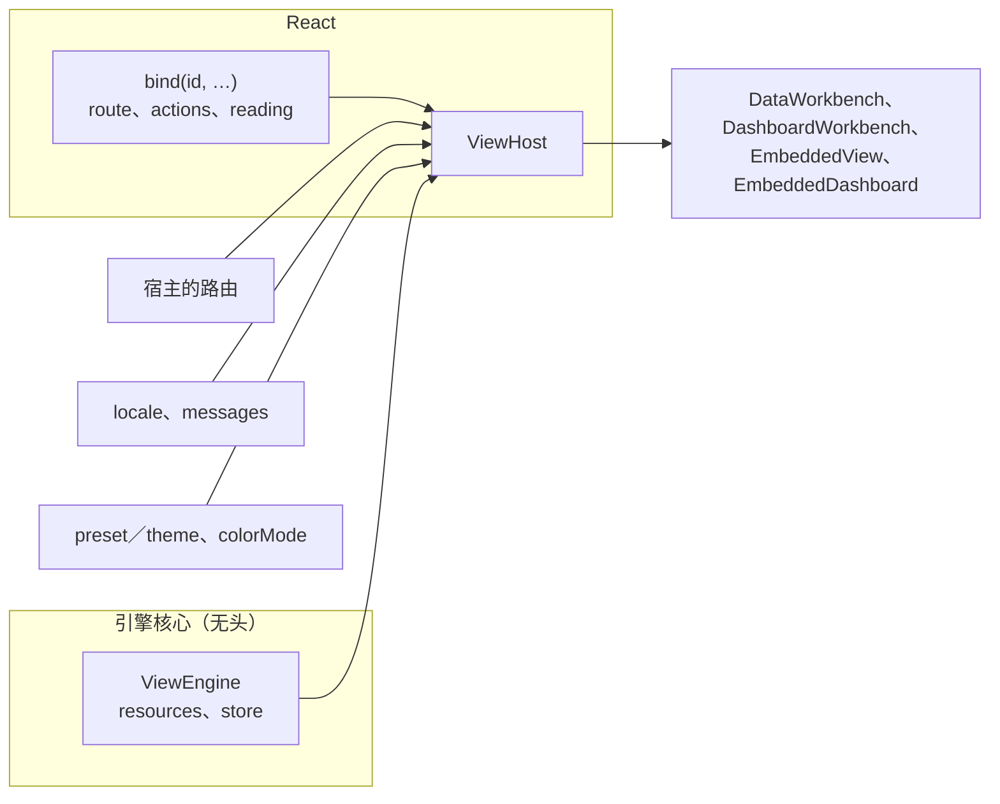

# 把视图引擎接进宿主

本页回答：**定义写好之后，宿主应用外面要写什么，引擎才在每个页面上做对的事？**

[入门](./view-engine-getting-started.md)把一个业务对象从零接了进来。这里把那几步背后的接线逐个讲清楚：为什么数据注册在引擎上、行为注册在 React 里，[`ViewHost`](../../reference/typescript/wow-view-engine/host.md#api-ViewHost) 的每个端口桥接宿主的什么，引擎替宿主管了地址里的哪些东西，嵌入能做到哪一步，以及怎样不开浏览器就测这些接线。



## 一个引擎，两处注册

引擎核心是无头的：没有 React，没有 DOM。所以一个资源要在两处注册，按定义的 id 对上：

| 注册在 | 写什么 | 为什么在这里 |
|---|---|---|
| `new ViewEngine({ resources })` | 定义与它的数据源（看板没有数据源） | 查询、缓存、描述与保存的视图都是数据，不需要界面 |
| `ViewHost` 的 `bindings` | 每个资源在这个宿主里去哪个路由、带哪些操作、记录怎样读 | 路由、命令与读法都是行为，属于 React 这一侧 |

<!-- typecheck: file=engine.ts -->
<!-- typecheck-context
import type { DashboardDefinition, DataViewDefinition, ViewSource, ViewStore } from '@ahoo-wang/wow-view-engine';
declare const orders: DataViewDefinition;
declare const overview: DashboardDefinition;
declare function orderSource(): ViewSource;
declare const store: ViewStore;
declare function report(event: unknown): void;
-->

```ts
// src/views/engine.ts
import { ViewEngine } from '@ahoo-wang/wow-view-engine';
import { browserRuntimeEnvironment } from '@ahoo-wang/wow-view-engine/react';

export const engine = new ViewEngine({
  store,
  resources: [
    { definition: orders, source: orderSource() },
    // 看板不查自己的数据：它的面板读别的资源。
    { definition: overview },
  ],
  // 查询或保存失败时，界面在出事的地方说明；这里交给宿主的监控。
  environment: browserRuntimeEnvironment({ onError: report }),
});
```

- **一个应用一个引擎**，在启动时建一次，不按页面建，也不按语言建：页面之间共用它的查询缓存、个人偏好与查询描述；换语言只是重画。
- 同一个模型上的两份定义共用一个数据源键（定义的 `source`）和一个数据源。
- 不必调 `limits`：查询队列按看板的面板数自己留位，服务端的预算从查询描述里来。只在要更低时传。
- 给数据源用的 `Fetcher` 设一个超时（`new Fetcher({ timeout })`）。`@ahoo-wang/fetcher` 缺省不超时，引擎也不给查询计时；一个接了连接却不答的服务端会让视图一直在打开中，还占着引擎的查询位，看板的其他面板跟着饿着。
- 开发构建里没有接 `onIssue` 时，引擎按资源把准入发现打印出来，每条带改法。它们该进定义的 [`admit`](../../reference/typescript/wow-view-engine/testing.md#api-admit) 测试（[下文](#testing)），不该被一个处理函数吞掉。

数据源与存储怎样选，见[入门的第 6 步](./view-engine-getting-started.md)与[视图存在哪里](./view-engine-storage.md)。

## `ViewHost`：页面外面唯一的一层

`ViewHost` 由几个端口组成，每个端口桥接宿主已经有的东西。路由库、i18n 与主题系统仍是宿主的，引擎不接管它们：

| prop | 端口 | 做什么 |
|---|---|---|
| `engine` | 数据 | 应用的那个引擎 |
| `router` | 路由 | 宿主的路由：`/react-router` 的 `useReactRouter()`，或照 [`ViewRouter`](../../reference/typescript/wow-view-engine/host.md#api-ViewRouter) 的两个成员自己写（[下文](#router-port)） |
| `navigate` | 路由 | 想亲手接每一条去处时写它，优先于 `router` |
| `locale`、`messages` | 语言 | 值显示所用的语言，以及合并在现行措辞之上的措辞表（[下文](#messages)） |
| `bindings` | 命令 | 每个资源一条 [`bind(id, …)`](../../reference/typescript/wow-view-engine/host.md#api-bind)：路由、操作、读法（[下文](#bind)） |
| `theme`、`preset`、`brand` | 主题 | 两条路选一条：`theme="host"` 跟宿主的 shadcn 主题，或 `preset` 穿引擎的预设（[视图引擎的主题](./view-engine-theming.md)） |
| `colorMode`、`rememberColorMode` | 主题 | 亮暗：缺省 `system`，引擎在第一次绘制前给 `<html>` 写 `.dark` 与 `color-scheme` 并跟随系统；`light`／`dark` 从钉住开始；宿主自己管亮暗（如 next-themes）时写 `host`，引擎不碰 `<html>`。读者经 `useColorMode()` 的 `{ mode, setMode }` 换模式，`rememberColorMode` 给一个 `localStorage` 键就记在这台机器上 |

<!-- typecheck: file=Host.tsx -->
<!-- typecheck-context
import { engine } from './engine';
import { BINDINGS } from './routes';
declare const ORDER_WORDS: Record<'zh-CN' | 'en', Record<string, string>>;
-->

```tsx
// src/views/Host.tsx
import type { ReactNode } from 'react';
import '@ahoo-wang/wow-view-engine/styles.css';
import '@ahoo-wang/wow-view-engine/themes/porcelain.css';
import { useReactRouter } from '@ahoo-wang/wow-view-engine/react-router';
import { ViewHost, zhCN } from '@ahoo-wang/wow-view-engine/ui';

/** 每种语言一张：引擎自己的措辞（英文是缺省的），加上定义的键。 */
const MESSAGES = {
  'zh-CN': { ...zhCN, ...ORDER_WORDS['zh-CN'] },
  en: ORDER_WORDS.en,
};

export function Host({
  locale,
  children,
}: {
  locale: 'zh-CN' | 'en';
  children: ReactNode;
}) {
  return (
    <ViewHost
      engine={engine}
      router={useReactRouter()}
      locale={locale}
      messages={MESSAGES[locale]}
      bindings={BINDINGS}
      preset="porcelain"
      rememberColorMode="my-app.color-mode"
    >
      {children}
    </ViewHost>
  );
}
```

`ViewHost` 下面的每个面只写这一处与别处不同的东西：`<DataWorkbench definitionId="orders" />`、`<EmbeddedDashboard instanceId="…" />`。面自己的 `engine`、`messages`、`locale`、`onNavigate` 或 `record` 仍然优先。

`ViewHost` 可以嵌套：内层的 `bindings` 按 id 覆盖外层，也可以给内层另一个引擎，一页两个引擎照样写得出。绑定的 id 不是宿主引擎里某份资源登记的定义时——多半是拼错了——经 `onIssue` 报 warning `binding.definition.unknown`。绑定会传给内层宿主，所以写在外层宿主上、给内层嵌套引擎的定义的绑定，也会在外层引擎那里被报一次：把它写到内层宿主上，或者不理这条 warning。只有最外层画 `<html>`——亮暗、预设与品牌色——卸下时把 `<html>` 还原。

## `bind`：每个资源在这个宿主里做什么 {#bind}

`bind(definitionId, options)` 把一个资源在这个宿主里的行为写在一处。它在哪里出现——工作台、记录详情、看板的记录面板、嵌入、追问的结果——都自动带上，不必每个页面再接一遍：

| 选项 | 是什么 |
|---|---|
| `route(instanceId, target?)` | 打开这个资源的页面路径。`instanceId` 是要打开的视图或看板，`null` 是没人存过的视图（追问、看板自己的分析），落在页面的缺省上 |
| `actions` | 记录上的命令，声明的（[声明式操作](./view-engine-actions.md)） |
| `reading` | 一条记录在详情里怎样读：`title(row)` 给它起名，`sections(context)` 加宿主自己的区块，`render(context)` 整个换掉正文 |
| `slots` | 逃生口：`row`、`bulk`、`global` 画宿主自己的标记，排在声明的操作之后 |

<!-- typecheck: file=routes.ts -->
<!-- typecheck-context
import type { RecordActions } from '@ahoo-wang/wow-view-engine';
declare const orderActions: RecordActions;
-->

```ts
// src/views/routes.ts
import { bind } from '@ahoo-wang/wow-view-engine/ui';

/** 一个工作台页面，打开 `view`，或打开它的缺省视图（`null`）。 */
export function withView(path: string, view: string | null): string {
  return view === null ? path : `${path}?${new URLSearchParams({ view })}`;
}

// 模块级常量：在渲染里新建的绑定，每次渲染都是一份新的。
export const BINDINGS = [
  bind('orders', {
    route: view => withView('/orders', view),
    reading: { title: row => `订单 ${String(row.key)}` },
    actions: orderActions,
  }),
  bind('overview', { route: board => withView('/boards', board) }),
];
```

绑定要稳定：写在模块顶层，或者用 `useMemo` 包住它闭包里用到的东西（Storybook 的接入导览这样传入命令客户端）。没有 `route` 的资源不是一个去处：不出现在导航里，去它的链接也不去。

## 路由端口 {#router-port}

有了路由端口，引擎自己管地址，宿主不必同步任何东西：

- **打开的视图在 `?view=`。** 宿主没给 `instanceId`／`onInstanceChange` 的工作台（[`DataWorkbench`](../../reference/typescript/wow-view-engine/components.md#api-DataWorkbench)、[`DashboardWorkbench`](../../reference/typescript/wow-view-engine/components.md#api-DashboardWorkbench)）打开地址里的 `?view=`，读者换视图时写回去，一个视图一条历史。它**只认自己定义的视图**：一页上两个工作台共用一个 `?view=`，另一个定义的视图它搁着不管，也不把自己的缺省写回去盖掉别人的。
- **打开的记录在 `?id=`。** 绑定了的资源，记录详情跟着地址的 `?id=`（替换当前历史，不加新的），除非 `reading` 自己管着 `open`。
- **交接、筛选与标签页在历史条目的 state 里。** 看板「在工作台中打开」、追问、面板的去处，都按目标资源的 `route` 去，带着 `ViewRouteState`：交接过去的视图（`handOver`），看板的 `filters` 与 `tab`。一页上几块看板各记各的，刷新后各自找回自己的。
- **别的地方。** 以 `/` 开头的宿主路径也走路由；别的站点另开一个窗口。

参数名固定是 `view` 与 `id`：`route` 是宿主的函数，引擎读不回它拼出的路径，只能与宿主约定这两个名字。宿主把打开的视图记在别处（例如一个页面同时由链接上的别的参数决定），才传 `instanceId` 与 `onInstanceChange`，像受控的 `<input>` 那样。

### React Router

`/react-router` 入口的 `useReactRouter()` 把 React Router 变成路由端口。它要在 React Router 的路由组件里面调用（入门用的是 `BrowserRouter`）。React Router 是可选的 peer（`^7.0.0 || ^8.0.0`），只有这个入口导入它，不用它的宿主不必安装。

### 自己写一个

别的路由库照 `ViewRouter` 的两个成员写：`location`（`pathname`、`search`、`state`）与 `go(path, { state, replace })`。**契约在对象的身份上**：位置一变就给一个新的 `ViewRouter` 对象，不变就给同一个。读地址的一切——打开的视图、打开的记录、看板的筛选与标签页——只在对象换了时重读：原地修改的对象永远读不到它动了，每次渲染都新建的则每次渲染都重读。`go` 在调用那一刻才读，可以每次都是新函数。

下面是 Storybook 接入导览用的内存路由，地址只放在内存里（示例跑在 Storybook 的框架里）。换成宿主的路由库时，`location` 读它的当前位置，`go` 调它的跳转：

<!-- typecheck: file=memoryRouter.ts -->

```ts
// src/views/memoryRouter.ts
import { useMemo, useState } from 'react';
import type { ViewLocation, ViewRouter } from '@ahoo-wang/wow-view-engine/ui';

export function useMemoryRouter(start: string): ViewRouter {
  const [location, setLocation] = useState<ViewLocation>(() => at(start));
  // 位置变了才是新对象：读地址的一切在对象换了时重读。
  return useMemo(
    () => ({
      location,
      go: (path, options) => setLocation(at(path, options?.state)),
    }),
    [location],
  );
}

function at(path: string, state: unknown = null): ViewLocation {
  const query = path.indexOf('?');
  return query < 0
    ? { pathname: path, search: '', state }
    : { pathname: path.slice(0, query), search: path.slice(query), state };
}
```

### 亲手接每一条去处：`navigate`

`navigate(to)` 把每一条去处交到宿主手里，优先于路由端口。目标资源有 `route` 时，`to` 是解析好的 `{ kind: 'route', path, state, target }`；网址与没有 `route` 的资源原样交出。只在宿主的跳转要多做一步（埋点、确认离开、切到另一个应用）时写它。

## 导航：数据，不是外壳

引擎画视图，页面是宿主的，所以没有整页外壳组件。`useViewNavigation()` 给宿主的外壳数据：每个绑了 `route` 的资源，按注册的次序，`{ id, kind, title, path, current, views }`；`views` 是它的系统视图（看板定义的就是系统看板），各带 `{ id, title, path, current }`。标题按现行措辞说出，换语言即重画；`current` 读路由端口的地址。存储里的共享视图不在其中，它们要异步读存储，交给宿主自己的视图列表。

<!-- typecheck-context
declare function Header(props: { children: React.ReactNode }): React.ReactNode;
-->

```tsx
import { DataWorkbench, useViewNavigation } from '@ahoo-wang/wow-view-engine/ui';

export function OrdersPage() {
  return <DataWorkbench definitionId="orders" />;
}

export function Places() {
  const places = useViewNavigation();
  return (
    <Header>
      <nav aria-label="应用导航">
        {places.map(place => (
          <a
            key={place.id}
            href={place.path}
            aria-current={place.current ? 'page' : undefined}
          >
            {place.title}
          </a>
        ))}
      </nav>
    </Header>
  );
}
```

用宿主自己的链接与侧栏组件（shadcn 的 `Sidebar`、顶栏都行）替换 `<a>`。宿主自己的外壳挂 `className="fve-tokens"` 就穿上引擎的主题（[宿主自己的外壳](./view-engine-theming.md#宿主自己的外壳)）。

**页面的高度是宿主的事，而且必须是确定的高度。** 工作台永远填满它的容器、页脚贴底，所以容器要有 `height`，不是 `min-height`。外壳写成视口那么高、顶栏不动、内容区拿余下的高度；比屏幕高的页面（看板、表单）在自己的容器里滚，不滚整个文档：

```css
.app { display: flex; flex-direction: column; height: 100svh; overflow: hidden; } /* 顶栏 flex: none；内容区 flex: 1; min-height: 0 */
```

只写 `min-height` 时，工作台落到 36rem 的保底（`--fve-workbench-min-height`），文档在表格上面先滚。页面已经有自己的 `<main>` 时，给工作台传 `landmark="region"`，免得一页两个 `main`。

## 嵌入：在业务页面里展示决定好的视图 {#embeds}

业务页面要展示别人已经定下的东西——某个客户的订单、某个仓库的看板——就嵌入它：只有结果，没有视图列表、条件编辑器和保存。两个入口按资源分，和工作台一样：[`EmbeddedView`](../../reference/typescript/wow-view-engine/components.md#api-EmbeddedView) 嵌记录或分析视图，[`EmbeddedDashboard`](../../reference/typescript/wow-view-engine/components.md#api-EmbeddedDashboard) 嵌看板。

**嵌入从不写入**：不写视图，不写看板，不写偏好。读者在上面做的事只在这一次查看里有效。要读者自己搭看板的页面，嵌的是 `DashboardWorkbench`。

<!-- typecheck-context
import type { ViewNavigation } from '@ahoo-wang/wow-view-engine';
declare function go(to: ViewNavigation): void;
-->

```tsx
import { systemInstanceId } from '@ahoo-wang/wow-view-engine';
import {
  EmbeddedDashboard,
  EmbeddedView,
} from '@ahoo-wang/wow-view-engine/ui';

export function CustomerPage({ id, name }: { id: string; name: string }) {
  return (
    <>
      {/* 这位客户待发货的订单：系统视图，再收窄到这位客户。 */}
      <EmbeddedView
        instanceId={systemInstanceId('orders', 'to-ship')}
        scopeFilter={{
          op: 'and',
          children: [{ field: 'state.customerId', operator: 'IN', value: [id] }],
        }}
        withTitle
      />
      {/* 客户看板：客户锁定在这位上，时间归读者。 */}
      <EmbeddedDashboard
        instanceId="customer-board"
        interaction="interactive"
        filterModes={{ customer: 'locked' }}
        pageValues={{ values: { customer: { items: [{ id, label: name }] } } }}
        onNavigate={go}
      />
    </>
  );
}
```

- **读者能走多远是明确的一档**，`interaction`，缺省 `static`：只有结果，表头不排序、没有分页、哪儿也不通。`interactive` 打开排序、列宽、分页、看板的筛选与联动、追问菜单与「在工作台中打开」。两档都不保存任何东西。
- **开关在档位之内选用**，关着时不出现，而不是变灰：`withTitle`、`withSearch`、`withExport`、`detail`（只读的记录详情）、`expandable`（铺满屏幕）、`autoRefresh`、`size`（`content` 按内容，`fill` 填满容器）等。完整的表在[包 README 的 Embedding 一节](https://github.com/Ahoo-Wang/Wow/blob/main/typescript/wow-view-engine/README.md)。
- **看板的筛选逐个三态**（`filterModes`）：`adjustable` 读者可调，是缺省；`locked` 显示它的值、带锁、没有控件；`hidden` 不出现但照样收窄面板。锁定与隐藏的值是页面的（`pageValues`），从不经过地址：否则读者改一下地址就换了客户。
- 嵌入里离开的每条路都经 `onNavigate(to)`；没有它，那些路就不存在。在 `ViewHost` 下，看板嵌入在宿主没给 `initialFilters`／`onFiltersChange` 时从历史条目读写读者的筛选。
- **看板记录面板上的命令**来自面板视图所在定义的 `bind(…, { actions })`，`EmbeddedDashboard` 与 `DashboardWorkbench` 一样；命令后整块看板重读。`EmbeddedView` 不画声明的操作：它的行命令只有宿主自己的 `rowActions`。

**锁定不是安全边界。** 页面锁定的条件是在浏览器里拼好、随查询发出的；它只让读者在屏幕上改不了。改页面脚本或直接调 API 的人可以要另一个客户的数据。租户、归属与权限必须由 Wow 服务端执行，面向组织外部的页面更是如此。

## 措辞与语言 {#messages}

模型里只有键与参数，没有文案，所以措辞归界面层。引擎自带英文措辞；`zhCN` 是逐键对应的中文，整个交出去，或者展开后改你想改的：

- `messages` 合并在现行措辞之上：引擎自己的键与定义的键（`text(key)`）同一张表。中文宿主交 `{ ...zhCN, ...定义的措辞 }`；英文宿主只交定义的措辞。
- `locale` 是值显示所用的语言：枚举按选项的标签，时间与日期经 `Intl.DateTimeFormat`。时间按引擎的时区读（`environment.timeZone`）。
- 换 `locale` 与 `messages` 只重画开着的视图：同一些运行时，不重新打开、不重新查询，草稿也不变脏。
- **一个引擎同一时刻说一种语言。** 定义的键用点名这个引擎的最外层 `ViewHost` 的措辞说；内层换语言的 `ViewHost` 只改引擎自己的措辞，不改定义的键。
- 改写引擎自己的键时写 `satisfies MessageOverrides`：引擎改名的键会让构建失败，而不是悄悄退回引擎的原话。

```ts
import { zhCN, type MessageOverrides } from '@ahoo-wang/wow-view-engine/ui';

const wording = {
  'label.filter.apply': '确定',
} satisfies MessageOverrides;

export const ENGINE_WORDS = { ...zhCN, ...wording };
```

未知的键沿着点号退回，最后退回键本身，所以缺了的措辞会露出来，而不是画成空白。消息键属于公开面：补丁版本不改名、不删除。

## 用 `/testing` 测宿主 {#testing}

接线本身值得测，而且不需要浏览器。`@ahoo-wang/wow-view-engine/testing` 是无头入口，给宿主的单测四样东西：

| 函数 | 测什么 |
|---|---|
| `admit(definitions, descriptors, { text })` | 定义与看板在提交的查询描述上过一遍准入，每个键都有措辞；全都成立时返回 `[]` |
| [`resolveNavigation(to, bindingOf)`](../../reference/typescript/wow-view-engine/testing.md#api-resolveNavigation) | 一条去处经绑定的 `route` 解析成什么，用的是引擎自己的解析 |
| [`actionHarness(actions, rows, { now })`](../../reference/typescript/wow-view-engine/testing.md#api-actionHarness) | 声明的操作按引擎的规则读，不画界面（[声明式操作](./view-engine-actions.md#harness)） |
| [`memorySource(documents, options?)`](../../reference/typescript/wow-view-engine/testing.md#api-memorySource) | 内存里的 [`ViewSource`](../../reference/typescript/wow-view-engine/engine.md#api-ViewSource)，按 Wow 服务端在 MongoDB 上的语义筛选、排序、分页、投影与聚合，给页面测试与演示用 |

路由表就用引擎自己的解析来测：

<!-- typecheck-context
import { BINDINGS } from './routes';
declare function expect(value: unknown): { toMatchObject(expected: unknown): void };
-->

```ts
import { resolveNavigation } from '@ahoo-wang/wow-view-engine/testing';

const bindingOf = (id: string) =>
  BINDINGS.find(binding => binding.definitionId === id);

const toShip = {
  kind: 'view',
  definitionId: 'orders',
  instanceId: 'system:orders:to-ship',
  scopeFilter: null,
  filter: null,
} as const;
expect(resolveNavigation(toShip, bindingOf)).toMatchObject({
  kind: 'route',
  path: '/orders?view=system%3Aorders%3Ato-ship',
  state: { handOver: toShip },
});
```

`memorySource` 的答案由本包的测试守着服务端自己的语义（Wow TCK 的 `FilterSemantics` 矩阵与查询 TCK 的聚合用例），所以测试看到的是生产环境会给的答案，而不是一份罐头结果。它用 `mingo` 求值筛选，`mingo` 是可选的 peer：导入 `/testing` 的宿主自己加进开发依赖（`pnpm add -D mingo`），别的入口都不加载它。

<!-- typecheck-context
import type { DataViewDefinition } from '@ahoo-wang/wow-view-engine';
declare const orders: DataViewDefinition;
-->

```ts
import { MemoryViewStore, ViewEngine } from '@ahoo-wang/wow-view-engine';
import { memorySource } from '@ahoo-wang/wow-view-engine/testing';

// 快照照服务端返回的样子：信封、`state`、毫秒时间戳。
const source = memorySource(
  [
    { aggregateId: 'O-1', firstEventTime: 1_790_000_000_000, state: { status: 'PAID' } },
    { aggregateId: 'O-2', firstEventTime: 1_790_000_060_000, state: { status: 'SHIPPED' } },
  ],
  // BEFORE_NOW、AFTER_NOW 比较的时钟：钉住它。
  { now: () => Date.parse('2026-09-27T00:00:00Z') },
);

export const testEngine = new ViewEngine({
  resources: [{ definition: orders, source }],
  store: new MemoryViewStore(),
});
```

这些测试在 Node 里跑。宿主的 Vitest 是浏览器项目时，给它们一份 `environment: 'node'` 的配置：做法在 skill `wow-view-host` 的 [actions.md「Where the tests run」](https://github.com/Ahoo-Wang/Wow/blob/main/skills/wow-view-host/references/actions.md)。

## 一个真实的宿主：补偿控制台

补偿控制台是视图引擎的参考宿主，上面每一节它都照做，接线一共三个文件：

- [`ConsoleHost.tsx`](https://github.com/Ahoo-Wang/Wow/blob/main/compensation/dashboard/src/features/App/ConsoleHost.tsx)：一个 `ViewHost`——引擎、React Router、跟着控制台的 i18n 换的语言、`porcelain` 预设加上 Wow 的蓝色作品牌色、记在本机的亮暗。
- [`views/routes.ts`](https://github.com/Ahoo-Wang/Wow/blob/main/compensation/dashboard/src/views/routes.ts)：三个资源的 `bind`，每个一行路由；失败的执行还带着读法与声明的命令。测试传入自己的命令客户端。
- [`views/engine.ts`](https://github.com/Ahoo-Wang/Wow/blob/main/compensation/dashboard/src/views/engine.ts)：资源与数据源。

旁边的 [`routes.test.ts`](https://github.com/Ahoo-Wang/Wow/blob/main/compensation/dashboard/src/views/routes.test.ts) 与 [`admit.test.ts`](https://github.com/Ahoo-Wang/Wow/blob/main/compensation/dashboard/src/views/admit.test.ts) 是上一节两种测试的真实写法。

## 完整的可运行版本

- Storybook 的[接入导览](/storybook/?path=/docs/view-engine-接入导览--docs)：`ViewHost`、`bind`、内存路由与 `useViewNavigation` 画出的导航，页面下方就是它跑起来的样子。源文件：[`OrdersHost.tsx`](https://github.com/Ahoo-Wang/Wow/blob/main/typescript/storybook/stories/view-engine/integration/OrdersHost.tsx)、[`OrdersPage.tsx`](https://github.com/Ahoo-Wang/Wow/blob/main/typescript/storybook/stories/view-engine/integration/OrdersPage.tsx)、[`memoryRouter.ts`](https://github.com/Ahoo-Wang/Wow/blob/main/typescript/storybook/stories/view-engine/integration/memoryRouter.ts)、[`ordersEngine.ts`](https://github.com/Ahoo-Wang/Wow/blob/main/typescript/storybook/stories/view-engine/integration/ordersEngine.ts)，以及 [`integration.test.ts`](https://github.com/Ahoo-Wang/Wow/blob/main/typescript/storybook/stories/view-engine/integration/integration.test.ts)。
- 嵌入：[EmbeddedView](/storybook/?path=/docs/view-engine-组件状态-embeddedview--docs) 与 [EmbeddedDashboard](/storybook/?path=/docs/view-engine-组件状态-embeddeddashboard--docs)，各档位与开关逐个演示。源文件：[`EmbeddedView.stories.tsx`](https://github.com/Ahoo-Wang/Wow/blob/main/typescript/storybook/stories/view-engine/EmbeddedView.stories.tsx)、[`EmbeddedDashboard.stories.tsx`](https://github.com/Ahoo-Wang/Wow/blob/main/typescript/storybook/stories/view-engine/EmbeddedDashboard.stories.tsx)。

## 下一步

| 接下来 | 阅读 |
|---|---|
| 记录上的命令：放在哪、先问什么、多选与结局 | [声明式操作](./view-engine-actions.md) |
| 换一套外观、用品牌色、接上 shadcn 主题 | [视图引擎的主题](./view-engine-theming.md) |
| 在严格的内容安全策略下运行 | [视图引擎的内容安全策略](./view-engine-csp.md) |
| 保存的视图存在哪里：内存、本地、Wow 服务端或自己的存储 | [视图存在哪里](./view-engine-storage.md) |
