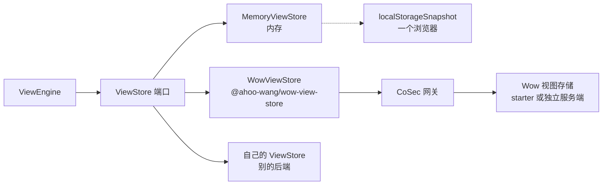

# 视图存在哪里

本页回答：**读者保存的视图、看板与偏好存到哪里，宿主怎样选、怎样接，接上以后谁来决定谁能写？**

定义与代码里声明的系统视图是代码，随前端发版，从不经过存储。存下来的是读者在页面上做出来的东西：保存的视图（`ViewInstance`：记录视图、分析视图或仪表盘的整份配置），以及每个定义下的偏好（视图顺序、默认视图、自动运行、上次打开的标签页）。引擎只经由一个端口读写它们——[`ViewStore`](../../reference/typescript/wow-view-engine/store.md#api-ViewStore)，所以换一种存储不用改页面。



## 按「谁要看到保存的视图」来选

| store | 适合 | 说明 |
|---|---|---|
| [`MemoryViewStore`](../../reference/typescript/wow-view-engine/store.md#api-MemoryViewStore) | 测试、演示、只查询不保存的页面 | 刷新即忘 |
| `new MemoryViewStore({ snapshot: localStorageSnapshot(key) })` | 开发期、单人使用的工具 | 一个浏览器里的视图；另一个标签页的写入会被合并，或成为 `CONFLICT` |
| `WowViewStore`（`@ahoo-wang/wow-view-store`） | 其余所有情况：个人视图与共享视图由 Wow 服务保管 | 服务引入 `wow-view-store-starter`，或在 CoSec 网关后面运行独立的 `wow-view-store-server`（[视图存储服务端](../extensions/view-store.md)） |
| 自己实现 `ViewStore` | 视图必须存在别的后端 | 只在后端不是 Wow 时才这样做（[自己写一个 ViewStore](#自己写一个-viewstore)） |

无论选哪一种，端口都守着两条规则，引擎的冲突处理与重试都建立在它们上面（端口的签名见 [wow-view-engine 参考](../../reference/typescript/wow-view-engine/#persistence)）：

1. **乐观版本。** 每次写入带上读到的 `revision`；对不上就以 [`ViewStoreError`](../../reference/typescript/wow-view-engine/store.md#api-ViewStoreError)（`code: 'CONFLICT'`）拒绝，并带上存储里现在的样子。界面据此给出「重新载入」「覆盖」「另存为」。
2. **幂等的 `requestId`。** 一次逻辑上的写入只有一个 `requestId`（`WriteContext`），超时后的重试沿用它；存储对同一个 `requestId` 答第一次的结果，不写第二遍。

## `MemoryViewStore`

`MemoryViewStore` 是视图引擎自带的唯一实现：端口后面一张同步的表。它不图省事：过期的 `revision` 照样冲突，重放的 `requestId` 照样答第一次的结果，列表顺序（系统、共享、个人，各按创建先后）与标题、配置的长度上限也与服务端一致，所以在它上面写对了的宿主代码，换到真后端上行为不变。

构造时可以放进初始的视图与偏好，以及 `permissions`。下面放进一个**存储的**系统视图（`stored: true`），并只给管理员 `editSystem`：

<!-- typecheck: file=memoryStore.ts -->
<!-- typecheck-context
import type { RecordViewConfig } from '@ahoo-wang/wow-view-engine';
declare const openOrders: RecordViewConfig;
declare function isAdmin(): boolean;
-->

```ts
import { MemoryViewStore } from '@ahoo-wang/wow-view-engine';

export const memoryStore = new MemoryViewStore({
  instances: [
    {
      id: 'orders-open',
      definitionId: 'orders',
      title: '待发货',
      scope: 'system',
      // 带 stored：存储保管、可以编辑的系统视图；不带就是只读的配置视图。
      stored: true,
      revision: '1',
      config: openOrders,
    },
  ],
  permissions: () => ({
    createPersonal: true,
    createShared: true,
    reorder: true,
    setDefault: true,
    // 不写 editSystem 就是不许：系统视图默认只读。
    editSystem: isAdmin(),
    instance: () => ({ save: true, rename: true, delete: true }),
  }),
});
```

- 放进去的 `scope: 'system'` 视图不带 `stored` 时，是**配置的**系统视图：任何写入都以 `FORBIDDEN` 拒绝。带 `stored: true`，或由 `create({ scope: 'system', … })`（界面上的「发布为系统视图」）建出来的，是**存储的**系统视图：像共享视图一样保存、改名、删除，但从不改受众。
- store 自己不问权限，和服务端一样；`editSystem` 由宿主给、由引擎问。

## `localStorageSnapshot`：视图暂时存在浏览器里

还没有后端保管视图时（开发期、单人工具），[`localStorageSnapshot(key)`](../../reference/typescript/wow-view-engine/store.md#api-localStorageSnapshot) 把一个 `MemoryViewStore` 存进浏览器的 `localStorage`，整个状态是 `key` 下的一份 JSON。它是一个浏览器里的视图，不是共享的视图；要与别人共享，视图得存在服务端。

<!-- typecheck: file=devStore.ts -->

```ts
import {
  localStorageSnapshot,
  MemoryViewStore,
} from '@ahoo-wang/wow-view-engine';

export const devStore = new MemoryViewStore({
  snapshot: localStorageSnapshot('my-app:views'),
});
```

- **存不下的写入就是失败。** 配额满了或存储被禁用时，这次写入被撤回，以 `ViewStoreError`（`UNAVAILABLE`）拒绝：环境的 `onError` 收到一次 `store` 失败，界面显示一次没有落地的保存，可以重试。
- **标签页不互相覆盖。** 每次写入前 store 重读这份文档，逐个实例（以及逐个定义的偏好）核对写入的 `revision`：写入合并进另一个标签页存下的内容——一个标签页里保存的看板，不会因为另一个标签页调了顺序而丢失；另一个标签页已经改过的，照常是 `CONFLICT`。另一个标签页的修改也会经 `storage` 事件让 store 重新载入。
- 文档不存在或读不懂时从空开始，不让页面崩掉；下一次写入会替换它。

## `WowViewStore`：视图存在 Wow 服务上

Wow 应用把视图存在 Wow 的视图存储上：两个 Wow 聚合（视图与视图偏好），由引入 `wow-view-store-starter` 的 Wow 服务提供，或由独立的 `wow-view-store-server` 提供。前端用 `@ahoo-wang/wow-view-store` 的 `WowViewStore` 接它，不必为 Wow 后端自己写 store。服务端怎样部署、配置与加固见[视图存储服务端](../extensions/view-store.md)。

### 接上

`WowViewStore` 只收两样东西：一个 fetcher，和可选的 `permissions`。**它不收租户、所有者、用户或应用**：这些由 fetcher 的拦截器带上，和宿主发给 Wow 的其他请求一样。CoSec 的拦截器加上令牌与 `CoSec-App-Id`，并从令牌填路径里的 `{tenantId}` 与 `{ownerId}`。这样「谁在请求」只有一个来源，store 无从写错。

<!-- typecheck: file=viewStore.ts -->
<!-- typecheck-context
declare function hasRole(role: string): boolean;
-->

```ts
import { Fetcher } from '@ahoo-wang/fetcher';
import { CoSecConfigurer } from '@ahoo-wang/fetcher-cosec';
import {
  isSystemInstanceId,
  type ViewPermissions,
} from '@ahoo-wang/wow-view-engine';
import { WowViewStore } from '@ahoo-wang/wow-view-store';

// 视图存储前面的网关。
const fetcher = new Fetcher({ baseURL: 'https://api.example.com' });
new CoSecConfigurer({ appId: 'my-app' }).applyTo(fetcher);

/** 网关放行写 `owner/(shared)` 时检查的同一个角色。 */
const SHARED_WRITER = 'view-store:shared-writer';
/** 网关放行 `tenant/(platform)/owner/(system)` 时检查的同一个角色。 */
const SYSTEM_VIEW_ADMIN = 'view-store:system-admin';

function permissions(): ViewPermissions {
  const sharedWriter = hasRole(SHARED_WRITER);
  return {
    createPersonal: true,
    createShared: sharedWriter,
    reorder: true,
    setDefault: true,
    // 发布、编辑、撤下存储的系统视图；不写即不许。
    editSystem: hasRole(SYSTEM_VIEW_ADMIN),
    instance: id => {
      // 代码里声明的系统视图（`system:` 开头）永远只读。
      const editable = !isSystemInstanceId(id);
      return {
        save: editable,
        rename: editable,
        delete: editable,
        // 收为个人与设为共享都要写共享视图的角色。
        changeAudience: editable && sharedWriter,
      };
    },
  };
}

export const store = new WowViewStore({ fetcher, permissions });
```

然后把 `store` 交给 `new ViewEngine({ store, resources })`，和[入门](./view-engine-getting-started.md#_6-引擎与资源)里的 `MemoryViewStore` 换个位置而已。

### 路径就是受众

所有路由都在 `/view-store/tenant/{tenantId}/owner/{ownerId}` 下，**所有者段就是受众**：

| 视图 | 路径 |
|---|---|
| 个人视图 | 调用者自己的路径，`owner/{ownerId}`（拦截器按令牌填） |
| 共享视图 | `owner/(shared)`（`SHARED_OWNER_ID`） |
| 存储的系统视图 | `tenant/(platform)/owner/(system)`（`SYSTEM_TENANT_ID`、`SYSTEM_OWNER_ID`），与调用者的租户无关：它们是全局的 |

「设为共享」是在视图所在的个人路径上 `share`，「设为个人」是在调用者自己的路径上 `claim`：视图的 id 不变，显示它的仪表盘不断。服务端按路径隔离，网关按路径放行，所以受众放在路径上，网关一条路径规则就能管住一种受众。

### 权限：只管按钮，网关来决定

`permissions` 决定哪些按钮可用，从不决定一次写入能不能成：服务端相信它的路径，谁能用哪条路径由 CoSec 网关决定（[安全模型](../extensions/view-store.md#安全模型)）。所以宿主按**网关检查的同一个角色**给出它们，否则按钮亮着、写入却被网关拒绝，或者反过来。

| 成员 | 管的按钮 | 不写时 |
|---|---|---|
| `createPersonal`、`createShared` | 另存为个人视图、共享视图 | — （必填） |
| `reorder`、`setDefault` | 调整顺序、设为默认 | — （必填） |
| `instance(id).save`、`rename`、`delete` | 某个视图的保存、改名、删除 | — （必填） |
| `instance(id).changeAudience` | 设为共享、收为个人；还要过去往受众的创建许可 | 允许 |
| `editSystem` | 发布为系统视图，编辑、撤下存储的系统视图 | **不许** |

整个 `permissions` 不给时，除 `editSystem` 外一切允许。`editSystem` 是唯一「沉默即拒绝」的一项：系统视图是所有租户、所有人读的东西，宿主没想过这件事时，不应该让谁都能改。它也只对存储的系统视图起作用：代码里声明的（`system:` 开头）与服务端配置的系统视图，给不给都只读。

### 系统视图

一个定义的视图列表里，系统视图有三个来源，引擎合并在一起：

| 来源 | 从哪来 | 谁能改 |
|---|---|---|
| 代码 | 定义的 `views`，id 以 `system:` 开头 | 没有人：随前端发版，从不发给服务端 |
| 配置 | 服务端的 `wow.view-store.system-views`，或宿主的 `SystemViewProvider` | 没有人：改了要重启服务端 |
| 存储 | `tenant/(platform)/owner/(system)` 下的视图聚合 | 有 `editSystem` 的人，经常规的视图路由，不必重启 |

`WowViewStore` 列出并读取存储的系统视图时，在摘要和实例上带 `stored: true`；宿主给了 `editSystem` 时，界面上系统视图的锁说它可以修改。`create({ scope: 'system', … })` 发布一个（复制一份：原来的视图还在），`save`、`rename`、`delete` 编辑与撤下它；`changeAudience`，以及对配置或代码系统视图的任何写入，不发请求就以 `FORBIDDEN` 拒绝。

系统视图的 `revision` 是内容的散列，引擎靠它判断草稿是否改过；而写入要的是聚合版本。store 记住每次读到的版本，写入时发版本；手里的 `revision` 找不到对应版本时先重读，`revision` 对不上就是 `CONFLICT`，什么都不发。

### 不登录的宿主

没有令牌时，没有谁来填路径里的租户和所有者。这样的宿主加一个自己的拦截器，只在请求没有时填上缺省值，排在 CoSec 的资源归属之后（以后前面加了令牌，令牌仍然优先），并写上自己的应用。所有者是 `(shared)` 时，宿主只有共享视图与共享偏好，所以它的权限关掉 `createPersonal`，`changeAudience` 为 `false`：

<!-- typecheck: file=consoleDefaults.ts -->

```ts
import type { FetchExchange, RequestInterceptor } from '@ahoo-wang/fetcher';
import {
  CoSecHeaders,
  RESOURCE_ATTRIBUTION_REQUEST_INTERCEPTOR_ORDER,
} from '@ahoo-wang/fetcher-cosec';
import { SHARED_OWNER_ID } from '@ahoo-wang/wow-view-store';

export class ViewStoreDefaults implements RequestInterceptor {
  readonly name = 'ViewStoreDefaults';
  readonly order = RESOURCE_ATTRIBUTION_REQUEST_INTERCEPTOR_ORDER + 1;

  intercept(exchange: FetchExchange): void {
    const path = exchange.ensureRequestUrlParams().path;
    // Wow 的缺省租户。
    path.tenantId ??= '(0)';
    path.ownerId ??= SHARED_OWNER_ID;
    exchange.ensureRequestHeaders()[CoSecHeaders.APP_ID] ??= 'my-console';
  }
}
```

补偿控制台就是这种宿主：它的视图存在补偿服务内嵌的视图存储里，租户 `(0)`、所有者 `(shared)`（[`viewStore.ts`](https://github.com/Ahoo-Wang/Wow/blob/main/compensation/dashboard/src/views/viewStore.ts)）。它的网关按网络或服务令牌放行它，和控制台的其余请求一样。

### 写入、重试与创建

- **写入**把端口的 `requestId` 作为 `Command-Request-Id`、`revision` 作为 `Command-Aggregate-Version` 发出，等到快照落地，以读回的视图作答。
- **重试答第一次的结果。** 以过期版本或重复请求 id 被拒的写入，store 先按 `requestId` 问重放路由：第一次已经落地，就以它作答；确实没落地，过期版本才是 `CONFLICT`（带上现在的视图），视图没了是 `NOT_FOUND`。
- **创建在服务端不幂等**，id 由服务端生成。store 记住自己最近 256 次创建的 `requestId`，重试前先问重放路由，所以同一个 store 的重试不会多建一个视图；另一个标签页或刷新后的重试会。
- 列表每种受众至多读 1000 个（服务端的查询预算，最早的 1000 个）；超出的仍可按 id 读。

### 错误

每个拒绝都是视图引擎的 `ViewStoreError`。store 先按 Wow 的错误码判断，没有认得的错误码时才看 HTTP 状态：

| `code` | 典型来源 | 含义 |
|---|---|---|
| `CONFLICT` | 版本冲突（`CommandExpectVersionConflict` 等；没有错误码时 409、412） | 别人先写了：错误带上现在的视图，界面给出重新载入、覆盖、另存为 |
| `NOT_FOUND` | `NotFound`、`IllegalAccessDeletedAggregate`（404、410） | 视图已删除，或属于别的应用（不暴露它在别处存在） |
| `FORBIDDEN` | 所有者或租户不符、`SystemViewReadOnly`（401、403） | 这条路径不归调用者，或视图只读 |
| `INVALID` | `ViewInvalid`、`ViewAppRequired`、`ViewScopeRequired`、校验失败（400、422）；拦截器没填路径变量（不发请求） | 请求本身就错了，重试也会发出同样的请求 |
| `UNAVAILABLE` | 超时、5xx、没有应答 | 结局未知，用同一个 `requestId` 重试是安全的 |
| `UNSUPPORTED` | 服务端根本没有视图存储（早于它发布的版本） | 引擎说「服务端未提供视图存储」，而不是「视图不存在」 |

- `detail.code` 留着服务端的错误码，宿主可以据此区分同为 `INVALID` 的 `ViewAppRequired` 与 `ViewInvalid`；`WowViewStoreErrorCodes` 列出视图存储自己的错误码。
- 服务端答了话的 `UNAVAILABLE`（5xx、它报告的超时、不是 JSON 的页面）带 `reachable: true`，引擎说「服务端暂时无法处理」，而不是「无法连接服务端」。
- 收为个人时，若有共享仪表盘显示着这个视图，服务端拒绝，`boards` 原样带上那几块看板的标题，引擎用自己的话说出来。
- 这些都由引擎处理，宿主不要再包一层。

## 自己写一个 ViewStore

**后端是 Wow 时不要写**：`WowViewStore` 已经处理了重放、受众移动、系统视图的版本与错误码，这些都是自己写最容易出错的地方。只有视图必须存在别的后端时，才实现 `ViewStore`：

- 必须实现 `list`、`get`、`create`、`save`、`rename`、`delete`、`getPreferences`、`setPreferences`；`changeAudience` 可选（没有它，视图管理器里就没有「设为共享」「设为个人」），`permissions` 可选（没有它就是一切允许，`editSystem` 除外）。
- 守住两条规则：过期的 `revision` 抛 `CONFLICT` 并带上现在的实例；同一个 `requestId` 答第一次的结果。偏好从没写过时 `revision` 是 `'0'`（`emptyPreferences()`）。
- 不分配 `system:` 开头的 id，那是代码声明的系统视图的。
- 鉴权、可见性过滤与去重是服务端的事；`permissions` 只管按钮。
- 把后端的失败翻译成 `ViewStoreError` 是 store 的事，引擎只认这几个 `code`：

<!-- typecheck: file=storeErrors.ts -->

```ts
import {
  ViewStoreError,
  type ViewStoreErrorCode,
} from '@ahoo-wang/wow-view-engine';

const BY_STATUS: Record<number, ViewStoreErrorCode> = {
  400: 'INVALID',
  401: 'FORBIDDEN',
  403: 'FORBIDDEN',
  404: 'NOT_FOUND',
  409: 'CONFLICT',
  410: 'NOT_FOUND',
  412: 'CONFLICT',
  422: 'INVALID',
};

/** 后端的一次失败应答，翻译成引擎认得的错误。 */
export function storeError(status: number, message: string): ViewStoreError {
  const code = BY_STATUS[status] ?? 'UNAVAILABLE';
  // 服务端答了话，只是处理不了：引擎会说「暂时无法处理」而不是「连不上」。
  return new ViewStoreError(
    code,
    message,
    code === 'UNAVAILABLE' ? { reachable: true } : undefined,
  );
}
```

`CONFLICT` 要带上存储里现在的实例（第三个参数的 `instance`，偏好则是 `preferences`），界面才能给出覆盖与另存为。

### 跑一致性测试

端口有一套一致性测试，`MemoryViewStore` 与 `WowViewStore` 都跑它：列表与读取、谁看得见什么、写入、过期版本、系统视图、重放、偏好、改受众。它是视图引擎仓库里的一个测试文件，[`viewStoreConformance.ts`](https://github.com/Ahoo-Wang/Wow/blob/main/typescript/wow-view-engine/test/conformance/viewStoreConformance.ts)，**不随 npm 包发布**（发布的入口不能带上测试框架）。用法：

1. 从你所依赖版本的 tag 复制这个文件到自己的测试目录。它依赖 `vitest`，从引擎源码引入的名字（`isViewStoreError`、`MAX_VIEW_TITLE_LENGTH`、`MAX_VIEW_CONFIG_BYTES` 与几个类型）都是 `@ahoo-wang/wow-view-engine` 根入口的公开导出，把那几行相对路径的 import 改成从包引入即可。
2. 调用 `describeViewStoreConformance`，声明你的 store 具备哪些能力；没声明的能力，相应的用例按名字跳过，而不是假装通过。
3. `connect` 打开一次测试用的后端，返回「按所有者开一个 store」的工厂：同一个所有者开两次是同一个用户的两个标签页，两个所有者是两个用户。每个用例用新的定义 id，所以共用的后端不需要清空。

<!-- typecheck: skip — 引入的是从仓库复制来的测试文件与你自己的 store -->

```ts
import { describeViewStoreConformance } from './viewStoreConformance';
import { MyViewStore, openTestBackend } from '../src/myViewStore';

describeViewStoreConformance({
  name: 'MyViewStore',
  capabilities: {
    owners: true, // 两个所有者是两个用户
    personalViews: true,
    changeAudience: true, // 实现了可选的 changeAudience
    idempotentCreate: true, // 重放的 create 答第一次的视图
    systemViews: { definitionId: 'conformance-system' }, // 后端为它提供至少一个只读系统视图
    storedSystemViews: true, // create({ scope: 'system' }) 存下可编辑的系统视图
  },
  connect: async () => {
    const backend = await openTestBackend();
    return ({ owner }) => new MyViewStore({ backend, owner });
  },
});
```

`WowViewStore` 在仓库里怎样跑同一套用例，见 [`wowViewStore.conformance.test.ts`](https://github.com/Ahoo-Wang/Wow/blob/main/typescript/integration-test/test/view-store/wowViewStore.conformance.test.ts)；`MemoryViewStore` 与 `localStorageSnapshot` 的见 [`viewStoreConformance.test.ts`](https://github.com/Ahoo-Wang/Wow/blob/main/typescript/wow-view-engine/test/viewStoreConformance.test.ts)。

## 完整的可运行版本

- Storybook 里，存储的系统视图由管理员[编辑](/storybook/?path=/story/view-engine-组件状态-记录工作台-回归--edit-stored-system-view)、[发布](/storybook/?path=/story/view-engine-组件状态-记录工作台-回归--publish-as-system-view)，对其他人[只读](/storybook/?path=/story/view-engine-组件状态-记录工作台-回归--system-views-read-only-for-others)；[管理视图](/storybook/?path=/story/view-engine-组件状态-记录工作台--manage-views)里每颗按钮都按 store 的权限出现。它们都跑在 `MemoryViewStore` 上。
- 它们的 store：[`fixtures.ts`](https://github.com/Ahoo-Wang/Wow/blob/main/typescript/storybook/stories/view-engine/fixtures.ts) 的 `systemViewsStore`。
- 实现：[`MemoryViewStore.ts`](https://github.com/Ahoo-Wang/Wow/blob/main/typescript/wow-view-engine/src/store/MemoryViewStore.ts)、[`wowViewStore.ts`](https://github.com/Ahoo-Wang/Wow/blob/main/typescript/wow-view-store/src/wowViewStore.ts)。
- 一个真实的宿主：补偿控制台的 [`viewStore.ts`](https://github.com/Ahoo-Wang/Wow/blob/main/compensation/dashboard/src/views/viewStore.ts)。

## 下一步

| 接下来 | 去读 |
|---|---|
| 部署、配置并加固视图存储服务端 | [视图存储服务端](../extensions/view-store.md) |
| `WowViewStore` 的导出与合同 | [wow-view-store 参考](../../reference/typescript/wow-view-store/) |
| `ViewStore` 端口的签名 | [wow-view-engine 参考](../../reference/typescript/wow-view-engine/#persistence) |
