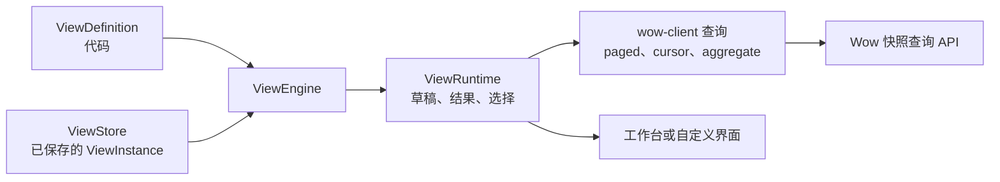

# 视图引擎

::: warning 尚未发布
`@ahoo-wang/wow-view-engine` 还没有发布到 npm。它仍在积极开发中，不承诺兼容：任何导出都可能改变形态，改动也不附带兼容层。本页描述目标用法，供你评估；暂时不要在生产环境依赖它。
:::

视图引擎是面向 Wow 业务应用的数据视图引擎。应用在代码中声明“这份数据能怎样观察”：字段、类型、操作符、可用的维度与指标。用户在界面上决定“这次怎样观察”：筛选、列、排序、维度与指标、图表和面板组合。引擎把这次选择编译成 Wow 查询，通过 `@ahoo-wang/wow-client` 执行，渲染结果，并把值得保留的观察方式保存下来，一键重新打开。

它是 `@ahoo-wang/fetcher-viewer` 的后继者；`fetcher-viewer` 留在 Fetcher 5.x，本站不再介绍。

## 要解决的问题

业务系统里的大多数页面其实是同一种页面：一个带筛选、排序和分页的列表，有时再加一张图。每个业务对象都复制一份；“再加一个筛选条件”“按仓库拆开看看”这样的需求，每次都要改代码、排期、发版。数据没有变，变的只是观察方式。

| 面向 | 得到什么 |
|---|---|
| 业务用户 | 在声明的能力范围内调整范围、组织与呈现方式，保存常用视图并一键重新打开 |
| 研发 | 每个业务对象只写一个定义和一个查询客户端，不再为列表、分析、概览各写一套页面；筛选、分页、保存与冲突处理只实现一次 |
| 产品 | 支持范围内的呈现调整变成配置；新增业务对象只新增定义，引擎里不出现业务分支 |

它不是数据库，不是权限系统，不是通用的低代码页面搭建工具，也不是 BI 建模工具。数据、聚合能力和授权都来自 Wow 服务。

## 三条事实

设计先固定三条事实，其余都由它们推出：

| 事实 | 推论 |
|---|---|
| 定义是代码 | 没有定义服务，也没有定义版本。改定义就是一次部署；已保存的视图在打开时校验 |
| 配置是数据 | 只持久化 `ViewInstance` 和个人偏好。一致性靠乐观 revision 加幂等 `requestId` |
| 运行时状态是临时的 | 草稿、结果、分页和选择都只存在于一个打开的 `ViewRuntime` 中，从不持久化 |



## 视图

| 视图 | 用户做什么 |
|---|---|
| 记录视图 | 筛选状态为待处理，按创建时间排序，只保留需要的列，保存为“今日待处理” |
| 分析视图 | 以仓库为维度，以订单数和金额合计为指标，切换成柱状图 |
| 仪表盘 | 把几个视图放在同一页，用全局时间范围统一约束 |
| 嵌入视图或仪表盘 | 在业务页面里展示一个已保存的视图，例如某个客户的订单，不需要工作台 |
| 系统视图 | 在定义里声明“全部”“待处理”“本周新增”，用户一打开就有可用的视图 |

## 目标用法

这个包目前还不能安装。发布之后的安装方式是：

```sh
pnpm add @ahoo-wang/wow-view-engine @ahoo-wang/wow-client
```

只有 `/react` 和 `/ui` 入口需要 `react` 与 `react-dom`；根入口可以在 Node 中运行。

### 1. 声明定义

<!-- typecheck: file=orders.ts -->

```ts
import type { ViewDefinition } from '@ahoo-wang/wow-view-engine';

export const orders: ViewDefinition = {
  id: 'orders',
  title: 'Orders',
  kind: 'data',
  source: 'orders',
  fields: [
    { name: 'id', label: 'Order', kind: 'string', sortable: true },
    {
      name: 'status',
      label: 'Status',
      kind: 'enum',
      options: [
        { value: 'PENDING', label: 'Pending' },
        { value: 'SHIPPED', label: 'Shipped' },
      ],
    },
    { name: 'warehouse', label: 'Warehouse', kind: 'string' },
    { name: 'amount', label: 'Amount', kind: 'number', summary: ['SUM', 'AVG'] },
    { name: 'createdAt', label: 'Created', kind: 'datetime', sortable: true },
  ],
  // 行键必须可排序：每个记录视图查询的排序最后都以它收尾。
  record: { rowKey: 'id', paging: 'paged', layouts: ['table', 'card'] },
};
```

### 2. 创建引擎

<!-- typecheck-context
import type { ViewSource } from '@ahoo-wang/wow-view-engine';
import { orders } from './orders';
declare const queryClients: Record<string, ViewSource>;
-->

```ts
import { MemoryViewStore, ViewEngine } from '@ahoo-wang/wow-view-engine';

const engine = new ViewEngine({
  definitions: [orders],
  store: new MemoryViewStore(),
  // 来自 @ahoo-wang/wow-client 的 Pick<QueryApi, 'paged' | 'cursor' | 'aggregate'>
  resolveSource: key => queryClients[key],
});
```

`MemoryViewStore` 适合测试和示例。业务应用要针对自己的后端实现 `ViewStore` 端口，见[参考](../../reference/typescript/wow-view-engine/#persistence)。

### 3. 渲染工作台，或组合自己的界面

<!-- typecheck-context
import type { ViewEngine } from '@ahoo-wang/wow-view-engine';
declare const engine: ViewEngine;
-->

```tsx
import '@ahoo-wang/wow-view-engine/styles.css';
import { DataWorkbench } from '@ahoo-wang/wow-view-engine/ui';

export function OrdersPage() {
  return <DataWorkbench engine={engine} definitionId="orders" />;
}
```

视图跟随页面的明暗，颜色取自 CSS 变量。想穿一套内置外观，多引一个文件、写上它的名字——这里是中国企业后台风格的 `azure`；另有桌面原生的 `porcelain` 与方角运维台的 `graphite`：

<!-- typecheck-context
import type { ViewEngine } from '@ahoo-wang/wow-view-engine';
declare const engine: ViewEngine;
-->

```tsx
import '@ahoo-wang/wow-view-engine/styles.css';
import '@ahoo-wang/wow-view-engine/themes/azure.css';
import { DataWorkbench } from '@ahoo-wang/wow-view-engine/ui';

export function OrdersPage() {
  return <DataWorkbench engine={engine} definitionId="orders" preset="azure" />;
}
```

也可以在 `<html>` 上写 `data-fve-preset="azure"`，所有视图与弹层都换上它。只有一个品牌色？改引 `themes/brand.css`，在 `<html>` 上写 `data-fve-preset="brand"` 与 `--fve-brand: <你的颜色>`：主色与淡色都从这一个颜色派生，每一条对比度线都守得住（[一个品牌色](./view-engine-theming.md#一个品牌色)）。预设目录、「我的品牌该选哪套」、宿主变量、`theme="system"`、钉住与 shadcn 桥接见[视图引擎的主题](./view-engine-theming.md)。

自定义布局使用 `/react` 入口的无头 Hook，例如 `useOpenView`、`useViewRuntime`、`useFilterEditor` 和 `useRecordTable`，用它们渲染任意标记，不需要接触引擎内部。

第一个完整示例围绕记录视图工作台展开：筛选待处理订单，调整列和排序，保存个人视图，再重新打开。它会随包一起发布。

## 在 Storybook 中试用

每种视图都在 [Storybook](/storybook/) 里用内存夹具运行，放在一个宿主应用外壳中。保存、改名和删除都写入每次打开时新建的内存存储。

| 视图 | Storybook |
|---|---|
| 记录视图 | [记录视图工作台](/storybook/?path=/docs/view-engine-组件状态-记录工作台--docs)及其[筛选编辑器](/storybook/?path=/docs/view-engine-组件状态-筛选编辑器--docs) |
| 分析视图 | [分析工作台](/storybook/?path=/docs/view-engine-组件状态-分析工作台--docs) |
| 仪表盘 | [仪表盘](/storybook/?path=/docs/view-engine-组件状态-仪表盘--docs) |
| 嵌入视图或仪表盘 | [EmbeddedView](/storybook/?path=/docs/view-engine-组件状态-embeddedview--docs) 和 [EmbeddedDashboard](/storybook/?path=/docs/view-engine-组件状态-embeddeddashboard--docs) |
| 主题 | [主题一览与对比度矩阵](/storybook/?path=/docs/view-engine-能力-主题与预设--docs) |

## 延伸阅读

- [wow-view-engine 参考](../../reference/typescript/wow-view-engine/)：入口、概念、持久化端口与扩展点。
- [视图引擎的主题](./view-engine-theming.md)：预设、宿主变量、亮暗与跟随系统、shadcn 桥接，以及覆盖变量要守的对比度。
- [视图引擎的可访问性](./view-engine-accessibility.md)：WCAG 2.2 AA 符合性声明、键盘与读屏走查，以及已知缺口。
- [设计文档](https://github.com/Ahoo-Wang/Wow/tree/main/typescript/wow-view-engine/docs/design)：包发布之前以它为准。
- [包 README](https://github.com/Ahoo-Wang/Wow/blob/main/typescript/wow-view-engine/README.md)：API 的当前状态。
