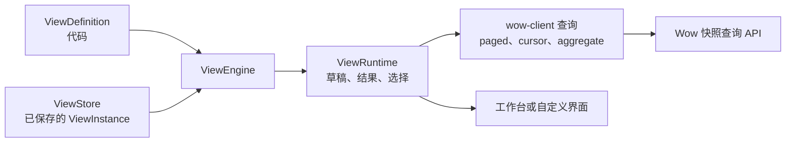

# 视图引擎

::: info Wow 9.2.0 起在 npm 上
`@ahoo-wang/wow-view-engine` 从 Wow 9.2.0 起在 npm 上，与 Wow 同一个 tag、同一个版本号发布。从 9.2.0 起，补丁版本不破坏它的公开面：每个入口的导出，包括后端实现的 `ViewStore` 端口；[CSS 合同](./view-engine-theming.md#什么是公开的)；消息键与 issue code；以及 `wow-view-engine` 命令。次版本可以破坏，它的发布说明逐条列出每个破坏与迁移步骤；Wow 包请停在同一个次版本上（[版本范围](./compatibility.md#版本范围)）。以旧形状保存的视图照常打开：引擎在读取时迁移存储的配置。
:::

视图引擎是面向 Wow 业务应用的数据视图引擎。应用在代码中声明“这份数据能怎样观察”：字段、类型、操作符、可用的维度与指标。用户在界面上决定“这次怎样观察”：筛选、列、排序、维度与指标、图表和面板组合。引擎把这次选择编译成 Wow 查询，通过 `@ahoo-wang/wow-client` 执行，渲染结果，并把值得保留的观察方式保存下来，一键重新打开。

它是 `@ahoo-wang/fetcher-viewer` 的后继者；`fetcher-viewer` 留在 Fetcher 5.x，本站不再介绍。

## 从哪里开始

| 想做什么 | 阅读 |
|---|---|
| 从零接入一个业务对象：安装、查询描述、`defineView`、引擎、`ViewHost`、一个操作，对着示例服务端跑起来 | [视图引擎入门](./view-engine-getting-started.md) |
| 先弄清这些词：定义、记录与分析视图、看板、系统／共享／个人视图、revision 与存储，以及它们怎样相连 | [视图引擎的核心概念](./view-engine-concepts.md) |
| 写一份定义：描述符里的事实、措辞的键、收窄、`rowFields`、系统视图与看板、用 `admit` 自检 | [写好一份定义](./view-engine-definitions.md) |
| 换一套内置外观、用品牌色、接上宿主的 shadcn 主题 | [视图引擎的主题](./view-engine-theming.md) |
| 键盘、读屏与 WCAG 2.2 AA 符合性 | [视图引擎的可访问性](./view-engine-accessibility.md) |
| 把引擎接进应用：`ViewHost`、`bind`、路由端口、导航、嵌入、措辞与语言、用 `/testing` 测 | [把引擎接进宿主](./view-engine-host.md) |
| 记录上的命令：可用规则、放在哪、确认与表单、多选、结局 | [声明式操作](./view-engine-actions.md) |
| 在严格的内容安全策略下运行 | [视图引擎的内容安全策略](./view-engine-csp.md) |
| 选一个 store：内存、浏览器里的快照、Wow 服务端，或自己实现 `ViewStore` 并跑一致性测试 | [视图存在哪里](./view-engine-storage.md) |
| 在 Kotlin 服务里嵌入视图存储，或运行独立服务端：配置、存储、系统视图、网关规则 | [视图存储](../extensions/view-store.md) |
| 不用工作台，用 `/react` 的无头 Hook（`useOpenView`、`useViewRuntime`、`useFilterEditor`、`useRecordTable`）画自己的界面 | [React Hooks](../../reference/typescript/wow-view-engine/react.md) |
| 查一个公开名字的签名 | [wow-view-engine 参考](../../reference/typescript/wow-view-engine/)的专题：[引擎与资源](../../reference/typescript/wow-view-engine/engine.md)、[定义与字段类型](../../reference/typescript/wow-view-engine/definitions.md)、[宿主接线](../../reference/typescript/wow-view-engine/host.md)、[工作台与嵌入](../../reference/typescript/wow-view-engine/components.md)、[持久化端口](../../reference/typescript/wow-view-engine/store.md)、[测试工具](../../reference/typescript/wow-view-engine/testing.md)、[Issue code](../../reference/typescript/wow-view-engine/issues.md) |
| 在浏览器里用 `WowViewStore` 连上 Wow 服务端的视图存储 | [wow-view-store 参考](../../reference/typescript/wow-view-store/) |

## 要解决的问题

业务系统里的大多数页面其实是同一种页面：一个带筛选、排序和分页的列表，有时再加一张图。每个业务对象都复制一份；“再加一个筛选条件”“按仓库拆开看看”这样的需求，每次都要改代码、排期、发版。数据没有变，变的只是观察方式。

| 面向 | 得到什么 |
|---|---|
| 业务用户 | 在声明的能力范围内调整范围、组织与呈现方式，保存常用视图并一键重新打开 |
| 研发 | 每个业务对象只写一个定义和一个查询客户端，不再为列表、分析、概览各写一套页面；筛选、分页、保存与冲突处理只实现一次 |
| 产品 | 支持范围内的呈现调整变成配置；新增业务对象只新增定义，引擎里不出现业务分支 |

它不是数据库，不是权限系统，不是通用的低代码页面搭建工具，也不是 BI 建模工具。数据、聚合能力和授权都来自 Wow 服务。

## 三条事实

设计先固定三条事实，其余都由它们推出：

| 事实 | 推论 |
|---|---|
| 定义是代码 | 没有定义服务，也没有定义版本。改定义就是一次部署；已保存的视图在打开时校验 |
| 配置是数据 | 只持久化 `ViewInstance` 和个人偏好。一致性靠乐观 revision 加幂等 `requestId` |
| 运行时状态是临时的 | 草稿、结果、分页和选择都只存在于一个打开的 `ViewRuntime` 中，从不持久化 |

```mermaid
flowchart LR
    Definition["ViewDefinition<br>代码"] --> Engine["ViewEngine"]
    Store["ViewStore<br>已保存的 ViewInstance"] --> Engine
    Engine --> Runtime["ViewRuntime<br>草稿、结果、选择"]
    Runtime --> Query["wow-client 查询<br>paged、cursor、aggregate"]
    Query --> Server["Wow 快照查询 API"]
    Runtime --> UI["工作台或自定义界面"]
```

## 视图

| 视图 | 用户做什么 |
|---|---|
| 记录视图 | 筛选状态为待处理，按创建时间排序，只保留需要的列，保存为“今日待处理” |
| 分析视图 | 以仓库为维度，以订单数和金额合计为指标，切换成柱状图 |
| 仪表盘 | 把几个视图放在同一页，用全局时间范围统一约束 |
| 嵌入视图或仪表盘 | 在业务页面里展示一个已保存的视图，例如某个客户的订单，不需要工作台 |
| 系统视图 | 在定义里声明“全部”“待处理”“本周新增”，用户一打开就有可用的视图 |

## 内容安全策略（CSP）

引擎可以在严格的内容安全策略下运行：`script-src 'self'`、`style-src 'self'`，不开 `'unsafe-inline'` 与 `'unsafe-eval'`。要放行的只有三件事——样式表作为文件加载、打包进来的库加的样式带上页面的 nonce、PNG 导出载入 `blob:` 图片——每件为什么、策略怎样写、哪些测试守着它，见[视图引擎的内容安全策略](./view-engine-csp.md)。

## 在 Storybook 中试用

每种视图都在 [Storybook](/storybook/) 里用内存夹具运行，放在一个宿主应用外壳中。保存、改名和删除都写入每次打开时新建的内存存储。

Storybook 的[接入导览](/storybook/?path=/docs/view-engine-接入导览--docs)按推荐的接法分五步带宿主走一遍——声明定义、接上数据、挂上 `ViewHost`、声明操作、画出页面——页上引用的是一个能跑的示例的真实源文件。

想先看引擎能画什么，打开[图型全景](/storybook/?path=/docs/view-engine-业务场景-图型全景--docs)：一块零售看板，22 种图型各用一次，每张图的标题就是它回答的分析问题，分走势、构成、分布与关系、地域与转化四个页签；点地图、省份或支付方式整板联动，文档页的「Show code」是这块板的全部配置。

| 视图 | Storybook |
|---|---|
| 记录视图 | [记录视图工作台](/storybook/?path=/docs/view-engine-组件状态-记录工作台--docs)及其[筛选编辑器](/storybook/?path=/docs/view-engine-组件状态-筛选编辑器--docs) |
| 分析视图 | [分析工作台](/storybook/?path=/docs/view-engine-组件状态-分析工作台--docs) |
| 仪表盘 | [仪表盘](/storybook/?path=/docs/view-engine-组件状态-仪表盘--docs) |
| 嵌入视图或仪表盘 | [EmbeddedView](/storybook/?path=/docs/view-engine-组件状态-embeddedview--docs) 和 [EmbeddedDashboard](/storybook/?path=/docs/view-engine-组件状态-embeddeddashboard--docs) |
| 主题 | [主题一览与对比度矩阵](/storybook/?path=/docs/view-engine-能力-主题与预设--docs) |

## 延伸阅读

- [视图引擎入门](./view-engine-getting-started.md)：把示例服务端的销售订单从零接进来，一步一个文件。
- [视图引擎的核心概念](./view-engine-concepts.md)：定义、视图、看板、系统／共享／个人视图、revision 与存储，各自是什么、为什么这样分。
- [写好一份定义](./view-engine-definitions.md)：从描述符的事实出发，逐项做选择，写措辞与系统视图，用 `admit` 自检。
- [把引擎接进宿主](./view-engine-host.md)：一个引擎、`ViewHost` 的端口、`bind`、路由、嵌入、措辞与语言，以及用 `/testing` 测接线。
- [声明式操作](./view-engine-actions.md)：记录上的命令怎样声明，引擎怎样放置、确认、批量执行并报告结局。
- [视图引擎的内容安全策略](./view-engine-csp.md)：严格策略下要放行的三件事，以及守着它的测试。
- [视图存在哪里](./view-engine-storage.md)：按「谁要看到保存的视图」选一个 store，接上 `WowViewStore`，或自己写一个并跑一致性测试。
- [视图存储](../extensions/view-store.md)：Kotlin 服务端——嵌入 starter 还是独立服务端、Docker 镜像、配置项、系统视图，以及它需要的 [CoSec 网关规则](../extensions/view-store.md#安全模型)。
- [wow-view-engine 参考](../../reference/typescript/wow-view-engine/)：入口、概念、持久化端口与扩展点；[专题](../../reference/typescript/wow-view-engine/#topics)逐个给出宿主用到的签名，[Issue code](../../reference/typescript/wow-view-engine/issues.md) 列出引擎能报的每个 code。
- [wow-view-store 参考](../../reference/typescript/wow-view-store/)：`WowViewStore`、Wow 服务端上的保存视图。
- [视图引擎的主题](./view-engine-theming.md)：预设、宿主变量、亮暗与跟随系统、shadcn 桥接，以及覆盖变量要守的对比度。
- [视图引擎的可访问性](./view-engine-accessibility.md)：WCAG 2.2 AA 符合性声明、键盘与读屏走查，以及已知缺口。
- [设计文档](https://github.com/Ahoo-Wang/Wow/tree/main/typescript/wow-view-engine/docs/design)：模型以它为准。
- [包 README](https://github.com/Ahoo-Wang/Wow/blob/main/typescript/wow-view-engine/README.md)：API 的当前状态。
