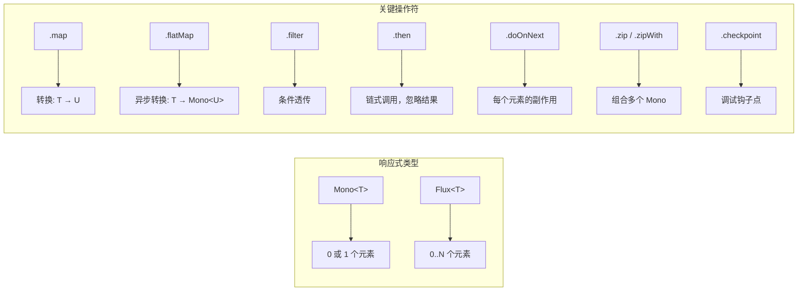
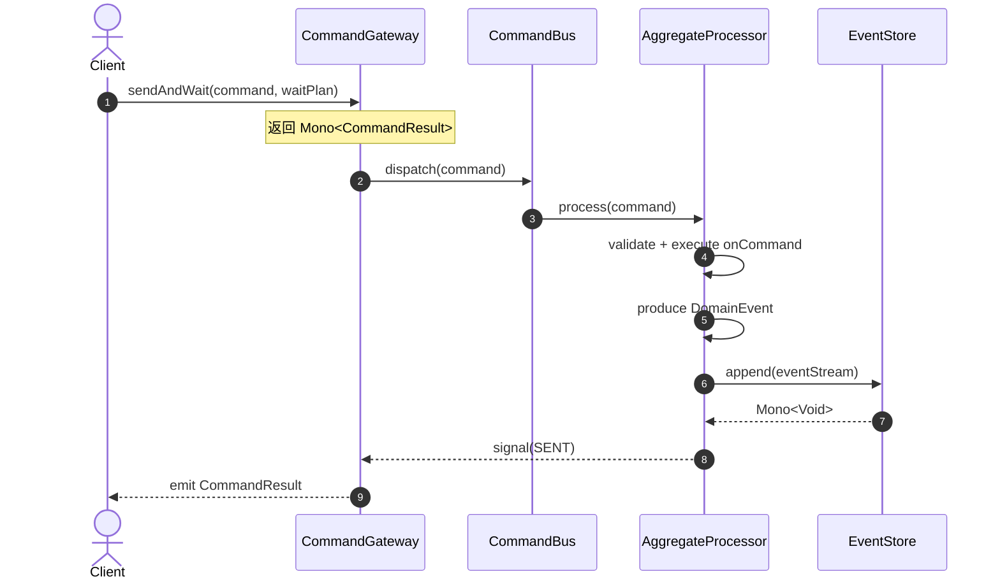
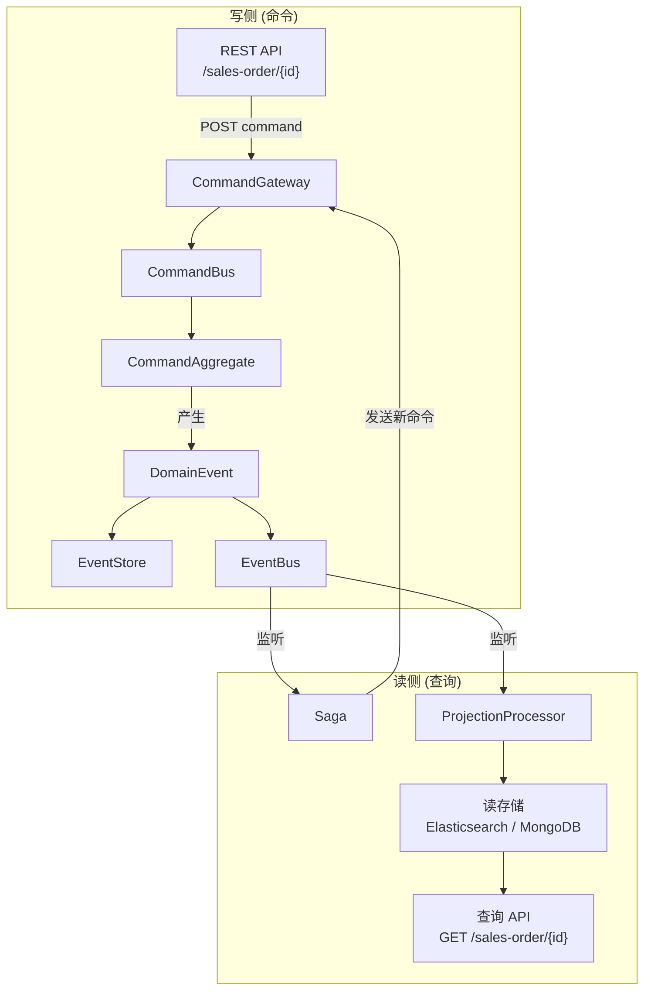
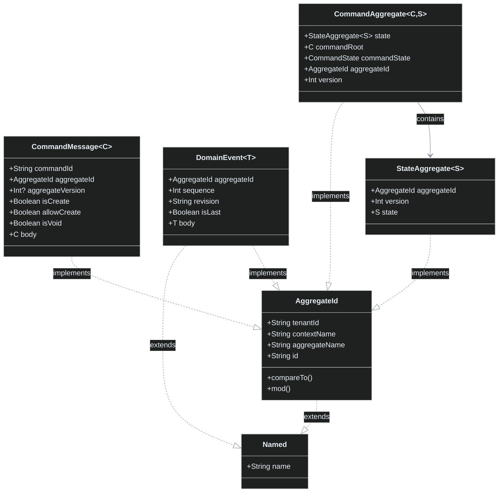
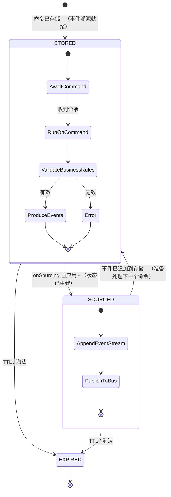
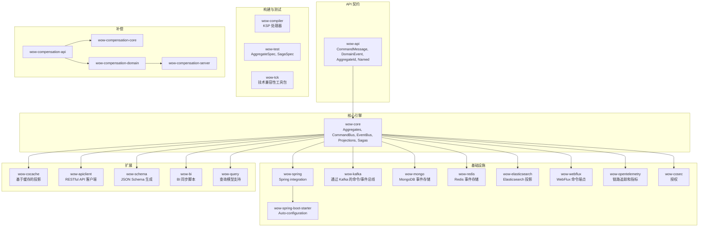
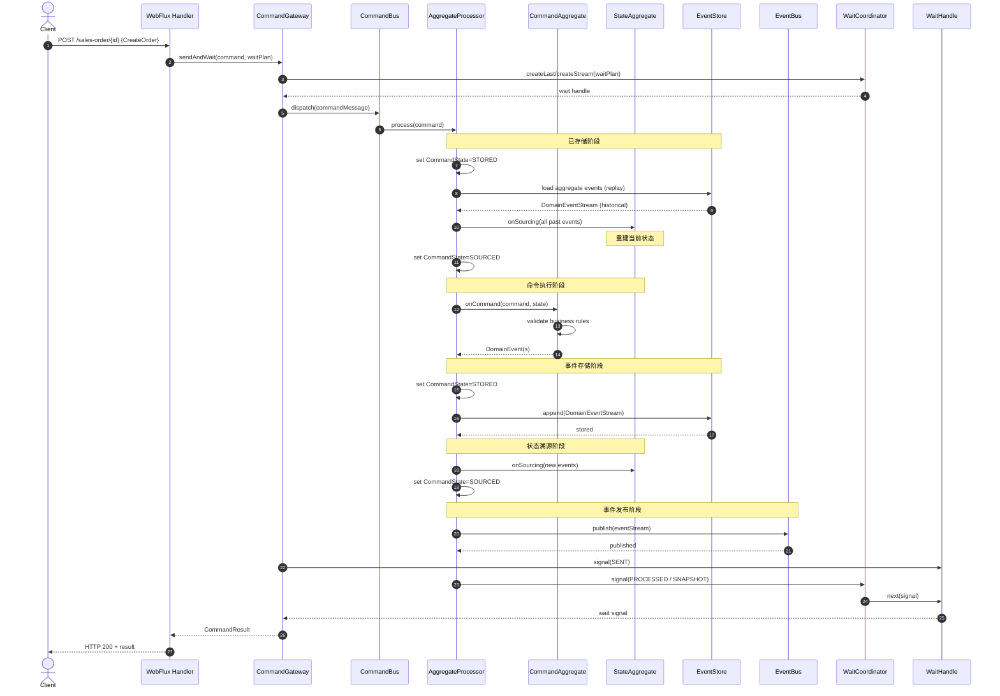
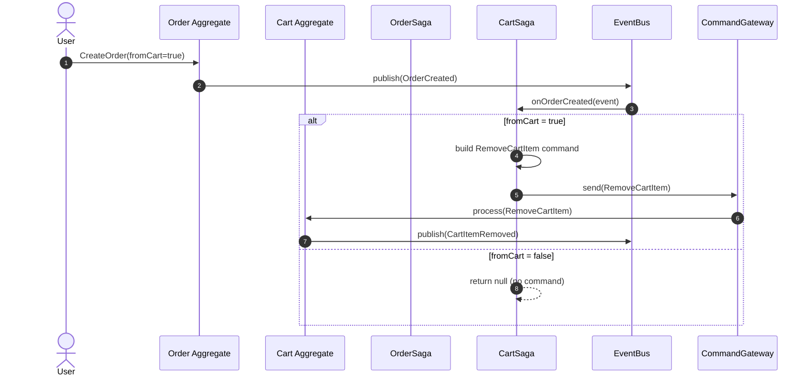
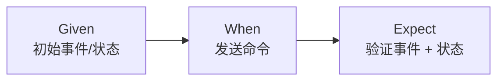

# 贡献者入门指南

欢迎来到 Wow 框架。本指南旨在带你从第一次 `git clone` 到自信地贡献领域逻辑、核心引擎功能或基础设施集成。它涵盖了你作为贡献者将使用的语言基础、架构模式和日常工作流程。

::: tip 这份指南是为谁准备的？
你应该已经了解 Java 并对 Spring Boot 有一定经验。如果你是 Kotlin 新手，第一部分会帮你弥合差距。如果你对 DDD/事件溯源不熟悉，第二部分会在 Wow 上下文中介绍这些概念。
:::

---

## 第一部分：语言和框架基础

### Kotlin 面向 Java 开发者

Wow 完全用 Kotlin 编写，但它设计为可以与 Java 干净地互操作。位于 `example/transfer/` 的示例项目就是用 Java 编写的，以此证明这一点。尽管如此，你的大部分贡献将使用 Kotlin 2.3 编写，目标平台为 JVM 17。

以下是从 Java 转过来最重要的内容：

| Kotlin 概念 | Java 等价物 | 你会在哪里看到它 |
|---|---|---|
| `data class` | Lombok `@Data` 或 Java record | 命令（`AddCartItem`）、事件（`OrderCreated`）、状态类（`CartState`） |
| `object` | 带 `private constructor` 的单例 | `AggregateVerifier`、`GlobalIdGenerator` |
| `companion object` | `static` 成员 | 日志记录器、工厂方法、常量 |
| `val` / `var` | `final` / 可变字段 | 事件上的不可变属性；聚合上的可变状态 |
| 扩展函数 | 静态工具方法（如 `StringUtils`） | AssertJ 的 `.assert()`、`.commandBuilder()` |
| `when` 表达式 | `switch` 语句（穷举型） | 事件类型匹配 |
| `lateinit var` + `private set` | 构造后初始化、外部只读的字段 | `onSourcing` 填充的聚合状态字段 |
| 空安全（`?.`、`?:`、`!!`） | `Optional` 或空检查 | 对可选字段的安全导航 |
| `sealed class` / `sealed interface` | 带数据的枚举（Java 17+） | `CommandState`、`OrderStatus` |
| `inline` + `reified` | 类型令牌 / `Class<T>` 传递 | 测试 DSL（`aggregateVerifier<Cart, CartState>()`） |
| 协程（`suspend`） | 虚拟线程（Loom）/ `CompletableFuture` | 命令处理器中 Reactor 的替代方案 |

**需要重点研究的文件：** Order 聚合展示了生产级 Kotlin 模式 -- `Order.kt` 使用了扩展函数接收器、`Mono` 返回类型，以及用于依赖注入的 `@Name` 限定符。

> [Order.kt:57-217](https://github.com/Ahoo-Wang/Wow/blob/main/example/example-domain/src/main/kotlin/me/ahoo/wow/example/domain/order/Order.kt#L57-L217)

#### 领域事件的数据类

Wow 中的领域事件遵循声明式设计 -- 它们是不可变的 `data class` 记录。没有 setter，没有副作用。

<!-- Source: CartItemAdded is defined in example-api module, here shown in CartState sourcing at CartState.kt:28 -->
```kotlin
// 命令和事件就是简单的数据类
@Serializable
data class CartItemAdded(val added: CartItem)
data class CartItem(val productId: String, val quantity: Int)
```

#### 用于测试的扩展函数

Wow 用来自 `me.ahoo.test:fluent-assert-core` 的扩展函数 `.assert()` 替代 AssertJ 的 `assertThat()`。

<!-- Source: testing convention from AGENTS.md and AggregateVerifier.kt examples -->
```kotlin
// 不要这样做：
assertThat(items).hasSize(1)

// 应该这样做：
items.assert().hasSize(1)
```

---

### Project Reactor：Mono 和 Flux

Wow 中所有的命令处理、事件发布和 Saga 编排都在 [Project Reactor](https://projectreactor.io/) 上运行。这是框架的响应式骨干。



<!-- Sources: CommandGateway.kt:128 (Mono return), Order.kt:110 (Mono<OrderCreated>), CartSaga.kt:33 (Mono-based handler) -->

**关键规则：** 在 Wow 中，每个命令处理器、事件处理器和 Saga 方法**必须**是非阻塞的。绝对不要在处理器中调用 `Thread.sleep()`、阻塞 I/O 或 `.block()`。框架会为你处理线程。



<!-- Sources: CommandGateway.kt:89-92 (send), CommandAggregate.kt:65-82 (CommandState lifecycle), WaitPlan.kt:60-81 (waiting) -->

**Wow 中常见的 Mono 模式：**

<!-- Source: Order.kt:106-138 (Flux chaining with flatMap + then), CartSaga.kt:33-42 (conditional Mono return) -->
```kotlin
// 链式调用多个异步验证，然后产生事件
Flux.fromIterable(createOrder.items)
    .flatMap(specification::require)
    .then(orderCreated.toMono())

// 条件 Saga：返回 null 表示跳过
fun onOrderCreated(event: DomainEvent<OrderCreated>): CommandBuilder? {
    if (!event.body.fromCart) return null   // null 表示"没有要发送的命令"
    return RemoveCartItem(productIds = ...).commandBuilder().aggregateId(event.ownerId)
}
```

---

### 协程与 Reactor 互操作

Wow 同时支持 Reactor（`Mono`/`Flux`）和 Kotlin 协程（`suspend`）用于命令和事件处理器。编译时的 KSP 处理器和运行时框架会检测你使用的风格并相应适配。

互操作层由 `kotlinx-coroutines-reactor` 库提供，它可以进行以下转换：

| 从 | 到 | 转换 |
|---|---|---|
| `Mono<T>` | `suspend fun` → `T` | `mono.awaitSingle()` |
| `Flux<T>` | `Flow<T>` | `flux.asFlow()` |
| `suspend fun` → `T` | `Mono<T>` | `mono { ... }` |
| `Flow<T>` | `Flux<T>` | `flow.asFlux()` |

**你可以选择任一风格**并在同一个聚合中混用。

<!-- Source: Order.kt:70-101 (comments showing coroutine style next to Reactor style) -->
```kotlin
// Reactor 风格（Order.kt 中使用）
fun onCommand(command: CommandMessage<CreateOrder>, ...): Mono<OrderCreated> {
    return Flux.fromIterable(createOrder.items)
        .flatMap(specification::require)
        .then(orderCreated.toMono())
}

// 协程风格（等价 -- 在 Javadoc 注释中列出）
suspend fun onCommand(command: CommandMessage<CreateOrder>, ...): OrderCreated {
    createOrder.items.asFlow().collect { specification.require(it).awaitSingle() }
    return orderCreated
}
```

::: tip 应该使用哪种风格？
- **协程**：当你更喜欢顺序代码、有复杂的分支逻辑，或使用 `Flow` 进行流处理时。

两者都得到完全支持。选择是风格上的。
:::

---

### Spring Boot 4.x 基础

Wow 8.x 需要 Spring Boot 4.x，并通过 `wow-spring-boot-starter` 自动配置。你不需要为 Wow 引擎编写 `@Configuration` 类 -- 都是自动配置。

#### 功能能力

Starter 使用 Gradle 功能变体来声明可选能力。根据你的需要来依赖：

<!-- Source: AGENTS.md -->
| 能力 | Gradle 依赖 | 提供的内容 |
|---|---|---|
| `mongo-support` | `wow-mongo` | 通过 MongoDB 的事件存储 + 快照存储 |
| `redis-support` | `wow-redis` | 通过 Redis 的事件存储 + 快照存储 |
| `kafka-support` | `wow-kafka` | 通过 Kafka 的命令/事件总线 |
| `webflux-support` | `wow-webflux` | 命令的 REST API 端点 |
| `elasticsearch-support` | `wow-elasticsearch` | 通过 Elasticsearch 的投影存储 |
| `opentelemetry-support` | `wow-opentelemetry` | 链路追踪和指标 |
| `openapi-support` | `wow-openapi` | OpenAPI 规范生成 |
| `cosec-support` | `wow-cosec` | 授权和访问控制 |
| `mock-support` | `wow-mock` | 用于测试的内存实现 |

Source: [AGENTS.md](https://github.com/Ahoo-Wang/Wow/blob/main/AGENTS.md)

#### 通过 KSP 自动注册

`wow-compiler` KSP 处理器在编译时扫描你的 classpath 并生成：
- 命令路由元数据（哪个聚合处理哪个命令）
- 事件处理元数据（哪些 Saga/投影监听哪些事件）
- OpenAPI 路由规范

你不需要编写控制器。你只需编写领域模型。框架会自动生成 REST 层。

Source: [AGENTS.md](https://github.com/Ahoo-Wang/Wow/blob/main/AGENTS.md)

#### 响应式 + Spring 集成

所有 Wow Bean 都是响应式的。`wow-webflux` 中的 Spring WebFlux 集成为每个命令类型注册 `HandlerFunction` 路由。命令通过 HTTP POST 到达，被反序列化为 `CommandMessage<T>`，然后通过 `CommandGateway` 分发。

---

## 第二部分：架构与领域模型

### 全局图景：CQRS + 事件溯源

Wow 将写侧（改变状态的命令）与读侧（返回投影的查询）分离。这就是 CQRS。每个状态变化都记录为一个不可变事件。当前状态是所有过去事件的累积。这就是事件溯源。



<!-- Sources: CommandGateway.kt:75-178 (CommandGateway interface), DomainEvent.kt:52-95 (DomainEvent interface), CommandAggregate.kt:41-53 (CommandAggregate interface) -->

### Wow 中的 DDD 概念

Wow 通过一组内聚的接口、注解和模式来实现领域驱动设计。

#### 聚合：事务边界

**聚合**是一组作为单一单元处理的领域对象。在 Wow 中，聚合有两个部分：

1. **命令聚合**（`CommandAggregate<C, S>`）：处理命令、验证业务规则并发布事件。它**不**直接存储状态。
2. **状态聚合**（`StateAggregate<S>`）：持有聚合的当前状态。它通过 `onSourcing` 从事件重建。



<!-- Sources: CommandMessage.kt:53-126, DomainEvent.kt:52-95, CommandAggregate.kt:41-53, AggregateId.kt:29-57, Named.kt:22-29 -->

#### 两阶段命令处理器模式

每个聚合都实现了关注点分离：

| 阶段 | 注解 | 位置 | 职责 | 返回值 |
|---|---|---|---|---|
| **命令处理** | `@OnCommand` | Command Aggregate 类（如 `Order`） | 验证业务规则，检查状态前置条件，产生领域事件 | `Mono<Event>` 或 `Event` 或 `Iterable<Event>` 或 `suspend fun → Event` |
| **状态溯源** | `@OnSourcing` | 状态类（如 `OrderState`） | 应用事件来变更状态。必须是确定性的，无副作用。 | `Unit`（void） |

<!-- Sources: OnCommand.kt:19-87, OnSourcing.kt:19-59, Order.kt:106-138 (onCommand), OrderState.kt:82-118 (onSourcing) -->



<!-- Sources: CommandState.kt:65-118 (STORED/SOURCED/EXPIRED enum), CommandAggregate.kt:41-53 (lifecycle binding) -->

**关键设计规则：** `onSourcing` 函数**不**执行业务验证。它**不**调用外部服务。它只是将事件的数据应用到状态。`onCommand` 函数处理所有验证。这种分离使事件溯源变得可靠 -- 重放事件总是产生相同的状态。

<!-- Source: OrderState.kt:69-81 (comment: "event sourcing function only modifies state, no side effects") -->

```kotlin
// 命令处理器：验证，返回事件 (Order.kt:158-163)
fun onCommand(changeAddress: ChangeAddress): AddressChanged {
    check(OrderStatus.CREATED == state.status) {
        "当前订单[${state.id}] 状态[${state.status}] 不能修改地址"
    }
    return AddressChanged(changeAddress.shippingAddress)
}

// 状态溯源：应用事件，不验证 (OrderState.kt:92-94)
fun onSourcing(addressChanged: AddressChanged) {
    address = addressChanged.shippingAddress
}
```

> [Order.kt:158-163](https://github.com/Ahoo-Wang/Wow/blob/main/example/example-domain/src/main/kotlin/me/ahoo/wow/example/domain/order/Order.kt#L158-L163) 和 [OrderState.kt:92-94](https://github.com/Ahoo-Wang/Wow/blob/main/example/example-domain/src/main/kotlin/me/ahoo/wow/example/domain/order/OrderState.kt#L92-L94)

#### 实体和值对象

- **实体**：具有唯一标识且在时间上持久存在的对象。在 Wow 中，`AggregateId` 就是标识。状态类（`OrderState`）是实体快照。
- **值对象**：由其属性而非标识定义的对象。不可变。示例：`ShippingAddress`、`OrderItem`、`CartItem`。

<!-- Source: Annotation package — ValueObject.kt, EntityObject.kt -->
Wow 不通过接口来强制执行这些概念；它们是通过 `data class`（值对象）和可变状态类（实体）应用的设计模式。

---

### 模块依赖图



<!-- Sources: settings.gradle.kts:19-83, AGENTS.md, build.gradle.kts:31-51 -->

---

### 命令处理管线

这是从命令进入系统到返回响应的完整生命周期。



<!-- Sources: CommandGateway.kt:89-159, WaitCoordinator.kt:18-72, WaitHandle.kt:22-223, WaitPlan.kt:20-71, Order.kt:106-138, OrderState.kt:82-118 -->

---

### Saga 编排

Saga 协调多聚合业务过程。Saga 监听领域事件，并作为响应向其他聚合发送新命令。



<!-- Sources: CartSaga.kt:26-43, OrderSaga.kt:21-43 -->

---

### 等待计划：控制命令响应时机

`WaitPlan` 接口控制调用者等待多长时间以及处理的哪个阶段触发响应。

| 等待计划 | 方法 | 返回时机 | 使用场景 |
|---|---|---|---|
| SENT | `sendAndWaitForSent()` | 命令被总线接受时 | 即发即忘，高吞吐量 |
| PROCESSED | `sendAndWaitForProcessed()` | 聚合处理完成，事件已发布时 | 同步请求-响应，写后读 |
| SNAPSHOT | `sendAndWaitForSnapshot()` | 状态快照已持久化时 | 响应前确保持久性 |

<!-- Sources: CommandGateway.kt:127-159, WaitPlan.kt:20-71 -->

> [CommandGateway.kt:127-159](https://github.com/Ahoo-Wang/Wow/blob/main/wow-core/src/main/kotlin/me/ahoo/wow/command/CommandGateway.kt#L127-L159)

README 中的性能基准展示了其影响：

| 场景 | WaitPlan | 平均 TPS | 平均响应时间 |
|---|---|---|---|
| Add to Cart | SENT | 59,625 | 29 ms |
| Add to Cart | PROCESSED | 18,696 | 239 ms |
| Create Order | SENT | 47,838 | 217 ms |
| Create Order | PROCESSED | 18,230 | 268 ms |

Source: [README.md:70-99](https://github.com/Ahoo-Wang/Wow/blob/main/README.md#L70-L99)

---

### 关键类和接口参考

| 接口 / 类 | 模块 | 角色 | 源代码 |
|---|---|---|---|
| `Named` | `wow-api` | 可命名对象的基接口 | [Named.kt:22](https://github.com/Ahoo-Wang/Wow/blob/main/wow-api/src/main/kotlin/me/ahoo/wow/api/naming/Named.kt#L22) |
| `AggregateId` | `wow-api` | 携带租户、上下文、名称与 ID 的聚合坐标；ID 在命名聚合范围内跨租户唯一 | [AggregateId.kt:29](https://github.com/Ahoo-Wang/Wow/blob/main/wow-api/src/main/kotlin/me/ahoo/wow/api/modeling/AggregateId.kt#L29) |
| `CommandMessage<C>` | `wow-api` | 命令信封，包含聚合定位、版本控制、幂等性 | [CommandMessage.kt:53](https://github.com/Ahoo-Wang/Wow/blob/main/wow-api/src/main/kotlin/me/ahoo/wow/api/command/CommandMessage.kt#L53) |
| `DomainEvent<T>` | `wow-api` | 关于过去状态变更的不可变事实，携带聚合标识 | [DomainEvent.kt:52](https://github.com/Ahoo-Wang/Wow/blob/main/wow-api/src/main/kotlin/me/ahoo/wow/api/event/DomainEvent.kt#L52) |
| `Message<SOURCE, T>` | `wow-api` | 带 header + body 的泛型消息，流式 API | [Message.kt:38](https://github.com/Ahoo-Wang/Wow/blob/main/wow-api/src/main/kotlin/me/ahoo/wow/api/messaging/Message.kt#L38) |
| `CommandAggregate<C, S>` | `wow-core` | 运行时聚合，协调命令 ↔ 状态 ↔ 事件 | [CommandAggregate.kt:41](https://github.com/Ahoo-Wang/Wow/blob/main/wow-core/src/main/kotlin/me/ahoo/wow/modeling/command/CommandAggregate.kt#L41) |
| `CommandGateway` | `wow-core` | 支持等待计划的高级发送 API | [CommandGateway.kt:75](https://github.com/Ahoo-Wang/Wow/blob/main/wow-core/src/main/kotlin/me/ahoo/wow/command/CommandGateway.kt#L75) |
| `CommandBus` | `wow-core` | 低级命令分发 | [CommandBus.kt](https://github.com/Ahoo-Wang/Wow/blob/main/wow-core/src/main/kotlin/me/ahoo/wow/command/CommandBus.kt) |
| `WaitPlan` | `wow-core` | 控制等待命令结果的时间 | [WaitPlan.kt:60](https://github.com/Ahoo-Wang/Wow/blob/main/wow-core/src/main/kotlin/me/ahoo/wow/command/wait/WaitPlan.kt#L60) |
| `CommandState` | `wow-core` | 聚合生命周期状态机：STORED → SOURCED → EXPIRED | [CommandAggregate.kt:65](https://github.com/Ahoo-Wang/Wow/blob/main/wow-core/src/main/kotlin/me/ahoo/wow/modeling/command/CommandAggregate.kt#L65) |
| `AggregateVerifier` | `wow-test` | 聚合单元测试入口点（Given-When-Expect） | [AggregateVerifier.kt:57](https://github.com/Ahoo-Wang/Wow/blob/main/test/wow-test/src/main/kotlin/me/ahoo/wow/test/AggregateVerifier.kt#L57) |
| `SagaVerifier` | `wow-test` | Saga 单元测试入口点 | [SagaVerifier.kt](https://github.com/Ahoo-Wang/Wow/blob/main/test/wow-test/src/main/kotlin/me/ahoo/wow/test/SagaVerifier.kt) |

### 注解参考

Wow 广泛使用注解进行声明式设计。以下是你将遇到的每个注解：

| 注解 | 目标 | 用途 | 源代码 |
|---|---|---|---|
| `@AggregateRoot` | 类 | 将类标记为聚合根；可选择性地挂载命令 | [AggregateRoot.kt:66](https://github.com/Ahoo-Wang/Wow/blob/main/wow-api/src/main/kotlin/me/ahoo/wow/api/annotation/AggregateRoot.kt#L66) |
| `@AggregateRoute` | 类 | 配置 API 路由、所有权策略、资源命名 | [AggregateRoute.kt:59](https://github.com/Ahoo-Wang/Wow/blob/main/wow-api/src/main/kotlin/me/ahoo/wow/api/annotation/AggregateRoute.kt#L59) |
| `@OnCommand` | 函数 | 将函数标记为命令处理器（返回：`Mono<Event>` 或 `Event`） | [OnCommand.kt:73](https://github.com/Ahoo-Wang/Wow/blob/main/wow-api/src/main/kotlin/me/ahoo/wow/api/annotation/OnCommand.kt#L73) |
| `@OnSourcing` | 函数 | 将函数标记为状态溯源处理器（确定性，void） | [OnSourcing.kt:59](https://github.com/Ahoo-Wang/Wow/blob/main/wow-api/src/main/kotlin/me/ahoo/wow/api/annotation/OnSourcing.kt#L59) |
| `@OnEvent` | 函数 | 将函数标记为领域事件处理器（saga/projection） | [OnEvent.kt:66](https://github.com/Ahoo-Wang/Wow/blob/main/wow-api/src/main/kotlin/me/ahoo/wow/api/annotation/OnEvent.kt#L66) |
| `@StatelessSaga` | 类 | 将类注册为 Saga（自动发现为 Spring `@Component`） | [StatelessSaga.kt:69](https://github.com/Ahoo-Wang/Wow/blob/main/wow-api/src/main/kotlin/me/ahoo/wow/api/annotation/StatelessSaga.kt#L69) |
| `@Retry` | 函数 | 在 saga/事件处理器上启用带退避的重试 | [Retry.kt:74](https://github.com/Ahoo-Wang/Wow/blob/main/wow-api/src/main/kotlin/me/ahoo/wow/api/annotation/Retry.kt#L74) |
| `@Name` | 参数 | 按名称限定注入的依赖 | [Name.kt](https://github.com/Ahoo-Wang/Wow/blob/main/wow-api/src/main/kotlin/me/ahoo/wow/api/annotation/Name.kt) |
| `@AggregateId` | 字段 | 将字段标记为聚合的唯一标识符 | [AggregateId.kt](https://github.com/Ahoo-Wang/Wow/blob/main/wow-api/src/main/kotlin/me/ahoo/wow/api/annotation/AggregateId.kt) |
| `@TenantId` | 字段 | 将字段标记为多租户的租户标识符 | [TenantId.kt](https://github.com/Ahoo-Wang/Wow/blob/main/wow-api/src/main/kotlin/me/ahoo/wow/api/annotation/TenantId.kt) |
| `@BoundedContext` | 类 | 命名 DDD 限界上下文 | [BoundedContext.kt](https://github.com/Ahoo-Wang/Wow/blob/main/wow-api/src/main/kotlin/me/ahoo/wow/api/annotation/BoundedContext.kt) |
| `@ProjectionProcessor` | 类 | 将类注册为投影处理器 | [ProjectionProcessor.kt](https://github.com/Ahoo-Wang/Wow/blob/main/wow-api/src/main/kotlin/me/ahoo/wow/api/annotation/ProjectionProcessor.kt) |

---

## 第三部分：开始高效工作

### 构建系统：Gradle 和 KSP

Wow 使用 Gradle 8.x 和 Kotlin DSL。所有命令从仓库根目录运行。

#### 必需工具链

| 工具 | 版本 | 验证方式 |
|---|---|---|
| JDK | 17+ | `gradle.properties` 中的 `org.gradle.jvmargs=-Xmx2g` |
| Kotlin | 2.3 | `gradle.properties` 中的 `kotlin.code.style=official` |
| KSP | 2.x | `gradle.properties` 中的 `ksp.useKSP2=true` |

Source: [gradle.properties:1-29](https://github.com/Ahoo-Wang/Wow/blob/main/gradle.properties#L1-L29)

#### Gradle 属性

`gradle.properties` 中的关键设置：

| 属性 | 值 | 效果 |
|---|---|---|
| `org.gradle.caching` | `true` | 启用构建缓存 |
| `org.gradle.parallel` | `true` | 并行项目执行 |
| `org.gradle.jvmargs` | `-Xmx2g` | Gradle 守护进程最大堆内存 |
| `ksp.useKSP2` | `true` | 使用 KSP2 加速编译 |
| `ksp.incremental` | `true` | 增量 KSP 处理 |
| `version` | `8.9.1` | 当前发布版本 |

Source: [gradle.properties:13-21](https://github.com/Ahoo-Wang/Wow/blob/main/gradle.properties#L13-L21)

#### 构建全部

```bash
# 构建除 example-server 应用外的所有内容
./gradlew build

# 带堆栈跟踪构建（适用于 CI 调试）
./gradlew clean build --stacktrace
```

#### 特定模块构建

<!-- Source: AGENTS.md -->
```bash
# 构建并测试特定模块
./gradlew wow-core:check

# 仅测试
./gradlew wow-core:test

# 清理 + 测试 + 代码检查（CI 模式）
./gradlew wow-core:clean wow-core:check --stacktrace
```

#### KSP：Kotlin 符号处理

`wow-compiler` 模块是一个 KSP 处理器。当你将其应用到一个领域项目时：

```kotlin
// 在领域模块的 build.gradle.kts 中
plugins {
    id("com.google.devtools.ksp")
}
dependencies {
    ksp(project(":wow-compiler"))  // 或 ksp("me.ahoo.wow:wow-compiler:8.9.1")
}
```

Source: [AGENTS.md](https://github.com/Ahoo-Wang/Wow/blob/main/AGENTS.md)

处理器生成：
- **命令路由元数据**：将命令类型映射到处理它们的聚合。
- **事件处理元数据**：将事件类型映射到监听它们的 Saga/投影。
- **OpenAPI 路由规范**：从 `@AggregateRoute` 注解生成 API 文档。

#### 多模块项目结构

<!-- Source: settings.gradle.kts:16-83 -->
```
Wow/                                （根项目）
├── wow-api/                        纯 API 契约 -- 无运行时依赖
├── wow-core/                       核心引擎 -- 聚合、命令总线、投影、Saga
├── wow-compiler/                   KSP 处理器 -- 编译时代码生成
├── wow-spring/                     Spring Framework 集成
├── wow-spring-boot-starter/        带功能能力的自动配置
├── wow-kafka/                      Kafka 命令/事件总线
├── wow-mongo/                      MongoDB 事件存储
├── wow-redis/                      Redis 事件存储
├── wow-elasticsearch/              Elasticsearch 投影
├── wow-webflux/                    Spring WebFlux 命令端点集成
├── wow-opentelemetry/              OpenTelemetry 链路追踪和指标
├── wow-cosec/                      授权（CoSec）
├── wow-query/                      查询模型支持
├── wow-cocache/                    基于缓存的投影缓存
├── wow-apiclient/                  RESTful API 客户端
├── wow-schema/                     JSON Schema 生成
├── wow-bi/                         BI 同步脚本生成器
├── config/detekt/                  Detekt 配置
├── compensation/                   补偿子系统
│   ├── wow-compensation-api/       补偿 API
│   ├── wow-compensation-core/      补偿引擎
│   ├── wow-compensation-domain/    补偿聚合领域
│   ├── wow-compensation-server/    补偿服务器
│   └── dashboard/                  React 补偿仪表板
├── test/
│   ├── wow-test/                   单元测试 DSL
│   ├── wow-tck/                    技术兼容性工具包
│   ├── wow-mock/                   内存模拟实现
│   ├── wow-it/                     集成测试
│   └── code-coverage-report/       聚合覆盖率报告
└── example/
    ├── example-api/                示例共享 API（命令、事件）
    ├── example-domain/             示例聚合、Saga、投影
    ├── example-server/             示例 Spring Boot 应用
    └── transfer/                   Java 编写的 Transfer 示例
        ├── example-transfer-api/
        ├── example-transfer-domain/
        └── example-transfer-server/
```

---

### 设置开发环境

#### 1. 克隆和初始构建

```bash
git clone https://github.com/Ahoo-Wang/Wow.git
cd Wow
./gradlew build
```

首次构建会下载所有依赖并运行 KSP 处理器、Detekt 代码检查和测试。根据网络速度，预计需要几分钟。

#### 2. IDE 设置

推荐使用 IntelliJ IDEA，安装以下插件：
- **Kotlin**（IntelliJ 内置）
- **Detekt**（用于内联代码检查反馈）
- **Gradle**（内置）

打开项目后，IntelliJ 会导入 Gradle 模块。在以下位置启用注解处理（KSP）：
`Preferences → Build, Execution, Deployment → Compiler → Annotation Processors → Enable annotation processing`

#### 3. 构建验证

验证一切正常：

```bash
# 代码检查
./gradlew detekt

# 运行所有单元测试
./gradlew test

# 运行特定测试
./gradlew wow-core:test --tests "me.ahoo.wow.command.DefaultCommandGatewayTest"

# 运行 Example 领域测试（快速，适合探索）
./gradlew example-domain:test
```

#### 4. 用于集成测试的 Docker

集成测试使用 Testcontainers，需要运行 Docker：

```bash
# 这些测试需要 Docker：
./gradlew wow-tck:test       # 技术兼容性工具包
./gradlew wow-it:test        # 集成测试
```

集成测试会启动实际的 MongoDB、Kafka、Redis 和 Elasticsearch 容器。它们比单元测试慢，但对于验证基础设施集成至关重要。

---

### 运行测试

#### 单元测试：Given-When-Expect 模式

Wow 使用基于 Given-When-Expect 模式的自定义测试 DSL。你编写设置初始状态（Given）、发送命令（When）并验证结果（Expect）的测试。



<!-- Sources: AggregateVerifier.kt:57-265, AggregateSpec.kt, SagaSpec.kt -->

**AggregateSpec**（用于测试聚合）：

```kotlin
class CartSpec : AggregateSpec<Cart, CartState>({
    on {
        val ownerId = generateGlobalId()
        val addCartItem = AddCartItem(productId = "productId", quantity = 1)
        givenOwnerId(ownerId)
        whenCommand(addCartItem) {
            expectNoError()
            expectEventType(CartItemAdded::class)
            expectState {
                items.assert().hasSize(1)
            }
            expectStateAggregate {
                ownerId.assert().isEqualTo(ownerId)
            }
        }
    }
})
```

> [来自 README.md:158-212 的 CartSpec](https://github.com/Ahoo-Wang/Wow/blob/main/README.md#L158-L212)

**AggregateVerifier**（用于编程式聚合测试）：

```kotlin
aggregateVerifier<Cart, CartState>()
    .given(CartItemAdded(CartItem("p1", 1)))
    .whenCommand(RemoveCartItem(productIds = setOf("p1")))
    .expectEventType(CartItemRemoved::class)
    .expectState { items.assert().isEmpty() }
    .verify()
```

> [AggregateVerifier.kt:57-265](https://github.com/Ahoo-Wang/Wow/blob/main/test/wow-test/src/main/kotlin/me/ahoo/wow/test/AggregateVerifier.kt#L57-L265)

**SagaSpec**（用于测试 Saga）：

```kotlin
class CartSagaSpec : SagaSpec<CartSaga>({
    on {
        val orderItem = OrderItem(id = ..., productId = ..., price = ..., quantity = 10)
        whenEvent(
            event = mockk<OrderCreated> {
                every { items } returns listOf(orderItem)
                every { fromCart } returns true
            },
            ownerId = generateGlobalId()
        ) {
            expectCommandType(RemoveCartItem::class)
            expectCommand<RemoveCartItem> {
                aggregateId.id.assert().isEqualTo(ownerId)
                body.productIds.assert().hasSize(1)
            }
        }
    }
})
```

> [来自 README.md:221-272 的 CartSagaSpec](https://github.com/Ahoo-Wang/Wow/blob/main/README.md#L221-L272)

#### 集成测试

集成测试位于：

| 模块 | 描述 | 需要 |
|---|---|---|
| `wow-tck` | 技术兼容性工具包 -- 根据 API 契约验证存储/总线实现 | Docker（Testcontainers） |
| `wow-it` | 端到端集成测试 | Docker（Testcontainers） |
| `example-domain` 测试 | 示例领域测试（快速，不需要 Docker） | 无需额外内容 |

<!-- Source: AGENTS.md, build.gradle.kts:45-53 -->

#### 覆盖率强制执行

领域模块（`example-domain`、`wow-compensation-domain`）通过 JaCoCo 强制执行最低 80% 的测试覆盖率：

<!-- Source: AGENTS.md -->
```bash
# 验证覆盖率（在领域模块上强制执行）
./gradlew jacocoTestCoverageVerification
```

#### CI 中的测试重试

在 CI 环境中，失败的测试会自动重试最多 2 次（最多 20 个失败）：

<!-- Source: build.gradle.kts:114-121 -->
```kotlin
retry {
    if (isInCI) {
        maxRetries = 2
        maxFailures = 20
    }
    failOnPassedAfterRetry = true
}
```

---

### 常见工作流

#### 工作流 1：添加新命令

1. **在 API 模块中定义命令**（如 `wow-api` 或项目特定的 API 模块）：
   ```kotlin
   @Serializable
   data class ShipOrder(val trackingNumber: String)
   ```
2. **在聚合类中添加 `onCommand` 处理器**：
   ```kotlin
   fun onCommand(shipOrder: ServerCommandExchange<ShipOrder>): OrderShipped {
       check(OrderStatus.PAID == state.status) { "..." }
       return OrderShipped
   }
   ```
3. **在状态类中添加 `onSourcing` 处理器**：
   ```kotlin
   fun onSourcing(orderShipped: OrderShipped) {
       status = OrderStatus.SHIPPED
   }
   ```
4. **使用 `AggregateSpec` 或 `AggregateVerifier` 编写测试**。
5. **运行 `./gradlew detekt`** 进行代码检查。
6. KSP 处理器会自动生成路由元数据。无需手动注册。

> [Order.kt:165-170](https://github.com/Ahoo-Wang/Wow/blob/main/example/example-domain/src/main/kotlin/me/ahoo/wow/example/domain/order/Order.kt#L165-L170) 和 [OrderState.kt:103-105](https://github.com/Ahoo-Wang/Wow/blob/main/example/example-domain/src/main/kotlin/me/ahoo/wow/example/domain/order/OrderState.kt#L103-L105)

#### 工作流 2：添加新 Saga

1. **创建使用 `@StatelessSaga` 注解的 Saga 类**：
   ```kotlin
   @StatelessSaga
   class OrderFulfillmentSaga {
       @OnEvent
       @Retry(maxRetries = 5, minBackoff = 60)
       fun onOrderPaid(event: DomainEvent<OrderPaid>): CommandBuilder? {
           return ShipOrder(trackingNumber = "...").commandBuilder()
               .aggregateId(event.aggregateId)
       }
   }
   ```
2. **使用 `SagaSpec` 编写测试**。
3. KSP 处理器自动发现 `@StatelessSaga` 注解（它继承自 `@Component`）并注册事件监听器。

> [CartSaga.kt:26-43](https://github.com/Ahoo-Wang/Wow/blob/main/example/example-domain/src/main/kotlin/me/ahoo/wow/example/domain/cart/CartSaga.kt#L26-L43)

#### 工作流 3：修复 Bug

1. **使用 `AggregateSpec` / `AggregateVerifier` 编写失败测试重现 bug**。
2. **修复** `onCommand` 或 `onSourcing` 处理器。
3. **验证** 测试通过。
4. **运行代码检查：** `./gradlew detekt`
5. **运行受影响模块的完整测试套件：** `./gradlew <module>:check`

#### 工作流 4：更新 Wow Compiler（KSP）

当你修改 `wow-compiler` 时：
1. 在 `wow-compiler/src/main/kotlin/...` 中进行修改。
2. 构建：`./gradlew wow-compiler:build`
3. 使用消费者进行测试：`./gradlew example-domain:clean example-domain:test`
4. 在 `example-domain/build/generated/ksp/` 中验证生成的代码。

---

### 调试技巧

#### Reactor 调试

Reactor 堆栈可能难以阅读。使用 `.checkpoint()` 添加命名钩子点：

```kotlin
return eventStore.append(eventStream)
    .checkpoint("Append DomainEventStream[${eventStream.id}] CommandId:[${eventStream.commandId}]")
    .thenReturn(CommandState.STORED)
```

> [CommandAggregate.kt:78-80](https://github.com/Ahoo-Wang/Wow/blob/main/wow-core/src/main/kotlin/me/ahoo/wow/modeling/command/CommandAggregate.kt#L78-L80)

启用 Reactor 调试模式以获取完整堆栈跟踪（会增加开销，仅在开发中使用）：

```bash
# JVM 参数：
-Dreactor.trace.operatorStacktrace=true
```

#### KSP 调试

在 `gradle.properties` 中启用 KSP 日志：

```properties
ksp.incremental.log=true
```

编译后检查 `build/generated/ksp/` 中的生成文件。

#### Logback 配置

项目在 `config/logback.xml` 提供了默认的 Logback 配置。按包设置日志级别：

```xml
<logger name="me.ahoo.wow" level="DEBUG"/>
<logger name="reactor" level="INFO"/>
```

Source: [build.gradle.kts:113](https://github.com/Ahoo-Wang/Wow/blob/main/build.gradle.kts#L113)

#### 事件存储检查

调试事件溯源时，可以在测试期间检查内存事件存储：

```kotlin
val eventStore = InMemoryEventStore()
aggregateVerifier<Cart, CartState>(eventStore = eventStore)
    .given(CartItemAdded(...))
    .whenCommand(RemoveCartItem(...))
    .verify()

// 检查存储的事件
val allEvents = eventStore.load(aggregateId).collectList().block()
allEvents!!.forEach { println("Event: ${it.body}") }
```

#### 常见陷阱

| 问题 | 症状 | 解决方案 |
|---|---|---|
| 处理器内部有阻塞调用 | 线程饥饿，响应缓慢 | 将阻塞调用转换为响应式：`Mono.fromCallable { ... }.subscribeOn(Schedulers.boundedElastic())` |
| 缺少 KSP 处理 | 对生成的类出现 `Unresolved reference` | 运行 `./gradlew clean build` 重新生成 |
| 聚合版本冲突 | `AggregateVersionConflictException` | 检查命令上的 `aggregateVersion` 字段；确保没有并发修改 |
| Saga 未触发 | 事件已发布但 Saga 处理器未被调用 | 验证是否存在 `@StatelessSaga`；检查 KSP 生成；验证事件类型是否与处理器参数匹配 |
| InMemoryEventStore 在测试间不持久 | 状态不符合预期 | 每个测试创建一个新的 `InMemoryEventStore`；使用 `given()` 预填充 |

---

## 术语表

| 术语 | 定义 | 关键源代码 |
|---|---|---|
| **聚合（Aggregate）** | 一组作为单个事务单元处理的领域对象。在 Wow 中，分为 `CommandAggregate`（处理命令）和 `StateAggregate`（持有状态）。 | [CommandAggregate.kt:41-53](https://github.com/Ahoo-Wang/Wow/blob/main/wow-core/src/main/kotlin/me/ahoo/wow/modeling/command/CommandAggregate.kt#L41-L53) |
| **聚合标识（AggregateId）** | 携带 `tenantId`、`contextName`、`aggregateName` 与 `id` 的聚合坐标。在同一个命名聚合范围内，`id` 跨租户唯一；`tenantId` 是路由和隔离上下文，不是 ID 命名空间。 | [AggregateId.kt:29-57](https://github.com/Ahoo-Wang/Wow/blob/main/wow-api/src/main/kotlin/me/ahoo/wow/api/modeling/AggregateId.kt#L29-L57) |
| **聚合根（Aggregate Root）** | 聚合的入口点。使用 `@AggregateRoot` 注解。所有外部引用都通过它进行。 | [AggregateRoot.kt:66](https://github.com/Ahoo-Wang/Wow/blob/main/wow-api/src/main/kotlin/me/ahoo/wow/api/annotation/AggregateRoot.kt#L66) |
| **限界上下文（Bounded Context）** | DDD 术语，指领域模型在其中保持一致的边界。在 Wow 中，由 `@BoundedContext` 注解和 `AggregateId` 中的 `contextName` 定义。 | [AggregateId.kt:29](https://github.com/Ahoo-Wang/Wow/blob/main/wow-api/src/main/kotlin/me/ahoo/wow/api/modeling/AggregateId.kt#L29) |
| **命令（Command）** | 改变聚合状态的请求。由 `CommandMessage<C>` 表示。命令是祈使式的："执行这个。" | [CommandMessage.kt:53](https://github.com/Ahoo-Wang/Wow/blob/main/wow-api/src/main/kotlin/me/ahoo/wow/api/command/CommandMessage.kt#L53) |
| **命令总线（Command Bus）** | 命令的低级分发机制。将命令传输到相应的聚合处理器。 | [CommandBus.kt](https://github.com/Ahoo-Wang/Wow/blob/main/wow-core/src/main/kotlin/me/ahoo/wow/command/CommandBus.kt) |
| **命令网关（Command Gateway）** | 支持等待计划的发送命令的高级 API。返回 `Mono<CommandResult>`。 | [CommandGateway.kt:75](https://github.com/Ahoo-Wang/Wow/blob/main/wow-core/src/main/kotlin/me/ahoo/wow/command/CommandGateway.kt#L75) |
| **CQRS** | 命令查询职责分离。命令（写）与查询（读）分离。不同的模型，不同的存储。 | [AGENTS.md](https://github.com/Ahoo-Wang/Wow/blob/main/AGENTS.md) |
| **领域事件（Domain Event）** | 关于已发生事件的不可变事实。由 `DomainEvent<T>` 表示。事件是宣告式的："这个发生了。" | [DomainEvent.kt:52](https://github.com/Ahoo-Wang/Wow/blob/main/wow-api/src/main/kotlin/me/ahoo/wow/api/event/DomainEvent.kt#L52) |
| **事件溯源（Event Sourcing）** | 将状态存储为事件序列。当前状态 = 重放所有事件。支持审计追踪、时间查询和事件驱动架构。 | [DomainEvent.kt:22-51](https://github.com/Ahoo-Wang/Wow/blob/main/wow-api/src/main/kotlin/me/ahoo/wow/api/event/DomainEvent.kt#L22-L51) |
| **KSP** | Kotlin 符号处理。编译时代码生成器。`wow-compiler` 生成路由元数据、事件处理器注册和 OpenAPI 规范。 | [AGENTS.md](https://github.com/Ahoo-Wang/Wow/blob/main/AGENTS.md) |
| **投影（Projection）** | 从领域事件构建的读模型。由投影处理器异步更新。存储在 Elasticsearch 或 MongoDB 中以供查询。 | [settings.gradle.kts 中的 wow-elasticsearch, wow-mongo](https://github.com/Ahoo-Wang/Wow/blob/main/settings.gradle.kts#L30-L31) |
| **Saga** | 协调多个聚合的长时间运行业务过程。监听事件并发送命令。可以是无状态的（`@StatelessSaga`）或有状态的。 | [StatelessSaga.kt:69](https://github.com/Ahoo-Wang/Wow/blob/main/wow-api/src/main/kotlin/me/ahoo/wow/api/annotation/StatelessSaga.kt#L69) |
| **快照（Snapshot）** | 聚合状态的某一时刻捕获。避免从头重放所有事件。由框架自动管理。 | [AGENTS.md](https://github.com/Ahoo-Wang/Wow/blob/main/AGENTS.md) |
| **状态溯源（State Sourcing）** | 应用领域事件来重建聚合状态的过程。使用 `@OnSourcing` 注解的函数。必须是确定性的。 | [OnSourcing.kt:59](https://github.com/Ahoo-Wang/Wow/blob/main/wow-api/src/main/kotlin/me/ahoo/wow/api/annotation/OnSourcing.kt#L59) |
| **等待计划（Wait Plan）** | 控制命令调用者何时收到响应：SENT（已接受）、PROCESSED（已执行）或 SNAPSHOT（已持久化）。 | [WaitPlan.kt:60](https://github.com/Ahoo-Wang/Wow/blob/main/wow-core/src/main/kotlin/me/ahoo/wow/command/wait/WaitPlan.kt#L60) |
| **补偿（Compensation）** | 从分布式 Saga 中的故障恢复的过程。Wow 包含补偿引擎和用于监控的 React 仪表板。 | [settings.gradle.kts 中的 compensation/](https://github.com/Ahoo-Wang/Wow/blob/main/settings.gradle.kts#L56-L63) |

---

## 代码规范总结

### 强制性规则

| 规则 | 详情 | 来源 |
|---|---|---|
| **版权头部** | 所有源文件带有 Apache 2.0 许可证头部 | [AGENTS.md](https://github.com/Ahoo-Wang/Wow/blob/main/AGENTS.md) |
| **响应式非阻塞** | 所有命令/事件路径必须是非阻塞的。使用 `Mono`/`Flux` 或 `suspend`。 | [AGENTS.md](https://github.com/Ahoo-Wang/Wow/blob/main/AGENTS.md) |
| **扩展断言** | 使用 `.assert()` 扩展（来自 `me.ahoo.test:fluent-assert-core`），而非 AssertJ 的 `assertThat()` | [AGENTS.md](https://github.com/Ahoo-Wang/Wow/blob/main/AGENTS.md) |
| **JUnit 5（Jupiter）** | 测试使用 JUnit Jupiter API。`JUnitPlatform` 运行器。 | [build.gradle.kts:107-108](https://github.com/Ahoo-Wang/Wow/blob/main/build.gradle.kts#L107-L108) |
| **MockK 用于模拟** | 使用 `io.mockk:mockk` 进行 Kotlin 原生模拟。 | [build.gradle.kts:129](https://github.com/Ahoo-Wang/Wow/blob/main/build.gradle.kts#L129) |
| **包命名** | 所有包在 `me.ahoo.wow` 下。 | [AGENTS.md](https://github.com/Ahoo-Wang/Wow/blob/main/AGENTS.md) |
| **序列化** | Jackson（框架内部使用 `tools.jackson`，Spring 兼容性使用 `fasterxml`） | [AGENTS.md](https://github.com/Ahoo-Wang/Wow/blob/main/AGENTS.md) |
| **日志** | `kotlin-logging` + SLF4J + Logback。Logger 通过 `LoggerFactory.getLogger(MyClass::class.java)` 获取。 | [AGENTS.md](https://github.com/Ahoo-Wang/Wow/blob/main/AGENTS.md) |

### 可选注解（约定优于配置）

Wow 遵循约定优于配置。许多注解是可选的。当注解缺失时，框架会从方法签名推断行为：

| 约定 | 默认行为 |
|---|---|
| 在字段 `id` 上的 `@AggregateId` | 如果状态类有一个名为 `id` 的构造参数，它会自动被视为聚合 ID |
| 在方法 `onCommand` 上的 `@OnCommand` | 名为 `onCommand` 的方法会自动被检测为命令处理器 |
| 在方法 `onSourcing` 上的 `@OnSourcing` | 名为 `onSourcing` 的方法会自动被检测为状态溯源处理器 |
| 在方法 `onEvent` 上的 `@OnEvent` | 名为 `onEvent` 的方法会自动被检测为事件处理器 |

<!-- Sources: OnCommand.kt:19, OnSourcing.kt:17, OnEvent.kt:18, AggregateId.kt annotation -->

### Detekt 配置

项目使用 Detekt 进行静态分析，采用宽松的规则集。许多规则被禁用：

<!-- Source: config/detekt/detekt.yml:1-49 -->
- 最大行长度：300 个字符
- `ReturnCount`、`MagicNumber`、`WildcardImport` -- 全部禁用
- `UnusedPrivateMember` -- 禁用
- `SwallowedException` -- 禁用

```bash
# 运行代码检查
./gradlew detekt

# 尽可能自动修复
./gradlew detekt --auto-correct
```

---

## 关键文件参考

使用此表快速导航代码库。

| 文件 / 目录 | 描述 |
|---|---|
| [`AGENTS.md`](https://github.com/Ahoo-Wang/Wow/blob/main/AGENTS.md) | 构建命令、架构概述、代码规范 |
| [`README.md`](https://github.com/Ahoo-Wang/Wow/blob/main/README.md) | 项目概述、功能、性能基准、测试示例 |
| [`settings.gradle.kts`](https://github.com/Ahoo-Wang/Wow/blob/main/settings.gradle.kts) | 模块注册 -- 所有子项目在此列出 |
| [`build.gradle.kts`](https://github.com/Ahoo-Wang/Wow/blob/main/build.gradle.kts) | 根构建：detekt、发布、测试、工具链、依赖管理 |
| [`gradle.properties`](https://github.com/Ahoo-Wang/Wow/blob/main/gradle.properties) | 版本（`8.9.1`）、Gradle/KSP 设置、group/description |
| [`config/detekt/detekt.yml`](https://github.com/Ahoo-Wang/Wow/blob/main/config/detekt/detekt.yml) | 静态分析规则配置 |
| [`wow-api/src/main/kotlin/me/ahoo/wow/api/`](https://github.com/Ahoo-Wang/Wow/tree/main/wow-api/src/main/kotlin/me/ahoo/wow/api) | 所有 API 契约：`CommandMessage`、`DomainEvent`、`AggregateId`、`Named`、注解 |
| [`wow-api/.../annotation/`](https://github.com/Ahoo-Wang/Wow/tree/main/wow-api/src/main/kotlin/me/ahoo/wow/api/annotation) | 注解：`@AggregateRoot`、`@OnCommand`、`@OnSourcing`、`@StatelessSaga`、`@Retry` 等 |
| [`wow-core/src/main/kotlin/me/ahoo/wow/command/`](https://github.com/Ahoo-Wang/Wow/tree/main/wow-core/src/main/kotlin/me/ahoo/wow/command) | `CommandGateway`、`CommandBus`、`WaitPlan`、`CommandResult` |
| [`wow-core/.../modeling/command/CommandAggregate.kt`](https://github.com/Ahoo-Wang/Wow/blob/main/wow-core/src/main/kotlin/me/ahoo/wow/modeling/command/CommandAggregate.kt) | `CommandAggregate<C, S>` -- 处理命令的运行时聚合 |
| [`wow-core/.../modeling/state/`](https://github.com/Ahoo-Wang/Wow/tree/main/wow-core/src/main/kotlin/me/ahoo/wow/modeling/state) | `StateAggregate<S>` -- 从事件溯源的状态容器 |
| [`test/wow-test/`](https://github.com/Ahoo-Wang/Wow/tree/main/test/wow-test/src/main/kotlin/me/ahoo/wow/test) | `AggregateSpec`、`AggregateVerifier`、`SagaSpec`、`SagaVerifier` |
| [`example/example-domain/`](https://github.com/Ahoo-Wang/Wow/tree/main/example/example-domain/src/main/kotlin/me/ahoo/wow/example/domain) | 示例领域：Order、Cart 聚合及 Saga 和投影 |
| [`example/transfer/`](https://github.com/Ahoo-Wang/Wow/tree/main/example/transfer) | Java 示例：带事件溯源的银行转账 |
| [`compensation/`](https://github.com/Ahoo-Wang/Wow/tree/main/compensation) | 补偿子系统及 React 仪表板 |

---

## 后续步骤

完成本指南后，你应该准备好：

1. **探索示例领域**：通读 `Order.kt`、`Cart.kt`、`OrderState.kt`、`CartState.kt` 及其测试。这些是模式如何在实践中工作的最佳参考。
2. **阅读入门指南**：[入门指南](../guide/getting-started.md)
3. **设置测试项目**：使用 [Wow 项目模板](https://github.com/Ahoo-Wang/wow-project-template) 创建沙箱项目。
4. **查看待处理问题**：从 [GitHub Issues](https://github.com/Ahoo-Wang/Wow/issues) 中选择范围合适的任务，或使用对应的 issue 模板提出建议。
5. **运行示例服务器**：`./gradlew example-server:bootRun` 查看框架的实际运行。

## 相关页面

| 页面 | 描述 |
|---|---|
| [入门指南](../guide/getting-started.md) | 构建 Wow 微服务的快速入门教程 |
| [配置参考](../guide/configuration.md) | 配置属性和 Spring Boot 自动配置 |
| [架构概述](../guide/advanced/architecture.md) | 高级项目架构概述 |

---

::: info 欢迎贡献
如果你发现本指南中的错误、缺失信息或令人困惑的解释，请提交 issue 或 pull request。入门指南本身是 wiki 的一部分，遵循与项目其余部分相同的贡献工作流程。

贡献前请阅读仓库的[贡献指南](https://github.com/Ahoo-Wang/Wow/blob/main/CONTRIBUTING.md)、[行为准则](https://github.com/Ahoo-Wang/Wow/blob/main/CODE_OF_CONDUCT.md)和[安全策略](https://github.com/Ahoo-Wang/Wow/blob/main/SECURITY.md)。
:::
