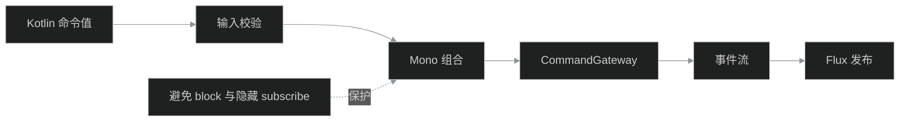
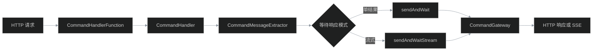
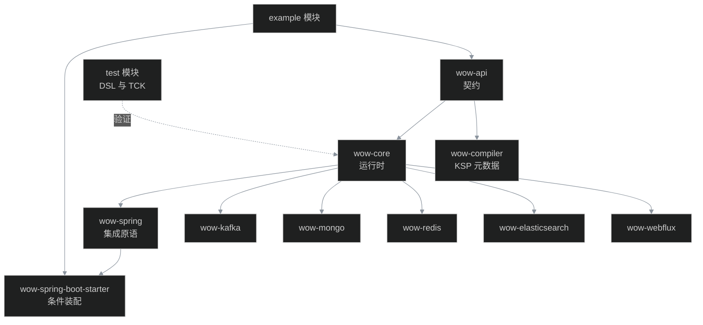
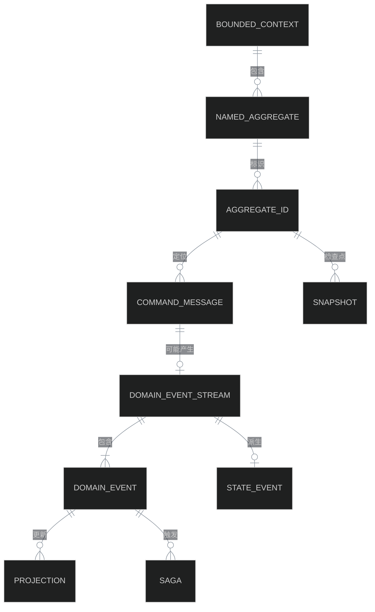
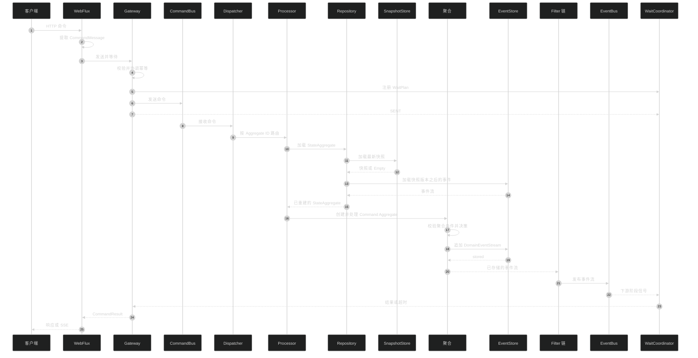
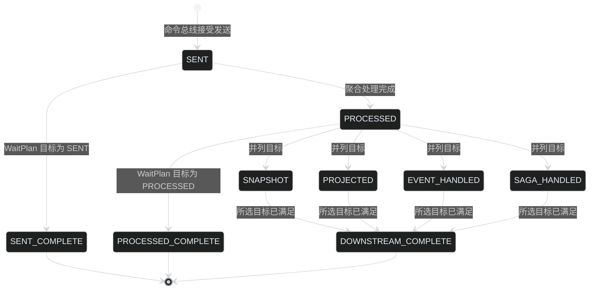
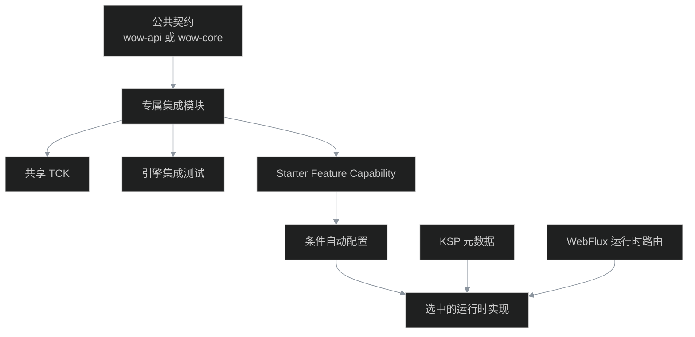
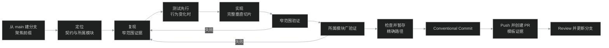
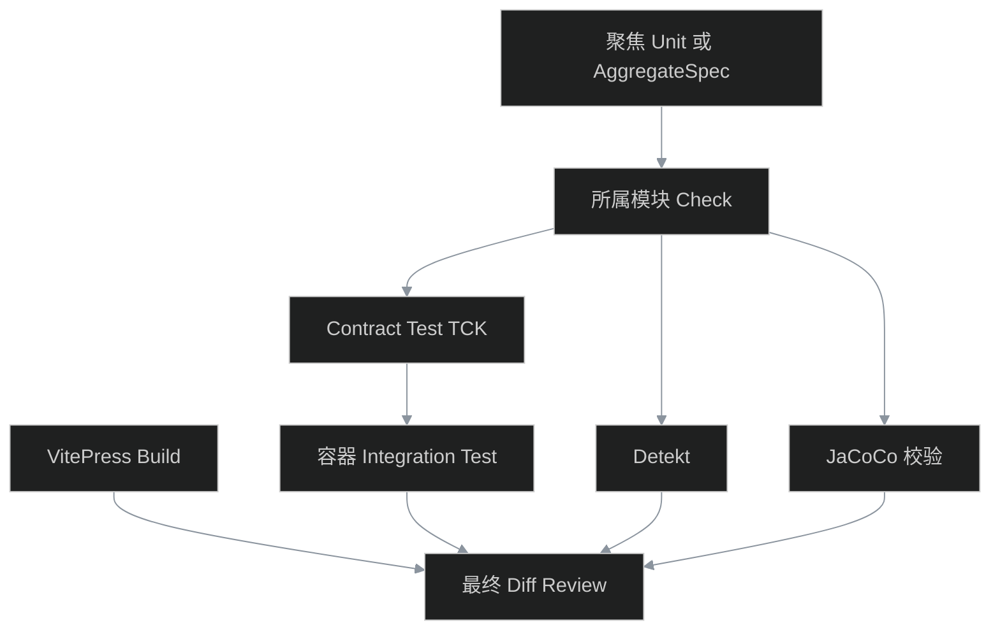
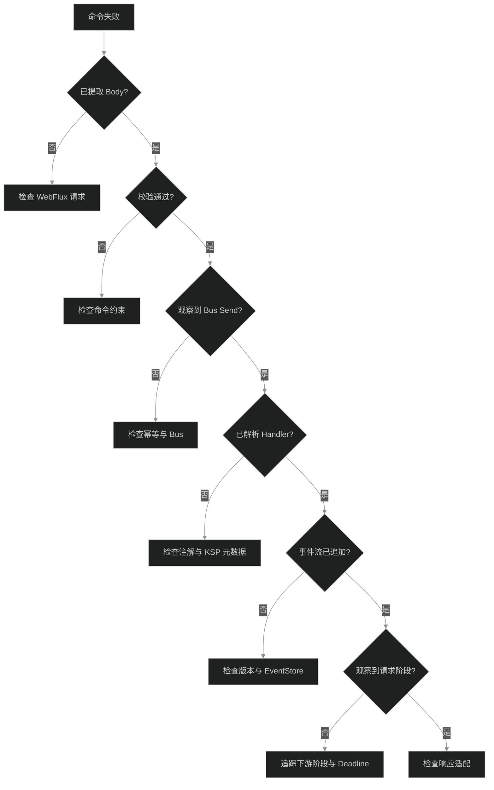

# 贡献者指南

本指南带你从一个干净的检出开始，完成一次范围清晰、经过验证的 Wow 代码贡献。

内容面向 Kotlin 贡献者，也照顾从 Java、Python、JavaScript 或其他响应式技术栈转入的读者。

所有仓库事实都链接到当前 `main` 分支。

如果指南与源码不一致，请以源码为准，并在同一个变更中修正文档。

## 学习目标

完成本指南后，你应该能够：

- 判断一个契约或行为属于哪个模块；
- 把 Wow 的命令、事件、聚合、状态与规格测试作为一个垂直切片阅读；
- 从 HTTP 输入开始，追踪命令到事件持久化和下游发布的全过程；
- 正确选择本地测试、契约测试、集成测试、静态分析与文档构建；
- 在不把基础设施泄漏进领域模块的前提下增加领域行为；
- 定位常见的校验、路由、存储、元数据与超时问题；
- 准备一份容易评审、容易回滚的聚焦变更。

## 当前技术基线

请使用仓库内的 Wrapper 与 Toolchain，不要依赖随意安装的全局版本。

| 组件 | 仓库基线 | 事实来源 |
| --- | --- | --- |
| Wow | `8.11.5` | [`gradle.properties`](https://github.com/Ahoo-Wang/Wow/blob/main/gradle.properties#L18-L23) |
| Kotlin | `2.4.10` | [版本目录](https://github.com/Ahoo-Wang/Wow/blob/main/gradle/libs.versions.toml#L23-L35) |
| Spring Boot | `4.1.1` | [版本目录](https://github.com/Ahoo-Wang/Wow/blob/main/gradle/libs.versions.toml#L1-L5) |
| Gradle | `9.7.1` | [Wrapper 配置](https://github.com/Ahoo-Wang/Wow/blob/main/gradle/wrapper/gradle-wrapper.properties#L1-L9) |
| JVM Toolchain | Java `17` | [根构建脚本](https://github.com/Ahoo-Wang/Wow/blob/main/build.gradle.kts#L175-L190) |
| JUnit | `6.1.3` | [版本目录](https://github.com/Ahoo-Wang/Wow/blob/main/gradle/libs.versions.toml#L23-L27) |
| KSP | `2.3.11` | [版本目录](https://github.com/Ahoo-Wang/Wow/blob/main/gradle/libs.versions.toml#L31-L35) |

README 也说明 Wow 8 面向 Spring Boot 4 与 Java 17 及以上版本。

版本变化时，应优先相信上表中的构建文件。
[查看兼容性说明。](https://github.com/Ahoo-Wang/Wow/blob/main/README.md#L41-L49)

## 第一部分：必要基础

### 1. 面向 Python 或 JavaScript 开发者的 Kotlin

Kotlin 是静态类型、空安全、偏表达式风格的语言。

本仓库把它编译到 JVM。

仓库在 [`gradle.properties`](https://github.com/Ahoo-Wang/Wow/blob/main/gradle.properties#L18-L23) 中启用官方 Kotlin 代码风格和基于 K2 的 KSP 流水线。

从 Python 或 JavaScript 转入时，可以按下表做具体映射：

| 关注点 | Python | JavaScript / TypeScript | Wow 中的 Kotlin |
| --- | --- | --- | --- |
| 不可重新赋值的绑定 | 只有约定，例如 `product_id = "p1"` | `const productId = "p1"` | `val productId = "p1"` |
| 可变绑定 | `quantity = quantity + 1` | `let quantity = 1` | `var quantity = 1` |
| 值形消息 | `@dataclass class AddItem: ...` | `type AddItem = { ... }` | `data class AddCartItem(...)` |
| 可空值 | `str \| None` | `string \| null` | `String?`；`String` 不接受 `null` |
| 封闭结果类型 | `match` 加类约定 | Discriminated Union | `sealed interface` 加穷尽 `when` |
| 只读集合边界 | 约定使用 `Sequence[T]` | `ReadonlyArray<T>` | `List<T>` 在接口层只读 |
| 一个异步结果 | Coroutine / `Awaitable[T]` | `Promise<T>` | Reactor `Mono<T>` |
| 多个异步结果 | Async Iterator | Async Iterator / Stream | Reactor `Flux<T>` |
| 依赖声明 | `pyproject.toml` | `package.json` | `build.gradle.kts` 加集中式 `gradle/libs.versions.toml` |
| 可复现构建入口 | 项目选择的 Python 工具 | Lockfile 与 Package Script | 仓库提交的 `./gradlew` Wrapper |

后文 Kotlin 示例会展开最右列；Python 与 JavaScript 单元格只是迁移提示，不是要加入本仓库的源码。

#### 1.1 值、变量与类型推断

默认使用 `val` 表示不可重新赋值的引用。

只有引用确实需要变化时才使用 `var`。

```kotlin
val productId = "product-1"
val initialQuantity: Int = 1
var remainingQuantity = initialQuantity
remainingQuantity -= 1
```

Python 与 JavaScript 通常在运行期动态确定类型。

Kotlin 通常在编译期完成类型推断。

因此编译器与重构工具可以在测试运行前发现大量不匹配。

#### 1.2 用 data class 表达值形消息

Wow 的命令与事件经常使用 Kotlin data class。

真实购物车示例在 API 模块中声明 `AddCartItem` 命令和 `CartItemAdded` 事件，并在命令属性上使用 Jakarta Validation。
[阅读源码。](https://github.com/Ahoo-Wang/Wow/blob/main/example/example-api/src/main/kotlin/me/ahoo/wow/example/api/cart/AddCartItem.kt#L1-L26)

```kotlin
data class AddCartItem(
    val productId: String,
    val quantity: Int,
)

data class CartItemAdded(
    val productId: String,
    val quantity: Int,
)
```

这个简化片段只展示结构。

复制代码时，注解和校验约束应以仓库源码为准。

#### 1.3 可空性属于类型系统

`String` 不接受 `null`。

`String?` 接受 `null`。

```kotlin
fun normalizeOwnerId(ownerId: String?): String? = ownerId?.trim()?.takeIf { it.isNotEmpty() }
```

优先使用安全调用、Elvis 表达式与显式分支。

除非不变量已经在局部得到证明，否则避免使用 `!!`。

#### 1.4 函数可以直接返回表达式

```kotlin
fun nextQuantity(current: Int, delta: Int): Int = current + delta
```

聚合命令处理器通常返回领域事件，而不是直接修改基础设施中的持久化状态。

购物车聚合正是这样做的：处理器检查状态，再返回 `CartItemAdded`、`CartQuantityChanged` 或 `CartItemRemoved`。
[阅读聚合处理器。](https://github.com/Ahoo-Wang/Wow/blob/main/example/example-domain/src/main/kotlin/me/ahoo/wow/example/domain/cart/Cart.kt#L32-L76)

#### 1.5 构造函数应暴露依赖意图

构造函数注入让依赖一目了然。

示例服务使用常规 Spring Boot 启动与组件扫描，框架自动配置则按条件创建运行时 Bean。
[查看 `ExampleServer`。](https://github.com/Ahoo-Wang/Wow/blob/main/example/example-server/src/main/kotlin/me/ahoo/wow/example/server/ExampleServer.kt#L16-L35)
[查看命令自动配置。](https://github.com/Ahoo-Wang/Wow/blob/main/wow-spring-boot-starter/src/main/kotlin/me/ahoo/wow/spring/boot/starter/command/CommandAutoConfiguration.kt#L38-L100)

```kotlin
class ProductPolicy(
    private val catalog: ProductCatalog,
) {
    fun isKnown(productId: String): Boolean = catalog.contains(productId)
}
```

领域依赖应保持聚焦。

不要仅仅因为 Spring 能提供数据库客户端，就把它注入聚合。

#### 1.6 扩展函数让测试语言更自然

Kotlin 扩展函数让一个函数看起来像接收者类型的成员。

Wow 测试按仓库约定使用 FluentAssert 的 `.assert()` 风格。

```kotlin
fun Int.requirePositive(): Int {
    require(this > 0)
    return this
}
```

扩展函数不会真的给目标类增加成员。

可以用它改善局部语言，但不要用它隐藏令人意外的控制流。

#### 1.7 密封类型与穷尽分支

当领域结果只有封闭的几种情况时，可以使用密封层次。

```kotlin
sealed interface CartDecision

data class Accepted(val event: Any) : CartDecision

data class Rejected(val reason: String) : CartDecision

fun describe(decision: CartDecision): String = when (decision) {
    is Accepted -> "accepted"
    is Rejected -> decision.reason
}
```

编译器会验证 `when` 表达式覆盖所有已知子类型。

#### 1.8 集合与不可变边界

当修改不属于契约时，在边界上使用只读集合接口。

泛型类型应写成代码，例如 `List<CartItem>`。

```kotlin
fun productIds(items: List<CartItem>): Set<String> = items.mapTo(mutableSetOf()) { it.productId }
```

只读接口并不代表底层对象深度不可变。

请明确所有权，不要暴露内部可变集合。

#### 1.9 Reactor 是默认异步词汇

Wow 的运行时路径使用 Reactor `Mono` 与 `Flux`。

不要在命令分发、事件持久化、投影、Saga 或传输路径中加入阻塞调用。

`Mono<T>` 表示异步的零个或一个值。

`Flux<T>` 表示异步的零到多个值。

```kotlin
fun loadCart(cartId: String): Mono<CartView> = repository.load(cartId)

fun streamEvents(cartId: String): Flux<CartEvent> = eventStore.load(cartId)
```

这个概念片段中的类型仅用于说明。

真实 `CommandGateway` 契约同时提供基于 `Mono` 与 `Flux` 的等待形式，并委托命令总线发送。
[阅读网关契约。](https://github.com/Ahoo-Wang/Wow/blob/main/wow-core/src/main/kotlin/me/ahoo/wow/command/CommandGateway.kt#L63-L173)

#### 1.10 组合变换，而不是偷偷订阅

框架代码通常应组合操作符并返回流水线。

应用边缘负责订阅。

```kotlin
fun validateThenSend(command: CommandMessage<*>): Mono<Void> =
    validator.validate(command)
        .then(commandBus.send(command))
```

不要在响应式运行时路径调用 `block()`。

不要在可复用领域或基础设施代码中调用 `subscribe()`，除非该代码明确拥有生命周期与取消职责。


```mermaid
%%{init: {"theme": "dark", "themeVariables": {"primaryColor": "#2d333b", "primaryBorderColor": "#6d5dfc", "primaryTextColor": "#e6edf3", "lineColor": "#8b949e", "secondaryColor": "#161b22", "tertiaryColor": "#161b22", "clusterBkg": "#161b22", "clusterBorder": "#30363d"}}}%%
flowchart LR
    A["Kotlin 命令值"] --> B["输入校验"]
    B --> C["Mono 组合"]
    C --> D["CommandGateway"]
    D --> E["事件流"]
    E --> F["Flux 发布"]
    G["避免 block 与隐藏 subscribe"] -. 保护 .-> C
```
<!-- Sources:
- [example/example-api/src/main/kotlin/me/ahoo/wow/example/api/cart/AddCartItem.kt:1-26](https://github.com/Ahoo-Wang/Wow/blob/main/example/example-api/src/main/kotlin/me/ahoo/wow/example/api/cart/AddCartItem.kt#L1-L26)
- [wow-core/src/main/kotlin/me/ahoo/wow/command/CommandGateway.kt:63-173](https://github.com/Ahoo-Wang/Wow/blob/main/wow-core/src/main/kotlin/me/ahoo/wow/command/CommandGateway.kt#L63-L173)
- [wow-core/src/main/kotlin/me/ahoo/wow/command/DefaultCommandGateway.kt:79-143](https://github.com/Ahoo-Wang/Wow/blob/main/wow-core/src/main/kotlin/me/ahoo/wow/command/DefaultCommandGateway.kt#L79-L143)
-->

### 2. Wow 中的 Spring 基础

Spring 是运行时外围的装配机制。

领域行为本身应该无需了解某个 Bean 由哪段自动配置创建，也能被读懂。

熟悉 FastAPI 或 Express 的贡献者，可以按下表理解职责：

| 关注点 | FastAPI | Express | Spring/Wow |
| --- | --- | --- | --- |
| 应用启动 | 创建 `FastAPI` 应用 | 创建 `express()` 应用 | `@SpringBootApplication` 加 `runApplication` |
| 路由声明 | Path Operation Decorator | `app.post(...)` 或 Router | `RouterSpecs` 契约被物化为 WebFlux `RouterFunction` |
| 请求流水线 | ASGI Middleware 与 Dependency | Middleware Chain | WebFlux Handler、Extractor、Policy，再进入 `CommandGateway` |
| 依赖注入 | `Depends(...)` | 通常显式装配或使用第三方容器 | 构造函数注入加条件 Spring Bean |
| 配置 | Settings 对象与环境变量 | 环境变量/配置库 | `application.yaml`、类型化 Properties 与自动配置条件 |
| 异步模型 | Handler 返回 Coroutine | Handler 返回 Promise | Reactor `Mono`/`Flux`；返回组合后的 Pipeline，不阻塞 |

与手写 Express Route 不同，Wow Command Route 先由聚合与命令元数据派生，再转换成 Route Contract，最后由 WebFlux 物化。领域决策应留在该传输流水线之外。

#### 2.1 应用启动

示例服务使用 `@SpringBootApplication`，并通过 `runApplication` 启动。

它显式扫描示例服务与 Wow 命名空间。
[查看完整启动代码。](https://github.com/Ahoo-Wang/Wow/blob/main/example/example-server/src/main/kotlin/me/ahoo/wow/example/server/ExampleServer.kt#L16-L35)

```kotlin
@SpringBootApplication
class ExampleServer

fun main(args: Array<String>) {
    runApplication<ExampleServer>(*args)
}
```

该片段只用于说明 Spring 形态。

创建可运行模块时，应从真实源码复制完整注解与扫描配置。

#### 2.2 自动配置按能力拆分

`wow-spring-boot-starter` 为 MongoDB、Redis、Mock、Kafka、WebFlux、Elasticsearch、OpenTelemetry、OpenAPI 与 CoSec 声明 Feature Variants。
[查看能力声明。](https://github.com/Ahoo-Wang/Wow/blob/main/wow-spring-boot-starter/build.gradle.kts#L5-L44)

Starter 通过 Spring Boot imports 文件注册自动配置。
[查看自动配置清单。](https://github.com/Ahoo-Wang/Wow/blob/main/wow-spring-boot-starter/src/main/resources/META-INF/spring/org.springframework.boot.autoconfigure.AutoConfiguration.imports#L1-L31)

只选择拥有目标集成的最小能力集。

把基础设施依赖加到领域模块，通常说明边界放错了位置。

#### 2.3 条件 Bean 保持边界可替换

自动配置只在属性与类路径能力满足条件时创建默认实现。

命令自动配置通过条件 Bean 组装本地 Bus 变体、Builder Rewriter、校验器与消息工厂。
[查看命令侧条件与 Bean 工厂。](https://github.com/Ahoo-Wang/Wow/blob/main/wow-spring-boot-starter/src/main/kotlin/me/ahoo/wow/spring/boot/starter/command/CommandAutoConfiguration.kt#L38-L100)

独立的 Gateway 自动配置负责组装幂等、等待协调、阶段通知器与 `DefaultCommandGateway`。
[查看 Gateway 装配。](https://github.com/Ahoo-Wang/Wow/blob/main/wow-spring-boot-starter/src/main/kotlin/me/ahoo/wow/spring/boot/starter/command/CommandGatewayAutoConfiguration.kt#L51-L163)

创建新 Bean 前：

1. 搜索接口；
2. 查找现有实现；
3. 阅读条件注解；
4. 检查属性绑定；
5. 检查自动配置 imports；
6. 只在所属集成边界提供替换实现。

#### 2.4 配置也是可执行行为

示例服务当前选择 MongoDB 作为事件与快照存储，同时使用内存总线。
[阅读示例配置。](https://github.com/Ahoo-Wang/Wow/blob/main/example/example-server/src/main/resources/application.yaml#L73-L99)

不要从该示例推导生产拓扑。

它只证明示例当前的本地装配，不代表通用部署建议。

#### 2.5 WebFlux 把 HTTP 适配为命令模型

WebFlux Handler 读取请求体、拒绝空请求体、委托命令处理器并写回响应。
[阅读 `CommandHandlerFunction`。](https://github.com/Ahoo-Wang/Wow/blob/main/wow-webflux/src/main/kotlin/me/ahoo/wow/webflux/route/command/CommandHandlerFunction.kt#L43-L66)

Extractor 把请求头、路径信息与请求体构造成 `CommandMessage`。
[阅读 Extractor。](https://github.com/Ahoo-Wang/Wow/blob/main/wow-webflux/src/main/kotlin/me/ahoo/wow/webflux/route/command/extractor/CommandMessageExtractor.kt#L23-L46)

传输处理器选择等待策略，并返回 SSE 或单结果响应。
[阅读传输处理器。](https://github.com/Ahoo-Wang/Wow/blob/main/wow-webflux/src/main/kotlin/me/ahoo/wow/webflux/route/command/CommandHandler.kt#L30-L62)


```mermaid
%%{init: {"theme": "dark", "themeVariables": {"primaryColor": "#2d333b", "primaryBorderColor": "#6d5dfc", "primaryTextColor": "#e6edf3", "lineColor": "#8b949e", "secondaryColor": "#161b22", "tertiaryColor": "#161b22", "clusterBkg": "#161b22", "clusterBorder": "#30363d"}}}%%
flowchart LR
    R["HTTP 请求"] --> F["CommandHandlerFunction"]
    F --> H["CommandHandler"]
    H --> X["CommandMessageExtractor"]
    X --> W{"等待响应模式"}
    W -->|"单结果"| M["sendAndWait"]
    W -->|"流式"| S["sendAndWaitStream"]
    M --> G["CommandGateway"]
    S --> G
    G --> O["HTTP 响应或 SSE"]
```
<!-- Sources:
- [wow-webflux/src/main/kotlin/me/ahoo/wow/webflux/route/command/CommandHandlerFunction.kt:43-66](https://github.com/Ahoo-Wang/Wow/blob/main/wow-webflux/src/main/kotlin/me/ahoo/wow/webflux/route/command/CommandHandlerFunction.kt#L43-L66)
- [wow-webflux/src/main/kotlin/me/ahoo/wow/webflux/route/command/extractor/CommandMessageExtractor.kt:23-46](https://github.com/Ahoo-Wang/Wow/blob/main/wow-webflux/src/main/kotlin/me/ahoo/wow/webflux/route/command/extractor/CommandMessageExtractor.kt#L23-L46)
- [wow-webflux/src/main/kotlin/me/ahoo/wow/webflux/route/command/CommandHandler.kt:30-62](https://github.com/Ahoo-Wang/Wow/blob/main/wow-webflux/src/main/kotlin/me/ahoo/wow/webflux/route/command/CommandHandler.kt#L30-L62)
-->

## 第二部分：理解代码库

### 3. Wow 是什么

Wow 为领域驱动设计、CQRS 与事件溯源提供框架契约和运行时组件。

项目自身把它描述为具备命令、事件、投影、Saga、存储与集成能力的现代响应式框架。
[阅读项目概览与能力列表。](https://github.com/Ahoo-Wang/Wow/blob/main/README.md#L51-L84)

贡献者最需要掌握的是职责分离：

- API 模块定义命令、事件与公开领域契约；
- Domain 模块实现决策和事件溯源状态迁移；
- Core 模块提供运行时行为；
- Spring 模块装配运行时组件；
- 基础设施模块适配存储与传输；
- Test 模块提供 DSL、TCK 与集成测试支持；
- Example 模块展示完整垂直切片。

### 4. 仓库结构

权威项目清单位于 [`settings.gradle.kts`](https://github.com/Ahoo-Wang/Wow/blob/main/settings.gradle.kts#L23-L85)。

可以先按四组理解。

#### 4.1 框架与集成模块

| 区域 | 代表模块 | 职责 |
| --- | --- | --- |
| API | `wow-api` | 纯契约、注解、命令/事件类型、命名与建模。 |
| Runtime | `wow-core` | 分发、事件溯源、总线、投影、Saga 与生命周期。 |
| Compiler | `wow-compiler` | KSP Processor 与框架元数据生成。 |
| Spring | `wow-spring`、`wow-spring-boot-starter` | 集成原语与条件装配。 |
| Query | `wow-query` | 查询模型支持。 |
| Storage | `wow-mongo`、`wow-redis`、`wow-elasticsearch` | 事件与快照持久化适配器；Elasticsearch 还提供事件流与快照查询。 |
| Messaging | `wow-kafka` | 分布式命令/事件总线集成。 |
| Projection 与 Cache | `wow-elasticsearch`、`wow-cocache` | Elasticsearch 查询/投影支持与投影缓存。 |
| Transport | `wow-webflux`、`wow-apiclient` | HTTP 命令端点与 API Client。 |
| Cross-cutting | `wow-opentelemetry`、`wow-cosec` | 遥测与授权。 |
| Schema | `wow-openapi`、`wow-schema` | OpenAPI 与 JSON Schema 支持。 |
| BI | `wow-bi` | BI 同步脚本生成。 |
| Dependency management | `wow-bom`、`wow-dependencies` | 发布版本对齐。 |

该表用于快速理解职责。

修改构建逻辑前，应回到 settings 文件核对精确的项目包含关系与目录映射。

#### 4.2 测试模块

Settings 文件包含测试 DSL、测试支持、存储与总线 TCK、Mock、Benchmark、集成测试与聚合覆盖率报告。
[查看测试模块声明。](https://github.com/Ahoo-Wang/Wow/blob/main/settings.gradle.kts#L46-L56)

多个实现必须满足同一契约时，应复用 TCK。

行为依赖真实外部引擎或容器时，应写集成测试。

#### 4.3 补偿模块

补偿区域包含 API、Domain、Core、Server 与 Dashboard 项目。
[查看补偿模块声明。](https://github.com/Ahoo-Wang/Wow/blob/main/settings.gradle.kts#L58-L66)

它是一个具有自身边界的产品形子系统。

未经显式架构决策，不应把补偿实现细节提升为 Core 默认契约。

#### 4.4 示例模块

示例包含 Kotlin Domain/Server 与 Java Transfer Domain/Server。
[查看示例声明。](https://github.com/Ahoo-Wang/Wow/blob/main/settings.gradle.kts#L68-L85)

Kotlin Cart 示例是最合适的第一个垂直切片，因为其命令、事件、聚合、状态、Saga 与测试都很小且彼此连通。


```mermaid
%%{init: {"theme": "dark", "themeVariables": {"primaryColor": "#2d333b", "primaryBorderColor": "#6d5dfc", "primaryTextColor": "#e6edf3", "lineColor": "#8b949e", "secondaryColor": "#161b22", "tertiaryColor": "#161b22", "clusterBkg": "#161b22", "clusterBorder": "#30363d"}}}%%
graph TB
    API["wow-api<br>契约"] --> CORE["wow-core<br>运行时"]
    CORE --> SPRING["wow-spring<br>集成原语"]
    SPRING --> STARTER["wow-spring-boot-starter<br>条件装配"]
    CORE --> KAFKA["wow-kafka"]
    CORE --> MONGO["wow-mongo"]
    CORE --> REDIS["wow-redis"]
    CORE --> ES["wow-elasticsearch"]
    CORE --> WEB["wow-webflux"]
    API --> COMPILER["wow-compiler<br>KSP 元数据"]
    TEST["test 模块<br>DSL 与 TCK"] -. 验证 .-> CORE
    EXAMPLE["example 模块"] --> STARTER
    EXAMPLE --> API
```
<!-- Sources:
- [settings.gradle.kts:23-85](https://github.com/Ahoo-Wang/Wow/blob/main/settings.gradle.kts#L23-L85)
- [wow-spring-boot-starter/build.gradle.kts:5-79](https://github.com/Ahoo-Wang/Wow/blob/main/wow-spring-boot-starter/build.gradle.kts#L5-L79)
- [example/example-domain/build.gradle.kts:1-20](https://github.com/Ahoo-Wang/Wow/blob/main/example/example-domain/build.gradle.kts#L1-L20)
-->

### 5. 核心概念

#### 5.1 限界上下文与命名聚合

限界上下文为领域名称提供边界。

`NamedBoundedContext` 暴露限界上下文名称。
[阅读契约。](https://github.com/Ahoo-Wang/Wow/blob/main/wow-api/src/main/kotlin/me/ahoo/wow/api/naming/NamedBoundedContext.kt#L15-L36)

`NamedAggregate` 标识该上下文中的聚合名称。
[阅读契约。](https://github.com/Ahoo-Wang/Wow/blob/main/wow-api/src/main/kotlin/me/ahoo/wow/api/modeling/NamedAggregate.kt#L20-L49)

示例分别在 API 与 Domain 中声明服务上下文和限界上下文标记。
[查看 `ExampleService`。](https://github.com/Ahoo-Wang/Wow/blob/main/example/example-api/src/main/kotlin/me/ahoo/wow/example/api/ExampleService.kt#L22-L40)
[查看 `ExampleBoundedContext`。](https://github.com/Ahoo-Wang/Wow/blob/main/example/example-domain/src/main/kotlin/me/ahoo/wow/example/domain/ExampleBoundedContext.kt#L19-L21)

#### 5.2 聚合标识

`AggregateId` 由命名聚合、聚合 `id` 和 `tenantId` 组成。

Owner 与 Space 是相关的消息和聚合状态上下文，但不是 `AggregateId` 契约的字段。

契约说明：同一个命名聚合内，Aggregate ID 跨租户唯一。
[阅读标识契约。](https://github.com/Ahoo-Wang/Wow/blob/main/wow-api/src/main/kotlin/me/ahoo/wow/api/modeling/AggregateId.kt#L18-L45)

不要把 `tenantId` 当成同一命名聚合内可重复使用相同 `id` 的命名空间。

#### 5.3 命令与命令消息

命令表达请求执行的意图。

`CommandMessage` 在意图之外承载标识、路由、Header、聚合版本与生命周期标志。
[阅读消息契约。](https://github.com/Ahoo-Wang/Wow/blob/main/wow-api/src/main/kotlin/me/ahoo/wow/api/command/CommandMessage.kt#L24-L61)
[阅读目标与版本字段。](https://github.com/Ahoo-Wang/Wow/blob/main/wow-api/src/main/kotlin/me/ahoo/wow/api/command/CommandMessage.kt#L70-L125)

消息可以表达创建、预期聚合版本与 Void 行为。

这些字段参与正确性，适配器不能随意丢弃。

#### 5.4 领域事件与事件流

领域事件记录已经发生的业务事实。

`DomainEvent` 携带序列、修订号、命令、聚合与元数据上下文。
[阅读事件契约。](https://github.com/Ahoo-Wang/Wow/blob/main/wow-api/src/main/kotlin/me/ahoo/wow/api/event/DomainEvent.kt#L21-L50)
[阅读序列与修订字段。](https://github.com/Ahoo-Wang/Wow/blob/main/wow-api/src/main/kotlin/me/ahoo/wow/api/event/DomainEvent.kt#L57-L89)

`DomainEventStream` 把一个命令产生的事件组合起来。

实现会约束命令标识与聚合上下文等流级不变量。
[阅读事件流契约与不变量。](https://github.com/Ahoo-Wang/Wow/blob/main/wow-core/src/main/kotlin/me/ahoo/wow/event/DomainEventStream.kt#L31-L115)

#### 5.5 事件存储

`EventStore` 负责追加领域事件流并按聚合加载事件流。
[阅读存储契约。](https://github.com/Ahoo-Wang/Wow/blob/main/wow-core/src/main/kotlin/me/ahoo/wow/eventsourcing/EventStore.kt#L22-L82)

乐观并发与重复事件流失败属于这个边界。

适配器不能把它们转换成“成功写入”。

#### 5.6 状态溯源与快照

状态聚合通过应用领域事件重建状态。

即使缺少 sourcing handler，契约仍推进版本，因此“没有处理器”不等于“可以忽略事件位置”。
[阅读 `StateAggregate`。](https://github.com/Ahoo-Wang/Wow/blob/main/wow-core/src/main/kotlin/me/ahoo/wow/modeling/state/StateAggregate.kt#L17-L31)

Repository 可以加载快照并重放后续事件。
[阅读 Repository 实现。](https://github.com/Ahoo-Wang/Wow/blob/main/wow-core/src/main/kotlin/me/ahoo/wow/eventsourcing/EventSourcingStateAggregateRepository.kt#L25-L45)

快照保存某一版本的聚合状态。
[阅读快照契约。](https://github.com/Ahoo-Wang/Wow/blob/main/wow-core/src/main/kotlin/me/ahoo/wow/eventsourcing/snapshot/Snapshot.kt#L20-L41)

#### 5.7 状态事件

状态事件在领域事件完成 sourcing 后派生，可向下游表达结果状态迁移。
[阅读 `StateEvent`。](https://github.com/Ahoo-Wang/Wow/blob/main/wow-core/src/main/kotlin/me/ahoo/wow/eventsourcing/state/StateEvent.kt#L23-L100)

状态事件 Filter 在事件流处理后创建并发布 State Event。
[阅读 Filter。](https://github.com/Ahoo-Wang/Wow/blob/main/wow-core/src/main/kotlin/me/ahoo/wow/eventsourcing/state/SendStateEventFilter.kt#L29-L76)

#### 5.8 投影、事件处理器与 Saga

Event Processor 响应领域事件。
[阅读 `@EventProcessor`。](https://github.com/Ahoo-Wang/Wow/blob/main/wow-api/src/main/kotlin/me/ahoo/wow/api/annotation/EventProcessor.kt#L19-L58)

Projection Processor 构建读模型。
[阅读 `@ProjectionProcessor`。](https://github.com/Ahoo-Wang/Wow/blob/main/wow-api/src/main/kotlin/me/ahoo/wow/api/annotation/ProjectionProcessor.kt#L19-L68)

Stateless Saga 协调事件反应，但不在被注解类型中保存 Saga 状态。

购物车示例监听 `OrderCreated`。当订单来自购物车时，它针对 `event.ownerId` 对应的购物车发出 `RemoveCartItem`，移除已购买商品。

`@Retry` 配置的是 Saga Handler 的执行重试，不是附加到所发命令上的元数据。
[阅读 `CartSaga`。](https://github.com/Ahoo-Wang/Wow/blob/main/example/example-domain/src/main/kotlin/me/ahoo/wow/example/domain/cart/CartSaga.kt#L25-L42)


```mermaid
%%{init: {"theme": "dark", "themeVariables": {"primaryColor": "#2d333b", "primaryBorderColor": "#6d5dfc", "primaryTextColor": "#e6edf3", "lineColor": "#8b949e", "secondaryColor": "#161b22", "tertiaryColor": "#161b22", "clusterBkg": "#161b22", "clusterBorder": "#30363d"}}}%%
erDiagram
    BOUNDED_CONTEXT ||--o{ NAMED_AGGREGATE : 包含
    NAMED_AGGREGATE ||--o{ AGGREGATE_ID : 标识
    AGGREGATE_ID ||--o{ COMMAND_MESSAGE : 定位
    COMMAND_MESSAGE ||--o| DOMAIN_EVENT_STREAM : 可能产生
    DOMAIN_EVENT_STREAM ||--|{ DOMAIN_EVENT : 包含
    AGGREGATE_ID ||--o{ SNAPSHOT : 检查点
    DOMAIN_EVENT_STREAM ||--o| STATE_EVENT : 派生
    DOMAIN_EVENT ||--o{ PROJECTION : 更新
    DOMAIN_EVENT ||--o{ SAGA : 触发
```
<!-- Sources:
- [wow-api/src/main/kotlin/me/ahoo/wow/api/modeling/AggregateId.kt:18-45](https://github.com/Ahoo-Wang/Wow/blob/main/wow-api/src/main/kotlin/me/ahoo/wow/api/modeling/AggregateId.kt#L18-L45)
- [wow-api/src/main/kotlin/me/ahoo/wow/api/command/CommandMessage.kt:24-125](https://github.com/Ahoo-Wang/Wow/blob/main/wow-api/src/main/kotlin/me/ahoo/wow/api/command/CommandMessage.kt#L24-L125)
- [wow-core/src/main/kotlin/me/ahoo/wow/event/DomainEventStream.kt:31-115](https://github.com/Ahoo-Wang/Wow/blob/main/wow-core/src/main/kotlin/me/ahoo/wow/event/DomainEventStream.kt#L31-L115)
- [wow-core/src/main/kotlin/me/ahoo/wow/eventsourcing/snapshot/Snapshot.kt:20-41](https://github.com/Ahoo-Wang/Wow/blob/main/wow-core/src/main/kotlin/me/ahoo/wow/eventsourcing/snapshot/Snapshot.kt#L20-L41)
- [wow-core/src/main/kotlin/me/ahoo/wow/eventsourcing/state/StateEvent.kt:23-100](https://github.com/Ahoo-Wang/Wow/blob/main/wow-core/src/main/kotlin/me/ahoo/wow/eventsourcing/state/StateEvent.kt#L23-L100)
- [wow-api/src/main/kotlin/me/ahoo/wow/api/annotation/ProjectionProcessor.kt:19-68](https://github.com/Ahoo-Wang/Wow/blob/main/wow-api/src/main/kotlin/me/ahoo/wow/api/annotation/ProjectionProcessor.kt#L19-L68)
- [wow-api/src/main/kotlin/me/ahoo/wow/api/annotation/StatelessSaga.kt:19-62](https://github.com/Ahoo-Wang/Wow/blob/main/wow-api/src/main/kotlin/me/ahoo/wow/api/annotation/StatelessSaga.kt#L19-L62)
-->

### 6. 命令生命周期

下面这条链路是贡献者最有用的运行时地图。

#### 6.1 HTTP 适配

`CommandHandlerFunction` 读取请求体并检查是否为空。

`CommandMessageExtractor` 从请求构造框架元数据。

`CommandHandler` 选择 WaitPlan 与响应形式。

#### 6.2 网关校验与幂等

`DefaultCommandGateway` 先校验命令并协调幂等，再发送命令。
[阅读校验、幂等与总线分发。](https://github.com/Ahoo-Wang/Wow/blob/main/wow-core/src/main/kotlin/me/ahoo/wow/command/DefaultCommandGateway.kt#L79-L143)

重复请求标识是正确性问题，不只是日志问题。

网关会拒绝同一聚合上重复的 Request ID。
[阅读重复请求异常契约。](https://github.com/Ahoo-Wang/Wow/blob/main/wow-core/src/main/kotlin/me/ahoo/wow/command/CommandExceptions.kt#L25-L35)

#### 6.3 分发与聚合亲和性

`CommandDispatcher` 从总线接收命令，并选择命名聚合 Dispatcher。
[阅读 Dispatcher。](https://github.com/Ahoo-Wang/Wow/blob/main/wow-core/src/main/kotlin/me/ahoo/wow/modeling/command/dispatcher/CommandDispatcher.kt#L37-L75)

`AggregateCommandDispatcher` 按 Aggregate ID 路由工作，使同一聚合的命令保持 Worker 亲和性。
[阅读聚合分发。](https://github.com/Ahoo-Wang/Wow/blob/main/wow-core/src/main/kotlin/me/ahoo/wow/modeling/command/dispatcher/AggregateCommandDispatcher.kt#L25-L86)

Spring 装配创建 Processor、Filter Chain、Handler 与 Dispatcher。
[阅读聚合自动配置。](https://github.com/Ahoo-Wang/Wow/blob/main/wow-spring-boot-starter/src/main/kotlin/me/ahoo/wow/spring/boot/starter/modeling/AggregateAutoConfiguration.kt#L70-L145)

#### 6.4 决策、Sourcing 与追加

Processor Filter 获取命令聚合处理器并执行 Exchange。
[阅读 Processor Filter。](https://github.com/Ahoo-Wang/Wow/blob/main/wow-core/src/main/kotlin/me/ahoo/wow/modeling/command/dispatcher/AggregateProcessorFilter.kt#L26-L49)

`RetryableAggregateProcessor` 先请求状态仓储加载聚合。`EventSourcingStateAggregateRepository` 会先尝试加载快照，再从 EventStore 重放快照版本之后的事件流，最后才创建 Command Aggregate。
[阅读 Processor 加载过程。](https://github.com/Ahoo-Wang/Wow/blob/main/wow-core/src/main/kotlin/me/ahoo/wow/modeling/command/RetryableAggregateProcessor.kt#L48-L68)
[阅读快照优先的状态重建。](https://github.com/Ahoo-Wang/Wow/blob/main/wow-core/src/main/kotlin/me/ahoo/wow/eventsourcing/EventSourcingStateAggregateRepository.kt#L74-L107)

`SimpleCommandAggregate` 解析命令处理器、校验聚合条件、调用领域行为、对返回事件执行 sourcing，并追加事件流。
[阅读决策路径。](https://github.com/Ahoo-Wang/Wow/blob/main/wow-core/src/main/kotlin/me/ahoo/wow/modeling/command/SimpleCommandAggregate.kt#L64-L132)

命令聚合记录 stored、sourced、expired 等处理状态。
[阅读命令状态迁移。](https://github.com/Ahoo-Wang/Wow/blob/main/wow-core/src/main/kotlin/me/ahoo/wow/modeling/command/CommandAggregate.kt#L55-L84)

#### 6.5 发布与等待完成

追加完成后，领域事件 Filter 把事件流发布到 Domain Event Bus。
[阅读发布 Filter。](https://github.com/Ahoo-Wang/Wow/blob/main/wow-core/src/main/kotlin/me/ahoo/wow/modeling/command/dispatcher/SendDomainEventStreamFilter.kt#L25-L46)

State Event Filter 发布完成 sourcing 的状态迁移。

WaitCoordinator 观察请求的阶段，并完成面向传输层的结果。

阶段模型声明 `SENT`、`PROCESSED`、`SNAPSHOT`、`PROJECTED`、`EVENT_HANDLED` 与 `SAGA_HANDLED` 之间的依赖。
[阅读阶段依赖。](https://github.com/Ahoo-Wang/Wow/blob/main/wow-core/src/main/kotlin/me/ahoo/wow/command/wait/CommandStage.kt#L25-L123)

WaitPlan 可以直接在 `SENT` 或 `PROCESSED` 完成。`SNAPSHOT`、`PROJECTED`、`EVENT_HANDLED` 与 `SAGA_HANDLED` 是共享前两个前置条件的并列目标，不是每条命令都必须依次经过的序列。

#### 6.6 Deadline 与取消所有权

流式等待使用 `Flux.using`，单结果等待使用 `Mono.using`，以释放协调器资源。
[阅读流式等待所有权。](https://github.com/Ahoo-Wang/Wow/blob/main/wow-core/src/main/kotlin/me/ahoo/wow/command/DefaultCommandGateway.kt#L201-L223)
[阅读单结果等待所有权。](https://github.com/Ahoo-Wang/Wow/blob/main/wow-core/src/main/kotlin/me/ahoo/wow/command/DefaultCommandGateway.kt#L238-L266)

网关传播 WaitPlan、发送命令，并发出 `SENT` 或错误信号。
[阅读等待传播与发送。](https://github.com/Ahoo-Wang/Wow/blob/main/wow-core/src/main/kotlin/me/ahoo/wow/command/DefaultCommandGateway.kt#L282-L301)

超时测试验证等待 Handle 得到释放，并由一个绝对 Deadline 约束整个操作。
[阅读超时测试。](https://github.com/Ahoo-Wang/Wow/blob/main/wow-core/src/test/kotlin/me/ahoo/wow/command/DefaultCommandGatewayTimeoutTest.kt#L45-L125)


```mermaid
%%{init: {"theme": "dark", "themeVariables": {"primaryColor": "#2d333b", "primaryBorderColor": "#6d5dfc", "primaryTextColor": "#e6edf3", "lineColor": "#8b949e", "secondaryColor": "#161b22", "tertiaryColor": "#161b22", "clusterBkg": "#161b22", "clusterBorder": "#30363d"}}}%%
sequenceDiagram
    autonumber
    participant Client as 客户端
    participant WebFlux
    participant Gateway
    participant CommandBus
    participant Dispatcher
    participant Processor
    participant Repository
    participant SnapshotStore
    participant Aggregate as 聚合
    participant EventStore
    participant Filters as Filter 链
    participant EventBus
    participant WaitCoordinator
    Client->>WebFlux: HTTP 命令
    WebFlux->>WebFlux: 提取 CommandMessage
    WebFlux->>Gateway: 发送并等待
    Gateway->>Gateway: 校验并协调幂等
    Gateway->>WaitCoordinator: 注册 WaitPlan
    Gateway->>CommandBus: 发送命令
    Gateway-->>WaitCoordinator: SENT
    CommandBus->>Dispatcher: 接收命令
    Dispatcher->>Processor: 按 Aggregate ID 路由
    Processor->>Repository: 加载 StateAggregate
    Repository->>SnapshotStore: 加载最新快照
    SnapshotStore-->>Repository: 快照或 Empty
    Repository->>EventStore: 加载快照版本之后的事件
    EventStore-->>Repository: 事件流
    Repository-->>Processor: 已重建的 StateAggregate
    Processor->>Aggregate: 创建并处理 Command Aggregate
    Aggregate->>Aggregate: 校验聚合条件并决策
    Aggregate->>EventStore: 追加 DomainEventStream
    EventStore-->>Aggregate: stored
    Aggregate-->>Filters: 已存储的事件流
    Filters->>EventBus: 发布事件流
    EventBus-->>WaitCoordinator: 下游阶段信号
    WaitCoordinator-->>Gateway: 结果或超时
    Gateway-->>WebFlux: CommandResult
    WebFlux-->>Client: 响应或 SSE
```
<!-- Sources:
- [wow-webflux/src/main/kotlin/me/ahoo/wow/webflux/route/command/CommandHandlerFunction.kt:43-66](https://github.com/Ahoo-Wang/Wow/blob/main/wow-webflux/src/main/kotlin/me/ahoo/wow/webflux/route/command/CommandHandlerFunction.kt#L43-L66)
- [wow-core/src/main/kotlin/me/ahoo/wow/command/DefaultCommandGateway.kt:79-143](https://github.com/Ahoo-Wang/Wow/blob/main/wow-core/src/main/kotlin/me/ahoo/wow/command/DefaultCommandGateway.kt#L79-L143)
- [wow-core/src/main/kotlin/me/ahoo/wow/modeling/command/dispatcher/AggregateCommandDispatcher.kt:25-86](https://github.com/Ahoo-Wang/Wow/blob/main/wow-core/src/main/kotlin/me/ahoo/wow/modeling/command/dispatcher/AggregateCommandDispatcher.kt#L25-L86)
- [wow-core/src/main/kotlin/me/ahoo/wow/modeling/command/RetryableAggregateProcessor.kt:48-68](https://github.com/Ahoo-Wang/Wow/blob/main/wow-core/src/main/kotlin/me/ahoo/wow/modeling/command/RetryableAggregateProcessor.kt#L48-L68)
- [wow-core/src/main/kotlin/me/ahoo/wow/eventsourcing/EventSourcingStateAggregateRepository.kt:74-107](https://github.com/Ahoo-Wang/Wow/blob/main/wow-core/src/main/kotlin/me/ahoo/wow/eventsourcing/EventSourcingStateAggregateRepository.kt#L74-L107)
- [wow-core/src/main/kotlin/me/ahoo/wow/modeling/command/SimpleCommandAggregate.kt:64-132](https://github.com/Ahoo-Wang/Wow/blob/main/wow-core/src/main/kotlin/me/ahoo/wow/modeling/command/SimpleCommandAggregate.kt#L64-L132)
- [wow-core/src/main/kotlin/me/ahoo/wow/modeling/command/dispatcher/SendDomainEventStreamFilter.kt:25-46](https://github.com/Ahoo-Wang/Wow/blob/main/wow-core/src/main/kotlin/me/ahoo/wow/modeling/command/dispatcher/SendDomainEventStreamFilter.kt#L25-L46)
-->


```mermaid
%%{init: {"theme": "dark", "themeVariables": {"primaryColor": "#2d333b", "primaryBorderColor": "#6d5dfc", "primaryTextColor": "#e6edf3", "lineColor": "#8b949e", "secondaryColor": "#161b22", "tertiaryColor": "#161b22", "clusterBkg": "#161b22", "clusterBorder": "#30363d"}}}%%
stateDiagram-v2
    [*] --> SENT: 命令总线接受发送
    SENT --> SENT_COMPLETE: WaitPlan 目标为 SENT
    SENT --> PROCESSED: 聚合处理完成
    PROCESSED --> PROCESSED_COMPLETE: WaitPlan 目标为 PROCESSED
    PROCESSED --> SNAPSHOT: 并列目标
    PROCESSED --> PROJECTED: 并列目标
    PROCESSED --> EVENT_HANDLED: 并列目标
    PROCESSED --> SAGA_HANDLED: 并列目标
    SNAPSHOT --> DOWNSTREAM_COMPLETE: 所选目标已满足
    PROJECTED --> DOWNSTREAM_COMPLETE: 所选目标已满足
    EVENT_HANDLED --> DOWNSTREAM_COMPLETE: 所选目标已满足
    SAGA_HANDLED --> DOWNSTREAM_COMPLETE: 所选目标已满足
    SENT_COMPLETE --> [*]
    PROCESSED_COMPLETE --> [*]
    DOWNSTREAM_COMPLETE --> [*]
```
<!-- Sources:
- [wow-core/src/main/kotlin/me/ahoo/wow/command/wait/CommandStage.kt:25-123](https://github.com/Ahoo-Wang/Wow/blob/main/wow-core/src/main/kotlin/me/ahoo/wow/command/wait/CommandStage.kt#L25-L123)
- [wow-core/src/main/kotlin/me/ahoo/wow/command/wait/CommandWait.kt:21-120](https://github.com/Ahoo-Wang/Wow/blob/main/wow-core/src/main/kotlin/me/ahoo/wow/command/wait/CommandWait.kt#L21-L120)
- [wow-core/src/main/kotlin/me/ahoo/wow/command/DefaultCommandGateway.kt:282-301](https://github.com/Ahoo-Wang/Wow/blob/main/wow-core/src/main/kotlin/me/ahoo/wow/command/DefaultCommandGateway.kt#L282-L301)
-->

### 7. 关键实现模式

#### 7.1 API → Aggregate → State → Spec

这是默认的领域功能路径。

1. 在 API 模块定义命令与事件契约。
2. 在 Domain 模块为聚合增加命令处理。
3. 在聚合状态中增加 sourcing 行为。
4. 编写 `AggregateSpec`，覆盖接受与拒绝分支。
5. 运行领域模块测试与覆盖率校验。

Cart 切片包含全部四部分：

- [example/example-api/src/main/kotlin/me/ahoo/wow/example/api/cart/AddCartItem.kt:1-26](https://github.com/Ahoo-Wang/Wow/blob/main/example/example-api/src/main/kotlin/me/ahoo/wow/example/api/cart/AddCartItem.kt#L1-L26)
- [example/example-domain/src/main/kotlin/me/ahoo/wow/example/domain/cart/Cart.kt:32-76](https://github.com/Ahoo-Wang/Wow/blob/main/example/example-domain/src/main/kotlin/me/ahoo/wow/example/domain/cart/Cart.kt#L32-L76)
- [example/example-domain/src/main/kotlin/me/ahoo/wow/example/domain/cart/CartState.kt:23-46](https://github.com/Ahoo-Wang/Wow/blob/main/example/example-domain/src/main/kotlin/me/ahoo/wow/example/domain/cart/CartState.kt#L23-L46)
- [example/example-domain/src/test/kotlin/me/ahoo/wow/example/domain/cart/CartSpec.kt:28-87](https://github.com/Ahoo-Wang/Wow/blob/main/example/example-domain/src/test/kotlin/me/ahoo/wow/example/domain/cart/CartSpec.kt#L28-L87)

#### 7.2 注解声明发现边界

`@AggregateRoot` 标识聚合根；其 `commands` 属性把额外命令类型（包括 Void 或重写命令）挂载到该聚合。
[阅读注解契约。](https://github.com/Ahoo-Wang/Wow/blob/main/wow-api/src/main/kotlin/me/ahoo/wow/api/annotation/AggregateRoot.kt#L18-L77)

`@OnCommand` 标识聚合中的命令处理函数，并可声明其返回的事件类型；它不定义 HTTP 路径或方法。
[阅读注解契约。](https://github.com/Ahoo-Wang/Wow/blob/main/wow-api/src/main/kotlin/me/ahoo/wow/api/annotation/OnCommand.kt#L19-L86)

`@OnSourcing` 标识事件驱动的状态迁移处理器。
[阅读注解契约。](https://github.com/Ahoo-Wang/Wow/blob/main/wow-api/src/main/kotlin/me/ahoo/wow/api/annotation/OnSourcing.kt#L18-L59)

`@CommandRoute` 是命令类上的 HTTP Action、Method、Prefix 与路径维度契约；`@AggregateRoot.commands` 决定向聚合注册哪些额外命令。
[阅读 Command Route 选项。](https://github.com/Ahoo-Wang/Wow/blob/main/wow-api/src/main/kotlin/me/ahoo/wow/api/annotation/CommandRoute.kt#L18-L72)

后续职责分为独立层次：

1. KSP 写出合并后的限界上下文与聚合元数据，但不注册 Spring Router；
2. `CommandRouteContributor` 将已注册命令和 `@CommandRoute` 元数据组合成 `RouterSpecs` 中的 `HttpRouteContract`；
3. WebFlux `RouterFunctionBuilder` 在运行期用已注册 Handler Factory 物化这些契约。

[查看 KSP Plugin 配置。](https://github.com/Ahoo-Wang/Wow/blob/main/example/example-domain/build.gradle.kts#L1-L8)
[查看 Metadata Processor。](https://github.com/Ahoo-Wang/Wow/blob/main/wow-compiler/src/main/kotlin/me/ahoo/wow/compiler/metadata/MetadataSymbolProcessor.kt#L61-L104)
[查看 Command Route 贡献。](https://github.com/Ahoo-Wang/Wow/blob/main/wow-openapi/src/main/kotlin/me/ahoo/wow/openapi/contributor/aggregate/command/CommandRouteContributor.kt#L52-L91)
[查看运行时 Route 物化。](https://github.com/Ahoo-Wang/Wow/blob/main/wow-webflux/src/main/kotlin/me/ahoo/wow/webflux/route/RouterFunctionBuilder.kt#L24-L42)

#### 7.3 Filter Chain 扩展处理但不混淆边界

聚合自动配置收集有序 Exchange Filter，并构建处理链。
[阅读 Filter 装配。](https://github.com/Ahoo-Wang/Wow/blob/main/wow-spring-boot-starter/src/main/kotlin/me/ahoo/wow/spring/boot/starter/modeling/AggregateAutoConfiguration.kt#L108-L133)

只有真正属于该阶段的横切 Exchange 行为才适合放入 Filter。

不要用 Filter 隐藏本应出现在聚合中的领域规则。

#### 7.4 TCK 保护可替换实现

构建中声明了存储与总线的契约测试模块。
[查看 TCK 模块。](https://github.com/Ahoo-Wang/Wow/blob/main/settings.gradle.kts#L46-L56)

新增实现时：

1. 实现最小所属契约；
2. 复用相关 TCK；
3. 增加适配器专属集成测试；
4. 需要时在 Starter 注册 Capability 与条件配置；
5. 除非模型确实需要，不要为了一个引擎修改公共契约。

#### 7.5 Capability 与 Auto-configuration 是一个扩展单元

Starter 的 Feature Variants 声明可选集成。

Imports 文件声明自动配置。

实现模块拥有适配器。

TCK 验证共同契约。

评审扩展时应把这些部分作为一个完整表面检查。


```mermaid
%%{init: {"theme": "dark", "themeVariables": {"primaryColor": "#2d333b", "primaryBorderColor": "#6d5dfc", "primaryTextColor": "#e6edf3", "lineColor": "#8b949e", "secondaryColor": "#161b22", "tertiaryColor": "#161b22", "clusterBkg": "#161b22", "clusterBorder": "#30363d"}}}%%
flowchart TB
    CONTRACT["公共契约<br>wow-api 或 wow-core"] --> ADAPTER["专属集成模块"]
    ADAPTER --> TCK["共享 TCK"]
    ADAPTER --> INTEGRATION["引擎集成测试"]
    ADAPTER --> CAPABILITY["Starter Feature Capability"]
    CAPABILITY --> AUTOCONFIG["条件自动配置"]
    AUTOCONFIG --> RUNTIME["选中的运行时实现"]
    METADATA["KSP 元数据"] --> RUNTIME
    WEBFLUX["WebFlux 运行时路由"] --> RUNTIME
```
<!-- Sources:
- [settings.gradle.kts:23-56](https://github.com/Ahoo-Wang/Wow/blob/main/settings.gradle.kts#L23-L56)
- [wow-spring-boot-starter/build.gradle.kts:5-79](https://github.com/Ahoo-Wang/Wow/blob/main/wow-spring-boot-starter/build.gradle.kts#L5-L79)
- [wow-spring-boot-starter/src/main/resources/META-INF/spring/org.springframework.boot.autoconfigure.AutoConfiguration.imports:1-31](https://github.com/Ahoo-Wang/Wow/blob/main/wow-spring-boot-starter/src/main/resources/META-INF/spring/org.springframework.boot.autoconfigure.AutoConfiguration.imports#L1-L31)
- [example/example-domain/build.gradle.kts:1-20](https://github.com/Ahoo-Wang/Wow/blob/main/example/example-domain/build.gradle.kts#L1-L20)
- [wow-compiler/src/main/kotlin/me/ahoo/wow/compiler/metadata/MetadataSymbolProcessor.kt:61-104](https://github.com/Ahoo-Wang/Wow/blob/main/wow-compiler/src/main/kotlin/me/ahoo/wow/compiler/metadata/MetadataSymbolProcessor.kt#L61-L104)
-->

## 第三部分：完成第一次贡献

### 8. 环境要求

下列安装命令以 macOS/Homebrew 为例；Linux 或 Windows 请使用等价的官方安装方式，并保持所需版本。每条安装命令都应以状态码 `0` 结束，然后运行验证命令并核对“预期证据”列。

| Tool | Version | 用途 | 安装命令 | 验证命令 | 预期证据 |
| --- | --- | --- | --- | --- | --- |
| Git | 当前受支持版本 | 所有工作 | `brew install git` | `git --version` | 一行以 `git version` 开头的输出 |
| JDK | `17` | JVM 测试与 Dokka | `brew install --cask temurin@17` | `java -version` | 版本输出包含 `17` |
| Gradle Wrapper | `9.7.1` | JVM 构建 | 无需全局安装；用 `./gradlew --version` 启动 | `./gradlew --version` | `Gradle 9.7.1` 与 `Launcher JVM: 17...` |
| Node.js | CI 使用 `24.18.1` | 文档与 Dashboard | `brew install node@24` | `node --version` | `v24...`；CI 精确使用 `v24.18.1` |
| pnpm | `10.34.5` | 文档与 Dashboard | `corepack enable && corepack prepare pnpm@10.34.5 --activate` | `pnpm --version` | 精确输出 `10.34.5` |
| Docker 兼容运行时 | 能运行 Testcontainers 的 Engine | 仅 Integration Test | `brew install --cask docker` | `docker version` | 启动运行时后同时输出 `Client` 与 `Server` 部分 |

本地测试 CI 使用 Temurin Java 17，仓库中的 Wrapper 会下载 Gradle 9.7.1，无需安装全局 Gradle。
[查看 JVM 工作流配置。](https://github.com/Ahoo-Wang/Wow/blob/main/.github/workflows/local-test.yml#L48-L58)
[查看 Wrapper 版本。](https://github.com/Ahoo-Wang/Wow/blob/main/gradle/wrapper/gradle-wrapper.properties#L1-L9)

文档与 Dashboard CI 使用 Node `24.18.1` 和 pnpm `10.34.5`；两者由各自 Package Manifest 声明脚本。
[查看文档工作流。](https://github.com/Ahoo-Wang/Wow/blob/main/.github/workflows/documentation-deploy.yml#L44-L86)
[查看文档脚本。](https://github.com/Ahoo-Wang/Wow/blob/main/documentation/package.json#L6-L32)
[查看 Dashboard CI。](https://github.com/Ahoo-Wang/Wow/blob/main/.github/workflows/dashboard-test.yml#L35-L63)
[查看 Dashboard 脚本。](https://github.com/Ahoo-Wang/Wow/blob/main/compensation/dashboard/package.json#L6-L66)

根构建把 Local、Contract 与容器支持的 Integration Source Set 和任务分开；本地测试通过不能证明外部存储适配器工作正常。
[阅读测试分层定义。](https://github.com/Ahoo-Wang/Wow/blob/main/build.gradle.kts#L54-L142)

### 9. 验证检出

以下命令从仓库根目录执行。

#### 9.1 确认 Wrapper 与 JVM

```bash
./gradlew --version
```

预期关键行：

```text
Gradle 9.7.1
Launcher JVM: 17...
```

补丁版本与 Vendor 文本可能不同。

仓库源码要求 Java 17 Toolchain，并固定 Wrapper 版本。

#### 9.2 检查 Worktree

```bash
git status --short
git branch --show-current
```

预期结果：干净检出时 `git status --short` 没有输出，否则只列出你已经拥有的改动；`git branch --show-current` 输出准备修改的分支。

不要丢弃你未创建的变更。

即使工作树已有其他修改，也要保持自己的贡献范围狭窄。

#### 9.3 运行 Cart 规格测试

```bash
./gradlew :example-domain:test \
  --tests 'me.ahoo.wow.example.domain.cart.CartSpec' \
  --stacktrace
```

预期结果：

```text
BUILD SUCCESSFUL
```

耗时与任务缓存状态因机器而异。

该规格覆盖添加和移除商品，以及删除与恢复 Cart 聚合。
[阅读测试场景。](https://github.com/Ahoo-Wang/Wow/blob/main/example/example-domain/src/test/kotlin/me/ahoo/wow/example/domain/cart/CartSpec.kt#L28-L87)

### 10. 阅读一个完整垂直切片

修改前，按以下顺序打开文件。

#### 第 1 步：命令与事件

打开 [`AddCartItem.kt`](https://github.com/Ahoo-Wang/Wow/blob/main/example/example-api/src/main/kotlin/me/ahoo/wow/example/api/cart/AddCartItem.kt#L1-L26)。

观察：

- 校验位于公开命令契约；
- 命令名称表达意图；
- 事件名称表达已完成事实；
- API 类型不导入 MongoDB、Kafka 或 Spring Runtime Adapter。

#### 第 2 步：聚合决策

打开 [`Cart.kt`](https://github.com/Ahoo-Wang/Wow/blob/main/example/example-domain/src/main/kotlin/me/ahoo/wow/example/domain/cart/Cart.kt#L32-L76)。

观察：

- `@AggregateRoot` 声明聚合；
- Route 说明命令如何定位；
- 每个命令处理器检查当前状态；
- 处理器返回事件；
- 聚合不直接持久化自己。

#### 第 3 步：状态迁移

打开 [`CartState.kt`](https://github.com/Ahoo-Wang/Wow/blob/main/example/example-domain/src/main/kotlin/me/ahoo/wow/example/domain/cart/CartState.kt#L23-L46)。

观察：

- Sourcing Handler 消费事件；
- 状态变化跟随事件事实；
- 重放与实时处理使用同一套迁移逻辑。

#### 第 4 步：规格测试

打开 [`CartSpec.kt`](https://github.com/Ahoo-Wang/Wow/blob/main/example/example-domain/src/test/kotlin/me/ahoo/wow/example/domain/cart/CartSpec.kt#L28-L87)。

观察：

- 场景使用 Wow Aggregate Test DSL；
- 命令是输入；
- 预期事件与状态是主要输出；
- 删除与恢复是显式行为。

#### 第 5 步：构建边界

打开 [`example-domain/build.gradle.kts`](https://github.com/Ahoo-Wang/Wow/blob/main/example/example-domain/build.gradle.kts#L1-L20)。

观察：

- KSP 应用于 Domain 模块；
- Domain 依赖 API 与 Framework；
- 测试使用 Wow Test Support；
- 行覆盖率设置 `0.8` 校验规则。

### 11. 适合作为第一次贡献的任务

下面是一个**教学提案**，不是仓库当前已经提交的行为。它会有意引入 `SetCartNote` 和 `CartNoteChanged` 两个新名称；其余现有类型、DSL、模块路径和命令都来自当前 Cart 垂直切片。

提议的功能允许 Owner 为已初始化的购物车添加简短配送备注。它足够小，但能走完 API → 决策 → 事件 → Sourcing → Specification 全路径，不需要修改存储或模块边界。

#### 11.1 定义契约与影响文件

行为陈述：

> 给定已初始化的购物车，当 `SetCartNote` 包含非空且不超过 200 个字符的备注时，发出 `CartNoteChanged`，并把新备注 sourcing 到 `CartState`。

完整变更只涉及四个文件：

| 文件 | 提议的修改 |
| --- | --- |
| `example/example-api/src/main/kotlin/me/ahoo/wow/example/api/cart/SetCartNote.kt` | 增加 Command 与 Event 契约。 |
| `example/example-domain/src/main/kotlin/me/ahoo/wow/example/domain/cart/Cart.kt` | 增加命令决策。 |
| `example/example-domain/src/main/kotlin/me/ahoo/wow/example/domain/cart/CartState.kt` | 增加状态字段与 Sourcing Handler。 |
| `example/example-domain/src/test/kotlin/me/ahoo/wow/example/domain/cart/CartSpec.kt` | 增加 Red/Green 行为覆盖。 |

不要增加持久化代码；Event Store 会通过现有运行时路径保存新事件。

#### 11.2 增加 API 契约

创建 `SetCartNote.kt`，保留仓库 Apache Header，并使用以下正文：

```kotlin
package me.ahoo.wow.example.api.cart

import jakarta.validation.constraints.NotBlank
import jakarta.validation.constraints.Size
import me.ahoo.wow.api.annotation.CommandRoute
import me.ahoo.wow.api.annotation.Order
import me.ahoo.wow.api.annotation.Summary

@Order(4)
@Summary("设置购物车备注")
@CommandRoute(appendIdPath = CommandRoute.AppendPath.ALWAYS)
data class SetCartNote(
    @field:NotBlank
    @field:Size(max = 200)
    val note: String,
)

@Summary("购物车备注已变更")
data class CartNoteChanged(
    val note: String,
)
```

该命令形状沿用现有带路由的 Cart Command，输入校验保持在 API 边界。
[对照真实 `ChangeQuantity` 契约。](https://github.com/Ahoo-Wang/Wow/blob/main/example/example-api/src/main/kotlin/me/ahoo/wow/example/api/cart/ChangeQuantity.kt#L1-L21)

#### 11.3 增加失败的 Specification

在 `CartSpec` 中导入两个提议类型，并把以下 Fork 放入现有成功 `AddCartItem` 分支，确保购物车已经初始化：

```kotlin
fork(name = "Set cart note") {
    val expectedNote = "Leave at reception"
    whenCommand(SetCartNote(note = expectedNote)) {
        expectNoError()
        expectEventType(CartNoteChanged::class)
        expectState {
            note.assert().isEqualTo(expectedNote)
        }
    }
}
```

[以现有已初始化 Cart 的 Fork 为准确 DSL 模型。](https://github.com/Ahoo-Wang/Wow/blob/main/example/example-domain/src/test/kotlin/me/ahoo/wow/example/domain/cart/CartSpec.kt#L28-L66)

只运行这个 Specification：

```bash
./gradlew :example-domain:test \
  --tests 'me.ahoo.wow.example.domain.cart.CartSpec' \
  --stacktrace
```

预期 Red 结果：Gradle 以 `BUILD FAILED` 结束，因为 `compileTestKotlin` 无法解析 `CartState.note`。此 Red 阶段可能尚未运行 Test Task，因此不保证生成新的 HTML Test Report；应以编译器输出作为权威失败证据。

#### 11.4 实现决策与 Sourcing

在 `Cart.kt` 导入提议类型，并加入决策：

```kotlin
@OnCommand
fun onCommand(command: SetCartNote): CartNoteChanged {
    return CartNoteChanged(note = command.note.trim())
}
```

在 `CartState.kt` 增加 Import、状态字段与 Sourcing Handler：

```kotlin
var note: String? = null
    private set

@OnSourcing
fun onCartNoteChanged(event: CartNoteChanged) {
    note = event.note
}
```

Aggregate 返回事实；只有 State Sourcing Function 修改重建后的状态。这与当前 `CartQuantityChanged` 的职责分离一致。
[对照当前决策。](https://github.com/Ahoo-Wang/Wow/blob/main/example/example-domain/src/main/kotlin/me/ahoo/wow/example/domain/cart/Cart.kt#L69-L76)
[对照当前 Sourcing Handler。](https://github.com/Ahoo-Wang/Wow/blob/main/example/example-domain/src/main/kotlin/me/ahoo/wow/example/domain/cart/CartState.kt#L37-L46)

#### 11.5 达到 Green、检查范围并验证覆盖率

重新运行窄测试：

```bash
./gradlew :example-domain:test \
  --tests 'me.ahoo.wow.example.domain.cart.CartSpec' \
  --stacktrace
```

预期 Green 结果：`BUILD SUCCESSFUL`；测试报告仍位于 `example/example-domain/build/reports/tests/test/`。

然后验证所属模块与覆盖率：

```bash
./gradlew :example-domain:check :example-domain:jacocoTestCoverageVerification --stacktrace
```

预期结果：`BUILD SUCCESSFUL`。该模块至少要求 `0.8` 行覆盖率。
[阅读 Coverage 规则。](https://github.com/Ahoo-Wang/Wow/blob/main/example/example-domain/build.gradle.kts#L12-L20)

最后只检查预期垂直切片：

```bash
git status --short -- \
  example/example-api/src/main/kotlin/me/ahoo/wow/example/api/cart/SetCartNote.kt \
  example/example-domain/src/main/kotlin/me/ahoo/wow/example/domain/cart/Cart.kt \
  example/example-domain/src/main/kotlin/me/ahoo/wow/example/domain/cart/CartState.kt \
  example/example-domain/src/test/kotlin/me/ahoo/wow/example/domain/cart/CartSpec.kt
git diff -- \
  example/example-domain/src/main/kotlin/me/ahoo/wow/example/domain/cart/Cart.kt \
  example/example-domain/src/main/kotlin/me/ahoo/wow/example/domain/cart/CartState.kt \
  example/example-domain/src/test/kotlin/me/ahoo/wow/example/domain/cart/CartSpec.kt
```

预期结果：Status 列出一个新增 API 文件与三个已修改跟踪文件；Diff 只包含三个跟踪文件，没有生成输出或无关格式化。下一步 Staging 会纳入并复核新文件。CI Retry 仍只在 CI 启用；不要用本地 Retry 隐藏确定性失败。
[阅读 Retry 配置。](https://github.com/Ahoo-Wang/Wow/blob/main/build.gradle.kts#L175-L229)

### 12. 贡献工作流

仓库要求从 `main` 创建聚焦分支、使用 Conventional Commit、执行窄范围验证，并完整填写 Pull Request 模板。
[阅读维护中的贡献规则。](https://github.com/Ahoo-Wang/Wow/blob/main/CONTRIBUTING.md#L50-L86)

#### 12.1 创建聚焦分支

先妥善保存或移交无关本地改动，再执行：

```bash
git switch main
git pull --ff-only
git switch -c feature/cart-note
```

预期结果：`git pull` 输出 `Already up to date.` 或 Fast-forward；最后一条命令输出 `Switched to a new branch 'feature/cart-note'`。可识别前缀包括 `fix/`、`bugfix/`、`feature/`、`feat/`、`perf/`、`breaking/`、`chore/`、`build/`、`ci/` 与 `docs/`。

确认分支与初始范围：

```bash
git branch --show-current
git status --short
```

预期结果：第一条命令输出 `feature/cart-note`；编辑前第二条命令为空，或只列出你明确保留的改动。

#### 12.2 复现、测试先行与实现

阅读 Issue、所属契约、实现、测试、构建装配与完成标准。修改前运行最窄现有测试并记录精确行为。

行为变更应遵循：

1. 增加聚焦的失败测试；
2. 确认失败来自预期行为缺口，而不是环境问题；
3. 完成最小但完整的模型变更；
4. 保持响应式组合与模块所有权；
5. 未明确批准时不要破坏公共 API。

#### 12.3 从窄到宽验证

先运行窄测试，再运行所属模块 `check`。边界需要时增加 Contract 或 Integration Test；Kotlin 变更运行 Detekt，文档变更运行 VitePress Build。

所有通过的 Gradle 验证都应以 `BUILD SUCCESSFUL` 结束。文档构建应无 Dead Link 或 Mermaid 错误，并写入 `documentation/docs/.vitepress/dist/`。

#### 12.4 只暂存并提交目标文件

对于前述教学功能：

```bash
git add \
  example/example-api/src/main/kotlin/me/ahoo/wow/example/api/cart/SetCartNote.kt \
  example/example-domain/src/main/kotlin/me/ahoo/wow/example/domain/cart/Cart.kt \
  example/example-domain/src/main/kotlin/me/ahoo/wow/example/domain/cart/CartState.kt \
  example/example-domain/src/test/kotlin/me/ahoo/wow/example/domain/cart/CartSpec.kt
git diff --cached --check
git diff --cached --stat
```

预期结果：`git diff --cached --check` 没有输出；Stat 只列出四个目标路径。

使用仓库 Conventional Commit 风格：

```bash
git commit -m 'feat(example): add cart note'
```

预期结果：Git 输出以 `[feature/cart-note` 开头的提交摘要，随后是新 Commit ID 与文件统计。不要提交生成输出、凭据、IDE 状态、`.gradle/` 或 `node_modules/`。

#### 12.5 Push 并创建 Pull Request

```bash
git push -u origin feature/cart-note
```

预期结果：Git 报告新建远程分支，并说明本地分支开始跟踪 `origin/feature/cart-note`；GitHub 通常还会输出 Compare 或 Pull Request URL。

打开该 URL，完整填写 `.github/PULL_REQUEST_TEMPLATE` 的 Goal、Changes、Verification、Compatibility and risks 与 Checklist。有对应 Issue 时建立关联，披露未运行的检查，并在处理 Review Feedback 时保持分支最新。
[阅读 Pull Request 模板。](https://github.com/Ahoo-Wang/Wow/blob/main/.github/PULL_REQUEST_TEMPLATE#L1-L23)


```mermaid
%%{init: {"theme": "dark", "themeVariables": {"primaryColor": "#2d333b", "primaryBorderColor": "#6d5dfc", "primaryTextColor": "#e6edf3", "lineColor": "#8b949e", "secondaryColor": "#161b22", "tertiaryColor": "#161b22", "clusterBkg": "#161b22", "clusterBorder": "#30363d"}}}%%
flowchart LR
    BR["从 main 建分支<br>聚焦前缀"] --> O["定位<br>契约与所属模块"]
    O --> R["复现<br>窄范围证据"]
    R --> T["测试先行<br>行为变化时"]
    T --> I["实现<br>完整垂直切片"]
    I --> N["窄范围验证"]
    N --> W["所属模块广验证"]
    W --> D["检查并暂存<br>精确路径"]
    D --> C["Conventional Commit"]
    C --> P["Push 并创建 PR<br>模板证据"]
    P --> V["Review 并更新分支"]
    N -->|"失败"| R
    W -->|"失败"| R
```
<!-- Sources:
- [build.gradle.kts:54-142](https://github.com/Ahoo-Wang/Wow/blob/main/build.gradle.kts#L54-L142)
- [build.gradle.kts:175-261](https://github.com/Ahoo-Wang/Wow/blob/main/build.gradle.kts#L175-L261)
- [CONTRIBUTING.md:50-86](https://github.com/Ahoo-Wang/Wow/blob/main/CONTRIBUTING.md#L50-L86)
- [.github/PULL_REQUEST_TEMPLATE:1-23](https://github.com/Ahoo-Wang/Wow/blob/main/.github/PULL_REQUEST_TEMPLATE#L1-L23)
-->

### 13. 测试与验证分层

#### 13.1 窄范围单元或规格测试

用于一个类、聚合或场景。

```bash
./gradlew :wow-core:test \
  --tests 'me.ahoo.wow.command.DefaultCommandGatewayTimeoutTest'
```

也可以运行前文的 Cart 命令。

预期结果为 `BUILD SUCCESSFUL`。

如果只运行一个测试方法，而不是整个测试类：

```bash
./gradlew :wow-core:test \
  --tests 'me.ahoo.wow.command.CommandGatewayApiTest.sendAndWaitShouldUseWaitPlan'
```

预期结果为 `BUILD SUCCESSFUL`，HTML Report 中只包含 `CommandGatewayApiTest` 的选定方法。
[阅读这个可执行测试方法。](https://github.com/Ahoo-Wang/Wow/blob/main/wow-core/src/test/kotlin/me/ahoo/wow/command/CommandGatewayApiTest.kt#L21-L35)

#### 13.2 所属模块 Check

```bash
./gradlew :wow-core:check --stacktrace
```

预期结果：`BUILD SUCCESSFUL`；标准测试报告位于 `wow-core/build/reports/tests/test/`，已配置的 Contract Test 报告位于 `wow-core/build/reports/tests/contractTest/`。

根构建按配置把标准测试与契约测试接入模块 Check。
[阅读 Source Set 与任务编排。](https://github.com/Ahoo-Wang/Wow/blob/main/build.gradle.kts#L94-L142)

#### 13.3 全部本地测试

```bash
./gradlew allLocalTest --stacktrace
```

预期结果：`BUILD SUCCESSFUL`；每个参与模块把标准测试报告写入自己的 `build/reports/tests/test/` 目录。

该任务聚合标准的本地安全测试层。
[阅读聚合任务注册。](https://github.com/Ahoo-Wang/Wow/blob/main/build.gradle.kts#L232-L261)

#### 13.4 全部契约测试

```bash
./gradlew allContractTest --stacktrace
```

预期结果：`BUILD SUCCESSFUL`；参与模块把报告写入 `build/reports/tests/contractTest/`。

用该层验证多个实现共享的行为。

#### 13.5 全部集成测试

```bash
./gradlew allIntegrationTest --stacktrace
```

所需引擎可用时，预期结果为 `BUILD SUCCESSFUL`；参与模块把报告写入 `build/reports/tests/integrationTest/`。引擎连接失败属于环境失败，不能算验证通过。

需要 Docker 兼容运行时。

外部引擎初始化通常比本地测试更慢。

Integration 工作流在 CI 运行专用聚合任务。
[阅读工作流。](https://github.com/Ahoo-Wang/Wow/blob/main/.github/workflows/integration-test.yml#L14-L77)

#### 13.6 静态分析

```bash
./gradlew detekt --stacktrace
```

预期结果：`BUILD SUCCESSFUL`，且没有剩余 Detekt Violation。由于启用了 Auto-correction，后续 `git diff` 还会显示它实际修改的源码。

CI 单独运行 Detekt 工作流。
[阅读静态分析工作流。](https://github.com/Ahoo-Wang/Wow/blob/main/.github/workflows/static-analysis.yml#L14-L53)

根构建启用了 Detekt Auto-correction。
[阅读配置。](https://github.com/Ahoo-Wang/Wow/blob/main/build.gradle.kts#L144-L158)

运行后检查 `git diff`，因为格式修改可能会写入工作树。

#### 13.7 覆盖率报告

先运行仅本地测试的覆盖率报告；它不会调度容器支持的 Integration Test：

```bash
./gradlew :code-coverage-report:localCoverageReport
```

预期结果：`BUILD SUCCESSFUL`，并生成 `test/code-coverage-report/build/reports/jacoco/localCoverageReport/localCoverageReport.xml`。

如果需要完整聚合报告，应先启动 Docker 兼容运行时。该任务依赖配置模块的 Local、Contract 与容器支持的 Integration Test，因此范围和耗时都大于 `localCoverageReport`：

```bash
./gradlew codeCoverageReport
```

所需引擎可用时，预期结果为 `BUILD SUCCESSFUL`；聚合报告写入 `test/code-coverage-report/build/reports/jacoco/codeCoverageReport/`。
[阅读报告注册、任务依赖与输出路径。](https://github.com/Ahoo-Wang/Wow/blob/main/test/code-coverage-report/build.gradle.kts#L42-L114)

#### 13.8 Benchmark Smoke

```bash
./gradlew :wow-benchmarks:benchmarkSmoke
```

预期结果：选定 JMH Smoke Benchmark 打印结果行，Gradle 以 `BUILD SUCCESSFUL` 结束。

Smoke 工作流检查选定 JMH Benchmark 能否执行。
[阅读工作流。](https://github.com/Ahoo-Wang/Wow/blob/main/.github/workflows/benchmark-smoke.yml#L40-L58)

Smoke 结果不是产品延迟或吞吐保证。

提出性能结论前，必须使用受控 Benchmark 设计。

#### 13.9 文档构建

```bash
cd documentation
pnpm install --shamefully-hoist
pnpm run docs:build
```

预期结果：VitePress 完成构建，没有 Dead Link 或 Mermaid 错误，并生成 `documentation/docs/.vitepress/dist/`。

CI 先运行 Dokka，再构建 VitePress。
[阅读准确工作流。](https://github.com/Ahoo-Wang/Wow/blob/main/.github/workflows/documentation-deploy.yml#L44-L86)

静态站点输出位于 `documentation/docs/.vitepress/dist/`。

#### 13.10 Dashboard 验证

```bash
cd compensation/dashboard
pnpm install --frozen-lockfile
pnpm exec eslint .
pnpm build
pnpm coverage
```

预期结果：ESLint 无错误退出，Vite 在 `compensation/dashboard/dist/` 完成生产构建，Vitest 报告测试通过，并在 `compensation/dashboard/coverage/` 生成 Coverage Artifact。

这些命令与 Dashboard CI 对齐。
[阅读工作流。](https://github.com/Ahoo-Wang/Wow/blob/main/.github/workflows/dashboard-test.yml#L35-L63)

#### 13.11 最终 Diff 检查

```bash
git diff --check
git status --short
git diff --stat
```

预期结果：`git diff --check` 没有输出；`git status --short` 与 `git diff --stat` 只列出预期变更集。

提交前阅读真实 Diff。

不要暂存生成的构建输出、本地 IDE 状态、凭据或他人的无关变更。


```mermaid
%%{init: {"theme": "dark", "themeVariables": {"primaryColor": "#2d333b", "primaryBorderColor": "#6d5dfc", "primaryTextColor": "#e6edf3", "lineColor": "#8b949e", "secondaryColor": "#161b22", "tertiaryColor": "#161b22", "clusterBkg": "#161b22", "clusterBorder": "#30363d"}}}%%
graph TB
    SPEC["聚焦 Unit 或 AggregateSpec"] --> CHECK["所属模块 Check"]
    CHECK --> CONTRACT["Contract Test TCK"]
    CONTRACT --> INTEGRATION["容器 Integration Test"]
    CHECK --> STATIC["Detekt"]
    CHECK --> COVERAGE["JaCoCo 校验"]
    DOCS["VitePress Build"] --> REVIEW["最终 Diff Review"]
    INTEGRATION --> REVIEW
    STATIC --> REVIEW
    COVERAGE --> REVIEW
```
<!-- Sources:
- [build.gradle.kts:54-142](https://github.com/Ahoo-Wang/Wow/blob/main/build.gradle.kts#L54-L142)
- [build.gradle.kts:232-261](https://github.com/Ahoo-Wang/Wow/blob/main/build.gradle.kts#L232-L261)
- [test/code-coverage-report/build.gradle.kts:42-114](https://github.com/Ahoo-Wang/Wow/blob/main/test/code-coverage-report/build.gradle.kts#L42-L114)
- [.github/workflows/documentation-deploy.yml:44-86](https://github.com/Ahoo-Wang/Wow/blob/main/.github/workflows/documentation-deploy.yml#L44-L86)
-->

### 14. 调试手册

先用下表选择第一个所属边界，再继续阅读后面的详细证据与操作。

| 现象 | 原因 | 修复方式 |
| --- | --- | --- |
| HTTP 命令在聚合执行前被拒绝 | WebFlux Body 提取没有产生命令体。 | 检查 Content-Type、Body 与 Command Route，再开始排查存储。 |
| 命令在 Bus Dispatch 前停止 | `CommandValidator` 或 Jakarta Validation 拒绝了命令体。 | 检查准确的约束违规，并用窄范围 Gateway 或 Aggregate Test 复现。 |
| 出现重复 Request ID 异常 | 幂等协调已见过同一 Aggregate ID 与 Request ID。 | 有意重试时保留 Request ID 并检查此前处理结果；不要关闭幂等。 |
| 找不到 Command Handler | 聚合元数据没有解析出兼容的 Command Function。 | 检查 Handler 签名和注解，重新构建 KSP 产物，再检查元数据发现。 |
| 聚合生命周期拒绝 | 聚合未初始化且不允许创建、已删除且不是恢复命令，或非空 Owner/Space 期望与状态不一致。 | 检查生命周期标志、版本、Owner、Space 与已知事件历史。 |
| 事件追加冲突 | 事件流标识或预期聚合版本与已存储历史冲突。 | 对比版本与 Command ID，再用对应 EventStore TCK 复现。 |
| 等待超时 | 请求阶段没有在 Gateway 的绝对 Deadline 前发出信号。 | 记录最后观察到的阶段，检查所属 Consumer，并验证 Wait Handle 清理。 |
| MongoDB Storage Bean 无法启动 | 已选择 Mongo Storage，但缺少必需 Database 配置。 | 先修正 Active Properties，再检查连通性。 |
| Integration Test 无法启动引擎 | Docker 兼容运行时不可用，或外部测试引擎初始化失败。 | 启动运行时、检查容器日志，并只重跑所属模块的 Integration Task。 |
| VitePress 报告死链接 | Locale、Rewrite 或仓库相对路径解析不正确。 | 按当前 Locale 修正链接，再运行完整文档构建。 |
| Detekt 留下源码修改 | 根 Detekt 配置启用了 Auto-correction。 | 检查 Diff，只保留预期格式化，再运行窄范围检查。 |

#### 14.1 从第一个所属边界开始

HTTP 命令失败时，按以下顺序检查：

1. 请求体与 Header；
2. WebFlux 提取；
3. 命令校验；
4. 幂等协调；
5. Command Bus 发送；
6. Aggregate Dispatcher 选择；
7. 聚合状态重建；
8. Command Handler 解析；
9. EventStore 追加；
10. 下游阶段通知；
11. 等待超时与清理。

这个顺序沿真实处理链定位，而不是从最终 HTTP 状态猜测。

#### 14.2 请求体为空

现象：WebFlux 端点在聚合运行前拒绝请求。

证据：`CommandHandlerFunction` 显式检测空 Body。
[阅读该分支。](https://github.com/Ahoo-Wang/Wow/blob/main/wow-webflux/src/main/kotlin/me/ahoo/wow/webflux/route/command/CommandHandlerFunction.kt#L54-L65)

操作：

- 确认请求 Content-Type；
- 确认真正发送了 Body；
- 确认 Route 指向预期命令端点；
- 此时不要先调试事件存储。

#### 14.3 命令校验失败

现象：命令在 Bus Dispatch 前停止。

证据：网关在发送前校验。
[阅读校验路径。](https://github.com/Ahoo-Wang/Wow/blob/main/wow-core/src/main/kotlin/me/ahoo/wow/command/DefaultCommandGateway.kt#L79-L118)

操作：

- 检查命令上的 Jakarta Validation 注解；
- 检查准确属性值；
- 用窄范围网关或聚合测试复现；
- 区分输入校验与领域状态拒绝。

#### 14.4 重复 Request ID

现象：`DuplicateRequestIdException` 指出同一聚合上的 Request ID 已经出现。

证据：网关组合检查 `aggregateId` 与 `requestId`，并拒绝重复组合。
[阅读网关协调。](https://github.com/Ahoo-Wang/Wow/blob/main/wow-core/src/main/kotlin/me/ahoo/wow/command/DefaultCommandGateway.kt#L94-L103)
[阅读异常定义。](https://github.com/Ahoo-Wang/Wow/blob/main/wow-core/src/main/kotlin/me/ahoo/wow/command/CommandExceptions.kt#L25-L35)

操作：

- 对比 Command ID 与 Request ID；
- 判断客户端是否有意重试；
- 检查该 Aggregate ID 与 Request ID 对应的此前处理；
- 不要全局关闭幂等来隐藏错误标识。

#### 14.5 找不到 Command Handler

现象：聚合无法为命令类型解析 Handler。

证据：`SimpleCommandAggregate` 在处理路径中解析并调用 Handler。
[阅读 Handler 解析分支。](https://github.com/Ahoo-Wang/Wow/blob/main/wow-core/src/main/kotlin/me/ahoo/wow/modeling/command/SimpleCommandAggregate.kt#L119-L132)

操作：

- 确认 Handler 注解与命令类型；
- 确认 Domain 模块运行 KSP；
- 重新构建 Domain 模块；
- 修改 WebFlux Route 前先检查元数据发现。

#### 14.6 聚合生命周期拒绝

现象：命令因聚合未初始化、已删除、所有者或空间规则而被拒绝。

证据：调用 Handler 前会检查聚合前置条件。
[阅读这些条件。](https://github.com/Ahoo-Wang/Wow/blob/main/wow-core/src/main/kotlin/me/ahoo/wow/modeling/command/SimpleCommandAggregate.kt#L91-L121)

操作：

- 检查 Command Create 与 Void 标志；
- 检查聚合版本和标识维度；
- 从已知事件历史复现；
- 不要在传输层变通创建缺失状态。

#### 14.7 事件追加冲突

现象：EventStore 因重复或版本冲突拒绝事件流。

证据：EventStore 契约拥有 Append、Load 与 Storage Exception 行为。
[阅读契约。](https://github.com/Ahoo-Wang/Wow/blob/main/wow-core/src/main/kotlin/me/ahoo/wow/eventsourcing/EventStore.kt#L22-L82)

操作：

- 对比预期与实际聚合版本；
- 校验事件流 Command Identity；
- 校验流中所有事件属于同一聚合；
- 用相关 Storage TCK 复现；
- 保持原子追加语义。

#### 14.8 等待超时

现象：命令已发送，但 Deadline 前未观察到请求阶段。

证据：网关拥有有界等待与资源清理。
[阅读资源作用域等待。](https://github.com/Ahoo-Wang/Wow/blob/main/wow-core/src/main/kotlin/me/ahoo/wow/command/DefaultCommandGateway.kt#L201-L266)
[阅读超时覆盖。](https://github.com/Ahoo-Wang/Wow/blob/main/wow-core/src/test/kotlin/me/ahoo/wow/command/DefaultCommandGatewayTimeoutTest.kt#L45-L125)

操作：

- 记录请求的 `CommandStage`；
- 判断最后实际发出的 Stage；
- 检查缺失阶段所属 Consumer；
- 验证取消会释放 Wait Handle；
- 不要把有界 Deadline 改成无限等待。

#### 14.9 缺少 MongoDB Database 配置

现象：MongoDB Event Sourcing 无法创建 Storage Bean。

证据：缺少必需 Database 时，Mongo Auto-configuration 会显式失败。
[阅读 EventStore 配置校验。](https://github.com/Ahoo-Wang/Wow/blob/main/wow-spring-boot-starter/src/main/kotlin/me/ahoo/wow/spring/boot/starter/mongo/MongoEventSourcingAutoConfiguration.kt#L134-L143)
[阅读相关 Storage 校验。](https://github.com/Ahoo-Wang/Wow/blob/main/wow-spring-boot-starter/src/main/kotlin/me/ahoo/wow/spring/boot/starter/mongo/MongoEventSourcingAutoConfiguration.kt#L201-L230)

操作：

- 检查 Active Profile；
- 检查 `wow.event-sourcing.store.storage`；
- 检查 Mongo Database 属性；
- 与 Example Server YAML 对比；
- 属性绑定正确后再验证连接。

#### 14.10 集成测试无法启动引擎

现象：本地测试通过，但 Integration Test 在容器或服务启动时失败。

操作：

- 确认 Docker 正在运行；
- 确认哪个模块的 `integrationTest` 失败；
- 阅读容器日志与映射端口；
- 单独运行该模块 Integration Task；
- 不要把它误判为单元测试失败。

构建刻意分离 Integration、Local 与 Contract 测试层。
[阅读分层。](https://github.com/Ahoo-Wang/Wow/blob/main/build.gradle.kts#L54-L142)

#### 14.11 文档死链接

现象：VitePress Build 报告内部链接无法解析。

操作：

- 检查 Locale Path；
- 检查英文 Rewrite Rule；
- 使用仓库内的文档相对路径；
- 构建两个语言树；
- 未证明链接故意指向外部前，不要抑制 Dead Link。

VitePress 配置会重写英文 Locale 路径。
[阅读 Rewrite 配置。](https://github.com/Ahoo-Wang/Wow/blob/main/documentation/docs/.vitepress/config.mts#L24-L26)

#### 14.12 Detekt 修改了文件

现象：静态分析后工作树出现格式修改。

原因：根 Detekt 配置启用了 Auto-correction。
[阅读配置。](https://github.com/Ahoo-Wang/Wow/blob/main/build.gradle.kts#L144-L158)

操作：

- 检查 `git status --short`；
- 保留符合预期的格式修改；
- 只还原你拥有且已经检查的变更；
- 重新运行窄范围检查。


```mermaid
%%{init: {"theme": "dark", "themeVariables": {"primaryColor": "#2d333b", "primaryBorderColor": "#6d5dfc", "primaryTextColor": "#e6edf3", "lineColor": "#8b949e", "secondaryColor": "#161b22", "tertiaryColor": "#161b22", "clusterBkg": "#161b22", "clusterBorder": "#30363d"}}}%%
flowchart TD
    START["命令失败"] --> BODY{"已提取 Body?"}
    BODY -->|"否"| WEB["检查 WebFlux 请求"]
    BODY -->|"是"| VALID{"校验通过?"}
    VALID -->|"否"| INPUT["检查命令约束"]
    VALID -->|"是"| SENT{"观察到 Bus Send?"}
    SENT -->|"否"| IDEM["检查幂等与 Bus"]
    SENT -->|"是"| HANDLER{"已解析 Handler?"}
    HANDLER -->|"否"| META["检查注解与 KSP 元数据"]
    HANDLER -->|"是"| APPEND{"事件流已追加?"}
    APPEND -->|"否"| STORE["检查版本与 EventStore"]
    APPEND -->|"是"| STAGE{"观察到请求阶段?"}
    STAGE -->|"否"| WAIT["追踪下游阶段与 Deadline"]
    STAGE -->|"是"| TRANSPORT["检查响应适配"]
```
<!-- Sources:
- [wow-webflux/src/main/kotlin/me/ahoo/wow/webflux/route/command/CommandHandlerFunction.kt:43-66](https://github.com/Ahoo-Wang/Wow/blob/main/wow-webflux/src/main/kotlin/me/ahoo/wow/webflux/route/command/CommandHandlerFunction.kt#L43-L66)
- [wow-core/src/main/kotlin/me/ahoo/wow/command/DefaultCommandGateway.kt:79-143](https://github.com/Ahoo-Wang/Wow/blob/main/wow-core/src/main/kotlin/me/ahoo/wow/command/DefaultCommandGateway.kt#L79-L143)
- [wow-core/src/main/kotlin/me/ahoo/wow/modeling/command/SimpleCommandAggregate.kt:64-132](https://github.com/Ahoo-Wang/Wow/blob/main/wow-core/src/main/kotlin/me/ahoo/wow/modeling/command/SimpleCommandAggregate.kt#L64-L132)
- [wow-core/src/main/kotlin/me/ahoo/wow/command/wait/CommandStage.kt:25-123](https://github.com/Ahoo-Wang/Wow/blob/main/wow-core/src/main/kotlin/me/ahoo/wow/command/wait/CommandStage.kt#L25-L123)
-->

### 15. 常见陷阱

#### 陷阱 1：修改了错误模块

把 API 契约放进基础设施模块，会让使用方耦合到 Adapter。

从依赖方向出发，选择最低且稳定的所属边界。

#### 陷阱 2：在 Command Handler 中直接修改持久化状态

事件溯源状态必须能从事件重现。

在决策中返回事件，在 `@OnSourcing` 中应用事件。

#### 陷阱 3：增加事件却没有 Sourcing 行为

实时命令可能发出事件，但重放会产生过期状态。

同一个变更应包含 Sourcing Handler 与状态断言。

#### 陷阱 4：把输入校验与领域拒绝混为一谈

输入形状校验属于命令边界。

依赖当前聚合状态的规则属于聚合。

#### 陷阱 5：阻塞响应式路径

`block()` 会占用事件循环能力并破坏取消语义。

返回组合后的 `Mono` 或 `Flux`。

#### 陷阱 6：在库函数中调用 `subscribe()`

隐藏订阅会让工作脱离调用方的取消与错误处理。

让应用边缘拥有订阅。

#### 陷阱 7：混淆 KSP 元数据与运行时路由

KSP 参与编译和元数据生成。

WebFlux Endpoint 属于运行时集成行为。

分别调试这两个边界。

#### 陷阱 8：只运行 Happy Path

聚合创建、删除、恢复、重复、版本不匹配与超时路径都属于正确性。

把现有测试作为边界清单。

#### 陷阱 9：把 Smoke Benchmark 当作性能保证

JMH Smoke Task 证明选定 Benchmark 能执行。

它不能建立端到端容量、尾延迟或生产 SLA。

#### 陷阱 10：把示例配置当作生产策略

示例使用 MongoDB 存储与内存总线的特定组合。

它是可执行示例装配，不是通用部署设计。

#### 陷阱 11：为了一个 Adapter 扩大公共 API

先判断需求是通用还是引擎专属。

如果关注点是局部的，优先使用 Adapter Option，避免污染契约。

#### 陷阱 12：跳过 TCK

Adapter 专属测试可能通过，但仍违反共同契约。

同时运行共享 TCK 与引擎 Integration Test。

#### 陷阱 13：忽略生成元数据漂移

先修改源注解和 Processor Input。

不要把手工编辑生成输出作为主要修复。

#### 陷阱 14：用 Retry 隐藏确定性失败

CI Retry 是针对 CI 不稳定性的有界机制。

它不允许保留确定性 Flaky Test。

#### 陷阱 15：把未运行的检查报告为通过

列出准确命令与结果。

如果 Docker、Node、凭据或时间阻止了广范围检查，应明确说明。

## 附录 A：术语表

以下定义面向贡献者，用于快速理解。

精确语义请继续阅读链接中的契约。

| 术语 | 贡献者视角的含义 |
| --- | --- |
| Wow | 本仓库的响应式 DDD、CQRS 与事件溯源框架。 |
| DDD | Domain-driven Design，围绕领域语言与边界建模软件。 |
| CQRS | 把命令意图与查询/读取关注点分开。 |
| Bounded Context | 领域名称与规则保持一致含义的边界。 |
| Named Bounded Context | 暴露上下文名称的 Wow 契约。 |
| Aggregate | 处理命令并保护不变量的一致性边界。 |
| Aggregate Root | 聚合面向命令的根类型。 |
| Named Aggregate | 限界上下文中的聚合身份。 |
| Aggregate ID | 用于定位聚合的命名聚合、聚合 `id` 和租户上下文；同一命名聚合内的 `id` 仍必须跨租户唯一。 |
| Tenant ID | 聚合标识携带的路由与隔离上下文；它不会创建独立的 Aggregate ID 命名空间。 |
| Owner ID | 表达聚合所有者的标识维度。 |
| Space ID | 表达逻辑空间的标识维度。 |
| Command | 请求执行领域行为的意图。 |
| Command Message | 命令以及路由、标识、Header、版本与生命周期元数据。 |
| Command ID | 命令处理及其结果事件流的标识。 |
| Request ID | 请求级协调与幂等使用的标识。 |
| Command Gateway | 发送命令并可等待结果的应用侧门面。 |
| Command Bus | 把命令消息传递给 Dispatcher 的传输契约。 |
| Local Command Bus | 进程内命令传输。 |
| Distributed Command Bus | Kafka 等外部传输实现。 |
| Local First | Route 允许时优先本地处理。 |
| Command Route | 决定命令目标聚合与路径的元数据。 |
| Command Handler | 评估命令并返回事件事实的聚合方法。 |
| Command Validator | Dispatch 前校验命令的边界组件。 |
| Command Stage | WaitPlan 使用的生命周期里程碑。 |
| Wait Plan | 请求的命令阶段与 Deadline 行为。 |
| Wait Signal | 命令到达阶段或失败的通知。 |
| Wait Coordinator | 注册并完成命令等待的资源。 |
| SENT | 网关已发送命令的阶段。 |
| PROCESSED | 聚合命令处理完成的阶段。 |
| SNAPSHOT | 与快照完成相关的阶段。 |
| PROJECTED | 与投影完成相关的阶段。 |
| EVENT_HANDLED | 与 Event Processor 完成相关的阶段。 |
| SAGA_HANDLED | 与 Saga 完成相关的阶段。 |
| Domain Event | 聚合决策发出的不可变业务事实。 |
| Domain Event Stream | 一个命令在一个聚合上下文中发出的有序事件。 |
| Event Store | 追加与加载领域事件流的契约。 |
| Event Sourcing | 通过重放领域事件重建状态。 |
| State Aggregate | 运行时状态、事件溯源行为与版本。 |
| State Sourcing | 应用领域事件以推进聚合状态。 |
| `@OnSourcing` | 标记事件到状态迁移处理器的注解。 |
| Snapshot | 已知版本上的持久化聚合状态。 |
| Snapshot Store | 快照持久化契约。 |
| State Event | 从完成 sourcing 的状态迁移派生的下游消息。 |
| State Event Bus | State Event 传输。 |
| Projection | 从事件派生的读模型。 |
| Projection Processor | 更新 Projection 的事件消费者。 |
| Event Processor | 执行下游反应的事件消费者。 |
| Saga | 由事件与命令协调的跨聚合或跨上下文反应。 |
| Stateless Saga | Processor 类型自身不保存 Saga 状态的 Saga 风格。 |
| Compensation | 分布式流程失败后的恢复或纠正工作流。 |
| Retry | 对合格操作进行重复尝试的声明策略。 |
| Message Bus | 框架消息的响应式 Send/Receive 抽象。 |
| Message Subscription | 接收消息流的生命周期所有权。 |
| Dispatcher | 把接收消息路由到所属 Processor 的组件。 |
| Command Dispatcher | 选择 Named Aggregate 的 Dispatcher。 |
| Aggregate Command Dispatcher | 保持 Aggregate ID 处理亲和性的 Dispatcher。 |
| Exchange | 承载消息与处理上下文的运行时信封。 |
| Filter | 围绕 Exchange Processing 的一个横切步骤。 |
| Filter Chain | Filter 与终端 Processor 的有序组合。 |
| Reactor | 本仓库用于异步组合的 JVM 响应式库。 |
| `Mono` | 发布零个或一个 Item 的 Reactive Publisher。 |
| `Flux` | 发布零到多个 Item 的 Reactive Publisher。 |
| Backpressure | 由消费者需求信号约束生产。 |
| Cancellation | 下游不再需要该操作的信号。 |
| KSP | Kotlin Symbol Processing，运行于编译期。 |
| Wow Compiler | 编译期处理 Wow 元数据的仓库模块。 |
| Metadata | 对命令、聚合与 Handler 的生成或发现描述。 |
| Spring Auto-configuration | 基于类路径与属性进行的条件 Bean 装配。 |
| Feature Variant | 选择可选 Starter 集成的 Gradle Capability。 |
| Storage Type | 选择 MongoDB、Redis、Elasticsearch、In-memory 或 Delay Storage 的枚举。 |
| TCK | Technology Compatibility Kit，可复用的实现契约测试。 |
| Aggregate Spec | 测试聚合命令、事件、错误与状态的 Wow DSL。 |
| Saga Spec | 测试 Saga 反应的 DSL。 |
| Given–When–Expect | 描述既有事实、命令与结果的场景结构。 |
| Unit Test | 不依赖外部引擎的快速测试。 |
| Contract Test | 应用于可替换实现的共享行为测试。 |
| Integration Test | 使用真实 Adapter Wiring 与外部基础设施的测试。 |
| Testcontainers | 为外部引擎提供容器化测试支持。 |
| JaCoCo | JVM 覆盖率度量与校验工具。 |
| Detekt | 仓库使用的 Kotlin 静态分析工具。 |
| Dokka | 站点构建前使用的 Kotlin API 文档生成器。 |
| VitePress | 静态文档站点生成器。 |
| OpenAPI | 机器可读 HTTP API 描述支持。 |
| WebFlux | 命令端点使用的 Spring 响应式 Web 集成。 |
| CoSec | 授权集成模块。 |
| CoCache | 投影缓存集成模块。 |
| CosId | Wow 使用的 ID 生成依赖。 |
| BI | `wow-bi` 中的商业智能同步支持。 |

核心标识、命令、事件与存储定义位于以下契约：

- [wow-api/src/main/kotlin/me/ahoo/wow/api/modeling/AggregateId.kt:18-45](https://github.com/Ahoo-Wang/Wow/blob/main/wow-api/src/main/kotlin/me/ahoo/wow/api/modeling/AggregateId.kt#L18-L45)
- [wow-api/src/main/kotlin/me/ahoo/wow/api/command/CommandMessage.kt:24-125](https://github.com/Ahoo-Wang/Wow/blob/main/wow-api/src/main/kotlin/me/ahoo/wow/api/command/CommandMessage.kt#L24-L125)
- [wow-api/src/main/kotlin/me/ahoo/wow/api/event/DomainEvent.kt:21-89](https://github.com/Ahoo-Wang/Wow/blob/main/wow-api/src/main/kotlin/me/ahoo/wow/api/event/DomainEvent.kt#L21-L89)
- [wow-core/src/main/kotlin/me/ahoo/wow/event/DomainEventStream.kt:31-115](https://github.com/Ahoo-Wang/Wow/blob/main/wow-core/src/main/kotlin/me/ahoo/wow/event/DomainEventStream.kt#L31-L115)
- [wow-core/src/main/kotlin/me/ahoo/wow/eventsourcing/EventStore.kt:22-82](https://github.com/Ahoo-Wang/Wow/blob/main/wow-core/src/main/kotlin/me/ahoo/wow/eventsourcing/EventStore.kt#L22-L82)
- [wow-spring-boot-starter/src/main/kotlin/me/ahoo/wow/spring/boot/starter/eventsourcing/StorageType.kt:16-30](https://github.com/Ahoo-Wang/Wow/blob/main/wow-spring-boot-starter/src/main/kotlin/me/ahoo/wow/spring/boot/starter/eventsourcing/StorageType.kt#L16-L30)

## 附录 B：关键文件索引

### 构建与版本

| 路径 | 用途 | 为什么重要 | 来源 |
| --- | --- | --- | --- |
| `settings.gradle.kts` | 声明模块及其物理目录映射。 | 它是选择 Gradle Task Path 与模块归属的权威项目图。 | [源码](https://github.com/Ahoo-Wang/Wow/blob/main/settings.gradle.kts#L23-L85) |
| `gradle.properties` | 定义项目元数据及 Kotlin/KSP 构建标志。 | 版本升级与编译器行为从这里开始。 | [源码](https://github.com/Ahoo-Wang/Wow/blob/main/gradle.properties#L18-L23) |
| `gradle/libs.versions.toml` | 集中管理库与 Plugin 版本。 | 它防止各模块的依赖版本漂移。 | [源码](https://github.com/Ahoo-Wang/Wow/blob/main/gradle/libs.versions.toml#L1-L35) |
| `gradle/wrapper/gradle-wrapper.properties` | 固定 Gradle Distribution。 | Wrapper 让本地与 CI 使用同一 Gradle 版本。 | [源码](https://github.com/Ahoo-Wang/Wow/blob/main/gradle/wrapper/gradle-wrapper.properties#L1-L9) |
| `build.gradle.kts` | 编排测试层、Detekt、Toolchain、Retry 与聚合任务。 | 大多数仓库级验证行为都在这里定义。 | [源码](https://github.com/Ahoo-Wang/Wow/blob/main/build.gradle.kts#L54-L261) |
| `wow-spring-boot-starter/build.gradle.kts` | 声明可选 Spring Feature Capability。 | 增加 Adapter 可能改变依赖解析，必须与这些 Variant 对齐。 | [源码](https://github.com/Ahoo-Wang/Wow/blob/main/wow-spring-boot-starter/build.gradle.kts#L5-L79) |

### 领域示例

| 路径 | 用途 | 为什么重要 | 来源 |
| --- | --- | --- | --- |
| `example/example-api/src/main/kotlin/me/ahoo/wow/example/api/ExampleService.kt` | 声明 API 侧服务与限界上下文名称。 | 该名称串联示例切片的发现与路由。 | [源码](https://github.com/Ahoo-Wang/Wow/blob/main/example/example-api/src/main/kotlin/me/ahoo/wow/example/api/ExampleService.kt#L22-L40) |
| `example/example-api/src/main/kotlin/me/ahoo/wow/example/api/cart/AddCartItem.kt` | 定义带校验、允许创建的命令及其事件。 | 它是新增 Cart 行为时最小的公共契约范例。 | [源码](https://github.com/Ahoo-Wang/Wow/blob/main/example/example-api/src/main/kotlin/me/ahoo/wow/example/api/cart/AddCartItem.kt#L1-L26) |
| `example/example-api/src/main/kotlin/me/ahoo/wow/example/api/cart/ChangeQuantity.kt` | 定义更新命令、Route 与事件。 | 它展示已有状态的显式 Aggregate ID 路由。 | [源码](https://github.com/Ahoo-Wang/Wow/blob/main/example/example-api/src/main/kotlin/me/ahoo/wow/example/api/cart/ChangeQuantity.kt#L1-L21) |
| `example/example-api/src/main/kotlin/me/ahoo/wow/example/api/cart/RemoveCartItem.kt` | 定义移除商品的意图与事实。 | 它展示不耦合基础设施的紧凑 Command/Event 对。 | [源码](https://github.com/Ahoo-Wang/Wow/blob/main/example/example-api/src/main/kotlin/me/ahoo/wow/example/api/cart/RemoveCartItem.kt#L1-L16) |
| `example/example-api/src/main/kotlin/me/ahoo/wow/example/api/cart/CartItem.kt` | 定义共享的 Cart Item 值。 | 命令决策与 Sourced State 都依赖这个稳定 API 类型。 | [源码](https://github.com/Ahoo-Wang/Wow/blob/main/example/example-api/src/main/kotlin/me/ahoo/wow/example/api/cart/CartItem.kt#L1-L6) |
| `example/example-domain/src/main/kotlin/me/ahoo/wow/example/domain/cart/Cart.kt` | 实现聚合命令决策。 | 它是业务不变量与所发事实的所属边界。 | [源码](https://github.com/Ahoo-Wang/Wow/blob/main/example/example-domain/src/main/kotlin/me/ahoo/wow/example/domain/cart/Cart.kt#L32-L76) |
| `example/example-domain/src/main/kotlin/me/ahoo/wow/example/domain/cart/CartState.kt` | 应用事件以重建 Cart State。 | 新 Cart 事件必须在这里具备 Sourcing 行为才算完整。 | [源码](https://github.com/Ahoo-Wang/Wow/blob/main/example/example-domain/src/main/kotlin/me/ahoo/wow/example/domain/cart/CartState.kt#L23-L46) |
| `example/example-domain/src/main/kotlin/me/ahoo/wow/example/domain/cart/CartSaga.kt` | 用 Retry Policy 把订单事件映射为 Cart 命令。 | 它展示不保存 Saga 状态的跨聚合反应。 | [源码](https://github.com/Ahoo-Wang/Wow/blob/main/example/example-domain/src/main/kotlin/me/ahoo/wow/example/domain/cart/CartSaga.kt#L25-L42) |
| `example/example-domain/src/test/kotlin/me/ahoo/wow/example/domain/cart/CartSpec.kt` | 规定命令、事件、错误与状态场景。 | 它是 Cart 行为变更的主要回归边界。 | [源码](https://github.com/Ahoo-Wang/Wow/blob/main/example/example-domain/src/test/kotlin/me/ahoo/wow/example/domain/cart/CartSpec.kt#L28-L87) |
| `example/example-domain/build.gradle.kts` | 配置 KSP、测试支持与覆盖率校验。 | 它定义该领域切片的构建与质量边界。 | [源码](https://github.com/Ahoo-Wang/Wow/blob/main/example/example-domain/build.gradle.kts#L1-L20) |
| `example/example-server/src/main/resources/application.yaml` | 选择可执行示例的存储与 Bus 配置。 | 它展示真实示例装配，同时不代表生产政策。 | [源码](https://github.com/Ahoo-Wang/Wow/blob/main/example/example-server/src/main/resources/application.yaml#L22-L99) |

### 运行时契约

| 路径 | 用途 | 为什么重要 | 来源 |
| --- | --- | --- | --- |
| `wow-api/src/main/kotlin/me/ahoo/wow/api/annotation/AggregateRoot.kt` | 声明聚合发现元数据。 | 它定义哪些聚合类型与挂载命令进入模型。 | [源码](https://github.com/Ahoo-Wang/Wow/blob/main/wow-api/src/main/kotlin/me/ahoo/wow/api/annotation/AggregateRoot.kt#L18-L77) |
| `wow-api/src/main/kotlin/me/ahoo/wow/api/annotation/OnCommand.kt` | 声明 Command Handler 元数据。 | Handler 发现与声明的返回类型依赖该契约。 | [源码](https://github.com/Ahoo-Wang/Wow/blob/main/wow-api/src/main/kotlin/me/ahoo/wow/api/annotation/OnCommand.kt#L19-L86) |
| `wow-api/src/main/kotlin/me/ahoo/wow/api/annotation/OnSourcing.kt` | 声明事件到状态的 Sourcing 元数据。 | 重放正确性依赖解析出预期状态迁移。 | [源码](https://github.com/Ahoo-Wang/Wow/blob/main/wow-api/src/main/kotlin/me/ahoo/wow/api/annotation/OnSourcing.kt#L18-L59) |
| `wow-api/src/main/kotlin/me/ahoo/wow/api/command/CommandMessage.kt` | 定义命令信封与目标语义。 | Adapter 必须保留其路由、标识、版本与生命周期字段。 | [源码](https://github.com/Ahoo-Wang/Wow/blob/main/wow-api/src/main/kotlin/me/ahoo/wow/api/command/CommandMessage.kt#L24-L125) |
| `wow-api/src/main/kotlin/me/ahoo/wow/api/event/DomainEvent.kt` | 定义持久化领域事件元数据。 | Sequence、Revision、Command 与 Aggregate Context 是存储不变量。 | [源码](https://github.com/Ahoo-Wang/Wow/blob/main/wow-api/src/main/kotlin/me/ahoo/wow/api/event/DomainEvent.kt#L21-L89) |
| `wow-core/src/main/kotlin/me/ahoo/wow/event/DomainEventStream.kt` | 组合一个命令产生的不可变事件事实。 | 构造函数会校验 Body 非空，但不会独立验证每个事件是否共享同一上下文。 | [源码](https://github.com/Ahoo-Wang/Wow/blob/main/wow-core/src/main/kotlin/me/ahoo/wow/event/DomainEventStream.kt#L31-L115) |
| `wow-core/src/main/kotlin/me/ahoo/wow/eventsourcing/EventStore.kt` | 定义 Append 与 Aggregate History Load。 | 所有 Storage Adapter 都必须保持该并发与重放边界。 | [源码](https://github.com/Ahoo-Wang/Wow/blob/main/wow-core/src/main/kotlin/me/ahoo/wow/eventsourcing/EventStore.kt#L22-L82) |
| `wow-core/src/main/kotlin/me/ahoo/wow/command/CommandGateway.kt` | 暴露应用侧 Send 与 Wait API。 | 它是命令调用方依赖的稳定入口契约。 | [源码](https://github.com/Ahoo-Wang/Wow/blob/main/wow-core/src/main/kotlin/me/ahoo/wow/command/CommandGateway.kt#L63-L173) |
| `wow-core/src/main/kotlin/me/ahoo/wow/command/DefaultCommandGateway.kt` | 实现校验、幂等、等待、Deadline 与 Bus Send。 | 请求正确性和 Wait Resource 所有权在这里汇合。 | [源码](https://github.com/Ahoo-Wang/Wow/blob/main/wow-core/src/main/kotlin/me/ahoo/wow/command/DefaultCommandGateway.kt#L79-L301) |
| `wow-core/src/main/kotlin/me/ahoo/wow/command/wait/CommandStage.kt` | 定义 Wait Stage 及其前置条件。 | 它避免把下游阶段误解成一条强制顺序链。 | [源码](https://github.com/Ahoo-Wang/Wow/blob/main/wow-core/src/main/kotlin/me/ahoo/wow/command/wait/CommandStage.kt#L25-L123) |
| `wow-core/src/main/kotlin/me/ahoo/wow/command/wait/CommandWait.kt` | 构建 Stage 与 Chain WaitPlan。 | 调用方通过这些 Factory 表达精确完成目标。 | [源码](https://github.com/Ahoo-Wang/Wow/blob/main/wow-core/src/main/kotlin/me/ahoo/wow/command/wait/CommandWait.kt#L21-L120) |
| `wow-core/src/main/kotlin/me/ahoo/wow/modeling/command/dispatcher/CommandDispatcher.kt` | 选择 Named Aggregate Dispatcher。 | 它是 Command Bus 接收后的第一层运行时路由边界。 | [源码](https://github.com/Ahoo-Wang/Wow/blob/main/wow-core/src/main/kotlin/me/ahoo/wow/modeling/command/dispatcher/CommandDispatcher.kt#L37-L75) |
| `wow-core/src/main/kotlin/me/ahoo/wow/modeling/command/dispatcher/AggregateCommandDispatcher.kt` | 保持 Aggregate ID Worker 亲和性。 | 同聚合顺序与跨聚合并发都依赖它。 | [源码](https://github.com/Ahoo-Wang/Wow/blob/main/wow-core/src/main/kotlin/me/ahoo/wow/modeling/command/dispatcher/AggregateCommandDispatcher.kt#L25-L86) |
| `wow-core/src/main/kotlin/me/ahoo/wow/modeling/command/SimpleCommandAggregate.kt` | 执行决策、Sourcing 并持久化事件流。 | 它是聚合正确性的核心路径。 | [源码](https://github.com/Ahoo-Wang/Wow/blob/main/wow-core/src/main/kotlin/me/ahoo/wow/modeling/command/SimpleCommandAggregate.kt#L64-L132) |
| `wow-core/src/main/kotlin/me/ahoo/wow/modeling/command/dispatcher/SendDomainEventStreamFilter.kt` | 发布已存储的 DomainEventStream。 | 下游处理必须保持在持久追加之后。 | [源码](https://github.com/Ahoo-Wang/Wow/blob/main/wow-core/src/main/kotlin/me/ahoo/wow/modeling/command/dispatcher/SendDomainEventStreamFilter.kt#L25-L46) |
| `wow-core/src/main/kotlin/me/ahoo/wow/eventsourcing/state/SendStateEventFilter.kt` | 创建并发布 State Event。 | 它的错误边界决定如何暴露下游 State Event 延迟。 | [源码](https://github.com/Ahoo-Wang/Wow/blob/main/wow-core/src/main/kotlin/me/ahoo/wow/eventsourcing/state/SendStateEventFilter.kt#L29-L76) |

### Spring 与传输

| 路径 | 用途 | 为什么重要 | 来源 |
| --- | --- | --- | --- |
| `wow-spring-boot-starter/src/main/resources/META-INF/spring/org.springframework.boot.autoconfigure.AutoConfiguration.imports` | 注册 Starter Auto-configuration。 | Configuration Class 必须进入该导入面才能生效。 | [源码](https://github.com/Ahoo-Wang/Wow/blob/main/wow-spring-boot-starter/src/main/resources/META-INF/spring/org.springframework.boot.autoconfigure.AutoConfiguration.imports#L1-L31) |
| `wow-spring-boot-starter/src/main/kotlin/me/ahoo/wow/spring/boot/starter/command/CommandAutoConfiguration.kt` | 装配命令侧 Builder、Validation 与 Bus 默认实现。 | 它说明哪些 Bean 是条件式且可替换的。 | [源码](https://github.com/Ahoo-Wang/Wow/blob/main/wow-spring-boot-starter/src/main/kotlin/me/ahoo/wow/spring/boot/starter/command/CommandAutoConfiguration.kt#L38-L100) |
| `wow-spring-boot-starter/src/main/kotlin/me/ahoo/wow/spring/boot/starter/command/CommandGatewayAutoConfiguration.kt` | 装配 Idempotency、Wait Coordination、Notifier 与 Gateway。 | Gateway 行为依赖这些协作 Bean，而不是一个孤立类。 | [源码](https://github.com/Ahoo-Wang/Wow/blob/main/wow-spring-boot-starter/src/main/kotlin/me/ahoo/wow/spring/boot/starter/command/CommandGatewayAutoConfiguration.kt#L51-L163) |
| `wow-spring-boot-starter/src/main/kotlin/me/ahoo/wow/spring/boot/starter/modeling/AggregateAutoConfiguration.kt` | 装配 Aggregate Processor、Filter、Handler 与 Dispatcher。 | Filter 顺序和所选实现共同定义运行时命令链。 | [源码](https://github.com/Ahoo-Wang/Wow/blob/main/wow-spring-boot-starter/src/main/kotlin/me/ahoo/wow/spring/boot/starter/modeling/AggregateAutoConfiguration.kt#L70-L145) |
| `wow-spring-boot-starter/src/main/kotlin/me/ahoo/wow/spring/boot/starter/mongo/MongoEventSourcingAutoConfiguration.kt` | 创建条件式 Mongo Event/Snapshot Storage Binding。 | 它拥有 Mongo Event Sourcing 的属性校验与后端选择。 | [源码](https://github.com/Ahoo-Wang/Wow/blob/main/wow-spring-boot-starter/src/main/kotlin/me/ahoo/wow/spring/boot/starter/mongo/MongoEventSourcingAutoConfiguration.kt#L54-L143) |
| `wow-webflux/src/main/kotlin/me/ahoo/wow/webflux/route/command/CommandHandlerFunction.kt` | 适配 HTTP Body 与 Command Result。 | Empty Body 处理和响应物化发生在这个 Transport Edge。 | [源码](https://github.com/Ahoo-Wang/Wow/blob/main/wow-webflux/src/main/kotlin/me/ahoo/wow/webflux/route/command/CommandHandlerFunction.kt#L43-L66) |
| `wow-webflux/src/main/kotlin/me/ahoo/wow/webflux/route/command/extractor/CommandMessageExtractor.kt` | 把 HTTP 数据提取为 Command Metadata。 | Header 与 Path 的保留从这里开始。 | [源码](https://github.com/Ahoo-Wang/Wow/blob/main/wow-webflux/src/main/kotlin/me/ahoo/wow/webflux/route/command/extractor/CommandMessageExtractor.kt#L23-L46) |
| `wow-webflux/src/main/kotlin/me/ahoo/wow/webflux/route/command/CommandHandler.kt` | 选择 Wait Policy 与响应模式。 | 它分离单结果与 SSE Transport 语义。 | [源码](https://github.com/Ahoo-Wang/Wow/blob/main/wow-webflux/src/main/kotlin/me/ahoo/wow/webflux/route/command/CommandHandler.kt#L30-L62) |
| `wow-webflux/src/main/kotlin/me/ahoo/wow/webflux/exception/WebFluxErrorStrategy.kt` | 把运行时失败映射为 Transport Response。 | Error Compatibility 与客户端可见状态在这里汇合。 | [源码](https://github.com/Ahoo-Wang/Wow/blob/main/wow-webflux/src/main/kotlin/me/ahoo/wow/webflux/exception/WebFluxErrorStrategy.kt#L55-L83) |

### 验证与 CI

| 路径 | 用途 | 为什么重要 | 来源 |
| --- | --- | --- | --- |
| `.github/workflows/local-test.yml` | 在 CI 运行本地安全 JVM 测试层。 | 它是普通模块测试预期的远程参照。 | [源码](https://github.com/Ahoo-Wang/Wow/blob/main/.github/workflows/local-test.yml#L14-L70) |
| `.github/workflows/contract-test.yml` | 在 CI 运行共享 Contract Test。 | Adapter Compatibility 结论应与该层一致。 | [源码](https://github.com/Ahoo-Wang/Wow/blob/main/.github/workflows/contract-test.yml#L14-L72) |
| `.github/workflows/integration-test.yml` | 在 CI 运行容器支持的 Integration Test。 | 它定义外部引擎验证边界。 | [源码](https://github.com/Ahoo-Wang/Wow/blob/main/.github/workflows/integration-test.yml#L14-L77) |
| `.github/workflows/static-analysis.yml` | 在 CI 运行 Detekt。 | Kotlin 变更在本地和远程必须满足同一静态分析配置。 | [源码](https://github.com/Ahoo-Wang/Wow/blob/main/.github/workflows/static-analysis.yml#L14-L53) |
| `.github/workflows/benchmark-smoke.yml` | 运行适合 PR 的 JMH Smoke 集。 | 它验证 Benchmark 可执行性，但不证明产品性能。 | [源码](https://github.com/Ahoo-Wang/Wow/blob/main/.github/workflows/benchmark-smoke.yml#L40-L58) |
| `.github/workflows/documentation-deploy.yml` | 生成 Dokka 并构建 VitePress。 | 文档变更必须对齐部署流水线，而不只是 Markdown 预览。 | [源码](https://github.com/Ahoo-Wang/Wow/blob/main/.github/workflows/documentation-deploy.yml#L44-L86) |
| `.github/workflows/dashboard-test.yml` | 运行 Dashboard Lint、Build 与 Coverage。 | 前端验证命令应始终与该 Workflow 对齐。 | [源码](https://github.com/Ahoo-Wang/Wow/blob/main/.github/workflows/dashboard-test.yml#L35-L63) |
| `.github/PULL_REQUEST_TEMPLATE` | 规定变更、验证与风险证据。 | 完整填写可让 Review Scope 与未运行检查保持显式。 | [源码](https://github.com/Ahoo-Wang/Wow/blob/main/.github/PULL_REQUEST_TEMPLATE#L1-L23) |

## 附录 C：快速参考

### 按变更类型选择命令

| 变更 | 第一条命令 | 更广验证 | 预期结果 |
| --- | --- | --- | --- |
| Cart 行为 | `./gradlew :example-domain:test --tests 'me.ahoo.wow.example.domain.cart.CartSpec'` | `./gradlew :example-domain:check` | `BUILD SUCCESSFUL` |
| Core Command Runtime | `./gradlew :wow-core:test --tests 'me.ahoo.wow.command.DefaultCommandGatewayTimeoutTest'` | `./gradlew :wow-core:check` | `BUILD SUCCESSFUL` |
| Public API Contract | `./gradlew :wow-api:check` | `./gradlew allLocalTest` | `BUILD SUCCESSFUL` |
| MongoDB Storage Contract | `./gradlew :wow-mongo:integrationTest --tests 'me.ahoo.wow.mongo.MongoEventStoreTest'` | `./gradlew :wow-mongo:check :wow-mongo:integrationTest` | Docker 可用时 `BUILD SUCCESSFUL` |
| Spring Auto-configuration | `./gradlew :wow-spring-boot-starter:test --tests 'me.ahoo.wow.spring.boot.starter.command.CommandAutoConfigurationTest'` | `./gradlew :wow-spring-boot-starter:check` | `BUILD SUCCESSFUL` |
| WebFlux Transport | `./gradlew :wow-webflux:test --tests 'me.ahoo.wow.webflux.route.command.CommandHandlerFunctionTest'` | `./gradlew :wow-webflux:check` | `BUILD SUCCESSFUL` |
| Kotlin Formatting | `./gradlew :wow-core:test --tests 'me.ahoo.wow.command.DefaultCommandGatewayTimeoutTest'` | `./gradlew detekt --stacktrace` | `BUILD SUCCESSFUL`；检查 Auto-correct Diff |
| Documentation | `cd documentation && pnpm run docs:build` | `cd documentation && pnpm run docs:build` | VitePress Build 并生成 `docs/.vitepress/dist/` |
| Dashboard | `cd compensation/dashboard && pnpm exec vitest run src/features/Failed/__tests__/ApplyRetrySpec.test.tsx` | `cd compensation/dashboard && pnpm lint && pnpm build && pnpm coverage` | Vitest 通过；生成 `dist/` 与 `coverage/` |
| Benchmark Code | `./gradlew :wow-benchmarks:test --tests 'me.ahoo.wow.benchmark.infrastructure.StorageBatchTuningOptionsTest'` | `./gradlew :wow-benchmarks:benchmarkSmoke` | Unit Test 与 JMH Smoke 均以 `BUILD SUCCESSFUL` 结束 |

### 快速仓库地图

```text
wow-api                    契约与注解
wow-core                   运行时与事件溯源
wow-compiler               KSP 元数据处理器
wow-spring                 Spring 集成原语
wow-spring-boot-starter    Feature Capability 与自动配置
wow-query                  查询模型
wow-kafka                  分布式消息
wow-mongo                  MongoDB 存储
wow-redis                  Redis 存储
wow-elasticsearch          Elasticsearch 事件/快照存储与查询
wow-webflux                响应式 HTTP 命令集成
wow-opentelemetry          分布式链路追踪
wow-cosec                  授权集成
wow-cocache                投影缓存
wow-apiclient              REST Client 支持
wow-openapi                OpenAPI 支持
wow-schema                 JSON Schema 支持
wow-bi                     BI 同步脚本
test                       DSL、TCK、Mock、Integration、Coverage
compensation               补偿产品模块与 Dashboard
example                    Kotlin 与 Java 垂直示例
documentation              VitePress 站点
```

### 发起 Pull Request 前

- [ ] 请求结果已经明确。
- [ ] 所属模块与公共边界已经识别。
- [ ] 行为变更有聚焦测试。
- [ ] 事件变更包含 Sourcing 与 Replay 覆盖。
- [ ] 响应式路径没有新增阻塞调用。
- [ ] 没有把手工编辑生成输出作为主要修复。
- [ ] 窄范围测试通过。
- [ ] 所属模块 Check 通过。
- [ ] 必要 Contract 或 Integration Test 通过。
- [ ] 适用时运行 Detekt，并检查其修改。
- [ ] 文档变化时完成文档构建。
- [ ] `git diff --check` 通过。
- [ ] 最终 Diff 只有预期文件。
- [ ] 未运行检查与环境限制已披露。
- [ ] 没有新增无证据的性能、SLA、数据保留或合规承诺。

### 最终心智模型

命令是意图。

聚合做出决策。

事件流把决策记录为事实。

状态溯源让这些事实可以重现。

事件存储保护有序历史。

Event Processor、Projection 与 Saga 在下游响应。

Wait Stage 把异步处理连接回调用方，但不会抹掉异步边界。

模块与 TCK 让集成保持可替换。

聚焦测试让领域模型可以安全演进。

不确定时，把契约、实现、测试、配置与 CI Task 串成一条证据链追踪。
