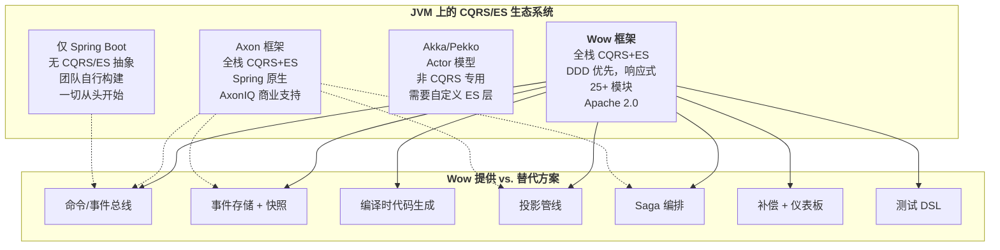
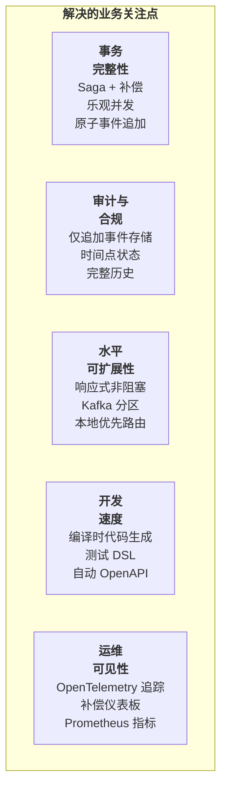
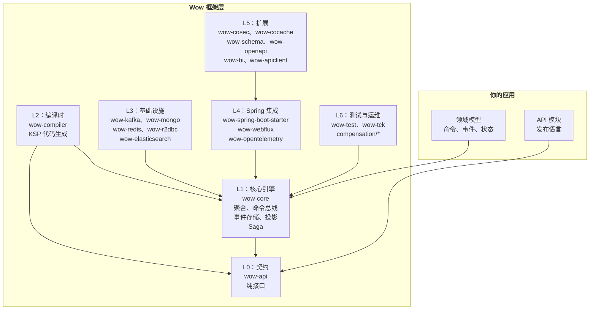
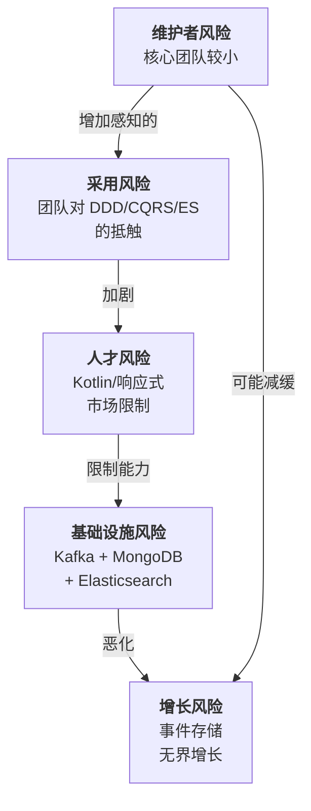
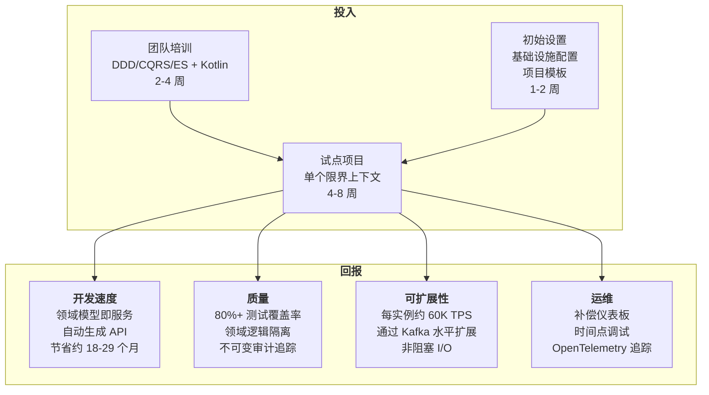
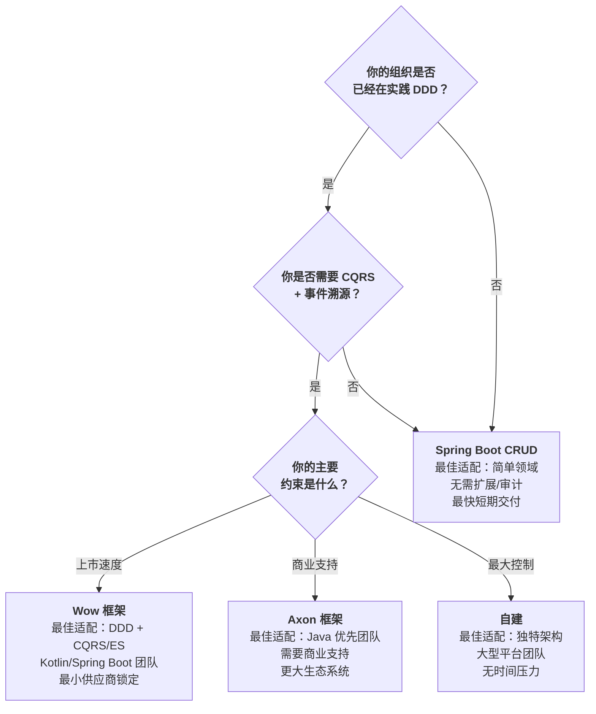
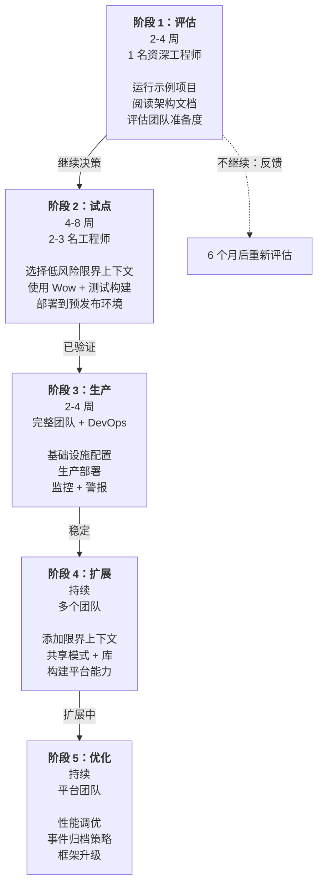

# 高管指南

**受众**：VP/总监级工程领导者，评估 Wow 框架是否适合组织采用。

**更新日期**：2026年5月 | **版本**：8.3.8 | **许可证**：Apache 2.0

---

## 执行摘要

**Wow 框架**是一个生产级、开源的微服务框架，专为在 JVM 上采用**领域驱动设计（DDD）**、**CQRS** 和**事件溯源**的团队构建。它消除了组织在从头构建事件溯源系统时通常需要投入数月自定义基础设施的工作，取而代之的是一个经过精心策划、久经考验的 25+ 模块平台。

该框架的核心理念是**"领域模型即服务"** -- 开发团队只需编写其领域模型（命令、事件、聚合状态），框架会自动生成命令路由、事件持久化、投影管线、OpenAPI 端点以及分布式 Saga 编排。在编译时，KSP 处理器生成路由表和 API 规范，消除运行时反射开销。来自[示例工作负载](https://github.com/Ahoo-Wang/Wow/blob/main/example)的性能基准显示，在即发即忘模式下实现约 60,000 每秒事务数，平均延迟 29 毫秒；在完全处理保证下实现约 19,000 TPS，延迟 239 毫秒 -- 这些性能特征适用于电商、物流、金融服务和游戏等高吞吐量事务系统。

对于评估是否投资事件溯源架构的领导团队，Wow 代表了 JVM 生态系统上风险最低的入场途径：Apache 2.0 许可（无供应商锁定）、Maven Central 发布、Spring Boot 4.x 原生支持，并由活跃的开源社区提供 CI/CD、集成测试和代码覆盖率强制执行支持。8.3.x 版本自 2025 年起已投入生产部署，展现出适合企业采用的成熟度。

<!-- Sources: README.md:1-16, gradle.properties:23, wiki/en/index.md:78-85, README.md:70-98 -->

---

## 生态位定位

下图将 Wow 置于更广泛的 CQRS/事件溯源生态系统中，将其与相关框架、库以及自建与购买决策区分开来。

<!-- Sources: README.md:30-34, wiki/en/guide/index.md:7-16, wiki/en/reference/cqrs.md:18-19 -->

---

## 能力图谱

Wow 开箱即用地提供了一套全面的能力。下表将每项能力映射到负责的模块，以便领导层根据组织需求评估覆盖范围。

| 能力 | 提供的功能 | 模块 | 战略价值 | 来源 |
|---|---|---|---|---|
| **DDD 聚合建模** | 对聚合根、状态聚合、值对象和领域事件的一流支持。三种建模模式：单类、继承、聚合。 | `wow-core` | 消除样板代码；开发者只需编写领域逻辑 | [CLAUDE.md:46-47](https://github.com/Ahoo-Wang/Wow/blob/main/CLAUDE.md#L46-L47) |
| **命令总线** | 带可配置等待计划（SENT、PROCESSED、PROJECTED、SAGA_HANDLED）的响应式命令路由。本地优先路由以提升性能。 | `wow-core`、`wow-kafka` | 将命令发送者与处理器解耦；实现即发即忘或同步语义 | [CLAUDE.md:46-47](https://github.com/Ahoo-Wang/Wow/blob/main/CLAUDE.md#L46-L47) |
| **事件存储** | 带乐观并发控制的仅追加事件持久化。后端：MongoDB、Redis、R2DBC（PostgreSQL/MySQL/MariaDB）。 | `wow-mongo`、`wow-redis`、`wow-r2dbc` | 完整审计追踪；时间点状态重建；无数据丢失 | [wiki/en/deep-dive/data/event-store.md](https://github.com/Ahoo-Wang/Wow/blob/main/wiki/en/deep-dive/data/event-store.md) |
| **快照存储** | 定期状态快照加速聚合加载。可配置快照间隔。 | `wow-core`、`wow-mongo`、`wow-redis` | 防止高事件数聚合的长时间事件重放；保持延迟可预测 | [wiki/en/deep-dive/data/snapshot-store.md](https://github.com/Ahoo-Wang/Wow/blob/main/wiki/en/deep-dive/data/snapshot-store.md) |
| **投影** | 响应式事件到读模型转换管线。目标：Elasticsearch、R2DBC、内存。 | `wow-core`、`wow-elasticsearch` | 无需手动同步逻辑即可实现 CQRS 读优化视图 | [wiki/en/guide/projection.md](https://github.com/Ahoo-Wang/Wow/blob/main/wiki/en/guide/projection.md) |
| **Saga 编排** | 通过事件驱动编排支持分布式事务。失败时自动补偿。 | `wow-core` | 无需分布式锁即可实现多聚合业务事务 | [wiki/en/guide/saga.md](https://github.com/Ahoo-Wang/Wow/blob/main/wiki/en/guide/saga.md) |
| **事件补偿** | 故障跟踪、自动重试和用于运维可见性的基于 React 的仪表板。 | `compensation/` 模块 | Saga 失败的运维安全网；降低生产事故的平均修复时间 | [wiki/en/guide/event-compensation.md](https://github.com/Ahoo-Wang/Wow/blob/main/wiki/en/guide/event-compensation.md) |
| **编译时代码生成** | KSP 处理器生成命令路由表、事件处理器元数据和 OpenAPI 规范。零运行时反射。 | `wow-compiler` | 更快的启动速度；构建时类型安全；自动 API 文档 | [CLAUDE.md:48](https://github.com/Ahoo-Wang/Wow/blob/main/CLAUDE.md#L48) |
| **OpenAPI / WebFlux** | Spring WebFlux 集成自动将命令端点注册为 HTTP 路由。开箱即用的 Swagger UI。 | `wow-webflux`、`wow-openapi` | 零控制器开发；API 文档始终与领域模型同步 | [wiki/en/deep-dive/integrations/spring-boot.md](https://github.com/Ahoo-Wang/Wow/blob/main/wiki/en/deep-dive/integrations/spring-boot.md) |
| **授权** | 通过 CoSec 扩展实现基于策略的命令/查询授权。 | `wow-cosec` | 声明式访问控制集成到命令处理管线中 | [CLAUDE.md:84](https://github.com/Ahoo-Wang/Wow/blob/main/CLAUDE.md#L84) |
| **可观测性** | OpenTelemetry 集成用于分布式追踪和指标。兼容 Prometheus 的指标导出。 | `wow-opentelemetry` | 命令/事件流的完整可见性；与现有可观测性技术栈集成 | [CLAUDE.md:83](https://github.com/Ahoo-Wang/Wow/blob/main/CLAUDE.md#L83) |
| **测试 DSL** | 用于聚合和 Saga 测试的 Given-When-Expect 模式。`AggregateSpec` 和 `SagaSpec` 轻松实现 80%+ 覆盖率。 | `wow-test` | 更低的缺陷率；更快的入门速度；对业务逻辑正确性的信心 | [wiki/en/guide/testing.md](https://github.com/Ahoo-Wang/Wow/blob/main/wiki/en/guide/testing.md) |
| **查询支持** | 通过 `wow-query` 模块提供读侧查询模型，用于直接访问读模型。 | `wow-query` | 补充投影与查询 API；支持 CoCache 缓存层 | [CLAUDE.md:49](https://github.com/Ahoo-Wang/Wow/blob/main/CLAUDE.md#L49) |
| **BI / 分析** | 商业智能同步脚本生成器，用于将聚合状态馈入数据仓库。 | `wow-bi` | 使数据团队能够直接消费领域事件；消除手动 ETL | [wiki/en/guide/bi.md](https://github.com/Ahoo-Wang/Wow/blob/main/wiki/en/guide/bi.md) |
| **API 客户端** | 自动生成的 RESTful API 客户端，用于类型安全的服务间通信。 | `wow-apiclient` | 消除手写 HTTP 客户端代码；类型安全的服务间调用 | [CLAUDE.md:86](https://github.com/Ahoo-Wang/Wow/blob/main/CLAUDE.md#L86) |
| **JSON Schema** | 从命令和事件模型生成 JSON Schema，用于 API 契约和验证。 | `wow-schema` | 支持 API 治理和契约测试计划 | [CLAUDE.md:81](https://github.com/Ahoo-Wang/Wow/blob/main/CLAUDE.md#L81) |

### 按业务关注点的能力覆盖

<!-- Sources: README.md:30-45, wiki/en/index.md:21-58, CLAUDE.md:46-89 -->

---

## 架构一览

框架被组织为严格分层的模块。每一层仅依赖于其下一层，强制执行清晰的分离，并使团队能够在不影响领域逻辑的情况下更换实现。

<!-- Sources: wiki/en/guide/architecture.md:30-91, CLAUDE.md:44-89, settings.gradle.kts:19-63 -->

---

## 风险评估

每次技术采用都伴随风险。以下评估从技术、运维和组织维度评估 Wow，并为每项提供缓解策略。

### 风险矩阵

| 风险类别 | 风险 | 严重性 | 可能性 | 缓解措施 | 来源证据 |
|---|---|---|---|---|---|
| **技术** | 单一维护者风险（核心团队较小） | 高 | 中 | Apache 2.0 许可允许分叉；Maven Central 发布的工件不可变；全面的测试套件（80%+ 覆盖率）确保稳定性，不受贡献者数量影响 | [codecov](https://codecov.io/gh/Ahoo-Wang/Wow)、[Maven Central](https://central.sonatype.com/artifact/me.ahoo.wow/wow-core) |
| **技术** | Kotlin/JVM 人才市场限制 | 中 | 中 | Kotlin 与 Java 无缝互操作；Wow 包含 [Java 示例项目](https://github.com/Ahoo-Wang/Wow/tree/main/example/transfer)；Kotlin 在 Spring 企业开发中的应用正在增长 | [CLAUDE.md:98](https://github.com/Ahoo-Wang/Wow/blob/main/CLAUDE.md#L98)、[example/transfer](https://github.com/Ahoo-Wang/Wow/tree/main/example/transfer) |
| **技术** | 生产环境对 Kafka 的依赖 | 中 | 低 | Kafka 是可选的 -- Redis Streams 和内存总线可用；LocalFirst 模式优先本地路由命令，然后回退到分布式总线；Kafka 是成熟、广为人知的基础设施组件 | [wiki/en/reference/config/basic.md:36-44](https://github.com/Ahoo-Wang/Wow/blob/main/wiki/en/reference/config/basic.md#L36-L44) |
| **技术** | 事件存储迁移复杂性 | 高 | 低 | 事件存储接口是抽象的；从 MongoDB 切换到 R2DBC 只需配置更改，无需重写领域代码；仅追加特性意味着数据可在后端之间复制 | [wiki/en/deep-dive/data/event-store.md](https://github.com/Ahoo-Wang/Wow/blob/main/wiki/en/deep-dive/data/event-store.md) |
| **技术** | 响应式编程学习曲线 | 中 | 高 | 所有命令/事件路径通过 Project Reactor 是非阻塞的；不熟悉响应式模式的开发者需要上手时间；测试 DSL 抽象了大量复杂性；`Mono`/`Flux` 在 Spring 生态系统中有良好文档 | [wiki/en/guide/architecture.md:73-76](https://github.com/Ahoo-Wang/Wow/blob/main/wiki/en/guide/architecture.md#L73-L76) |
| **运维** | 事件存储无界增长 | 中 | 高 | 快照减少重放成本；按聚合 ID 进行事件存储分区；可在应用级别实现事件归档策略；框架不强制自动删除（保留是特性，不是缺陷） | [wiki/en/deep-dive/data/snapshot-store.md](https://github.com/Ahoo-Wang/Wow/blob/main/wiki/en/deep-dive/data/snapshot-store.md) |
| **运维** | 调试事件溯源系统 | 中 | 中 | 补偿仪表板提供事件级别可见性；OpenTelemetry 追踪跟随命令到事件到投影路径；时间点状态重建支持基于重放的调试 | [wiki/en/guide/event-compensation.md](https://github.com/Ahoo-Wang/Wow/blob/main/wiki/en/guide/event-compensation.md) |
| **运维** | 基础设施复杂性（Kafka + MongoDB + Elasticsearch） | 中 | 中 | 对于较小部署，Redis + R2DBC 可替代 MongoDB + Elasticsearch；内存模式足以满足开发和测试；框架基于 classpath 自动配置，未使用的后端零开销 | [wiki/en/reference/config/](https://github.com/Ahoo-Wang/Wow/tree/main/wiki/en/reference/config/) |
| **采用** | 团队对 DDD/CQRS/ES 范式的抵触 | 高 | 高 | 从单个限界上下文开始（下文详述的增量采用策略）；测试 DSL 使正确性可见；一个上下文的成功建立组织信心；Wow 的编译时代码生成消除了团队默认使用的 CRUD 风格样板代码 | 参见下方"采用策略"部分 |
| **采用** | 版本升级风险（8.x 到 9.x） | 中 | 低 | 语义化版本控制；文档化的迁移指南；框架清晰的模块分离意味着内部 API 破坏不太可能级联到领域代码 | [wiki/en/guide/migration.md](https://github.com/Ahoo-Wang/Wow/blob/main/wiki/en/guide/migration.md) |
| **采用** | 来自 Axon 框架的竞争（更大社区） | 低 | 中 | Axon 有更大的社区但是商业驱动（AxonIQ）；Wow 是 Apache 2.0，背后无商业实体，消除供应商锁定担忧；Wow 的编译时代码生成和响应式优先架构是差异化因素 | [wiki/en/reference/cqrs.md:18-19](https://github.com/Ahoo-Wang/Wow/blob/main/wiki/en/reference/cqrs.md#L18-L19) |

### 风险相互依赖图

<!-- Sources: Comprehensive analysis based on README.md, CLAUDE.md, wiki/en/guide/, and settings.gradle.kts -->

---

## 技术投资论证

### 为什么 DDD + CQRS + 事件溯源值得投资

传统的基于 CRUD 的架构随着系统增长面临三个结构性限制：

1. **读写耦合**：同一数据模型同时服务命令和查询，迫使做出两者都不满意的妥协。读模型增长复杂连接；写模型失去事务完整性。
2. **审计缺陷**：可变数据库行销毁历史。合规、分析和调试需要昂贵的变通方案（变更数据捕获、日志抓取、时态表）。
3. **事务边界**：跨服务的分布式操作需要无法扩展的分布式事务（2PC、XA）。Saga 解决了这个问题，但手动实现容易出错且劳动密集。

DDD + CQRS + 事件溯源解决了所有三个问题：分离读写模型，不可变事件日志作为记录系统，事件驱动 Saga 用于分布式协调。Wow 通过提供完整的基础设施层，使这种架构模式变得可实践 -- 而不仅仅是理论上优雅。

### 为什么特指 Wow

JVM 上事件溯源基础设施的自建与购买计算是鲜明的。从头构建可比技术栈需要：

| 组件 | 预估工程月数 | Wow 等价物 |
|---|---|---|
| 带乐观并发 + 快照的事件存储 | 4-6 个月 | `wow-core` + 后端（Mongo/Redis/R2DBC） |
| 带等待计划的响应式命令总线 | 2-3 个月 | `wow-core` + `wow-kafka` |
| 带读模型同步的投影管线 | 3-4 个月 | `wow-core` + `wow-elasticsearch` |
| 带补偿的 Saga 编排 | 3-5 个月 | `wow-core` + `compensation/` |
| 路由/元数据的编译时代码生成 | 2-3 个月 | `wow-compiler` |
| 聚合和 Saga 的测试框架 | 1-2 个月 | `wow-test` |
| OpenAPI 生成和 WebFlux 集成 | 1-2 个月 | `wow-webflux` + `wow-openapi` |
| 可观测性集成（追踪 + 指标） | 1-2 个月 | `wow-opentelemetry` |
| 授权框架 | 1-2 个月 | `wow-cosec` |
| **预估构建总成本** | **18-29 个月** | **今天即可使用；Apache 2.0** |

这些预估假设一个由 3-4 名工程师组成的资深团队。Wow 在 Apache 2.0 许可下提供这整个技术栈 -- 无需采购、无需合同谈判、无供应商依赖。

<!-- Sources: README.md:30-97, CLAUDE.md:46-89, settings.gradle.kts:19-63 -->

### 投资回报模型

<!-- Sources: README.md:70-98, wiki/en/index.md:78-85, wiki/en/guide/testing.md -->

---

## 成本与扩展模型

### 开发成本概况

| 阶段 | 成本驱动因素 | 预估工作量 | 备注 |
|---|---|---|---|
| **上手** | DDD、CQRS、事件溯源、Kotlin 响应式的团队培训 | 2-4 周 | 取决于对范式的现有熟悉程度 |
| **初始设置** | 基础设施配置、项目模板克隆、CI/CD 配置 | 1-2 周 | [Wow 项目模板](https://github.com/Ahoo-Wang/wow-project-template) 显著加速 |
| **试点上下文** | 第一个限界上下文：领域建模、测试、部署 | 4-8 周 | 每个上下文成本最高；后续上下文更快 |
| **后续上下文** | 每个额外的限界上下文 | 2-4 周 | 模板、模式和习得的启发式方法降低成本 |
| **持续维护** | 每个服务的维护 | 低 | 领域逻辑隔离意味着大多数变更是自包含的 |
| **框架升级** | 版本升级（8.x 到 8.y） | 数小时到数天 | 语义化版本控制；提供迁移指南 |

### 运维成本概况

| 组件 | 基础设施需求 | 预估月度成本（云端） | 备注 |
|---|---|---|---|
| **Kafka** | 3 节点集群（生产） | $300-800/月 | 可使用托管服务（Confluent、MSK）；Redis Streams 替代方案成本更低 |
| **MongoDB** | 副本集或 Atlas | $150-500/月 | 可使用 R2DBC（PostgreSQL）作为低成本替代 |
| **Elasticsearch** | 2-3 节点集群 | $200-600/月 | 可选；仅在需要 Elasticsearch 投影时才需要 |
| **应用** | 标准 Spring Boot 容器 | 可变 | 水平扩展；JVM 17 适度堆内存需求 |
| **可观测性** | OpenTelemetry collector + Prometheus | $100-300/月 | 与现有可观测性技术栈集成 |
| **补偿** | 嵌入应用中 | $0 增量 | 仪表板从同一应用实例提供服务 |

小型生产部署的总基础设施成本：**$750-2,200/月**加上应用托管。该架构支持增量基础设施投资 -- 从单服务器上的 Redis + R2DBC 开始，随着吞吐量需求增长添加 Kafka 和 MongoDB。

<!-- Sources: README.md:20-25, wiki/en/reference/config/, CLAUDE.md:59-65 -->

### 扩展特性

| 维度 | 特性 | Wow 如何处理 |
|---|---|---|
| **写吞吐量** | 每实例约 60K TPS（SENT 模式） | 水平扩展增加实例；Kafka 按聚合 ID 分区；无跨实例协调 |
| **读吞吐量** | 受投影存储限制（Elasticsearch/R2DBC） | 投影与写解耦；读副本；CoCache 缓存层 |
| **聚合数量** | 事件存储按聚合线性增长 | 快照限制重放成本；按聚合 ID 事件存储分区；归档策略可行 |
| **事件历史深度** | 长生命周期聚合积累事件 | 可配置间隔的快照；仅重放自上次快照以来的增量事件 |
| **团队扩展** | 每个限界上下文可独立部署 | 每个上下文一个模块的模式；团队拥有自己的领域，无需协调 |

<!-- Sources: README.md:70-98, wiki/en/deep-dive/data/snapshot-store.md -->

---

## 团队要求

### 技能构成

| 角色 | 所需技能 | 上手时间 | 关键程度 |
|---|---|---|---|
| **领域架构师** | DDD 战略设计；限界上下文识别；事件风暴引导 | 0-2 周（如果 DDD 经验丰富） | **关键** -- 设计限界上下文边界和聚合结构 |
| **资深工程师** | Kotlin（或有意愿学习 Kotlin 的 Java）；Spring Boot；响应式编程概念；CQRS/ES 基础 | 2-4 周 | **关键** -- 实现聚合、Saga 和投影 |
| **中级工程师** | Kotlin 或 Java；Spring Boot；单元测试 | 3-6 周 | **重要** -- 编写测试，为投影和查询模型做出贡献 |
| **DevOps / 平台** | Kafka、MongoDB、Kubernetes、可观测性工具 | 1-2 周 | **重要** -- 配置基础设施、配置监控 |
| **前端工程师** | React、TypeScript、API 客户端使用 | 1-2 周 | **可选** -- 如果使用补偿仪表板或构建自定义 UI |

### 推荐团队规模

| 阶段 | 团队构成 | 备注 |
|---|---|---|
| **评估（2-4 周）** | 1 名资深工程师 | 构建概念验证限界上下文；评估适配性 |
| **试点（4-8 周）** | 2-3 名工程师（1 名资深，1-2 名中级） | 首个生产中的实际限界上下文；建立模式 |
| **扩展（持续）** | 每限界上下文 3-5 名工程师 | 多个团队在独立限界上下文上工作；共享基础设施团队 |
| **平台团队（持续）** | 1-2 名工程师 | 负责框架升级、共享基础设施、内部最佳实践 |

### 培训路径

1. **第 1 周**：DDD 基础（限界上下文、聚合、领域事件、统一语言）。如需要，学习 Kotlin 基础。
2. **第 2 周**：CQRS 和事件溯源理论。Wow 框架概述。克隆项目模板并构建"Hello World"限界上下文。
3. **第 3 周**：实现带业务逻辑的聚合根。使用 `AggregateSpec` 编写测试。运行示例 Order/Cart 领域。
4. **第 4 周**：Saga、投影、补偿。将试点上下文部署到预发布环境。运行性能测试。

[Wow 项目模板](https://github.com/Ahoo-Wang/wow-project-template) 和[示例项目](https://github.com/Ahoo-Wang/Wow/tree/main/example) 在整个培训过程中作为参考实现。

<!-- Sources: wiki/en/guide/index.md:7-16, CLAUDE.md:34-52, wiki/en/guide/testing.md -->

---

## 替代方案比较

### 并排比较

| 维度 | **Wow 框架** | **Axon 框架** | **仅 Spring Boot（自建）** | **Akka / Pekko（自建）** |
|---|---|---|---|---|
| **许可证** | Apache 2.0 | AxonIQ 开源（核心）+ 商业（Server） | N/A（自建） | Apache 2.0 |
| **语言** | Kotlin 优先（Java 兼容） | Java 优先（Kotlin 兼容） | Java/Kotlin | Scala/Java |
| **CQRS 分离** | 内置：命令总线 + 事件总线 + 投影管线 | 内置：命令网关 + 事件总线 + 查询处理器 | 你构建一切 | 在 Actor 之上构建 ES/CQRS 层 |
| **事件溯源** | 完整：事件存储、快照存储、状态重建、乐观并发 | 完整：事件存储、快照、升级、追踪令牌 | 你构建一切 | 你构建一切 |
| **事件存储后端** | MongoDB、Redis、R2DBC（PostgreSQL/MySQL/MariaDB） | Axon Server、JPA、JDBC、MongoDB | 你实现的任何后端 | 你实现的任何后端 |
| **消息总线** | Kafka、Redis Streams、内存 | Axon Server、Kafka、RabbitMQ、gRPC | 你实现的任何总线 | Akka Cluster、Kafka |
| **编译时处理** | KSP：路由表、事件元数据、OpenAPI 规范 | 有限（注解处理） | 无 | 无 |
| **测试框架** | `AggregateSpec` + `SagaSpec`（Given-When-Expect） | `AggregateTestFixture` + `SagaTestFixture`（Given-When-Then） | 你构建或使用通用 JUnit | Akka TestKit（面向 Actor） |
| **Saga 支持** | 内置编排 + 编排 + 补偿仪表板 | 内置：事件驱动和命令驱动 Saga | 你构建 | 你构建 |
| **运维仪表板** | 补偿仪表板（React、Ant Design） | AxonIQ Console（商业） | 你构建 | 你构建 |
| **可观测性** | OpenTelemetry（追踪 + 指标） | AxonIQ Console / Micrometer | Spring Boot Actuator + 自定义 instrumentation | Kamon / OpenTelemetry |
| **授权** | CoSec（基于策略） | AxonIQ Console / Spring Security | Spring Security（自定义集成） | 自定义 |
| **API 暴露** | 自动生成的 WebFlux 端点 + Swagger UI | Axon Server HTTP API 或自定义 Spring MVC | Spring MVC / WebFlux（手动控制器） | Akka HTTP（手动路由） |
| **社区规模** | 成长中（约 1.6K GitHub Stars） | 大型（约 3K+ GitHub Stars） | N/A | 大型（Akka 遗产 + Pekko 分支） |
| **生态系统成熟度** | 自 2023 年生产使用；v8.3.x 稳定 | 自 2010 年生产使用；v4.x 稳定 | N/A | 自 2009 年生产使用（Akka） |
| **供应商锁定风险** | 无（Apache 2.0，Maven Central） | 中（Axon Server 商业功能；AxonIQ 作为主要维护者） | 无（但你拥有所有代码） | 无（Apache 2.0） |
| **上手时间** | 2-4 周（如果 DDD/CQRS/ES 概念已知） | 2-4 周（如果 DDD/CQRS/ES 概念已知） | 6-12 个月（构建基础设施） | 3-6 个月（在 Actor 之上构建 CQRS/ES） |

### 决策树

<!-- Sources: wiki/en/reference/cqrs.md:18-19, README.md:1-16, CLAUDE.md:46-89 -->

---

## 采用策略

### 增量采用路径

事件溯源架构最高风险的方法是"大爆炸"迁移。Wow 支持在 Spring Boot 生态系统内增量采用：一次引入一个限界上下文，在生产中验证，然后扩展。

<!-- Sources: wiki/en/guide/index.md:7-16, CLAUDE.md:46-89 -->

### 试点上下文的选择标准

仔细选择第一个限界上下文。理想的试点：

| 标准 | 好的试点 | 差的试点 | 理由 |
|---|---|---|---|
| **业务关键性** | 低到中 | 任务关键（不能容忍失败） | 在安全环境中学习 |
| **复杂性** | 适中（2-5 个命令，1-2 个 Saga） | 琐碎（1 个命令）或极其复杂（10+ 命令） | 太简单学不到东西；太复杂有失败风险 |
| **团队熟悉度** | 团队了解该领域 | 需求不明确的新领域 | 领域建模需要深入理解领域 |
| **现有系统** | 全新或小型、理解清楚的棕地 | 边界不清晰的单体应用 | 棕地事件溯源是高级模式 |
| **时间容忍度** | 6-8 周可接受 | 2 周截止日期 | 首个上下文需要学习和验证时间 |

### 基础设施演进路径

| 阶段 | 事件存储 | 消息总线 | 投影存储 | 监控 |
|---|---|---|---|---|
| **开发** | R2DBC（嵌入式 PostgreSQL） | 内存 | 内存 | 日志 |
| **预发布** | MongoDB（单节点） | Kafka（单 Broker） | Elasticsearch（单节点） | OpenTelemetry + Jaeger |
| **生产** | MongoDB 副本集或 Atlas | Kafka 集群（3+ Broker） | Elasticsearch 集群 | OpenTelemetry + Prometheus + Grafana |
| **企业** | 多区域 MongoDB | 多区域 Kafka | 多区域 Elasticsearch | 带告警的完整可观测性技术栈 |

<!-- Sources: wiki/en/reference/config/, wiki/en/deep-dive/data/event-store.md -->

---

## 可操作建议

### 即时后续步骤（第 1-2 周）

1. **指派一名资深工程师**进行评估。此人应具有 Kotlin 或 Java + Spring Boot 经验，并对 DDD 和事件溯源感兴趣。预算：2-4 周专职时间。

2. **克隆并运行示例**：
   - [Order & Cart 示例（Kotlin）](https://github.com/Ahoo-Wang/Wow/tree/main/example) -- 完整的 DDD + CQRS + Saga + Projection
   - [银行转账示例（Java）](https://github.com/Ahoo-Wang/Wow/tree/main/example/transfer) -- 简单的 Java 事件溯源
   - [Wow 项目模板](https://github.com/Ahoo-Wang/wow-project-template) -- 入门脚手架

3. **查看文档**：
   - [入门指南](/zh/guide/) -- 全面入门
   - [架构概述](/zh/deep-dive/architecture/overview) -- 技术深入
   - [配置参考](/zh/reference/config/basic) -- 所有配置选项

4. **评估团队准备度**：调查你的工程团队对 DDD、CQRS、事件溯源、响应式编程和 Kotlin 的熟悉程度。识别知识差距并规划培训。

### 试点项目决策（第 3-4 周）

5. **使用上表中的标准选择试点限界上下文**。常见的好候选：用户资料管理、通知偏好、购物车 -- 具有清晰边界和适中复杂性的领域。

6. **定义成功标准**：成功的试点是什么样子？示例：(a) 领域逻辑有 80%+ 测试覆盖率，(b) 系统处理预期吞吐量，(c) 团队能够独立建模和测试新聚合。

7. **配置基础设施**：在开发/预发布环境中设置 Kafka、MongoDB 以及可选的 Elasticsearch。使用[部署示例](https://github.com/Ahoo-Wang/Wow/tree/main/deploy)作为参考。

### 构建阶段（第 5-12 周）

8. **对领域建模**：使用事件风暴或领域叙事来识别聚合、命令、事件和 Saga。编写统一语言词汇表。

9. **实现和测试**：使用[建模指南](/zh/guide/modeling)构建聚合。使用[测试指南](/zh/guide/test-suite)编写测试。在担心基础设施之前验证业务逻辑。

10. **部署和监控**：部署到预发布环境。使用[性能测试配置](https://github.com/Ahoo-Wang/Wow/tree/main/deploy/example/perf)作为参考运行负载测试。在补偿仪表板上设置 Saga 失败的警报。

### 长期投资（第 4 个月以后）

11. **构建内部平台能力**：指定 1-2 名工程师作为 Wow 平台所有者。他们的职责：框架版本升级、共享库开发、内部文档以及指导新团队。

12. **扩展到更多限界上下文**：随着模式、库和团队专业知识的积累，每个后续上下文应比第一个少花 50% 的时间。

13. **回馈社区**：报告 bug、提交文档改进、分享经验。一个活跃的、贡献的用户会加强你的组织所依赖的开源生态系统。

### 决策时间线

| 里程碑 | 时间 | 决策门 |
|---|---|---|
| 初始评估完成 | 第 2 周 | 试点继续/不继续 |
| 试点上下文在预发布 | 第 6 周 | 验证架构适配性 |
| 试点上下文在生产 | 第 10 周 | 扩展继续/不继续 |
| 第二个限界上下文上线 | 第 4 个月 | 确认速度提升 |
| 平台能力建立 | 第 6 个月 | 组织级采用决策 |

<!-- Sources: wiki/en/guide/index.md, wiki/en/guide/architecture.md, README.md:70-98, CLAUDE.md:46-89 -->

---

## 附录：关键指标一览

| 指标 | 值 | 来源 |
|---|---|---|
| **版本** | 8.3.8 | [gradle.properties:23](https://github.com/Ahoo-Wang/Wow/blob/main/gradle.properties#L23) |
| **许可证** | Apache 2.0 | [gradle.properties:28-29](https://github.com/Ahoo-Wang/Wow/blob/main/gradle.properties#L28-L29) |
| **语言** | Kotlin 2.3 / JVM 17+ | [CLAUDE.md:100](https://github.com/Ahoo-Wang/Wow/blob/main/CLAUDE.md#L100) |
| **框架** | Spring Boot 4.x | [CLAUDE.md:3](https://github.com/Ahoo-Wang/Wow/blob/main/CLAUDE.md#L3) |
| **模块数** | 25+ | [settings.gradle.kts:19-63](https://github.com/Ahoo-Wang/Wow/blob/main/settings.gradle.kts#L19-L63) |
| **性能（SENT）** | ~60K TPS（AddCartItem），~48K TPS（CreateOrder） | [README.md:70-98](https://github.com/Ahoo-Wang/Wow/blob/main/README.md#L70-L98) |
| **性能（PROCESSED）** | ~19K TPS（AddCartItem），~18K TPS（CreateOrder） | [README.md:70-98](https://github.com/Ahoo-Wang/Wow/blob/main/README.md#L70-L98) |
| **测试覆盖率** | 轻松实现 80%+ | [README.md:121-128](https://github.com/Ahoo-Wang/Wow/blob/main/README.md#L121-L128) |
| **最大端到端延迟（SENT）** | 29 ms | [wiki/en/index.md:83](https://github.com/Ahoo-Wang/Wow/blob/main/wiki/en/index.md#L83) |
| **最大端到端延迟（PROCESSED）** | 239 ms | [wiki/en/index.md:84](https://github.com/Ahoo-Wang/Wow/blob/main/wiki/en/index.md#L84) |
| **GitHub Stars** | 约 1,600+ | [GitHub](https://github.com/Ahoo-Wang/Wow) |
| **Maven Central** | 已发布 | [Maven Central](https://central.sonatype.com/artifact/me.ahoo.wow/wow-core) |
| **CI/CD** | 带集成测试的 GitHub Actions | [集成测试](https://github.com/Ahoo-Wang/Wow/actions/workflows/integration-test.yml) |
| **代码质量** | Codacy + Codecov 监控 | [Codacy](https://app.codacy.com/gh/Ahoo-Wang/Wow/dashboard) |

---

## 相关页面

| 页面 | 描述 |
|---|---|
| [首页](/zh/) | Wow 框架概述、功能、架构和性能基准 |
| [入门指南](/zh/guide/) | 开发者完整入门指南 |
| [架构概述](/zh/deep-dive/architecture/overview) | 框架架构技术深入 |
| [示例：Order & Cart](https://github.com/Ahoo-Wang/Wow/tree/main/example) | 完整的 DDD + CQRS + Saga 参考实现 |
| [Wow 项目模板](https://github.com/Ahoo-Wang/wow-project-template) | 新项目的官方入门模板 |
| [配置参考](/zh/reference/config/basic) | 所有模块的完整配置选项 |
| [Saga 指南](/zh/guide/saga) | 分布式事务实现指南 |
| [事件补偿](/zh/guide/event-compensation) | 故障处理和重试基础设施 |
| [测试指南](/zh/guide/test-suite) | AggregateSpec 和 SagaSpec 测试 DSL |
| [迁移指南](/zh/guide/migration) | 版本升级说明 |
| [Awesome CQRS](/zh/reference/awesome/cqrs) | 相关框架、书籍和资源 |
