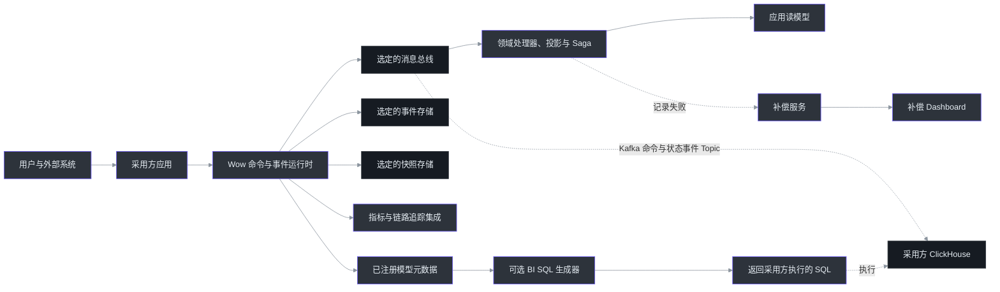
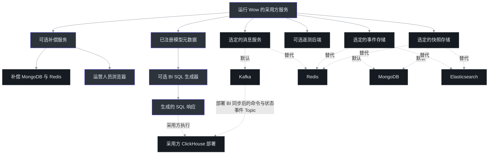
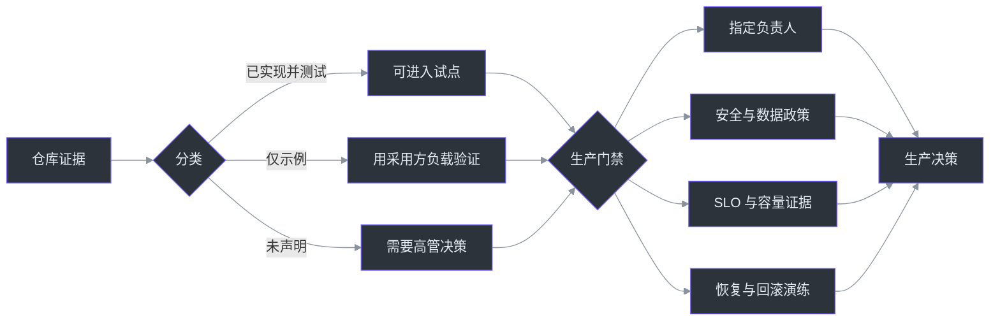

# 高管指南

## 目的与证据基线

本指南说明 Wow 能支持什么、采用它需要承担什么，以及哪些业务决策
无法由仓库替组织作出。

目标读者包括工程负责人、平台负责人、架构委员会、安全评审者以及
对交付风险负责的管理者。

证据基线为 Wow 仓库的 `main` 分支。

Wow 将自身定位为面向现代应用的响应式 CQRS 与 Event Sourcing 框架。
它是框架和集成模块集合，不是完整业务产品，也不是托管服务。

当前项目版本为 `8.10.1`，JVM 工具链为 17，构建使用 Kotlin `2.4.10`。

来源：

- [README.md:7-9](https://github.com/Ahoo-Wang/Wow/blob/main/README.md#L7-L9)
- [gradle.properties:13-23](https://github.com/Ahoo-Wang/Wow/blob/main/gradle.properties#L13-L23)
- [gradle/libs.versions.toml:1-35](https://github.com/Ahoo-Wang/Wow/blob/main/gradle/libs.versions.toml#L1-L35)

### 阅读约定

- “已实现”表示仓库中存在对应生产代码或配置。
- “已测试”表示存在相关自动化检查，不代表采用方的生产环境已验证。
- “可选”表示该集成通过模块或 feature capability 选择，不是全局必然启用。
- “示例”表示仓库展示了一种部署选择，不代表服务等级承诺或生产标准。
- “未声明”表示仓库没有建立可问责的负责人、目标、政策或承诺。

## 高管摘要

Wow 提供命令处理、事件持久化、状态重建、投影、Saga、快照、可观测性
接入和失败恢复工作流的模块化基础。

框架围绕响应式执行设计，支持选择传输和存储技术。采用方仍需负责领域
模型、服务边界、数据政策、生产拓扑、访问控制、容量模型、事件响应流程
和服务目标。

最适合采用的情形，是组织确实需要可审计的领域变更、异步工作流或多个
读模型，并且有能力运营事件驱动基础设施。

最不适合采用的情形，是简单 CRUD 服务既不需要事件历史和异步处理，团队
也无法承担消息代理、存储、投影和重放带来的运营复杂度。

仓库提供了较完整的工程自动化：本地、契约、集成、静态分析、Dashboard、
补偿、Java 示例和 benchmark smoke 工作流。这些检查提高框架构建置信度，
但不能证明采用方的可用性、延迟、恢复或合规结果。

来源：

- [settings.gradle.kts:23-85](https://github.com/Ahoo-Wang/Wow/blob/main/settings.gradle.kts#L23-L85)
- [build.gradle.kts:50-166](https://github.com/Ahoo-Wang/Wow/blob/main/build.gradle.kts#L50-L166)
- [.github/workflows/integration-test.yml:47-75](https://github.com/Ahoo-Wang/Wow/blob/main/.github/workflows/integration-test.yml#L47-L75)
- [.github/workflows/static-analysis.yml:35-53](https://github.com/Ahoo-Wang/Wow/blob/main/.github/workflows/static-analysis.yml#L35-L53)

## 系统概览

下图将采用方应用责任、框架能力和采用方选择的基础设施分开表示。

```mermaid
flowchart LR
    U["用户与外部系统"] --> A["采用方应用"]
    A --> W["Wow 命令与事件运行时"]
    W --> B["选定的消息总线"]
    W --> ES["选定的事件存储"]
    W --> SS["选定的快照存储"]
    B --> H["领域处理器、投影与 Saga"]
    H --> RM["应用读模型"]
    H -. "记录失败" .-> C["补偿服务"]
    C --> D["补偿 Dashboard"]
    W --> O["指标与链路追踪集成"]
    W --> M["已注册模型元数据"]
    M --> BI["可选 BI SQL 生成器"]
    BI --> SQL["返回采用方执行的 SQL"]
    SQL -. "执行" .-> CH["采用方 ClickHouse"]
    B -. "Kafka 命令与状态事件 Topic" .-> CH
    classDef core fill:#2d333b,stroke:#6d5dfc,color:#e6edf3
    classDef external fill:#161b22,stroke:#30363d,color:#e6edf3
    class U,A,W,H,RM,C,D,O,M,BI,SQL core
    class B,ES,SS,CH external
    linkStyle default stroke:#8b949e
```

<!-- Sources: [settings.gradle.kts:23-66](https://github.com/Ahoo-Wang/Wow/blob/main/settings.gradle.kts#L23-L66), [wow-spring-boot-starter/build.gradle.kts:5-44](https://github.com/Ahoo-Wang/Wow/blob/main/wow-spring-boot-starter/build.gradle.kts#L5-L44), [WowMetrics.kt](https://github.com/Ahoo-Wang/Wow/blob/main/wow-core/src/main/kotlin/me/ahoo/wow/metrics/WowMetrics.kt), [CompensationFilter.kt:58-119](https://github.com/Ahoo-Wang/Wow/blob/main/compensation/wow-compensation-core/src/main/kotlin/me/ahoo/wow/compensation/core/CompensationFilter.kt#L58-L119), [GenerateBIScriptHandlerFunction.kt:87-112](https://github.com/Ahoo-Wang/Wow/blob/main/wow-webflux/src/main/kotlin/me/ahoo/wow/webflux/route/global/GenerateBIScriptHandlerFunction.kt#L87-L112), [ClickHouseCommandRenderer.kt:108-120](https://github.com/Ahoo-Wang/Wow/blob/main/wow-bi/src/main/kotlin/me/ahoo/wow/bi/renderer/ClickHouseCommandRenderer.kt#L108-L120), [ClickHouseStateEventRenderer.kt:119-132](https://github.com/Ahoo-Wang/Wow/blob/main/wow-bi/src/main/kotlin/me/ahoo/wow/bi/renderer/ClickHouseStateEventRenderer.kt#L119-L132) -->

该图描述可用集成点，不表示所有组件都在每个应用中启用，也不表示这些组件
都由 Wow 自动部署。

## 能力地图

| 能力 | 状态 | 成熟度 | 依赖 | 采用边界 |
| --- | --- | --- | --- | --- |
| 命令分发 | 已构建 | 核心实现 | 应用领域模型、选定总线；仅 HTTP 暴露需要 WebFlux | 领域授权和业务校验仍由应用负责 |
| Event Sourcing | 已构建 | 核心实现 | 事件存储与事件 Schema 治理 | 未提供数据增长、保留和删除政策 |
| 快照 | 已构建 | 可配置核心能力 | 快照存储；默认类型为 MongoDB | 快照频率和存储选择需要负载验证 |
| 投影 | 已构建 | 核心加应用定义存储 | 事件总线与应用选择的读模型存储 | Wow 不提供通用投影写入器；Schema、新鲜度和重建由采用方负责 |
| Saga | 已构建 | 核心实现 | 事件分发和应用定义的 Saga 行为 | 业务补偿语义必须由应用设计 |
| 消息总线 | 已构建 | 多种实现 | 默认 Kafka；可选 Redis、内存或 No-op | 交付保证取决于后端及其配置 |
| 存储路由 | 已构建 | 可配置核心能力 | 具名事件存储和快照存储 | 路由错误和迁移流程需要治理 |
| Web API | 已构建 | 可选集成 | WebFlux 与所选路由能力 | 未声明通用认证和限流 |
| OpenAPI | 已构建 | 可选集成 | OpenAPI 与 WebFlux capability | 发布契约治理仍由采用方负责 |
| 可观测性 | 已构建 | 可选插桩 | Metrics 或 OpenTelemetry 后端 | 未声明 Dashboard、告警、目标和事件负责人 |
| 补偿 | 已构建 | 独立服务与 Dashboard | 符合条件的事件处理路径、补偿存储和运营流程 | 不是命令回滚，也不保证业务一致性 |
| BI 脚本生成 | 已构建 | 可选集成 | 已注册模型元数据；仅在采用方执行生成 SQL 后才依赖 Kafka 命令/状态事件 Topic 与 ClickHouse | 生成过程返回 SQL，且默认使用 No-op 部署检查器；执行、数据所有权、保留和分析治理仍在框架外 |
| 测试 DSL | 已构建 | 测试支持 | 应用测试场景 | 生产行为仍需集成与负载验证 |
| Spring Boot 组合 | 已构建 | Feature variants | 所选存储、总线、Web、遥测和安全适配器 | 每个启用后端都会增加升级和运营责任 |

来源：

- [BusProperties.kt:21-45](https://github.com/Ahoo-Wang/Wow/blob/main/wow-spring-boot-starter/src/main/kotlin/me/ahoo/wow/spring/boot/starter/BusProperties.kt#L21-L45)
- [SnapshotProperties.kt:23-45](https://github.com/Ahoo-Wang/Wow/blob/main/wow-spring-boot-starter/src/main/kotlin/me/ahoo/wow/spring/boot/starter/eventsourcing/snapshot/SnapshotProperties.kt#L23-L45)
- [StorageRoutingProperties.kt:19-36](https://github.com/Ahoo-Wang/Wow/blob/main/wow-spring-boot-starter/src/main/kotlin/me/ahoo/wow/spring/boot/starter/eventsourcing/routing/StorageRoutingProperties.kt#L19-L36)
- [BuiltInHttpRoutes.kt:18-75](https://github.com/Ahoo-Wang/Wow/blob/main/wow-openapi/src/main/kotlin/me/ahoo/wow/openapi/contract/BuiltInHttpRoutes.kt#L18-L75)
- [OpenAPIProperties.kt:21-27](https://github.com/Ahoo-Wang/Wow/blob/main/wow-spring-boot-starter/src/main/kotlin/me/ahoo/wow/spring/boot/starter/openapi/OpenAPIProperties.kt#L21-L27)
- [CompensationFilter.kt:58-119](https://github.com/Ahoo-Wang/Wow/blob/main/compensation/wow-compensation-core/src/main/kotlin/me/ahoo/wow/compensation/core/CompensationFilter.kt#L58-L119)
- [BiScriptProperties.kt:55-66](https://github.com/Ahoo-Wang/Wow/blob/main/wow-spring-boot-starter/src/main/kotlin/me/ahoo/wow/spring/boot/starter/bi/BiScriptProperties.kt#L55-L66)
- [GenerateBIScriptHandlerFunction.kt:87-112](https://github.com/Ahoo-Wang/Wow/blob/main/wow-webflux/src/main/kotlin/me/ahoo/wow/webflux/route/global/GenerateBIScriptHandlerFunction.kt#L87-L112)
- [ClickHouseStateEventRenderer.kt:119-132](https://github.com/Ahoo-Wang/Wow/blob/main/wow-bi/src/main/kotlin/me/ahoo/wow/bi/renderer/ClickHouseStateEventRenderer.kt#L119-L132)

## 架构概览

Wow 遵循分层模块方向：API 契约进入核心运行时，Spring 集成和专用基础设施
模块在核心之上扩展。

Starter 为 MongoDB、Redis、Mock、Kafka、WebFlux、Elasticsearch、
OpenTelemetry、OpenAPI 和 CoSec 暴露 feature capabilities。

这种模块化降低强制耦合，但选择持久消息代理和存储后，部署系统仍是分布式
应用。

采用架构因此应同时记录 Wow 模块图和实际运行拓扑，两者不能互相替代。

来源：

- [settings.gradle.kts:23-66](https://github.com/Ahoo-Wang/Wow/blob/main/settings.gradle.kts#L23-L66)
- [wow-spring-boot-starter/build.gradle.kts:5-44](https://github.com/Ahoo-Wang/Wow/blob/main/wow-spring-boot-starter/build.gradle.kts#L5-L44)

## 团队拓扑与协作接口

仓库没有声明 `CODEOWNERS`、团队目录或服务所有权地图。下表因此是采用建议，
不是对 Wow 维护者组织结构的陈述。

| 组件 | 负责人 | 关键性 | Bus Factor |
| --- | --- | --- | --- |
| 应用领域模型 | 建议由产品研发负责；仓库未声明 | 高——决定业务正确性 | 未声明 |
| 框架组合与升级 | 建议由平台工程负责；仓库未声明 | 高——影响每个采用服务 | 未声明 |
| 消息平台 | 建议由消息平台或 SRE 负责；仓库未声明 | 选择外部总线时为高 | 未声明 |
| 事件与快照存储 | 建议由数据平台或 SRE 负责；仓库未声明 | 高——保存恢复所需状态 | 未声明 |
| 投影与搜索 | 建议由产品团队和数据平台负责；仓库未声明 | 按客户旅程为中到高 | 未声明 |
| 补偿运营 | 建议由服务负责人和运维负责；仓库未声明 | 对符合条件的恢复流程为高 | 未声明 |
| API 暴露与访问政策 | 建议由服务负责人和安全团队负责；仓库未声明 | 高——控制强操作路由 | 未声明 |
| 可观测与事件响应 | 建议由 SRE 或可观测平台负责；仓库未声明 | 生产运营为高 | 未声明 |
| 数据治理 | 建议由数据治理和法务负责；仓库未声明 | 受监管数据为高 | 未声明 |
| Wow 框架贡献 | 通过贡献流程与 Wow 维护者协作；未声明个人 | 按变更为中到高 | 未声明 |

贡献指南要求在实现公共 API 或依赖变更前先讨论；安全政策要求向维护者私下
报告漏洞。两份文件都没有指定采用方生产服务的组织负责人。

来源：

- [CONTRIBUTING.md:1-10](https://github.com/Ahoo-Wang/Wow/blob/main/CONTRIBUTING.md#L1-L10)
- [CONTRIBUTING.md:50-58](https://github.com/Ahoo-Wang/Wow/blob/main/CONTRIBUTING.md#L50-L58)
- [SECURITY.md:7-21](https://github.com/Ahoo-Wang/Wow/blob/main/SECURITY.md#L7-L21)

## 技术投资逻辑

| 技术或模型 | 用途 | 仓库中考虑的替代方案 | 风险等级 |
| --- | --- | --- | --- |
| CQRS 与 Event Sourcing | 保留业务变化，并分离写行为和读视图 | 仓库决策记录未评估只保存当前状态的 CRUD 方案 | 高——事件兼容与生命周期是长期义务 |
| 基于 Reactor 的执行 | 组合异步命令与事件工作 | 未记录替代方案 | 中——采用方代码与集成必须保持非阻塞 |
| Spring Boot Starter | 通过配置组合可选能力 | 可直接组合模块；仓库未记录正式权衡 | 中——启用功能会扩大升级与运营范围 |
| Kafka、Redis、内存或 No-op 总线 | 传输命令与事件 | 可选择这四类总线 | 持久生产传输为高，本地选项为低 |
| MongoDB、Redis、Elasticsearch、内存或 Delay 存储 | 通过选定或路由存储持久化事件与快照；内存和 Delay 模式用于非持久化/测试场景 | 五种 `StorageType` 和自定义路由均可配置 | 持久存储为高——持久性和迁移取决于选择 |
| Elasticsearch 事件/快照适配器 | 持久化并查询事件流和快照，包括搜索已存储状态 | MongoDB、Redis 和应用自定义存储仍是替代方案 | 中——索引生命周期与重建由采用方负责；它不是通用投影写入器 |
| OpenTelemetry 与 Metrics 包装 | 导出运行时活动 | 插桩可选，后端由采用方选择 | 中——成本与隐私取决于采样和属性 |
| 补偿服务与 Dashboard | 展示并重试符合条件的处理器失败 | 业务人工纠正仍由应用负责 | 高——不安全重试可能重复副作用 |

### 为什么该模型可能创造价值

事件历史可以提高可审计性，并支持在不改变原始写模型的情况下新增投影。

命令处理鼓励表达明确的领域意图，而不是通用记录修改。

快照在不丢弃事件历史的前提下，为长生命周期聚合提供性能机制。

失败记录与受控重试能让选定异步处理器的失败对运营人员可见。

### 该模型带来的成本

事件 Schema 会成为长期兼容契约。

投影延迟和重放会引入传统 CRUD 系统可能没有的运营状态。

多个后端需要协调容量规划、升级、备份、恢复和事件响应。

默认聚合删除路径会产生删除事件，并把重建状态标为 deleted。公共
`EventStore` 契约提供 append 与 load 等操作，但没有通用擦除操作，因此采用方
不能把默认删除命令视为仓库级数据擦除机制。

运营恢复必须区分传输重试、处理器重试、事件重放、状态重建和业务补偿。

来源：

- [DomainEventStream.kt:31-56](https://github.com/Ahoo-Wang/Wow/blob/main/wow-core/src/main/kotlin/me/ahoo/wow/event/DomainEventStream.kt#L31-L56)
- [Snapshot.kt:19-40](https://github.com/Ahoo-Wang/Wow/blob/main/wow-core/src/main/kotlin/me/ahoo/wow/eventsourcing/snapshot/Snapshot.kt#L19-L40)
- [BusProperties.kt:21-45](https://github.com/Ahoo-Wang/Wow/blob/main/wow-spring-boot-starter/src/main/kotlin/me/ahoo/wow/spring/boot/starter/BusProperties.kt#L21-L45)
- [EventStoreProperties.kt:20-25](https://github.com/Ahoo-Wang/Wow/blob/main/wow-spring-boot-starter/src/main/kotlin/me/ahoo/wow/spring/boot/starter/eventsourcing/store/EventStoreProperties.kt#L20-L25)
- [StorageType.kt:16-30](https://github.com/Ahoo-Wang/Wow/blob/main/wow-spring-boot-starter/src/main/kotlin/me/ahoo/wow/spring/boot/starter/eventsourcing/StorageType.kt#L16-L30)
- [DelayEventStore.kt:26-29](https://github.com/Ahoo-Wang/Wow/blob/main/test/wow-mock/src/main/kotlin/me/ahoo/wow/eventsourcing/mock/DelayEventStore.kt#L26-L29)
- [DelaySnapshotStore.kt:24-27](https://github.com/Ahoo-Wang/Wow/blob/main/test/wow-mock/src/main/kotlin/me/ahoo/wow/eventsourcing/mock/DelaySnapshotStore.kt#L24-L27)
- [StorageRoutingProperties.kt:19-36](https://github.com/Ahoo-Wang/Wow/blob/main/wow-spring-boot-starter/src/main/kotlin/me/ahoo/wow/spring/boot/starter/eventsourcing/routing/StorageRoutingProperties.kt#L19-L36)
- [ElasticsearchEventSourcingAutoConfiguration.kt:77-169](https://github.com/Ahoo-Wang/Wow/blob/main/wow-spring-boot-starter/src/main/kotlin/me/ahoo/wow/spring/boot/starter/elasticsearch/ElasticsearchEventSourcingAutoConfiguration.kt#L77-L169)
- [WowOpenTelemetryAutoConfiguration.kt:30-69](https://github.com/Ahoo-Wang/Wow/blob/main/wow-spring-boot-starter/src/main/kotlin/me/ahoo/wow/spring/boot/starter/opentelemetry/WowOpenTelemetryAutoConfiguration.kt#L30-L69)
- [CompensationFilter.kt:58-119](https://github.com/Ahoo-Wang/Wow/blob/main/compensation/wow-compensation-core/src/main/kotlin/me/ahoo/wow/compensation/core/CompensationFilter.kt#L58-L119)
- [DefaultDeleteAggregateFunction.kt:25-45](https://github.com/Ahoo-Wang/Wow/blob/main/wow-core/src/main/kotlin/me/ahoo/wow/modeling/command/DefaultDeleteAggregateFunction.kt#L25-L45)
- [SimpleStateAggregate.kt:151-169](https://github.com/Ahoo-Wang/Wow/blob/main/wow-core/src/main/kotlin/me/ahoo/wow/modeling/state/SimpleStateAggregate.kt#L151-L169)
- [EventStore.kt:22-122](https://github.com/Ahoo-Wang/Wow/blob/main/wow-core/src/main/kotlin/me/ahoo/wow/eventsourcing/EventStore.kt#L22-L122)

## 依赖地图

```mermaid
flowchart TB
    APP["运行 Wow 的采用方服务"] --> BUS["选定的消息服务"]
    APP --> EVENT["选定的事件存储"]
    APP --> SNAP["选定的快照存储"]
    APP --> TELEMETRY["可选遥测后端"]
    APP --> COMP["可选补偿服务"]
    COMP --> COMPSTORE["补偿 MongoDB 与 Redis"]
    COMP --> DASH["运营人员浏览器"]
    APP --> META["已注册模型元数据"]
    META --> BI["可选 BI SQL 生成器"]
    BI --> SQL["生成的 SQL 响应"]
    SQL -. "采用方执行" .-> CLICKHOUSE["采用方 ClickHouse 部署"]
    BUS -. "默认" .-> KAFKA["Kafka"]
    KAFKA -. "部署 BI 同步后的命令与状态事件 Topic" .-> CLICKHOUSE
    BUS -. "替代" .-> REDIS["Redis"]
    EVENT -. "默认" .-> MONGO["MongoDB"]
    SNAP -. "默认" .-> MONGO
    EVENT -. "替代" .-> ES["Elasticsearch"]
    SNAP -. "替代" .-> ES
    EVENT -. "替代" .-> REDIS
    SNAP -. "替代" .-> REDIS
    classDef service fill:#2d333b,stroke:#6d5dfc,color:#e6edf3
    classDef optional fill:#161b22,stroke:#30363d,color:#e6edf3
    class APP,COMP,DASH,META,BI,SQL service
    class BUS,EVENT,SNAP,TELEMETRY,COMPSTORE,CLICKHOUSE,KAFKA,REDIS,MONGO,ES optional
    linkStyle default stroke:#8b949e
```

<!-- Sources: [BusProperties.kt:21-45](https://github.com/Ahoo-Wang/Wow/blob/main/wow-spring-boot-starter/src/main/kotlin/me/ahoo/wow/spring/boot/starter/BusProperties.kt#L21-L45), [StorageType.kt:16-30](https://github.com/Ahoo-Wang/Wow/blob/main/wow-spring-boot-starter/src/main/kotlin/me/ahoo/wow/spring/boot/starter/eventsourcing/StorageType.kt#L16-L30), [EventStoreProperties.kt:20-25](https://github.com/Ahoo-Wang/Wow/blob/main/wow-spring-boot-starter/src/main/kotlin/me/ahoo/wow/spring/boot/starter/eventsourcing/store/EventStoreProperties.kt#L20-L25), [SnapshotProperties.kt:23-45](https://github.com/Ahoo-Wang/Wow/blob/main/wow-spring-boot-starter/src/main/kotlin/me/ahoo/wow/spring/boot/starter/eventsourcing/snapshot/SnapshotProperties.kt#L23-L45), [ElasticsearchEventSourcingAutoConfiguration.kt:77-169](https://github.com/Ahoo-Wang/Wow/blob/main/wow-spring-boot-starter/src/main/kotlin/me/ahoo/wow/spring/boot/starter/elasticsearch/ElasticsearchEventSourcingAutoConfiguration.kt#L77-L169), [deploy/compensation/config.yaml:38-52](https://github.com/Ahoo-Wang/Wow/blob/main/deploy/compensation/config.yaml#L38-L52), [GenerateBIScriptHandlerFunction.kt:87-112](https://github.com/Ahoo-Wang/Wow/blob/main/wow-webflux/src/main/kotlin/me/ahoo/wow/webflux/route/global/GenerateBIScriptHandlerFunction.kt#L87-L112), [ClickHouseCommandRenderer.kt:108-120](https://github.com/Ahoo-Wang/Wow/blob/main/wow-bi/src/main/kotlin/me/ahoo/wow/bi/renderer/ClickHouseCommandRenderer.kt#L108-L120), [ClickHouseStateEventRenderer.kt:119-132](https://github.com/Ahoo-Wang/Wow/blob/main/wow-bi/src/main/kotlin/me/ahoo/wow/bi/renderer/ClickHouseStateEventRenderer.kt#L119-L132) -->

| 依赖 | 类型 | 不可用风险 |
| --- | --- | --- |
| 选定的消息总线，通常为 Kafka 或 Redis | 服务 | 经该总线的命令或事件交付停止或积压；具体行为取决于部署 |
| 选定的事件存储，默认为 MongoDB | 数据服务 | 新事件持久化和需要历史的状态重建不可用 |
| 选定的快照存储，默认为 MongoDB | 数据服务 | 快照辅助加载不可用；应用行为取决于回退和配置 |
| Elasticsearch | 可选事件/快照数据服务 | 路由到 Elasticsearch 的事件/快照持久化和查询不可用；它不是通用应用投影写入器 |
| OpenTelemetry 或 Metrics 后端 | 可选平台 | 框架工作可继续，但生产可见性可能降低或丢失 |
| 示例补偿服务的 MongoDB 与 Redis | 服务与数据服务 | 失败搜索、调度或重试操作可能不可用 |
| BI 路径使用的 Kafka 命令与状态事件 Topic | 可选服务 | 脚本生成仍可工作，但已执行的 ClickHouse Kafka Engine 无法摄入同步命令与状态事件数据 |
| ClickHouse | 可选分析数据服务 | 默认 No-op 检查器下 SQL 生成仍可工作；已部署 BI 同步和查询不可用 |

上表只描述仓库暴露的集成及其运行影响。精确故障转移、缓冲、恢复时间和业务
影响均未声明，必须在采用方拓扑中验证。

### 依赖治理问题

1. 首个生产用例必须使用哪些后端？
2. 谁负责 Spring Boot、Kotlin、消息代理、存储、遥测和安全集成的版本兼容？
3. 采用方自己的交付流水线覆盖哪些模块组合？
4. 路由存储变化时，事件和快照数据如何迁移？
5. 哪些可选集成可以删除，以降低攻击面和成本？
6. 框架或 Schema 升级的回滚路径是什么？

集中版本目录记录框架依赖版本，Starter 声明其组合的集成。采用方仍需为
选定子集建立升级和兼容政策。

来源：

- [gradle/libs.versions.toml:1-67](https://github.com/Ahoo-Wang/Wow/blob/main/gradle/libs.versions.toml#L1-L67)
- [wow-dependencies/build.gradle.kts:14-35](https://github.com/Ahoo-Wang/Wow/blob/main/wow-dependencies/build.gradle.kts#L14-L35)

## 风险评估

| 风险 | 可能性 | 影响 | 缓解措施 | 负责人 |
| --- | --- | --- | --- | --- |
| 事件 Schema 演进 | 中 | 高——不兼容历史可能阻断重放或重建 | 投资兼容测试、版本规则和重放演练 | 应用领域负责人；仓库未声明 |
| 隐私与删除 | 受监管数据进入事件时为中 | 高——默认删除不是通用擦除机制 | 最小化事件数据，并审批后端特定保留或擦除策略 | 数据治理负责人；未声明 |
| 访问控制缺口 | 未加本地控制即暴露内置路由时为高 | 高 | 明确端点、运营授权与限流设计 | 服务与安全负责人；未声明 |
| 运营复杂度 | 选择多个外部后端时为高 | 高 | 缩小初始拓扑、定义故障行为并指定负责人 | 平台或 SRE 负责人；未声明 |
| 恢复误用 | 中 | 高——重试可能重复副作用 | 审批包含业务安全检查的操作手册 | 服务与业务运营负责人；未声明 |
| 容量不确定 | 采用方压测前为高 | 生产规模下为高 | 使用真实负载压测并定义容量阈值 | 服务与 SRE 负责人；未声明 |
| 文档与版本漂移 | 当前仓库已确认 | 中 | 增加发布一致性检查或明确历史标签 | 发布负责人；未声明 |
| 示例配置 Secret 管理 | 当前仓库已确认 | 复制到部署时为高 | 改用 Secret 注入并扫描清单 | 部署与安全负责人；未声明 |
| 运营历史不完整 | 当前仓库已确认 | 审计为必需时为中到高 | 作出审计声明前实现或接入审计轨迹 | 补偿服务负责人；未声明 |
| 所有权模糊 | 已确认为未声明 | 事件期间为高 | 在组织内指定服务、数据、安全和事件负责人 | 采用方高管 Sponsor |
| 支持窗口有限 | 中 | 中 | 为及时升级和依赖验证安排预算 | 平台负责人；未声明 |

来源：

- [AbstractEventStreamJsonSerializer.kt:21-53](https://github.com/Ahoo-Wang/Wow/blob/main/wow-core/src/main/kotlin/me/ahoo/wow/serialization/event/AbstractEventStreamJsonSerializer.kt#L21-L53)
- [DefaultDeleteAggregateFunction.kt:25-45](https://github.com/Ahoo-Wang/Wow/blob/main/wow-core/src/main/kotlin/me/ahoo/wow/modeling/command/DefaultDeleteAggregateFunction.kt#L25-L45)
- [SimpleStateAggregate.kt:151-169](https://github.com/Ahoo-Wang/Wow/blob/main/wow-core/src/main/kotlin/me/ahoo/wow/modeling/state/SimpleStateAggregate.kt#L151-L169)
- [EventStore.kt:22-122](https://github.com/Ahoo-Wang/Wow/blob/main/wow-core/src/main/kotlin/me/ahoo/wow/eventsourcing/EventStore.kt#L22-L122)
- [wow-spring-boot-starter/build.gradle.kts:40-42](https://github.com/Ahoo-Wang/Wow/blob/main/wow-spring-boot-starter/build.gradle.kts#L40-L42)
- [EventCompensateSupporter.kt:33-69](https://github.com/Ahoo-Wang/Wow/blob/main/wow-core/src/main/kotlin/me/ahoo/wow/messaging/compensation/EventCompensateSupporter.kt#L33-L69)
- [FailedHistory.tsx:14-16](https://github.com/Ahoo-Wang/Wow/blob/main/compensation/dashboard/src/features/Failed/FailedHistory.tsx#L14-L16)
- [deploy/compensation/config.yaml:43-52](https://github.com/Ahoo-Wang/Wow/blob/main/deploy/compensation/config.yaml#L43-L52)
- [SECURITY.md:3-5](https://github.com/Ahoo-Wang/Wow/blob/main/SECURITY.md#L3-L5)

## 成本与扩展模型

仓库没有发布生产成本模型、价格估算、容量阈值或服务等级目标。

高管规划应覆盖以下成本驱动因素。

| 成本驱动 | 扩展变量 | 控制点 | 测量前未知 |
| --- | --- | --- | --- |
| 应用计算 | 命令与事件吞吐、处理时长 | Pod 大小、副本数、并发 | 特定负载 CPU 与内存曲线 |
| Kafka 或 Redis 总线 | 消息速率、分区、保留、复制 | 后端拓扑和总线选择 | 消息代理容量与恢复时间 |
| 事件存储 | 每命令事件数、负载大小、聚合寿命 | MongoDB 或路由存储容量 | 存储增长与查询延迟 |
| 快照存储 | 快照频率和状态大小 | 快照策略与后端 | 状态重建的收益平衡点 |
| Elasticsearch | 事件/快照数量、索引速率和查询模式 | 索引生命周期和分片设计 | 存储/查询成本与重建耗时 |
| 补偿 | 失败率、退避、错误详情保留 | Scheduler 批量和重试政策 | 运营工作量与积压清理时间 |
| 可观测性 | Span、指标基数、日志量 | 采样和后端保留 | 遥测摄入和存储成本 |
| BI 路径 | 事件量、ClickHouse 拓扑、同步设计 | 脚本和拓扑配置 | 分析摄入和查询成本 |
| 工程投入 | Schema 治理、重放测试、事件演练 | 交付与所有权模型 | 学习和支持投入 |

MongoDB 事件存储的 batching 默认关闭。启用可能改变吞吐、延迟、内存压力和
失败行为，因此必须使用真实负载验证。

示例 HPA 使用最小 2、最大 10 个副本，平均 CPU 利用率目标为 80%。这是示例，
不是通用生产建议。

README 包含两分钟压测样例。其结果不能作为当前版本保证、端到端 SLA 或容量
评估替代品。关联性能部署引用版本 `6.11.3` 和特定资源配置，而当前项目版本
为 `8.10.1`。

来源：

- [MongoEventStoreBatchProperties.kt:21-42](https://github.com/Ahoo-Wang/Wow/blob/main/wow-spring-boot-starter/src/main/kotlin/me/ahoo/wow/spring/boot/starter/mongo/MongoEventStoreBatchProperties.kt#L21-L42)
- [README.md:94-109](https://github.com/Ahoo-Wang/Wow/blob/main/README.md#L94-L109)
- [deploy/example/perf/deployment.yaml:33-80](https://github.com/Ahoo-Wang/Wow/blob/main/deploy/example/perf/deployment.yaml#L33-L80)
- [deploy/example/hpa.yaml:1-18](https://github.com/Ahoo-Wang/Wow/blob/main/deploy/example/hpa.yaml#L1-L18)
- [deploy/compensation/hpa.yaml:1-18](https://github.com/Ahoo-Wang/Wow/blob/main/deploy/compensation/hpa.yaml#L1-L18)

## 指标与可观测性

Wow 可以为总线、存储和运行时组件增加 Metrics 包装，并为聚合、投影、快照、
Saga 和事件处理路径创建 OpenTelemetry 插桩。

相关配置和类存在时，Metrics 默认启用；OpenTelemetry 集成也条件性默认启用。

插桩包含消息和聚合上下文属性。仓库未声明生产 Dashboard、告警阈值、值班
所有权、错误预算、可用性目标或延迟目标。

### 建议的度量契约

| 指标 | 当前值 | 目标 | 来源 |
| --- | --- | --- | --- |
| 命令发送/处理数量、错误与延迟 | 有插桩点；未声明生产值 | 未声明 | [WowMetrics.kt](https://github.com/Ahoo-Wang/Wow/blob/main/wow-core/src/main/kotlin/me/ahoo/wow/metrics/WowMetrics.kt) |
| 事件追加/加载延迟与失败 | 有 Metrics 包装；未声明生产值 | 未声明 | [WowMetrics.kt](https://github.com/Ahoo-Wang/Wow/blob/main/wow-core/src/main/kotlin/me/ahoo/wow/metrics/WowMetrics.kt) |
| 投影新鲜度与积压 | 未声明生产值 | 未声明 | [WowOpenTelemetryAutoConfiguration.kt:30-69](https://github.com/Ahoo-Wang/Wow/blob/main/wow-spring-boot-starter/src/main/kotlin/me/ahoo/wow/spring/boot/starter/opentelemetry/WowOpenTelemetryAutoConfiguration.kt#L30-L69) |
| Saga 失败与积压 | 未声明生产值 | 未声明 | [WowOpenTelemetryAutoConfiguration.kt:30-69](https://github.com/Ahoo-Wang/Wow/blob/main/wow-spring-boot-starter/src/main/kotlin/me/ahoo/wow/spring/boot/starter/opentelemetry/WowOpenTelemetryAutoConfiguration.kt#L30-L69) |
| 快照加载行为与状态大小 | 未声明生产值 | 未声明 | [WowMetrics.kt](https://github.com/Ahoo-Wang/Wow/blob/main/wow-core/src/main/kotlin/me/ahoo/wow/metrics/WowMetrics.kt) |
| 按 Dashboard 分类的补偿记录数 | 分类存在；未声明生产值 | 未声明 | [routes/constants.tsx:18-25](https://github.com/Ahoo-Wang/Wow/blob/main/compensation/dashboard/src/routes/constants.tsx#L18-L25) |
| 补偿积压年龄与恢复时间 | 未声明生产值 | 未声明 | [routes/constants.tsx:18-25](https://github.com/Ahoo-Wang/Wow/blob/main/compensation/dashboard/src/routes/constants.tsx#L18-L25) |
| 事件、快照、索引和错误记录增长 | 未声明生产值 | 未声明 | [EventStore.kt:22-122](https://github.com/Ahoo-Wang/Wow/blob/main/wow-core/src/main/kotlin/me/ahoo/wow/eventsourcing/EventStore.kt#L22-L122) |
| 消息代理与存储饱和度或可用性 | 后端监控由采用方负责 | 未声明 | [BusProperties.kt:21-45](https://github.com/Ahoo-Wang/Wow/blob/main/wow-spring-boot-starter/src/main/kotlin/me/ahoo/wow/spring/boot/starter/BusProperties.kt#L21-L45) |

来源：

- [ConditionalOnMetricsEnabled.kt:20-28](https://github.com/Ahoo-Wang/Wow/blob/main/wow-spring-boot-starter/src/main/kotlin/me/ahoo/wow/spring/boot/starter/metrics/ConditionalOnMetricsEnabled.kt#L20-L28)
- [MetricsAutoConfiguration.kt:21-30](https://github.com/Ahoo-Wang/Wow/blob/main/wow-spring-boot-starter/src/main/kotlin/me/ahoo/wow/spring/boot/starter/metrics/MetricsAutoConfiguration.kt#L21-L30)
- [ConditionalOnOpenTelemetryEnabled.kt:21-30](https://github.com/Ahoo-Wang/Wow/blob/main/wow-spring-boot-starter/src/main/kotlin/me/ahoo/wow/spring/boot/starter/opentelemetry/ConditionalOnOpenTelemetryEnabled.kt#L21-L30)
- [WowOpenTelemetryAutoConfiguration.kt:30-69](https://github.com/Ahoo-Wang/Wow/blob/main/wow-spring-boot-starter/src/main/kotlin/me/ahoo/wow/spring/boot/starter/opentelemetry/WowOpenTelemetryAutoConfiguration.kt#L30-L69)
- [routes/constants.tsx:18-25](https://github.com/Ahoo-Wang/Wow/blob/main/compensation/dashboard/src/routes/constants.tsx#L18-L25)

## 路线图边界与决策门禁

仓库没有声明产品路线图、交付日期、客户承诺、弃用日历或未来服务目标。

当前模块和测试只是当前实现证据。未经维护者确认，不应把 Issue、示例和可选
能力转换成路线图承诺。

```mermaid
flowchart LR
    E["仓库证据"] --> I{"分类"}
    I -->|"已实现并测试"| P["可进入试点"]
    I -->|"仅示例"| V["用采用方负载验证"]
    I -->|"未声明"| D["需要高管决策"]
    P --> G{"生产门禁"}
    V --> G
    D --> G
    G --> O["指定负责人"]
    G --> S["安全与数据政策"]
    G --> L["SLO 与容量证据"]
    G --> R["恢复与回滚演练"]
    O --> GO["生产决策"]
    S --> GO
    L --> GO
    R --> GO
    classDef evidence fill:#2d333b,stroke:#6d5dfc,color:#e6edf3
    classDef gate fill:#161b22,stroke:#30363d,color:#e6edf3
    class E,I,P,V,D,G,O,S,L,R,GO evidence
    linkStyle default stroke:#8b949e
```

<!-- Sources: [CONTRIBUTING.md:1-10](https://github.com/Ahoo-Wang/Wow/blob/main/CONTRIBUTING.md#L1-L10), [.github/workflows/benchmark-smoke.yml:14-58](https://github.com/Ahoo-Wang/Wow/blob/main/.github/workflows/benchmark-smoke.yml#L14-L58), [SECURITY.md:3-25](https://github.com/Ahoo-Wang/Wow/blob/main/SECURITY.md#L3-L25) -->

### 路线图事实边界

| 问题 | 仓库已确认 | 未声明 |
| --- | --- | --- |
| 当前存在什么？ | 模块、代码、配置、测试、示例和发布工作流 | 生产采用量和运营结果 |
| 下一步是什么？ | 未识别到仓库路线图文档 | 计划特性、日期和优先级 |
| 谁批准优先级？ | 重大变更要求先讨论 | 产品委员会或具名路线图负责人 |
| 支持什么版本？ | 当前稳定版获安全修复，旧版按情况处理 | 商业支持条款或响应时间 |
| 发布通道是什么？ | GitHub Release 或手动工作流可发布包 | 发布节奏或升级截止日期 |
| 产品 SLA 是什么？ | 未声明生产 SLA | 可用性、延迟、恢复和支持目标 |

来源：

- [SECURITY.md:3-5](https://github.com/Ahoo-Wang/Wow/blob/main/SECURITY.md#L3-L5)
- [.github/workflows/package-deploy.yml:14-67](https://github.com/Ahoo-Wang/Wow/blob/main/.github/workflows/package-deploy.yml#L14-L67)

### 采用工作流

以下是采用方的决策工作流，不是 Wow 维护者路线图声明。

| 工作流 | 业务优先级 | 状态 | 依赖或阻塞项 |
| --- | --- | --- | --- |
| 有界试点 | 验证事件历史或异步视图是否值得额外复杂度 | 建议下一步 | 未声明具名产品结果和试点负责人 |
| 访问与数据政策 | 防止未授权操作和无依据隐私声明 | 生产前必需 | 未声明认证、授权、保留、擦除和合规政策 |
| 服务目标与容量 | 把历史样例转为负载特定运营证据 | 生产前必需 | 未声明当前延迟、吞吐、可用性和容量目标 |
| 恢复运营 | 安全执行重试、重放、恢复和事件升级 | 仓库能力部分存在；采用方流程缺失 | 未声明运营角色、审计历史和恢复目标 |
| 发布一致性 | 减少版本漂移导致的部署错误 | 已确认修复需求 | 仓库证据中仍有镜像漂移和示例凭据 |

## 技术债与证据缺口

### 主要技术债

| 问题 | 业务影响 | 修复工作量 | 优先级 |
| --- | --- | --- | --- |
| 补偿历史视图为 stub | 不能依赖 Dashboard 宣称完整运营审计轨迹 | 中到大：定义审计源、保留和 UI | 审计为上线标准时 P1 |
| 示例部署镜像版本与根版本 `8.10.1` 漂移 | 采用方可能测试或部署不匹配当前源码的制品 | 小到中：对齐或标记版本并增加发布检查 | P1 |
| 补偿示例配置含内联凭据 | 复制示例可能暴露可复用 Secret | 小：替换为占位或 Secret 引用，并扫描清单 | P0 |
| 补偿部署声明一个副本，而 HPA 最小副本为两个 | 部署文件之间的容量和成本预期不一致 | 小：对齐示例并记录意图 | P2 |

来源：

- [gradle.properties:21-23](https://github.com/Ahoo-Wang/Wow/blob/main/gradle.properties#L21-L23)
- [deploy/example/deployment.yaml:26-31](https://github.com/Ahoo-Wang/Wow/blob/main/deploy/example/deployment.yaml#L26-L31)
- [deploy/compensation/deployment.yaml:8-26](https://github.com/Ahoo-Wang/Wow/blob/main/deploy/compensation/deployment.yaml#L8-L26)
- [deploy/example/perf/deployment.yaml:33-40](https://github.com/Ahoo-Wang/Wow/blob/main/deploy/example/perf/deployment.yaml#L33-L40)
- [compensation/dashboard/package.json:1-16](https://github.com/Ahoo-Wang/Wow/blob/main/compensation/dashboard/package.json#L1-L16)
- [FailedHistory.tsx:14-16](https://github.com/Ahoo-Wang/Wow/blob/main/compensation/dashboard/src/features/Failed/FailedHistory.tsx#L14-L16)
- [deploy/compensation/hpa.yaml:8-18](https://github.com/Ahoo-Wang/Wow/blob/main/deploy/compensation/hpa.yaml#L8-L18)
- [deploy/compensation/config.yaml:43-52](https://github.com/Ahoo-Wang/Wow/blob/main/deploy/compensation/config.yaml#L43-L52)

### 重要未知项

- 生产服务负责人和升级路径。
- 维护者 bus factor 与继任计划。
- 可用性、延迟、吞吐、恢复和支持目标。
- 任一负载的生产容量边界。
- 数据分类、保留、删除、驻留和备份政策。
- 加密要求和密钥所有权。
- 合规认证或受监管场景批准。
- 部署 API 的认证、授权和运营角色模型。
- 告警阈值、Dashboard 标准和事件响应责任。
- 路线图、交付日期、弃用日历和客户承诺。
- 生产成本模型和预算阈值。
- 灾备拓扑以及已验证的 RPO/RTO 目标。

这些未知项不一定是框架缺陷，而是必须由采用组织补充或与维护者确认的决策。

## 建议

| 优先级 | 下季度建议 | 预期影响 | 完成证据 |
| --- | --- | --- | --- |
| 1 | 移除或外置示例凭据，并对齐或标记示例版本 | 消除剩余的直接安全与发布一致性风险 | 清单扫描通过；发布一致性检查自动化 |
| 2 | 选择一个有界试点、最小后端集合，并指定服务、数据、安全和事件负责人 | 在控制成本与协作风险的同时验证价值 | 已签署的试点章程、负责人地图和退出标准 |
| 3 | 定义端点暴露、事件数据生命周期和应用级擦除政策 | 防止无支持的访问、隐私和合规假设 | 已审批的路由清单和数据政策评审 |
| 4 | 基于采用方拓扑执行负载、故障、重放、恢复和升级测试并建立服务目标 | 用可用的容量与恢复证据替代历史样例 | 已审批的 SLO、容量阈值、Dashboard、告警和演练记录 |
| 5 | 依赖恢复工作流前，审批补偿操作手册与运营审计方案 | 降低重复副作用和操作不可追踪风险 | 已授权手册、审计证据、升级路径和恢复演练 |

## 高管采用检查表

### 价值

- [ ] 领域确实需要可审计事件历史或异步流程。
- [ ] 预期业务结果可度量。
- [ ] 已评估更简单的 CRUD 架构。
- [ ] 试点范围有界且可回滚。

### 所有权

- [ ] 已指定服务负责人。
- [ ] 已指定消息和存储负责人。
- [ ] 已指定安全和数据治理负责人。
- [ ] 已定义事件指挥和升级路径。
- [ ] 已分配升级和依赖所有权。

### 可靠性

- [ ] 服务目标书面化且可测量。
- [ ] 已定义投影延迟和补偿积压目标。
- [ ] 已安排备份、恢复、重放和灾备测试。
- [ ] 容量证据来自采用方实际负载。
- [ ] 没有把 README 压测样例当作 SLA。

### 安全与隐私

- [ ] 已清点并保护内置 HTTP 路由。
- [ ] 运营操作已授权且可审计。
- [ ] 已分类事件、Header、快照和错误数据。
- [ ] 已批准保留和删除行为。
- [ ] Secret 已从清单外部注入。
- [ ] 合规声明由组织证据支持。

### 交付

- [ ] 采用方 CI 运行本地、契约、集成和静态检查。
- [ ] 存在 Schema 兼容性和重放测试。
- [ ] 框架与后端升级有回滚方案。
- [ ] 部署版本一致且可追踪。
- [ ] 每个可选模块都有明确理由。

## 最终决策结论

Wow 提供了较完整的事件驱动应用框架，包含模块化存储、传输、Web、
可观测性、测试和恢复能力。

它不提供采用方的运营模型。因此，生产决策应建立在有界试点、真实负载证据、
明确所有权、显式数据与安全政策，以及经过演练的恢复路径之上。

当本指南标记“未声明”时，正确的下一步是取得决策或证据，而不是从示例或
实现细节中推断承诺。
