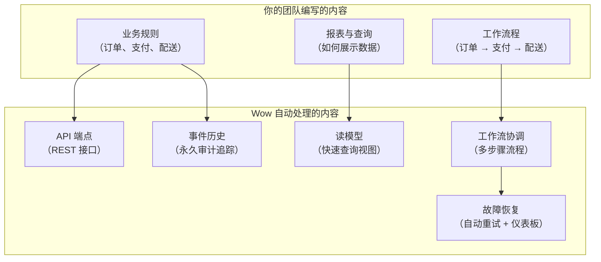
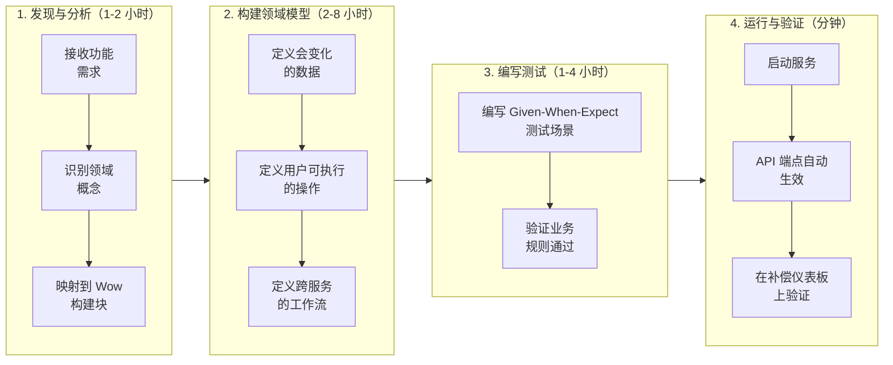
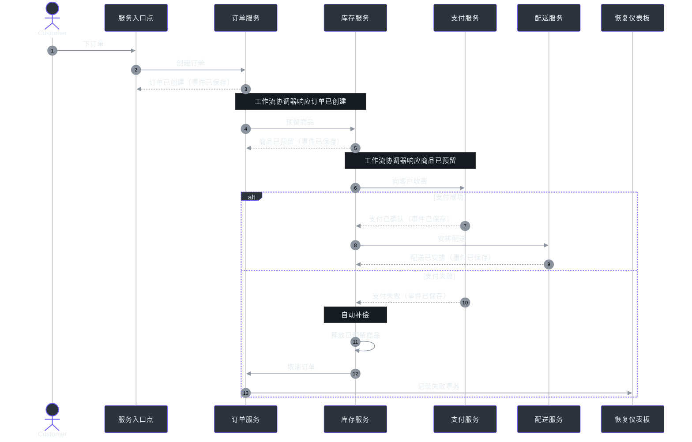
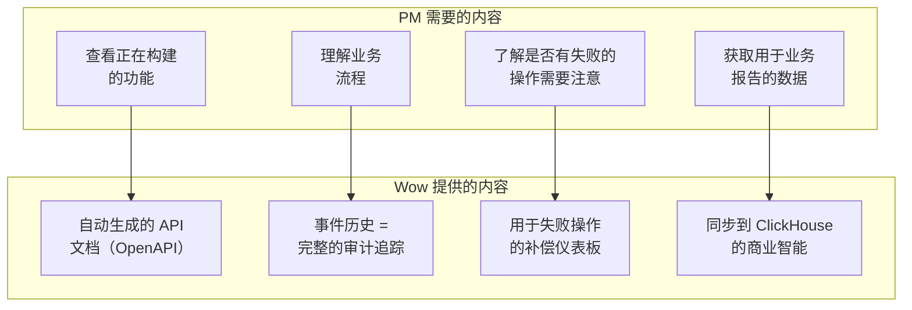
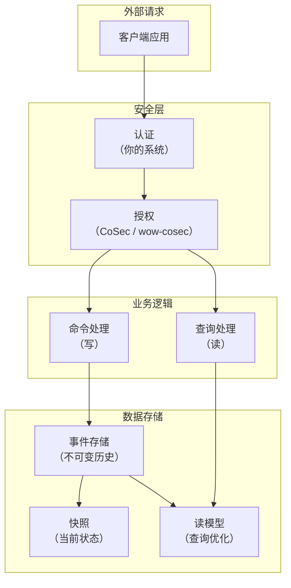

# Wow 框架产品经理指南

**受众**：产品经理、业务分析师、项目负责人以及任何非工程利益相关者。

本指南用平实的语言解释 Wow 框架的功能 -- 没有行话、没有代码、没有技术规范。阅读后，你将了解你的工程团队能用 Wow 构建什么、与传统方法相比开发工作流程如何变化，以及 Wow 在你的产品策略中的位置。

---

## 1. Wow 是什么？-- 用平实语言解释

把 Wow 想象成一个**用于构建业务软件的蓝图和施工工具包**。它处理确保数据始终正确、可追踪和可恢复的繁重工作，因此你的开发团队可以完全专注于你的业务规则。

以下是用日常语言表达的含义：

### Wow 解决的问题

设想你正在运营一个在线市场。客户下了订单。系统需要：

- 预留库存中的商品
- 向客户的支付方式收费
- 安排配送
- 发送确认电子邮件

在传统系统中，每一步都直接与数据库交互。如果支付步骤在库存已被预留后失败，你的库存就被"卡住了"。解决这个问题需要自定义代码、手动清理或数据补丁 -- 每一种都是 bug 和客户挫折的来源。

**Wow 自动处理所有这些。** 你的团队只需编写业务规则（"当库存被预留时，收取付款"），Wow 管理其余部分：追踪发生了什么、在失败时回滚、并为每个决策保留永久记录。

### 三个核心理念

| 理念 | 平实语言类比 | 这对你的产品意味着什么 |
|---|---|---|
| **事件溯源** | 银行对账单记录每一笔交易，而不仅仅是最终余额。你总能看出是如何到达那里的。 | 你的数据的每一次变更都保存为永久的记录。你可以重放历史以审计决策、调试问题或在任何时间点重建状态。 |
| **CQRS（命令查询职责分离）** | 餐厅厨房有分开的柜台用于接单（命令）和取餐（查询）。每个都为其用途优化。 | 进行变更的系统部分与显示数据的部分工作方式不同。这意味着即使在大量写负载下，你的仪表板也能闪电般快速，并且每侧可以独立扩展。 |
| **分布式事务（Saga）** | 旅行代理协调你的行程：订机票、预订酒店、租车。如果酒店满员，代理取消机票和租车 -- 而不是你。 | 当业务流程跨越多个服务（库存、支付、配送）时，Wow 自动协调整个工作流，并在出现故障时撤销步骤。无需手动清理。 |

### 你的团队实际交付什么

使用 Wow，你的开发团队**只编写业务领域** -- 你的产品所特有的概念（订单、支付、客户、发票）。然后框架会自动：

- 将这些业务概念转化为有效的 API 端点（其他系统调用的接口）
- 将每个业务决策保存为永久的、可审计的事件
- 以近实时的方式保持读模型（仪表板、报表）为最新
- 跨服务协调多步骤业务流程
- 提供用于监控和重试失败操作的可视化仪表板

<!-- Sources: [settings.gradle.kts:19-80](https://github.com/Ahoo-Wang/Wow/blob/main/settings.gradle.kts#L19-L80) (module structure), [wow-api/src/main/kotlin/me/ahoo/wow/api/Wow.kt:26-45](https://github.com/Ahoo-Wang/Wow/blob/main/wow-api/src/main/kotlin/me/ahoo/wow/api/Wow.kt#L26-L45) (core API contracts), guide/advanced/architecture.md (architecture overview), guide/saga.md (distributed transactions) -->

### 谁在使用 Wow

Wow 是为构建**关键业务微服务**的团队设计的 -- 在这些应用中，数据正确性、审计追踪以及从故障中恢复的能力是不可妥协的。典型用例包括：

| 行业 | 示例产品 | Wow 为何适合 |
|---|---|---|
| **电商** | 订单管理、购物车、支付处理 | 带失败时自动补偿的多步骤工作流（下单 → 支付 → 配送） |
| **金融 / 银行** | 账户转账、事务处理 | 每个状态变更的完整审计追踪；用于合规的时间点重建 |
| **物流 / 供应链** | 库存追踪、配送编排 | 跨服务协调，并在步骤失败时自动回滚 |
| **保险** | 理赔处理、保单管理 | 长时间运行的工作流，每个决策都必须可追踪和可审计 |
| **SaaS 平台** | 多租户订阅管理 | 内置租户隔离；用于基于角色的访问控制的授权框架 |

这些用例由 Wow 仓库中经过生产验证的示例项目说明：一个电商订单和购物车系统以及一个银行转账系统。
<!-- Source: [example/example-domain/src/main/kotlin/me/ahoo/wow/example/domain/order/](https://github.com/Ahoo-Wang/Wow/tree/main/example/example-domain/src/main/kotlin/me/ahoo/wow/example/domain/order/) (order domain example), [example/transfer/example-transfer-domain/src/main/java/me/ahoo/wow/example/transfer/domain/](https://github.com/Ahoo-Wang/Wow/tree/main/example/transfer/example-transfer-domain/src/main/java/me/ahoo/wow/example/transfer/domain/) (transfer saga example) -->

---

## 2. 用户旅程地图

### 旅程 A：开发者端到端构建新功能

这是最常见的旅程。产品需求到达，开发者使用 Wow 的约定构建功能。

<!-- Sources: [wow-test/src/main/kotlin/me/ahoo/wow/test/AggregateSpec.kt:69-108](https://github.com/Ahoo-Wang/Wow/blob/main/test/wow-test/src/main/kotlin/me/ahoo/wow/test/AggregateSpec.kt#L69-L108) (testing DSL), [wow-api/src/main/kotlin/me/ahoo/wow/api/annotation/OnCommand.kt:70-87](https://github.com/Ahoo-Wang/Wow/blob/main/wow-api/src/main/kotlin/me/ahoo/wow/api/annotation/OnCommand.kt#L70-L87) (command handlers), guide/modeling.md (domain modeling workflow), guide/test-suite.md (Given-When-Expect pattern) -->

**对 PM 的关键洞察**：测试阶段（阶段 3）集成到开发中，而不是事后补充。Wow 的测试工具让开发者在无需设置数据库或基础设施的情况下验证业务规则。这意味着你的验收标准可以直接作为单元测试进行验证，在 bug 到达手动 QA 之前就捕获它们。

### 旅程 B：系统处理分布式业务流程

这是运行时当客户触发多步骤操作时发生的情况（例如，下一个涉及库存、支付和配送的订单）。

<!-- Sources: [wow-core/src/main/kotlin/me/ahoo/wow/saga/stateless/StatelessSagaHandler.kt:36-43](https://github.com/Ahoo-Wang/Wow/blob/main/wow-core/src/main/kotlin/me/ahoo/wow/saga/stateless/StatelessSagaHandler.kt#L36-L43) (saga event routing), [compensation/wow-compensation-domain/src/main/kotlin/me/ahoo/wow/compensation/domain/ExecutionFailed.kt:37-138](https://github.com/Ahoo-Wang/Wow/blob/main/compensation/wow-compensation-domain/src/main/kotlin/me/ahoo/wow/compensation/domain/ExecutionFailed.kt#L37-L138) (compensation state machine), guide/saga.md (distributed transaction flow), guide/event-compensation.md (compensation mechanism) -->

**对 PM 的关键洞察**：如果此流程中的任何步骤失败，Wow 会自动撤销已成功执行的步骤（"补偿"）。失败的操作会出现在可视化仪表板上，你的运维团队可以在那里检查并在需要时手动重试。没有数据会卡在不一致的状态。

### 旅程 C：PM 使用 Wow 能力审查功能进度

作为 PM，你不需要理解代码如何工作。你通过 Wow 提供的能力与团队互动：

<!-- Sources: [wow-bi/src/main/kotlin/me/ahoo/wow/bi/](https://github.com/Ahoo-Wang/Wow/tree/main/wow-bi/src/main/kotlin/me/ahoo/wow/bi/) (BI module), [compensation/dashboard/src/](https://github.com/Ahoo-Wang/Wow/tree/main/compensation/dashboard/src/) (React dashboard), guide/advanced/architecture.md (auto-generated OpenAPI), guide/bi.md (BI module), guide/event-compensation.md (dashboard) -->

---

## 3. 功能能力图谱

### Wow 能实现什么

下表用平实语言描述了每项主要能力、它提供的业务价值以及在哪里了解更多信息。

| 能力 | 平实语言描述 | 业务价值 | 了解更多 |
|---|---|---|---|
| **永久审计追踪** | 你的数据的每一次变更都保存为不可变的历史记录。你可以重放整个历史来查看确切发生了什么以及何时发生。 | 监管合规、客户争议解决、生产问题的法证调试。即时回答"这个订单为什么是这个状态？"。 | [事件溯源](../guide/eventstore.md) |
| **自动 API 端点** | 当你的团队定义一个业务概念（如订单）时，Wow 自动创建用于创建、更新和查询它的 REST API。无需手动 API 接线。 | 显著加快功能交付速度。跨所有服务保持一致的 API 设计。API 文档始终是最新的。 | [聚合建模](../guide/modeling.md) |
| **分布式事务协调** | 当业务流程跨越多个服务时（订单 → 库存 → 支付 → 配送），Wow 协调整个流程并在出现故障时自动撤销步骤。 | 可靠的多步骤流程，无需自定义错误处理代码。运维团队可以从仪表板监控和重试失败的流程。 | [Saga 事务](../guide/saga.md) |
| **自动故障恢复** | 如果业务流程中的某一步失败（网络抖动、下游服务宕机），Wow 会自动以递增的延迟重试。失败的操作出现在可视化仪表板上。 | 无因瞬时错误而丢失的业务操作。运维团队获得故障可见性，并可在自动重试耗尽时手动干预。 | [事件补偿](../guide/event-compensation.md) |
| **分离读写模型** | 针对变更优化的数据结构与针对展示数据优化的数据结构不同。Wow 自动维护两者，通过事件保持同步。 | 即使在大量写负载下也能快速显示仪表板和报表。每侧可以独立扩展。查询性能不会降低写吞吐量。 | [投影处理器](../guide/projection.md) |
| **商业智能管线** | Wow 可以将每个业务状态变更直接流式传输到数据仓库（如 ClickHouse）。BI 工具自动生成脚本来设置此功能。 | 无需构建自定义 ETL 管线即可实现实时业务仪表板。业务分析师可以访问完整的聚合状态历史以进行趋势分析。 | [商业智能](../guide/bi.md) |
| **可视化监控仪表板** | 一个基于 Web 的仪表板（使用 React / Ant Design 构建）显示每个失败的业务操作，让你的团队可以重试、修改重试时间，并将问题标记为已解决。 | 无需查询数据库或阅读日志即可获得运维可见性。非工程师可以监控业务流程的健康状况。 | [补偿仪表板](../guide/event-compensation.md) |
| **时间点状态重建** | 你可以要求系统向你展示任何业务对象在过去任何时间点的状态 -- 不仅仅是"当前是什么状态"，而是"上周二下午 3:14 的状态是什么"。 | 审计与合规。客服支持可以看到客户在特定时刻看到的确切内容。欺诈调查团队可以追踪状态随时间的变化。 | [事件存储](../guide/eventstore.md) |
| **内置测试框架** | 开发者使用平实的业务场景编写测试（"给定一个空购物车，当我添加一个商品，期望购物车有一个商品"）。 | PM 可以将测试场景作为验收标准进行审查。更高的测试覆盖率意味着更少的生产缺陷。团队报告与传统方法相比缺陷显著减少。 | [测试指南](../guide/test-suite.md) |
| **授权和访问控制** | Wow 包含一个可插拔的授权框架（`wow-cosec`），控制谁可以发送哪些命令和查看哪些数据。多租户隔离是内置的。 | 安全要求在框架层面满足，而非自定义的每个服务实现。SaaS 产品的多租户支持。 | [CoSec 文档](https://github.com/Ahoo-Wang/CoSec) |
| **可观测性和监控** | 内置与行业标准监控工具（OpenTelemetry）的集成。每个命令和事件被端到端追踪。 | 性能监控。识别业务流程中的瓶颈。业务操作的服务水平协议（SLA）追踪。 | [架构概述](../guide/advanced/architecture.md) |

### 技术支持矩阵

Wow 与你现有的基础设施集成。你的团队可以选择适合你环境的存储、消息和搜索后端：

| 能力 | 可用选项 | 备注 |
|---|---|---|
| **事件存储**（审计追踪所在） | MongoDB、Redis、Elasticsearch | 根据你现有的基础设施和访问模式选择。 |
| **消息传输**（服务间通信方式） | Apache Kafka | 用于在服务之间分发事件和命令。 |
| **查询 / 搜索**（数据如何展示给用户） | MongoDB、Elasticsearch | 用于快速查询的优化读模型。 |
| **快照存储**（性能优化） | MongoDB、Redis、Elasticsearch | 加速频繁访问对象的聚合状态加载。 |
| **可观测性** | OpenTelemetry（追踪、指标、日志） | 与 Jaeger、Zipkin、Prometheus、Grafana 及其他 OpenTelemetry 兼容工具集成。 |
| **ID 生成** | CosId（雪花算法、号段模式） | 每个业务对象具有全局唯一 ID。跨服务无冲突。 |
| **数据仓库** | ClickHouse（通过 `wow-bi` 模块） | 用于商业智能的自动生成 ETL 脚本。 |

此矩阵反映了 Wow 可插拔扩展架构支持的全部后端范围。每个后端在单独模块中实现，因此你的团队可以只包含你需要的部分。
<!-- Source: [settings.gradle.kts:19-80](https://github.com/Ahoo-Wang/Wow/blob/main/settings.gradle.kts#L19-L80) (all module definitions) -->

---

## 4. 已知局限性

每项技术都涉及权衡。以下是对 Wow 能做和不能处理的坦诚审视，以便你能就它在你产品策略中的位置做出明智的决策。

### Wow 不做什么

| 领域 | 不包含 | 为什么 / 改用替代方案 |
|---|---|---|
| **用户界面** | Wow 没有内置的 UI 框架或前端组件。（补偿仪表板是一个独立的 React 应用，不是通用 UI 工具包。） | 使用任何前端框架（React、Vue、Angular）与 Wow 自动生成的 REST API。补偿仪表板使用 React + Ant Design 构建，作为一个示例。 |
| **用户认证** | Wow 不处理用户登录、密码或会话管理。 | 使用你现有的认证系统（OAuth2、SAML、LDAP）。Wow 与 Spring Security 集成进行授权检查。 |
| **文件存储 / Blob 存储** | Wow 不存储文件、图片或文档。它存储业务事件记录，不是二进制内容。 | 使用云对象存储（AWS S3、Azure Blob、MinIO）并在 Wow 聚合中引用文件 ID。 |
| **电子邮件 / 短信 / 推送通知** | Wow 不发送通知。它产生事件，通知服务可以监听这些事件。 | 构建一个单独的通知服务，订阅 Wow 事件（例如，"OrderShipped"触发一个"向客户发送电子邮件"步骤）。 |
| **实时 WebSocket / 流式推送到浏览器** | Wow 不向浏览器客户端推送实时更新。它专注于后端业务逻辑。 | 使用 WebSocket 网关或 Server-Sent Events 层，订阅 Wow 事件并将其转发给客户端。 |
| **图数据库 / 复杂关系查询** | Wow 不提供用于深度嵌套关系的图遍历引擎。 | 使用专用图数据库或为关系密集型用例构建自定义投影查询。 |
| **定时任务 / Cron** | Wow 的补偿调度器重试失败的操作；它不是通用作业调度器。 | 使用专用调度器（Quartz、Kubernetes CronJobs、云调度器服务）执行与补偿无关的周期性任务。 |
| **GDPR 数据擦除** | 由于 Wow 使用事件溯源（不可变事件历史），你不能简单地删除一行来擦除数据。 | 实现加密擦除：使用每个用户的密钥对个人身份信息进行加密，在收到删除请求时删除密钥。这使加密数据不可读。 |
| **遗留系统同步** | Wow 不提供开箱即用的与遗留系统的双向同步。 | 构建防腐层，在遗留系统的数据格式和 Wow 的事件驱动模型之间进行转换。 |

### 架构权衡

这些本身不是限制，而是影响计划的事件驱动方法的特性：

| 特性 | 含义 | 缓解措施 |
|---|---|---|
| **最终一致性** | 命令处理后，读模型（仪表板、报表）可能需要几毫秒才能更新。用户可能短暂看到过时数据。 | Wow 的"等待计划"让你选择客户端等待多长时间。对于需要立即写后读的用例，`PROJECTED` 等待模式确保在响应之前读模型已更新。 |
| **事件存储增长** | 每个业务变更被永久保存。经过多年，事件存储会变得很大，增加存储成本。 | Wow 的快照机制保持频繁访问的聚合快速。将较旧的事件归档到冷存储。存储相对于审计数据的价值来说是便宜的。 |
| **学习曲线** | 事件驱动的思维模型与传统 CRUD 不同。开发者需要学习以事件而非数据库行的方式思考。 | Wow 项目模板提供了一个可工作的示例。测试框架降低了业务规则实现不正确的风险。大多数团队在 2-4 周内变得高效。 |
| **不适合简单 CRUD** | 对于只需要存储和检索数据且没有业务逻辑的应用，Wow 是小题大做。 | 简单 CRUD 应用更适合传统框架。Wow 是为具有有意义业务规则和多步骤流程的应用设计的。 |

---

## 5. 数据与隐私概述

本节解释 Wow 处理哪些数据、数据存储在哪里，以及你需要了解的有关隐私和合规的内容。

### Wow 管理什么数据

| 数据类别 | 包含内容 | 存储位置 | 保留 |
|---|---|---|---|
| **领域事件** | 每个业务决策的记录："订单 #1234 由客户 A 于下午 3:14 创建。"包含变更的完整上下文和原因。 | 已配置的事件存储（MongoDB、Redis、Elasticsearch 等） | 默认永久；可配置的保留策略 |
| **聚合快照** | 每个业务对象当前状态的压缩摘要，定期创建以加速加载。 | 已配置的快照存储（与事件存储选项相同） | 每次新快照时替换；旧快照可修剪 |
| **读模型** | 用于快速查询的业务数据优化表示。例如，仓库团队的"待处理订单"视图。 | Elasticsearch 或 MongoDB | 随着事件在系统中流动以近实时方式更新 |
| **补偿记录** | 每个失败业务操作的详情：什么失败、何时失败、重试多少次的尝试以及当前状态。 | 与领域事件相同的事件存储 | 历史记录；已解决的条目可清除 |
| **命令消息** | 触发业务操作的初始请求。包含意图（如"下订单"）和提交的数据。 | 通过消息总线传递；默认不持久存储 | 瞬时；通过可观测性工具记录 |

### 隐私与合规考虑

**多租户**：Wow 为租户隔离提供内置支持。每片数据都带有租户标识符标签，确保客户 A 的数据对客户 B 永远不可见。这对于服务多个组织的 SaaS 产品至关重要。

**数据驻留**：由于你选择在哪里部署每个存储后端（事件存储、快照存储、读模型存储），你控制数据物理上驻留在哪里。将 Wow 服务部署在满足你合规要求的地理区域。

**用于合规的审计追踪**：永久事件历史直接支持合规要求，例如：

- **SOC 2**：每个数据变更的完整记录，带有时间戳和上下文
- **PCI DSS**：可追踪的支付状态转换
- **HIPAA**：健康相关数据的可审计访问和修改（配合适当的静态加密）
- **GDPR**：关于数据擦除见下文说明

**GDPR 擦除权**：由于事件溯源创建不可变的历史，你不能简单地从数据库删除行来满足删除请求。推荐的方法是**加密擦除**：使用特定于客户的密钥加密个人身份数据，当删除请求到达时，删除加密密钥。加密数据变为永久不可读，同时保持事件历史的完整性。

**数据最小化**：设计你的领域事件时，只包含与业务相关的信息。除非对业务流程至关重要，否则避免在事件存储中存储个人身份信息（姓名、电子邮件地址、IP 地址）。通过 ID 引用客户资料，而不是在每个事件中嵌入完整的个人详细信息。

### 安全架构

<!-- Sources: [settings.gradle.kts:39](https://github.com/Ahoo-Wang/Wow/blob/main/settings.gradle.kts#L39) (wow-cosec module), [wow-cosec/src/main/kotlin/me/ahoo/wow/cosec/](https://github.com/Ahoo-Wang/Wow/tree/main/wow-cosec/src/main/kotlin/me/ahoo/wow/cosec/) (authorization framework), guide/advanced/architecture.md (security layer), guide/saga.md (multi-tenancy) -->

**关键点**：认证（证明你是谁）由你现有的系统处理。授权（你被允许做什么）可以使用 Wow 内置的 `wow-cosec` 模块在命令和查询级别实现细粒度、基于策略的访问控制。

---

## 6. 常见问题解答

### 通用

**问：Wow 是一个产品还是一个框架？**

答：Wow 是一个开源框架（Apache 2.0 许可证）。它是你的开发团队用来创建业务软件的一组构建块。不是你可以订阅的 SaaS 产品。没有许可费用或使用限制。

**问：Wow 使用什么编程语言？**

答：Wow 使用 Kotlin 编写，运行在 Java 虚拟机（JVM）上。你的开发团队需要 Kotlin 或 Java 专业知识。主要示例应用同时提供了 Kotlin 和 Java 版本，以证明两种语言都可以使用。

**问：我们可以增量采用 Wow 吗，还是需要重写现有系统？**

答：增量采用是推荐的方法。Wow 服务可以与你现有系统共存。从一个新的限界上下文（一个自包含的业务领域）开始，让 Wow 服务通过标准 REST API 或事件流与你现有服务交互。你不需要一次性重写所有内容。

**问：Wow 与其他框架（如 Axon 框架）相比如何？**

答：Wow 和 Axon 都是 JVM 的 CQRS + 事件溯源框架。关键区别：Wow 基于响应式编程（非阻塞 I/O），使用编译时代码生成来避免运行时反射开销，提供内置的补偿仪表板，并与 Co 生态系统深度集成（CosId 用于 ID、CoCache 用于缓存、CoSec 用于安全）。Axon 有更长的历史和更大的社区。你的工程团队可以根据你的具体要求评估两者。

**问：Wow 适合小型项目吗，还是小题大做？**

答：Wow 是为具有有意义业务规则和多步骤流程的应用设计的。对于简单的 CRUD 应用（存储和检索数据，没有业务逻辑），Wow 会增加不必要的复杂性。一个好的经验法则：如果你的业务流程有超过两个必须全部成功或全部失败的步骤，Wow 的 Saga 和补偿功能会带来真正的价值。

### 开发流程

**问：新开发者需要多长时间才能用 Wow 高效工作？**

答：团队通常报告 2 到 4 周变得高效。学习曲线在于事件驱动的思维模型，而不是框架本身。提供的项目模板和示例应用显著加速入门过程。

**问：作为 PM，我如何审查已构建的内容？**

答：有多种方式：
- **自动生成的 API 文档**：Wow 自动生成最新的 OpenAPI 规范。你可以通过 Swagger UI 或其他 API 文档工具查看所有可用端点。
- **作为验收标准的测试场景**：Wow 的 Given-When-Expect 测试模式读起来像平实的业务场景。请你的开发者分享测试文件 -- 它们精确展示了哪些业务规则被强制执行。
- **补偿仪表板**：显示所有失败的业务操作及其当前状态。干净的仪表板意味着你的业务流程是健康的。

**问：Wow 团队如何估算功能工作？**

答：由于 Wow 消除了大量基础设施代码（API 接线、事件持久化、消息路由），大部分开发时间用于：
- 定义领域模型（存在哪些概念以及它们如何关联）-- PM 的主要协作领域
- 将业务规则编写为测试场景 -- PM 可以审查和批准这些
- 配置补偿和重试行为 -- PM 应定义重试时间的业务期望

使用 Wow 的团队通常比使用传统框架更快地交付功能，因为基础设施是自动处理的。

### 运维和可靠性

**问：当出现问题时会发生什么？**

答：Wow 有多层故障处理：

| 层级 | 机制 | 示例 |
|---|---|---|
| **即时重试** | 以可配置次数自动重试失败的处理器 | 网络超时 → 重试 3 次 |
| **补偿** | 将失败记录为持久事件，并按指数退避重试 | 下游服务宕机 → 每 1 分钟、2 分钟、4 分钟重试，最多到最大尝试次数 |
| **人工干预** | 失败的操作出现在补偿仪表板上供人工审查 | 所有自动重试已耗尽 → 操作者检查并手动重试或标记为已解决 |

**问：我们可以监控业务流程的健康状况吗？**

答：可以。Wow 与 OpenTelemetry 集成，这意味着它与标准监控工具（Grafana、Jaeger、Prometheus、Datadog 等）兼容。你可以创建显示以下内容的仪表板：
- 每分钟创建的订单数
- 从下单到配送的平均时间
- 失败支付交易的数量
- 补偿重试成功率

补偿仪表板还提供失败操作的专用视图，非工程人员也可以查看。

**问：事件存储会积累多少数据？**

答：这取决于你的业务量。粗略估计，每个业务操作生成一个或多个事件记录，每个记录通常 1-5 KB。对于每天处理 100,000 个订单、每个订单平均 5 个事件的系统，你每天将积累大约 500 MB，或每年大约 180 GB。Wow 的快照机制保持频繁访问的对象快速，无论事件历史总大小如何。

**问：如果数据库空间不足会怎样？**

答：事件存储后端（MongoDB、Redis、Elasticsearch）有自己的扩展机制。你还可以将较旧的事件归档到冷存储（对象存储、数据仓库）并配置保留策略。关键洞察：事件是仅追加的，所以写路径永远不会因数据量而减慢 -- 只有历史查询的读路径受到影响，而快照缓解了这一点。

---

## 7. 产品经理如何做出贡献

你不需要编写代码就能成为 Wow 项目的有价值贡献者。以下是你的技能能产生最大影响的方面：

### 1. 领域建模会议

**是什么**：PM 和开发者协作定义系统需要表示的业务概念的协作会议。

**你的角色**：你拥有业务领域知识。描述概念（订单、支付、配送）、它们的关系以及管理它们的规则。开发者将这些翻译成 Wow 的聚合、命令和事件。

**领域建模会议的示例议程**：

| 活动 | PM 贡献 | 开发者行动 |
|---|---|---|
| 识别核心业务对象 | "我们的系统有订单、订单项、产品和配送。" | 定义聚合根及其边界 |
| 定义用户可以采取的操作 | "客户可以下订单、取消订单或修改订单项。" | 定义命令 |
| 列出业务规则 | "订单只有在未配送时才能取消。超过 $50 的订单免运费。" | 实现业务规则验证 |
| 梳理跨服务工作流 | "在下单时：(1) 预留库存，(2) 收取付款，(3) 配送。如果付款失败，释放库存。" | 定义 Saga 协调 |

### 2. 审查测试场景

**是什么**：Wow 的测试框架使用描述业务行为的平实语言场景。

**你的角色**：审查你的开发者编写的 Given-When-Expect 测试场景，验证它们是否匹配你的产品需求。

**需要关注的内容**：
- 每个场景是否覆盖了一个真实的用户操作？
- 业务规则是否被正确强制执行？
- 是否覆盖了边缘情况（库存不足时发生什么、付款失败时发生什么等）？

测试文件成为你业务规则的活文档。如果缺少某个场景，要求添加它。

### 3. 定义补偿和重试策略

**是什么**：当业务流程步骤失败时，Wow 重试它。你定义重试应该多积极。

**你的角色**：回答决定重试配置的业务问题：

| 业务问题 | 重试配置 | 示例 |
|---|---|---|
| 在放弃之前我们应该持续尝试多久？ | `maxRetries` | 支付授权：尝试 5 次，跨越数小时。库存预留：尝试 3 次，跨越数分钟。 |
| 重试应该多快发生？ | `minBackoff`（初始延迟，每次加倍） | 面向客户的操作：从 30 秒开始。后台批处理：从 5 分钟开始。 |
| 我们应该重试哪些错误？ | `recoverable` / `unrecoverable` 异常 | 网络超时时重试，不要对"产品已停产"重试。 |
| 单次重试应该在多长时间内超时？ | `executionTimeout` | 简单操作：10 秒。外部 API 调用：60 秒。 |

### 4. 对补偿仪表板提供反馈

**是什么**：用于监控和管理失败操作的可视化仪表板。

**你的角色**：使用仪表板来理解你的产品的运维健康状况，并对什么信息最有用提供反馈：

- 状态标签对非工程师来说是否清晰？
- 什么过滤器或视图对你的运维团队有帮助？
- 通知事件（可以发送到企业微信或其他消息平台的通知）是否提供了正确的信息？

### 5. 定义商业智能需求

**是什么**：Wow 可以将业务数据流式传输到分析平台以生成报表和仪表板。

**你的角色**：定义哪些业务指标重要、你需要什么仪表板以及你需要回答什么问题：

- 每日订单量趋势是什么？
- 从下单到配送的平均时间是多少？
- 哪些产品的取消率最高？
- 按支付方式的支付失败率是多少？

`wow-bi` 模块可以从你的团队已定义的业务模型自动生成数据管线脚本。你的输入确保正确的数据到达正确的人。

### 6. 参与开源社区

Wow 是一个在 GitHub 上维护的开源项目（Apache 2.0 许可证）。PM 可以以非代码方式做出贡献：

- **功能请求**：创建描述 Wow 尚不支持的商业场景的 GitHub Issue
- **文档改进**：根据你的入门经验对文档（包括本指南）提出澄清建议
- **用例分享**：分享你的团队如何使用 Wow，以便他人能从你的经验中学习
- **社区参与**：参与有关项目方向和优先级的讨论

---

## 总结

Wow 框架让你的开发团队可以专注于使你的产品独特的东西 -- 业务规则 -- 而它处理数据持久化、事件路由、API 生成、工作流协调和故障恢复等基础设施关注点。

对 PM 来说，关键收获是：

1. **更快的功能交付**：基础设施是自动的。开发者构建业务逻辑和测试。
2. **完整审计追踪**：每个业务决策都被永久记录。合规和调试是内置的。
3. **自动故障处理**：多步骤流程被协调，失败的步骤被自动重试，带有人工监督的可视化仪表板。
4. **你扮演关键角色**：领域建模、测试场景审查、重试策略定义和 BI 需求都是 PM 输入直接塑造产品的领域。
5. **开源，无锁定**：Apache 2.0 许可证，无费用。与你现有的基础设施集成。

---

## 相关页面

| 页面 | 描述 |
|---|---|
| [入门指南](../guide/getting-started.md) | 开发者入门 -- 项目设置、依赖、构建命令 |
| [架构概述](../guide/advanced/architecture.md) | Wow 分层架构和模块结构的深入探讨 |
| [领域建模](../guide/modeling.md) | 如何设计聚合根、命令和事件 |
| [Saga 事务](../guide/saga.md) | 跨服务的分布式事务协调 |
| [事件补偿](../guide/event-compensation.md) | 自动故障恢复和可视化补偿仪表板 |
| [商业智能](../guide/bi.md) | 将业务数据流式传输到数据仓库进行分析 |
| [测试指南](../guide/test-suite.md) | 用于业务规则验证的 Given-When-Expect 测试模式 |
| [投影处理器](../guide/projection.md) | 读模型如何构建和保持更新 |
| [配置参考](../reference/config/core.md) | 自定义 Wow 行为的所有配置属性 |
| [示例：订单领域](../reference/example/order.md) | 使用 Wow 构建的电商订单系统可工作示例 |
| [示例：银行转账](../reference/example/transfer.md) | 使用 Wow 构建的金融转账系统可工作示例 |
