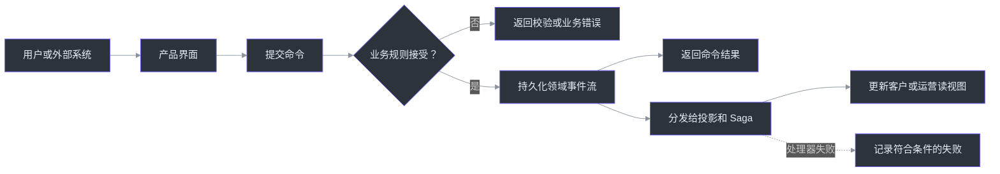
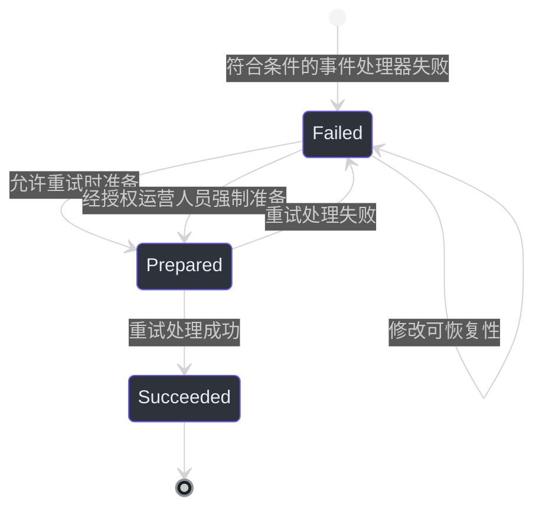
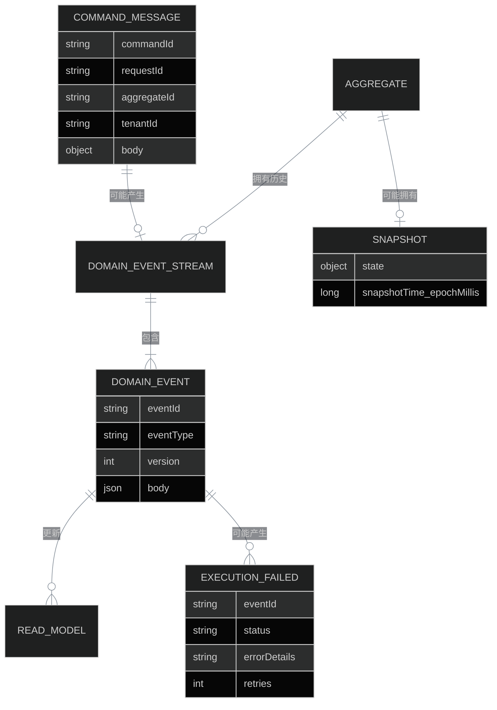

# 产品经理指南

## 目的与证据基线

本指南用产品语言解释 Wow：用户可以做什么、它可以支持哪些产品流程、会处理
哪些数据，以及哪些决策仍然属于应用团队。

目标读者包括产品经理、交付负责人、业务分析师、设计师、客户支持负责人以及
评估 Wow 应用的工程合作伙伴。

证据基线为 Wow 仓库的 `main` 分支。

Wow 将自身定义为响应式 CQRS 与 Event Sourcing 框架。它是用于构建应用的
工具箱，不是现成的客户产品、托管平台或产品发现的替代品。

当前仓库版本为 `8.10.8`。

来源：

- [README.md:7-9](https://github.com/Ahoo-Wang/Wow/blob/main/README.md#L7-L9)
- [gradle.properties:21-29](https://github.com/Ahoo-Wang/Wow/blob/main/gradle.properties#L21-L29)

## Wow 帮助解决什么问题？

很多业务系统需要的不只是数据库中最新的一行数据。

它们可能需要知道哪个请求改变了订单、重建账户如何到达当前状态、更新多个
读视图，或在临时故障后恢复异步处理器。

Wow 为这些需求提供工程构件：

- **命令（Command）** 表达用户或系统希望执行的动作。
- **聚合（Aggregate）** 在一个一致性边界内检查业务规则。
- **领域事件（Domain Event）** 记录已经发生的事情。
- **事件流（Event Stream）** 按顺序组合一个命令产生的事件。
- **快照（Snapshot）** 保存当前状态检查点，以加快加载。
- **投影（Projection）** 更新为读取或搜索优化的视图。
- **Saga** 响应事件并协调较长的工作流。
- **补偿记录** 让选定事件处理器的失败可见并可重试。

这些概念能让行为和历史更明确，也会增加必须设计的产品与运营状态：待处理、
读视图延迟、处理失败、重试、重放和数据保留。

来源：

- [CommandMessage.kt:53-125](https://github.com/Ahoo-Wang/Wow/blob/main/wow-api/src/main/kotlin/me/ahoo/wow/api/command/CommandMessage.kt#L53-L125)
- [DomainEventStream.kt:31-56](https://github.com/Ahoo-Wang/Wow/blob/main/wow-core/src/main/kotlin/me/ahoo/wow/event/DomainEventStream.kt#L31-L56)
- [Snapshot.kt:19-40](https://github.com/Ahoo-Wang/Wow/blob/main/wow-core/src/main/kotlin/me/ahoo/wow/eventsourcing/snapshot/Snapshot.kt#L19-L40)

## 产品边界

Wow 可以提供框架行为和技术端点。

采用方仍需定义：

- 客户体验和运营体验。
- 业务命令及其校验规则。
- 事件名称、含义和兼容性。
- 客户可以看到哪些读模型。
- 对用户而言，“完成”“处理中”“失败”和“已恢复”分别意味着什么。
- 认证、授权、限流和运营角色。
- 服务等级、支持承诺和升级路径。
- 数据分类、保留、删除和驻留政策。
- 产品路线图和交付日期。

仓库没有声明这些应用特定选择。

## 主要用户旅程

正常旅程从应用请求开始。聚合校验请求，接受的变化成为事件，下游处理器据此
更新其他视图或工作流。

```mermaid
%%{init: {"theme": "dark", "themeVariables": {"primaryColor": "#2d333b", "primaryBorderColor": "#6d5dfc", "primaryTextColor": "#e6edf3", "lineColor": "#8b949e", "secondaryColor": "#161b22", "secondaryBorderColor": "#30363d", "tertiaryColor": "#161b22", "clusterBkg": "#161b22", "clusterBorder": "#30363d"}}}%%
flowchart LR
    U["用户或外部系统"] --> UI["产品界面"]
    UI --> C["提交命令"]
    C --> A{"业务规则接受？"}
    A -->|"否"| E["返回校验或业务错误"]
    A -->|"是"| EV["持久化领域事件流"]
    EV --> ACK["返回命令结果"]
    EV --> H["分发给投影和 Saga"]
    H --> R["更新客户或运营读视图"]
    H -. "处理器失败" .-> F["记录符合条件的失败"]
    classDef journey fill:#2d333b,stroke:#6d5dfc,color:#e6edf3
    classDef boundary fill:#161b22,stroke:#30363d,color:#e6edf3
    class U,UI,C,A,E,EV,ACK,H,R,F journey
    linkStyle default stroke:#8b949e
```

<!-- Sources: [CommandMessage.kt:53-125](https://github.com/Ahoo-Wang/Wow/blob/main/wow-api/src/main/kotlin/me/ahoo/wow/api/command/CommandMessage.kt#L53-L125), [DomainEventStream.kt:31-56](https://github.com/Ahoo-Wang/Wow/blob/main/wow-core/src/main/kotlin/me/ahoo/wow/event/DomainEventStream.kt#L31-L56), [CompensationFilter.kt:58-119](https://github.com/Ahoo-Wang/Wow/blob/main/compensation/wow-compensation-core/src/main/kotlin/me/ahoo/wow/compensation/core/CompensationFilter.kt#L58-L119) -->

### 这段旅程中的产品决策

1. 产品是等待处理结果，还是先确认已接收？
2. 哪些失败需要立即向用户展示？
3. 命令接受后，读视图是否允许暂时落后？
4. 什么文案可以解释“处理中”，又不会让用户以为数据丢失？
5. 支持人员可以安全查看哪个关联标识或请求标识？
6. 哪些操作允许客户在界面上安全重试？
7. 哪些流程必须进入人工审核？

Wow 提供统一命令提交路由；单独的 wait 路由只接收 `SimpleWaitSignal` 通知，
不负责提交命令。应用仍需决定合适的交互模式。

来源：

- [BuiltInHttpRoutes.kt:18-25](https://github.com/Ahoo-Wang/Wow/blob/main/wow-openapi/src/main/kotlin/me/ahoo/wow/openapi/contract/BuiltInHttpRoutes.kt#L18-L25)
- [CommandWaitRouteContributor.kt:31-65](https://github.com/Ahoo-Wang/Wow/blob/main/wow-openapi/src/main/kotlin/me/ahoo/wow/openapi/contributor/global/CommandWaitRouteContributor.kt#L31-L65)
- [CommandWaitHandlerFunction.kt:32-44](https://github.com/Ahoo-Wang/Wow/blob/main/wow-webflux/src/main/kotlin/me/ahoo/wow/webflux/wait/CommandWaitHandlerFunction.kt#L32-L44)
- [CommandFacadeRouteContributor.kt:30-55](https://github.com/Ahoo-Wang/Wow/blob/main/wow-openapi/src/main/kotlin/me/ahoo/wow/openapi/contributor/global/CommandFacadeRouteContributor.kt#L30-L55)
- [CommandFacadeHandlerFunction.kt:35-52](https://github.com/Ahoo-Wang/Wow/blob/main/wow-webflux/src/main/kotlin/me/ahoo/wow/webflux/route/command/CommandFacadeHandlerFunction.kt#L35-L52)

## 失败恢复旅程

补偿子系统记录选定事件处理路径中的失败。运营人员可以查看记录、调整重试
参数、修改受支持的函数引用、标记可恢复性、准备重试或强制准备。

它不会撤销原命令，也不会自动或无条件恢复业务一致性。重试会再次执行符合条件
的事件处理；如果应用没有实现安全重复，外部副作用可能再次发生。

```mermaid
%%{init: {"theme": "dark", "themeVariables": {"primaryColor": "#2d333b", "primaryBorderColor": "#6d5dfc", "primaryTextColor": "#e6edf3", "lineColor": "#8b949e", "secondaryColor": "#161b22", "secondaryBorderColor": "#30363d", "tertiaryColor": "#161b22", "clusterBkg": "#161b22", "clusterBorder": "#30363d"}}}%%
stateDiagram-v2
    [*] --> Failed: 符合条件的事件处理器失败
    Failed --> Prepared: 允许重试时准备
    Failed --> Prepared: 经授权运营人员强制准备
    Prepared --> Succeeded: 重试处理成功
    Prepared --> Failed: 重试处理失败
    Failed --> Failed: 修改重试参数或函数
    Failed --> Failed: 修改可恢复性
    Succeeded --> [*]
    classDef status fill:#2d333b,stroke:#6d5dfc,color:#e6edf3
    class Failed,Prepared,Succeeded status
```

<!-- Sources: [ExecutionFailedState.kt:65-99](https://github.com/Ahoo-Wang/Wow/blob/main/compensation/wow-compensation-domain/src/main/kotlin/me/ahoo/wow/compensation/domain/ExecutionFailedState.kt#L65-L99), [Actions.tsx:32-105](https://github.com/Ahoo-Wang/Wow/blob/main/compensation/dashboard/src/features/Failed/Actions.tsx#L32-L105), [ChangeFunction.tsx:28-123](https://github.com/Ahoo-Wang/Wow/blob/main/compensation/dashboard/src/features/Failed/ChangeFunction.tsx#L28-L123) -->

### 运营人员旅程

1. 打开 To Retry、Executing、Next Retry、NonRetryable、Succeeded 或
   Unrecoverable 等失败分类。
2. 按记录、事件、聚合、上下文或函数信息筛选。
3. 检查错误详情、事件标识、租户、聚合、重试政策和可恢复性。
4. 根据涉及的业务副作用判断重试是否安全。
5. 在允许时，通过授权流程准备记录或强制准备。
6. 观察重试是回到 Failed，还是到达 Succeeded。
7. 升级处理无法安全自动恢复的记录。

Dashboard 当前提供这些分类和操作。仓库没有声明运营角色模型、审批工作流、
审计保留期或响应时间目标。

来源：

- [routes/constants.tsx:18-71](https://github.com/Ahoo-Wang/Wow/blob/main/compensation/dashboard/src/routes/constants.tsx#L18-L71)
- [FailedSearch.tsx:24-95](https://github.com/Ahoo-Wang/Wow/blob/main/compensation/dashboard/src/features/Failed/FailedSearch.tsx#L24-L95)
- [FailedDetails.tsx:29-223](https://github.com/Ahoo-Wang/Wow/blob/main/compensation/dashboard/src/features/Failed/details/FailedDetails.tsx#L29-L223)

## 产品能力地图

这里的“已上线”仅表示仓库存在实现，不表示每个采用方应用都已启用、运营或
承诺支持该能力。

| 产品需求 | Wow 能力 | 状态 | 用户可能感知的结果 | 限制 |
| --- | --- | --- | --- | --- |
| 表达意图 | 命令 | 已上线 | 提交具名业务动作 | 应用定义文案、校验和权限 |
| 保留历史 | 领域事件和事件流 | 已上线 | 支持人员可追踪状态如何变化 | 应用决定哪些数据可长期保存 |
| 加载当前状态 | 状态重建和快照 | 已上线 | 可加载当前业务状态 | 应用定义新鲜度和错误体验 |
| 构建查询视图 | 投影 | 已上线 | 可构建面向任务的列表和搜索 | 必要时由应用解释更新延迟 |
| 协调工作流 | Saga | 已上线 | 多步骤流程可以响应事件 | 应用定义等待、超时和取消状态 |
| 路由消息 | Kafka、Redis、内存或 No-op 总线 | 已上线 | 通常对用户不可见 | 保证与故障行为取决于选项 |
| 路由存储 | 按模型选择事件与快照存储 | 已上线 | 不同领域可使用不同后端 | 迁移与支持复杂度由采用方负责 |
| 通过 HTTP 提交 | 内置命令路由 | 已上线 | 产品或集成客户端可发送动作 | 端点需要本地保护和客户端错误设计 |
| 查看元数据 | 元数据端点 | 已上线 | 工具可发现已注册模型 | 暴露决策由采用方负责 |
| 生成全局 ID | ID 端点 | 已上线 | 客户端可请求文本标识 | 信任边界和可用性要求由采用方负责 |
| 运营失败 | 补偿服务和 Dashboard | 已上线 | 运营人员查看并重试选定失败 | 历史视图不完整；未提供角色与安全重试政策 |
| 描述端点 | OpenAPI 集成 | 已上线 | 客户端工具可读取 API 描述 | 版本与生成客户端治理由采用方负责 |
| 观察运行时 | Metrics 与 OpenTelemetry | 已上线 | 支持人员可关联处理活动 | 未提供 Dashboard、告警与支持手册 |
| 生成 BI 脚本 | 可选 ClickHouse 向 SQL 生成 | 已上线 | 数据团队获得基于已注册模型元数据生成的 SQL；执行后由 ClickHouse Kafka Engine 消费命令与状态事件 Topic | 默认使用 No-op 部署检查器；SQL 执行、Kafka、ClickHouse、数据流动和分析政策由采用方负责 |
| 测试领域规则 | 聚合测试 DSL | 已上线 | 团队可验证业务行为 | 产品场景和边界条件由应用维护 |

来源：

- [BuiltInHttpRoutes.kt:18-75](https://github.com/Ahoo-Wang/Wow/blob/main/wow-openapi/src/main/kotlin/me/ahoo/wow/openapi/contract/BuiltInHttpRoutes.kt#L18-L75)
- [BusProperties.kt:21-45](https://github.com/Ahoo-Wang/Wow/blob/main/wow-spring-boot-starter/src/main/kotlin/me/ahoo/wow/spring/boot/starter/BusProperties.kt#L21-L45)
- [StorageRoutingProperties.kt:19-36](https://github.com/Ahoo-Wang/Wow/blob/main/wow-spring-boot-starter/src/main/kotlin/me/ahoo/wow/spring/boot/starter/eventsourcing/routing/StorageRoutingProperties.kt#L19-L36)
- [WowOpenTelemetryAutoConfiguration.kt:30-69](https://github.com/Ahoo-Wang/Wow/blob/main/wow-spring-boot-starter/src/main/kotlin/me/ahoo/wow/spring/boot/starter/opentelemetry/WowOpenTelemetryAutoConfiguration.kt#L30-L69)
- [CompensationFilter.kt:58-119](https://github.com/Ahoo-Wang/Wow/blob/main/compensation/wow-compensation-core/src/main/kotlin/me/ahoo/wow/compensation/core/CompensationFilter.kt#L58-L119)
- [OpenAPIProperties.kt:21-27](https://github.com/Ahoo-Wang/Wow/blob/main/wow-spring-boot-starter/src/main/kotlin/me/ahoo/wow/spring/boot/starter/openapi/OpenAPIProperties.kt#L21-L27)
- [BiScriptProperties.kt:30-52](https://github.com/Ahoo-Wang/Wow/blob/main/wow-spring-boot-starter/src/main/kotlin/me/ahoo/wow/spring/boot/starter/bi/BiScriptProperties.kt#L30-L52)
- [BiScriptProperties.kt:55-66](https://github.com/Ahoo-Wang/Wow/blob/main/wow-spring-boot-starter/src/main/kotlin/me/ahoo/wow/spring/boot/starter/bi/BiScriptProperties.kt#L55-L66)
- [GenerateBIScriptHandlerFunction.kt:87-112](https://github.com/Ahoo-Wang/Wow/blob/main/wow-webflux/src/main/kotlin/me/ahoo/wow/webflux/route/global/GenerateBIScriptHandlerFunction.kt#L87-L112)
- [ClickHouseCommandRenderer.kt:108-120](https://github.com/Ahoo-Wang/Wow/blob/main/wow-bi/src/main/kotlin/me/ahoo/wow/bi/renderer/ClickHouseCommandRenderer.kt#L108-L120)
- [ClickHouseStateEventRenderer.kt:119-132](https://github.com/Ahoo-Wang/Wow/blob/main/wow-bi/src/main/kotlin/me/ahoo/wow/bi/renderer/ClickHouseStateEventRenderer.kt#L119-L132)
- [AggregateSpec.kt:69-109](https://github.com/Ahoo-Wang/Wow/blob/main/test/wow-test/src/main/kotlin/me/ahoo/wow/test/AggregateSpec.kt#L69-L109)

## 产品数据模型

下图展示框架记录如何把一个请求连接到持久事件、当前状态、读模型和失败记录。

```mermaid
%%{init: {"theme": "dark", "themeVariables": {"primaryColor": "#2d333b", "primaryBorderColor": "#6d5dfc", "primaryTextColor": "#e6edf3", "lineColor": "#8b949e", "secondaryColor": "#161b22", "secondaryBorderColor": "#30363d", "tertiaryColor": "#161b22", "clusterBkg": "#161b22", "clusterBorder": "#30363d"}}}%%
erDiagram
    COMMAND_MESSAGE ||--o| DOMAIN_EVENT_STREAM : 可能产生
    DOMAIN_EVENT_STREAM ||--|{ DOMAIN_EVENT : 包含
    AGGREGATE ||--o{ DOMAIN_EVENT_STREAM : 拥有历史
    AGGREGATE ||--o| SNAPSHOT : 可能拥有
    DOMAIN_EVENT ||--o{ READ_MODEL : 更新
    DOMAIN_EVENT ||--o{ EXECUTION_FAILED : 可能产生
    COMMAND_MESSAGE {
        string commandId
        string requestId
        string aggregateId
        string tenantId
        object body
    }
    DOMAIN_EVENT {
        string eventId
        string eventType
        int version
        json body
    }
    SNAPSHOT {
        object state
        long snapshotTime_epochMillis
    }
    EXECUTION_FAILED {
        string eventId
        string status
        string errorDetails
        int retries
    }
```

<!-- Sources: [SimpleCommandMessage.kt:46-60](https://github.com/Ahoo-Wang/Wow/blob/main/wow-core/src/main/kotlin/me/ahoo/wow/command/SimpleCommandMessage.kt#L46-L60), [DomainEventStream.kt:31-42](https://github.com/Ahoo-Wang/Wow/blob/main/wow-core/src/main/kotlin/me/ahoo/wow/event/DomainEventStream.kt#L31-L42), [DomainEventStream.kt:100-115](https://github.com/Ahoo-Wang/Wow/blob/main/wow-core/src/main/kotlin/me/ahoo/wow/event/DomainEventStream.kt#L100-L115), [EventStreamRecord.kt:35-122](https://github.com/Ahoo-Wang/Wow/blob/main/wow-core/src/main/kotlin/me/ahoo/wow/serialization/event/EventStreamRecord.kt#L35-L122), [Snapshot.kt:19-40](https://github.com/Ahoo-Wang/Wow/blob/main/wow-core/src/main/kotlin/me/ahoo/wow/eventsourcing/snapshot/Snapshot.kt#L19-L40), [IExecutionFailedState.kt:28-44](https://github.com/Ahoo-Wang/Wow/blob/main/compensation/wow-compensation-api/src/main/kotlin/me/ahoo/wow/compensation/api/IExecutionFailedState.kt#L28-L44) -->

被拒绝或 Void 命令可以不产生事件流。当事件流存在时，其 Command ID 唯一对应
一个非空事件流。

### 数据清单

| 数据 | 代码中的字段示例 | 存在目的 | 产品与隐私问题 |
| --- | --- | --- | --- |
| 命令消息 | Body、聚合 ID、租户 ID、请求 ID、命令 ID、Header、创建时间 | 承载用户或系统意图 | Body 或元数据是否含个人数据？ |
| 领域事件 | 事件 Body、事件 ID、类型、版本、聚合上下文、时间戳 | 记录已接受的业务变化 | 不可变历史可以保留多久？ |
| 事件流 | 命令/请求标识、租户、Owner、Space、有序事件 | 连接一个命令及其变化 | 谁可查看完整历史？ |
| 快照 | 当前状态与快照时间 | 加快状态加载 | 是否复制了事件中的敏感数据？ |
| 读模型 | 应用定义字段 | 支持产品查询与搜索 | 新鲜度和删除行为是什么？ |
| 失败记录 | 错误消息、Stack Trace、绑定错误、事件标识、重试状态 | 支持诊断和重试 | 技术错误是否泄漏个人数据或 Secret？ |
| 请求元数据 | User-Agent 和远程 IP 可加入 Header | 支持关联与上下文 | 是否需要告知、最小化或脱敏？ |
| Trace 与 Metrics 属性 | 消息、请求、Trace、聚合元数据 | 支持运营可见性 | 哪些标识可安全导出？ |

来源：

- [MessageSerializer.kt:26-65](https://github.com/Ahoo-Wang/Wow/blob/main/wow-core/src/main/kotlin/me/ahoo/wow/serialization/MessageSerializer.kt#L26-L65)
- [AbstractEventStreamJsonSerializer.kt:21-53](https://github.com/Ahoo-Wang/Wow/blob/main/wow-core/src/main/kotlin/me/ahoo/wow/serialization/event/AbstractEventStreamJsonSerializer.kt#L21-L53)
- [IExecutionFailedState.kt:28-44](https://github.com/Ahoo-Wang/Wow/blob/main/compensation/wow-compensation-api/src/main/kotlin/me/ahoo/wow/compensation/api/IExecutionFailedState.kt#L28-L44)
- [WowInstrumenter.kt:26-35](https://github.com/Ahoo-Wang/Wow/blob/main/wow-opentelemetry/src/main/kotlin/me/ahoo/wow/opentelemetry/WowInstrumenter.kt#L26-L35)

## 配置与功能开关

配置控制技术行为。产品经理需要理解，当运营人员修改这些值时，哪些用户可见
状态可能发生变化。

| 配置 | 仓库默认值 | 产品影响 | 谁可以修改 |
| --- | --- | --- | --- |
| `wow.enabled` | `true` | 启用 Wow 运行时集成 | 部署运营人员 |
| 关闭超时 | 60 秒 | 为进行中任务提供停止时间；不代表恢复目标 | 部署运营人员 |
| 关闭静默期 | 1 秒 | 关闭时增加静默间隔 | 部署运营人员 |
| 总线类型 | Kafka | 选择默认命令/事件传输 | 平台或部署运营人员 |
| Local-first 总线 | `true` | 支持时优先本地处理 | 平台或部署运营人员 |
| 事件存储 | MongoDB；可选 Redis、Elasticsearch、内存或 Delay | 选择事件持久化；内存和 Delay 模式面向非持久化/测试场景 | 平台或部署运营人员 |
| 快照 | 启用 | 允许保存状态检查点 | 平台或部署运营人员 |
| 快照存储 | MongoDB；可选 Redis、Elasticsearch、内存或 Delay | 选择快照持久化；内存和 Delay 模式面向非持久化/测试场景 | 平台或部署运营人员 |
| Prepare 支持 | 启用 | 启用聚合准备能力 | 应用或部署运营人员 |
| OpenAPI | 启用 | 提供 API 描述支持 | 应用或部署运营人员 |
| WebFlux 集成 | 启用 | 提供 HTTP 集成；不通用提供认证和限流 | 应用或部署运营人员 |
| 全局 WebFlux 错误处理 | 启用 | 使用框架公共错误处理 | 应用或部署运营人员 |
| WebFlux 批量并发 | 1 | 按配置并发处理批量项 | 部署运营人员 |
| 补偿 | 启用 | 提供补偿集成；安全重试政策另行定义 | 应用或部署运营人员 |
| 补偿最大重试 | 10 | 限制自动重试次数 | 补偿服务运营人员 |
| 补偿最小退避 | 180 秒 | 延迟重试 | 补偿服务运营人员 |
| 补偿执行超时 | 120 秒 | 限制一次执行 | 补偿服务运营人员 |
| 补偿 Scheduler 批量 | 100 | 限制单批处理记录数 | 补偿服务运营人员 |
| 补偿 Scheduler 周期 | 60 秒 | 设置调度周期；不构成恢复 SLA | 补偿服务运营人员 |
| Metrics | 支持时启用 | 产生运行时度量 | 平台或部署运营人员 |
| OpenTelemetry | 条件性启用 | 依赖存在时产生 Trace | 平台或部署运营人员 |
| BI 脚本 | 启用 | 从已注册模型元数据生成 SQL 并返回调用方；不执行 SQL | 应用或部署运营人员 |
| BI 部署检查器 | No-op | 生成期间不联系 ClickHouse；切换到 ClickHouse 检查器后才会检查 | 数据平台或部署运营人员 |
| BI 拓扑 | Cluster | 选择默认 ClickHouse 拓扑 | 数据平台或部署运营人员 |
| MongoDB 事件存储 batching | 关闭 | 启用后改变写入权衡 | 平台或部署运营人员 |

来源：

- [WowProperties.kt:23-35](https://github.com/Ahoo-Wang/Wow/blob/main/wow-spring-boot-starter/src/main/kotlin/me/ahoo/wow/spring/boot/starter/WowProperties.kt#L23-L35)
- [BusProperties.kt:21-45](https://github.com/Ahoo-Wang/Wow/blob/main/wow-spring-boot-starter/src/main/kotlin/me/ahoo/wow/spring/boot/starter/BusProperties.kt#L21-L45)
- [EventStoreProperties.kt:20-25](https://github.com/Ahoo-Wang/Wow/blob/main/wow-spring-boot-starter/src/main/kotlin/me/ahoo/wow/spring/boot/starter/eventsourcing/store/EventStoreProperties.kt#L20-L25)
- [StorageType.kt:16-30](https://github.com/Ahoo-Wang/Wow/blob/main/wow-spring-boot-starter/src/main/kotlin/me/ahoo/wow/spring/boot/starter/eventsourcing/StorageType.kt#L16-L30)
- [DelayEventStore.kt:26-29](https://github.com/Ahoo-Wang/Wow/blob/main/test/wow-mock/src/main/kotlin/me/ahoo/wow/eventsourcing/mock/DelayEventStore.kt#L26-L29)
- [DelaySnapshotStore.kt:24-27](https://github.com/Ahoo-Wang/Wow/blob/main/test/wow-mock/src/main/kotlin/me/ahoo/wow/eventsourcing/mock/DelaySnapshotStore.kt#L24-L27)
- [ElasticsearchEventSourcingAutoConfiguration.kt:77-169](https://github.com/Ahoo-Wang/Wow/blob/main/wow-spring-boot-starter/src/main/kotlin/me/ahoo/wow/spring/boot/starter/elasticsearch/ElasticsearchEventSourcingAutoConfiguration.kt#L77-L169)
- [SnapshotProperties.kt:23-45](https://github.com/Ahoo-Wang/Wow/blob/main/wow-spring-boot-starter/src/main/kotlin/me/ahoo/wow/spring/boot/starter/eventsourcing/snapshot/SnapshotProperties.kt#L23-L45)
- [PrepareProperties.kt:21-42](https://github.com/Ahoo-Wang/Wow/blob/main/wow-spring-boot-starter/src/main/kotlin/me/ahoo/wow/spring/boot/starter/prepare/PrepareProperties.kt#L21-L42)
- [OpenAPIProperties.kt:21-27](https://github.com/Ahoo-Wang/Wow/blob/main/wow-spring-boot-starter/src/main/kotlin/me/ahoo/wow/spring/boot/starter/openapi/OpenAPIProperties.kt#L21-L27)
- [WebFluxProperties.kt:22-44](https://github.com/Ahoo-Wang/Wow/blob/main/wow-spring-boot-starter/src/main/kotlin/me/ahoo/wow/spring/boot/starter/webflux/WebFluxProperties.kt#L22-L44)
- [CompensationProperties.kt:21-27](https://github.com/Ahoo-Wang/Wow/blob/main/wow-spring-boot-starter/src/main/kotlin/me/ahoo/wow/spring/boot/starter/compensation/CompensationProperties.kt#L21-L27)
- [Retry.kt:57-99](https://github.com/Ahoo-Wang/Wow/blob/main/wow-api/src/main/kotlin/me/ahoo/wow/api/annotation/Retry.kt#L57-L99)
- [server CompensationProperties.kt:21-33](https://github.com/Ahoo-Wang/Wow/blob/main/compensation/wow-compensation-server/src/main/kotlin/me/ahoo/wow/compensation/server/configuration/CompensationProperties.kt#L21-L33)
- [SchedulerProperties.kt:22-37](https://github.com/Ahoo-Wang/Wow/blob/main/compensation/wow-compensation-server/src/main/kotlin/me/ahoo/wow/compensation/server/scheduler/SchedulerProperties.kt#L22-L37)
- [BiScriptProperties.kt:30-52](https://github.com/Ahoo-Wang/Wow/blob/main/wow-spring-boot-starter/src/main/kotlin/me/ahoo/wow/spring/boot/starter/bi/BiScriptProperties.kt#L30-L52)
- [BiScriptProperties.kt:55-66](https://github.com/Ahoo-Wang/Wow/blob/main/wow-spring-boot-starter/src/main/kotlin/me/ahoo/wow/spring/boot/starter/bi/BiScriptProperties.kt#L55-L66)
- [BiScriptProperties.kt:110-165](https://github.com/Ahoo-Wang/Wow/blob/main/wow-spring-boot-starter/src/main/kotlin/me/ahoo/wow/spring/boot/starter/bi/BiScriptProperties.kt#L110-L165)
- [GenerateBIScriptHandlerFunction.kt:87-112](https://github.com/Ahoo-Wang/Wow/blob/main/wow-webflux/src/main/kotlin/me/ahoo/wow/webflux/route/global/GenerateBIScriptHandlerFunction.kt#L87-L112)
- [MongoEventStoreBatchProperties.kt:21-42](https://github.com/Ahoo-Wang/Wow/blob/main/wow-spring-boot-starter/src/main/kotlin/me/ahoo/wow/spring/boot/starter/mongo/MongoEventStoreBatchProperties.kt#L21-L42)
- [ConditionalOnMetricsEnabled.kt:20-28](https://github.com/Ahoo-Wang/Wow/blob/main/wow-spring-boot-starter/src/main/kotlin/me/ahoo/wow/spring/boot/starter/metrics/ConditionalOnMetricsEnabled.kt#L20-L28)
- [ConditionalOnOpenTelemetryEnabled.kt:21-30](https://github.com/Ahoo-Wang/Wow/blob/main/wow-spring-boot-starter/src/main/kotlin/me/ahoo/wow/spring/boot/starter/opentelemetry/ConditionalOnOpenTelemetryEnabled.kt#L21-L30)

## 内置 API 范围

路由集提供框架操作。精确的聚合专属路径由注册模型和路由贡献者派生。

| 能力 | 端点/方法 | 认证 | 限流 |
| --- | --- | --- | --- |
| 接收等待完成信号；不提交命令 | `POST /wow/command/wait` | 未声明；CoSec 集成为可选 | 未声明 |
| 通过统一入口提交命令 | `POST /wow/command/send` | 未声明；CoSec 集成为可选 | 未声明 |
| 读取 Wow 模型元数据 | `GET /wow/metadata` | 未声明；CoSec 集成为可选 | 未声明 |
| 生成全局标识 | `GET /wow/id/global` | 未声明；CoSec 集成为可选 | 未声明 |
| 生成并返回 BI SQL 或 JSON 结果 | `POST /wow/bi/script` | 未声明；CoSec 集成为可选 | 未声明 |
| 发送类型化聚合命令 | 聚合命令路由 | 未声明；需要应用权限政策 | 未声明 |
| 查询聚合状态 | 状态查询路由 | 未声明；需要应用隐私政策 | 未声明 |
| 查询或重新生成快照 | 快照路由 | 未声明；应限制为运营能力 | 未声明 |
| 计数、列表、分页、加载、补偿或重发事件 | 事件路由 | 未声明；应限制为运营能力 | 未声明 |

仓库没有声明统一认证政策、运营角色模型、公开暴露政策、限流或 API 服务等级。
CoSec 是类存在时可激活的可选 feature capability，这不意味着每次部署都会
自动受到保护。

来源：

- [BuiltInHttpRoutes.kt:18-75](https://github.com/Ahoo-Wang/Wow/blob/main/wow-openapi/src/main/kotlin/me/ahoo/wow/openapi/contract/BuiltInHttpRoutes.kt#L18-L75)
- [CommandWaitRouteContributor.kt:40-60](https://github.com/Ahoo-Wang/Wow/blob/main/wow-openapi/src/main/kotlin/me/ahoo/wow/openapi/contributor/global/CommandWaitRouteContributor.kt#L40-L60)
- [CommandWaitHandlerFunction.kt:32-44](https://github.com/Ahoo-Wang/Wow/blob/main/wow-webflux/src/main/kotlin/me/ahoo/wow/webflux/wait/CommandWaitHandlerFunction.kt#L32-L44)
- [CommandFacadeRouteContributor.kt:35-52](https://github.com/Ahoo-Wang/Wow/blob/main/wow-openapi/src/main/kotlin/me/ahoo/wow/openapi/contributor/global/CommandFacadeRouteContributor.kt#L35-L52)
- [CommandFacadeHandlerFunction.kt:35-52](https://github.com/Ahoo-Wang/Wow/blob/main/wow-webflux/src/main/kotlin/me/ahoo/wow/webflux/route/command/CommandFacadeHandlerFunction.kt#L35-L52)
- [GenerateBIScriptRouteContributor.kt:37-100](https://github.com/Ahoo-Wang/Wow/blob/main/wow-openapi/src/main/kotlin/me/ahoo/wow/openapi/contributor/global/GenerateBIScriptRouteContributor.kt#L37-L100)
- [GenerateBIScriptHandlerFunction.kt:87-112](https://github.com/Ahoo-Wang/Wow/blob/main/wow-webflux/src/main/kotlin/me/ahoo/wow/webflux/route/global/GenerateBIScriptHandlerFunction.kt#L87-L112)
- [EventRouteContributor.kt:56-207](https://github.com/Ahoo-Wang/Wow/blob/main/wow-openapi/src/main/kotlin/me/ahoo/wow/openapi/contributor/aggregate/event/EventRouteContributor.kt#L56-L207)
- [wow-spring-boot-starter/build.gradle.kts:40-42](https://github.com/Ahoo-Wang/Wow/blob/main/wow-spring-boot-starter/build.gradle.kts#L40-L42)
- [CoSecAutoConfiguration.kt:27-45](https://github.com/Ahoo-Wang/Wow/blob/main/wow-spring-boot-starter/src/main/kotlin/me/ahoo/wow/spring/boot/starter/cosec/CoSecAutoConfiguration.kt#L27-L45)

## 性能与服务等级边界

仓库包含 README 短时压测样例和 benchmark smoke 工作流，两者都不是当前
产品 SLA。

README 样例运行两分钟，报告两个示例命令的发送/处理速率和延迟。关联性能
部署使用特定资源配置和镜像版本 `6.11.3`，而当前根版本为 `8.10.8`。

该样例只能帮助发现需要测试的内容，不能直接承诺客户结果。

| 操作 | 预期延迟 | 吞吐限制 | 当前 SLA |
| --- | --- | --- | --- |
| 命令提交 | 未声明；历史样例数字不是承诺 | 未声明 | 未声明 |
| 命令处理 | 未声明；取决于领域工作和所选后端 | 未声明 | 未声明 |
| 读视图更新 | 未声明；没有新鲜度目标 | 未声明 | 未声明 |
| 事件持久化与状态加载 | 未声明；取决于所选存储和负载 | 未声明 | 未声明 |
| 补偿重试 | 存在 Scheduler 默认值，但未声明恢复时间预期 | Scheduler 批量默认 100；生产限制未声明 | 未声明 |
| Dashboard 操作 | 未声明 | 未声明 | 未声明 |
| 自动扩缩容 | 不适用固定延迟；示例 HPA 使用 80% CPU 目标 | 示例范围为 2–10 副本；生产限制未声明 | 未声明 |

来源：

- [README.md:94-109](https://github.com/Ahoo-Wang/Wow/blob/main/README.md#L94-L109)
- [deploy/example/perf/deployment.yaml:33-80](https://github.com/Ahoo-Wang/Wow/blob/main/deploy/example/perf/deployment.yaml#L33-L80)
- [.github/workflows/benchmark-smoke.yml:14-58](https://github.com/Ahoo-Wang/Wow/blob/main/.github/workflows/benchmark-smoke.yml#L14-L58)
- [deploy/example/hpa.yaml:1-18](https://github.com/Ahoo-Wang/Wow/blob/main/deploy/example/hpa.yaml#L1-L18)

### 产品性能问题

- 客户可等待命令受理多长时间？
- 受理后读视图可落后多久？
- 界面如何展示处理中状态？
- 客户端何时应超时？
- 总线或事件存储不可用时发生什么？
- 补偿积压达到多大年龄时必须升级？
- 哪些产品流程需要同步确认？
- 哪些流程可以异步完成后再通知？

这些答案是应用需求，不是 Wow 提供的默认承诺。

## 已知限制与注意事项

| 限制 | 用户影响 | 变通方案 | 计划修复 |
| --- | --- | --- | --- |
| 补偿只覆盖符合条件的事件处理路径，不是通用回滚 | 不能把重试描述为撤销原业务动作 | 重试前要求业务安全判断 | 未声明 |
| Dashboard 历史依赖所配置存储提供 EventStream 查询能力 | 支持查询时运营人员可查看分页生命周期记录，否则会看到明确的不可用状态；保留与导出仍由采用方负责 | 使用支持查询的存储和已审批的审计流程 | 存储相关 |
| 示例镜像版本与根版本 `8.10.8` 不一致 | 示例行为可能与当前源码不匹配 | 从选定发布构建经过评审的制品 | 未声明 |
| 补偿示例配置含内联凭据 | 复制示例可能暴露可复用 Secret | 替换为采用方 Secret 机制 | 未声明 |
| 默认聚合删除不是通用事件擦除机制 | 删除操作可能不满足数据擦除义务 | 最小化受监管事件数据，并设计存储特定生命周期流程 | 未声明 |
| 仓库未提供通用 SLA、容量边界或数据政策 | 不能从框架默认值推导产品承诺 | 为采用方服务定义并验证 | 未声明 |

### 补偿是受控重试，不是通用回滚

过滤器记录 Domain Event、Stateless Saga、Projection 和 Snapshot 分发路径的
失败。事件补偿支持 EVENT 和 STATE_EVENT function kind。该范围小于所有命令、
工作流或外部副作用。

来源：

- [CompensationFilter.kt:58-119](https://github.com/Ahoo-Wang/Wow/blob/main/compensation/wow-compensation-core/src/main/kotlin/me/ahoo/wow/compensation/core/CompensationFilter.kt#L58-L119)
- [EventCompensateSupporter.kt:33-69](https://github.com/Ahoo-Wang/Wow/blob/main/wow-core/src/main/kotlin/me/ahoo/wow/messaging/compensation/EventCompensateSupporter.kt#L33-L69)

### 运营历史依赖存储能力

运营人员展开历史区域时，补偿 Dashboard 才会分页查询 EventStream 生命周期记录。
界面提供加载、重试、分页，以及所配置存储不支持 EventStream 查询时的明确不可用
状态。产品和运营团队仍须定义保留、访问和导出要求，才能把它作为审计轨迹。

来源：

- [ExecutionHistory.tsx:119-383](https://github.com/Ahoo-Wang/Wow/blob/main/compensation/dashboard/src/features/Failed/history/ExecutionHistory.tsx#L119-L383)
- [executionFailedEventStreamClient.ts:17-33](https://github.com/Ahoo-Wang/Wow/blob/main/compensation/dashboard/src/services/executionFailedEventStreamClient.ts#L17-L33)

### 示例不是生产承诺

示例中的部署镜像与当前根版本不一致，一份示例配置还包含内联演示凭据。产品
上线标准必须使用经过评审的应用清单，不能原样复制示例。

来源：

- [gradle.properties:21-23](https://github.com/Ahoo-Wang/Wow/blob/main/gradle.properties#L21-L23)
- [deploy/example/deployment.yaml:26-31](https://github.com/Ahoo-Wang/Wow/blob/main/deploy/example/deployment.yaml#L26-L31)
- [deploy/compensation/deployment.yaml:21-26](https://github.com/Ahoo-Wang/Wow/blob/main/deploy/compensation/deployment.yaml#L21-L26)
- [deploy/compensation/config.yaml:43-52](https://github.com/Ahoo-Wang/Wow/blob/main/deploy/compensation/config.yaml#L43-L52)

### 默认聚合删除不是通用事件擦除机制

默认删除命令会产生删除事件，状态重建再根据该事件切换 deleted 标记。公共
`EventStore` 契约提供 append 与 load 等操作，但没有通用 erase 操作。这并不
证明所有采用方后端永远不能擦除，而是说明框架默认删除行为不足以支持擦除声明。
有擦除义务的产品需要单独评审、存储特定的数据策略。

来源：

- [DefaultDeleteAggregateFunction.kt:25-45](https://github.com/Ahoo-Wang/Wow/blob/main/wow-core/src/main/kotlin/me/ahoo/wow/modeling/command/DefaultDeleteAggregateFunction.kt#L25-L45)
- [SimpleStateAggregate.kt:151-169](https://github.com/Ahoo-Wang/Wow/blob/main/wow-core/src/main/kotlin/me/ahoo/wow/modeling/state/SimpleStateAggregate.kt#L151-L169)
- [EventStore.kt:22-122](https://github.com/Ahoo-Wang/Wow/blob/main/wow-core/src/main/kotlin/me/ahoo/wow/eventsourcing/EventStore.kt#L22-L122)

## 隐私、安全与数据政策

Wow 可以持久化事件 Body、事件元数据、聚合标识、租户标识、命令和请求标识
以及 Header。

当对应启用配置缺失时，WebFlux 集成会默认注册 User-Agent 和远程 IP Header
追加器；两者都可通过配置关闭。命令 Header 可以传播到事件流，序列化消息也
包含 Header。

失败记录可能包含错误消息、Stack Trace 和绑定错误。取决于应用，这些字段可能
泄漏用户数据、Secret 或内部实现细节。

仓库没有声明保留期、数据驻留、加密政策、合规认证或通用数据擦除机制。

| 数据类型 | 存储位置 | 保留期 | 合规状态 |
| --- | --- | --- | --- |
| 命令 Body、标识和 Header | 传输中的消息路径及所选总线；具体持久化由应用决定 | 未声明 | 未声明 |
| 事件 Body 与事件流元数据 | 所选事件存储；默认存储类型为 MongoDB | 未声明 | 未声明 |
| 快照状态 | 所选快照存储；默认存储类型为 MongoDB | 未声明 | 未声明 |
| 读模型数据 | 应用选择的投影存储；Wow 不选择也不写入一个通用投影后端 | 未声明 | 未声明 |
| 补偿错误详情和重试状态 | 补偿服务部署选择的存储；示例使用 MongoDB 与 Redis | 未声明 | 未声明 |
| User-Agent 与远程 IP 命令 Header | 默认追加器保持启用时，位于命令 Header 并可能传播到事件元数据 | 未声明 | 未声明 |
| Trace 与 Metrics 属性 | 采用方选择的可观测后端 | 未声明 | 未声明 |
| 生成的 BI SQL | 以 SQL 或 JSON 通过 HTTP 返回调用方；仓库不持久化也不执行该响应 | 未声明 | 未声明 |
| BI 同步的命令与状态事件数据 | 仅在采用方执行生成 SQL 后进入 ClickHouse；生成的 Kafka Engine 消费者从匹配 Topic 摄入 | 未声明 | 未声明 |

来源：

- [CommandRequestRemoteIpHeaderAppender.kt:21-50](https://github.com/Ahoo-Wang/Wow/blob/main/wow-webflux/src/main/kotlin/me/ahoo/wow/webflux/route/command/appender/CommandRequestRemoteIpHeaderAppender.kt#L21-L50)
- [CommandRequestUserAgentHeaderAppender.kt:21-26](https://github.com/Ahoo-Wang/Wow/blob/main/wow-webflux/src/main/kotlin/me/ahoo/wow/webflux/route/command/appender/CommandRequestUserAgentHeaderAppender.kt#L21-L26)
- [WebFluxAutoConfiguration.kt:141-158](https://github.com/Ahoo-Wang/Wow/blob/main/wow-spring-boot-starter/src/main/kotlin/me/ahoo/wow/spring/boot/starter/webflux/WebFluxAutoConfiguration.kt#L141-L158)
- [CommandRequestHeaderPropagator.kt:19-80](https://github.com/Ahoo-Wang/Wow/blob/main/wow-core/src/main/kotlin/me/ahoo/wow/messaging/propagation/CommandRequestHeaderPropagator.kt#L19-L80)
- [DomainEventStreamFactory.kt:77-119](https://github.com/Ahoo-Wang/Wow/blob/main/wow-core/src/main/kotlin/me/ahoo/wow/event/DomainEventStreamFactory.kt#L77-L119)
- [IExecutionFailedState.kt:28-44](https://github.com/Ahoo-Wang/Wow/blob/main/compensation/wow-compensation-api/src/main/kotlin/me/ahoo/wow/compensation/api/IExecutionFailedState.kt#L28-L44)
- [EventStoreProperties.kt:20-25](https://github.com/Ahoo-Wang/Wow/blob/main/wow-spring-boot-starter/src/main/kotlin/me/ahoo/wow/spring/boot/starter/eventsourcing/store/EventStoreProperties.kt#L20-L25)
- [SnapshotProperties.kt:23-45](https://github.com/Ahoo-Wang/Wow/blob/main/wow-spring-boot-starter/src/main/kotlin/me/ahoo/wow/spring/boot/starter/eventsourcing/snapshot/SnapshotProperties.kt#L23-L45)
- [deploy/compensation/config.yaml:38-52](https://github.com/Ahoo-Wang/Wow/blob/main/deploy/compensation/config.yaml#L38-L52)
- [BiScriptProperties.kt:69-165](https://github.com/Ahoo-Wang/Wow/blob/main/wow-spring-boot-starter/src/main/kotlin/me/ahoo/wow/spring/boot/starter/bi/BiScriptProperties.kt#L69-L165)
- [GenerateBIScriptHandlerFunction.kt:87-112](https://github.com/Ahoo-Wang/Wow/blob/main/wow-webflux/src/main/kotlin/me/ahoo/wow/webflux/route/global/GenerateBIScriptHandlerFunction.kt#L87-L112)
- [ClickHouseCommandRenderer.kt:108-120](https://github.com/Ahoo-Wang/Wow/blob/main/wow-bi/src/main/kotlin/me/ahoo/wow/bi/renderer/ClickHouseCommandRenderer.kt#L108-L120)
- [ClickHouseStateEventRenderer.kt:119-132](https://github.com/Ahoo-Wang/Wow/blob/main/wow-bi/src/main/kotlin/me/ahoo/wow/bi/renderer/ClickHouseStateEventRenderer.kt#L119-L132)
- [wow-spring-boot-starter/build.gradle.kts:5-44](https://github.com/Ahoo-Wang/Wow/blob/main/wow-spring-boot-starter/build.gradle.kts#L5-L44)

### 隐私准备检查表

- [ ] 分类命令 Body、事件 Body、Header、快照、投影、Trace 和失败详情。
- [ ] 记录收集 IP 与 User-Agent 的目的，或在适当场景关闭。
- [ ] 定义事件、快照、投影、补偿和遥测的保留期。
- [ ] 定义事件查询、重发、补偿和快照重新生成操作的访问规则。
- [ ] 将租户上下文与认证、授权分开评审。
- [ ] 从异常和绑定错误中脱敏 Secret 与个人数据。
- [ ] 在不可变事件中存储受监管个人数据前，设计合法擦除流程。
- [ ] 在每个选定后端验证加密、密钥所有权、备份和驻留。
- [ ] 只作有证据支持的合规声明。

## 产品上线检查表

### 体验

- [ ] 每个命令都有成功、拒绝、处理中、超时和重试文案。
- [ ] 用户可以感知读模型延迟时，UI 会明确解释。
- [ ] 已设计重复提交和刷新行为。
- [ ] 支持人员可关联客户报告，且不会暴露不安全数据。
- [ ] 运营流程能区分安全重试与业务纠正。

### 数据

- [ ] 事件名称和含义按长期产品契约评审。
- [ ] 已最小化敏感字段。
- [ ] 已批准保留、删除、备份和恢复政策。
- [ ] 已测试投影重建行为。
- [ ] 已评审分析数据流动。

### 运营

- [ ] 已定义可用性、延迟、新鲜度和恢复目标。
- [ ] 告警和升级路径有具名负责人。
- [ ] 负载测试使用真实产品旅程和类生产拓扑。
- [ ] 已演练消息代理/存储故障和恢复。
- [ ] 补偿积压和运营操作可观测。

### 安全

- [ ] 每个内置路由都有暴露决策。
- [ ] 按需实现认证、授权和限流。
- [ ] 严格控制强制重试、重发、补偿和重新生成操作。
- [ ] 部署环境不使用示例凭据。
- [ ] 安全评审覆盖所有选定可选集成。

## 术语表

| 术语 | 通俗含义 |
| --- | --- |
| Aggregate | 检查规则和改变状态的一个业务一致性边界 |
| Aggregate ID | 用于定位该一致性边界的标识 |
| Command | 请求执行具名业务动作的消息 |
| Command ID | 一条命令消息的标识 |
| Request ID | 可关联相关处理过程的标识 |
| Domain Event | 记录有意义业务变化已经发生 |
| Event Stream | 一个命令为一个聚合产生的有序事件 |
| Event Sourcing | 从已存领域事件构建当前状态 |
| Snapshot | 加快加载的状态检查点 |
| Projection | 构建读取或搜索视图的处理器 |
| Read Model | 按客户、运营或报表查询形态组织的数据 |
| Saga | 在较长工作流中响应事件的组件 |
| Compensation | 本项目中，选定事件处理器的受控重试支持 |
| Replay | 再次处理已存事件，以重建或修复派生状态 |
| Resend | 通过受支持操作再次发布事件 |
| Recoverable | 被标记为可进入恢复流程的失败 |
| Tenant ID | 聚合和事件元数据中的上下文，本身不保证访问控制 |
| OpenAPI | 对 HTTP 操作的机器可读描述 |
| OpenTelemetry | 用于导出 Trace 信息的插桩标准 |
| SLO | 可测量的内部服务目标；Wow 不提供通用目标 |
| SLA | 服务承诺；仓库未声明通用 SLA |

## 常见问题

### 1. Wow 是最终用户产品吗？

不是。它是工程团队用于构建应用的框架和模块集合。

### 2. 每个 Wow 产品都需要 Kafka、MongoDB、Redis 和 Elasticsearch 吗？

不需要。Starter 提供可选 capability 和可选总线/存储类型，具体子集取决于
用例。Elasticsearch 是事件/快照存储与查询适配器，不是通用应用投影写入器。

### 3. 命令成功是否表示所有页面已经更新？

不一定。投影和 Saga 可能异步处理事件，产品必须定义并表达新鲜度预期。

### 4. Wow 能展示业务状态如何变化吗？

事件流会存储有序事件和相关元数据。哪些内容可以安全、有效地展示，取决于
应用权限和数据政策。

### 5. 补偿 Dashboard 会撤销错误命令吗？

不会。它管理选定事件处理器的失败和重试，不是通用命令回滚，也不保证业务
一致性恢复。

### 6. 所有失败都能重试吗？

不能。可恢复性、重试限制、支持的 function kind 和业务副作用都会限制安全
重试。

### 7. Dashboard 中是否已有完整运营审计历史？

不要这样假设。所配置存储支持查询时，Dashboard 会提供分页 EventStream 生命周期
记录，但仓库没有声明组织级保留、访问或导出政策。

### 8. 默认重试值是什么？

后端默认最多重试 10 次、最小退避 180 秒、执行超时 120 秒。Dashboard 以秒展示并
提交两个时间值，契约测试同时覆盖单位和 int32 边界。

### 9. Wow 是否保证吞吐或延迟数字？

不保证。README 是历史两分钟样例，不是当前 SLA，也不保证其他负载结果。

### 10. 是否包含自动扩缩容？

仓库含 Kubernetes HPA 示例。生产扩缩容和容量仍是部署决策。

### 11. Tenant ID 是否保证租户隔离？

不保证。租户元数据提供上下文和路由信息，认证、授权、存储隔离和查询控制仍需
显式设计。

### 12. 删除聚合是否擦除其事件历史？

不能这样假设。默认删除行为产生事件并把重建状态标为 deleted，而公共事件
存储契约没有通用擦除操作。任何存储特定擦除流程都需要单独设计和证明。

### 13. Wow 是否定义数据保留期或驻留地域？

仓库没有声明全局保留期或驻留政策。

### 14. 内置 HTTP 端点是否自动适合公开暴露？

不适合直接假设。采用方必须决定暴露范围、认证、授权、网络控制和限流；CoSec
集成是可选的。

### 15. 产品团队可以生成 API 描述吗？

OpenAPI 支持可用，其配置默认启用，但契约发布和客户端兼容仍需治理。

### 16. 产品团队应首先测量什么？

针对真实客户旅程，先测量命令受理与处理延迟、读视图新鲜度、失败与补偿积压
年龄、错误率和事件/存储增长。

### 17. 谁负责基于 Wow 的服务？

仓库不会替采用方指定服务负责人。采用组织必须分配产品、工程、运营、安全和
数据所有权。

### 18. Wow 的路线图是什么？

仓库未声明路线图或交付日期承诺。把未来特性写入产品承诺前，应先与维护者确认。

### 19. Wow 是否提供合规认证？

仓库未声明全局合规认证。合规取决于应用、部署、政策和组织控制。

### 20. 哪些场景不适合 Wow？

如果产品只需要简单记录更新、事件历史价值有限，或组织无法运营新增的消息、
存储、重放和恢复职责，Wow 可能并不合适。

## 产品决策总结

Wow 可以让业务意图、历史、异步视图和选定恢复操作更明确。只有产品确实需要
这些能力时，它们的价值才最大。

这些能力也会产生可见产品状态和长期数据义务。产品计划应覆盖处理中和失败体验、
新鲜度预期、运营安全、数据生命周期和基于真实负载的服务目标。

把仓库示例视为起点；只把已实现代码、测试和配置当作当前能力证据。对所有权、
SLA、保留、合规和路线图，在可问责主体明确声明前一律视为未知。
