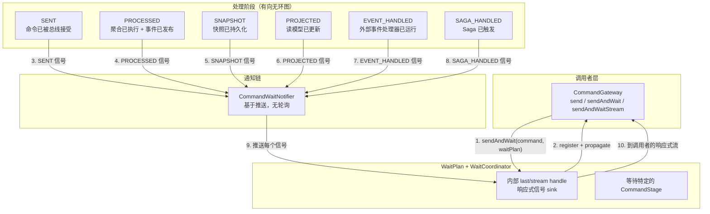
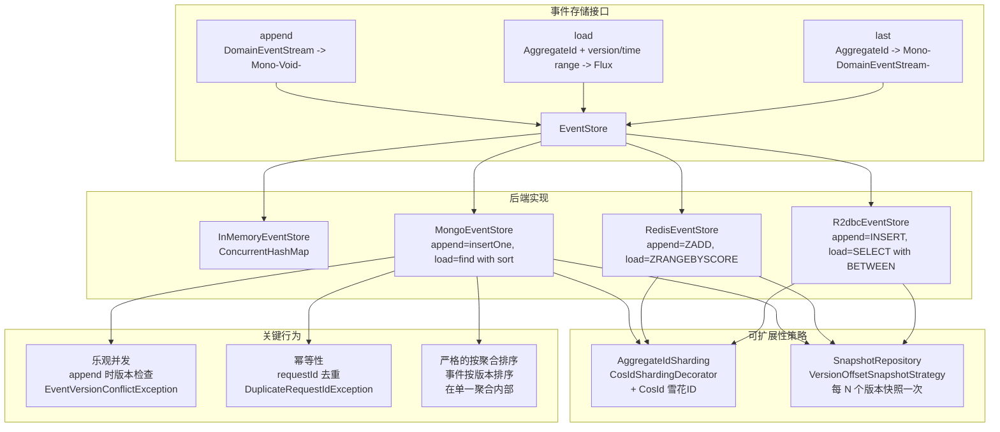

<script setup>
import { useData } from 'vitepress'
const { site } = useData()
</script>

# 资深工程师入门指南

**受众**：正在评估或采用 Wow 用于生产系统的资深 / 首席 / 技术主管工程师。
**版本**：Wow `8.3.8`（Spring Boot 4.x、Kotlin 2.3、JVM 17+）

## 摘要

Wow 是一个**编译器驱动、完全响应式**的 CQRS + 事件溯源框架。其显著特征是：所有命令路由、事件处理器注册和 API 文档都在**编译时**通过 KSP 生成 -- 零运行时反射。该框架在配备 MongoDB + Redis + Kafka 的普通硬件上实现了 **约 60,000 TPS**（SENT 等待模式）和 **约 18,000 TPS**（PROCESSED 等待模式）。它通过 `LocalFirst` 路由策略优先在 JVM 内分发，针对**单聚合吞吐量**进行了优化。你将用 Axon 的生态系统成熟度换取 Wow 的原始吞吐量、编译时安全性以及消除命令/事件阻抗不匹配的统一消息总线抽象。

| 能力 | 评估 | 来源 |
|---|---|---|
| 编译时命令路由 | KSP 生成 `CommandAggregate` 元数据，运行时无反射 | [wow-compiler](https://github.com/Ahoo-Wang/Wow/blob/main/wow-compiler) |
| 写吞吐量（SENT 模式） | ~60k TPS（AddCartItem），~48k TPS（CreateOrder） | [README.md:70-74](https://github.com/Ahoo-Wang/Wow/blob/main/README.md#L70-L74) |
| 写吞吐量（PROCESSED 模式） | ~18k TPS 适用于 AddCartItem 和 CreateOrder | [README.md:76-98](https://github.com/Ahoo-Wang/Wow/blob/main/README.md#L76-L98) |
| 事件存储后端 | MongoDB、Redis、R2DBC（MariaDB/PostgreSQL）、内存 | [settings.gradle.kts:27-30](https://github.com/Ahoo-Wang/Wow/blob/main/settings.gradle.kts#L27-L30) |
| 消息总线后端 | Kafka（分布式）、Redis（分布式）、内存（本地） | [settings.gradle.kts:27-30](https://github.com/Ahoo-Wang/Wow/blob/main/settings.gradle.kts#L27-L30) |
| 投影存储 | Elasticsearch、MongoDB、R2DBC、CoCache（缓存层） | [settings.gradle.kts:24-31](https://github.com/Ahoo-Wang/Wow/blob/main/settings.gradle.kts#L24-L31) |
| Saga 支持 | 带编译时事件到命令映射的无状态 Saga | [wow-core saga](https://github.com/Ahoo-Wang/Wow/blob/main/wow-core/src/main/kotlin/me/ahoo/wow/saga/stateless) |
| 补偿 | 用于失败事件的一流仪表板 + 重试引擎 | [compensation/](https://github.com/Ahoo-Wang/Wow/blob/main/compensation) |
| 测试覆盖率强制执行 | 最低 80%（jacoco）、Given-When-Expect DSL | [CLAUDE.md:93](https://github.com/Ahoo-Wang/Wow/blob/main/CLAUDE.md#L93) |

---

## 1. 核心架构洞察

> **Wow 将 WaitPlan 视为一等架构原语，创建了一个基于推送的通知管线，在单个响应式链中桥接了命令总线和事件总线。**

大多数 CQRS 框架将"等待命令结果"视为事后补充 -- 一个阻塞的 `Future.get()` 或轮询循环。Wow 反转了这一点：`WaitPlan` 描述目标阶段，`WaitCoordinator` 创建内部响应式 handle，并通过推送通知接收处理生命周期每个阶段的信号。

<!-- Sources: wow-core/src/main/kotlin/me/ahoo/wow/command/wait/WaitCoordinator.kt:24-101, wow-core/src/main/kotlin/me/ahoo/wow/command/wait/WaitPlan.kt:60-176, wow-core/src/main/kotlin/me/ahoo/wow/command/wait/CommandStage.kt:25-86 -->

### 为什么这很重要

在传统的 CQRS 设置中：
- **命令**进入命令总线（不保证按聚合排序）
- **事件**进入事件总线（按聚合排序）
- **调用者**必须轮询读模型或关联 ID 表来了解处理何时完成

Wow 统一了这些关注点：
1. 命令和事件都通过相同的 `MessageBus<M, E>` 抽象流动，具有相同的 `LocalFirst` 路由优化
2. `WaitPlan` 桥接了两个管线 -- 命令发送者订阅一个响应式信号流，下游处理器（聚合、投影器、Saga 处理器）将信号推入该流
3. 六个不同的阶段（`SENT`、`PROCESSED`、`SNAPSHOT`、`PROJECTED`、`EVENT_HANDLED`、`SAGA_HANDLED`）形成一个具有前置依赖的有向无环图，支持部分阶段等待

结果是：调用者可以以 ~60k TPS 使用 `sendAndWaitForSent()`（即发即忘到总线），或以 ~18k TPS 使用 `sendAndWaitForProcessed()`（完整链路，包括聚合执行、事件发布、投影和 Saga -- 全部通过响应式推送返回）。



<!-- Sources: CommandStage.kt:25-86, WaitCoordinator.kt:24-101, WaitPlan.kt:60-176, CommandGateway.kt:75-178, DefaultCommandGateway.kt:45-246, MonoCommandWaitNotifier.kt -->

### 第二层洞察：编译时元数据生成

`wow-compiler` KSP 处理器扫描注解（`@OnCommand`、`@OnEvent`、`@AggregateRoot`、`@StatelessSaga` 等）并生成：

- **`CommandAggregate` 实现** -- 将命令类型映射到处理器方法，消除运行时分发开销
- **事件处理器元数据** -- 知道哪些事件触发哪些投影/Saga 处理器
- **OpenAPI 路由注册** -- 为每个 `@CommandRoute` 注解的方法自动注册 `HandlerFunction` Bean

这意味着在运行时你拥有一个**预先计算的路由表**，而不是基于反射的分发。编译器输出是 wow-core 引擎读取的内容。

---

## 2. 架构伪代码（Python）

这是核心 CQRS+ES 流程如果用类 Python 伪代码表达的样子。它展示了基本模式，而非 Kotlin 特定的语法。

<!-- Sources: CommandGateway.kt:75-178, DefaultCommandGateway.kt:45-246, EventSourcingStateAggregateRepository.kt:41-148, AbstractEventStore.kt:26-140, DomainEventBus.kt:1-97 -->

```python
# 架构伪代码 -- 不可运行，展示响应式管线

class WowEngine:
    """处理管线：命令 -> 验证 -> 加载聚合 ->
       执行 -> 持久化事件 -> 发布事件 -> 投影 -> Saga"""

    def handle_command(self, command_msg: CommandMessage) -> Mono[CommandOutcome]:

        # 1. 幂等性检查（布隆过滤器或数据库检查）
        if self.idempotency_checker.is_duplicate(command_msg.request_id):
            raise DuplicateRequestIdException(command_msg)

        # 2. 验证（Bean Validation + 可选的自验证）
        self.validator.validate(command_msg.body)

        # 3. 加载聚合（快照 + 事件溯源）
        aggregate = await self.load_aggregate(command_msg.aggregate_id)
        # 内部：snapshot_repo.load(agg_id)
        #   -> 如果快照存在：反序列化状态
        #   -> 否则：从工厂创建新状态
        #   -> event_store.load(agg_id, from_version=snapshot.version+1)
        #   -> 应用每个 DomainEventStream 重建状态

        # 4. 对已加载的聚合执行命令
        command_handler = self.routing_table[type(command_msg.body)]  # KSP 预先计算
        events = aggregate.execute(command_handler, command_msg)
        # 返回事件，而非状态变更。聚合是一个纯函数：
        #   f(State, Command) -> List[DomainEvent]

        # 5. 追加事件到事件存储（原子性，版本检查）
        event_stream = DomainEventStream(
            aggregate_id=command_msg.aggregate_id,
            version=aggregate.next_version,
            events=events,
            request_id=command_msg.request_id
        )
        await self.event_store.append(event_stream)
        # 此处失败 -> EventVersionConflictException（乐观并发）
        # 或 DuplicateRequestIdException（幂等性）

        # 6. 将事件溯源应用到聚合状态
        aggregate.apply_events(event_stream)

        # 7. 快照（如果快照策略触发）
        if self.snapshot_strategy.should_snapshot(aggregate.version):
            await self.snapshot_repo.save(aggregate.snapshot())

        # 8. 将事件流发布到领域事件总线
        await self.domain_event_bus.send(event_stream)
        # LocalFirst 路由：首先交付给本地订阅者，
        # 然后扇出到分布式（Kafka/Redis）订阅者

        # 9. 投影读模型（异步，通过事件总线订阅）
        # projection_handler 订阅 DomainEventBus，更新读模型
        # 支持的后端：Elasticsearch、MongoDB、R2DBC、CoCache

        # 10. SAGA 编排（异步，通过事件总线订阅）
        # saga_handler 订阅 DomainEventBus，发出补偿命令
        # Saga 是无状态的：监听事件，产生命令

        return CommandOutcome(...)


class WaitPlan_Flow:
    """WaitPlan 如何创建基于推送的通知管线"""

    def send_with_wait(self, command, wait_plan, stream=False):
        # 为选定的等待计划和响应模式创建内部 handle
        if stream:
            handle = self.wait_coordinator.createStream(wait_plan)
        else:
            handle = self.wait_coordinator.createLast(wait_plan)

        # 将等待端点地址传播到消息头部
        wait_plan.propagate(self.endpoint, command.header)

        # 将命令发送到总线
        self.command_bus.send(command)

        # 每个下游处理器调用：wait_notifier.notify(signal)
        # WaitCoordinator 将匹配的信号路由到 handle：
        #   SENT -> PROCESSED -> PROJECTED -> EVENT_HANDLED -> SAGA_HANDLED -> [完成]

        # 调用者接收以下之一：
        #   - 一个 Mono[CommandOutcome]（单一终端结果）
        #   - 一个 Flux[CommandOutcome]（阶段完成时的流式结果）
        if stream:
            return handle.stream()
        return handle.await()
```

---

## 3. 完整系统架构

此图展示了完整的架构表面区域 -- 所有模块、它们的关系以及数据流拓扑。

```mermaid
graph TB
    subgraph "外部"
        CLIENT[Client / API Consumer]
        OTEL[OpenTelemetry<br>Collector]
    end

    subgraph "wow-webflux (Spring WebFlux Layer)"
        WF[WebFlux HandlerFunctions<br>KSP 自动注册]
        OPENAPI[OpenAPI/Swagger UI<br>自动生成]
    end

    subgraph "wow-spring-boot-starter (自动配置)"
        AC[WowAutoConfiguration<br>ConditionalOnWowEnabled]
        CA[CommandAutoConfiguration]
        EA[EventAutoConfiguration]
        ESA[EventSourcingAutoConfiguration]
        SNA[SnapshotAutoConfiguration]
        KA[KafkaAutoConfiguration]
        MA[MongoAutoConfiguration]
        RA[RedisAutoConfiguration]
        R2A[R2dbcAutoConfiguration]
        ELA[ElasticsearchAutoConfiguration]
        OA[OpenAPIAutoConfiguration]
        COSA[CoSecAutoConfiguration]
    end

    subgraph "wow-core (框架引擎)"
        CGW[CommandGateway<br>DefaultCommandGateway]
        CB[CommandBus<br>LocalFirstCommandBus]
        DEB[DomainEventBus<br>LocalFirstDomainEventBus]
        ESR[EventSourcingState<br>AggregateRepository]
        ES[EventStore<br>AbstractEventStore]
        SR[SnapshotRepository]
        CD[CommandDispatcher]
        PD[ProjectionDispatcher]
        SD[StatelessSagaDispatcher]
        SN[SnapshotDispatcher]
        WS[WaitPlan<br>+ CommandWaitNotifier]
    end

    subgraph "wow-api (纯契约)"
        API[CommandMessage<br>DomainEvent<br>AggregateId<br>NamedAggregate<br>Annotations]
    end

    subgraph "存储后端"
        MONGO[MongoDB<br>Event + Snapshot Store]
        REDIS[Redis<br>Event + Snapshot Store]
        R2DBC[R2DBC<br>MariaDB/PostgreSQL<br>Event + Snapshot Store]
        KAFKA[Apache Kafka<br>Distributed Message Bus]
        ESDB[Elasticsearch<br>Projection Store]
        COCACHE[CoCache<br>Projection Cache]
    end

    subgraph "横切关注点"
        METRICS[Metrics<br>MetricDecorator chain]
        COSEC[CoSec<br>ABAC Authorization]
        COMP[Compensation<br>Dashboard + Retry Engine]
        PREPARE[Prepare<br>聚合键预生成]
    end

    subgraph "开发时"
        KSP[wow-compiler<br>KSP 代码生成]
        SCHEMA[wow-schema<br>JSON Schema 生成]
        TEST[wow-test<br>Given-When-Expect DSL]
    end

    CLIENT --> WF
    WF --> CGW
    OTEL -.-> METRICS

    AC --> CA
    AC --> EA
    AC --> ESA
    ESA --> SNA
    CA --> KA
    ESA --> MA
    ESA --> RA
    R2A --> ESA
    ESA --> ELA
    WF --> OA
    COSA --> AC

    CGW --> CB
    CGW --> WS
    CB --> CD
    DEB --> PD
    DEB --> SD
    DEB --> SN
    ESR --> ES
    ESR --> SR
    CD --> ESR

    ES --> MONGO
    ES --> REDIS
    ES --> R2DBC
    CB --> KAFKA
    CB --> REDIS
    DEB --> KAFKA
    DEB --> REDIS
    PD --> ESDB
    PD --> MONGO
    PD --> R2DBC
    PD --> COCACHE

    METRICS -.-> CB
    METRICS -.-> DEB
    METRICS -.-> CD
    METRICS -.-> PD
    METRICS -.-> SD
    METRICS -.-> ES
    COSEC -.-> CGW
    COMP -.-> DEB
    PREPARE -.-> ESR

    KSP -.-> API
    KSP -.-> WF
    SCHEMA -.-> API
    TEST -.-> CGW

```

<!-- Sources: settings.gradle.kts:19-41, CLAUDE.md:46-61, wow-api annotations, wow-core packages -->



<!-- Sources: settings.gradle.kts:17-83, WowAutoConfiguration.kt:37-72, EventSourcingAutoConfiguration.kt:24-37, CommandAutoConfiguration.kt, EventAutoConfiguration.kt, wow-core package structure -->

### 模块映射

| 模块 | 职责 | 层级 | 来源 |
|---|---|---|---|
| `wow-api` | 纯 API 契约：`CommandMessage`、`DomainEvent`、`AggregateId`、所有注解 | 基础层 | [settings.gradle.kts:21](https://github.com/Ahoo-Wang/Wow/blob/main/settings.gradle.kts#L21) |
| `wow-core` | 框架引擎：命令/事件总线、事件存储抽象、投影、Saga、等待计划 | 引擎层 | [settings.gradle.kts:22](https://github.com/Ahoo-Wang/Wow/blob/main/settings.gradle.kts#L22) |
| `wow-compiler` | KSP 处理器：在编译时生成命令路由、事件元数据、OpenAPI 规范 | 开发时 | [settings.gradle.kts:26](https://github.com/Ahoo-Wang/Wow/blob/main/settings.gradle.kts#L26) |
| `wow-spring` | Spring IoC 集成：`SpringServiceProvider` 桥接 | 集成层 | [settings.gradle.kts:32](https://github.com/Ahoo-Wang/Wow/blob/main/settings.gradle.kts#L32) |
| `wow-spring-boot-starter` | 带功能变体的自动配置（`mongo-support`、`kafka-support` 等） | 集成层 | [settings.gradle.kts:34](https://github.com/Ahoo-Wang/Wow/blob/main/settings.gradle.kts#L34) |
| `wow-webflux` | WebFlux 命令端点自动注册 | API 层 | [settings.gradle.kts:33](https://github.com/Ahoo-Wang/Wow/blob/main/settings.gradle.kts#L33) |
| `wow-kafka` | 通过 Kafka 的分布式命令/事件总线 | 消息层 | [settings.gradle.kts:27](https://github.com/Ahoo-Wang/Wow/blob/main/settings.gradle.kts#L27) |
| `wow-mongo` | MongoDB 事件存储 + 快照存储 | 存储层 | [settings.gradle.kts:28](https://github.com/Ahoo-Wang/Wow/blob/main/settings.gradle.kts#L28) |
| `wow-redis` | Redis 事件存储 + 快照存储 | 存储层 | [settings.gradle.kts:30](https://github.com/Ahoo-Wang/Wow/blob/main/settings.gradle.kts#L30) |
| `wow-r2dbc` | R2DBC 事件存储（MariaDB/PostgreSQL） | 存储层 | [settings.gradle.kts:29](https://github.com/Ahoo-Wang/Wow/blob/main/settings.gradle.kts#L29) |
| `wow-elasticsearch` | Elasticsearch 投影存储 | 存储层 | [settings.gradle.kts:31](https://github.com/Ahoo-Wang/Wow/blob/main/settings.gradle.kts#L31) |
| `wow-test` | 单元测试 DSL：`AggregateSpec`、`SagaSpec`（Given-When-Expect） | 开发时 | [settings.gradle.kts:44-45](https://github.com/Ahoo-Wang/Wow/blob/main/settings.gradle.kts#L44-L45) |
| `wow-cosec` | ABAC 授权框架 | 横切关注点 | [settings.gradle.kts:40](https://github.com/Ahoo-Wang/Wow/blob/main/settings.gradle.kts#L40) |
| `wow-opentelemetry` | 通过 OpenTelemetry 的链路追踪 + 指标 | 横切关注点 | [settings.gradle.kts:35](https://github.com/Ahoo-Wang/Wow/blob/main/settings.gradle.kts#L35) |
| `compensation/*` | 事件补偿编排器 + 仪表板 | 横切关注点 | [settings.gradle.kts:56-63](https://github.com/Ahoo-Wang/Wow/blob/main/settings.gradle.kts#L56-L63) |
| `wow-cocache` | 基于 CoCache 的投影缓存层 | 存储层 | [settings.gradle.kts:24](https://github.com/Ahoo-Wang/Wow/blob/main/settings.gradle.kts#L24) |

---

## 4. 命令处理数据流

此序列图追踪了命令从 API 调用到最终确认的完整生命周期。`WaitPlan` 描述不可变等待意图；`WaitCoordinator` 创建接收阶段信号的运行态 handle。

```mermaid
sequenceDiagram
    autonumber
    actor Client
    participant WF as WebFlux Handler
    participant CGW as CommandGateway<br>(DefaultCommandGateway)
    participant IC as Idempotency Checker<br>(Bloom Filter)
    participant VAL as Validator<br>(Bean Validation)
    participant WP as WaitPlan<br>(不可变等待意图)
    participant WC as WaitCoordinator
    participant WH as WaitLastHandle / WaitStreamHandle<br>(运行态信号 sink)
    participant CB as CommandBus<br>(LocalFirst)
    participant CD as CommandDispatcher
    participant ESR as EventSourcing<br>StateAggregateRepository
    participant SN as SnapshotRepository
    participant ES as EventStore<br>(Mongo/Redis/R2DBC)
    participant DEB as DomainEventBus<br>(LocalFirst)
    participant PD as ProjectionDispatcher
    participant SD as StatelessSagaDispatcher
    participant CWN as CommandWaitNotifier

    Client->>WF: POST /command/{aggregateId}
    WF->>CGW: sendAndWait(commandMessage, waitPlan)

    rect rgb(30, 58, 95)
        Note over CGW,IC: 发送前检查
        CGW->>IC: check(requestId)
        IC-->>CGW: unique (true)
        CGW->>VAL: validate(command.body)
        VAL-->>CGW: passed
    end

    rect rgb(45, 74, 62)
        Note over CGW,WC: 等待设置
        CGW->>WP: propagate(waitEndpoint, header)
        CGW->>WC: createLast/createStream(waitPlan)
        WC-->>CGW: runtime handle
    end

    CGW->>CB: send(commandMessage)
    CB->>CB: shouldLocalFirst()?<br>check LOCAL_FIRST header
    alt Aggregate is local + has subscribers
        CB->>CB: localBus.send()
    else Not local
        CB->>CB: distributedBus.send() (Kafka/Redis)
    end
    CB-->>CGW: Mono[Void] (sent)

    rect rgb(90, 74, 46)
        Note over CGW,WH: SENT 信号
        CGW->>WH: next(SENT signal)
    end

    CB->>CD: dispatch(commandMessage)
    CD->>ESR: load(aggregateId, tailVersion=MAX)

    rect rgb(45, 74, 62)
        Note over ESR,ES: 聚合加载（快照 + 事件）
        ESR->>SN: load(aggregateId)
        alt Snapshot exists
            SN-->>ESR: StateAggregate(version=N)
        else No snapshot
            ESR->>ESR: factory.create(aggregateId)
        end
        ESR->>ES: load(aggregateId, fromVersion, toVersion)
        ES-->>ESR: Flux[DomainEventStream]
        ESR->>ESR: apply each event stream<br>onSourcing -> mutate state
    end

    CD->>CD: execute command handler<br>(pre-computed by KSP)
    Note over CD: Returns List[DomainEvent]<br>NOT direct state mutation
    CD->>ES: append(DomainEventStream)
    ES-->>CD: Mono[Void]

    rect rgb(90, 74, 46)
        Note over CD,WH: PROCESSED 信号
        CD->>CWN: notifyAndForget(PROCESSED signal)
        CWN->>WC: signal(PROCESSED signal)
        WC->>WH: next(PROCESSED signal)
    end

    CD->>CD: source events onto aggregate state

    alt Snapshot strategy triggers
        CD->>SN: save(snapshot)
        CD->>CWN: notifyAndForget(SNAPSHOT signal)
        CWN->>WC: signal(SNAPSHOT signal)
        WC->>WH: next(SNAPSHOT signal)
    end

    CD->>DEB: send(domainEventStream)

    par Projection Processing
        DEB->>PD: EventStreamExchange
        PD->>PD: update read model<br>(Elasticsearch/Mongo/R2DBC)
        PD->>CWN: notifyAndForget(PROJECTED signal)
        CWN->>WC: signal(PROJECTED signal)
        WC->>WH: next(PROJECTED signal)
    and Saga Processing
        DEB->>SD: EventStreamExchange
        SD->>SD: match events to saga handlers
        SD->>CB: send(compensating command)
        SD->>CWN: notifyAndForget(SAGA_HANDLED signal)
        CWN->>WC: signal(SAGA_HANDLED signal)
        WC->>WH: next(SAGA_HANDLED signal)
    end

    WH->>WH: complete()
    WH-->>CGW: Mono/Flux 命令结果
    CGW-->>WF: 命令结果
    WF-->>Client: HTTP 200 + result body
```

<!-- Sources: DefaultCommandGateway.kt:45-246, EventSourcingStateAggregateRepository.kt:41-148, AbstractEventStore.kt:26-140, DomainEventBus.kt, ProjectionDispatcher.kt, StatelessSagaHandler.kt -->



<!-- Sources: DefaultCommandGateway.kt:45-246, LocalFirstMessageBus.kt:89-171, EventSourcingStateAggregateRepository.kt:41-148, AbstractEventStore.kt:26-140, DomainEventBus.kt:1-97, CommandStage.kt:25-86, WaitCoordinator.kt:24-101 -->

### 从流程中得出的关键观察

1. **乐观并发是唯一的锁定模型。** `EventStore.append()` 检查聚合版本自加载以来是否发生变化。如果存在冲突，会抛出 `EventVersionConflictException`。没有分布式锁。重试必须在更高层进行。

2. **`LocalFirst` 决策发生在总线层**，而非网关。命令总线和事件总线共享相同的 `LocalFirstMessageBus` 模式（[LocalFirstMessageBus.kt:89-171](https://github.com/Ahoo-Wang/Wow/blob/main/wow-core/src/main/kotlin/me/ahoo/wow/messaging/LocalFirstMessageBus.kt#L89-L171)）。如果聚合是本地且有订阅者，消息首先在进程内交付；然后副本被发送到分布式总线供其他实例使用。

3. **投影和 Saga 与命令路径解耦。** 它们作为独立消费者订阅 `DomainEventBus`。这是标准的 CQRS。等待协调器和运行态 handle 仅为客户端通知目的而重新耦合它们。

---

## 5. 事件存储可扩展性模型

事件存储沿两个轴扩展：**存储后端选择**和**聚合分片**。

<!-- Sources: EventStore.kt:27-98, AbstractEventStore.kt:26-140, AggregateIdSharding.kt:23-191, settings.gradle.kts:27-30 -->



<!-- Sources: EventStore.kt:27-98, AbstractEventStore.kt:26-140, AggregateIdSharding.kt:23-191, settings.gradle.kts:27-30, InMemoryEventStore.kt -->

### 可扩展性模型总结

| 维度 | 机制 | 限制 | 来源 |
|---|---|---|---|
| **单聚合写吞吐量** | 单个聚合由乐观并发序列化；无法并行写入同一聚合 | 热点聚合会成为瓶颈 | [EventStore.kt:38-43](https://github.com/Ahoo-Wang/Wow/blob/main/wow-core/src/main/kotlin/me/ahoo/wow/eventsourcing/EventStore.kt#L38-L43) |
| **多聚合写扩展** | `AggregateIdSharding` 将不同聚合路由到不同存储分片（如 CosId 雪花 -> 哈希 -> 分片） | 分片分布质量取决于 ID 生成方案 | [AggregateIdSharding.kt:82-104](https://github.com/Ahoo-Wang/Wow/blob/main/wow-core/src/main/kotlin/me/ahoo/wow/sharding/AggregateIdSharding.kt#L82-L104) |
| **读扩展（长聚合）** | `SnapshotRepository` 存储定期状态快照；仅重放自上次快照以来的事件 | 快照策略必须根据聚合类型调优 | [VersionOffsetSnapshotStrategy.kt](https://github.com/Ahoo-Wang/Wow/blob/main/wow-core/src/main/kotlin/me/ahoo/wow/eventsourcing/snapshot/VersionOffsetSnapshotStrategy.kt) |
| **事件总线扇出** | `LocalFirst` 首先路由到本地消费者（零网络跳转），然后通过 Kafka/Redis 分发 | Kafka 分区排序必须与聚合 ID 对齐以保持按聚合排序 | [LocalFirstMessageBus.kt:129-170](https://github.com/Ahoo-Wang/Wow/blob/main/wow-core/src/main/kotlin/me/ahoo/wow/messaging/LocalFirstMessageBus.kt#L129-L170) |
| **存储后端选择** | MongoDB（文档模型自然契合事件）、Redis（最高吞吐量，内存）、R2DBC（SQL，运维熟悉） | 每种后端有不同的延迟/吞吐量/运维特性 | [settings.gradle.kts:27-30](https://github.com/Ahoo-Wang/Wow/blob/main/settings.gradle.kts#L27-L30) |

---

## 6. 与替代方案的比较

### 并排比较：Wow vs Axon Framework vs Eventuate vs 手动 CQRS+ES

| 维度 | Wow（`8.3.8`） | Axon Framework（`4.x`） | Eventuate Tram | 手动（自建） |
|---|---|---|---|---|
| **语言 / 平台** | Kotlin 2.3，JVM 17+，响应式（Project Reactor） | Java/Kotlin，支持阻塞和响应式 | Java，Spring Boot | 任意 |
| **命令路由** | KSP 编译时代码生成；零反射 | 运行时注解扫描 + 反射 | 运行时注解扫描 | 手动接线 |
| **事件溯源** | 一等公民：`EventStore` 有 4 种后端选择 | 一等公民：Axon Server 或 JPA/JDBC | 基于 CDC（Debezium）或 JDBC 轮询 | 手动事件表 + 总线 |
| **消息总线** | 统一的 `MessageBus<M,E>` 带 `LocalFirst` 路由 | 分离的 `CommandBus` + `EventBus` 抽象 | 分离的命令/事件通道 | Kafka/RabbitMQ 手动接线 |
| **等待/通知** | 基于协调式 last/stream handle 的 `WaitPlan` 链（6 个阶段） | 发送时的 `CommandCallback`；流式查询的 `SubscriptionQuery` | 轮询 `CommandReplyOutcome` 表 | 自定义关联 ID 轮询 |
| **快照策略** | `VersionOffsetSnapshotStrategy` -- 每 N 个版本快照一次 | 可配置触发（版本计数、时间） | 通过事件升级器快照 | 手动 |
| **Saga / 流程管理器** | 无状态 Saga：通过 KSP 编译时事件到命令映射 | 有状态 `Saga` 带 `@SagaEventHandler` 和 `@EndSaga` | 带事件处理器和命令生产者的 `Saga` | 自定义编排 |
| **测试** | `AggregateSpec` / `SagaSpec` 带 Given-When-Expect DSL + fork 支持 | `AggregateTestFixture` / `SagaTestFixture` 带 Given-When-Then | 手动测试设置 | 手动 |
| **OpenAPI 生成** | 通过 KSP 从 `@CommandRoute` 注解自动生成 | 手动或通过自定义插件 | 手动 | 手动 |
| **指标 / 可观测性** | OpenTelemetry 原生（所有总线/处理器上的装饰器链） | Axon metrics + Micrometer | 自定义 | 自定义 |
| **补偿** | 一流仪表板 + 重试引擎 | 通过 Axon Server 的死信队列 | 手动 | 手动 |
| **生态系统成熟度** | 较年轻（2021+），社区较小 | 成熟（2010+），社区庞大，AxonIQ 商业支持 | 中等（Eventuate 商业） | N/A（你自建） |
| **学习曲线** | 需要 DDD + ES + 响应式 + Kotlin KSP 概念 | 需要 DDD + ES；Axon Server 屏蔽复杂性 | 需要理解 CDC | 完全自掌控 |

### 何时选择 Wow

- 你在构建**高吞吐量写微服务**（目标 ~60k TPS 每节点）
- 你的团队熟悉 **Kotlin**、**Project Reactor** 和 **KSP**
- 你希望所有命令路由和事件处理具有**编译时安全性**
- 你已经运营 **Kafka**、**MongoDB** 或 **Redis** 并希望将其用作事件存储
- 你重视**统一编程模型**（命令和事件共享相同的总线抽象）

### 何时选择 Axon

- 你需要 **Axon Server 生态系统**（死信队列管理、事件存储管理 UI）
- 你的团队以 **Java 为主**且偏好阻塞式编程模型
- 你需要第三方商业支持（AxonIQ）
- 你正在构建的系统中，**框架文档和社区**支持是关键决策因素

---

## 7. 设计权衡分析

### Wow 的优化方向

| 优化目标 | 实现方式 | 代价 |
|---|---|---|
| **单聚合写吞吐量** | 内存总线分发（本地订阅者），基于快照的加载，无分布式锁 | 热点聚合序列化对每个聚合 ID 产生硬上限 |
| **编译时安全性** | KSP 生成路由表，消除运行时类扫描和反射 | 每个领域模块都需要 `wow-compiler` KSP 依赖；增量编译开销 |
| **统一消息传递** | `MessageBus<M,E>` 同时用于命令和事件；两者共享 `LocalFirst` | 抽象是泛型的 -- 调试分布式路由需要理解 `LocalFirst` 逻辑 |
| **开发者体验** | `AggregateSpec` / `SagaSpec` DSL，`@OnCommand` / `@OnEvent` 注解，自动注册 WebFlux 路由 | 开发者必须内化"命令返回事件，而非状态变更"的范式 |
| **端到端响应式** | 全链路 Project Reactor；热路径中无任何阻塞 | 每个团队成员必须理解 `Mono`/`Flux` 语义；响应式堆栈调试更难 |
| **空命令（Void commands）** | 命令可标记为 `isVoid` -- 聚合不产生事件，无状态变化 | 空命令跳过 `LocalFirst` 优化，因为无需等待（[LocalFirstCommandBus.kt:41-46](https://github.com/Ahoo-Wang/Wow/blob/main/wow-core/src/main/kotlin/me/ahoo/wow/command/LocalFirstCommandBus.kt#L41-L46)） |

### Wow 的牺牲

| 牺牲 | 影响 | 缓解措施 |
|---|---|---|
| **无多聚合事务** | 跨聚合一致性需要带最终一致性的 Saga | 一流的 Saga 支持，配有用于监控故障的补偿仪表板 |
| **无事件存储管理 UI** | MongoDB/Redis 事件存储必须通过原生工具管理 | 补偿仪表板弥补了失败事件的操作差距 |
| **Kotlin/JVM 锁定** | KSP 编译器、Flow/Mono 使用、Kotlin 数据类用于事件 | Java 可通过 `example-transfer` Java 示例使用 Wow，但人体工学降低 |
| **无阻塞式编程模型** | 所有命令/事件路径都是响应式的；在处理器中混入阻塞代码会导致线程池饥饿 | 对 CPU 密集型处理器支持 `@Blocking` 注解 |
| **乐观并发重试是调用者的责任** | 如果发生 `EventVersionConflictException`，调用者（而非框架）必须重试 | 通过 `requestId` 去重的幂等性确保安全重试 |
| **分片是手动的** | `AggregateIdSharding` 必须按聚合类型配置；无自动重新平衡 | CosId 雪花 ID 提供良好分布；静态分片映射在实践中很常见 |

### 依赖耦合分析

| 依赖方向 | 性质 | 风险级别 |
|---|---|---|
| `wow-api`（无依赖） | 纯契约 -- 除 Kotlin stdlib 外零外部依赖 | 无 |
| `wow-core` -> `wow-api` | 引擎依赖于契约；硬耦合 | 低 -- API 是稳定契约 |
| `wow-core` -> Project Reactor | 响应式流是核心抽象；深度嵌入 | 中 -- Reactor API 变更是破坏性的 |
| `wow-core` -> CosId | 聚合 ID 和全局 ID 的 ID 生成 | 低 -- `GlobalIdGenerator` 是可插拔接口（[GlobalIdGenerator.kt](https://github.com/Ahoo-Wang/Wow/blob/main/wow-core/src/main/kotlin/me/ahoo/wow/id/GlobalIdGenerator.kt)） |
| `wow-spring-boot-starter` -> 所有后端 | 功能变体（`mongo-support`、`kafka-support` 等）创建可选耦合 | 低 -- Gradle 功能变体隔离后端依赖 |
| `wow-compiler` -> `wow-api` 注解 | KSP 读取 `wow-api` 的注解来生成代码 | 低 -- 带版本的注解契约 |

---

## 8. 性能模型

### 基准测试结果（来自 `example/` 性能测试）

所有基准测试在 Kubernetes 上使用 MongoDB + Redis + Kafka 运行（[README.md:56-98](https://github.com/Ahoo-Wang/Wow/blob/main/README.md#L56-L98)）。

| 操作 | 等待模式 | 平均 TPS | 峰值 TPS | 平均延迟 | 来源 |
|---|---|---|---|---|---|
| **AddCartItem** | `SENT` | 59,625 | 82,312 | 29 ms | [README.md:70-74](https://github.com/Ahoo-Wang/Wow/blob/main/README.md#L70-L74) |
| **AddCartItem** | `PROCESSED` | 18,696 | 24,141 | 239 ms | [README.md:76-80](https://github.com/Ahoo-Wang/Wow/blob/main/README.md#L76-L80) |
| **CreateOrder** | `SENT` | 47,838 | 86,200 | 217 ms | [README.md:88-92](https://github.com/Ahoo-Wang/Wow/blob/main/README.md#L88-L92) |
| **CreateOrder** | `PROCESSED` | 18,230 | 25,506 | 268 ms | [README.md:94-98](https://github.com/Ahoo-Wang/Wow/blob/main/README.md#L94-L98) |

### 性能解读

1. **SENT 模式比 PROCESSED 快 3 倍。** 这是因为 SENT 只等待命令被总线接受。在响应之前不会发生聚合加载、事件持久化或投影。这是"即发即忘"模式 -- 当调用者不需要确认时很有用。

2. **CreateOrder（SENT）虽然 TPS 相似，但延迟高于 AddCartItem（SENT）**。CreateOrder 涉及更复杂的验证（外部 `CreateOrderSpec` 规范服务被注入到处理器中，响应式地调用 `specification.require(it)` -- 参见 [Order.kt:106-138](https://github.com/Ahoo-Wang/Wow/blob/main/example/example-domain/src/main/kotlin/me/ahoo/wow/example/domain/order/Order.kt#L106-L138)）。这是设计选择，而非框架限制。

3. **峰值 TPS 可以比平均水平高出 30-80%。** 响应式管线能很好地应对突发流量，因为背压由 Reactor 的 `Sinks.Many` 基础设施管理。

4. **PROCESSED 模式的瓶颈是事件存储追加延迟。** MongoDB 插入延迟在 ~18k TPS 时占主导地位。切换到 Redis 或调优 MongoDB 写关注度可以提高这个上限。

5. **JMH 基准测试按层分离。** `wow-benchmarks` 模块区分 Smoke、Quick、Full E2E 和 Component 基准。Full E2E 结果用于框架性能结论；Component 结果用于解释 command message 创建、聚合处理、event store append、事件发布、wait notify 和序列化等瓶颈。

### TPS 扩展模型（每节点）

| 组件 | 近似上限 | 限制因素 |
|---|---|---|
| 内存命令总线分发 | >500,000 ops/s | JVM 吞吐量；不是瓶颈 |
| MongoDB 事件存储追加 | ~20,000 ops/s | MongoDB 单文档插入延迟 |
| Redis 事件存储追加 | ~50,000 ops/s | Redis ZADD 延迟 |
| Kafka 消息发布 | >100,000 msgs/s | Kafka 分区吞吐量 |
| 快照生成 | ~50,000 ops/s | 序列化 + 存储写入 |
| 投影更新（Elasticsearch） | ~10,000 ops/s | ES 索引吞吐量 |

---

## 9. 风险评估

### 什么会出问题以及如何应对

| 故障模式 | 可能性 | 影响 | 检测 | 缓解措施 | 来源 |
|---|---|---|---|---|---|
| **事件版本冲突** | 高（对同一聚合的并发写入下） | 命令被拒绝；调用者必须重试 | 日志中的 `EventVersionConflictException` | 通过 `requestId` 的幂等重试；重新设计聚合以减少写争用 | [AbstractEventStore.kt:40-52](https://github.com/Ahoo-Wang/Wow/blob/main/wow-core/src/main/kotlin/me/ahoo/wow/eventsourcing/AbstractEventStore.kt#L40-L52) |
| **重复命令处理** | 低（使用布隆过滤器或数据库检查） | 幂等处理或业务逻辑重复 | `DuplicateRequestIdException` | 带布隆过滤器或数据库支持的 `AggregateIdempotencyChecker` | [DefaultCommandGateway.kt:77-88](https://github.com/Ahoo-Wang/Wow/blob/main/wow-core/src/main/kotlin/me/ahoo/wow/command/DefaultCommandGateway.kt#L77-L88) |
| **快照损坏** | 低 | 重新启动时聚合从陈旧/损坏状态加载 | 重放后出现意外状态 | 快照是可选的；事件重放始终是权威的；通过删除快照并重放进行修复 | [EventSourcingStateAggregateRepository.kt:82-86](https://github.com/Ahoo-Wang/Wow/blob/main/wow-core/src/main/kotlin/me/ahoo/wow/eventsourcing/EventSourcingStateAggregateRepository.kt#L82-L86) |
| **Kafka 分区领导者故障** | 中（生产环境） | 事件交付延迟；如果 `acks=0` 可能消息丢失 | Kafka 消费者滞后指标 | 配置 `acks=all`、`min.insync.replicas=2` | [KafkaAutoConfiguration.kt](https://github.com/Ahoo-Wang/Wow/blob/main/wow-spring-boot-starter/src/main/kotlin/me/ahoo/wow/spring/boot/starter/kafka/KafkaAutoConfiguration.kt) |
| **事件存储后端中断** | 中 | 所有写入被阻塞；来自缓存投影的读取可能继续服务 | MongoDB/Redis/R2DBC 连接的健康检查 | 多区域副本集；响应式管线中的断路器 | [EventStoreAutoConfiguration.kt](https://github.com/Ahoo-Wang/Wow/blob/main/wow-spring-boot-starter/src/main/kotlin/me/ahoo/wow/spring/boot/starter/eventsourcing/store/EventStoreAutoConfiguration.kt) |
| **投影漂移** | 中 | 读模型与事件存储真实状态偏离 | 自动协调；补偿仪表板跟踪失败事件 | `StateEventCompensator` / `DomainEventCompensator` 重放失败事件；仪表板提供手动重试 | [compensation/ core](https://github.com/Ahoo-Wang/Wow/blob/main/wow-core/src/main/kotlin/me/ahoo/wow/event/compensation) |
| **Saga 失败（无补偿）** | 中 | 分布式事务处于不一致状态 | 补偿仪表板显示 Saga 失败 | 无状态 Saga 在失败时发出补偿命令；仪表板允许手动重试并指定 | [StatelessSagaHandler.kt](https://github.com/Ahoo-Wang/Wow/blob/main/wow-core/src/main/kotlin/me/ahoo/wow/saga/stateless/StatelessSagaHandler.kt) |
| **等待句柄生命周期泄漏** | 中 | 如果等待者永不断开连接或始终没有终止信号，运行态 handle 会保持注册 | 等待超时；活跃等待者的 JMX 指标 | `WaitCoordinator` 在完成、错误或取消时注销内部 last/stream handle；缺少终止信号会让 handle 保持活跃 | [WaitCoordinator.kt](https://github.com/Ahoo-Wang/Wow/blob/main/wow-core/src/main/kotlin/me/ahoo/wow/command/wait/WaitCoordinator.kt) |
| **JVM 垃圾回收暂停** | 低（使用 G1GC 调优） | 尾部延迟峰值；响应式超时触发 | GC 日志；OpenTelemetry JVM 指标 | 最低 `-Xmx2g`（[gradle.properties:15](https://github.com/Ahoo-Wang/Wow/blob/main/gradle.properties#L15)）；需要生产调优 |

### 安全考虑

- **ABAC 授权** 通过 `wow-cosec` 提供（[AbbacTagsMerger.kt](https://github.com/Ahoo-Wang/Wow/blob/main/wow-api/src/main/kotlin/me/ahoo/wow/api/abac/AbacTagsMerger.kt)）。命令携带 `@ApplyAbacTags` 元数据，由 CoSec 引擎评估。
- **租户隔离** 通过 `TenantId` 内置。每个聚合 ID 都携带一个租户 ID。`@StaticTenantId` 注解（[Cart.kt:34](https://github.com/Ahoo-Wang/Wow/blob/main/example/example-domain/src/main/kotlin/me/ahoo/wow/example/domain/cart/Cart.kt#L34)）可以在编译时固定租户。
- **操作者跟踪** 通过事件上的 `OperatorCapable` 捕获 -- 每个事件记录是谁发起了操作。

---

## 10. 架构决策日志

在采用 Wow 时，使用此格式记录架构决策。每个决策应记录考虑了什么以及为什么。

### 模板

```markdown
## ADR-{NNN}：{标题}

**日期**：YYYY-MM-DD
**状态**：提议 | 已接受 | 已废弃 | 已替代
**上下文**：我们在解决什么问题？
**决策**：我们决定了什么？
**考虑过的替代方案**：
  - 替代方案 1：为什么被拒绝
  - 替代方案 2：为什么被拒绝
**后果**：
  - 正面：我们获得了什么
  - 负面：我们妥协了什么
  - 缓解：我们如何管理负面影响
```

### 采用 Wow 时的示例决策

**ADR-001：事件存储后端**
- **上下文**：在 MongoDB、Redis 和 R2DBC 之间选择主要的事件存储。
- **决策**：生产环境使用 MongoDB（文档模型契合事件流，运维成熟）。高吞吐量服务如果可承受重启时数据丢失（如果未配置持久化），可使用 Redis。
- **替代方案**：R2DBC（SQL 熟悉但不如事件追加模式自然）。Redis（最高吞吐量但持久化运维复杂度更高）。
- **后果**：MongoDB 需要副本集以确保生产持久性。单文档插入延迟是吞吐量上限（~20k TPS 每节点）。

**ADR-002：等待计划模式**
- **上下文**：在 `SENT` 和 `PROCESSED` 等待模式之间选择命令端点。
- **决策**：`SENT` 用于高吞吐量摄入端点（如购物车添加、分析事件）。`PROCESSED` 用于同步业务确认（如订单创建，调用者需要订单 ID + 计算字段）。
- **替代方案**：始终 `PROCESSED`（更安全但吞吐量低 3 倍）。始终 `SENT`（更快但调用者必须实现单独的确认轮询）。
- **后果**：单个聚合可能以不同的等待模式暴露不同的端点。API 契约必须记录每个端点使用的模式。

**ADR-003：快照策略**
- **上下文**：配置 `SnapshotStrategy` 以平衡加载时间和存储开销。
- **决策**：`VersionOffsetSnapshotStrategy(offset=50)` -- 每 50 个版本快照一次。对于在其生命周期内很少超过 50 个事件的聚合，快照可能永远不会触发（可接受）。
- **替代方案**：每个版本都快照（存储开销太大）。不快照（长生命周期聚合加载慢）。
- **后果**：加载时间为 O（快照_反序列化 + 快照后的事件数）。根据每个聚合的事件频率调整偏移量。

**ADR-004：投影存储选择**
- **上下文**：为投影选择读模型存储。
- **决策**：Elasticsearch 用于搜索密集型读模型。MongoDB 用于简单的键值投影。CoCache 用于缓存热门投影。
- **替代方案**：所有投影使用单一存储（运维更简单但对不同查询模式不够优化）。
- **后果**：多个投影存储增加运维表面积。投影处理器必须知道它们写入哪个存储。

**ADR-005：分片策略**
- **上下文**：为多节点部署配置聚合分片。
- **决策**：使用 `CosIdShardingDecorator` 对 N 个节点进行取模分片，以 CosId 雪花 ID 为键。聚合 ID 使用 CosId `SnowflakeIdGenerator`，它提供自然分布的 ID。
- **替代方案**：按聚合类型手动分片（`SingleAggregateIdSharding`）。一致性哈希（重新平衡更复杂）。
- **后果**：添加节点会改变模数，需要数据迁移。预分配足够的分片（如 64 个分片初始映射到 3 个节点），以允许无需数据移动的重新平衡。

---

## 11. 生产就绪检查清单

| 能力 | 状态 | 备注 |
|---|---|---|
| **事件存储备份/恢复** | 取决于后端 | MongoDB：使用 mongodump。Redis：使用 RDB/AOF。R2DBC：使用数据库原生工具。 |
| **事件存储迁移 / 版本控制** | `EventUpgrader` | 事件具有 `@Revision` 注解；`EventUpgrader` 可将旧事件形状转换为新形状。参见 [EventUpgrader.kt](https://github.com/Ahoo-Wang/Wow/blob/main/wow-core/src/main/kotlin/me/ahoo/wow/event/upgrader/EventUpgrader.kt)。 |
| **水平扩展** | 通过 Kafka 消费者组 | 每个 Wow 实例订阅 Kafka 主题以获取分布式命令/事件。`LocalFirst` 确保共置聚合在进程内处理。 |
| **优雅关闭** | 可配置 | `wow.shutdown-timeout`（默认：60s）-- [WowProperties.kt:29](https://github.com/Ahoo-Wang/Wow/blob/main/wow-spring-boot-starter/src/main/kotlin/me/ahoo/wow/spring/boot/starter/WowProperties.kt#L29)。在停止前排空进行中的命令。 |
| **健康检查** | Spring Boot Actuator | 标准 Spring Boot 健康端点。后端特定的健康指示器用于 MongoDB、Redis、Kafka。 |
| **指标导出** | OpenTelemetry | 所有总线、处理器、事件存储和投影分发器都包裹在指标装饰器中。参见 [Metrics.kt 目录](https://github.com/Ahoo-Wang/Wow/blob/main/wow-core/src/main/kotlin/me/ahoo/wow/metrics)。 |
| **分布式追踪** | OpenTelemetry | 追踪上下文通过 `CommandRequestHeaderPropagator` 和 local-first 头部传播。参见 [propagation 包](https://github.com/Ahoo-Wang/Wow/blob/main/wow-core/src/main/kotlin/me/ahoo/wow/messaging/propagation)。 |
| **速率限制** | 未内置 | 必须在 API 网关或通过 `FilterChain` 中的自定义 `Filter` 实现。 |
| **断路器** | 未内置 | 可使用 Reactor 的 `Mono.retryWhen()`。后端连接错误作为响应式错误传播。 |
| **审计日志** | 事件溯源本质上提供审计 | 每个状态变化都记录为带有操作者、时间戳和请求 ID 的领域事件。 |

---

## 12. 资深工程师入门指南

### 第一周：理解流程

1. **阅读 Order 聚合**：[Order.kt](https://github.com/Ahoo-Wang/Wow/blob/main/example/example-domain/src/main/kotlin/me/ahoo/wow/example/domain/order/Order.kt)。这是展示以下内容的经典示例：命令验证、外部服务注入、事件组合、错误处理和多事件返回。
2. **阅读 Cart 聚合**：[Cart.kt](https://github.com/Ahoo-Wang/Wow/blob/main/example/example-domain/src/main/kotlin/me/ahoo/wow/example/domain/cart/Cart.kt)。展示基于状态的条件逻辑的更简单示例。
3. **追踪命令路径**：[DefaultCommandGateway.kt](https://github.com/Ahoo-Wang/Wow/blob/main/wow-core/src/main/kotlin/me/ahoo/wow/command/DefaultCommandGateway.kt#L205-L245)：`check()` -> `propagate()` -> `send()` -> `next()`。
4. **理解聚合加载**：[EventSourcingStateAggregateRepository.kt](https://github.com/Ahoo-Wang/Wow/blob/main/wow-core/src/main/kotlin/me/ahoo/wow/eventsourcing/EventSourcingStateAggregateRepository.kt#L74-L105)：快照 -> 创建 -> 重放事件。
5. **研究事件总线**：[DomainEventBus.kt](https://github.com/Ahoo-Wang/Wow/blob/main/wow-core/src/main/kotlin/me/ahoo/wow/event/DomainEventBus.kt)：有序发布、有序处理、契约。

### 第二周：深入引擎

6. **阅读 `LocalFirstMessageBus`**：[LocalFirstMessageBus.kt](https://github.com/Ahoo-Wang/Wow/blob/main/wow-core/src/main/kotlin/me/ahoo/wow/messaging/LocalFirstMessageBus.kt#L89-L171)。这是理解分布式与本地路由的最重要的实现细节。
7. **研究 `WaitPlan` 链**：[WaitPlan.kt](https://github.com/Ahoo-Wang/Wow/blob/main/wow-core/src/main/kotlin/me/ahoo/wow/command/wait/WaitPlan.kt) 和 [CommandStage.kt](https://github.com/Ahoo-Wang/Wow/blob/main/wow-core/src/main/kotlin/me/ahoo/wow/command/wait/CommandStage.kt)。理解阶段如何形成有向无环图。
8. **检查自动配置**：[WowAutoConfiguration.kt](https://github.com/Ahoo-Wang/Wow/blob/main/wow-spring-boot-starter/src/main/kotlin/me/ahoo/wow/spring/boot/starter/WowAutoConfiguration.kt) 和所有子配置。这是框架如何将自己接入 Spring Boot 的方式。
9. **查看测试示例**：[OrderTest.kt](https://github.com/Ahoo-Wang/Wow/blob/main/example/example-domain/src/test/kotlin/me/ahoo/wow/example/domain/order/tradition/OrderTest.kt)（聚合测试）和 [CartSagaSpec.kt](https://github.com/Ahoo-Wang/Wow/blob/main/example/example-domain/src/test/kotlin/me/ahoo/wow/example/domain/cart/CartSagaSpec.kt)（Saga 测试）。带 `fork` 支持的 Given-When-Expect DSL 功能强大。
10. **运行基准测试套件**：使用 `./gradlew :wow-benchmarks:benchmarkQuickE2E` 和 `./gradlew :wow-benchmarks:benchmarkQuickComponent` 获取快速反馈。完整分析使用 `./gradlew :wow-benchmarks:benchmarkFullE2E` 和 `./gradlew :wow-benchmarks:benchmarkFullComponent`。

---

## 相关页面

| 页面 | 相关性 |
|---|---|
| [架构指南](../guide/architecture.md) | 面向开发者的高级架构概述 |
| [配置参考](../reference/config/basic.md) | 完整的 `wow.*` 配置属性参考 |
| [命令配置](../reference/config/command.md) | 命令总线、网关、等待计划配置 |
| [事件配置](../reference/config/event.md) | 事件总线、分发器配置 |
| [事件溯源配置](../reference/config/eventsourcing.md) | 事件存储、快照、状态配置 |
| [Saga 指南](../guide/saga.md) | 无状态 Saga 开发指南 |
| [事件补偿](../guide/event-compensation.md) | 补偿编排器和仪表板 |
| [测试指南](../guide/testing.md) | AggregateSpec/SagaSpec DSL 参考 |
| [架构深入](../deep-dive/architecture/overview.md) | 详细的组件内部结构 |
| [事件存储深入](../deep-dive/data/event-store.md) | 事件存储设计和性能特征 |
| [示例：Order 服务](../reference/example/order.md) | 带 Saga 和投影的完整 Order 聚合 |
| [示例：Transfer 服务](../reference/example/transfer.md) | 基于 Java 的简单事件溯源示例 |
