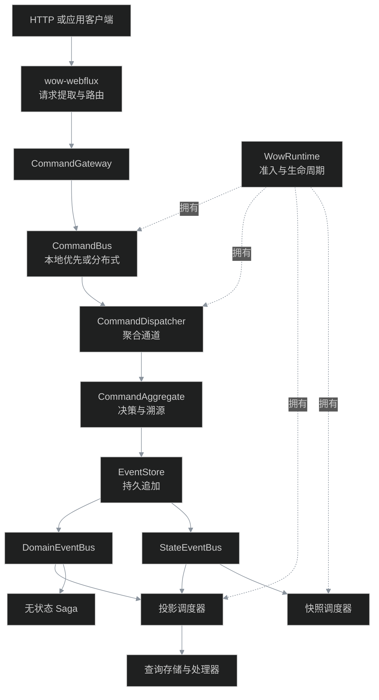
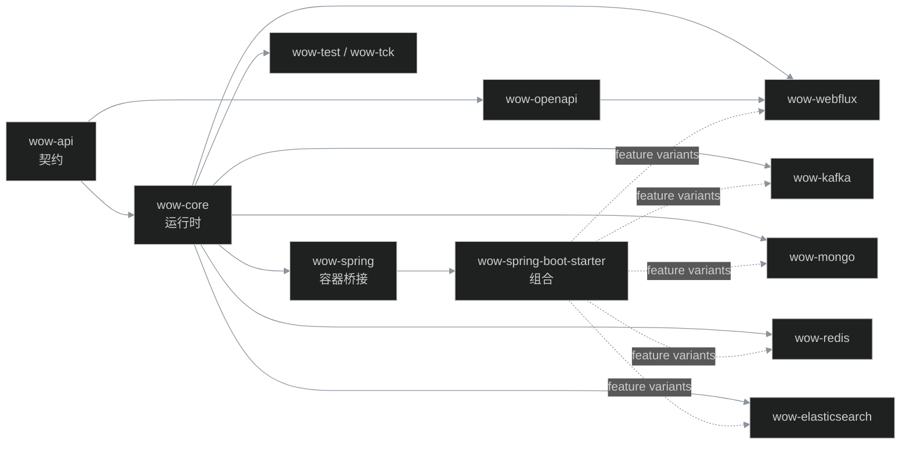
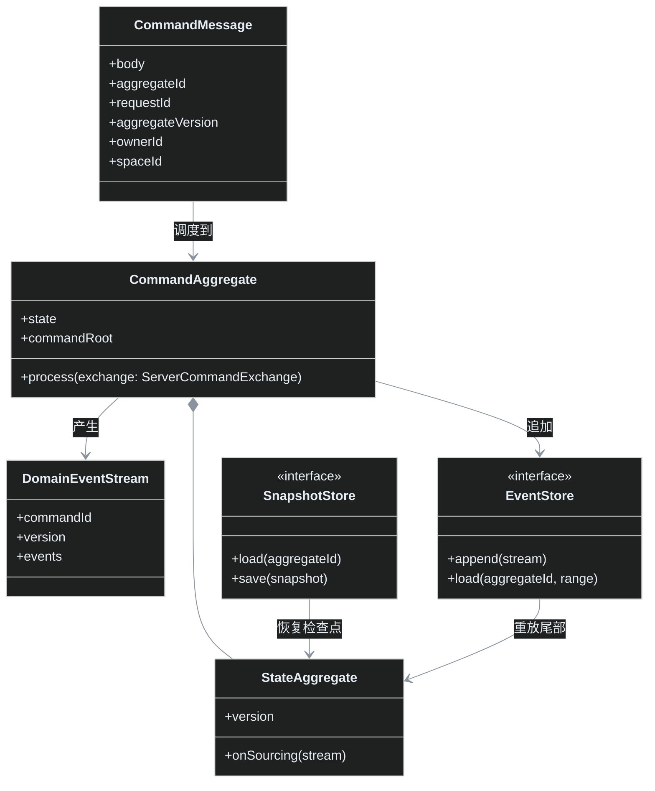
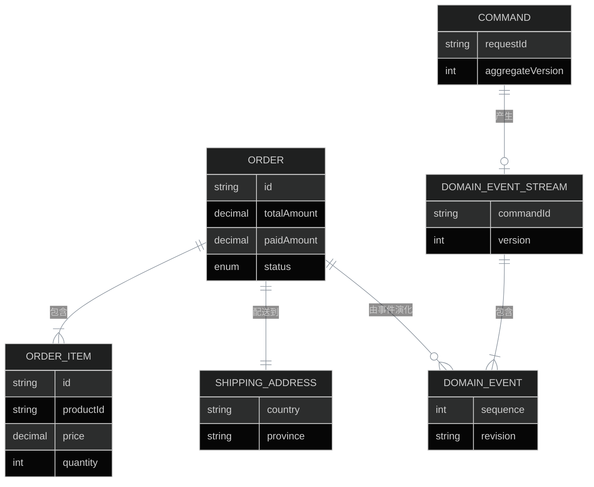
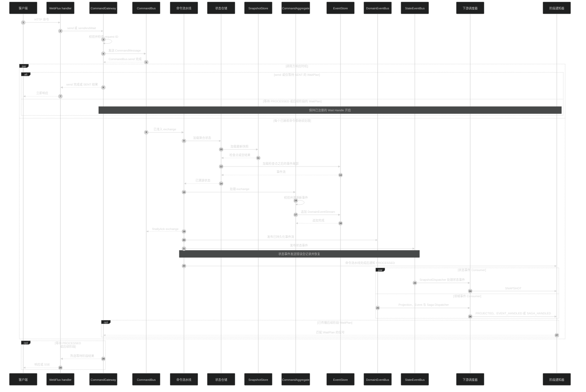
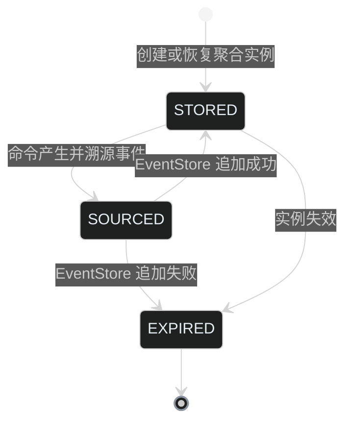
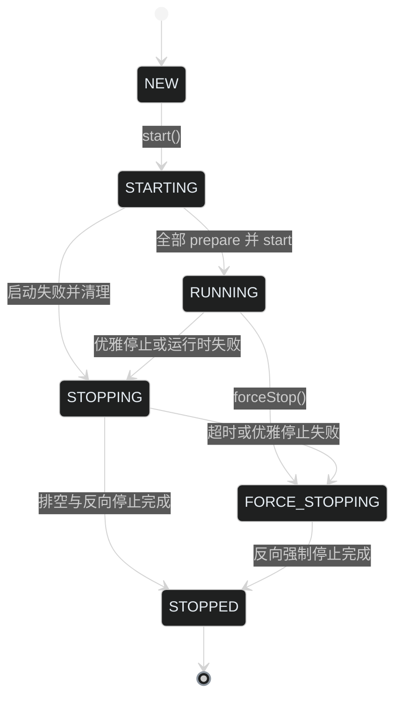
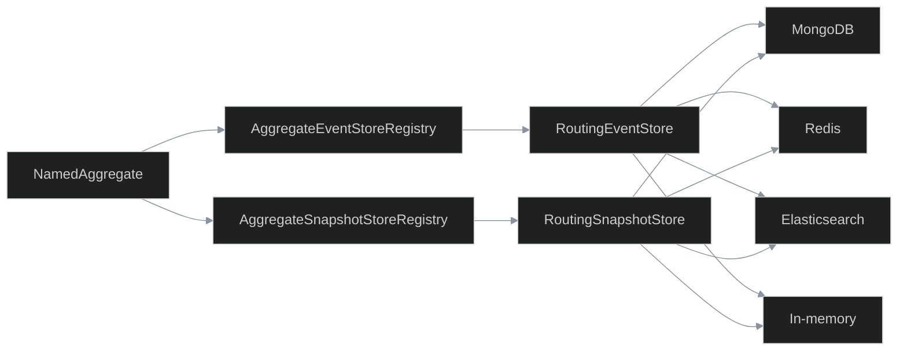
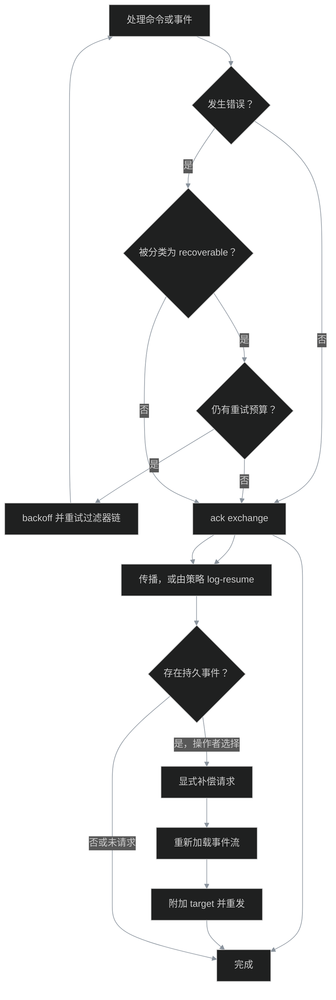
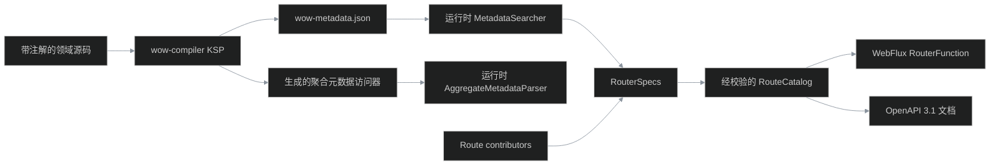

# Staff Engineer 指南

本指南面向需要在不破坏边界的前提下演进 Wow 的工程师。
它描述的是 `main` 分支中的真实架构，而不是愿景架构。
每个具体事实都链接到建立该事实的代码。
仓库无法证明的属性会明确标记为 **未知**。

## 执行摘要

Wow 是围绕聚合级命令执行组织的响应式 CQRS 与事件溯源框架。

`wow-api` 定义消息信封与公共契约。

`wow-core` 拥有命令调度、事件溯源、消息处理、投影、Saga、快照与运行时生命周期。

Spring 模块把这些机制适配到依赖注入和应用生命周期。
基础设施模块实现存储与传输契约。
WebFlux 与 OpenAPI 共享运行时路由目录；KSP 则在编译期生成它们依赖的元数据输入。
最重要的一致性边界是把 `DomainEventStream` 追加到 `EventStore`。
事件发布和下游处理发生在追加成功之后。
它们并不处在同一个分布式事务中。
框架明确保证聚合级顺序，但没有承诺全局顺序。
重试是选择性的，ack 是显式的，补偿表示重放而不是回滚。

`WowRuntime` 是已注册运行时组件的唯一生命周期所有者。

它只能启动一次，先关闭准入再排空，并使用有界关闭期限。
安全适配器传播身份相关 Header 和查询标签。
它们本身不能证明服务边界已经完成认证。
仓库具有本地、契约、集成、覆盖率与 JMH 测试层。
这些测试层不能建立生产 SLA 或通用吞吐上限。

## 唯一核心洞见

> Wow 在一个聚合串行通道内把命令转换为不可变、带版本的事件流，先持久化该事件流，再把它扇出给职责独立的消费者。
其余机制都在保护或扩展这条主线。
命令信封携带聚合标识、所有权、租户、请求标识和期望版本。
聚合根决定产生哪些事件载荷。
状态聚合溯源这些事件。
事件存储完成持久追加。
领域事件总线和状态事件总线随后驱动投影、Saga 与快照。

`WowRuntime` 控制这些处理器何时能够接收工作。

下面的 Python-like 伪代码用于解释边界。
它特意把非事务性的扇出展示出来。

```python
async def execute(command):
    lane = lane_for(command.aggregate_id)
    async with lane.serialized():
        state = await snapshots.load(command.aggregate_id) or new_state()
        async for stream in events.load_from(state.next_version):
            state.source(stream)

        emitted = await aggregate.decide(command, state)
        state.source(emitted)

        # 命令侧的持久一致性边界。
        await events.append(emitted)

        # 下游效果属于独立的响应式操作。
        await domain_event_bus.send(emitted)
        await state_event_bus.send_best_effort(emitted.with_state(state))
```

真实实现会先溯源内存状态再追加，持久化失败时把命令聚合标为过期。
追加契约检测版本冲突和重复请求 ID。
领域事件发送位于聚合处理之后的过滤器中。
状态事件发送更晚，发送错误会被记录后恢复。
来源：[命令信封](https://github.com/Ahoo-Wang/Wow/blob/main/wow-api/src/main/kotlin/me/ahoo/wow/api/command/CommandMessage.kt#L53-L125)、[聚合执行](https://github.com/Ahoo-Wang/Wow/blob/main/wow-core/src/main/kotlin/me/ahoo/wow/modeling/command/SimpleCommandAggregate.kt#L81-L132)、[事件存储契约](https://github.com/Ahoo-Wang/Wow/blob/main/wow-core/src/main/kotlin/me/ahoo/wow/eventsourcing/EventStore.kt#L27-L109)、[追加后发布](https://github.com/Ahoo-Wang/Wow/blob/main/wow-core/src/main/kotlin/me/ahoo/wow/modeling/command/dispatcher/SendDomainEventStreamFilter.kt#L25-L46)、[尽力发送状态事件](https://github.com/Ahoo-Wang/Wow/blob/main/wow-core/src/main/kotlin/me/ahoo/wow/eventsourcing/state/SendStateEventFilter.kt#L29-L76)。

## 系统架构

架构按职责分层，而不是按部署拓扑分层。
应用可以在一个进程组合模块，也可以用分布式总线和存储连接多个进程。
仓库没有规定唯一的生产部署拓扑。


```mermaid
%%{init: {'theme': 'dark', 'themeVariables': {'primaryColor': '#2d333b', 'primaryBorderColor': '#6d5dfc', 'primaryTextColor': '#e6edf3', 'lineColor': '#8b949e', 'clusterBkg': '#161b22', 'clusterBorder': '#30363d'}}}%%
flowchart TB
    Client["HTTP 或应用客户端"]
    Web["wow-webflux\n请求提取与路由"]
    Gateway["CommandGateway"]
    Bus["CommandBus\n本地优先或分布式"]
    Dispatcher["CommandDispatcher\n聚合通道"]
    Aggregate["CommandAggregate\n决策与溯源"]
    EventStore["EventStore\n持久追加"]
    DomainBus["DomainEventBus"]
    StateBus["StateEventBus"]
    Projection["投影调度器"]
    Saga["无状态 Saga"]
    Snapshot["快照调度器"]
    Query["查询存储与处理器"]
    Runtime["WowRuntime\n准入与生命周期"]

    Client --> Web --> Gateway --> Bus --> Dispatcher --> Aggregate --> EventStore
    EventStore --> DomainBus
    DomainBus --> Projection
    DomainBus --> Saga
    EventStore --> StateBus
    StateBus --> Projection
    StateBus --> Snapshot
    Projection --> Query
    Runtime -. 拥有 .-> Bus
    Runtime -. 拥有 .-> Dispatcher
    Runtime -. 拥有 .-> Projection
    Runtime -. 拥有 .-> Snapshot
```

<!-- Sources: [CommandHandler](https://github.com/Ahoo-Wang/Wow/blob/main/wow-webflux/src/main/kotlin/me/ahoo/wow/webflux/route/command/CommandHandler.kt#L35-L63), [CommandDispatcher](https://github.com/Ahoo-Wang/Wow/blob/main/wow-core/src/main/kotlin/me/ahoo/wow/modeling/command/dispatcher/CommandDispatcher.kt#L37-L83), [event filters](https://github.com/Ahoo-Wang/Wow/blob/main/wow-core/src/main/kotlin/me/ahoo/wow/modeling/command/dispatcher/SendDomainEventStreamFilter.kt#L25-L46), [projection dispatcher](https://github.com/Ahoo-Wang/Wow/blob/main/wow-core/src/main/kotlin/me/ahoo/wow/projection/ProjectionDispatcher.kt#L23-L55), [runtime ownership](https://github.com/Ahoo-Wang/Wow/blob/main/wow-core/src/main/kotlin/me/ahoo/wow/runtime/RuntimeComponent.kt#L18-L62) -->

### 所有权表

| 领域 | 所有者 | 委托对象 | 边界证据 |
|---|---|---|---|
| 命令、事件、命名与建模公共契约 | `wow-api` | 不依赖 core 下层 | [API 最小依赖](https://github.com/Ahoo-Wang/Wow/blob/main/wow-api/build.gradle.kts#L1-L5) |
| 命令与事件运行时 | `wow-core` | 存储和总线接口 | [core 依赖](https://github.com/Ahoo-Wang/Wow/blob/main/wow-core/build.gradle.kts#L3-L17) |
| Spring 集成 | `wow-spring` | core 服务和 Spring 容器 | [模块依赖](https://github.com/Ahoo-Wang/Wow/blob/main/wow-spring/build.gradle.kts#L1-L5) |
| 可选 Spring Boot 组合 | `wow-spring-boot-starter` | feature variants | [capabilities](https://github.com/Ahoo-Wang/Wow/blob/main/wow-spring-boot-starter/build.gradle.kts#L5-L44) |
| HTTP 入口与路由物化 | `wow-webflux` | `RouterSpecs` 与处理器 | [模块依赖](https://github.com/Ahoo-Wang/Wow/blob/main/wow-webflux/build.gradle.kts#L1-L10) |
| 路由契约与 OpenAPI 渲染 | `wow-openapi` | 元数据、贡献者、Schema 上下文 | [RouterSpecs](https://github.com/Ahoo-Wang/Wow/blob/main/wow-openapi/src/main/kotlin/me/ahoo/wow/openapi/RouterSpecs.kt#L37-L160) |
| Kafka 传输 | `wow-kafka` | Reactor Kafka | [模块边界](https://github.com/Ahoo-Wang/Wow/blob/main/wow-kafka/build.gradle.kts#L1-L5) |
| MongoDB 持久化 | `wow-mongo` | Mongo 驱动 | [模块边界](https://github.com/Ahoo-Wang/Wow/blob/main/wow-mongo/build.gradle.kts#L1-L5) |
| Redis 持久化 | `wow-redis` | Lettuce 与 Redis 脚本 | [模块边界](https://github.com/Ahoo-Wang/Wow/blob/main/wow-redis/build.gradle.kts#L1-L5) |
| Elasticsearch 持久化与查询 | `wow-elasticsearch` | Elasticsearch 客户端 | [模块边界](https://github.com/Ahoo-Wang/Wow/blob/main/wow-elasticsearch/build.gradle.kts#L1-L8) |
| CoSec 集成 | `wow-cosec` | WebFlux 请求上下文 | [适配器依赖](https://github.com/Ahoo-Wang/Wow/blob/main/wow-cosec/build.gradle.kts#L1-L4) |
| 领域测试 DSL | `test/wow-test` | core 与 JUnit | [测试模块](https://github.com/Ahoo-Wang/Wow/blob/main/test/wow-test/build.gradle.kts#L1-L12) |
| 后端契约 | `test/wow-tck` | 存储与调度接口 | [TCK 模块](https://github.com/Ahoo-Wang/Wow/blob/main/test/wow-tck/build.gradle.kts#L1-L20) |

### 依赖方向

core 依赖接口，因此基础设施可以替换。
starter 通过可选 capability 组合组件，不把持久化或传输行为搬进 core。


```mermaid
%%{init: {'theme': 'dark', 'themeVariables': {'primaryColor': '#2d333b', 'primaryBorderColor': '#6d5dfc', 'primaryTextColor': '#e6edf3', 'lineColor': '#8b949e', 'clusterBkg': '#161b22', 'clusterBorder': '#30363d'}}}%%
flowchart LR
    API["wow-api\n契约"]
    Core["wow-core\n运行时"]
    Spring["wow-spring\n容器桥接"]
    Starter["wow-spring-boot-starter\n组合"]
    WebFlux["wow-webflux"]
    OpenAPI["wow-openapi"]
    Kafka["wow-kafka"]
    Mongo["wow-mongo"]
    Redis["wow-redis"]
    ES["wow-elasticsearch"]
    Test["wow-test / wow-tck"]

    API --> Core --> Spring --> Starter
    API --> OpenAPI
    Core --> WebFlux
    OpenAPI --> WebFlux
    Core --> Kafka
    Core --> Mongo
    Core --> Redis
    Core --> ES
    Core --> Test
    Starter -. feature variants .-> WebFlux
    Starter -. feature variants .-> Kafka
    Starter -. feature variants .-> Mongo
    Starter -. feature variants .-> Redis
    Starter -. feature variants .-> ES
```

<!-- Sources: [settings modules](https://github.com/Ahoo-Wang/Wow/blob/main/settings.gradle.kts#L23-L85), [starter capabilities](https://github.com/Ahoo-Wang/Wow/blob/main/wow-spring-boot-starter/build.gradle.kts#L5-L80), [core dependencies](https://github.com/Ahoo-Wang/Wow/blob/main/wow-core/build.gradle.kts#L3-L17) -->

## 承重契约

### `CommandMessage`

`CommandMessage` 是业务命令载荷的运行时信封。

它携带 `aggregateId`、owner、space、command ID、request ID 与复制语义。
它还携带期望版本以及创建、允许创建、作废等控制标记。
这些字段是框架控制数据，不是领域状态。
来源：[CommandMessage](https://github.com/Ahoo-Wang/Wow/blob/main/wow-api/src/main/kotlin/me/ahoo/wow/api/command/CommandMessage.kt#L53-L125)。

### `DomainEvent`

`DomainEvent` 用聚合标识、序号、修订号和事件流位置包装业务事件载荷。

业务事件仍可保持为普通 Kotlin class 或 object。
示例 `OrderCreated` 只包含业务字段。
来源：[DomainEvent](https://github.com/Ahoo-Wang/Wow/blob/main/wow-api/src/main/kotlin/me/ahoo/wow/api/event/DomainEvent.kt#L47-L89)、[OrderCreated](https://github.com/Ahoo-Wang/Wow/blob/main/example/example-api/src/main/kotlin/me/ahoo/wow/example/api/order/CreateOrder.kt#L60-L65)。

### `DomainEventStream`

一个事件流代表一次命令执行产生的事件。
契约规定 command ID 与事件流是一对一关系。
具体事件流非空，并从第一个事件导出聚合与版本元数据。
来源：[DomainEventStream](https://github.com/Ahoo-Wang/Wow/blob/main/wow-core/src/main/kotlin/me/ahoo/wow/event/DomainEventStream.kt#L31-L115)。

### `EventStore`

`EventStore` 拥有追加、请求查询、版本查询和事件流加载契约。

追加契约明确了版本冲突、重复聚合 ID 与重复请求 ID。
它没有定义跨事件发布或投影更新的事务。
来源：[EventStore](https://github.com/Ahoo-Wang/Wow/blob/main/wow-core/src/main/kotlin/me/ahoo/wow/eventsourcing/EventStore.kt#L27-L109)。

### `SnapshotStore`

`SnapshotStore` 加载和保存状态检查点。

保存规则单调递增：低版本不能原子地覆盖高版本。
接口没有删除或保留期操作。
来源：[SnapshotStore](https://github.com/Ahoo-Wang/Wow/blob/main/wow-core/src/main/kotlin/me/ahoo/wow/eventsourcing/snapshot/SnapshotStore.kt#L24-L71)。

### `MessageBus`

`MessageBus` 分离发送和接收。

接收器就绪是契约的一部分，生命周期归 `WowRuntime` 所有。
本地 `sendIfSubscribed` 在处理准入成功前保守返回 false。
来源：[MessageBus](https://github.com/Ahoo-Wang/Wow/blob/main/wow-core/src/main/kotlin/me/ahoo/wow/messaging/MessageBus.kt#L31-L107)。

### `RuntimeComponent`

组件构造必须无副作用。

`prepare`、`start`、`quiesce`、优雅停止和强制停止是独立阶段。

契约刻意不使用 `AutoCloseable`，避免任意调用者拥有关闭权。
来源：[RuntimeComponent](https://github.com/Ahoo-Wang/Wow/blob/main/wow-core/src/main/kotlin/me/ahoo/wow/runtime/RuntimeComponent.kt#L18-L62)。

## 领域模型与不变量

框架分离业务载荷、框架信封、命令行为与事件溯源状态。
这种分离支持事件溯源设计，但框架不会阻止命令处理器直接修改状态对象。
应在领域模型中落实该约定：保持 State Setter 私有，让 Command Handler 返回事件，再由 Sourcing Handler 应用事件。
来源：[Command Root 构造](https://github.com/Ahoo-Wang/Wow/blob/main/wow-core/src/main/kotlin/me/ahoo/wow/modeling/command/SimpleCommandAggregateFactory.kt#L42-L55)、[封装状态的 Cart 示例](https://github.com/Ahoo-Wang/Wow/blob/main/example/example-domain/src/main/kotlin/me/ahoo/wow/example/domain/cart/CartState.kt#L24-L46)。


```mermaid
%%{init: {'theme': 'dark', 'themeVariables': {'primaryColor': '#2d333b', 'primaryBorderColor': '#6d5dfc', 'primaryTextColor': '#e6edf3', 'lineColor': '#8b949e', 'clusterBkg': '#161b22', 'clusterBorder': '#30363d'}}}%%
classDiagram
    class CommandMessage {
      +body
      +aggregateId
      +requestId
      +aggregateVersion
      +ownerId
      +spaceId
    }
    class CommandAggregate {
      +state
      +commandRoot
      +process(exchange: ServerCommandExchange)
    }
    class StateAggregate {
      +version
      +onSourcing(stream)
    }
    class DomainEventStream {
      +commandId
      +version
      +events
    }
    class EventStore {
      <<interface>>
      +append(stream)
      +load(aggregateId, range)
    }
    class SnapshotStore {
      <<interface>>
      +load(aggregateId)
      +save(snapshot)
    }

    CommandMessage --> CommandAggregate : 调度到
    CommandAggregate *-- StateAggregate
    CommandAggregate --> DomainEventStream : 产生
    CommandAggregate --> EventStore : 追加
    SnapshotStore --> StateAggregate : 恢复检查点
    EventStore --> StateAggregate : 重放尾部
```

<!-- Sources: [CommandMessage aggregateVersion](https://github.com/Ahoo-Wang/Wow/blob/main/wow-api/src/main/kotlin/me/ahoo/wow/api/command/CommandMessage.kt#L83-L96), [AggregateProcessor process](https://github.com/Ahoo-Wang/Wow/blob/main/wow-core/src/main/kotlin/me/ahoo/wow/modeling/command/AggregateProcessor.kt#L32-L49), [CommandAggregate](https://github.com/Ahoo-Wang/Wow/blob/main/wow-core/src/main/kotlin/me/ahoo/wow/modeling/command/CommandAggregate.kt#L25-L84), [StateAggregate](https://github.com/Ahoo-Wang/Wow/blob/main/wow-core/src/main/kotlin/me/ahoo/wow/modeling/state/StateAggregate.kt#L25-L31), [repository replay](https://github.com/Ahoo-Wang/Wow/blob/main/wow-core/src/main/kotlin/me/ahoo/wow/eventsourcing/EventSourcingStateAggregateRepository.kt#L74-L104) -->

### 框架不变量

| Entity | Invariant | Enforced By | Consequence | Source |
|---|---|---|---|---|
| `CommandMessage` | 命令按 named aggregate 与 aggregate ID 路由 | `CommandMessage.aggregateId` | 每个命令信封包含身份。 | [来源](https://github.com/Ahoo-Wang/Wow/blob/main/wow-api/src/main/kotlin/me/ahoo/wow/api/command/CommandMessage.kt#L53-L125) |
| `CommandAggregate` | 提供期望版本时必须匹配 | `SimpleCommandAggregate` | 过期写入者在领域调用前失败。 | [来源](https://github.com/Ahoo-Wang/Wow/blob/main/wow-core/src/main/kotlin/me/ahoo/wow/modeling/command/SimpleCommandAggregate.kt#L81-L97) |
| `CommandAggregate` | 已提供的 owner 或 space 必须匹配已初始化聚合状态 | `SimpleCommandAggregate` | 非空值不匹配时在处理前拒绝；空值会跳过该比较。这是一致性检查，不是完整授权机制。 | [来源](https://github.com/Ahoo-Wang/Wow/blob/main/wow-core/src/main/kotlin/me/ahoo/wow/modeling/command/SimpleCommandAggregate.kt#L98-L105) |
| `CommandAggregate` | 已删除聚合拒绝普通命令 | `SimpleCommandAggregate` | 删除状态成为访问保护。 | [来源](https://github.com/Ahoo-Wang/Wow/blob/main/wow-core/src/main/kotlin/me/ahoo/wow/modeling/command/SimpleCommandAggregate.kt#L114-L117) |
| `StateAggregate` | 持久化前先溯源内存状态 | `SimpleCommandAggregate` | 处理期间状态反映已产生事件。 | [来源](https://github.com/Ahoo-Wang/Wow/blob/main/wow-core/src/main/kotlin/me/ahoo/wow/modeling/command/SimpleCommandAggregate.kt#L123-L130) |
| `CommandAggregate` | 持久化失败使聚合实例过期 | `SimpleCommandAggregate` 错误钩子 | 失败实例不能继续充当权威状态。 | [来源](https://github.com/Ahoo-Wang/Wow/blob/main/wow-core/src/main/kotlin/me/ahoo/wow/modeling/command/SimpleCommandAggregate.kt#L123-L130) |
| `Snapshot` | 快照版本不能后退 | `SnapshotStore` | 并发旧保存不能覆盖新状态。 | [来源](https://github.com/Ahoo-Wang/Wow/blob/main/wow-core/src/main/kotlin/me/ahoo/wow/eventsourcing/snapshot/SnapshotStore.kt#L60-L71) |
| 聚合分组 | 一个通道内顺序处理 | `AggregateDispatcher` | 顺序是分组级而非全局。 | [来源](https://github.com/Ahoo-Wang/Wow/blob/main/wow-core/src/main/kotlin/me/ahoo/wow/messaging/dispatcher/AggregateDispatcher.kt#L380-L393) |

### 示例订单聚合

示例 `Order` 展示了推荐分层。

`Order` 接收命令并返回事件。

`OrderState` 应用事件并通过 private setter 拥有可变状态。

`CreateOrder` 校验输入，`OrderCreated` 是不可变事件载荷。

支付根据金额产生一个或两个有序事件。
状态规则明确：仅 CREATED 可改地址，仅 PAID 可发货，仅 SHIPPED 可收货。
来源：[Order 处理器](https://github.com/Ahoo-Wang/Wow/blob/main/example/example-domain/src/main/kotlin/me/ahoo/wow/example/domain/order/Order.kt#L105-L197)、[OrderState](https://github.com/Ahoo-Wang/Wow/blob/main/example/example-domain/src/main/kotlin/me/ahoo/wow/example/domain/order/OrderState.kt#L40-L108)、[CreateOrder](https://github.com/Ahoo-Wang/Wow/blob/main/example/example-api/src/main/kotlin/me/ahoo/wow/example/api/order/CreateOrder.kt#L31-L65)。


```mermaid
%%{init: {'theme': 'dark', 'themeVariables': {'primaryColor': '#2d333b', 'primaryBorderColor': '#6d5dfc', 'primaryTextColor': '#e6edf3', 'lineColor': '#8b949e', 'clusterBkg': '#161b22', 'clusterBorder': '#30363d'}}}%%
erDiagram
    ORDER ||--|{ ORDER_ITEM : 包含
    ORDER ||--|| SHIPPING_ADDRESS : 配送到
    ORDER ||--o{ DOMAIN_EVENT : 由事件演化
    COMMAND ||--o| DOMAIN_EVENT_STREAM : 产生
    DOMAIN_EVENT_STREAM ||--|{ DOMAIN_EVENT : 包含
    ORDER {
      string id
      decimal totalAmount
      decimal paidAmount
      enum status
    }
    ORDER_ITEM {
      string id
      string productId
      decimal price
      int quantity
    }
    SHIPPING_ADDRESS {
      string country
      string province
    }
    COMMAND {
      string requestId
      int aggregateVersion
    }
    DOMAIN_EVENT_STREAM {
      string commandId
      int version
    }
    DOMAIN_EVENT {
      int sequence
      string revision
    }
```

`aggregateVersion` 可以为空；省略时不启用乐观版本前置条件。事件 `revision` 是语义化版本字符串，默认值为 `0.0.1`。

<!-- Sources: [Order state fields](https://github.com/Ahoo-Wang/Wow/blob/main/example/example-domain/src/main/kotlin/me/ahoo/wow/example/domain/order/OrderState.kt#L40-L67), [create payload and event](https://github.com/Ahoo-Wang/Wow/blob/main/example/example-api/src/main/kotlin/me/ahoo/wow/example/api/order/CreateOrder.kt#L36-L65), [command message](https://github.com/Ahoo-Wang/Wow/blob/main/wow-api/src/main/kotlin/me/ahoo/wow/api/command/CommandMessage.kt#L85-L96), [event revision](https://github.com/Ahoo-Wang/Wow/blob/main/wow-api/src/main/kotlin/me/ahoo/wow/api/event/Revision.kt#L40-L55), [event stream](https://github.com/Ahoo-Wang/Wow/blob/main/wow-core/src/main/kotlin/me/ahoo/wow/event/DomainEventStream.kt#L31-L115) -->

## 命令生命周期

### 入口

`CommandHandlerFunction` 提取 body、路径变量和 Header，再委托给 `CommandHandler`。

`CommandHandler` 构建命令消息，并选择 SSE 或普通等待行为。

来源：[HTTP handler function](https://github.com/Ahoo-Wang/Wow/blob/main/wow-webflux/src/main/kotlin/me/ahoo/wow/webflux/route/command/CommandHandlerFunction.kt#L43-L66)、[command handler](https://github.com/Ahoo-Wang/Wow/blob/main/wow-webflux/src/main/kotlin/me/ahoo/wow/webflux/route/command/CommandHandler.kt#L35-L63)。

### Gateway

`DefaultCommandGateway` 在发送前校验消息并检查 request ID。

等待使用绝对超时，不会在每个阶段重新延长期限。
来源：[校验与请求检查](https://github.com/Ahoo-Wang/Wow/blob/main/wow-core/src/main/kotlin/me/ahoo/wow/command/DefaultCommandGateway.kt#L79-L143)、[等待期限](https://github.com/Ahoo-Wang/Wow/blob/main/wow-core/src/main/kotlin/me/ahoo/wow/command/DefaultCommandGateway.kt#L238-L301)。

### 调度

`CommandDispatcher` 从配置的 `CommandBus` 接收命令交换——来源可以是本地、分布式或两者合并后的本地优先视图——并解析聚合元数据。

它创建聚合专属调度器和 scheduler。
调度器按组处理，使一个聚合通道保持串行。
来源：[调度器创建](https://github.com/Ahoo-Wang/Wow/blob/main/wow-core/src/main/kotlin/me/ahoo/wow/modeling/command/dispatcher/CommandDispatcher.kt#L37-L83)、[聚合调度器](https://github.com/Ahoo-Wang/Wow/blob/main/wow-core/src/main/kotlin/me/ahoo/wow/modeling/command/dispatcher/AggregateCommandDispatcher.kt#L51-L86)。

### 加载与决策

仓储加载快照或创建新状态聚合。
随后从下一个期望版本重放事件流。
命令聚合在调用 handler 前检查版本与删除状态。对已初始化聚合，它还会在对应消息值非空时比较 owner 或 space。
来源：[快照加尾部重放](https://github.com/Ahoo-Wang/Wow/blob/main/wow-core/src/main/kotlin/me/ahoo/wow/eventsourcing/EventSourcingStateAggregateRepository.kt#L74-L104)、[前置条件](https://github.com/Ahoo-Wang/Wow/blob/main/wow-core/src/main/kotlin/me/ahoo/wow/modeling/command/SimpleCommandAggregate.kt#L81-L117)。

### 持久化与发布

聚合先溯源产生的事件并追加事件流。
聚合处理完成后，领域事件过滤器才发送事件流。
状态事件过滤器排在领域事件过滤器之后。
它会记录发送失败并恢复。
来源：[追加](https://github.com/Ahoo-Wang/Wow/blob/main/wow-core/src/main/kotlin/me/ahoo/wow/modeling/command/SimpleCommandAggregate.kt#L123-L130)、[领域事件发送](https://github.com/Ahoo-Wang/Wow/blob/main/wow-core/src/main/kotlin/me/ahoo/wow/modeling/command/dispatcher/SendDomainEventStreamFilter.kt#L25-L46)、[状态事件发送](https://github.com/Ahoo-Wang/Wow/blob/main/wow-core/src/main/kotlin/me/ahoo/wow/eventsourcing/state/SendStateEventFilter.kt#L29-L76)。


```mermaid
%%{init: {'theme': 'dark', 'themeVariables': {'primaryColor': '#2d333b', 'primaryBorderColor': '#6d5dfc', 'primaryTextColor': '#e6edf3', 'lineColor': '#8b949e', 'clusterBkg': '#161b22', 'clusterBorder': '#30363d'}}}%%
sequenceDiagram
    autonumber
    participant C as 客户端
    participant W as WebFlux handler
    participant G as CommandGateway
    participant B as CommandBus
    participant D as 命令流水线
    participant R as 状态仓储
    participant S as SnapshotStore
    participant A as CommandAggregate
    participant E as EventStore
    participant DE as DomainEventBus
    participant SE as StateEventBus
    participant X as 下游调度器
    participant N as 阶段通知器

    C->>W: HTTP 命令
    W->>G: send 或 sendAndWait
    G->>G: 校验并检查 request ID
    G->>B: 发送 CommandMessage
    B-->>G: CommandBus.send 完成
    par 调用方响应时机
        alt send 或仅等待 SENT 的 WaitPlan
            G-->>W: send 完成或 SENT 结果
            W-->>C: 立即响应
        else 等待 PROCESSED 或后续阶段的 WaitPlan
            Note over G,N: 保持已注册的 Wait Handle 开启
        end
    and 每个已接收命令都继续处理
        B->>D: 已准入 exchange
        D->>R: 加载聚合状态
        R->>S: 加载最新快照
        S-->>R: 检查点或空结果
        R->>E: 加载检查点之后的事件尾部
        E-->>R: 事件流
        R-->>D: 已溯源状态
        D->>A: 处理 exchange
        A->>A: 校验并溯源新事件
        A->>E: 追加 DomainEventStream
        E-->>A: 追加完成
        D-->>B: finallyAck exchange
        D->>DE: 发布已持久化事件流
        D->>SE: 发布状态事件
        Note over D,SE: 状态事件发送错误会记录并恢复
        D->>N: 命令流水线完成后通知 PROCESSED
        par 状态事件 Consumer
            SE->>X: SnapshotDispatcher 处理状态事件
            X->>N: SNAPSHOT
        and 领域事件 Consumer
            DE->>X: Projection、Event 与 Saga Dispatcher
            X->>N: PROJECTED、EVENT_HANDLED 或 SAGA_HANDLED
        end
        opt 已传播后续阶段 WaitPlan
            N-->>G: 匹配 WaitPlan 的信号
        end
    end
    opt 等待 PROCESSED 或后续阶段
        G-->>W: 所选等待阶段结果
        W-->>C: 响应或 SSE
    end
```

<!-- Sources: [gateway send and SENT path](https://github.com/Ahoo-Wang/Wow/blob/main/wow-core/src/main/kotlin/me/ahoo/wow/command/DefaultCommandGateway.kt#L129-L187), [WaitPlan paths](https://github.com/Ahoo-Wang/Wow/blob/main/wow-core/src/main/kotlin/me/ahoo/wow/command/DefaultCommandGateway.kt#L201-L266), [repository](https://github.com/Ahoo-Wang/Wow/blob/main/wow-core/src/main/kotlin/me/ahoo/wow/eventsourcing/EventSourcingStateAggregateRepository.kt#L74-L104), [aggregate](https://github.com/Ahoo-Wang/Wow/blob/main/wow-core/src/main/kotlin/me/ahoo/wow/modeling/command/SimpleCommandAggregate.kt#L81-L132), [ack ordering](https://github.com/Ahoo-Wang/Wow/blob/main/wow-core/src/main/kotlin/me/ahoo/wow/modeling/command/dispatcher/AggregateProcessorFilter.kt#L26-L49), [stage notifiers](https://github.com/Ahoo-Wang/Wow/blob/main/wow-core/src/main/kotlin/me/ahoo/wow/command/wait/NotifierFilters.kt#L49-L118), [domain-event publication](https://github.com/Ahoo-Wang/Wow/blob/main/wow-core/src/main/kotlin/me/ahoo/wow/modeling/command/dispatcher/SendDomainEventStreamFilter.kt#L25-L46), [state-event publication](https://github.com/Ahoo-Wang/Wow/blob/main/wow-core/src/main/kotlin/me/ahoo/wow/eventsourcing/state/SendStateEventFilter.kt#L29-L76) -->

### 命令聚合状态


```mermaid
%%{init: {'theme': 'dark', 'themeVariables': {'primaryColor': '#2d333b', 'primaryBorderColor': '#6d5dfc', 'primaryTextColor': '#e6edf3', 'lineColor': '#8b949e', 'clusterBkg': '#161b22', 'clusterBorder': '#30363d'}}}%%
stateDiagram-v2
    [*] --> STORED: 创建或恢复聚合实例
    STORED --> SOURCED: 命令产生并溯源事件
    SOURCED --> STORED: EventStore 追加成功
    SOURCED --> EXPIRED: EventStore 追加失败
    STORED --> EXPIRED: 实例失效
    EXPIRED --> [*]
```

<!-- Sources: [CommandAggregate states](https://github.com/Ahoo-Wang/Wow/blob/main/wow-core/src/main/kotlin/me/ahoo/wow/modeling/command/CommandAggregate.kt#L65-L84), [SimpleCommandAggregate transition](https://github.com/Ahoo-Wang/Wow/blob/main/wow-core/src/main/kotlin/me/ahoo/wow/modeling/command/SimpleCommandAggregate.kt#L123-L132) -->

## 事件、投影、Saga 与快照生命周期

### 领域事件调度

领域调度器拥有领域事件和状态事件两个子调度器。
Function kind 选择对应子调度器。
同一事件流内通过 `concatMap` 顺序处理事件。
普通事件处理器的返回值在完成后被丢弃。
来源：[组合调度器](https://github.com/Ahoo-Wang/Wow/blob/main/wow-core/src/main/kotlin/me/ahoo/wow/event/dispatcher/CompositeEventDispatcher.kt#L111-L170)、[事件流内处理](https://github.com/Ahoo-Wang/Wow/blob/main/wow-core/src/main/kotlin/me/ahoo/wow/event/dispatcher/AbstractAggregateEventDispatcher.kt#L83-L110)、[返回值丢弃](https://github.com/Ahoo-Wang/Wow/blob/main/wow-core/src/main/kotlin/me/ahoo/wow/event/dispatcher/DomainEventFunctionFilter.kt#L41-L70)。

### 投影

`ProjectionDispatcher` 同时订阅领域事件与状态事件总线。

它使用事件函数过滤器，因此投影 Publisher 表示完成，不表示新领域事件。
来源：[ProjectionDispatcher](https://github.com/Ahoo-Wang/Wow/blob/main/wow-core/src/main/kotlin/me/ahoo/wow/projection/ProjectionDispatcher.kt#L23-L55)、[ProjectionFunctionFilter](https://github.com/Ahoo-Wang/Wow/blob/main/wow-core/src/main/kotlin/me/ahoo/wow/projection/ProjectionFunctionFilter.kt#L20-L30)。

### 无状态 Saga

无状态 Saga 是把 handler 结果转换为命令的特殊路径。
新 request ID 从源事件 ID 和结果序号派生。
tenant、space 与 upstream Header 传播到新命令。
这是命令编舞。
它不是分布式事务，也不会自动撤销之前的副作用。
来源：[StatelessSagaFunction](https://github.com/Ahoo-Wang/Wow/blob/main/wow-core/src/main/kotlin/me/ahoo/wow/saga/stateless/StatelessSagaFunction.kt#L42-L105)。

### 快照

快照是从状态事件派生的检查点。

Starter 的默认快照策略是 `ALL`。仅当选择 `VERSION_OFFSET` 时，`VersionOffsetSnapshotStrategy` 才使用默认的五个版本偏移。

它比较已保存版本，并在需要时保存更新的 `SimpleSnapshot`。
快照保存不属于事件存储追加事务。
来源：[Starter 快照默认值](https://github.com/Ahoo-Wang/Wow/blob/main/wow-spring-boot-starter/src/main/kotlin/me/ahoo/wow/spring/boot/starter/eventsourcing/snapshot/SnapshotProperties.kt#L24-L40)、[策略契约](https://github.com/Ahoo-Wang/Wow/blob/main/wow-core/src/main/kotlin/me/ahoo/wow/eventsourcing/snapshot/SnapshotStrategy.kt#L20-L51)、[版本偏移策略](https://github.com/Ahoo-Wang/Wow/blob/main/wow-core/src/main/kotlin/me/ahoo/wow/eventsourcing/snapshot/VersionOffsetSnapshotStrategy.kt#L24-L63)、[快照过滤器](https://github.com/Ahoo-Wang/Wow/blob/main/wow-core/src/main/kotlin/me/ahoo/wow/eventsourcing/snapshot/dispatcher/SnapshotFunctionFilter.kt#L27-L35)。

### 生命周期对比

| 产物 | 创建者 | 持久边界 | 消费者 | 失败含义 |
|---|---|---|---|---|
| 命令消息 | Gateway 或总线客户端 | 取决于总线 | 命令调度器 | 校验或传输失败 |
| 领域事件流 | 命令聚合 | `EventStore.append` | 领域事件总线 | 版本、重复或存储失败 |
| 领域事件投递 | 追加后过滤器 | 取决于总线 | 事件处理器、投影、Saga | 重试、处理策略、随后 ack |
| 状态事件 | 领域事件之后的过滤器 | 取决于总线 | 投影和快照调度器 | 即时发送错误被记录并恢复 |
| 快照 | 快照策略 | `SnapshotStore.save` | 聚合仓储 | 派生检查点可能落后于事件存储 |
| Saga 命令 | 无状态 Saga 结果映射器 | 命令总线及后续事件追加 | 另一个聚合 | 不会隐式回滚源事件 |

来源：[发送过滤器](https://github.com/Ahoo-Wang/Wow/blob/main/wow-core/src/main/kotlin/me/ahoo/wow/modeling/command/dispatcher/SendDomainEventStreamFilter.kt#L25-L46)、[重试过滤器](https://github.com/Ahoo-Wang/Wow/blob/main/wow-core/src/main/kotlin/me/ahoo/wow/messaging/handler/RetryableFilter.kt#L28-L65)、[ack 语义](https://github.com/Ahoo-Wang/Wow/blob/main/wow-core/src/main/kotlin/me/ahoo/wow/messaging/handler/ExchangeAck.kt#L20-L60)、[Saga 映射](https://github.com/Ahoo-Wang/Wow/blob/main/wow-core/src/main/kotlin/me/ahoo/wow/saga/stateless/StatelessSagaFunction.kt#L57-L105)。

## 运行时生命周期

`WowRuntime` 是一次性的生命周期协调器。

状态包括 `NEW`、`STARTING`、`RUNNING`、`STOPPING`、`FORCE_STOPPING` 和 `STOPPED`。
所有组件 prepare 完成后才能进入 start 阶段。
组件意外失败会关闭准入并启动关闭流程。
优雅关闭只有一个所有者和一个全局期限。
顺序是关闭全局准入、quiesce 组件、排空工作、反向停止组件。
超时或优雅停止失败会升级为强制停止。
启动清理只是生命周期回滚。
它不是领域事件或外部副作用回滚。
来源：[状态与拓扑](https://github.com/Ahoo-Wang/Wow/blob/main/wow-core/src/main/kotlin/me/ahoo/wow/runtime/WowRuntime.kt#L93-L145)、[启动与启动清理](https://github.com/Ahoo-Wang/Wow/blob/main/wow-core/src/main/kotlin/me/ahoo/wow/runtime/WowRuntime.kt#L188-L256)、[关闭所有权](https://github.com/Ahoo-Wang/Wow/blob/main/wow-core/src/main/kotlin/me/ahoo/wow/runtime/WowRuntime.kt#L412-L470)、[关闭顺序](https://github.com/Ahoo-Wang/Wow/blob/main/wow-core/src/main/kotlin/me/ahoo/wow/runtime/WowRuntime.kt#L473-L547)。


```mermaid
%%{init: {'theme': 'dark', 'themeVariables': {'primaryColor': '#2d333b', 'primaryBorderColor': '#6d5dfc', 'primaryTextColor': '#e6edf3', 'lineColor': '#8b949e', 'clusterBkg': '#161b22', 'clusterBorder': '#30363d'}}}%%
stateDiagram-v2
    [*] --> NEW
    NEW --> STARTING: start()
    STARTING --> RUNNING: 全部 prepare 并 start
    STARTING --> STOPPING: 启动失败并清理
    RUNNING --> STOPPING: 优雅停止或运行时失败
    RUNNING --> FORCE_STOPPING: forceStop()
    STOPPING --> FORCE_STOPPING: 超时或优雅停止失败
    STOPPING --> STOPPED: 排空与反向停止完成
    FORCE_STOPPING --> STOPPED: 反向强制停止完成
    STOPPED --> [*]
```

<!-- Sources: [WowRuntime state machine](https://github.com/Ahoo-Wang/Wow/blob/main/wow-core/src/main/kotlin/me/ahoo/wow/runtime/WowRuntime.kt#L93-L108), [start](https://github.com/Ahoo-Wang/Wow/blob/main/wow-core/src/main/kotlin/me/ahoo/wow/runtime/WowRuntime.kt#L188-L256), [stop](https://github.com/Ahoo-Wang/Wow/blob/main/wow-core/src/main/kotlin/me/ahoo/wow/runtime/WowRuntime.kt#L328-L409) -->

### 组件顺序

组件注册到有序且身份去重的 slot。
prepare 与 start 按注册顺序执行。
优雅停止与强制停止按反向顺序执行。
系统保留第一个失败，同时继续后续清理。
来源：[RuntimeComponentGroup](https://github.com/Ahoo-Wang/Wow/blob/main/wow-core/src/main/kotlin/me/ahoo/wow/runtime/internal/RuntimeComponentGroup.kt#L25-L121)。

### Spring 桥接

Spring 生命周期桥接保证入口看到已经就绪的 Wow 运行时。
它在入口排空后停止，运行时意外终止时关闭应用上下文。
默认关闭超时为 60 秒，quiet period 为 1 秒。
来源：[WowRuntimeLifecycle](https://github.com/Ahoo-Wang/Wow/blob/main/wow-spring/src/main/kotlin/me/ahoo/wow/spring/WowRuntimeLifecycle.kt#L27-L51)、[WowProperties](https://github.com/Ahoo-Wang/Wow/blob/main/wow-spring-boot-starter/src/main/kotlin/me/ahoo/wow/spring/boot/starter/WowProperties.kt#L23-L35)。

## 存储架构

存储通过注册表和路由装饰器按聚合选择。
路由器拥有生命周期，并把每个操作委托给选中的后端。
聚合专属映射优先于默认存储。
来源：[RoutingEventStore](https://github.com/Ahoo-Wang/Wow/blob/main/wow-core/src/main/kotlin/me/ahoo/wow/eventsourcing/RoutingEventStore.kt#L21-L66)、[事件注册表](https://github.com/Ahoo-Wang/Wow/blob/main/wow-core/src/main/kotlin/me/ahoo/wow/eventsourcing/AggregateEventStoreRegistry.kt#L20-L32)、[快照路由](https://github.com/Ahoo-Wang/Wow/blob/main/wow-core/src/main/kotlin/me/ahoo/wow/eventsourcing/snapshot/RoutingSnapshotStore.kt#L20-L43)、[快照注册表](https://github.com/Ahoo-Wang/Wow/blob/main/wow-core/src/main/kotlin/me/ahoo/wow/eventsourcing/snapshot/AggregateSnapshotStoreRegistry.kt#L20-L32)。


```mermaid
%%{init: {'theme': 'dark', 'themeVariables': {'primaryColor': '#2d333b', 'primaryBorderColor': '#6d5dfc', 'primaryTextColor': '#e6edf3', 'lineColor': '#8b949e', 'clusterBkg': '#161b22', 'clusterBorder': '#30363d'}}}%%
flowchart LR
    Aggregate["NamedAggregate"]
    EventRegistry["AggregateEventStoreRegistry"]
    SnapshotRegistry["AggregateSnapshotStoreRegistry"]
    EventRouter["RoutingEventStore"]
    SnapshotRouter["RoutingSnapshotStore"]
    Mongo["MongoDB"]
    Redis["Redis"]
    ES["Elasticsearch"]
    Memory["In-memory"]

    Aggregate --> EventRegistry --> EventRouter
    Aggregate --> SnapshotRegistry --> SnapshotRouter
    EventRouter --> Mongo
    EventRouter --> Redis
    EventRouter --> ES
    EventRouter --> Memory
    SnapshotRouter --> Mongo
    SnapshotRouter --> Redis
    SnapshotRouter --> ES
    SnapshotRouter --> Memory
```

<!-- Sources: [event routing](https://github.com/Ahoo-Wang/Wow/blob/main/wow-core/src/main/kotlin/me/ahoo/wow/eventsourcing/RoutingEventStore.kt#L21-L66), [snapshot routing](https://github.com/Ahoo-Wang/Wow/blob/main/wow-core/src/main/kotlin/me/ahoo/wow/eventsourcing/snapshot/RoutingSnapshotStore.kt#L20-L43), [storage types](https://github.com/Ahoo-Wang/Wow/blob/main/wow-spring-boot-starter/src/main/kotlin/me/ahoo/wow/spring/boot/starter/eventsourcing/StorageType.kt#L16-L29) -->

### 后端对比

| 后端 | EventStore | SnapshotStore | 重要边界 | 来源 |
|---|---|---|---|---|
| In-memory | 是 | 是 | 用于开发和测试；持久性仅限进程 | [InMemoryEventStore](https://github.com/Ahoo-Wang/Wow/blob/main/wow-core/src/main/kotlin/me/ahoo/wow/eventsourcing/InMemoryEventStore.kt#L31-L75)、[InMemorySnapshotStore](https://github.com/Ahoo-Wang/Wow/blob/main/wow-core/src/main/kotlin/me/ahoo/wow/eventsourcing/snapshot/InMemorySnapshotStore.kt#L28-L80) |
| MongoDB | 是 | 是 | 有序加载；直接写或可选批量追加 | [MongoEventStore](https://github.com/Ahoo-Wang/Wow/blob/main/wow-mongo/src/main/kotlin/me/ahoo/wow/mongo/MongoEventStore.kt#L36-L97)、[MongoSnapshotStore](https://github.com/Ahoo-Wang/Wow/blob/main/wow-mongo/src/main/kotlin/me/ahoo/wow/mongo/MongoSnapshotStore.kt#L32-L80) |
| Redis | 是 | 是 | Lua 追加检查冲突；不支持按事件时间加载 | [RedisEventStore](https://github.com/Ahoo-Wang/Wow/blob/main/wow-redis/src/main/kotlin/me/ahoo/wow/redis/eventsourcing/RedisEventStore.kt#L41-L106)、[RedisSnapshotStore](https://github.com/Ahoo-Wang/Wow/blob/main/wow-redis/src/main/kotlin/me/ahoo/wow/redis/eventsourcing/RedisSnapshotStore.kt#L29-L57) |
| Elasticsearch | 是 | 是 | refresh 与可选批处理影响可见性和延迟 | [ElasticsearchEventStore](https://github.com/Ahoo-Wang/Wow/blob/main/wow-elasticsearch/src/main/kotlin/me/ahoo/wow/elasticsearch/eventsourcing/ElasticsearchEventStore.kt#L37-L81)、[ElasticsearchSnapshotStore](https://github.com/Ahoo-Wang/Wow/blob/main/wow-elasticsearch/src/main/kotlin/me/ahoo/wow/elasticsearch/eventsourcing/ElasticsearchSnapshotStore.kt#L25-L80) |

### 批处理

MongoDB 和 Elasticsearch 批处理默认选择性启用。
默认关闭，因为不满批次会增加最多 `maxDelay` 的延迟。
默认参数包括批次 128、pending 4096、lane 1、延迟 1ms。
这些是配置默认值，不是所有工作负载的最优测量值。
来源：[Mongo 事件选项](https://github.com/Ahoo-Wang/Wow/blob/main/wow-mongo/src/main/kotlin/me/ahoo/wow/mongo/MongoEventStoreBatchOptions.kt#L18-L50)、[Elasticsearch 事件选项](https://github.com/Ahoo-Wang/Wow/blob/main/wow-elasticsearch/src/main/kotlin/me/ahoo/wow/elasticsearch/eventsourcing/ElasticsearchEventStoreBatchOptions.kt#L18-L50)。
pending 队列有界，耗尽时可用类型化过载错误拒绝准入。
这是显式背压，而不是无界静默缓存。
来源：[Mongo 批量追加器](https://github.com/Ahoo-Wang/Wow/blob/main/wow-mongo/src/main/kotlin/me/ahoo/wow/mongo/BatchMongoEventStreamAppender.kt#L58-L94)。

## 消息架构

### 聚合级顺序

`AggregateDispatcher` 把消息映射为 group key。

每个组使用 `publishOn` 加 `concatMap` 顺序处理。
不同组可以并行。
默认 lane 数为 `64 * available processors`，可用系统属性覆盖。
这不是全局顺序保证。
来源：[分组处理](https://github.com/Ahoo-Wang/Wow/blob/main/wow-core/src/main/kotlin/me/ahoo/wow/messaging/dispatcher/AggregateDispatcher.kt#L380-L393)、[并行度](https://github.com/Ahoo-Wang/Wow/blob/main/wow-core/src/main/kotlin/me/ahoo/wow/messaging/dispatcher/MessageParallelism.kt#L25-L43)。

### Local-first 行为

Local-first 同时准备本地投递副本与分布式副本。
只有本地准入成功后，分布式副本才标为已在本地处理。
本地投递出错时，分布式路径仍可用。
被过滤的分布式副本会 ack。
这是准入感知优化。
它不能证明集群级 exactly-once。
来源：[LocalFirstMessageBus](https://github.com/Ahoo-Wang/Wow/blob/main/wow-core/src/main/kotlin/me/ahoo/wow/messaging/LocalFirstMessageBus.kt#L142-L199)。

### Kafka

Kafka 发送在 sender result 返回时完成。
接收使用 consumer group，重试 receive stream，并顺序解码记录。
Kafka key 是 aggregate ID 字符串。
topic converter 提供聚合与函数路由上下文。
来源：[发送与接收](https://github.com/Ahoo-Wang/Wow/blob/main/wow-kafka/src/main/kotlin/me/ahoo/wow/kafka/AbstractKafkaBus.kt#L92-L113)、[订阅](https://github.com/Ahoo-Wang/Wow/blob/main/wow-kafka/src/main/kotlin/me/ahoo/wow/kafka/AbstractKafkaBus.kt#L188-L211)、[key 与序列化](https://github.com/Ahoo-Wang/Wow/blob/main/wow-kafka/src/main/kotlin/me/ahoo/wow/kafka/AbstractKafkaBus.kt#L295-L309)。
默认 Kafka receiver policy 使用 prefetch 1、maximum deferred ack 1、重试 3 次、延迟 10 秒。
这些是配置默认值，不是吞吐保证。
来源：[KafkaReceiverPolicy](https://github.com/Ahoo-Wang/Wow/blob/main/wow-kafka/src/main/kotlin/me/ahoo/wow/kafka/KafkaReceiverPolicy.kt#L18-L36)。

### Ack 语义

`finallyAck` 在成功后 ack。

发生错误时，它先 ack 再重新抛出错误。
因此 handler 最终失败本身不意味着 broker 会重新投递。
依赖重放前必须理解重试与补偿策略。
来源：[ExchangeAck](https://github.com/Ahoo-Wang/Wow/blob/main/wow-core/src/main/kotlin/me/ahoo/wow/messaging/handler/ExchangeAck.kt#L20-L60)。

## 失败处理

默认重试过滤器最多重试三次，backoff 为两秒。
只有标记为 recoverable 的异常才会重试。
它排在聚合、事件函数与快照处理过滤器之前。
默认事件处理错误策略在过滤器策略结束后记录并恢复。
来源：[RetryableFilter](https://github.com/Ahoo-Wang/Wow/blob/main/wow-core/src/main/kotlin/me/ahoo/wow/messaging/handler/RetryableFilter.kt#L28-L65)、[事件自动配置](https://github.com/Ahoo-Wang/Wow/blob/main/wow-spring-boot-starter/src/main/kotlin/me/ahoo/wow/spring/boot/starter/event/EventDispatcherAutoConfiguration.kt#L60-L85)。
补偿会重新加载已持久化事件、添加 compensation target 并重发。
状态事件补偿在重发前通过事件溯源重建状态。
两条路径都不会撤销原始事件存储追加。
来源：[领域事件补偿](https://github.com/Ahoo-Wang/Wow/blob/main/wow-core/src/main/kotlin/me/ahoo/wow/event/compensation/DomainEventCompensator.kt#L43-L100)、[状态事件补偿](https://github.com/Ahoo-Wang/Wow/blob/main/wow-core/src/main/kotlin/me/ahoo/wow/event/compensation/StateEventCompensator.kt#L50-L130)。


```mermaid
%%{init: {'theme': 'dark', 'themeVariables': {'primaryColor': '#2d333b', 'primaryBorderColor': '#6d5dfc', 'primaryTextColor': '#e6edf3', 'lineColor': '#8b949e', 'clusterBkg': '#161b22', 'clusterBorder': '#30363d'}}}%%
flowchart TD
    Start["处理命令或事件"]
    Error{"发生错误？"}
    Recoverable{"被分类为 recoverable？"}
    Retry{"仍有重试预算？"}
    Again["backoff 并重试过滤器链"]
    Ack["ack exchange"]
    Rethrow["传播，或由策略 log-resume"]
    Persisted{"存在持久事件？"}
    Compensate["显式补偿请求"]
    Reload["重新加载事件流"]
    Resend["附加 target 并重发"]
    Done["完成"]

    Start --> Error
    Error -- 否 --> Ack --> Done
    Error -- 是 --> Recoverable
    Recoverable -- 是 --> Retry
    Retry -- 是 --> Again --> Start
    Retry -- 否 --> Ack --> Rethrow
    Recoverable -- 否 --> Ack --> Rethrow
    Rethrow --> Persisted
    Persisted -- 是，操作者选择 --> Compensate --> Reload --> Resend --> Done
    Persisted -- 否或未请求 --> Done
```

<!-- Sources: [retry classification](https://github.com/Ahoo-Wang/Wow/blob/main/wow-core/src/main/kotlin/me/ahoo/wow/messaging/handler/RetryableFilter.kt#L28-L65), [ack on error](https://github.com/Ahoo-Wang/Wow/blob/main/wow-core/src/main/kotlin/me/ahoo/wow/messaging/handler/ExchangeAck.kt#L32-L60), [compensation replay](https://github.com/Ahoo-Wang/Wow/blob/main/wow-core/src/main/kotlin/me/ahoo/wow/event/compensation/DomainEventCompensator.kt#L61-L100) -->

### 失败模式表

| 失败 | 即时行为 | 持久事实 | Staff Engineer 动作 |
|---|---|---|---|
| 期望版本不匹配 | handler 调用前拒绝 | 现有事件流 | 按乐观并发冲突处理 |
| 重复 request ID | EventStore 契约拒绝重复 | 第一次接受的事件流 | 客户端重试必须保留 request ID |
| EventStore 追加失败 | 聚合实例过期 | 是否提交由后端结果决定 | 重用状态前重新加载并核对后端 |
| 领域事件发送失败 | 命令事件流可能已经持久化 | EventStore 仍是事实来源 | 按异常分类使用重试或显式补偿 |
| 状态事件发送失败 | 记录错误并恢复 | 事件流仍持久 | 监控延迟，必要时执行状态事件补偿 |
| 投影 handler 失败 | 选择性重试，随后执行 ack/error 策略 | 投影可能落后 | handler 幂等并定义重放 runbook |
| Saga 命令失败 | 源事件已提交 | 无自动回滚 | 显式建模业务补偿命令 |
| 运行时启动失败 | 清理已启动组件 | 不意味着领域回滚 | 同时检查首个失败与清理失败 |
| 优雅关闭超时 | 升级为强制停止 | 在途结果可能未知 | 用 request ID 与事件存储对账 |

来源：[追加错误](https://github.com/Ahoo-Wang/Wow/blob/main/wow-core/src/main/kotlin/me/ahoo/wow/eventsourcing/EventStore.kt#L27-L54)、[聚合过期](https://github.com/Ahoo-Wang/Wow/blob/main/wow-core/src/main/kotlin/me/ahoo/wow/modeling/command/SimpleCommandAggregate.kt#L123-L132)、[运行时关闭](https://github.com/Ahoo-Wang/Wow/blob/main/wow-core/src/main/kotlin/me/ahoo/wow/runtime/WowRuntime.kt#L412-L547)。

## 元数据、生成代码、路由与 OpenAPI

这些是相关但不同的流水线，不是一个生成步骤。

### 编译期 KSP 元数据

`MetadataSymbolProcessor` 扫描 bounded context 与 aggregate root。

它合并结果并把元数据资源写成 JSON。

`AggregatesMetadataResolver` 另行生成调用 `aggregateMetadata<Command, State>()` 的 Kotlin 访问器，该函数会调用运行时聚合元数据 parser。

这是两条不同的运行时输入，不是一条发现链：`MetadataSearcher` 加载 JSON 资源，生成访问器则通过 `aggregateMetadata()` 调用 `AggregateMetadataParser`。
来源：[元数据资源生成](https://github.com/Ahoo-Wang/Wow/blob/main/wow-compiler/src/main/kotlin/me/ahoo/wow/compiler/metadata/MetadataSymbolProcessor.kt#L39-L106)、[聚合访问器生成](https://github.com/Ahoo-Wang/Wow/blob/main/wow-compiler/src/main/kotlin/me/ahoo/wow/compiler/aggregate/metadata/AggregatesMetadataResolver.kt#L38-L61)、[资源搜索](https://github.com/Ahoo-Wang/Wow/blob/main/wow-core/src/main/kotlin/me/ahoo/wow/configuration/MetadataSearcher.kt#L33-L58)、[运行时 parser](https://github.com/Ahoo-Wang/Wow/blob/main/wow-core/src/main/kotlin/me/ahoo/wow/modeling/annotation/AggregateMetadataParser.kt#L49-L59)。

### 运行时路由目录

`RouterSpecs` 对 route contributor 排序。

它读取运行时 `MetadataSearcher`、过滤禁用的聚合路由并构建经校验的 `RouteCatalog`。
目录会拒绝重复 route key 和路径变量不匹配。
来源：[路由收集](https://github.com/Ahoo-Wang/Wow/blob/main/wow-openapi/src/main/kotlin/me/ahoo/wow/openapi/RouterSpecs.kt#L137-L160)、[目录校验](https://github.com/Ahoo-Wang/Wow/blob/main/wow-openapi/src/main/kotlin/me/ahoo/wow/openapi/catalog/RouteCatalog.kt#L20-L79)。

### 运行时 WebFlux 物化

`RouterFunctionBuilder` 遍历路由目录。

它把每个契约物化为 predicate 与 handler function。
Spring Boot 用 `RouterSpecs` 和 handler registrar 创建该 router。
来源：[RouterFunctionBuilder](https://github.com/Ahoo-Wang/Wow/blob/main/wow-webflux/src/main/kotlin/me/ahoo/wow/webflux/route/RouterFunctionBuilder.kt#L25-L41)、[WebFlux 自动配置](https://github.com/Ahoo-Wang/Wow/blob/main/wow-spring-boot-starter/src/main/kotlin/me/ahoo/wow/spring/boot/starter/webflux/WebFluxAutoConfiguration.kt#L300-L325)。

### 运行时 OpenAPI 渲染

同一目录被渲染为 OpenAPI 3.1 path 与 component。
Springdoc customizer 把生成目录合并进应用 `OpenAPI` 对象。
来源：[OpenAPI 渲染](https://github.com/Ahoo-Wang/Wow/blob/main/wow-openapi/src/main/kotlin/me/ahoo/wow/openapi/RouterSpecs.kt#L80-L121)、[OpenAPI 自动配置](https://github.com/Ahoo-Wang/Wow/blob/main/wow-spring-boot-starter/src/main/kotlin/me/ahoo/wow/spring/boot/starter/openapi/OpenAPIAutoConfiguration.kt#L39-L75)。


```mermaid
%%{init: {'theme': 'dark', 'themeVariables': {'primaryColor': '#2d333b', 'primaryBorderColor': '#6d5dfc', 'primaryTextColor': '#e6edf3', 'lineColor': '#8b949e', 'clusterBkg': '#161b22', 'clusterBorder': '#30363d'}}}%%
flowchart LR
    Source["带注解的领域源码"]
    KSP["wow-compiler KSP"]
    JSON["wow-metadata.json"]
    Accessor["生成的聚合元数据访问器"]
    Searcher["运行时 MetadataSearcher"]
    Parser["运行时 AggregateMetadataParser"]
    Contributors["Route contributors"]
    Specs["RouterSpecs"]
    Catalog["经校验的 RouteCatalog"]
    Web["WebFlux RouterFunction"]
    OA["OpenAPI 3.1 文档"]

    Source --> KSP
    KSP --> JSON --> Searcher
    KSP --> Accessor --> Parser
    Searcher --> Specs
    Contributors --> Specs
    Specs --> Catalog
    Catalog --> Web
    Catalog --> OA
```

<!-- Sources: [KSP resource processor](https://github.com/Ahoo-Wang/Wow/blob/main/wow-compiler/src/main/kotlin/me/ahoo/wow/compiler/metadata/MetadataSymbolProcessor.kt#L61-L106), [generated accessors](https://github.com/Ahoo-Wang/Wow/blob/main/wow-compiler/src/main/kotlin/me/ahoo/wow/compiler/aggregate/metadata/AggregatesMetadataResolver.kt#L38-L61), [resource searcher](https://github.com/Ahoo-Wang/Wow/blob/main/wow-core/src/main/kotlin/me/ahoo/wow/configuration/MetadataSearcher.kt#L33-L58), [runtime parser](https://github.com/Ahoo-Wang/Wow/blob/main/wow-core/src/main/kotlin/me/ahoo/wow/modeling/annotation/AggregateMetadataParser.kt#L49-L59), [RouterSpecs collection](https://github.com/Ahoo-Wang/Wow/blob/main/wow-openapi/src/main/kotlin/me/ahoo/wow/openapi/RouterSpecs.kt#L124-L160) -->

### 反射边界

不要把 Wow 描述成零反射框架。
core 把 Kotlin reflection 声明为 API 依赖。
元数据 parser 文档明确包含反射分析。
测试 DSL 也反射泛型参数。
KSP 减少部分发现与注册样板，但不能证明运行时零反射。
来源：[core reflection 依赖](https://github.com/Ahoo-Wang/Wow/blob/main/wow-core/build.gradle.kts#L3-L17)、[元数据 parser 契约](https://github.com/Ahoo-Wang/Wow/blob/main/wow-core/src/main/kotlin/me/ahoo/wow/metadata/Metadata.kt#L23-L26)、[AggregateSpec 反射](https://github.com/Ahoo-Wang/Wow/blob/main/test/wow-test/src/main/kotlin/me/ahoo/wow/test/AggregateSpec.kt#L69-L86)。

## 安全与信任边界

### 请求上下文

WebFlux 从 path 和 Header 提取 tenant、owner、space、aggregate ID 与 local-first 提示。
提取不等于认证。
部署必须决定哪些 Header 可来自不受信客户端，哪些必须由可信边缘覆盖。
来源：[AggregateRequest](https://github.com/Ahoo-Wang/Wow/blob/main/wow-webflux/src/main/kotlin/me/ahoo/wow/webflux/route/command/AggregateRequest.kt#L34-L96)。

### CoSec 适配器

CoSec extractor 把 request ID 和 space ID Header 写入命令 builder。
其他 CoSec 适配器传播 app 与 device ID。
该模块仅依赖 WebFlux，本身没有建立 authenticator。
来源：[builder extractor](https://github.com/Ahoo-Wang/Wow/blob/main/wow-cosec/src/main/kotlin/me/ahoo/wow/cosec/extractor/CoSecCommandBuilderExtractor.kt#L23-L40)、[消息传播](https://github.com/Ahoo-Wang/Wow/blob/main/wow-cosec/src/main/kotlin/me/ahoo/wow/cosec/propagation/CoSecMessagePropagator.kt#L20-L46)、[模块依赖](https://github.com/Ahoo-Wang/Wow/blob/main/wow-cosec/build.gradle.kts#L1-L4)。

### 聚合授权前置条件

对已初始化聚合，命令处理仅在对应消息值非空时比较 owner 或 space 与已加载聚合状态。
读侧 owner precondition 可以拒绝 owner aggregate 访问。
路由元数据控制 owner path 是 NEVER、ALWAYS 或由 AGGREGATE_ID 决定。
来源：[命令检查](https://github.com/Ahoo-Wang/Wow/blob/main/wow-core/src/main/kotlin/me/ahoo/wow/modeling/command/SimpleCommandAggregate.kt#L91-L105)、[owner precondition](https://github.com/Ahoo-Wang/Wow/blob/main/wow-webflux/src/main/kotlin/me/ahoo/wow/webflux/route/state/OwnerAggregatePrecondition.kt#L22-L34)、[路由所有权](https://github.com/Ahoo-Wang/Wow/blob/main/wow-api/src/main/kotlin/me/ahoo/wow/api/annotation/AggregateRoute.kt#L57-L90)。

这些条件检查会在上下文已提供时保护聚合一致性；它们不负责认证调用方，也不能替代端点授权。

### 查询 Policy 与 ABAC

所有查询入口由 `QueryGateway` 统一执行 Policy。`AbacQueryPolicy` 只接受有限、预声明的 principal tag keys；resolver empty/error/undeclared key 都 fail closed。CoSec Policy 只读取 trusted authority，header/path/rewrite 仍是 caller input。

来源：[ABAC Policy](https://github.com/Ahoo-Wang/Wow/blob/main/wow-query/src/main/kotlin/me/ahoo/wow/query/policy/abac/AbacQueryPolicy.kt)、[迁移指南](../guide/migration/query-filter-to-query-policy.md)。

### 安全检查清单

- 信任 Wow 身份 Header 前先终止外部认证。
- 在边缘剥离客户端提供的内部 Header。
- 把 tenant、owner、space 绑定到已认证 principal。
- 为 ABAC 提供具体 principal-tag resolver。
- 显式测试空 tag 行为。
- 把 local-first Header 当作内部路由提示。
- 验证补偿端点具有运维授权。
- 验证 metadata 与 BI script 端点符合暴露策略。
- 对外发布前审计生成的 OpenAPI。
- 存储凭证和签名材料不得进入仓库。

代码建立了以上提取与过滤点。
具体生产身份提供方、边缘策略与 secret store 在仓库中 **未知**。

## 性能模型

### 结构性热路径

写路径包括请求解码、校验、request ID 检查、总线准入、lane 调度、快照加载、尾部重放、领域调用、事件序列化、存储追加、发布与可选等待协调。
主导成本取决于工作负载和部署。
仓库不能证明唯一的通用瓶颈。

### 显式边界与调节项

| 调节项 | 代码默认值 | 限制内容 | 不能证明 |
|---|---:|---|---|
| Dispatcher lanes | `64 * processors` | 进程内分组并行度 | 最优 CPU 或存储并发 |
| Kafka prefetch | `1` | Receiver demand | 端到端吞吐 |
| Kafka deferred ack | `1` | 未完成 deferred ack | 投递保证 |
| Kafka retry | `3`，延迟 `10s` | receive-stream 重试 | 最终 ack 后 handler 重放 |
| Batch max size | `128` | 一次可选存储批次 | 工作负载最优批次 |
| Batch max pending | `4096` | pending 队列容量 | 饱和时安全内存或延迟 |
| Batch lanes | `1` | coordinator lane 数 | 通用最优顺序策略 |
| Batch max delay | `1ms` | 不满批次等待 | 端到端延迟 |
| Runtime timeout | `60s` | 默认关闭期限 | 业务操作期限 |

来源：[消息并行度](https://github.com/Ahoo-Wang/Wow/blob/main/wow-core/src/main/kotlin/me/ahoo/wow/messaging/dispatcher/MessageParallelism.kt#L25-L43)、[Kafka receiver policy](https://github.com/Ahoo-Wang/Wow/blob/main/wow-kafka/src/main/kotlin/me/ahoo/wow/kafka/KafkaReceiverPolicy.kt#L18-L36)、[Mongo batch 选项](https://github.com/Ahoo-Wang/Wow/blob/main/wow-mongo/src/main/kotlin/me/ahoo/wow/mongo/MongoEventStoreBatchOptions.kt#L18-L50)、[运行时默认值](https://github.com/Ahoo-Wang/Wow/blob/main/wow-spring-boot-starter/src/main/kotlin/me/ahoo/wow/spring/boot/starter/WowProperties.kt#L23-L35)。

### Benchmark 证据

benchmark 模块包含组件、端到端、WebFlux、MongoDB、Redis 与 Elasticsearch fixture。
它使用 JMH，并依赖 example、test、mock 与基础设施模块。
来源：[benchmark 依赖](https://github.com/Ahoo-Wang/Wow/blob/main/wow-benchmarks/build.gradle.kts#L1-L21)、[JMH 版本](https://github.com/Ahoo-Wang/Wow/blob/main/gradle/libs.versions.toml#L3-L33)。
模拟 I/O benchmark 研究 I/O 延迟与 scheduler handoff。
批量 E2E benchmark 按命令归一化结果。
并发 benchmark 明确说重复 key 顺序由功能测试覆盖，而非吞吐 benchmark。
来源：[模拟 I/O benchmark](https://github.com/Ahoo-Wang/Wow/blob/main/wow-benchmarks/src/jmh/kotlin/me/ahoo/wow/benchmark/e2e/SimulatedIoCommandWriteBenchmark.kt#L36-L43)、[批量 E2E benchmark](https://github.com/Ahoo-Wang/Wow/blob/main/wow-benchmarks/src/jmh/kotlin/me/ahoo/wow/benchmark/e2e/BatchCommandWriteE2EBenchmark.kt#L34-L35)、[coordinator benchmark 范围](https://github.com/Ahoo-Wang/Wow/blob/main/wow-benchmarks/src/jmh/kotlin/me/ahoo/wow/benchmark/infrastructure/mongo/MongoBatchCoordinatorConcurrencyBenchmark.kt#L44-L44)。

### README 压测样例

README 报告了一次示例应用的两分钟压力测试。
它列出特定操作与等待计划的平均和峰值 TPS。
这些数字是链接部署条件下的历史样例。
它们不是 SLA、容量计划或组件性能上限。
来源：[README 样例](https://github.com/Ahoo-Wang/Wow/blob/main/README.zh-CN.md#L96-L110)。

### 性能决策规则

使用可复现工作负载。
固定代码修订和环境。
同时测量存储、broker、CPU、分配与 scheduler 行为。
分离组件筛选与端到端确认。
改变并发时重新验证顺序与过载行为。
不要根据一次 quick benchmark 修改默认值。
没有测量就不要把 EventStore 结果迁移到 SnapshotStore。
在部署专属实验给出结果前，生产容量与尾延迟目标均为 **未知**。

## 测试策略

### 测试层

| 测试层 | 目的 | 证据 |
|---|---|---|
| Domain spec | Given/when/expect 行为 | [AggregateSpec](https://github.com/Ahoo-Wang/Wow/blob/main/test/wow-test/src/main/kotlin/me/ahoo/wow/test/AggregateSpec.kt#L24-L39) |
| Saga spec | 隔离验证产生的命令 | [SagaSpec](https://github.com/Ahoo-Wang/Wow/blob/main/test/wow-test/src/main/kotlin/me/ahoo/wow/test/SagaSpec.kt#L24-L33) |
| EventStore TCK | 追加、加载、冲突、重复、并发 | [EventStoreSpec](https://github.com/Ahoo-Wang/Wow/blob/main/test/wow-tck/src/main/kotlin/me/ahoo/wow/tck/eventsourcing/EventStoreSpec.kt#L41-L176) |
| SnapshotStore TCK | 加载、单调保存、并发 | [SnapshotStoreSpec](https://github.com/Ahoo-Wang/Wow/blob/main/test/wow-tck/src/main/kotlin/me/ahoo/wow/tck/eventsourcing/snapshot/SnapshotStoreSpec.kt#L39-L212) |
| 后端契约实现 | 在真实适配器运行 TCK | [Mongo](https://github.com/Ahoo-Wang/Wow/blob/main/wow-mongo/src/integrationTest/kotlin/me/ahoo/wow/mongo/MongoEventStoreTest.kt#L38-L38)、[Redis](https://github.com/Ahoo-Wang/Wow/blob/main/wow-redis/src/integrationTest/kotlin/me/ahoo/wow/redis/eventsourcing/RedisEventStoreTest.kt#L32-L32)、[Elasticsearch](https://github.com/Ahoo-Wang/Wow/blob/main/wow-elasticsearch/src/integrationTest/kotlin/me/ahoo/wow/elasticsearch/eventsourcing/ElasticsearchEventStoreTest.kt#L34-L34) |
| Integration CI | 服务与聚合集成任务 | [workflow](https://github.com/Ahoo-Wang/Wow/blob/main/.github/workflows/integration-test.yml#L47-L77) |
| Static analysis | Detekt | [workflow](https://github.com/Ahoo-Wang/Wow/blob/main/.github/workflows/static-analysis.yml#L35-L53) |
| Coverage | 库模块启用 Jacoco；要求阈值时由具体模块配置 | [根 Jacoco 配置](https://github.com/Ahoo-Wang/Wow/blob/main/build.gradle.kts#L175-L198)、[示例 80% 规则](https://github.com/Ahoo-Wang/Wow/blob/main/example/example-domain/build.gradle.kts#L12-L20) |
| Benchmark | JMH 回归与诊断 | [benchmark 模块](https://github.com/Ahoo-Wang/Wow/blob/main/wow-benchmarks/build.gradle.kts#L1-L21) |

### Domain test 风格

DSL 通过 JUnit dynamic test 暴露 Given、When、Expect 阶段。

`AggregateSpec` 的泛型命令聚合类型发现使用反射。

示例领域模块可执行 80% Jacoco 下限。
来源：[AggregateSpec factory](https://github.com/Ahoo-Wang/Wow/blob/main/test/wow-test/src/main/kotlin/me/ahoo/wow/test/AggregateSpec.kt#L69-L107)、[示例覆盖率](https://github.com/Ahoo-Wang/Wow/blob/main/example/example-domain/build.gradle.kts#L12-L20)。

### 变更到测试映射

| 变更 | 最小聚焦验证 | 更宽门禁 |
|---|---|---|
| 命令校验或 handler | 成功与拒绝的 Aggregate spec | 领域模块 `check` |
| 事件溯源规则 | 完整历史与快照尾部重放 | 存储 TCK 与集成测试 |
| EventStore 适配器 | 冲突、重复请求、顺序、并发 | 适配器 `check` 与集成 workflow |
| SnapshotStore 适配器 | 并发单调保存 | Snapshot TCK 与适配器 `check` |
| 调度并发 | 同 key 顺序、跨 key 并行、quiesce | core test 与 benchmark 诊断 |
| 运行时生命周期 | prepare barrier、反向清理、超时、取消 | `:wow-core:test` |
| Route contributor | 目录校验与路由快照 | OpenAPI 与 WebFlux test |
| 元数据 KSP | 生成资源与访问器 golden output | compiler `check` |
| 安全过滤器 | 已认证、未认证、空 tag、伪造 Header | WebFlux 集成测试 |
| 性能默认值 | 多 fork 组件与 E2E 对比 | 部署代表性压测 |

绿灯测试只证明 fixture 与 assertion 覆盖的内容。
除非条件进入测试，否则不能证明真实 provider 取消、生产授权、迁移安全或部署 SLA。

## 架构决策

仓库中没有可引用的 ADR 记录这些机制的历史替代方案或原始动机。
因此下表有意将替代方案写为“未声明”；“理由”是对当前代码行为的架构解释，不是历史设计意图的证据。

| 决策 | 考虑过的替代方案 | 理由 | 来源 |
|---|---|---|---|
| 分离业务载荷与框架信封 | 未声明 | 当前信封把路由、身份、所有权和版本控制放在业务载荷之外；这是对现有契约的解释。 | [CommandMessage](https://github.com/Ahoo-Wang/Wow/blob/main/wow-api/src/main/kotlin/me/ahoo/wow/api/command/CommandMessage.kt#L53-L125) |
| 先持久化再发布领域事件 | 未声明 | 当前过滤器顺序保证 EventStore 追加先完成，下游因此允许延迟或重放。 | [过滤器顺序](https://github.com/Ahoo-Wang/Wow/blob/main/wow-core/src/main/kotlin/me/ahoo/wow/modeling/command/dispatcher/SendDomainEventStreamFilter.kt#L25-L46) |
| 把快照视为派生检查点 | 未声明 | 当前策略在事件处理后保存已溯源状态，不替代事件历史。 | [快照策略](https://github.com/Ahoo-Wang/Wow/blob/main/wow-core/src/main/kotlin/me/ahoo/wow/eventsourcing/snapshot/VersionOffsetSnapshotStrategy.kt#L49-L63) |
| 按聚合派生分组串行处理 | 未声明 | 当前分组 `concatMap` 保持同组顺序，同时允许不同分组独立推进。 | [AggregateDispatcher](https://github.com/Ahoo-Wang/Wow/blob/main/wow-core/src/main/kotlin/me/ahoo/wow/messaging/dispatcher/AggregateDispatcher.kt#L380-L393) |
| 使用准入感知 local-first 投递 | 未声明 | 实现会尝试本地投递并保留带标记的分布式副本，以更复杂的 copy 与 ack 语义换取减少 broker 往返。 | [LocalFirstMessageBus](https://github.com/Ahoo-Wang/Wow/blob/main/wow-core/src/main/kotlin/me/ahoo/wow/messaging/LocalFirstMessageBus.kt#L142-L199) |
| 由唯一运行时独占生命周期所有权 | 未声明 | 当前契约分离 prepare、start、quiesce、graceful stop 和 force stop，使就绪与清理由一个协调者拥有。 | [RuntimeComponent](https://github.com/Ahoo-Wang/Wow/blob/main/wow-core/src/main/kotlin/me/ahoo/wow/runtime/RuntimeComponent.kt#L18-L62) |
| 按聚合路由存储 | 未声明 | 当前注册表允许聚合专属存储，同时保留默认后端。 | [存储注册表](https://github.com/Ahoo-Wang/Wow/blob/main/wow-core/src/main/kotlin/me/ahoo/wow/eventsourcing/AggregateEventStoreRegistry.kt#L20-L32) |
| 通过 starter capability 组合适配器 | 未声明 | Feature variant 使基础设施模块可选，同时让 variant resolution 成为发布兼容面。 | [starter capabilities](https://github.com/Ahoo-Wang/Wow/blob/main/wow-spring-boot-starter/build.gradle.kts#L5-L44) |
| 共享一个经校验的路由目录 | 未声明 | 当前目录同时供路由与 OpenAPI 物化使用，降低两类输出之间的契约漂移。 | [RouterSpecs](https://github.com/Ahoo-Wang/Wow/blob/main/wow-openapi/src/main/kotlin/me/ahoo/wow/openapi/RouterSpecs.kt#L115-L160) |
| 把补偿建模为显式重放操作 | 未声明 | 当前 compensator 重新加载持久事件并向目标重发，不撤销原始追加。 | [DomainEventCompensator](https://github.com/Ahoo-Wang/Wow/blob/main/wow-core/src/main/kotlin/me/ahoo/wow/event/compensation/DomainEventCompensator.kt#L61-L100) |

## 依赖理由

版本目录固定 Kotlin 2.4.10、KSP 2.3.10、Spring Boot 4.1.0、JUnit 6.1.2、Testcontainers 2.0.5 与 JMH 1.37。
来源：[version catalog](https://github.com/Ahoo-Wang/Wow/blob/main/gradle/libs.versions.toml#L3-L33)。

引用证据中没有 ADR 或迁移记录说明这些依赖替换过什么。
因此 `替代了什么` 一列统一写“未声明”，不虚构历史。

| 依赖 | 用途 | 替代了什么 | 来源 |
|---|---|---|---|
| Kotlin 与 KSP | Kotlin 实现框架，KSP 在编译期生成元数据资源与类型化访问器。 | 未声明 | [版本目录](https://github.com/Ahoo-Wang/Wow/blob/main/gradle/libs.versions.toml#L3-L33)、[编译器依赖](https://github.com/Ahoo-Wang/Wow/blob/main/wow-compiler/build.gradle.kts#L1-L17) |
| Spring Boot | 提供自动配置、生命周期集成、WebFlux 组合与 feature variant。 | 未声明 | [starter features](https://github.com/Ahoo-Wang/Wow/blob/main/wow-spring-boot-starter/build.gradle.kts#L1-L44) |
| Reactor | 提供命令、事件、重试、顺序与排空路径使用的非阻塞 Publisher 模型。 | 未声明 | [core 依赖](https://github.com/Ahoo-Wang/Wow/blob/main/wow-core/build.gradle.kts#L3-L17) |
| Jackson | 序列化命令、事件、状态与元数据表示。 | 未声明 | [core 依赖](https://github.com/Ahoo-Wang/Wow/blob/main/wow-core/build.gradle.kts#L3-L17)、[消息序列化器](https://github.com/Ahoo-Wang/Wow/blob/main/wow-core/src/main/kotlin/me/ahoo/wow/serialization/MessageSerializer.kt#L26-L65) |
| Reactor Kafka | 实现分布式 Kafka 消息总线适配器。 | 未声明 | [Kafka 模块](https://github.com/Ahoo-Wang/Wow/blob/main/wow-kafka/build.gradle.kts#L1-L6) |
| MongoDB reactive driver | 实现 MongoDB 事件、快照与查询持久化。 | 未声明 | [MongoDB 模块](https://github.com/Ahoo-Wang/Wow/blob/main/wow-mongo/build.gradle.kts#L1-L6) |
| Spring Data Redis 与 Lettuce | 实现 Redis 事件与快照持久化及 Redis 传输集成。 | 未声明 | [Redis 模块](https://github.com/Ahoo-Wang/Wow/blob/main/wow-redis/build.gradle.kts#L1-L6) |
| Spring Data Elasticsearch | 实现 Elasticsearch 事件、快照与查询适配器。 | 未声明 | [Elasticsearch 模块](https://github.com/Ahoo-Wang/Wow/blob/main/wow-elasticsearch/build.gradle.kts#L1-L8) |
| Swagger/OpenAPI libraries | 把运行时路由目录建模并渲染为 OpenAPI 契约。 | 未声明 | [OpenAPI 模块](https://github.com/Ahoo-Wang/Wow/blob/main/wow-openapi/build.gradle.kts#L1-L14) |
| JUnit 与 Testcontainers | 提供动态领域测试、后端 TCK fixture 与外部服务集成测试。 | 未声明 | [TCK 依赖](https://github.com/Ahoo-Wang/Wow/blob/main/test/wow-tck/build.gradle.kts#L1-L21) |

## 已知技术债

仓库没有在可引用的 ADR 或 Issue 中把以下缺口标记为技术债。
定性风险等级是根据当前影响给出的评审优先级，不是维护者承诺。

| 问题 | 风险等级 | 受影响文件 | 来源 |
|---|---|---|---|
| Redis 无法实现公共的按事件时间加载能力，因此该后端不支持时间范围重放。 | 中 | `EventStore.kt`、`RedisEventStore.kt` | [契约](https://github.com/Ahoo-Wang/Wow/blob/main/wow-core/src/main/kotlin/me/ahoo/wow/eventsourcing/EventStore.kt#L84-L97)、[Redis 实现](https://github.com/Ahoo-Wang/Wow/blob/main/wow-redis/src/main/kotlin/me/ahoo/wow/redis/eventsourcing/RedisEventStore.kt#L101-L106) |
| 公共 SnapshotStore 契约缺少删除和保留能力，生命周期政策只能由后端运维或额外应用契约补充。 | 中 | `SnapshotStore.kt`、选定快照后端与部署政策 | [SnapshotStore](https://github.com/Ahoo-Wang/Wow/blob/main/wow-core/src/main/kotlin/me/ahoo/wow/eventsourcing/snapshot/SnapshotStore.kt#L24-L71) |

### 显式框架边界与有意约束

以下行为是代码确认的边界。
没有 ADR、Issue 或维护者决策声明改造意图时，不应直接称其为技术债。

| 约束 | 工程影响 | 来源 |
|---|---|---|
| 状态事件发送错误会在即时过滤器边界记录并恢复。 | 快照和状态事件消费者可能落后；具体总线持久性和重放政策必须补齐运营闭环。 | [SendStateEventFilter](https://github.com/Ahoo-Wang/Wow/blob/main/wow-core/src/main/kotlin/me/ahoo/wow/eventsourcing/state/SendStateEventFilter.kt#L54-L76) |
| 认证和 principal-tag 解析由集成负责。 | Header/path/rewrite 都不能证明访问已认证；Policy 缺少 trusted authority 或有效 tags 时 fail closed。 | [CoSec Policy](https://github.com/Ahoo-Wang/Wow/blob/main/wow-cosec/src/main/kotlin/me/ahoo/wow/cosec/query/CoSecQueryPolicy.kt)、[ABAC Policy](https://github.com/Ahoo-Wang/Wow/blob/main/wow-query/src/main/kotlin/me/ahoo/wow/query/policy/abac/AbacQueryPolicy.kt) |
| 普通事件处理器返回值没有发布语义。 | 事件结果需要转成命令时，应使用 stateless saga 映射。 | [事件函数过滤器](https://github.com/Ahoo-Wang/Wow/blob/main/wow-core/src/main/kotlin/me/ahoo/wow/event/dispatcher/DomainEventFunctionFilter.kt#L41-L70)、[Saga 映射器](https://github.com/Ahoo-Wang/Wow/blob/main/wow-core/src/main/kotlin/me/ahoo/wow/saga/stateless/StatelessSagaFunction.kt#L57-L105) |
| `WowRuntime` 与 Spring bridge 都是一次性的。 | 嵌入代码必须替换运行时，而不是重启已停止实例。 | [一次性启动](https://github.com/Ahoo-Wang/Wow/blob/main/wow-core/src/main/kotlin/me/ahoo/wow/runtime/WowRuntime.kt#L188-L217)、[Spring 生命周期状态](https://github.com/Ahoo-Wang/Wow/blob/main/wow-spring/src/main/kotlin/me/ahoo/wow/spring/WowRuntimeLifecycle.kt#L45-L51) |
| KSP 不会消除聚合运行时反射。 | AOT、启动时间或反射削减工作必须测量真实 parser 和 invocation 路径。 | [生成访问器](https://github.com/Ahoo-Wang/Wow/blob/main/wow-compiler/src/main/kotlin/me/ahoo/wow/compiler/aggregate/metadata/AggregatesMetadataResolver.kt#L48-L59)、[运行时 parser](https://github.com/Ahoo-Wang/Wow/blob/main/wow-core/src/main/kotlin/me/ahoo/wow/modeling/annotation/AggregateMetadataParser.kt#L54-L102) |

## 需要部署证据的未知项

- 生产认证提供方未知。
- 可信代理与 Header 清洗策略未知。
- 每个聚合的生产 EventStore 与 SnapshotStore 选择未知。
- broker 复制与保留策略未知。
- 灾难恢复 RPO 与 RTO 未知。
- 投影重放 runbook 未知。
- 补偿端点授权策略未知。
- 可接受状态事件延迟未知。
- 生产命令延迟 SLO 未知。
- 任一部署的安全最大并发未知。
- 各存储后端的容量上限未知。
- 引用契约没有建立事件载荷 Schema 迁移策略。
- 事件流与快照保留策略未知。
- 强制停止部分完成后的运维响应未知。
- 客户端网络重试是否保持 request ID 未知。

这些不一定是框架缺陷。
它们是生产设计必须补充的输入。

## Staff Engineer 变更协议

### 设计前

1. 明确拥有行为的 aggregate、bounded context 与模块。
2. 明确持久事实是 EventStore、snapshot、projection 还是外部系统。
3. 追踪路由使用的信封字段和元数据。
4. 找到拥有准入和关闭权的 RuntimeComponent。
5. 说明变更影响单聚合通道还是跨聚合协调。
6. 列出精确的 retry、ack 与 compensation 行为。
7. 区分可信与不可信 Header。
8. 判断 KSP 产物、运行时路由目录是否变化。
9. 定义持久事件和公共路由的向后兼容性。
10. 行为变化时优先先写失败模式测试。

### 实现期间

1. 公共契约留在 `wow-api`。
2. 运行时行为留在 `wow-core`。
3. Spring wiring 留在 `wow-spring*`。
4. 传输与存储细节留在适配器模块。
5. 保持 Reactor 路径非阻塞。
6. 保持聚合级顺序。
7. 不要意外扩大 ack 语义。
8. 不要在没有重放路径时隐藏发送失败。
9. 不要把手改生成文件作为主要修复。
10. 让路由和 OpenAPI 继续由同一个目录驱动。

### 合并前

1. 先运行最窄模块测试。
2. 运行相关存储或调度器 TCK。
3. 对修改的 Kotlin 运行 static analysis。
4. 路由变化时渲染并比较 OpenAPI。
5. 注解变化时检查生成元数据。
6. 生命周期变化时测试启动、优雅停止、强制停止。
7. 并发变化时测试同 key 顺序和跨 key 并行。
8. 分别测试 recoverable 与 unrecoverable 错误。
9. 验证受影响处理器的补偿幂等性。
10. 记录仍然存在的部署假设。

## 推荐阅读顺序

1. 从 [`CommandMessage`](https://github.com/Ahoo-Wang/Wow/blob/main/wow-api/src/main/kotlin/me/ahoo/wow/api/command/CommandMessage.kt#L53-L125) 理解控制信封。
2. 阅读 [`DomainEvent`](https://github.com/Ahoo-Wang/Wow/blob/main/wow-api/src/main/kotlin/me/ahoo/wow/api/event/DomainEvent.kt#L47-L89)，分离载荷与元数据。
3. 阅读 [`DomainEventStream`](https://github.com/Ahoo-Wang/Wow/blob/main/wow-core/src/main/kotlin/me/ahoo/wow/event/DomainEventStream.kt#L31-L115)，理解命令到事件流关系。
4. 阅读 [`SimpleCommandAggregate`](https://github.com/Ahoo-Wang/Wow/blob/main/wow-core/src/main/kotlin/me/ahoo/wow/modeling/command/SimpleCommandAggregate.kt#L81-L132)，定位一致性边界。
5. 阅读 [`EventStore`](https://github.com/Ahoo-Wang/Wow/blob/main/wow-core/src/main/kotlin/me/ahoo/wow/eventsourcing/EventStore.kt#L27-L109)，理解持久化契约。
6. 阅读 [`EventSourcingStateAggregateRepository`](https://github.com/Ahoo-Wang/Wow/blob/main/wow-core/src/main/kotlin/me/ahoo/wow/eventsourcing/EventSourcingStateAggregateRepository.kt#L74-L104)，理解快照加尾部重放。
7. 阅读两个[发布过滤器](https://github.com/Ahoo-Wang/Wow/blob/main/wow-core/src/main/kotlin/me/ahoo/wow/eventsourcing/state/SendStateEventFilter.kt#L29-L76)，理解追加后边界。
8. 阅读 [`AggregateDispatcher`](https://github.com/Ahoo-Wang/Wow/blob/main/wow-core/src/main/kotlin/me/ahoo/wow/messaging/dispatcher/AggregateDispatcher.kt#L380-L393)，理解顺序。
9. 阅读 [`LocalFirstMessageBus`](https://github.com/Ahoo-Wang/Wow/blob/main/wow-core/src/main/kotlin/me/ahoo/wow/messaging/LocalFirstMessageBus.kt#L142-L199)，理解准入感知投递。
10. 修改失败策略前阅读 [`ExchangeAck`](https://github.com/Ahoo-Wang/Wow/blob/main/wow-core/src/main/kotlin/me/ahoo/wow/messaging/handler/ExchangeAck.kt#L20-L60)。
11. 阅读 [`RetryableFilter`](https://github.com/Ahoo-Wang/Wow/blob/main/wow-core/src/main/kotlin/me/ahoo/wow/messaging/handler/RetryableFilter.kt#L28-L65)，理解重试分类。
12. 阅读 [`DomainEventCompensator`](https://github.com/Ahoo-Wang/Wow/blob/main/wow-core/src/main/kotlin/me/ahoo/wow/event/compensation/DomainEventCompensator.kt#L43-L100)，理解重放语义。
13. 阅读 [`StatelessSagaFunction`](https://github.com/Ahoo-Wang/Wow/blob/main/wow-core/src/main/kotlin/me/ahoo/wow/saga/stateless/StatelessSagaFunction.kt#L42-L105)，理解跨聚合编舞。
14. 阅读 [`VersionOffsetSnapshotStrategy`](https://github.com/Ahoo-Wang/Wow/blob/main/wow-core/src/main/kotlin/me/ahoo/wow/eventsourcing/snapshot/VersionOffsetSnapshotStrategy.kt#L24-L63)，理解快照时机。
15. 修改生命周期前阅读 [`RuntimeComponent`](https://github.com/Ahoo-Wang/Wow/blob/main/wow-core/src/main/kotlin/me/ahoo/wow/runtime/RuntimeComponent.kt#L18-L62)。
16. 阅读 [`WowRuntime`](https://github.com/Ahoo-Wang/Wow/blob/main/wow-core/src/main/kotlin/me/ahoo/wow/runtime/WowRuntime.kt#L188-L256)，理解启动所有权。
17. 继续阅读[关闭所有权](https://github.com/Ahoo-Wang/Wow/blob/main/wow-core/src/main/kotlin/me/ahoo/wow/runtime/WowRuntime.kt#L412-L547)。
18. 阅读 [`RuntimeComponentGroup`](https://github.com/Ahoo-Wang/Wow/blob/main/wow-core/src/main/kotlin/me/ahoo/wow/runtime/internal/RuntimeComponentGroup.kt#L25-L121)，理解顺序与清理。
19. 阅读 [`MetadataSymbolProcessor`](https://github.com/Ahoo-Wang/Wow/blob/main/wow-compiler/src/main/kotlin/me/ahoo/wow/compiler/metadata/MetadataSymbolProcessor.kt#L39-L106)，理解编译期元数据。
20. 阅读 [`RouterSpecs`](https://github.com/Ahoo-Wang/Wow/blob/main/wow-openapi/src/main/kotlin/me/ahoo/wow/openapi/RouterSpecs.kt#L37-L160)，理解运行时路由与 OpenAPI 组装。
21. 阅读 [`RouterFunctionBuilder`](https://github.com/Ahoo-Wang/Wow/blob/main/wow-webflux/src/main/kotlin/me/ahoo/wow/webflux/route/RouterFunctionBuilder.kt#L25-L41)，理解 HTTP 物化。
22. 框架边界明确后再阅读[订单示例](https://github.com/Ahoo-Wang/Wow/blob/main/example/example-domain/src/main/kotlin/me/ahoo/wow/example/domain/order/Order.kt#L55-L197)。

## 评审启发式规则

拒绝把 snapshot 当成事实来源的变更。
没有显式新一致性模型时，拒绝在 EventStore 追加前发布。
拒绝在命令、事件、投影、Saga 或存储响应式路径引入阻塞 I/O。
没有 broker、ack、handler 幂等与重放证据时，拒绝 exactly-once 结论。
代码只提供 retry 或 compensation replay 时，拒绝自动回滚结论。
仍存在反射依赖和 parser 时，拒绝零反射结论。
拒绝仅根据 README 样例或一次 quick JMH 修改性能默认值。
拒绝仅根据 Header 提取作出授权结论。
持久事件 Schema 变化必须提供显式迁移路径。
新增 RuntimeComponent 必须有生命周期测试。
新增队列或 batch coordinator 必须有过载测试。
路由元数据变化必须检查路由目录与 OpenAPI。

## 术语表

**Aggregate lane**：从 aggregate ID 派生的串行处理组。
**Command envelope**：`CommandMessage` 加路由、身份、所有权与版本控制数据。
**Domain event payload**：描述事实的应用级不可变对象。
**Domain event stream**：一次命令执行产生的非空有序事件集合。
**Event sourcing**：在可选快照之后应用持久事件流重建状态。
**State event**：用已溯源聚合状态装饰的领域事件流。
**Snapshot**：用于减少重放工作的派生状态检查点。
**Projection**：更新读模型的事件消费者。
**Stateless saga**：其结果被转换为新命令的事件函数。
**Compensation**：针对目标函数显式重放持久领域事件或重建状态事件。
**Local-first**：保留分布式投递路径，同时尝试本地准入。
**Quiesce**：停止接收新工作，但允许已准入工作排空。
**Force stop**：优雅完成不再可行后的尽力关闭。
**Route catalog**：由 WebFlux 路由与 OpenAPI 物化共享的已校验运行时契约。
**Generated metadata**：KSP 生成由 `MetadataSearcher` 加载的 JSON 资源，以及调用运行时聚合元数据 parser 的独立访问器。

## 最终心智模型

从一个聚合和一个命令开始。
沿命令信封进入一个串行通道。
从快照加事件尾部重建状态。
让聚合产生事件，而不是直接修改存储。
把一个事件流追加为命令的持久结果。
把之后的总线、投影、Saga 与快照效果视为职责独立的异步边界。
让 `WowRuntime` 决定这些所有者何时可以接收和完成工作。
对分类为临时的失败使用 retry。
需要下游重新处理时，对持久事件执行显式 compensation replay。
对安全、投递与性能保证只采用证据，不采用标签。
