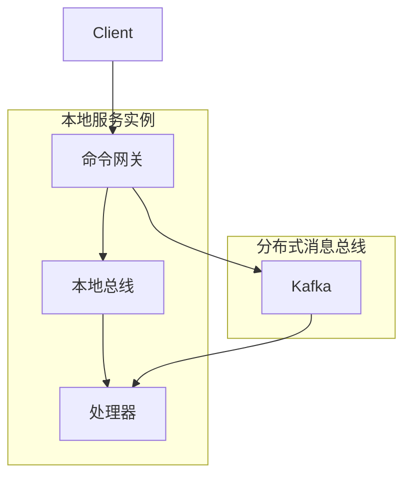

# 基础配置

本文档涵盖 Wow 框架的基本配置选项。

## WowProperties

- 配置类: [WowProperties](https://github.com/Ahoo-Wang/Wow/blob/main/wow-spring-boot-starter/src/main/kotlin/me/ahoo/wow/spring/boot/starter/WowProperties.kt)
- 前缀: `wow`

| 名称 | 数据类型 | 描述 | 默认值 |
|------|-----------|-------------|---------------|
| `enabled` | Boolean | 启用/禁用 Wow 框架 | `true` |
| `context-name` | String | 服务的限界上下文名称 | `${spring.application.name}` |
| `shutdown-timeout` | Duration | 优雅关闭超时时间 | `60s` |

**YAML 配置示例**

```yaml
wow:
  enabled: true
  context-name: order-service
  shutdown-timeout: 120s
```

## BusProperties

`BusProperties` 是 `CommandBus`、`EventBus` 和 `StateEventBus` 的公共配置。

- 配置类: [BusProperties](https://github.com/Ahoo-Wang/Wow/blob/main/wow-spring-boot-starter/src/main/kotlin/me/ahoo/wow/spring/boot/starter/BusProperties.kt)

| 名称 | 数据类型 | 描述 | 默认值 |
|------|-----------|-------------|---------------|
| `type` | BusType | 消息总线实现类型 | `kafka` |
| `local-first` | LocalFirstProperties | LocalFirst 模式配置 | |

### BusType

```kotlin
enum class BusType {
    KAFKA,      // Apache Kafka（推荐用于生产环境）
    REDIS,      // Redis Streams
    IN_MEMORY,  // 内存（用于测试）
    NO_OP;      // 无操作（用于特殊情况）
}
```

### LocalFirstProperties

| 名称 | 数据类型 | 描述 | 默认值 |
|------|-----------|-------------|---------------|
| `enabled` | Boolean | 启用 LocalFirst 模式 | `true` |

**YAML 配置示例**

```yaml
wow:
  command:
    bus:
      type: kafka
      local-first:
        enabled: true
  event:
    bus:
      type: kafka
      local-first:
        enabled: true
```

## LocalFirst 模式

LocalFirst 模式通过优先本地消息消费来优化命令和事件处理：



### 优势

1. **减少延迟**: 本地消息处理避免网络往返
2. **更好的资源利用**: 在分布式之前最大化本地处理
3. **容错**: 失败的本地消息通过分布式总线重试

### 配置

```yaml
wow:
  command:
    bus:
      type: kafka
      local-first:
        enabled: true  # 默认值为 true
  event:
    bus:
      type: kafka
      local-first:
        enabled: true
```

## 环境特定配置

### 开发环境

```yaml
wow:
  command:
    bus:
      type: in_memory
  event:
    bus:
      type: in_memory
  eventsourcing:
    store:
      storage: in_memory
    snapshot:
      storage: in_memory
```

### 生产环境

```yaml
wow:
  command:
    bus:
      type: kafka
      local-first:
        enabled: true
  event:
    bus:
      type: kafka
      local-first:
        enabled: true
  eventsourcing:
    store:
      storage: mongo
    snapshot:
      enabled: true
      strategy: version_offset
      version-offset: 10
      storage: mongo
```

## 完整配置示例

```yaml
spring:
  application:
    name: order-service

wow:
  enabled: true
  context-name: order-service
  shutdown-timeout: 120s

  command:
    bus:
      type: kafka
      local-first:
        enabled: true

  event:
    bus:
      type: kafka
      local-first:
        enabled: true

  eventsourcing:
    store:
      storage: mongo
    snapshot:
      enabled: true
      strategy: version_offset
      version-offset: 10
      storage: mongo
    state:
      bus:
        type: kafka
        local-first:
          enabled: true

  kafka:
    bootstrap-servers:
      - kafka-0:9092
      - kafka-1:9092
      - kafka-2:9092
    topic-prefix: 'wow.'

  mongo:
    enabled: true
    auto-init-schema: true

  openapi:
    enabled: true

  webflux:
    enabled: true
    global-error:
      enabled: true
```
