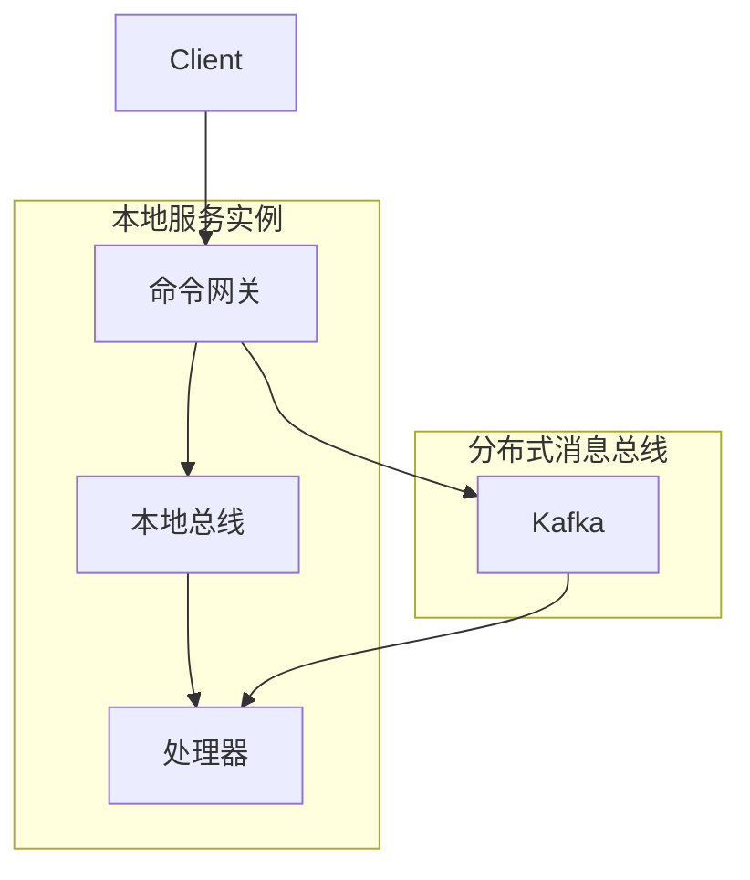

# 核心配置

## WowProperties

- 配置类：[WowProperties](https://github.com/Ahoo-Wang/Wow/blob/main/wow-spring-boot-starter/src/main/kotlin/me/ahoo/wow/spring/boot/starter/WowProperties.kt)
- 前缀：`wow`

| 名称 | 数据类型 | 描述 | 默认值 |
|------|-----------|-------------|---------------|
| `enabled` | Boolean | 启用/禁用 Wow 框架 | `true` |
| `context-name` | String | 服务的限界上下文名称 | 回退为（必需的）`spring.application.name` |
| `shutdown-timeout` | Duration | 优雅停机超时时间 | `60s` |

```yaml
wow:
  enabled: true
  context-name: order-service
  shutdown-timeout: 120s
```

## BusProperties

`BusProperties` 是 `CommandBus`、`EventBus` 和 `StateEventBus` 的公共配置。

- 配置类：[BusProperties](https://github.com/Ahoo-Wang/Wow/blob/main/wow-spring-boot-starter/src/main/kotlin/me/ahoo/wow/spring/boot/starter/BusProperties.kt)

| 名称 | 数据类型 | 描述 | 默认值 |
|------|-----------|-------------|---------------|
| `type` | BusType | 消息总线实现类型 | `kafka` |
| `local-first` | LocalFirstProperties | LocalFirst 模式配置 | |

### BusType

```kotlin
enum class BusType {
    KAFKA,      // Apache Kafka（生产环境推荐）
    REDIS,      // Redis Streams
    IN_MEMORY,  // 内存模式（用于测试）
    NO_OP;      // 无操作模式（用于特殊场景）
}
```

### LocalFirst 模式

LocalFirst 模式通过优先在本地消费消息而非通过分布式消息总线来优化命令和事件处理：



#### 优势

1. **降低延迟**：本地消息处理避免了网络往返
2. **更好的资源利用率**：在分发到分布式总线之前最大化本地处理
3. **容错能力**：失败的本地消息通过分布式总线重试

| 名称 | 数据类型 | 描述 | 默认值 |
|------|-----------|-------------|---------------|
| `local-first.enabled` | Boolean | 启用 LocalFirst 模式 | `true` |

## 命令总线

- 配置类：[CommandProperties](https://github.com/Ahoo-Wang/Wow/blob/main/wow-spring-boot-starter/src/main/kotlin/me/ahoo/wow/spring/boot/starter/command/CommandProperties.kt)
- 前缀：`wow.command.`

| 名称 | 数据类型 | 描述 | 默认值 |
|------|-----------|-------------|---------------|
| `bus` | `BusProperties` | 命令总线配置 | |
| `idempotency` | `IdempotencyProperties` | 命令幂等性 | |

```yaml
wow:
  command:
    bus:
      type: kafka
      local-first:
        enabled: true
    idempotency:
      enabled: true
      bloom-filter:
        expected-insertions: 1000000
        ttl: PT60S
        fpp: 0.00001
```

### IdempotencyProperties

- 配置类：[IdempotencyProperties](https://github.com/Ahoo-Wang/Wow/blob/main/wow-spring-boot-starter/src/main/kotlin/me/ahoo/wow/spring/boot/starter/command/CommandProperties.kt)

| 名称 | 数据类型 | 描述 | 默认值 |
|------|-----------|-------------|---------------|
| `enabled` | `boolean` | 是否启用 | `true` |
| `bloom-filter` | `BloomFilter` | 布隆过滤器 | |

#### BloomFilter

| 名称 | 数据类型 | 描述 | 默认值 |
|------|-----------|-------------|---------------|
| `ttl` | `Duration` | 存活时间 | `Duration.ofMinutes(1)` |
| `expected-insertions` | `Long` | 预期插入数量 | `1000_000` |
| `fpp` | `Double` | 误判率 | `0.00001` |

## 事件总线

- 配置类：[EventProperties](https://github.com/Ahoo-Wang/Wow/blob/main/wow-spring-boot-starter/src/main/kotlin/me/ahoo/wow/spring/boot/starter/event/EventProperties.kt)
- 前缀：`wow.event.`

| 名称 | 数据类型 | 描述 | 默认值 |
|------|-----------|-------------|---------------|
| `bus` | `BusProperties` | 事件总线配置 | |

```yaml
wow:
  event:
    bus:
      type: kafka
      local-first:
        enabled: true
```

## 事件溯源

### EventStoreProperties

- 配置类：[EventStoreProperties](https://github.com/Ahoo-Wang/Wow/blob/main/wow-spring-boot-starter/src/main/kotlin/me/ahoo/wow/spring/boot/starter/eventsourcing/store/EventStoreProperties.kt)
- 前缀：`wow.eventsourcing.store`

| 名称 | 数据类型 | 描述 | 默认值 |
|------|-----------|-------------|---------------|
| `storage` | `StorageType` | 事件存储后端 | `mongo` |

```yaml
wow:
  eventsourcing:
    store:
      storage: mongo
```

#### StorageType

`StorageType` 枚举由事件存储和快照存储共享使用。

```kotlin
enum class StorageType {
    MONGO,
    REDIS,
    ELASTICSEARCH,
    IN_MEMORY,
    DELAY
    ;
}
```

### SnapshotProperties

- 配置类：[SnapshotProperties](https://github.com/Ahoo-Wang/Wow/blob/main/wow-spring-boot-starter/src/main/kotlin/me/ahoo/wow/spring/boot/starter/eventsourcing/snapshot/SnapshotProperties.kt)
- 前缀：`wow.eventsourcing.snapshot`

| 名称 | 数据类型 | 描述 | 默认值 |
|------|-----------|-------------|---------------|
| `enabled` | `Boolean` | 是否启用快照 | `true` |
| `strategy` | `Strategy` | 快照策略 | `all` |
| `version-offset` | `Int` | 版本偏移阈值 | `5` |
| `storage` | `StorageType` | 快照存储后端 | `mongo` |

```yaml
wow:
  eventsourcing:
    snapshot:
      enabled: true
      strategy: version_offset
      version-offset: 10
      storage: mongo
```

#### Strategy

```kotlin
enum class Strategy {
    ALL,
    VERSION_OFFSET,
    ;
}
```

快照的 `storage` 属性复用共享的 [`StorageType`](#storagetype) 枚举。

### SnapshotCheckpointProperties

将最新的快照版本作为不可变检查点持久化（`VersionIntervalCheckpointStrategy`），按固定的聚合版本间隔写入。检查点可通过 `VersionedSnapshotStore.loadAtOrBefore` 获取，应用可借此从较近的版本恢复，而无需重放完整历史——但该开关仅增加检查点的写入，本身并不改变投影或重建行为。

- 配置类：[SnapshotCheckpointProperties](https://github.com/Ahoo-Wang/Wow/blob/main/wow-spring-boot-starter/src/main/kotlin/me/ahoo/wow/spring/boot/starter/eventsourcing/snapshot/SnapshotProperties.kt)
- 前缀：`wow.eventsourcing.snapshot.checkpoint`

| 名称 | 数据类型 | 描述 | 默认值 |
|------|-----------|-------------|---------------|
| `enabled` | `Boolean` | 持久化快照版本检查点 | `false` |
| `version-interval` | `Int` | 持久化检查点的版本间隔；必须为正数 | `100` |

```yaml
wow:
  eventsourcing:
    snapshot:
      checkpoint:
        enabled: true
        version-interval: 100
```

### StorageRoutingProperties

将不同的聚合路由到单个服务内的不同存储后端。当配置了匹配的路由时，Wow 会安装一个
`RoutingEventStore` / `RoutingSnapshotStore`，按聚合并分派到绑定的存储，对于未列出的聚合则
回退到默认存储（`wow.eventsourcing.store.storage` / `wow.eventsourcing.snapshot.storage`）。

- 配置类：[StorageRoutingProperties](https://github.com/Ahoo-Wang/Wow/blob/main/wow-spring-boot-starter/src/main/kotlin/me/ahoo/wow/spring/boot/starter/eventsourcing/routing/StorageRoutingProperties.kt)
- 前缀：`wow.eventsourcing.storage-routing`

| 名称 | 数据类型 | 描述 | 默认值 |
|------|-----------|-------------|---------------|
| `aggregates` | `Map<String, AggregateStorageRouteProperties>` | 按聚合名称索引的逐聚合路由 | `{}`（空） |

每个聚合路由接受一个 `event` 和/或 `snapshot` 通道。**配置的通道必须设置 `storage` 或 `binding` 二者之一**——空通道（如 `event: {}`）会在启动时快速失败。只有完全省略通道才会回退到默认存储。

| 名称 | 数据类型 | 描述 | 默认值 |
|------|-----------|-------------|---------------|
| `storage` | `StorageType` | 该通道的存储后端（覆盖默认值） | _（`binding` 缺失时必填）_ |
| `binding` | `String` | 要使用的已绑定存储/查询服务 Bean 名称 | _（`storage` 缺失时必填）_ |

```yaml
wow:
  eventsourcing:
    storage-routing:
      aggregates:
        # 热点聚合：将事件和快照保留在 Redis 中以实现低延迟
        HotAggregate:
          event:
            storage: redis
          snapshot:
            storage: redis
        # 冷聚合：回退到默认的 MongoDB 存储
        # （无需路由条目 —— 应用默认值）
```

## 状态事件总线

- 配置类：[StateProperties](https://github.com/Ahoo-Wang/Wow/blob/main/wow-spring-boot-starter/src/main/kotlin/me/ahoo/wow/spring/boot/starter/eventsourcing/state/StateProperties.kt)
- 前缀：`wow.eventsourcing.state`

| 名称 | 数据类型 | 描述 | 默认值 |
|------|-----------|-------------|---------------|
| `bus` | `BusProperties` | 状态事件总线配置 | |

```yaml
wow:
  eventsourcing:
    state:
      bus:
        type: kafka
        local-first:
          enabled: true
```

## Prepare Key

- 前缀：`wow.prepare`

| 名称 | 数据类型 | 描述 | 默认值 |
|------|-----------|-------------|---------------|
| `enabled` | Boolean | 启用 PrepareKey 功能 | `true` |
| `storage` | PrepareStorage | PrepareKey 存储后端 | `MONGO` |
| `base-packages` | List\<String\> | 扫描 PrepareKey 定义的基础包路径 | `[]` |

### PrepareStorage 值

| 值 | 描述 |
|-------|-------------|
| `MONGO` | MongoDB（推荐） |
| `REDIS` | Redis |

```yaml
wow:
  prepare:
    enabled: true
    storage: mongo
    base-packages:
      - com.example.domain
```

## 环境特定配置

### 开发环境

```yaml
wow:
  command:
    bus:
      type: in_memory
  event:
    bus:
      type: in_memory
  eventsourcing:
    store:
      storage: in_memory
    snapshot:
      storage: in_memory
```

### 生产环境

```yaml
wow:
  command:
    bus:
      type: kafka
      local-first:
        enabled: true
  event:
    bus:
      type: kafka
      local-first:
        enabled: true
  eventsourcing:
    store:
      storage: mongo
    snapshot:
      enabled: true
      strategy: version_offset
      version-offset: 10
      storage: mongo
```

## 完整配置示例

```yaml
spring:
  application:
    name: order-service

wow:
  enabled: true
  context-name: order-service
  shutdown-timeout: 120s

  command:
    bus:
      type: kafka
      local-first:
        enabled: true

  event:
    bus:
      type: kafka
      local-first:
        enabled: true

  eventsourcing:
    store:
      storage: mongo
    snapshot:
      enabled: true
      strategy: version_offset
      version-offset: 10
      storage: mongo
    state:
      bus:
        type: kafka
        local-first:
          enabled: true

  kafka:
    bootstrap-servers:
      - kafka-0:9092
      - kafka-1:9092
      - kafka-2:9092
    topic-prefix: 'wow.'

  mongo:
    enabled: true
    auto-init-schema: true

  openapi:
    enabled: true

  webflux:
    enabled: true
    global-error:
      enabled: true
```
