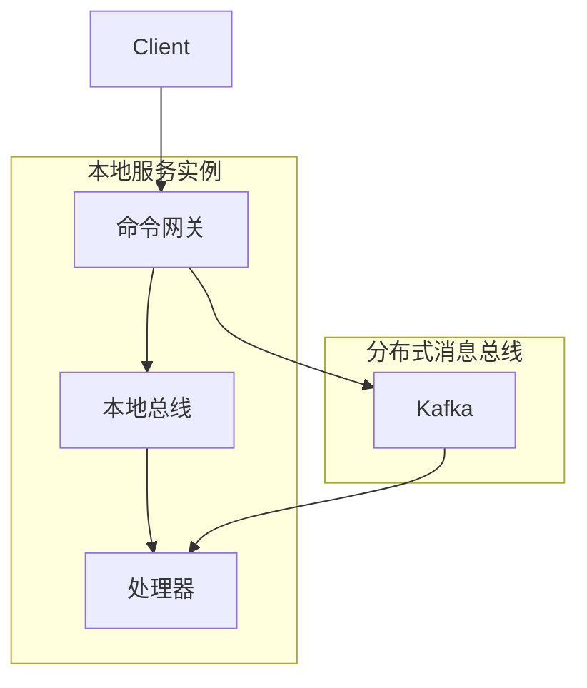

# 核心配置

## WowProperties

- 配置类：[WowProperties](https://github.com/Ahoo-Wang/Wow/blob/main/wow-spring-boot-starter/src/main/kotlin/me/ahoo/wow/spring/boot/starter/WowProperties.kt)
- 前缀：`wow`

| 名称 | 数据类型 | 描述 | 默认值 |
|------|-----------|-------------|---------------|
| `enabled` | Boolean | 启用/禁用 Wow 框架 | `true` |
| `context-name` | String | 服务的限界上下文名称 | `${spring.application.name}` |
| `shutdown-timeout` | Duration | 优雅停机超时时间 | `60s` |

```yaml
wow:
  enabled: true
  context-name: order-service
  shutdown-timeout: 120s
```

## DispatcherProperties

Command、Domain Event、Projection 与 Stateless Saga 可以独立配置顺序分片数和
每个命名聚合类型的 Scheduler worker 数：

| 完整属性 | 数据类型 | 描述 | 默认值 |
|------|-----------|-------------|---------------|
| `wow.command.dispatcher.stripe-count` | Int | 命令顺序分片数 | `64 × CPU` |
| `wow.command.dispatcher.scheduler-pool-size` | Int | 每个命令聚合类型的 worker 数 | `CPU` |
| `wow.event.dispatcher.stripe-count` | Int | 领域事件顺序分片数 | `64 × CPU` |
| `wow.event.dispatcher.scheduler-pool-size` | Int | 每个事件聚合类型的 worker 数 | `CPU` |
| `wow.projection.dispatcher.stripe-count` | Int | Projection 顺序分片数 | `64 × CPU` |
| `wow.projection.dispatcher.scheduler-pool-size` | Int | 每个 Projection 聚合类型的 worker 数 | `CPU` |
| `wow.saga.stateless.dispatcher.stripe-count` | Int | Stateless Saga 顺序分片数 | `64 × CPU` |
| `wow.saga.stateless.dispatcher.scheduler-pool-size` | Int | 每个 Stateless Saga 聚合类型的 worker 数 | `CPU` |

所有值必须大于 `0`。`scheduler-pool-size` 是每个命名聚合类型的 pool 大小，不是角色
总线程上限。未配置时仍兼容 JVM system properties `wow.parallelism` 和
`reactor.schedulers.defaultPoolSize`。完整示例与调优边界见[配置指南](../../guide/configuration.md#dispatcher-调优)。

## BusProperties

`BusProperties` 是 `CommandBus`、`EventBus` 和 `StateEventBus` 的公共配置。

- 配置类：[BusProperties](https://github.com/Ahoo-Wang/Wow/blob/main/wow-spring-boot-starter/src/main/kotlin/me/ahoo/wow/spring/boot/starter/BusProperties.kt)

| 名称 | 数据类型 | 描述 | 默认值 |
|------|-----------|-------------|---------------|
| `type` | BusType | 消息总线实现类型 | `kafka` |
| `local-first` | LocalFirstProperties | LocalFirst 模式配置 | |

### BusType

```kotlin
enum class BusType {
    KAFKA,      // Apache Kafka（生产环境推荐）
    REDIS,      // Redis Streams
    IN_MEMORY,  // 内存模式（用于测试）
    NO_OP;      // 无操作模式（用于特殊场景）
}
```

### LocalFirst 模式

LocalFirst 模式通过优先在本地消费消息而非通过分布式消息总线来优化命令和事件处理：



#### 优势

1. **降低延迟**：本地消息处理避免了网络往返
2. **更好的资源利用率**：在分发到分布式总线之前最大化本地处理
3. **容错能力**：失败的本地消息通过分布式总线重试

| 名称 | 数据类型 | 描述 | 默认值 |
|------|-----------|-------------|---------------|
| `local-first.enabled` | Boolean | 启用 LocalFirst 模式 | `true` |

## 命令总线

- 配置类：[CommandProperties](https://github.com/Ahoo-Wang/Wow/blob/main/wow-spring-boot-starter/src/main/kotlin/me/ahoo/wow/spring/boot/starter/command/CommandProperties.kt)
- 前缀：`wow.command.`

| 名称 | 数据类型 | 描述 | 默认值 |
|------|-----------|-------------|---------------|
| `bus` | `BusProperties` | 命令总线配置 | |
| `idempotency` | `IdempotencyProperties` | 命令幂等性 | |

```yaml
wow:
  command:
    bus:
      type: kafka
      local-first:
        enabled: true
    idempotency:
      enabled: true
      bloom-filter:
        expected-insertions: 1000000
        ttl: PT60S
        fpp: 0.00001
```

### IdempotencyProperties

- 配置类：[IdempotencyProperties](https://github.com/Ahoo-Wang/Wow/blob/main/wow-spring-boot-starter/src/main/kotlin/me/ahoo/wow/spring/boot/starter/command/CommandProperties.kt)

| 名称 | 数据类型 | 描述 | 默认值 |
|------|-----------|-------------|---------------|
| `enabled` | `boolean` | 是否启用 | `true` |
| `bloom-filter` | `BloomFilter` | 布隆过滤器 | |

#### BloomFilter

| 名称 | 数据类型 | 描述 | 默认值 |
|------|-----------|-------------|---------------|
| `ttl` | `Duration` | 存活时间 | `Duration.ofMinutes(1)` |
| `expected-insertions` | `Long` | 预期插入数量 | `1000_000` |
| `fpp` | `Double` | 误判率 | `0.00001` |

## 事件总线

- 配置类：[EventProperties](https://github.com/Ahoo-Wang/Wow/blob/main/wow-spring-boot-starter/src/main/kotlin/me/ahoo/wow/spring/boot/starter/event/EventProperties.kt)
- 前缀：`wow.event.`

| 名称 | 数据类型 | 描述 | 默认值 |
|------|-----------|-------------|---------------|
| `bus` | `BusProperties` | 事件总线配置 | |

```yaml
wow:
  event:
    bus:
      type: kafka
      local-first:
        enabled: true
```

## 事件溯源

### EventStoreProperties

- 配置类：[EventStoreProperties](https://github.com/Ahoo-Wang/Wow/blob/main/wow-spring-boot-starter/src/main/kotlin/me/ahoo/wow/spring/boot/starter/eventsourcing/store/EventStoreProperties.kt)
- 前缀：`wow.eventsourcing.store`

| 名称 | 数据类型 | 描述 | 默认值 |
|------|-----------|-------------|---------------|
| `storage` | `EventStoreStorage` | 事件存储后端 | `mongo` |

```yaml
wow:
  eventsourcing:
    store:
      storage: mongo
```

#### EventStoreStorage

```kotlin
enum class EventStoreStorage {
    MONGO,
    REDIS,
    IN_MEMORY,
    DELAY
    ;
}
```

### SnapshotProperties

- 配置类：[SnapshotProperties](https://github.com/Ahoo-Wang/Wow/blob/main/wow-spring-boot-starter/src/main/kotlin/me/ahoo/wow/spring/boot/starter/eventsourcing/snapshot/SnapshotProperties.kt)
- 前缀：`wow.eventsourcing.snapshot`

| 名称 | 数据类型 | 描述 | 默认值 |
|------|-----------|-------------|---------------|
| `enabled` | `Boolean` | 是否启用快照 | `true` |
| `strategy` | `Strategy` | 快照策略 | `all` |
| `version-offset` | `Int` | 版本偏移阈值 | `5` |
| `storage` | `SnapshotStorage` | 快照存储后端 | `mongo` |

```yaml
wow:
  eventsourcing:
    snapshot:
      enabled: true
      strategy: version_offset
      version-offset: 10
      storage: mongo
```

#### Strategy

```kotlin
enum class Strategy {
    ALL,
    VERSION_OFFSET,
    ;
}
```

#### SnapshotStorage

```kotlin
enum class SnapshotStorage {
    MONGO,
    REDIS,
    ELASTICSEARCH,
    IN_MEMORY,
    DELAY
    ;
}
```

## 状态事件总线

- 配置类：[StateProperties](https://github.com/Ahoo-Wang/Wow/blob/main/wow-spring-boot-starter/src/main/kotlin/me/ahoo/wow/spring/boot/starter/eventsourcing/state/StateProperties.kt)
- 前缀：`wow.eventsourcing.state`

| 名称 | 数据类型 | 描述 | 默认值 |
|------|-----------|-------------|---------------|
| `bus` | `BusProperties` | 状态事件总线配置 | |

```yaml
wow:
  eventsourcing:
    state:
      bus:
        type: kafka
        local-first:
          enabled: true
```

## Prepare Key

- 前缀：`wow.prepare`

| 名称 | 数据类型 | 描述 | 默认值 |
|------|-----------|-------------|---------------|
| `enabled` | Boolean | 启用 PrepareKey 功能 | `true` |
| `storage` | PrepareStorage | PrepareKey 存储后端 | `MONGO` |
| `base-packages` | List\<String\> | 扫描 PrepareKey 定义的基础包路径 | `[]` |

### PrepareStorage 值

| 值 | 描述 |
|-------|-------------|
| `MONGO` | MongoDB（推荐） |
| `REDIS` | Redis |

```yaml
wow:
  prepare:
    enabled: true
    storage: mongo
    base-packages:
      - com.example.domain
```

## 环境特定配置

### 开发环境

```yaml
wow:
  command:
    bus:
      type: in_memory
  event:
    bus:
      type: in_memory
  eventsourcing:
    store:
      storage: in_memory
    snapshot:
      storage: in_memory
```

### 生产环境

```yaml
wow:
  command:
    bus:
      type: kafka
      local-first:
        enabled: true
  event:
    bus:
      type: kafka
      local-first:
        enabled: true
  eventsourcing:
    store:
      storage: mongo
    snapshot:
      enabled: true
      strategy: version_offset
      version-offset: 10
      storage: mongo
```

## 完整配置示例

```yaml
spring:
  application:
    name: order-service

wow:
  enabled: true
  context-name: order-service
  shutdown-timeout: 120s

  command:
    bus:
      type: kafka
      local-first:
        enabled: true

  event:
    bus:
      type: kafka
      local-first:
        enabled: true

  eventsourcing:
    store:
      storage: mongo
    snapshot:
      enabled: true
      strategy: version_offset
      version-offset: 10
      storage: mongo
    state:
      bus:
        type: kafka
        local-first:
          enabled: true

  kafka:
    bootstrap-servers:
      - kafka-0:9092
      - kafka-1:9092
      - kafka-2:9092
    topic-prefix: 'wow.'

  mongo:
    enabled: true
    auto-init-schema: true

  openapi:
    enabled: true

  webflux:
    enabled: true
    global-error:
      enabled: true
```
