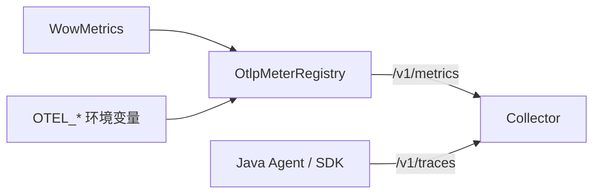

# 可观测性配置

本页严格区分 Wow instrumentation 开关与 exporter 配置。Wow 创建语义指标和 span；Spring Boot、
Micrometer、OpenTelemetry SDK/Agent 以及目标 backend 决定它们发送到哪里。

## OpenAPI

| 属性 | 类型 | 默认值 | 作用 |
|---|---|---|---|
| `wow.openapi.enabled` | Boolean | `true` | 注册运行时 Wow OpenAPI 路由与 schema |

```yaml
wow:
  openapi:
    enabled: true
```

compiler 生成命令元数据，但 `OpenAPIAutoConfiguration` 根据运行时注册信息组装文档。应把最终 spec 视为
部署后的运行时产物。本地生成成功不能证明目标镜像、路由安全或网关策略已经生效。

## OpenTelemetry

| 属性 | 类型 | 默认值 | 作用 |
|---|---|---|---|
| `wow.opentelemetry.enabled` | Boolean | `true` | 注册 Wow tracing filter 与受支持 Bean decorator |

```yaml
wow:
  opentelemetry:
    enabled: true
```

条件还要求类路径中存在 `me.ahoo.wow.opentelemetry.WowInstrumenter`。设为 `false` 只关闭 Wow 埋点，不会
停止 Java Agent、SDK exporter、HTTP client span 或其他库。模块使用 `GlobalOpenTelemetry`，必须在 Wow
instrumenter 创建前完成初始化。

## 指标

| 属性 | 类型 | 默认值 | 作用 |
|---|---|---|---|
| `wow.metrics.enabled` | Boolean | `true` | 把 Wow 语义指标与 batch 指标记录到应用 Registry |

```yaml
wow:
  metrics:
    enabled: true
```

启用且存在 `MeterRegistry` 时，自动配置创建实例作用域 `WowMetrics` 并装饰运行时；禁用或没有 Registry
时使用 `WowMetrics.NONE`。该开关与 `wow.opentelemetry.enabled` 相互独立，trace 和 metric 可以分别启用。

## 商业智能脚本

`wow.bi.script.enabled` 控制 `/wow/bi/script` 操作路由、对应 OpenAPI operation 与 BI inspector 自动配置。
完整 `wow.bi.script.*` 配置树及其生产归属规则见 [BI 部署与恢复](/zh/guide/bi-operations)。关闭路由不会
停止已有 ClickHouse consumer，也不会修改 BI 数据。

## 集成设置

先明确所需证据：

| 证据 | 必须由谁确认 |
|---|---|
| 进程内存在 meter | Actuator metrics endpoint 或 Registry 检查 |
| Prometheus 导出 | target scrape 成功且已存储 series |
| OTLP 指标导出 | 至少一个 export step 后 Collector/backend 已收到 |
| Wow trace 导出 | Collector/backend 收到包含 Wow instrumentation scope 与属性的 trace |
| 生产 readiness | 部署 revision、真实流量、告警路由与 backend 对账 |

### 启用指标导出（Prometheus）

加入 Actuator 与 Prometheus Registry：

```kotlin
implementation("org.springframework.boot:spring-boot-starter-actuator")
runtimeOnly("io.micrometer:micrometer-registry-prometheus")
```

只暴露部署策略允许的 endpoint：

```yaml
management:
  endpoints:
    web:
      exposure:
        include:
          - health
          - prometheus
  metrics:
    tags:
      application: ${spring.application.name}
```

Prometheus 抓取 `/actuator/prometheus`。Micrometer 逻辑 Timer `wow.operation` 会按 Prometheus 规则导出为
`wow_operation_seconds_count`、`wow_operation_seconds_sum` 等；`wow.stream.messages` 则成为
`wow_stream_messages_total` 一类 Counter。必须用真实流量核对 label 与值，不能只检查 endpoint HTTP 状态。

排查进程内 Registry 时可临时暴露 `metrics`：

```yaml
management:
  endpoints:
    web:
      exposure:
        include: [health, metrics]
```

查询 `/actuator/metrics/wow.operation` 后移除或限制诊断 endpoint。该检查只证明采集；Prometheus target
页面和查询结果才证明 scrape/export。

### 通过 OTLP 导出指标（OpenTelemetry Collector）

Wow 指标仍是 Micrometer 指标。项目当前 Spring Boot 4.1.1 基线需要 Boot OpenTelemetry 运行时支持与
Micrometer OTLP Registry：

```kotlin
implementation("org.springframework.boot:spring-boot-starter-actuator")
runtimeOnly("org.springframework.boot:spring-boot-opentelemetry")
runtimeOnly("io.micrometer:micrometer-registry-otlp")
```

仓库测试覆盖的默认环境变量路径是：

```bash
export OTEL_SERVICE_NAME=order-service
export OTEL_EXPORTER_OTLP_ENDPOINT=http://otel-collector:4318
export OTEL_EXPORTER_OTLP_HEADERS="authorization=Bearer token" # 可选。
```

OTLP metrics Registry 通过 HTTP protobuf 发送到 `/v1/metrics`；指标 endpoint 需要区别于共享 endpoint 时
使用 `OTEL_EXPORTER_OTLP_METRICS_ENDPOINT`。除非明确接受重复数据，否则不要再启用第二套 Micrometer
bridge。



仓库 smoke test 会启动真实 Boot context、导出 `wow.operation` 并解码 OTLP 请求。目标环境必须重复等价
检查，并保存 Collector/backend receipt 作为发布证据。

### 启用分布式链路追踪（OpenTelemetry）

请求 starter feature capability：

```kotlin
implementation("me.ahoo.wow:wow-spring-boot-starter") {
    capabilities {
        requireCapability("me.ahoo.wow:opentelemetry-support")
    }
}
```

生产运行时最短路径通常是 OpenTelemetry Java Agent：

```bash
export JAVA_TOOL_OPTIONS="-javaagent:/opt/otel/opentelemetry-javaagent.jar"
export OTEL_SERVICE_NAME=order-service
export OTEL_EXPORTER_OTLP_ENDPOINT=http://otel-collector:4318
java -jar your-app.jar
```

OTLP/HTTP 的通用 endpoint 通常得到 `/v1/traces`；使用 OTLP/gRPC 或不同 Collector 时应配置 signal-specific
protocol/endpoint。验收 trace 必须包含 Wow instrumentation scope、预期 aggregate/message 属性、store span
与下游处理 span。启动日志或本地 span 测试不能证明 Collector receipt 或生产准入。

阶段/span 映射见 [可观测性](/zh/guide/advanced/observability)，meter 目录见
[指标](/zh/guide/advanced/metrics)。

<!-- Sources: ConditionalOnOpenTelemetryEnabled.kt, ConditionalOnMetricsEnabled.kt, MetricsAutoConfiguration.kt,
OtlpMetricsExportSmokeTest.kt, OpenAPIAutoConfiguration.kt, BiScriptProperties.kt -->
