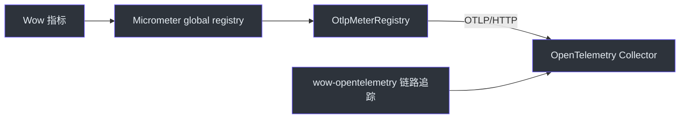

# 可观测性配置

## OpenAPI

| 属性 | 类型 | 默认值 | 描述 |
|----------|------|---------|-------------|
| `wow.openapi.enabled` | Boolean | `true` | 启用 OpenAPI 规范生成 |

```yaml
wow:
  openapi:
    enabled: true
```

启用后，Wow 会在**运行时**根据边界上下文中注册的命令和事件模型构建 OpenAPI 规范
（由 `OpenAPIAutoConfiguration` 构建的 `RouterSpecs` Bean）。`wow-compiler` 模块在编译期
贡献命令路由元数据，但规范本身——包括路由、Schema 和内置的 Swagger UI——是在应用上下文启动时组装的。

## OpenTelemetry

| 属性 | 类型 | 默认值 | 描述 |
|----------|------|---------|-------------|
| `wow.opentelemetry.enabled` | Boolean | `true` | 启用命令/事件管线的 OpenTelemetry 追踪埋点 |

```yaml
wow:
  opentelemetry:
    enabled: true
```

当 `wow-opentelemetry` 模块和 `WowInstrumenter` 类位于类路径上时，默认启用
（`matchIfMissing = true`）。设为 `false` 可禁用横跨命令总线、事件存储、投影和 Saga 的分布式追踪链路。

## 指标

| 属性 | 类型 | 默认值 | 描述 |
|----------|------|---------|-------------|
| `wow.metrics.enabled` | Boolean | `true` | 启用 Wow 特有的 Micrometer 指标采集 |

```yaml
wow:
  metrics:
    enabled: true
```

默认启用（`matchIfMissing = true`）。Spring 集成会在应用组件创建前，将此属性同时应用于
框架指标装饰器和 `wow.batch.*` 等核心指标；具体如何导出由选用的 Micrometer Registry 单独决定。

指标启用状态是进程级的。因此，同一 JVM 中同时存活的 Spring ApplicationContext 必须使用相同的
`wow.metrics.enabled` 值；配置冲突的 Context 会在启动阶段失败，避免以部分插桩状态运行。

## 商业智能脚本

`wow.bi.script.*` 配置树（ClickHouse/BI 脚本部署）请参阅
[BI 部署与恢复](/zh/guide/bi-operations) 页面。

## 集成设置

### 启用指标导出（Prometheus）

Wow 指标写入 Micrometer 的全局注册表。要通过 Prometheus 暴露指标，添加 Spring Boot Actuator + Prometheus 注册表依赖并暴露端点：

```yaml
management:
  endpoint:
    health:
      show-details: always
      probes:
        enabled: true
  endpoints:
    web:
      exposure:
        include:
          - health
          - prometheus    # Micrometer/Prometheus 抓取端点
          - threaddump
  metrics:
    tags:
      application: ${spring.application.name}   # 所有 meter 的公共标签

springdoc:
  show-actuator: true   # 在 OpenAPI 中包含 actuator 端点
```

```kotlin
implementation("org.springframework.boot:spring-boot-starter-actuator")
implementation("io.micrometer:micrometer-registry-prometheus")
```

从 Prometheus 抓取 `/actuator/prometheus` 端点。Wow 特有的 meter
（`wow.command.*`、`wow.eventstore.*`、`wow.snapshot.*`、`wow.projection.*` 等）将与标准
JVM/Reactor meter 一起出现。完整目录参见 [Metrics](/zh/guide/advanced/metrics)。

### 通过 OTLP 导出指标（OpenTelemetry Collector）

Wow 使用 Micrometer 记录指标；`wow-opentelemetry` 负责链路追踪埋点，并不导出 Micrometer
meter。要把 Wow 指标和应用标准指标发送到 OpenTelemetry Collector，请在应用中加入
Spring Boot Actuator 和 Micrometer OTLP Registry：

```kotlin
implementation("org.springframework.boot:spring-boot-starter-actuator")
runtimeOnly("io.micrometer:micrometer-registry-otlp")
```

配置 OTLP/HTTP Metrics 端点。Wow 当前通过 Micrometer global registry 记录框架指标，因此需要
保持 Spring Boot 的 global-registry bridge 开启：

```yaml
wow:
  metrics:
    enabled: true

management:
  metrics:
    use-global-registry: true
  otlp:
    metrics:
      export:
        enabled: ${OTEL_METRICS_ENABLED:true}
        url: ${OTEL_EXPORTER_OTLP_METRICS_ENDPOINT:http://otel-collector:4318/v1/metrics}
        step: 30s
  opentelemetry:
    resource-attributes:
      service.name: ${spring.application.name}
```


<!-- Sources: wow-core/src/main/kotlin/me/ahoo/wow/metrics/Metrics.kt, wow-core/src/main/kotlin/me/ahoo/wow/infra/batch/BatchMetrics.kt, wow-opentelemetry/build.gradle.kts -->

Registry 实现位于运行时类路径时，Spring Boot 会自动配置 `OtlpMeterRegistry`，并默认把它加入
Micrometer 的全局组合 Registry。不要设置 `management.metrics.use-global-registry=false`，否则通过
global registry 记录的 meter 无法进入 OTLP Registry。参见
[Spring Boot OTLP Metrics 文档](https://docs.spring.io/spring-boot/reference/actuator/metrics.html#actuator.metrics.export.otlp)
和 [Micrometer OTLP Registry 文档](https://docs.micrometer.io/micrometer/reference/implementations/otlp.html)。

验证接入时，可临时暴露 Actuator `metrics` 端点，产生真实流量后检查
`/actuator/metrics/wow.batch.write` 或其他 `wow.*` meter；随后等待一个配置的 `step`，再确认
Collector 或下游后端已经收到指标。Actuator 中可见只证明指标已采集，Collector 收到数据才证明
导出链路完整。批处理 meter 仅在存储启用 batching 并执行相应操作后出现。

### 启用分布式链路追踪（OpenTelemetry）

启用链路追踪的推荐方式是使用 OpenTelemetry Java Agent，它会在 Spring 上下文启动前引导初始化
`GlobalOpenTelemetry`：

```bash
java -javaagent:opentelemetry-javaagent.jar \
     -Dotel.service.name=${spring.application.name} \
     -Dotel.exporter.otlp.endpoint=http://otel-collector:4317 \
     -jar your-app.jar
```

在依赖中添加 `wow-opentelemetry`。自动配置会检测 Agent 已初始化的 `GlobalOpenTelemetry`，
并自动注册 Wow 追踪过滤器与装饰器。仅当需要禁用 Wow 的 span 但保留 Agent 的其他仪表时，
才设置 `wow.opentelemetry.enabled=false`。

```kotlin
implementation("me.ahoo.wow:wow-opentelemetry")
```

仪表覆盖范围参见 [可观测性](/zh/guide/advanced/observability)，
仪表器列表参见 [OpenTelemetry 扩展](/zh/guide/extensions/opentelemetry)。
