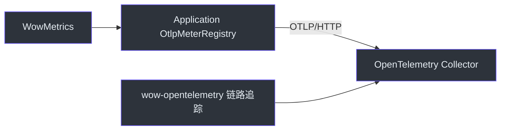

# 可观测性配置

## OpenAPI

| 属性 | 类型 | 默认值 | 描述 |
|----------|------|---------|-------------|
| `wow.openapi.enabled` | Boolean | `true` | 启用 OpenAPI 规范生成 |

```yaml
wow:
  openapi:
    enabled: true
```

启用后，Wow 会在**运行时**根据边界上下文中注册的命令和事件模型构建 OpenAPI 规范
（由 `OpenAPIAutoConfiguration` 构建的 `RouterSpecs` Bean）。`wow-compiler` 模块在编译期
贡献命令路由元数据，但规范本身——包括路由、Schema 和内置的 Swagger UI——是在应用上下文启动时组装的。

## OpenTelemetry

| 属性 | 类型 | 默认值 | 描述 |
|----------|------|---------|-------------|
| `wow.opentelemetry.enabled` | Boolean | `true` | 启用命令/事件管线的 OpenTelemetry 追踪埋点 |

```yaml
wow:
  opentelemetry:
    enabled: true
```

当 `wow-opentelemetry` 模块和 `WowInstrumenter` 类位于类路径上时，默认启用
（`matchIfMissing = true`）。设为 `false` 可禁用横跨命令总线、事件存储、投影和 Saga 的分布式追踪链路。

## 指标

| 属性 | 类型 | 默认值 | 描述 |
|----------|------|---------|-------------|
| `wow.metrics.enabled` | Boolean | `true` | 启用 Wow 特有的 Micrometer 指标采集 |

```yaml
wow:
  metrics:
    enabled: true
```

默认启用（`matchIfMissing = true`）。Spring 集成把当前 ApplicationContext 中的
`MeterRegistry` 注入一个上下文级 `WowMetrics` Bean，并由它统一驱动组件装饰器、dispatcher 和
`wow.batch.*`。没有 Registry 或显式关闭时使用 `WowMetrics.NONE`。

Wow 不使用 Micrometer global registry。多个 Spring ApplicationContext 可以分别选择 Registry
和 `wow.metrics.enabled` 值，彼此不会修改进程级全局状态。

## 商业智能脚本

`wow.bi.script.*` 配置树（ClickHouse/BI 脚本部署）请参阅
[BI 部署与恢复](/zh/guide/bi-operations) 页面。

## 集成设置

### 启用指标导出（Prometheus）

Wow 指标写入 Spring Boot 配置的应用 `MeterRegistry`。要通过 Prometheus 暴露指标，添加 Spring Boot Actuator + Prometheus Registry 依赖并暴露端点：

```yaml
management:
  endpoint:
    health:
      show-details: always
      probes:
        enabled: true
  endpoints:
    web:
      exposure:
        include:
          - health
          - prometheus    # Micrometer/Prometheus 抓取端点
          - threaddump
  metrics:
    tags:
      application: ${spring.application.name}   # 所有 meter 的公共标签

springdoc:
  show-actuator: true   # 在 OpenAPI 中包含 actuator 端点
```

```kotlin
implementation("org.springframework.boot:spring-boot-starter-actuator")
implementation("io.micrometer:micrometer-registry-prometheus")
```

从 Prometheus 抓取 `/actuator/prometheus` 端点。Wow 的 Micrometer meter ID 是
`wow.operation`、`wow.stream.*` 和 `wow.batch.*`；Actuator `metrics` endpoint 使用这些带点号的
逻辑 ID。Prometheus 在导出时应用自己的命名约定，例如：

| Micrometer meter ID | Prometheus series 示例 |
|---|---|
| `wow.operation`（Timer） | `wow_operation_seconds_count`、`wow_operation_seconds_sum` |
| `wow.stream.messages`（Counter） | `wow_stream_messages_total` |

Wow series 会与标准 JVM 及应用中其他已插桩的 meter 一起出现。通用 Reactor Core sequence 或
scheduler meter 只有在应用显式配置 `reactor-core-micrometer` 插桩后才会出现。Wow 完整目录参见
[Metrics](/zh/guide/advanced/metrics)；逻辑 meter ID 与导出名称的区别参见
[Spring Boot Metrics 文档](https://docs.spring.io/spring-boot/reference/actuator/metrics.html#actuator.metrics.endpoint)。

### 通过 OTLP 导出指标（OpenTelemetry Collector）

Wow 使用 Micrometer 记录指标；`wow-opentelemetry` 负责链路追踪埋点，并不导出 Micrometer
meter。要把 Wow 指标和应用标准指标发送到 OpenTelemetry Collector，请在应用中加入
Spring Boot Actuator 和 Micrometer OTLP Registry：

```kotlin
implementation("org.springframework.boot:spring-boot-starter-actuator")
runtimeOnly("io.micrometer:micrometer-registry-otlp")
```

配置 OTLP/HTTP Metrics 端点。Wow 会直接使用 Spring Boot 创建的 `OtlpMeterRegistry` Bean，
不需要 Micrometer global-registry bridge：

```yaml
wow:
  metrics:
    enabled: true

management:
  otlp:
    metrics:
      export:
        enabled: ${OTEL_METRICS_ENABLED:true}
        url: ${OTEL_EXPORTER_OTLP_METRICS_ENDPOINT:http://otel-collector:4318/v1/metrics}
        step: 30s
  opentelemetry:
    resource-attributes:
      service.name: ${spring.application.name}
```


<!-- Sources: wow-core/src/main/kotlin/me/ahoo/wow/metrics/WowMetrics.kt, wow-core/src/main/kotlin/me/ahoo/wow/infra/batch/BatchMetrics.kt, wow-spring-boot-starter/src/main/kotlin/me/ahoo/wow/spring/boot/starter/metrics/MetricsAutoConfiguration.kt -->

Registry 实现位于运行时类路径时，Spring Boot 会自动配置 `OtlpMeterRegistry`。Wow 注入这个应用
Registry，因此即使设置 `management.metrics.use-global-registry=false`，Wow meter 仍能进入 OTLP Registry。参见
[Spring Boot OTLP Metrics 文档](https://docs.spring.io/spring-boot/reference/actuator/metrics.html#actuator.metrics.export.otlp)
和 [Micrometer OTLP Registry 文档](https://docs.micrometer.io/micrometer/reference/implementations/otlp.html)。

验证接入时，先把 `metrics` 临时加入已有的 Actuator endpoint 暴露列表：

```yaml
management:
  endpoints:
    web:
      exposure:
        include:
          - health
          - prometheus
          - threaddump
          - metrics       # 临时诊断 endpoint
```

产生真实流量后检查 `/actuator/metrics/wow.operation`、
`/actuator/metrics/wow.batch.write` 或其他 `wow.*` meter；随后等待一个配置的 `step`，再确认
Collector 或下游后端已经收到指标。Actuator 中可见只证明指标已采集，Collector 收到数据才证明
导出链路完整。批处理 meter 仅在存储启用 batching 并执行相应操作后出现。验证完成后移除或限制
该诊断 endpoint。

### 启用分布式链路追踪（OpenTelemetry）

启用链路追踪的推荐方式是使用 OpenTelemetry Java Agent，它会在 Spring 上下文启动前引导初始化
`GlobalOpenTelemetry`：

```bash
java -javaagent:opentelemetry-javaagent.jar \
     -Dotel.service.name=${spring.application.name} \
     -Dotel.exporter.otlp.endpoint=http://otel-collector:4317 \
     -jar your-app.jar
```

在依赖中添加 `wow-opentelemetry`。自动配置会检测 Agent 已初始化的 `GlobalOpenTelemetry`，
并自动注册 Wow 追踪过滤器与装饰器。仅当需要禁用 Wow 的 span 但保留 Agent 的其他仪表时，
才设置 `wow.opentelemetry.enabled=false`。

```kotlin
implementation("me.ahoo.wow:wow-opentelemetry")
```

仪表覆盖范围参见 [可观测性](/zh/guide/advanced/observability)，
仪表器列表参见 [OpenTelemetry 扩展](/zh/guide/extensions/opentelemetry)。
