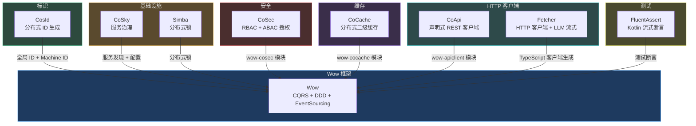

# 生态

## Wow 生态架构

Wow 生态由同一作者的开源项目组成，设计为无缝协同工作：

| 项目 | 在 Wow 中的角色 | Wow 模块 |
|---|---|---|
| **CosId** | 全局 ID、聚合 ID、machine ID 生成 | 内置依赖 |
| **CoSec** | 多租户响应式安全（RBAC + ABAC） | `wow-cosec` |
| **CoCache** | 分布式一致性二级缓存 | `wow-cocache` |
| **Simba** | 分布式锁服务 | 构建时依赖 |
| **CoSky** | 服务发现 + 配置管理 | 可选部署 |
| **CoApi** | Spring 6 声明式 HTTP 客户端 | `wow-apiclient` |
| **Fetcher** | HTTP 客户端生态 + TypeScript 客户端生成 | `wow-project-template` |
| **FluentAssert** | Kotlin 流式断言库 | `wow-test` |

## CQRS 资源

### 项目模板

- [基于 Wow 框架快速构建 DDD 项目的项目模板](https://github.com/Ahoo-Wang/wow-project-template)

### 书籍

- 《领域驱动设计：处理软件核心的复杂性》
- 《实现领域驱动设计》

### 免费电子书

- [CQRS Journey](https://msdn.microsoft.com/en-us/library/jj554200.aspx)

### 开源框架

- [Wow](https://github.com/Ahoo-Wang/Wow)：基于 DDD 和 EventSourcing 的现代响应式 CQRS 架构微服务开发框架
- [Axon Framework](https://github.com/AxonFramework/AxonFramework)：基于领域驱动设计（DDD）、命令查询职责分离（CQRS）和事件溯源原则构建演进式、事件驱动微服务的框架

### Awesome 列表

- [awesome-ddd](https://github.com/heynickc/awesome-ddd?tab=readme-ov-file#jvm)：领域驱动设计（DDD）、命令查询职责分离（CQRS）、事件溯源和事件风暴相关的精选资源列表

### 博客文章

- [Event Sourcing - Specifications](https://abdullin.com/post/event-sourcing-specifications/) @abdullin
- [Testing Event Sourcing](https://event-driven.io/en/testing_event_sourcing/) @event-driven
- [Event Sourcing and CQRS](https://www.eventstore.com/blog/event-sourcing-and-cqrs) @eventstore
- [Event Sourcing](https://martinfowler.com/eaaDev/EventSourcing.html) @martinfowler
- [Event Sourcing](https://docs.microsoft.com/en-us/azure/architecture/patterns/event-sourcing) @microsoft
- [Event Sourcing](https://microservices.io/patterns/data/event-sourcing.html) @microservices

## 微服务资源

- [Wow](https://github.com/Ahoo-Wang/Wow)：基于 DDD 和 EventSourcing 的现代响应式 CQRS 架构微服务开发框架
- [wow-project-template](https://github.com/Ahoo-Wang/wow-project-template)：基于 Wow 框架快速构建 DDD 项目的项目模板
- [FluentAssert](https://github.com/Ahoo-Wang/FluentAssert)：FluentAssert 是一个 Kotlin 库，为 JDK 类型提供流式断言，使你的测试更具可读性和表现力。该库使用 Kotlin 扩展函数包装 AssertJ 断言以提供更好的语法
- [Fetcher](https://github.com/Ahoo-Wang/Fetcher)：Fetcher 不仅仅是一个 HTTP 客户端——它是一个专为现代 Web 开发设计的完整生态系统，原生支持 LLM 流式 API。基于原生 Fetch API 构建，在保持极小体积的同时提供类 Axios 的使用体验
- [CosId](https://github.com/Ahoo-Wang/CosId)：通用、灵活、高性能的分布式 ID 生成器
- [CoSky](https://github.com/Ahoo-Wang/CoSky)：高性能、低成本的微服务治理平台
- [CoSec](https://github.com/Ahoo-Wang/CoSec)：基于 RBAC 和策略的多租户响应式安全框架
- [CoCache](https://github.com/Ahoo-Wang/CoCache)：分布式一致性二级缓存框架
- [Simba](https://github.com/Ahoo-Wang/Simba)：易用、灵活的分布式锁服务
- [CoApi](https://github.com/Ahoo-Wang/CoApi)：简化 Spring 6 中的 HTTP 客户端定义，提供零模板代码的自动配置，使接口调用更便捷高效
- [Nacos](https://github.com/alibaba/nacos)：阿里巴巴开源的用于构建云原生应用的平台，提供动态服务发现、配置管理和服务治理

## 响应式资源

- [Reactive Manifesto](https://www.reactivemanifesto.org/)
- [ReactiveX](http://reactivex.io/)
- [Reactive Streams](http://www.reactive-streams.org/)
- [Project Reactor](https://projectreactor.io/)
- [RxJava](https://github.com/ReactiveX/RxJava)

## Wow 生态

以下项目是 Wow 生态系统的一部分，旨在协同工作：

- **[CosId](https://github.com/Ahoo-Wang/CosId)** - 通用、灵活、高性能的分布式 ID 生成器
- **[CoSec](https://github.com/Ahoo-Wang/CoSec)** - 基于 RBAC 和策略的多租户响应式安全框架
- **[CoCache](https://github.com/Ahoo-Wang/CoCache)** - 分布式一致性二级缓存框架
- **[Simba](https://github.com/Ahoo-Wang/Simba)** - 易用、灵活的分布式锁服务
- **[CoSky](https://github.com/Ahoo-Wang/CoSky)** - 高性能、低成本的微服务治理平台
- **[FluentAssert](https://github.com/Ahoo-Wang/FluentAssert)** - 用于编写可读且富有表现力的测试的 Kotlin 流式断言库
