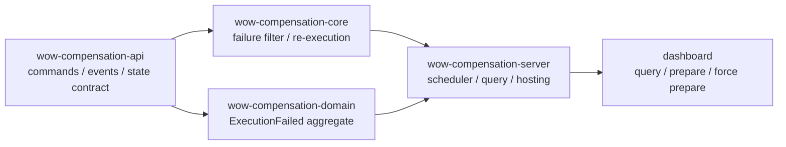
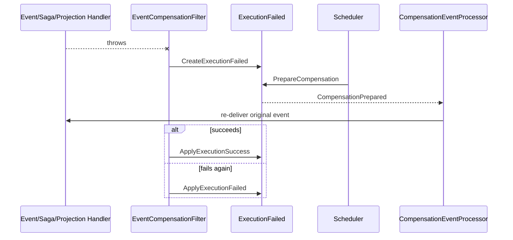

# 事件补偿

[`compensation`](https://github.com/Ahoo-Wang/Wow/tree/main/compensation) 本身就是一个 Wow 应用：订阅函数失败时创建 `ExecutionFailed` 聚合，调度器或人工操作准备重试，框架重新投递原事件，并把新结果写回同一聚合。

## 模块划分



| 模块 | 责任 | 精确源码 |
| --- | --- | --- |
| `wow-compensation-api` | `ExecutionFailed` 命令、事件、状态和重试规格 | [`api` 包](https://github.com/Ahoo-Wang/Wow/tree/main/compensation/wow-compensation-api/src/main/kotlin/me/ahoo/wow/compensation/api) |
| `wow-compensation-core` | 捕获处理失败、创建/更新失败记录、重新投递原事件 | [`CompensationFilter.kt`](https://github.com/Ahoo-Wang/Wow/blob/main/compensation/wow-compensation-core/src/main/kotlin/me/ahoo/wow/compensation/core/CompensationFilter.kt#L47-L126)、[`CompensationEventProcessor.kt`](https://github.com/Ahoo-Wang/Wow/blob/main/compensation/wow-compensation-core/src/main/kotlin/me/ahoo/wow/compensation/core/CompensationEventProcessor.kt#L27-L56) |
| `wow-compensation-domain` | `ExecutionFailed` 决策、状态机和退避计算 | [`ExecutionFailed.kt`](https://github.com/Ahoo-Wang/Wow/blob/main/compensation/wow-compensation-domain/src/main/kotlin/me/ahoo/wow/compensation/domain/ExecutionFailed.kt#L36-L142)、[`ExecutionFailedState.kt`](https://github.com/Ahoo-Wang/Wow/blob/main/compensation/wow-compensation-domain/src/main/kotlin/me/ahoo/wow/compensation/domain/ExecutionFailedState.kt#L35-L99) |
| `wow-compensation-server` | 查询到期失败项并发送准备命令 | [`CompensationScheduler.kt`](https://github.com/Ahoo-Wang/Wow/blob/main/compensation/wow-compensation-server/src/main/kotlin/me/ahoo/wow/compensation/server/scheduler/CompensationScheduler.kt#L29-L76)、[`SnapshotFindNextRetry.kt`](https://github.com/Ahoo-Wang/Wow/blob/main/compensation/wow-compensation-server/src/main/kotlin/me/ahoo/wow/compensation/server/failed/SnapshotFindNextRetry.kt) |
| `dashboard` | 失败队列、详情、重试规格、准备与强制准备 | [`FailedView.tsx`](https://github.com/Ahoo-Wang/Wow/blob/main/compensation/dashboard/src/features/Failed/FailedView.tsx)、[`Actions.tsx`](https://github.com/Ahoo-Wang/Wow/blob/main/compensation/dashboard/src/features/Failed/Actions.tsx#L64-L224) |

## 架构概览



### 工作原理

1. [`EventCompensationFilter`](https://github.com/Ahoo-Wang/Wow/blob/main/compensation/wow-compensation-core/src/main/kotlin/me/ahoo/wow/compensation/core/CompensationFilter.kt#L68-L126) 位于事件处理、Saga、投影和快照链路；函数抛错且未显式关闭重试时，它记录 eventId、函数、错误、执行时间、重试规格和 recoverable。
2. 首次失败发送 `CreateExecutionFailed`；补偿重放再次失败时，header 中已有 compensationId，改发 `ApplyExecutionFailed`。重放成功则发 `ApplyExecutionSuccess`。
3. [`SnapshotFindNextRetry`](https://github.com/Ahoo-Wang/Wow/blob/main/compensation/wow-compensation-server/src/main/kotlin/me/ahoo/wow/compensation/server/failed/SnapshotFindNextRetry.kt) 只选择可恢复/未知、未超过重试阈值且已到 `nextRetryAt` 的记录；PREPARED 记录还必须超时。
4. [`CompensationEventProcessor`](https://github.com/Ahoo-Wang/Wow/blob/main/compensation/wow-compensation-core/src/main/kotlin/me/ahoo/wow/compensation/core/CompensationEventProcessor.kt#L36-L56) 只重放本地聚合的原事件版本，并把目标函数和失败记录 ID 作为补偿目标。

```text
CreateExecutionFailed -> FAILED
Prepare/ForcePrepare  -> PREPARED
ApplyExecutionFailed  -> FAILED
ApplyExecutionSuccess -> SUCCEEDED
```

`RetryState` 保存 `retries`、`retryAt`、`timeoutAt`、`nextRetryAt`；[`NextRetryAtCalculator`](https://github.com/Ahoo-Wang/Wow/blob/main/compensation/wow-compensation-domain/src/main/kotlin/me/ahoo/wow/compensation/domain/NextRetryAtCalculator.kt) 使用 `minBackoff * 2^retries` 秒并对负数和溢出做校验。

### ExecutionFailed 聚合命令

| 命令 | 领域决策 | 事件/结果 |
| --- | --- | --- |
| `CreateExecutionFailed` | 校验/补全重试规格，计算初始 retryState | `ExecutionFailedCreated`, `FAILED` |
| `PrepareCompensation` | `canRetry()` 才允许 | `CompensationPrepared`, `PREPARED` |
| `ForcePrepareCompensation` | 忽略重试次数阈值，但成功项仍不可重试；PREPARED 必须已超时 | `CompensationPrepared` |
| `ApplyExecutionFailed` | 仅 `PREPARED` 可写入 | `ExecutionFailedApplied`, 回到 `FAILED` |
| `ApplyExecutionSuccess` | 仅 `PREPARED` 可写入 | `ExecutionSuccessApplied`, `SUCCEEDED` |
| `ApplyRetrySpec` | 非负且不能产生时间溢出 | `RetrySpecApplied` |
| `MarkRecoverable` / `ChangeFunction` | 新值必须与当前值不同 | `RecoverableMarked` / `FunctionChanged` |

## 功能特性

先验证领域、补偿过滤器和控制台：

```shell
./gradlew :wow-compensation-domain:check :wow-compensation-core:check
pnpm --dir compensation/dashboard test
```

预期 Gradle 和 Vitest 都成功退出。领域状态机的主证据是 [`ExecutionFailedSpec`](https://github.com/Ahoo-Wang/Wow/blob/main/compensation/wow-compensation-domain/src/test/kotlin/me/ahoo/wow/compensation/domain/ExecutionFailedSpec.kt#L61-L376)；过滤器的首次失败、再次失败和成功写回由 [`CompensationFilterTest`](https://github.com/Ahoo-Wang/Wow/blob/main/compensation/wow-compensation-core/src/test/kotlin/me/ahoo/wow/compensation/core/CompensationFilterTest.kt) 覆盖。

服务需要可用的持久化配置；配置完成后运行：

```shell
./gradlew :wow-compensation-server:run
pnpm --dir compensation/dashboard dev
```

不要从上下文名猜命令 URL。dashboard 的当前[生成 OpenAPI 客户端](https://github.com/Ahoo-Wang/Wow/blob/main/compensation/dashboard/src/generated/compensation/execution_failed/commandClient.ts#L8-L20) 明确给出：

```text
PUT /execution_failed/{id}/prepare_compensation
PUT /execution_failed/{id}/force_prepare_compensation
PUT /execution_failed/{id}/apply_retry_spec
```

对一个已存在且可重试的失败记录执行：

```shell
curl -X PUT \
  'http://localhost:8080/execution_failed/<execution-id>/prepare_compensation' \
  -H 'Command-Wait-Stage: PROCESSED' \
  -H 'Command-Request-Id: prepare-<execution-id>'
```

预期命令结果 `succeeded=true`、`stage=PROCESSED`，dashboard 刷新后状态为 `PREPARED`；处理器重放成功后变为 `SUCCEEDED`，再次失败则回到 `FAILED` 并更新错误与下一次重试时间。dashboard 实际调用与成功/失败提示见 [`Actions.tsx`](https://github.com/Ahoo-Wang/Wow/blob/main/compensation/dashboard/src/features/Failed/Actions.tsx#L72-L119)。

失败行为必须保留：对 PREPARED 记录重复普通 prepare 会被拒绝；对 FAILED/SUCCEEDED 记录直接 apply success/failure 会得到 `ExecutionFailed is not prepared.`；超过重试次数后普通 prepare 关闭，但 force prepare 仍受成功状态和 PREPARED 超时约束；负重试值或指数退避溢出会在聚合内失败。dashboard 的按钮禁用只是提示，最终决定仍由服务端状态机作出。

## 控制台截图


## 详细文档

接入、存储、调度和告警配置见[事件补偿指南](../../guide/event-compensation)。本页的完成标准是：三个检查命令通过，能从处理器异常追踪到失败聚合，再从 `CompensationPrepared` 追踪到成功或再次失败，并能用生成客户端证明人工操作路径。
