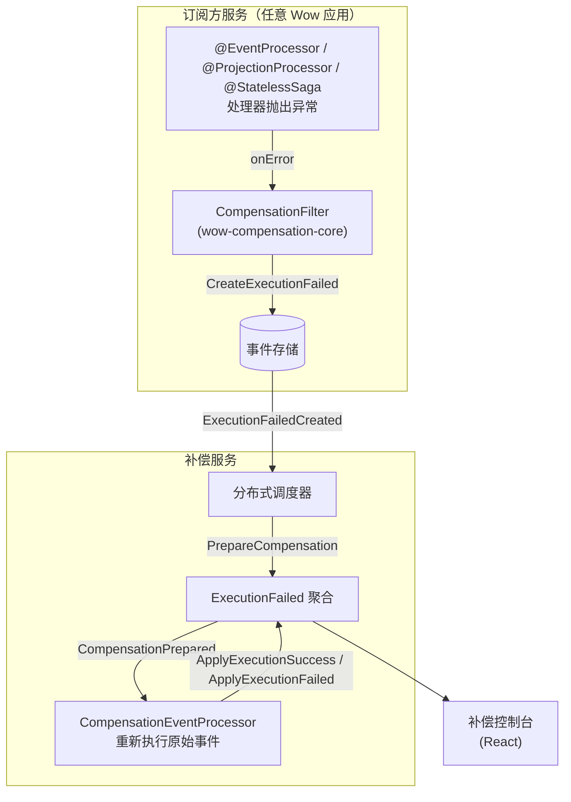

# 事件补偿

_[事件补偿](https://github.com/Ahoo-Wang/Wow/tree/main/compensation)_ 是一个基于 _Wow_ 框架开发的真实应用案例，用于处理和恢复因事件处理失败而导致的数据不一致性。

## 模块划分

| 模块                      | 说明                                                                                       |
|-------------------------|------------------------------------------------------------------------------------------|
| wow-compensation-api    | API 层，定义聚合命令（Command）、领域事件（Domain Event）以及查询视图模型（Query View Model）。                       |
| wow-compensation-core   | 核心层，包含补偿机制的核心实现。                                                                         |
| wow-compensation-domain | 领域层，包含聚合根和业务约束的实现。                                                                       |
| wow-compensation-server | 宿主服务，应用程序的启动点。负责整合其他模块，并提供应用程序的入口。                                                       |
| dashboard               | 前端控制台，基于 React + TypeScript + Vite 开发，提供可视化的事件补偿管理界面。                                           |

## 架构概览

补偿系统本身就是一个基于 Wow 的应用。当任意订阅方服务的事件处理器失败时，补偿基础设施将该失败记录为 `ExecutionFailed` 聚合，并使用指数退避自动重试。

### 工作原理

1. **失败检测**：当订阅方的事件处理器抛出异常时，由 `wow-compensation-core` 注册的 `CompensationFilter` 捕获错误，发送 `CreateExecutionFailed` 命令，创建一个 `ExecutionFailed` 聚合，记录事件 ID、处理器、函数、错误信息和重试规格。

2. **自动重试**：补偿服务的分布式调度器查询待处理的 `ExecutionFailed` 聚合（status=FAILED, nextRetryAt ≤ now），发送 `PrepareCompensation` 命令。`NextRetryAtCalculator` 使用指数退避（`minBackoff * 2^retries`）计算下一次重试时间。

3. **重新执行**：`CompensationEventProcessor` 处理 `CompensationPrepared` 事件，将原始领域事件重新投递给目标处理器，并根据结果发送 `ApplyExecutionSuccess` 或 `ApplyExecutionFailed`。

4. **状态机**：每个 `ExecutionFailed` 经过 `FAILED → PREPARED → SUCCEEDED`（或回到 `FAILED` 进行下一轮重试）的状态转换。

### ExecutionFailed 聚合命令

| 命令 | 触发方式 | 效果 |
|---|---|---|
| `CreateExecutionFailed` | 处理器错误（自动） | 创建失败记录，包含重试规格 |
| `PrepareCompensation` | 调度器触发 | 标记执行为待重试，计算下次重试时间 |
| `ForcePrepareCompensation` | 控制台手动操作 | 强制立即准备重试 |
| `ApplyExecutionFailed` | 重新执行失败 | 记录新错误，调度下次重试 |
| `ApplyExecutionSuccess` | 重新执行成功 | 标记执行为 SUCCEEDED |
| `ApplyRetrySpec` | 控制台配置变更 | 更新 maxRetries/minBackoff/executionTimeout |

## 功能特性

- **分布式自动补偿**：智能解决系统数据最终一致性问题
- **可视化控制台**：直观监控和管理补偿事件
- **企业微信通知**：及时接收执行失败通知
- **OpenAPI 接口**：方便集成和调用

## 控制台截图

## 详细文档

关于事件补偿的详细使用说明，请参阅 [事件补偿指南](../../guide/event-compensation)。
