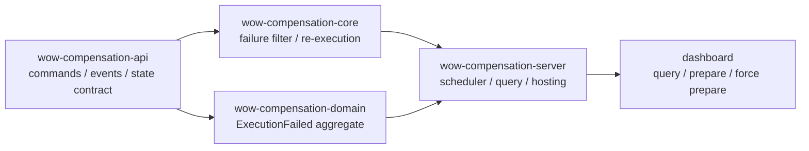
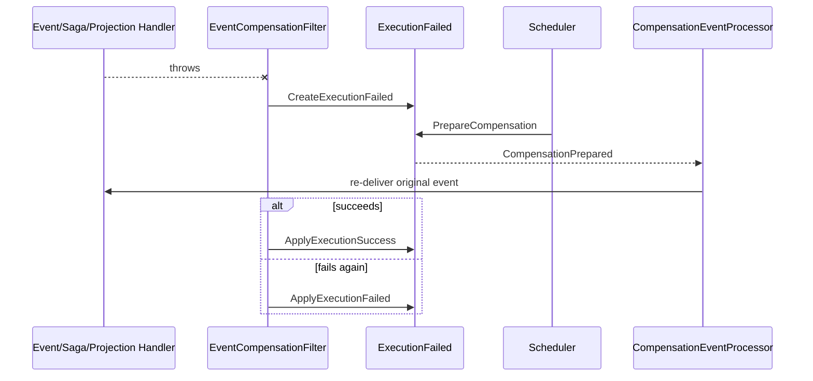

# 事件补偿

[`compensation`](https://github.com/Ahoo-Wang/Wow/tree/main/compensation) 本身就是一个 Wow 应用：订阅函数失败时创建 `ExecutionFailed` 聚合，调度器或人工操作准备重试，框架重新投递原事件，并把新结果写回同一聚合。

## 模块划分



| 模块 | 责任 | 精确源码 |
| --- | --- | --- |
| `wow-compensation-api` | `ExecutionFailed` 命令、事件、状态和重试规格 | [`api` 包](https://github.com/Ahoo-Wang/Wow/tree/main/compensation/wow-compensation-api/src/main/kotlin/me/ahoo/wow/compensation/api) |
| `wow-compensation-core` | 捕获处理失败、创建/更新失败记录、重新投递原事件 | [`CompensationFilter.kt`](https://github.com/Ahoo-Wang/Wow/blob/main/compensation/wow-compensation-core/src/main/kotlin/me/ahoo/wow/compensation/core/CompensationFilter.kt#L47-L126)、[`CompensationEventProcessor.kt`](https://github.com/Ahoo-Wang/Wow/blob/main/compensation/wow-compensation-core/src/main/kotlin/me/ahoo/wow/compensation/core/CompensationEventProcessor.kt#L27-L56) |
| `wow-compensation-domain` | `ExecutionFailed` 决策、状态机和退避计算 | [`ExecutionFailed.kt`](https://github.com/Ahoo-Wang/Wow/blob/main/compensation/wow-compensation-domain/src/main/kotlin/me/ahoo/wow/compensation/domain/ExecutionFailed.kt#L36-L142)、[`ExecutionFailedState.kt`](https://github.com/Ahoo-Wang/Wow/blob/main/compensation/wow-compensation-domain/src/main/kotlin/me/ahoo/wow/compensation/domain/ExecutionFailedState.kt#L35-L99) |
| `wow-compensation-server` | 查询到期失败项并发送准备命令 | [`CompensationScheduler.kt`](https://github.com/Ahoo-Wang/Wow/blob/main/compensation/wow-compensation-server/src/main/kotlin/me/ahoo/wow/compensation/server/scheduler/CompensationScheduler.kt#L29-L76)、[`SnapshotFindNextRetry.kt`](https://github.com/Ahoo-Wang/Wow/blob/main/compensation/wow-compensation-server/src/main/kotlin/me/ahoo/wow/compensation/server/failed/SnapshotFindNextRetry.kt) |
| `dashboard` | 失败队列、详情、重试规格、准备与强制准备 | [`FailedView.tsx`](https://github.com/Ahoo-Wang/Wow/blob/main/compensation/dashboard/src/features/Failed/FailedView.tsx)、[`Actions.tsx`](https://github.com/Ahoo-Wang/Wow/blob/main/compensation/dashboard/src/features/Failed/Actions.tsx#L64-L224) |

## 架构概览



### 工作原理

1. [`EventCompensationFilter`](https://github.com/Ahoo-Wang/Wow/blob/main/compensation/wow-compensation-core/src/main/kotlin/me/ahoo/wow/compensation/core/CompensationFilter.kt#L68-L126) 位于事件处理、Saga、投影和快照链路；函数抛错且未显式关闭重试时，它记录 eventId、函数、错误、执行时间、重试规格和 recoverable。
2. 首次失败发送 `CreateExecutionFailed`；补偿重放再次失败时，header 中已有 compensationId，改发 `ApplyExecutionFailed`。重放成功则发 `ApplyExecutionSuccess`。
3. [`SnapshotFindNextRetry`](https://github.com/Ahoo-Wang/Wow/blob/main/compensation/wow-compensation-server/src/main/kotlin/me/ahoo/wow/compensation/server/failed/SnapshotFindNextRetry.kt) 只选择可恢复/未知、未超过重试阈值且已到 `nextRetryAt` 的记录；PREPARED 记录还必须超时。
4. [`CompensationEventProcessor`](https://github.com/Ahoo-Wang/Wow/blob/main/compensation/wow-compensation-core/src/main/kotlin/me/ahoo/wow/compensation/core/CompensationEventProcessor.kt#L36-L56) 只重放本地聚合的原事件版本，并把目标函数和失败记录 ID 作为补偿目标。

```text
CreateExecutionFailed -> FAILED
Prepare/ForcePrepare  -> PREPARED
ApplyExecutionFailed  -> FAILED
ApplyExecutionSuccess -> SUCCEEDED
```

`RetryState` 保存 `retries`、`retryAt`、`timeoutAt`、`nextRetryAt`；[`NextRetryAtCalculator`](https://github.com/Ahoo-Wang/Wow/blob/main/compensation/wow-compensation-domain/src/main/kotlin/me/ahoo/wow/compensation/domain/NextRetryAtCalculator.kt) 使用 `minBackoff * 2^retries` 秒并对负数和溢出做校验。

### ExecutionFailed 聚合命令

| 命令 | 领域决策 | 事件/结果 |
| --- | --- | --- |
| `CreateExecutionFailed` | 校验/补全重试规格，计算初始 retryState | `ExecutionFailedCreated`, `FAILED` |
| `PrepareCompensation` | `FAILED`，或已超时的 `PREPARED`，且重试次数低于上限 | `CompensationPrepared`, `PREPARED` |
| `ForcePrepareCompensation` | 忽略重试次数阈值，但成功项仍不可重试；PREPARED 必须已超时 | `CompensationPrepared` |
| `ApplyExecutionFailed` | 仅 `PREPARED` 可写入 | `ExecutionFailedApplied`, 回到 `FAILED` |
| `ApplyExecutionSuccess` | 仅 `PREPARED` 可写入 | `ExecutionSuccessApplied`, `SUCCEEDED` |
| `ApplyRetrySpec` | 非负且不能产生时间溢出 | `RetrySpecApplied` |
| `MarkRecoverable` / `ChangeFunction` | 新值必须与当前值不同 | `RecoverableMarked` / `FunctionChanged` |

## 功能特性

先验证领域、补偿过滤器和控制台：

```shell
./gradlew :wow-compensation-domain:check :wow-compensation-core:check
pnpm --dir compensation/dashboard exec vitest run
```

预期 Gradle 和 Vitest 都成功退出。领域状态机的主证据是 [`ExecutionFailedSpec`](https://github.com/Ahoo-Wang/Wow/blob/main/compensation/wow-compensation-domain/src/test/kotlin/me/ahoo/wow/compensation/domain/ExecutionFailedSpec.kt#L61-L376)；过滤器的首次失败、再次失败和成功写回由 [`CompensationFilterTest`](https://github.com/Ahoo-Wang/Wow/blob/main/compensation/wow-compensation-core/src/test/kotlin/me/ahoo/wow/compensation/core/CompensationFilterTest.kt) 覆盖。

从 clean checkout 做无持久化启动验证时，不要直接用 Gradle `run`：当前 [`applicationDefaultJvmArgs`](https://github.com/Ahoo-Wang/Wow/blob/main/compensation/wow-compensation-server/build.gradle.kts#L43-L63) 会开启 JMX 5555，且关闭认证和 TLS。项目没有 `bootJar` 任务；安全的最小路径是先生成 distribution，再用普通 `java` 启动真实主类。下面的完整命令已验证能在 `18083` 启动到 Netty；它只适合路由和本地状态机验证，进程退出后数据会丢失，也不会运行自动调度：

```shell
./gradlew :wow-compensation-server:installDist

SERVER_PORT=18083 \
SPRING_AUTOCONFIGURE_EXCLUDE='org.springframework.boot.elasticsearch.autoconfigure.ElasticsearchClientAutoConfiguration,org.springframework.boot.elasticsearch.autoconfigure.ElasticsearchRestClientAutoConfiguration,org.springframework.boot.data.redis.autoconfigure.DataRedisReactiveAutoConfiguration,org.springframework.boot.mongodb.autoconfigure.MongoAutoConfiguration,org.springframework.boot.mongodb.autoconfigure.MongoReactiveAutoConfiguration' \
COSID_MACHINE_DISTRIBUTOR_TYPE=manual \
COSID_MACHINE_DISTRIBUTOR_MANUAL_MACHINE_ID=1 \
WOW_COMPENSATION_SCHEDULER_ENABLED=false \
WOW_COMPENSATION_WEBHOOK_WEIXIN_URL=false \
WOW_KAFKA_ENABLED=false \
WOW_COMMAND_BUS_TYPE=in_memory \
WOW_EVENT_BUS_TYPE=in_memory \
WOW_EVENTSOURCING_STATE_BUS_TYPE=in_memory \
WOW_EVENTSOURCING_STORE_STORAGE=in_memory \
WOW_EVENTSOURCING_SNAPSHOT_STORAGE=in_memory \
WOW_PREPARE_ENABLED=false \
WOW_MONGO_ENABLED=false \
WOW_REDIS_ENABLED=false \
WOW_ELASTICSEARCH_ENABLED=false \
java \
  -Dspring.config.location=file:compensation/wow-compensation-server/src/main/resources/application.yaml \
  -cp 'compensation/wow-compensation-server/build/install/wow-compensation-server/lib/*' \
  me.ahoo.wow.compensation.server.CompensationServerKt
```

预期日志包含 `Netty started on port 18083` 和 `Started CompensationServerKt`。在另一个终端核对同一端口：

```shell
curl -fsS http://localhost:18083/actuator/health/liveness
curl -fsS http://localhost:18083/v3/api-docs | \
  jq -r '.paths["/execution_failed/{id}/prepare_compensation"].put.operationId'
```

预期分别得到 `{"status":"UP"}` 和 `compensation.execution_failed.prepare_compensation`。该进程的 JVM 命令行只包含显式 config 参数，实际 TCP listener 只有 `18083`，没有 JMX `5555`。

WebHook 没有独立的 `enabled` 配置；当前 [`@ConditionalOnProperty`](https://github.com/Ahoo-Wang/Wow/blob/main/compensation/wow-compensation-server/src/main/kotlin/me/ahoo/wow/compensation/server/webhook/weixin/ConditionalOnWeiXinWebHookEnabled.kt#L16-L20) 把字面量 `false` 视为关闭，因此不会注册 [`WeiXinWebHook` 事件处理器](https://github.com/Ahoo-Wang/Wow/blob/main/compensation/wow-compensation-server/src/main/kotlin/me/ahoo/wow/compensation/server/webhook/weixin/WeiXinWebHook.kt#L36-L42)。不要使用 `http://localhost:1/`：非 `false` URL 会启用处理器，默认失败事件会尝试向 loopback 投递并记录连接失败。

验证持久化补偿时，仍用 distribution 的直接 `java` 路径，配置真实 MongoDB、Redis、Kafka、scheduler 和 WebHook，再去掉上述内存/禁用覆盖。只有在可信隔离环境明确需要 JMX 时，才考虑 Gradle `run` 的当前默认参数。dashboard 单独运行：

```shell
pnpm --dir compensation/dashboard dev
```

不要从上下文名猜命令 URL。dashboard 的当前[生成 OpenAPI 客户端](https://github.com/Ahoo-Wang/Wow/blob/main/compensation/dashboard/src/generated/compensation/execution_failed/commandClient.ts#L8-L20) 明确给出：

```text
PUT /execution_failed/{id}/prepare_compensation
PUT /execution_failed/{id}/force_prepare_compensation
PUT /execution_failed/{id}/apply_retry_spec
```

对一个已存在且可重试的失败记录执行：

```shell
curl -X PUT \
  'http://localhost:18083/execution_failed/<execution-id>/prepare_compensation' \
  -H 'Command-Wait-Stage: PROCESSED' \
  -H 'Command-Request-Id: prepare-<execution-id>'
```

`succeeded=true`、`stage=PROCESSED` 只证明 prepare 命令已处理，不能保证随后读取时仍能看到 `PREPARED`：重放可能尚未开始而仍读到旧 `FAILED`，短暂处于 `PREPARED`，或已经落到最终 `SUCCEEDED`/新的 `FAILED`。若要观察 snapshot 或处理函数，应选择对应等待阶段，轮询生成的 snapshot/event 查询端点，并核对状态事件历史，而不是对一次即时读取作断言。dashboard 实际调用与成功/失败提示见 [`Actions.tsx`](https://github.com/Ahoo-Wang/Wow/blob/main/compensation/dashboard/src/features/Failed/Actions.tsx#L72-L119)。

失败行为必须保留：普通 prepare 只拒绝尚未超时的 `PREPARED`；已超时且低于重试上限时可以再次 prepare。`SUCCEEDED` 或达到上限时普通 prepare 被拒绝；对 `FAILED`/`SUCCEEDED` 直接 apply success/failure 会得到 `ExecutionFailed is not prepared.`；force prepare 仍受成功状态和 PREPARED 超时约束；负重试值或指数退避溢出会在聚合内失败。dashboard 的按钮禁用只是提示，最终决定仍由服务端状态机作出。

## 控制台截图


## 详细文档

接入、存储、调度和告警配置见[事件补偿指南](../../guide/event-compensation)。本页的完成标准是：三个检查命令通过，能从处理器异常追踪到失败聚合，再从 `CompensationPrepared` 追踪到成功或再次失败，并能用生成客户端证明人工操作路径。
