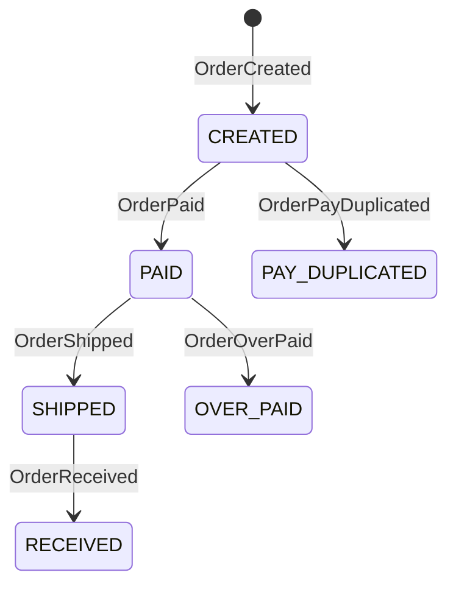

# 订单系统

[订单系统示例](https://github.com/Ahoo-Wang/Wow/tree/main/example/) 是一个基于 Wow 框架构建的领域驱动微服务的综合示例项目。该示例展示了聚合建模、事件溯源、CQRS 模式和基于 Saga 的分布式事务。

## 项目结构

```
example/
├── example-api/                    # API 层 - 命令、事件、模型
│   └── src/main/kotlin/me/ahoo/wow/example/api/order/
│       ├── OrderStatus.kt          # 订单状态枚举
│       ├── OrderItem.kt            # 订单项模型
│       ├── OrderProduct.kt         # 产品信息
│       ├── OrderPackage.kt         # 订单包裹模型
│       ├── CreateOrder.kt          # 创建订单命令
│       ├── PayOrder.kt             # 支付订单命令
│       ├── ShipOrder.kt            # 发货命令
│       ├── OrderCreated.kt         # 订单创建事件
│       ├── OrderPaid.kt            # 订单支付事件
│       └── ...
├── example-domain/                 # 域层 - 业务逻辑
│   └── src/main/kotlin/me/ahoo/wow/example/domain/order/
│       ├── Order.kt                # 命令聚合根
│       ├── OrderState.kt           # 状态聚合根
│       ├── OrderSaga.kt            # 订单 Saga
│       ├── CreateOrderSpec.kt      # 业务规范
│       └── src/test/kotlin/        # 域测试
├── example-server/                 # 服务层 - 基础设施
│   └── src/main/kotlin/me/ahoo/wow/example/server/order/
│       ├── OrderEventProcessor.kt  # 事件处理器
│       ├── OrderProjector.kt       # 投影处理器
│       ├── OrderRepository.kt      # 仓库实现
│       └── OrderQueryController.kt # 查询控制器
```

## 领域模型

### 聚合模式

订单示例使用**聚合模式**来分离命令处理和状态管理：

```kotlin
// 命令聚合根 - 处理命令
@AggregateRoot
@AggregateRoute(resourceName = "sales-order", owner = AggregateRoute.Owner.ALWAYS)
class Order(private val state: OrderState) {

    fun onCommand(createOrder: CreateOrder): OrderCreated {
        // 验证业务规则
        require(createOrder.items.isNotEmpty()) {
            "订单项不能为空"
        }
        // 返回领域事件
        return OrderCreated(
            orderId = command.aggregateId.id,
            items = createOrder.items.map { ... },
            address = createOrder.address
        )
    }

    fun onCommand(payOrder: PayOrder): Iterable<*> {
        // 对于复杂工作流程返回多个事件
        if (state.status == OrderStatus.CREATED) {
            return listOf(OrderPaid(payOrder.amount))
        }
        return listOf(OrderPayDuplicated(...))
    }
}

// 状态聚合根 - 维护状态
class OrderState(val id: String) : StatusCapable<OrderStatus> {
    var items: List<OrderItem> = listOf()
        private set
    var totalAmount: BigDecimal = BigDecimal.ZERO
        private set
    var status = OrderStatus.CREATED
        private set

    fun onSourcing(orderCreated: OrderCreated) {
        items = orderCreated.items
        totalAmount = orderCreated.items.sumOf { it.totalPrice }
        status = OrderStatus.CREATED
    }

    fun onSourcing(orderPaid: OrderPaid) {
        paidAmount = paidAmount.plus(orderPaid.amount)
        if (orderPaid.paid) {
            status = OrderStatus.PAID
        }
    }
}
```

## 订单状态机



## 命令和事件

### 命令

| 命令 | 描述 | 参数 |
|------|------|------|
| `CreateOrder` | 创建新订单 | items, address, fromCart |
| `ChangeAddress` | 更改收货地址 | shippingAddress |
| `PayOrder` | 处理支付 | paymentId, amount |
| `ShipOrder` | 发货订单 | trackingNumber |
| `ReceiptOrder` | 标记订单已收货 | - |

### 事件

| 事件 | 描述 | 载荷 |
|------|------|------|
| `OrderCreated` | 订单已创建 | orderId, items, address |
| `AddressChanged` | 收货地址已更改 | shippingAddress |
| `OrderPaid` | 支付已接收 | amount, paid |
| `OrderShipped` | 订单已发货 | trackingNumber |
| `OrderReceived` | 订单已送达 | - |
| `OrderPayDuplicated` | 重复支付尝试 | paymentId, errorMsg |
| `OrderOverPaid` | 检测到超额支付 | paymentId, overPayAmount |

## Saga 模式

订单示例展示了 Saga 如何协调分布式事务：

```kotlin
@StatelessSaga
class OrderSaga {

    fun onEvent(orderCreated: OrderCreated): Mono<Void> {
        // 订单创建后从购物车中移除商品
        if (orderCreated.fromCart) {
            return sendCommand(RemoveCartItem(...))
        }
        return Mono.empty()
    }

    fun onStateEvent(orderPaid: OrderPaid, state: OrderState): Mono<Void> {
        // 支付后触发发货工作流程
        return sendCommand(ShipOrder(...))
    }
}
```

## 业务规范

业务规范封装了复杂的验证规则：

```kotlin
class CreateOrderSpec(
    private val inventoryService: InventoryService
) {

    suspend fun require(item: CreateOrder.Item): OrderItem {
        val product = inventoryService.getProduct(item.productId)
            ?: throw IllegalArgumentException("未找到产品: ${item.productId}")
        require(item.quantity <= product.stock) {
            "产品库存不足: ${item.productId}"
        }
        return OrderItem(
            id = GlobalIdGenerator.generateAsString(),
            productId = item.productId,
            price = product.price,
            quantity = item.quantity
        )
    }
}
```

## 投影

投影维护优化的读模型：

```kotlin
@ProjectionProcessor
class OrderProjector {

    fun onEvent(orderCreated: OrderCreated) {
        // 更新读模型
        val summary = OrderSummary(
            orderId = orderCreated.orderId,
            customerId = orderCreated.customerId,
            totalAmount = orderCreated.items.sumOf { it.totalPrice },
            status = OrderStatus.CREATED
        )
        orderSummaryRepository.save(summary)
    }

    fun onEvent(orderPaid: OrderPaid) {
        orderSummaryRepository.updateStatus(
            orderId = orderPaid.orderId,
            status = OrderStatus.PAID
        )
    }
}
```

## 运行示例

### 1. 启动基础设施

```bash
# 启动 MongoDB
docker run -d --name mongo \
  -p 27017:27017 \
  mongo:6

# 启动 Kafka
docker run -d --name kafka \
  -p 9092:9092 \
  -e KAFKA_AUTO_CREATE_TOPICS_ENABLE=true \
  confluentinc/cp-kafka:latest
```

### 2. 运行应用程序

```bash
cd example
./gradlew :example-server:bootRun
```

### 3. 访问 Swagger UI

打开 [http://localhost:8080/swagger-ui.html](http://localhost:8080/swagger-ui.html)

## API 端点

Wow 框架自动为所有命令生成 RESTful API：

| HTTP 方法 | 端点 | 命令 | 描述 |
|-------------|----------|---------|-------------|
| POST | `/order` | CreateOrder | 创建新订单 |
| POST | `/{orderId}/address` | ChangeAddress | 更改收货地址 |
| POST | `/{orderId}/pay` | PayOrder | 支付订单 |
| POST | `/{orderId}/ship` | ShipOrder | 发货订单 |
| POST | `/{orderId}/receipt` | ReceiptOrder | 标记已收货 |

## 测试

订单示例包含全面的单元测试：

```kotlin
class OrderSpec : AggregateSpec<Order, OrderState>({
    on {
        val orderId = generateGlobalId()
        val createOrder = CreateOrder(
            items = listOf(
                CreateOrder.Item(productId = "prod-001", quantity = 2, price = 100)
            ),
            address = ShippingAddress(...),
            fromCart = false
        )

        whenCommand(createOrder) {
            expectNoError()
            expectEventType(OrderCreated::class)
            expectState {
                status.assert().isEqualTo(OrderStatus.CREATED)
                items.assert().hasSize(1)
            }

            fork("支付订单") {
                val payOrder = PayOrder(orderId, 200)
                whenCommand(payOrder) {
                    expectEventType(OrderPaid::class)
                    expectState {
                        status.assert().isEqualTo(OrderStatus.PAID)
                    }
                }
            }

            fork("发货订单") {
                val shipOrder = ShipOrder(orderId, "TRACK123")
                whenCommand(shipOrder) {
                    expectErrorType(IllegalStateException::class)
                    expectState {
                        status.assert().isEqualTo(OrderStatus.CREATED)
                    }
                }
            }
        }
    }
})
```

## 展示的关键概念

1. **聚合模式**：命令和状态聚合的分离
2. **事件溯源**：用于状态重建的完整事件历史
3. **CQRS**：分离的命令和查询模型
4. **Saga 模式**：分布式事务协调
5. **投影**：读模型维护
6. **规范模式**：复杂的业务规则验证
7. **测试套件**：Given-When-Expect 测试模式

## 配置

```yaml
wow:
  context-name: example
  command:
    bus:
      type: kafka
      local-first:
        enabled: true
  event:
    bus:
      type: kafka
      local-first:
        enabled: true
  eventsourcing:
    store:
      storage: mongo
    snapshot:
      enabled: true
      strategy: version_offset
      version-offset: 10
      storage: mongo
  kafka:
    bootstrap-servers: localhost:9092
  mongo:
    enabled: true
    auto-init-schema: true
```

## 相关文档

- [聚合建模](./modeling) - 了解聚合模式
- [事件存储](./eventstore) - 理解事件溯源
- [命令网关](./command-gateway) - 命令处理详情
- [Saga](./saga) - 分布式事务模式
- [测试套件](./test-suite) - 测试模式
