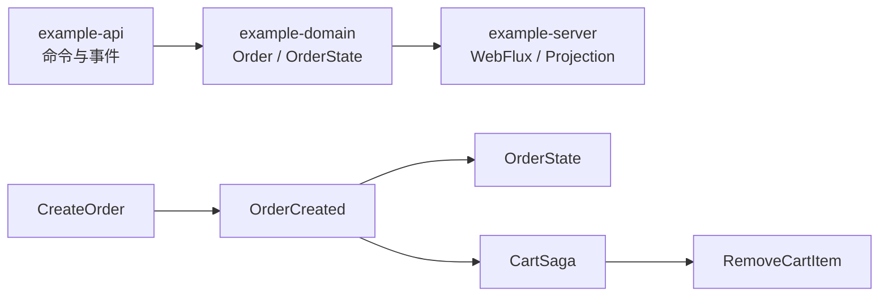
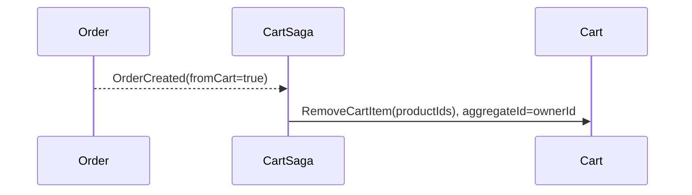

# Kotlin 订单与购物车

本页不是另造的入门模型，而是 [`example`](https://github.com/Ahoo-Wang/Wow/tree/main/example) 的可追踪参考：API 发布语言、领域决策、运行装配和 HTTP 结果都能回到具体源码或测试。

## 能学到什么


```mermaid
flowchart LR
    API[example-api<br/>命令与事件] --> DOMAIN[example-domain<br/>Order / OrderState]
    DOMAIN --> SERVER[example-server<br/>WebFlux / Projection]
    Create[CreateOrder] --> Created[OrderCreated]
    Created --> State[OrderState]
    Created --> CartSaga[CartSaga]
    CartSaga --> Remove[RemoveCartItem]
```

- `api → domain → server` 的模块依赖与职责边界；
- 命令聚合只做决定，状态聚合只消费事件；
- `OrderCreated` 如何同时驱动状态、投影和购物车 Saga；
- 如何用生成 OpenAPI 而不是限界上下文名称确认 HTTP 路由；
- 成功、校验失败、非法状态和重复支付分别留下什么证据。

## 模块地图

| 模块 | 职责 | 精确源码 |
| --- | --- | --- |
| `example-api` | `example-service` 上下文、`order`/`cart` 聚合，以及命令、事件和值对象 | [`ExampleService.kt`](https://github.com/Ahoo-Wang/Wow/blob/main/example/example-api/src/main/kotlin/me/ahoo/wow/example/api/ExampleService.kt#L24-L39)、[`CreateOrder.kt`](https://github.com/Ahoo-Wang/Wow/blob/main/example/example-api/src/main/kotlin/me/ahoo/wow/example/api/order/CreateOrder.kt#L25-L67) |
| `example-domain` | 业务不变量、命令处理、事件溯源、Saga 与领域测试 | [`Order.kt`](https://github.com/Ahoo-Wang/Wow/blob/main/example/example-domain/src/main/kotlin/me/ahoo/wow/example/domain/order/Order.kt#L49-L197)、[`OrderState.kt`](https://github.com/Ahoo-Wang/Wow/blob/main/example/example-domain/src/main/kotlin/me/ahoo/wow/example/domain/order/OrderState.kt#L34-L108) |
| `example-server` | Spring Boot 装配、生成 WebFlux 路由、投影与查询 | [`ExampleServer.kt`](https://github.com/Ahoo-Wang/Wow/blob/main/example/example-server/src/main/kotlin/me/ahoo/wow/example/server/ExampleServer.kt)、[`OrderProjector.kt`](https://github.com/Ahoo-Wang/Wow/blob/main/example/example-server/src/main/kotlin/me/ahoo/wow/example/server/order/OrderProjector.kt) |

## 1. 定义上下文与聚合

[`ExampleService`](https://github.com/Ahoo-Wang/Wow/blob/main/example/example-api/src/main/kotlin/me/ahoo/wow/example/api/ExampleService.kt#L24-L39) 声明上下文名 `example-service`、别名 `example`，并用 `packageScopes` 把订单和购物车契约归入各自聚合。订单实现另用 [`@AggregateRoute(resourceName = "sales-order", spaced = true, owner = ALWAYS)`](https://github.com/Ahoo-Wang/Wow/blob/main/example/example-domain/src/main/kotlin/me/ahoo/wow/example/domain/order/Order.kt#L54-L56) 声明资源名、空间隔离和 owner 路径要求。

这两个注解共同参与路由生成；不能只看到 `example-service` 或 `order` 就猜 URL。

## 2. 把意图与事实分开

| 命令 | 领域决定 | 事件 | 状态变化 |
| --- | --- | --- | --- |
| `CreateOrder` | 地址仅支持 `China`；商品不能为空；库存与价格规格必须通过 | `OrderCreated` | 写入 items/address/totalAmount，状态为 `CREATED` |
| `ChangeAddress` | 仅 `CREATED` 可修改 | `AddressChanged` | 替换 address，状态不变 |
| `PayOrder` | 仅 `CREATED` 可支付；支持部分支付和超额退款信号 | `OrderPaid`，必要时追加 `OrderOverPaid` | 累加 paidAmount，足额后为 `PAID` |
| `ShipOrder` | 仅 `PAID` 可发货 | `OrderShipped` | `SHIPPED` |
| `ReceiptOrder` | 仅 `SHIPPED` 可收货 | `OrderReceived` | `RECEIVED` |

`CreateOrder` 是调用方意图，`OrderCreated` 是已发生事实；调用方不能直接提交事件。完整契约见 [`order` API 包](https://github.com/Ahoo-Wang/Wow/tree/main/example/example-api/src/main/kotlin/me/ahoo/wow/example/api/order)。

## 3. 聚合只做业务决策

[`Order.onCommand(CreateOrder)`](https://github.com/Ahoo-Wang/Wow/blob/main/example/example-domain/src/main/kotlin/me/ahoo/wow/example/domain/order/Order.kt#L93-L133) 依次执行商品规格，生成稳定的 `OrderItem.id`，返回 `OrderCreated`，并把 `totalAmount` 放入命令结果。它不直接修改 `OrderState`。

```text
payable >= amount  -> OrderPaid(amount, fullyPaid)
payable < amount   -> OrderPaid(payable, true), OrderOverPaid(paymentId, excess)
status != CREATED  -> OrderPayDuplicated（错误事件）
```

事件列表顺序即发布顺序；退款等外部动作应消费 `OrderOverPaid`，而不是塞回聚合事务。

## 4. 状态只能由事件改变

[`OrderState`](https://github.com/Ahoo-Wang/Wow/blob/main/example/example-domain/src/main/kotlin/me/ahoo/wow/example/domain/order/OrderState.kt#L34-L108) 的可变属性都只有私有 setter。`onSourcing` 从事件确定性地重建：

```text
OrderCreated  -> CREATED, totalAmount = sum(item.totalPrice)
OrderPaid     -> paidAmount += amount; fullyPaid 时 PAID
OrderShipped  -> SHIPPED
OrderReceived -> RECEIVED
```

`payable` 是 `totalAmount - paidAmount` 的派生值。溯源函数不读取数据库、远程服务或当前时间，因此同一事件历史始终得到同一状态。

## 5. 用 Saga 连接聚合

[`CartSaga`](https://github.com/Ahoo-Wang/Wow/blob/main/example/example-domain/src/main/kotlin/me/ahoo/wow/example/domain/cart/CartSaga.kt#L24-L42) 只在 `OrderCreated.fromCart == true` 时生成 `RemoveCartItem`，并把事件 `ownerId` 设为购物车聚合 ID：


```mermaid
sequenceDiagram
    participant Order
    participant CartSaga
    participant Cart
    Order-->>CartSaga: OrderCreated(fromCart=true)
    CartSaga->>Cart: RemoveCartItem(productIds), aggregateId=ownerId
```

Saga 处理成功只表示下游命令已发送，不会把两个聚合变成 ACID 事务。`@Retry(maxRetries = 5, minBackoff = 60, executionTimeout = 10)` 也意味着下游处理必须幂等。

## 6. 投影和事件处理器

[`OrderProjector`](https://github.com/Ahoo-Wang/Wow/blob/main/example/example-server/src/main/kotlin/me/ahoo/wow/example/server/order/OrderProjector.kt) 展示普通领域事件与状态事件投影；[`OrderEventProcessor`](https://github.com/Ahoo-Wang/Wow/blob/main/example/example-server/src/main/kotlin/me/ahoo/wow/example/server/order/OrderEventProcessor.kt) 展示一般事件订阅。当前实现主要记录日志，是注册与调度示例，不是生产读模型。

## 7. 运行测试

```shell
./gradlew :example-domain:check
```

预期 Gradle 结束于 `BUILD SUCCESSFUL`。[`OrderSpec`](https://github.com/Ahoo-Wang/Wow/blob/main/example/example-domain/src/test/kotlin/me/ahoo/wow/example/domain/order/OrderSpec.kt#L44-L320) 覆盖创建、支付、超额/重复支付、发货、收货、改址、删除、库存不足和价格不一致；[`CartSagaSpec`](https://github.com/Ahoo-Wang/Wow/blob/main/example/example-domain/src/test/kotlin/me/ahoo/wow/example/domain/cart/CartSagaSpec.kt#L25-L75) 覆盖产生和不产生购物车命令的两条分支。

## 8. 启动服务并提交命令

默认配置使用 MongoDB。只做本地单进程验证时，可显式选择内存存储并关闭仍默认使用 MongoDB 的 `PrepareKey`：

```shell
mkdir -p example/example-server/logs
test -e example/example-server/config || \
  ln -s src/main/resources example/example-server/config

SERVER_PORT=8080 \
WOW_EVENTSOURCING_STORE_STORAGE=in_memory \
WOW_EVENTSOURCING_SNAPSHOT_STORAGE=in_memory \
WOW_PREPARE_ENABLED=false \
./gradlew :example-server:run
```

预期日志包含 `Netty started on port 8080` 和 `Started ExampleServerKt`。当前生成 OpenAPI 的创建操作 `example.order.create_order` 路径为 `POST /tenant/{tenantId}/owner/{ownerId}/sales-order`。

```shell
curl -X POST \
  'http://localhost:8080/tenant/tenant-1/owner/customer-1/sales-order' \
  -H 'Content-Type: application/json' \
  -H 'Wow-Space-Id: store-1' \
  -H 'Command-Aggregate-Id: order-1' \
  -H 'Command-Request-Id: create-order-1' \
  -H 'Command-Wait-Stage: SNAPSHOT' \
  -d '{"items":[{"productId":"product-1","price":10,"quantity":2}],"address":{"country":"China","province":"Shanghai","city":"Shanghai","district":"Pudong","detail":"Road 1"},"fromCart":false}'
```

预期关键结果：

```json
{
  "succeeded": true,
  "stage": "SNAPSHOT",
  "aggregateId": "order-1",
  "aggregateVersion": 1,
  "result": { "totalAmount": 20 }
}
```

```shell
curl 'http://localhost:8080/tenant/tenant-1/owner/customer-1/sales-order/order-1/state'
```

预期 `status=CREATED`、`totalAmount=20`、`paidAmount=0`、`payable=20`。内存模式用于快速验证，进程退出后数据会丢失；要验证重启恢复，改用隔离 MongoDB 并保留默认存储配置。

失败行为同样属于契约：空商品或非中国地址在命令校验阶段失败；库存/价格规格失败不会创建聚合；`CREATED` 之前不能发货，`SHIPPED` 之前不能收货；删除后再次支付返回删除聚合访问错误。对应断言都在 `OrderSpec`，不要把这些检查复制到 Controller。

::: warning 示例不是安全基线
生成路由展示的是技术契约，不代表已完成生产认证与授权。上线前仍需配置命令授权、tenant/owner/space 绑定和 fail-closed 查询测试。
:::

## 完成标志

- 能从 `CreateOrder` 追踪到 `OrderCreated`、`OrderState`、投影和 `CartSaga`；
- `:example-domain:check` 通过；
- 路由来自当前 `/v3/api-docs`，不是从上下文名称猜测；
- HTTP 创建结果到达 `SNAPSHOT`，状态路由读回 `CREATED` 和金额；
- 能指出校验失败、非法状态、重复支付及内存重启丢数的边界。
