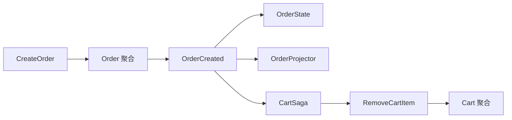

# Kotlin 订单与购物车

本案例直接使用仓库中的 [`example`](https://github.com/Ahoo-Wang/Wow/tree/main/example) 源码，不另造一套简化模型。它适合已经完成快速上手、准备把 Wow 用于真实业务的开发者。

## 能学到什么


```mermaid
flowchart LR
    Create[CreateOrder] --> Order[Order 聚合]
    Order --> Created[OrderCreated]
    Created --> State[OrderState]
    Created --> Projector[OrderProjector]
    Created --> CartSaga[CartSaga]
    CartSaga --> Remove[RemoveCartItem]
    Remove --> Cart[Cart 聚合]
```

- 用 `api`、`domain`、`server` 分离发布语言、领域决策和运行装配；
- 用命令聚合读取状态并返回事件；
- 用状态聚合确定性地重建状态；
- 用 Saga 把订单事件转换为购物车命令；
- 用投影/事件处理器承接读模型或外部副作用；
- 用 `AggregateSpec`、`SagaSpec` 覆盖成功和拒绝路径。

## 模块地图

| 模块 | 关键源码 | 职责 |
| --- | --- | --- |
| `example-api` | [`ExampleService`](https://github.com/Ahoo-Wang/Wow/blob/main/example/example-api/src/main/kotlin/me/ahoo/wow/example/api/ExampleService.kt)、[`CreateOrder`](https://github.com/Ahoo-Wang/Wow/blob/main/example/example-api/src/main/kotlin/me/ahoo/wow/example/api/order/CreateOrder.kt) | 限界上下文、命令、事件和值对象 |
| `example-domain` | [`Order`](https://github.com/Ahoo-Wang/Wow/blob/main/example/example-domain/src/main/kotlin/me/ahoo/wow/example/domain/order/Order.kt)、[`OrderState`](https://github.com/Ahoo-Wang/Wow/blob/main/example/example-domain/src/main/kotlin/me/ahoo/wow/example/domain/order/OrderState.kt) | 不变量、决策、溯源和领域测试 |
| `example-server` | [`ExampleServer`](https://github.com/Ahoo-Wang/Wow/blob/main/example/example-server/src/main/kotlin/me/ahoo/wow/example/server/ExampleServer.kt)、[`OrderProjector`](https://github.com/Ahoo-Wang/Wow/blob/main/example/example-server/src/main/kotlin/me/ahoo/wow/example/server/order/OrderProjector.kt) | Spring 装配、投影、查询和运行配置 |

依赖方向保持 `api ← domain ← server`。外部模块可以依赖命令/事件契约，而不需要依赖聚合实现。

## 1. 定义上下文与聚合

`ExampleService` 声明 `example-service` 上下文及 `order`、`cart` 两个聚合。`packageScopes` 让编译器把命令和事件归入正确聚合：

```kotlin
@BoundedContext(
    name = "example-service",
    alias = "example",
    aggregates = [
        BoundedContext.Aggregate("order", packageScopes = [CreateOrder::class]),
        BoundedContext.Aggregate("cart", packageScopes = [AddCartItem::class]),
    ],
)
object ExampleService
```

## 2. 把意图与事实分开

`CreateOrder` 是带校验的创建命令；`OrderCreated` 是已经发生的业务事实：

```kotlin
@CommandRoute(action = "")
@CreateAggregate
data class CreateOrder(
    val items: List<Item>,
    val address: ShippingAddress,
    val fromCart: Boolean,
) : CommandValidator

data class OrderCreated(
    val orderId: String,
    val items: List<OrderItem>,
    val address: ShippingAddress,
    val fromCart: Boolean,
)
```

命令使用现在时/祈使语义，事件使用过去式；不要让 API 调用方直接提交 `OrderCreated`。

## 3. 聚合只做业务决策

`Order` 读取 `OrderState`，校验库存、价格和状态后返回事件。创建订单时还通过 `CommandResultAccessor` 把 `totalAmount` 放入命令结果。后续规则包括：

| 命令 | 前置条件 | 事件/错误 |
| --- | --- | --- |
| `CreateOrder` | 商品非空、库存与价格通过规格校验 | `OrderCreated` |
| `ChangeAddress` | 状态为 `CREATED` | `AddressChanged` |
| `PayOrder` | 订单仍可支付 | `OrderPaid`，超额时追加 `OrderOverPaid` |
| `ShipOrder` | 状态为 `PAID` | `OrderShipped` |
| `ReceiptOrder` | 状态为 `SHIPPED` | `OrderReceived` |

这些规则都在聚合中，而不是 Controller、投影或数据库脚本中。

## 4. 状态只能由事件改变

`OrderState` 的 setter 都是私有的，`onSourcing` 根据事件更新金额、地址和状态：

```kotlin
fun onSourcing(orderPaid: OrderPaid) {
    paidAmount = paidAmount.plus(orderPaid.amount)
    if (orderPaid.paid) {
        status = OrderStatus.PAID
    }
}
```

溯源函数不能查询数据库、调用远程服务或读取当前时间；相同历史事件必须始终得到相同状态。

## 5. 用 Saga 连接聚合

[`CartSaga`](https://github.com/Ahoo-Wang/Wow/blob/main/example/example-domain/src/main/kotlin/me/ahoo/wow/example/domain/cart/CartSaga.kt) 在从购物车创建订单时发送 `RemoveCartItem`，并把订单事件的 `ownerId` 用作购物车聚合 ID：

```kotlin
@StatelessSaga
class CartSaga {
    @Retry(maxRetries = 5, minBackoff = 60, executionTimeout = 10)
    fun onOrderCreated(event: DomainEvent<OrderCreated>): CommandBuilder? {
        if (!event.body.fromCart) return null
        return RemoveCartItem(
            event.body.items.map { it.productId }.toSet(),
        ).commandBuilder().aggregateId(event.ownerId)
    }
}
```

Saga 只证明源事件已被处理并发送了下游命令，不代表整个流程成为 ACID 事务。重试要求 `RemoveCartItem` 和其他副作用保持幂等。

## 6. 投影和事件处理器

`OrderProjector` 展示 `@ProjectionProcessor`、普通事件和状态事件处理函数；`OrderEventProcessor` 展示一般事件订阅。示例实现主要记录日志，用于演示注册与调度，不是生产读模型。

真实应用应在处理器中使用幂等业务键，并通过[投影](../../guide/projection.md)、[事件补偿](../../guide/event-compensation.md)和[可观测性](../../guide/advanced/observability.md)验证失败路径。

## 7. 运行测试

先验证不依赖外部基础设施的领域闭环：

```shell
./gradlew :example-domain:test
./gradlew :example-domain:jacocoTestCoverageVerification
```

[`OrderSpec`](https://github.com/Ahoo-Wang/Wow/blob/main/example/example-domain/src/test/kotlin/me/ahoo/wow/example/domain/order/OrderSpec.kt) 覆盖创建、支付、发货、收货、重复支付、地址修改、删除和非法状态；[`CartSagaSpec`](https://github.com/Ahoo-Wang/Wow/blob/main/example/example-domain/src/test/kotlin/me/ahoo/wow/example/domain/cart/CartSagaSpec.kt) 覆盖产生/不产生购物车命令的分支。

## 8. 启动服务并提交命令

`example-server` 默认使用 MongoDB EventStore/SnapshotStore。先提供隔离的本地 MongoDB，并通过 `SPRING_MONGODB_URI` 注入连接；不要复用示例凭据到共享或生产环境。

```shell
mkdir -p example/example-server/logs
test -e example/example-server/config || ln -s src/main/resources example/example-server/config
SPRING_MONGODB_URI='<mongodb-uri>' ./gradlew :example-server:run
```

打开 [Swagger UI](http://localhost:8080/swagger-ui.html)，找到 `sales-order` 创建路由。该聚合要求 tenant、owner 和 space：

```shell
curl -X POST \
  'http://localhost:8080/tenant/tenant-1/owner/customer-1/sales-order' \
  -H 'Content-Type: application/json' \
  -H 'Wow-Space-Id: store-1' \
  -H 'Command-Aggregate-Id: order-1' \
  -H 'Command-Request-Id: create-order-1' \
  -H 'Command-Wait-Stage: SNAPSHOT' \
  -d '{"items":[{"productId":"product-1","price":10,"quantity":2}],"address":{"country":"China","province":"Shanghai","city":"Shanghai","district":"Pudong","detail":"Road 1"},"fromCart":true}'
```

先检查 `succeeded`、`stage`、`aggregateId` 和 `aggregateVersion`，再通过 Swagger 中的快照端点或示例 `/order/{tenantId}/{orderId}` 查询状态。

::: warning 示例不是安全基线
示例 Controller 和本地配置用于演示框架能力。把它用于业务系统前，必须按[数据权限](../../guide/data-access.md#必须完成的安全闭环)配置认证、命令授权、作用域绑定和 fail-closed 查询测试。
:::

## 完成标志

- 能解释 `api`、`domain`、`server` 的依赖方向；
- 能从命令追踪到事件、状态、投影和 Saga；
- `OrderSpec` 与 `CartSagaSpec` 通过；
- 真实 HTTP 命令到达 `SNAPSHOT` 并可读回状态；
- 重启后状态仍可从 MongoDB 恢复；
- 重复 `requestId`、非法状态和越权请求都有失败证据。
