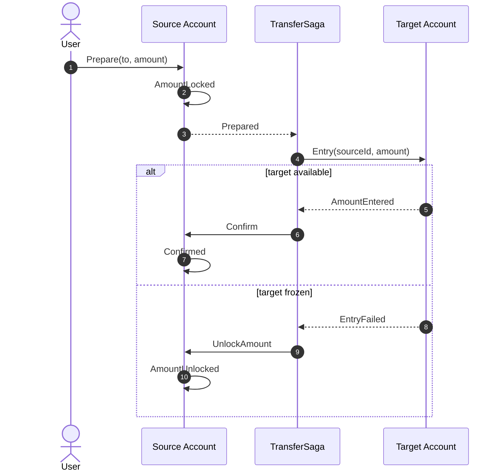
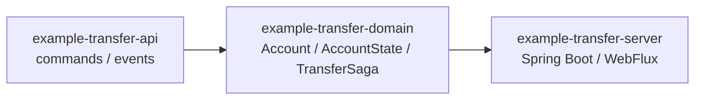

# 银行账户转账(JAVA)

[`example/transfer`](https://github.com/Ahoo-Wang/Wow/tree/main/example/transfer) 用 Java 实现账户聚合，用 Wow 的无状态 Saga 协调跨账户转账。本页只描述仓库当前可以从源码、测试和运行时 OpenAPI 证明的行为。

## 银行转账流程


```mermaid
sequenceDiagram
    autonumber
    actor User
    participant Source as Source Account
    participant Saga as TransferSaga
    participant Target as Target Account
    User->>Source: Prepare(to, amount)
    Source->>Source: AmountLocked
    Source-->>Saga: Prepared
    Saga->>Target: Entry(sourceId, amount)
    alt target available
        Target-->>Saga: AmountEntered
        Saga->>Source: Confirm
        Source->>Source: Confirmed
    else target frozen
        Target-->>Saga: EntryFailed
        Saga->>Source: UnlockAmount
        Source->>Source: AmountUnlocked
    end
```

成功路径的最终状态是源账户可用余额减少且锁定额归零，目标账户余额增加；目标被冻结时，Saga 把源账户已锁金额退回。它是事件驱动补偿，不是跨聚合数据库事务。

## 运行案例


```mermaid
flowchart LR
    API[example-transfer-api<br/>commands / events] --> DOMAIN[example-transfer-domain<br/>Account / AccountState / TransferSaga]
    DOMAIN --> SERVER[example-transfer-server<br/>Spring Boot / WebFlux]
```

先运行不依赖外部基础设施的领域检查：

```shell
./gradlew :example-transfer-domain:check
```

预期结束于 `BUILD SUCCESSFUL`。

当前 [`example-transfer-server` 的 application mainClass](https://github.com/Ahoo-Wang/Wow/blob/main/example/transfer/example-transfer-server/build.gradle.kts#L34-L54) 指向不存在的 `ExampleServer`，因此 `./gradlew :example-transfer-server:run` 会以 `ClassNotFoundException` 失败。任务边界内不改 Gradle；可用真实主类 [`TransferExampleServer`](https://github.com/Ahoo-Wang/Wow/blob/main/example/transfer/example-transfer-server/src/main/java/me/ahoo/wow/example/transfer/server/TransferExampleServer.java#L23-L30) 启动同一分发包：

```shell
mkdir -p example/transfer/example-transfer-server/logs
./gradlew :example-transfer-server:installDist

java \
  -Dserver.port=8080 \
  -Dspring.config.location=file:example/transfer/example-transfer-server/src/main/resources/application.yaml \
  -cp 'example/transfer/example-transfer-server/build/install/example-transfer-server/lib/*' \
  me.ahoo.wow.example.transfer.server.TransferExampleServer
```

预期日志包含 `Netty started on port 8080` 和 `Started TransferExampleServer`。该示例配置使用内存 command/event bus、EventStore 和 SnapshotStore，进程退出后账户数据消失。

## 自动生成 API 端点

当前运行时 `/v3/api-docs` 中，核心端点是：

| 操作 | 方法与路径 | operationId |
| --- | --- | --- |
| 创建账户 | `POST /account/create_account` | `transfer.account.create_account` |
| 准备转账 | `POST /account/{id}/prepare` | `transfer.account.prepare` |
| 读取状态 | `GET /account/{id}/state` | 生成状态路由 |

这些路径也与仓库的 [`Transfer.http`](https://github.com/Ahoo-Wang/Wow/blob/main/example/transfer/Transfer.http#L1-L77) 一致；它们不是从 `transfer-service` 名称推导出来的。

```shell
curl -X POST http://localhost:8080/account/create_account \
  -H 'Content-Type: application/json' \
  -H 'Command-Wait-Stage: PROCESSED' \
  -H 'Command-Aggregate-Id: sourceId' \
  -H 'Command-Request-Id: source-create-1' \
  -d '{"name":"source","balance":100}'

curl -X POST http://localhost:8080/account/create_account \
  -H 'Content-Type: application/json' \
  -H 'Command-Wait-Stage: PROCESSED' \
  -H 'Command-Aggregate-Id: targetId' \
  -H 'Command-Request-Id: target-create-1' \
  -d '{"name":"target","balance":0}'

curl -X POST http://localhost:8080/account/sourceId/prepare \
  -H 'Content-Type: application/json' \
  -H 'Command-Wait-Stage: PROCESSED' \
  -H 'Command-Request-Id: transfer-1' \
  -d '{"to":"targetId","amount":10}'
```

三个命令都应返回 `succeeded=true`、`stage=PROCESSED`。转账命令的源账户版本为 `2`；Saga 完成后：

```shell
curl http://localhost:8080/account/sourceId/state
curl http://localhost:8080/account/targetId/state
```

预期源账户 `balanceAmount=90, lockedAmount=0`，目标账户 `balanceAmount=10`。

## 模块划分

| 模块 | 职责 | 精确源码 |
| --- | --- | --- |
| `example-transfer-api` | `account` 的命令、事件与发布语言 | [`TransferService.java`](https://github.com/Ahoo-Wang/Wow/blob/main/example/transfer/example-transfer-api/src/main/java/me/ahoo/wow/example/transfer/TransferService.java)、[`api` 包](https://github.com/Ahoo-Wang/Wow/tree/main/example/transfer/example-transfer-api/src/main/java/me/ahoo/wow/example/transfer/api) |
| `example-transfer-domain` | 账户决定、事件溯源、Saga 和测试 | [`Account.java`](https://github.com/Ahoo-Wang/Wow/blob/main/example/transfer/example-transfer-domain/src/main/java/me/ahoo/wow/example/transfer/domain/Account.java#L24-L82)、[`TransferSaga.java`](https://github.com/Ahoo-Wang/Wow/blob/main/example/transfer/example-transfer-domain/src/main/java/me/ahoo/wow/example/transfer/domain/TransferSaga.java#L20-L33) |
| `example-transfer-server` | Spring Boot 入口和 WebFlux/OpenAPI 装配 | [`TransferExampleServer.java`](https://github.com/Ahoo-Wang/Wow/blob/main/example/transfer/example-transfer-server/src/main/java/me/ahoo/wow/example/transfer/server/TransferExampleServer.java#L23-L30)、[`application.yaml`](https://github.com/Ahoo-Wang/Wow/blob/main/example/transfer/example-transfer-server/src/main/resources/application.yaml) |

## 领域建模

领域的最小决定是“先锁源账户，再入目标账户，最后确认或解锁”。

| 命令 | 事件 | 状态结果 |
| --- | --- | --- |
| `CreateAccount` | `AccountCreated` | 初始化 name、balanceAmount |
| `Prepare` | `AmountLocked`, `Prepared` | 可用余额减少，lockedAmount 增加 |
| `Entry` | `AmountEntered` 或 `EntryFailed` | 目标可用余额增加，或不改变目标状态 |
| `Confirm` | `Confirmed` | 源 lockedAmount 减少 |
| `UnlockAmount` | `AmountUnlocked` | lockedAmount 退回 balanceAmount |
| `FreezeAccount` / `UnfreezeAccount` | `AccountFrozen` / `AccountUnfrozen` | 切换 frozen |

### 状态聚合根（`AccountState`）建模

[`AccountState`](https://github.com/Ahoo-Wang/Wow/blob/main/example/transfer/example-transfer-domain/src/main/java/me/ahoo/wow/example/transfer/domain/AccountState.java#L24-L89) 只在 `onSourcing` 中改变 `balanceAmount`、`lockedAmount` 和 `frozen`。`AmountLocked` 把金额从可用余额移入锁定余额；`Confirmed` 只扣锁定余额；`AmountUnlocked` 同时扣锁定余额并退回可用余额。

### 命令聚合根（`Account`）建模

[`Account`](https://github.com/Ahoo-Wang/Wow/blob/main/example/transfer/example-transfer-domain/src/main/java/me/ahoo/wow/example/transfer/domain/Account.java#L24-L82) 不直接写状态。`Prepare` 先拒绝冻结账户和余额不足，再按固定顺序返回 `AmountLocked`、`Prepared`；`Entry` 遇到冻结目标时返回实现 `ErrorInfo` 的 `EntryFailed`，让 Saga 进入解锁分支。

### 转账流程管理器（`TransferSaga`）

[`TransferSaga`](https://github.com/Ahoo-Wang/Wow/blob/main/example/transfer/example-transfer-domain/src/main/java/me/ahoo/wow/example/transfer/domain/TransferSaga.java#L20-L33) 只有三条映射：

```text
Prepared      -> Entry(targetId, sourceId, amount)
AmountEntered -> Confirm(sourceId, amount)
EntryFailed   -> UnlockAmount(sourceId, amount)
```

没有额外流程状态；事件历史和两个账户状态就是可审计证据。

### 单元测试

[`AccountSpec`](https://github.com/Ahoo-Wang/Wow/blob/main/example/transfer/example-transfer-domain/src/test/kotlin/me/ahoo/wow/example/transfer/domain/AccountSpec.kt#L26-L92) 验证开户、锁款、入账、冻结拒绝和余额不足；[`TransferSagaSpec`](https://github.com/Ahoo-Wang/Wow/blob/main/example/transfer/example-transfer-domain/src/test/kotlin/me/ahoo/wow/example/transfer/domain/TransferSagaSpec.kt#L25-L57) 验证三条事件到命令映射。

失败行为是领域契约的一部分：冻结源账户或余额不足时 `Prepare` 抛出 `IllegalStateException` 且余额不变；冻结目标账户时产生 `EntryFailed`，随后解锁源账户；重复冻结/解冻也会被拒绝。HTTP 返回的 `succeeded=false` 和 `errorMsg` 应与这些测试断言对应。
