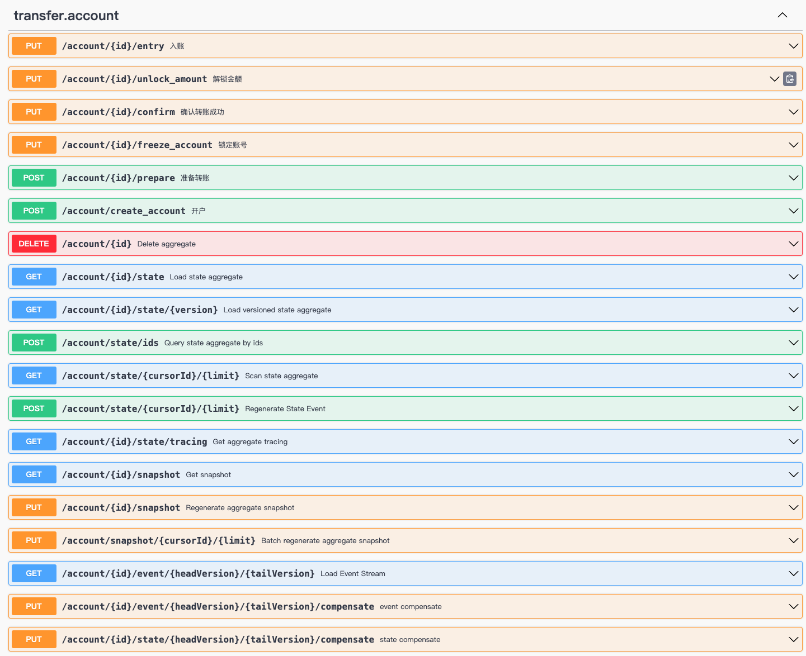

# 银行账户转账(JAVA)

_[银行账户转账案例](https://github.com/Ahoo-Wang/Wow/blob/main/example/transfer/)_ 是一个经典的领域驱动设计（DDD）应用场景。接下来我们通过一个简单的银行账户转账案例，来了解如何使用 Wow 进行领域驱动设计以及服务开发。

## 银行转账流程

1. 准备转账（Prepare）： 用户发起转账请求，触发 Prepare 步骤。这个步骤会向源账户发送准备转账的请求。
2. 校验余额（CheckBalance）： 源账户在收到准备转账请求后，会执行校验余额的操作，确保账户有足够的余额进行转账。
3. 锁定金额（LockAmount）： 如果余额足够，源账户会锁定转账金额，防止其他操作干扰。
4. 入账（Entry）： 接着，转账流程进入到目标账户，执行入账操作。
5. 确认转账（Confirm）： 如果入账成功，确认转账；否则，执行解锁金额操作。
    1. 成功路径（Success）： 如果一切顺利，完成转账流程。
    2. 失败路径（Fail）： 如果入账失败，执行解锁金额操作，并处理失败情况。

<center>


</center>


## 运行案例

- 运行 [TransferExampleServer.java](https://github.com/Ahoo-Wang/Wow/blob/main/example/transfer/example-transfer-server/src/main/java/me/ahoo/wow/example/transfer/server/TransferExampleServer.java)
- 查看 Swagger-UI : [http://localhost:8080/swagger-ui.html](http://localhost:8080/swagger-ui.html)
- 执行 API 测试：[Transfer.http](https://github.com/Ahoo-Wang/Wow/blob/main/example/transfer/Transfer.http)

## 自动生成 API 端点

> 运行之后，访问 Swagger-UI : [http://localhost:8080/swagger-ui.html](http://localhost:8080/swagger-ui.html) 。
> 该 RESTful API 端点是由 Wow 自动生成的，无需手动编写。



## 模块划分

| 模块                      | 说明                                                                                         |
|-------------------------|--------------------------------------------------------------------------------------------|
| example-transfer-api    | API 层，定义聚合命令（Command）、领域事件（Domain Event）以及查询视图模型（Query View Model），这个模块充当了各个模块之间通信的“发布语言”。 |
| example-transfer-domain | 领域层，包含聚合根和业务约束的实现。聚合根：领域模型的入口点，负责协调领域对象的操作。业务约束：包括验证规则、领域事件的处理等。                           |
| example-transfer-server | 宿主服务，应用程序的启动点。负责整合其他模块，并提供应用程序的入口。涉及配置依赖项、连接数据库、启动 API 服务                                  |

## 领域建模

状态聚合根（`AccountState`）与命令聚合根（`Account`）分离设计保证了在执行命令过程中，不会修改状态聚合根的状态。

### 状态聚合根（`AccountState`）建模

```java
public class AccountState implements Identifier {
    private final String id;
    private String name;
    /**
     * 余额
     */
    private long balanceAmount = 0L;
    /**
     * 已锁定金额
     */
    private long lockedAmount = 0L;
    /**
     * 账号已冻结标记
     */
    private boolean frozen = false;

    @JsonCreator
    public AccountState(@JsonProperty("id") String id) {
        this.id = id;
    }

    @NotNull
    @Override
    public String getId() {
        return id;
    }

    public String getName() {
        return name;
    }

    public long getBalanceAmount() {
        return balanceAmount;
    }

    public long getLockedAmount() {
        return lockedAmount;
    }

    public boolean isFrozen() {
        return frozen;
    }

    void onSourcing(AccountCreated accountCreated) {
        this.name = accountCreated.name();
        this.balanceAmount = accountCreated.balance();
    }

    void onSourcing(AmountLocked amountLocked) {
        balanceAmount = balanceAmount - amountLocked.amount();
        lockedAmount = lockedAmount + amountLocked.amount();
    }

    void onSourcing(AmountEntered amountEntered) {
        balanceAmount = balanceAmount + amountEntered.amount();
    }

    void onSourcing(Confirmed confirmed) {
        lockedAmount = lockedAmount - confirmed.amount();
    }

    void onSourcing(AmountUnlocked amountUnlocked) {
        lockedAmount = lockedAmount - amountUnlocked.amount();
        balanceAmount = balanceAmount + amountUnlocked.amount();
    }

    void onSourcing(AccountFrozen accountFrozen) {
        this.frozen = true;
    }

}
```

### 命令聚合根（`Account`）建模

```java
@StaticTenantId
@AggregateRoot
public class Account {
    private final AccountState state;

    public Account(AccountState state) {
        this.state = state;
    }

    AccountCreated onCommand(CreateAccount createAccount) {
        return new AccountCreated(createAccount.name(), createAccount.balance());
    }

    @OnCommand(returns = {AmountLocked.class, Prepared.class})
    List<?> onCommand(Prepare prepare) {
        checkBalance(prepare.amount());
        return List.of(new AmountLocked(prepare.amount()), new Prepared(prepare.to(), prepare.amount()));
    }

    private void checkBalance(long amount) {
        if (state.isFrozen()) {
            throw new IllegalStateException("账号已冻结无法转账.");
        }
        if (state.getBalanceAmount() < amount) {
            throw new IllegalStateException("账号余额不足.");
        }
    }

    Object onCommand(Entry entry) {
        if (state.isFrozen()) {
            return new EntryFailed(entry.sourceId(), entry.amount());
        }
        return new AmountEntered(entry.sourceId(), entry.amount());
    }

    Confirmed onCommand(Confirm confirm) {
        return new Confirmed(confirm.amount());
    }

    AmountUnlocked onCommand(UnlockAmount unlockAmount) {
        return new AmountUnlocked(unlockAmount.amount());
    }

    AccountFrozen onCommand(FreezeAccount freezeAccount) {
        return new AccountFrozen(freezeAccount.reason());
    }
}
```

### 转账流程管理器（`TransferSaga`）

转账流程管理器（`TransferSaga`）负责协调处理转账的事件，并生成相应的命令。

- `onEvent(Prepared)`: 订阅转账已准备就绪事件（`Prepared`），并生成入账命令(`Entry`)。
- `onEvent(AmountEntered)`: 订阅转账已入账事件（`AmountEntered`），并生成确认转账命令(`Confirm`)。
- `onEvent(EntryFailed)`: 订阅转账入账失败事件（`EntryFailed`），并生成解锁金额命令(`UnlockAmount`)。

```java
@StatelessSaga
public class TransferSaga {

    Entry onEvent(Prepared prepared, AggregateId aggregateId) {
        return new Entry(prepared.to(), aggregateId.getId(), prepared.amount());
    }

    Confirm onEvent(AmountEntered amountEntered) {
        return new Confirm(amountEntered.sourceId(), amountEntered.amount());
    }

    UnlockAmount onEvent(EntryFailed entryFailed) {
        return new UnlockAmount(entryFailed.sourceId(), entryFailed.amount());
    }
}
```

### 单元测试

借助 Wow 单元测试套件，可以轻松的编写聚合根和 Saga 的单元测试。从而提升代码覆盖率，保证代码质量。


> 使用 `AggregateSpec` 进行聚合根单元测试，可以有效的减少单元测试的编写工作量。

> `Account` 聚合根单元测试

```kotlin
class AccountSpec : AggregateSpec<Account, AccountState>({

   on {
      val createAccount = CreateAccount("name", 100)
      whenCommand(createAccount) {
         expectEventType(AccountCreated::class)
         expectState {
            name.assert().isEqualTo(createAccount.name)
            balanceAmount.assert().isEqualTo(createAccount.balance)
         }
         fork {
            val prepare = Prepare("to", 100)
            whenCommand(prepare) {
               expectEventType(AmountLocked::class, Prepared::class)
               expectState {
                  balanceAmount.assert().isEqualTo(createAccount.balance - prepare.amount)
               }
            }
         }
         fork {
            givenEvent(AccountFrozen("")) {
               whenCommand(Prepare("to", 100)) {
                  expectError<IllegalStateException> {
                     assertThat(this).hasMessage("账号已冻结无法转账.")
                  }
                  expectState {
                     name.assert().isEqualTo(createAccount.name)
                     balanceAmount.assert().isEqualTo(createAccount.balance)
                     isFrozen.assert().isTrue()
                  }
               }
               val entry = Entry(stateRoot.id, "sourceId", 100)
               whenCommand(entry) {
                  expectEventType(EntryFailed::class)
                  expectState {
                     balanceAmount.assert().isEqualTo(100)
                     isFrozen.assert().isTrue()
                  }
               }
            }
         }
         fork {
            val prepare = Prepare("to", createAccount.balance + 1)
            whenCommand(prepare) {
               expectError<IllegalStateException> {
                  this.assert().hasMessage("账号余额不足.")
               }
               expectState {
                  name.assert().isEqualTo(createAccount.name)
                  balanceAmount.assert().isEqualTo(createAccount.balance)
               }
            }
         }
         fork {
            val entry = Entry(stateRoot.id, "sourceId", 100)
            whenCommand(entry) {
               expectEventType(AmountEntered::class)
               expectState {
                  balanceAmount.assert().isEqualTo(200)
               }
            }
         }
      }
   }
})
```

> 使用 `SagaSpec` 进行 Saga 单元测试，可以有效的减少单元测试的编写工作量。

> `TransferSaga` 单元测试

```kotlin
class TransferSagaSpec : SagaSpec<TransferSaga>({
   on {
      val prepared = Prepared("to", 1)
      whenEvent(prepared) {
         expectNoError()
         expectCommandType(Entry::class)
         expectCommandBody<Entry> {
            id.assert().isEqualTo(prepared.to)
            amount.assert().isEqualTo(prepared.amount)
         }
      }
   }
   on {
      val amountEntered = AmountEntered("sourceId", 1)
      whenEvent(amountEntered) {
         expectNoError()
         expectCommandType(Confirm::class)
         expectCommandBody<Confirm> {
            id.assert().isEqualTo(amountEntered.sourceId)
            amount.assert().isEqualTo(amountEntered.amount)
         }
      }
   }
   on {
      val entryFailed = EntryFailed("sourceId", 1)
      whenEvent(entryFailed) {
         expectCommandType(UnlockAmount::class)
         expectCommandBody<UnlockAmount> {
            id.assert().isEqualTo(entryFailed.sourceId)
            amount.assert().isEqualTo(entryFailed.amount)
         }
      }
   }
})
```