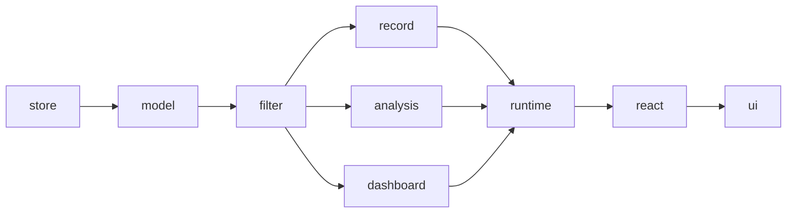

# wow-view-engine 参考

::: warning 尚未发布
`@ahoo-wang/wow-view-engine` 还没有发布到 npm，也不承诺兼容。本页记录入口与契约的当前状态；首次发布之前以[设计文档](https://github.com/Ahoo-Wang/Wow/tree/main/typescript/wow-view-engine/docs/design)为准。逐符号参考和完整符号索引在包发布时补上。
:::

引擎做什么以及目标用法的完整走读，见[视图引擎指南](../../../guide/typescript/view-engine.md)。

## 入口

| 入口 | 导出 |
|---|---|
| `@ahoo-wang/wow-view-engine` | 模型类型、纯内核（`validate*`、`compile*`、`project*`）、运行时、`ViewStore` 端口、`MemoryViewStore` |
| `/react` | `useViewEngine`、`useOpenView`、`useViewRuntime`、`useViewList`、`useViewManager`、`useWorkbench`、`useLeaveGuard`、`useFilterEditor`、`useRecordTable`、`useAnalysisEditor`、`useAnalysisResult`、`useDashboard`、`useSaveCommands`、`RecordActionSlots` |
| `/ui` | 工作台（`DataWorkbench`、`DashboardWorkbench`）、嵌入（`EmbeddedView`、`EmbeddedDashboard`）、视图管理（`ViewHeader`、`SaveActions`、`ViewManager`、`LeaveDialog`）、编辑与结果（`FilterPanel`、`RecordTable`、`RecordCards`、`RecordPagination`、`AnalysisTable`、`AnalysisChart`、`DashboardGrid`）、内容面板以及 `MessagesProvider` |
| `/styles.css` | 主题。需要显式导入；任何 JavaScript 入口都不导入 CSS |

根入口不依赖 React 或 DOM。`react` 和 `react-dom` 是 peer 依赖，只有 `/react` 和 `/ui` 需要。

## 概念

| 类型 | 作用 | 所在 |
|---|---|---|
| `ViewDefinition` | 字段、类型、操作符，以及明细与分析能力。声明或生成，运行时从不编辑 | 代码 |
| `ViewConfig` | `RecordViewConfig`、`AnalysisViewConfig` 或 `DashboardViewConfig`。共享的 `FilterTree` 描述范围，保存的是“最近 7 天”这类意图而不是编译后的值 | 数据 |
| `ViewInstance` | 已保存的 `ViewConfig`，加上 id、标题、范围（`system`、`shared` 或 `personal`）和不透明的 `revision` | 存储 |
| `ViewRuntime` | 一个打开的视图：草稿、已应用的配置、结果、状态与选择，通过 `subscribe` 和 `getSnapshot` 暴露 | 内存 |
| `ViewEngine` | 定义、存储与已打开运行时的注册表；打开、保存、列出等命令的入口 | 内存 |
| `ViewStore` | 由后端实现的持久化端口 | 应用 |
| `FieldKind` | 一种字段类型的操作符、校验、到 `FilterExpression` 的编译以及编辑器描述 | 注册表 |

内置字段类型：`string`、`number`、`boolean`、`date`、`datetime`、`enum`、`reference`、`array`、`elementMatch`、`search`，以及由 Wow 元数据过滤支撑的 `documentId`、`aggregateId`、`tenantId`、`ownerId`、`spaceId` 和 `deletion`。

## 持久化 {#persistence}

`ViewStore` 是后端唯一需要满足的端口：

```ts
interface ViewStore {
  list(definitionId: string, signal?: AbortSignal): Promise<ViewInstanceSummary[]>;
  get(id: string, signal?: AbortSignal): Promise<ViewInstance>;
  create(input: Omit<ViewInstance, 'id' | 'revision'>, ctx: WriteContext): Promise<ViewInstance>;
  save(id: string, config: ViewConfig, revision: string, ctx: WriteContext): Promise<ViewInstance>;
  rename(id: string, title: string, revision: string, ctx: WriteContext): Promise<ViewInstance>;
  delete(id: string, revision: string, ctx: WriteContext): Promise<void>;
  getPreferences(definitionId: string, signal?: AbortSignal): Promise<ViewPreferences>;
  setPreferences(definitionId: string, prefs: ViewPreferences, ctx: WriteContext): Promise<ViewPreferences>;
  permissions?(definitionId: string): ViewPermissions;
}
```

| 规则 | 行为 |
|---|---|
| 乐观 revision | 写操作携带期望的 `revision`；不一致时抛出 code 为 `CONFLICT` 的 `ViewStoreError`，界面提供重新加载、覆盖或另存为 |
| 幂等 `requestId` | 每次逻辑写入在 `WriteContext` 中有一个 `requestId`；超时后重试沿用同一个值，由服务端去重 |
| 权限 | `permissions` 只决定按钮是否可用。授权、可见性过滤和去重都是服务端的职责 |

`MemoryViewStore` 用于测试、示例和只读查询场景。基于 Wow 的 `ViewStore` 服务及其 TypeScript 适配器计划作为单独的包提供。

## 分层



架构测试强制以下依赖规则：`model` 不导入任何模块；`filter` 只导入 `model`；`record`、`analysis`、`dashboard` 只导入 `model` 和 `filter`；`runtime` 从不导入 `react` 或 `ui`；`store` 只导入 `model`；`react` 从不导入 `ui`。只使用 `wow-client` 中未弃用的 `FilterExpression` API。

## 扩展点

| 方向 | 机制 |
|---|---|
| 字段类型 | 注册一个 `FieldKind`：操作符、校验、`compile` 到 `FilterExpression`，以及指定某个内置取值输入的编辑器描述 |
| 数据源 | `resolveSource(key)` 返回一个 `wow-client` 查询客户端 |
| 持久化 | 实现 `ViewStore` |
| 操作 | 向工作台传入 `global`、`bulk`、`row` 三类操作的渲染函数；它们是代码，从不保存 |
| 外观 | CSS 变量与主题文件；通过组合 `/react` Hook 替换组件 |
| 文案 | `defaultMessages`（英文）与 `zhCN` 两套文案，通过 `messages` 属性或 `MessagesProvider` 合并 |

## 源码

[typescript/wow-view-engine](https://github.com/Ahoo-Wang/Wow/tree/main/typescript/wow-view-engine) · [README](https://github.com/Ahoo-Wang/Wow/blob/main/typescript/wow-view-engine/README.md) · [设计文档](https://github.com/Ahoo-Wang/Wow/tree/main/typescript/wow-view-engine/docs/design) · [Storybook](/storybook/?path=/docs/view-engine-首页--docs)
