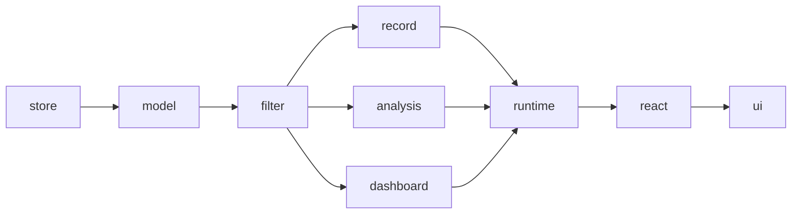

# wow-view-engine 参考

::: info Wow 9.2.0 起在 npm 上
`@ahoo-wang/wow-view-engine` 从 Wow 9.2.0 起在 npm 上，与 Wow 同一个 tag、同一个版本号发布。补丁版本不破坏导出（包括 `ViewStore` 端口）、CSS 合同、消息键与 issue code，以及 `wow-view-engine` 命令；次版本的破坏逐条写进发布说明（[兼容规则](../../../guide/typescript/view-engine.md)）。模型以[设计文档](https://github.com/Ahoo-Wang/Wow/tree/main/typescript/wow-view-engine/docs/design)为准；逐符号参考还没有。
:::

引擎做什么，见[视图引擎指南](../../../guide/typescript/view-engine.md)；从零接入一个业务对象的完整走读，见[视图引擎入门](../../../guide/typescript/view-engine-getting-started.md)。

## 入口

| 入口 | 导出 |
|---|---|
| `@ahoo-wang/wow-view-engine` | 模型类型、纯内核（`validate*`、`compile*`、`project*`）、运行时、`ViewStore` 端口、`MemoryViewStore`、`localStorageSnapshot` |
| `/react` | `useViewEngine`、`useOpenView`、`useViewRuntime`、`useViewList`、`useViewManager`、`useWorkbench`、`useLeaveGuard`、`useFilterEditor`、`useRecordTable`、`useAnalysisEditor`、`useAnalysisResult`、`useDashboard`、`useSaveCommands`、`useRecordActions`、`RecordActionSlots` |
| `/ui` | 工作台（`DataWorkbench`、`DashboardWorkbench`）、嵌入（`EmbeddedView`、`EmbeddedDashboard`）、宿主接线（`ViewHost`、`bind`、`useViewNavigation`、`useColorMode`）、视图管理（`ViewHeader`、`SaveActions`、`ViewManager`、`LeaveDialog`）、编辑与结果（`FilterPanel`、`RecordTable`、`RecordCards`、`RecordPagination`、`AnalysisTable`、`AnalysisChart`、`DashboardGrid`）、内容面板以及 `MessagesProvider` |
| `/testing` | 给宿主的测试：`memorySource` 与 `matches`（带 Wow 查询语义的内存 `ViewSource`）、`resolveNavigation`、`admit`、`actionHarness` |
| `/react-router` | `useReactRouter`：把 React Router 作为路由端口交给宿主的 `ViewHost` |
| `/styles.css` | 主题。需要显式导入；任何 JavaScript 入口都不导入 CSS |
| `/themes.css` | 可选的预设，由 `data-fve-preset` 选中 |
| `/themes/<名>.css` | 单独一套可选的预设 |
| `/shadcn-bridge.css` | 可选：把宿主的 shadcn token 读进视图的变量，`input`、`ring`、状态色与图表色除外 |

根入口不依赖 React 或 DOM。`react` 和 `react-dom` 是 peer 依赖，只有 `/react` 和 `/ui` 需要；`react-router` 只有 `/react-router` 需要，`mingo` 只有 `/testing` 需要；这四个都是可选的 peer。包带一个命令 `wow-view-engine theme-check`，按登记表检查宿主的主题（[检查主题](../../../guide/typescript/view-engine-theming.md#检查一套主题)）。

## 概念

| 类型 | 作用 | 所在 |
|---|---|---|
| `ViewDefinition` | 字段、类型、操作符，以及记录视图与分析视图的能力。声明或生成，运行时从不编辑 | 代码 |
| `ViewConfig` | `RecordViewConfig`、`AnalysisViewConfig` 或 `DashboardViewConfig`。共享的 `FilterTree` 描述范围，保存的是“最近 7 天”这类意图而不是编译后的值 | 数据 |
| `ViewInstance` | 已保存的 `ViewConfig`，加上 id、标题、范围（`system`、`shared` 或 `personal`）和不透明的 `revision` | 存储 |
| `ViewRuntime` | 一个打开的视图：草稿、已应用的配置、结果、状态与选择，通过 `subscribe` 和 `getSnapshot` 暴露 | 内存 |
| `ViewEngine` | 定义、存储与已打开运行时的注册表；打开、保存、列出等命令的入口 | 内存 |
| `ViewStore` | 持久化端口：Wow 服务端上是 `WowViewStore`，别的后端自己实现 | 应用 |
| `FieldKind` | 一种字段类型的操作符、校验、到 `FilterExpression` 的编译以及编辑器描述 | 注册表 |

内置字段类型：`string`、`number`、`boolean`、`date`、`datetime`、`enum`、`reference`、`array`、`elementMatch`、`search`，以及由 Wow 元数据过滤支撑的 `documentId`、`aggregateId`、`tenantId`、`ownerId`、`spaceId` 和 `deletion`。

## 持久化 {#persistence}

`ViewStore` 是后端唯一需要满足的端口：

```ts
interface ViewStore {
  list(definitionId: string, signal?: AbortSignal): Promise<ViewInstanceSummary[]>;
  get(id: string, signal?: AbortSignal): Promise<ViewInstance>;
  create(input: Omit<ViewInstance, 'id' | 'revision'>, ctx: WriteContext): Promise<ViewInstance>;
  save(id: string, config: ViewConfig, revision: string, ctx: WriteContext): Promise<ViewInstance>;
  rename(id: string, title: string, revision: string, ctx: WriteContext): Promise<ViewInstance>;
  delete(id: string, revision: string, ctx: WriteContext): Promise<void>;
  // 可选：没有它，视图管理器就没有「设为共享」「设为个人」。
  changeAudience?(id: string, audience: ViewAudience, revision: string, ctx: WriteContext): Promise<ViewInstance>;
  getPreferences(definitionId: string, signal?: AbortSignal): Promise<ViewPreferences>;
  setPreferences(definitionId: string, prefs: ViewPreferences, ctx: WriteContext): Promise<ViewPreferences>;
  permissions?(definitionId: string): ViewPermissions;
}
```

| 规则 | 行为 |
|---|---|
| 乐观 revision | 写操作携带期望的 `revision`；不一致时抛出 code 为 `CONFLICT` 的 `ViewStoreError`，界面提供重新加载、覆盖或另存为 |
| 幂等 `requestId` | 每次逻辑写入在 `WriteContext` 中有一个 `requestId`；超时后重试沿用同一个值，由服务端去重 |
| 权限 | `permissions` 只决定按钮是否可用。授权、可见性过滤和去重都是服务端的职责 |
| 改受众 | `changeAudience` 就地把保存的视图在个人与共享之间移动，id 不变，同样守上面两条规则。要改成视图已有的受众时原样答回；共享仪表盘显示着的视图不能改成个人（`INVALID`，`boards` 是那几块仪表盘的标题） |

`MemoryViewStore` 用于测试、示例和只读查询场景。Wow 服务端用 `@ahoo-wang/wow-view-store` 的 [`WowViewStore`](../wow-view-store/)，对接视图存储服务端；只有不是 Wow 的后端才自己实现这个端口。

## 分层


```mermaid
flowchart LR
    Model["model"] --> Filter["filter"]
    Filter --> Record["record"]
    Filter --> Analysis["analysis"]
    Filter --> Dashboard["dashboard"]
    Record --> Runtime["runtime"]
    Analysis --> Runtime
    Dashboard --> Runtime
    Runtime --> ReactEntry["react"]
    ReactEntry --> UIEntry["ui"]
    Store["store"] --> Model
```

架构测试强制以下依赖规则：`model` 不导入任何模块；`filter` 只导入 `model`；`record`、`analysis`、`dashboard` 只导入 `model` 和 `filter`；`runtime` 从不导入 `react` 或 `ui`；`store` 只导入 `model`；`react` 从不导入 `ui`。只使用 `wow-client` 中未弃用的 `FilterExpression` API。

## 扩展点

| 方向 | 机制 |
|---|---|
| 字段类型 | 注册一个 `FieldKind`：操作符、校验、`compile` 到 `FilterExpression`，以及指定某个内置取值输入的编辑器描述 |
| 数据源 | `resources` 的每一项把一份定义与它的数据源（一个 `wow-client` 查询客户端）配成对 |
| 持久化 | Wow 服务端用 `WowViewStore`；别的后端实现 `ViewStore` |
| 操作 | 用 `actions()` 声明并绑到定义上（`bind(id, { actions })`）：放在哪、确认、执行与汇报由引擎负责；`slots`（`global`、`bulk`、`row` 三个渲染函数）是逃生口。它们是代码，从不保存 |
| 外观 | CSS 变量、预设与 shadcn 桥接（见[视图引擎的主题](../../../guide/typescript/view-engine-theming.md)）；通过组合 `/react` Hook 替换组件 |
| 文案 | `en`（英文）与 `zhCN` 两套文案，通过 `messages` 属性或 `MessagesProvider` 合并 |

## 源码

[typescript/wow-view-engine](https://github.com/Ahoo-Wang/Wow/tree/main/typescript/wow-view-engine) · [README](https://github.com/Ahoo-Wang/Wow/blob/main/typescript/wow-view-engine/README.md) · [设计文档](https://github.com/Ahoo-Wang/Wow/tree/main/typescript/wow-view-engine/docs/design) · [Storybook](/storybook/?path=/docs/view-engine-首页--docs)
