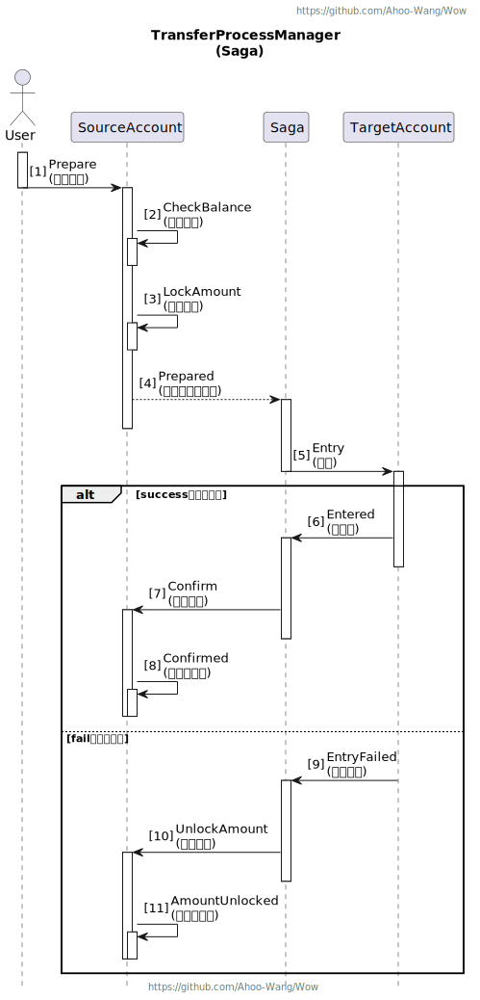
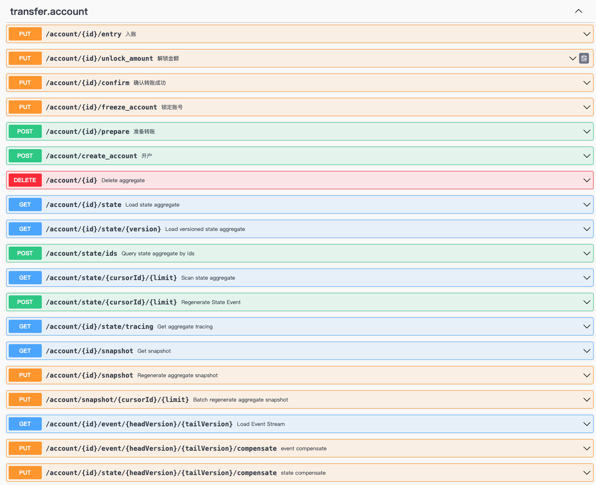

# 银行账户转账案例

## 银行转账流程

  

## 运行案例

1. 运行 [TransferExampleServer.java](example-transfer-server/src/main/java/me/ahoo/wow/example/transfer/server/TransferExampleServer.java)
2. 查看 Swagger-UI : http://localhost:8080/swagger-ui.html
3. 执行 API 测试：[Transfer.http](Transfer.http)

## 自动生成 API 端点

  

