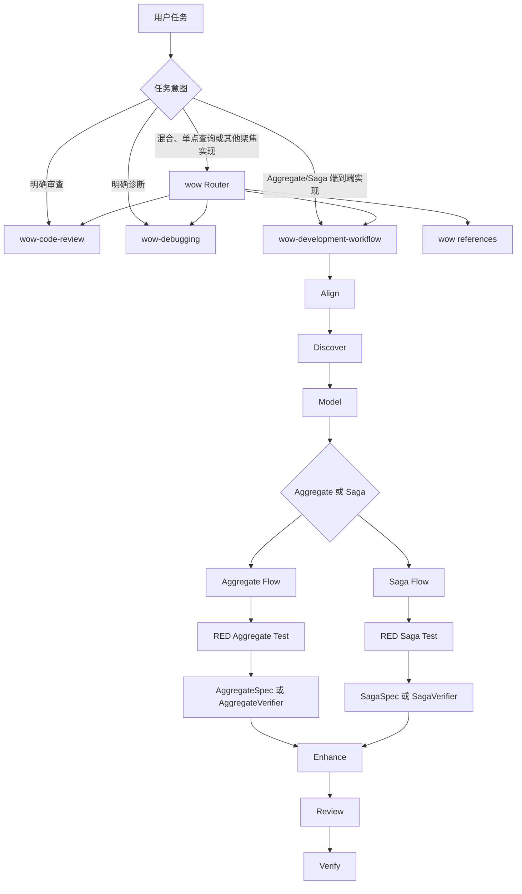

# Wow Agent Skills

本目录存放面向 Wow 框架开发的 Agent Skills。它们遵循通用的 `SKILL.md` 目录约定，目标是在 Claude Code、Codex 以及其他支持本地 skills 的 agent 环境中复用。

这些 skills 不绑定某一个客户端。它们的目标不是复述框架文档，而是把当前源码、DDD/Event Sourcing/CQRS 方法论、测试策略和开发工作流组织成可执行、可迁移的 agent 指南。

## 兼容性目标

- 每个 skill 目录以 `SKILL.md` 作为入口。
- `SKILL.md` 使用标准 YAML frontmatter，并且只包含 `name` 和 `description`。
- `agents/openai.yaml` 保持为生成器当前输出的单层 `interface` 映射和带引号单行字符串；包验证器会严格拒绝未识别或未解析的内容。
- 大段参考资料放入 `references/`，由 agent 按需加载。
- 使用 `skill-creator` 提供的标准 validator 校验目录结构和 frontmatter；仓库内不重复维护通用 Markdown、HTML 或自然语言 parser。
- 文档避免使用只属于某个 agent 产品的术语，除非是在说明兼容范围。

## 总体结构


```mermaid
graph TD
    A[用户任务] --> C{任务意图}
    C -->|明确审查| E[wow-code-review]
    C -->|明确诊断| F[wow-debugging]
    C -->|Aggregate/Saga 端到端实现| D[wow-development-workflow]
    C -->|混合、单点查询或其他聚焦实现| B[wow Router]
    B --> D
    B --> E
    B --> F
    B --> G[wow references]

    D --> D1[Align]
    D1 --> D2[Discover]
    D2 --> D3[Model]
    D3 --> D4{Aggregate 或 Saga}
    D4 --> D5[Aggregate Flow]
    D4 --> D6[Saga Flow]
    D5 --> D7[RED Aggregate Test]
    D6 --> D8[RED Saga Test]
    D7 --> D71[AggregateSpec 或 AggregateVerifier]
    D8 --> D81[SagaSpec 或 SagaVerifier]
    D71 --> D9[Enhance]
    D81 --> D9
    D9 --> D10[Review]
    D10 --> D11[Verify]
```

## Skills

| Skill | 职责 |
|-------|------|
| `wow` | 混合任务路由器、单点 API/规则查询入口，以及非 Aggregate/Saga 聚焦实现指南。 |
| `wow-development-workflow` | 端到端开发工作流。覆盖需求确认、源码发现、领域建模、Aggregate Flow、Saga Flow、测试、增强、审查和验证。 |
| `wow-code-review` | Wow 语义优先的代码审查。重点检查事件溯源、聚合边界、Saga 编排、测试覆盖和 API metadata。 |
| `wow-debugging` | Wow 管线问题定位。按命令、事件、溯源、Saga、等待计划、Query DSL、配置和测试阶段定位根因。 |

## 工作流哲学

- 源码第一，文档第二，记忆最后。
- 命令表达意图，领域事件表达已经发生的事实，状态只由事件溯源得到。
- 聚合负责不变量，Saga 负责跨聚合编排，不把 Saga 写成隐藏聚合。
- 属于 API/领域契约的命令和领域事件应携带 `@Summary` 与 `@Description`，为 schema/API metadata 提供可读信息。
- 重要且重复的领域字段应抽象为 `<FieldName>Capable` 接口，形成共享领域词汇。
- `AggregateSpec`/`AggregateVerifier` 验证聚合行为，`SagaSpec`/`SagaVerifier` 验证 Saga 编排行为；行为变更使用 RED→GREEN→REFACTOR。
- KDoc、测试场景文档和设计报告属于证据，不是装饰。

## Reference Files

`wow/references/` 提供按需加载的事实参考：

| Reference | 内容 |
|-----------|------|
| `modeling.md` | 聚合建模、命令/事件 metadata、字段能力接口、生命周期和路由。 |
| `annotations.md` | Wow 注解，包括 `@Summary`、`@Description`、命令、溯源、Saga、Retry 等。 |
| `testing.md` | `AggregateSpec`、`SagaSpec`、verifier、fork/ref 和 FluentAssert。 |
| `command-gateway.md` | Command Gateway、等待计划、幂等、LocalFirst、HTTP wait header。 |
| `dsl.md` | Query DSL、condition、pagination、projection、sort。 |
| `configuration.md` | Spring Boot starter 与模块配置。 |
| `prepare-key.md` | PrepareKey 唯一性和预留流程。 |

`wow-development-workflow/references/` 提供 workflow 产物模板：

| Reference | 内容 |
|-----------|------|
| `comment-standards.md` | KDoc、`@Summary`、`@Description` 和字段能力接口注释规则。 |
| `test-case-template.md` | 聚合行为和 Saga 编排的测试场景文档模板。 |
| `design-report-template.md` | 聚合/Saga 设计报告模板。 |
| `test-patterns.md` | workflow 到 Aggregate/Saga spec 与 verifier 的测试映射，以及运行时重试/幂等覆盖边界。 |

## Related Skills

| Skill | 关系 |
|-------|------|
| `fluent-assert` | 外部 skill，不在本仓库重复维护；通过 [Ahoo-Wang/skills](https://github.com/Ahoo-Wang/skills) 聚合分发，源头在 [Ahoo-Wang/FluentAssert](https://github.com/Ahoo-Wang/FluentAssert/tree/main/skills/fluent-assert)。Wow testing references 只保留 `me.ahoo.test:fluent-assert-core` 的最小契约：`import me.ahoo.test.asserts.assert` 与 `.assert()`。 |

## 使用路径

审查、诊断和 Aggregate/Saga 端到端实现直接调用 specialist；混合任务、单点查询和其他聚焦实现使用 `wow`：

| 任务 | 路径 |
|------|------|
| 新增或完善聚合/Saga 能力 | `wow-development-workflow` |
| 编写或补强聚合测试 | `wow-development-workflow` -> `Aggregate Flow` |
| 编写或补强 Saga 测试 | `wow-development-workflow` -> `Saga Flow` |
| 审查 PR 或 diff | `wow-code-review` |
| 定位失败或异常行为 | `wow-debugging` |
| 混合任务 | `wow` -> 对应 specialist |
| 查询单点 API 或注解规则 | `wow` -> `wow/references/*` |
| 实现 Projection 或 EventProcessor | `wow` -> `annotations.md`、`testing.md` |
| 实现 Gateway、Query DSL、配置或 PrepareKey | `wow` -> 对应 reference |

## 维护规则

- 修改 skills 前，优先检查当前 Wow 源码；文档只能作为辅助。
- 不把长篇框架知识塞回 `wow/SKILL.md`，保持它是 Router。
- 重复、细节性材料放入 `references/`，由 workflow 按需加载。
- 不恢复旧的 `wow-aggregate-enhance` 顶层入口；聚合增强已经并入 `wow-development-workflow` 的 `Enhance` 阶段。
- 新增 Wow 专属规则时，优先落实到对应 `SKILL.md` 或按需加载的 reference；不要创建通用 Markdown/NLP linter。

## 事实依据

高风险事实优先对照这些源码入口：

| 主题 | 当前依据 |
|------|----------|
| API metadata | `wow-api/src/main/kotlin/me/ahoo/wow/api/annotation/Summary.kt`, `Description.kt`; `wow-schema/src/main/kotlin/me/ahoo/wow/schema/*Resolver.kt` |
| Command Gateway | `wow-core/src/main/kotlin/me/ahoo/wow/command/CommandGateway.kt`, `CommandResult.kt`; `wow-openapi/src/main/kotlin/me/ahoo/wow/openapi/aggregate/command/CommandComponent.kt` |
| Wait Chain | `wow-core/src/main/kotlin/me/ahoo/wow/command/wait/CommandWait.kt`; `wow-core/src/main/kotlin/me/ahoo/wow/command/wait/WaitPlan.kt`; `wow-core/src/main/kotlin/me/ahoo/wow/command/wait/chain/SimpleWaitingChain.kt`; `wow-core/src/main/kotlin/me/ahoo/wow/command/wait/chain/WaitingChainTail.kt`; `wow-webflux/src/main/kotlin/me/ahoo/wow/webflux/route/command/AggregateRequest.kt` |
| Testing DSL | `test/wow-test/src/main/kotlin/me/ahoo/wow/test/AggregateSpec.kt`, `SagaSpec.kt`, `AggregateVerifier.kt`, `SagaVerifier.kt` |
| Query DSL | `wow-query/src/main/kotlin/me/ahoo/wow/query/dsl/`; `wow-query/src/main/kotlin/me/ahoo/wow/query/snapshot/QueryDsl.kt` |
| Configuration | `wow-spring-boot-starter/src/main/kotlin/me/ahoo/wow/spring/boot/starter/**/*Properties.kt` |
| Saga retry policy | `wow-api/src/main/kotlin/me/ahoo/wow/api/annotation/Retry.kt` |
| PrepareKey | `wow-core/src/main/kotlin/me/ahoo/wow/infra/prepare/PrepareKey.kt`, `PreparedValue.kt`; `wow-spring-boot-starter/src/main/kotlin/me/ahoo/wow/spring/boot/starter/prepare/PrepareKeyAutoRegistrar.kt` |

## 验证

修改本目录后运行：

```bash
for skill_file in skills/*/SKILL.md; do
  python3 "${CODEX_HOME:-$HOME/.codex}/skills/.system/skill-creator/scripts/quick_validate.py" "$(dirname "$skill_file")"
done
```

`quick_validate.py` 只校验单个 skill 的基础结构和 frontmatter，不覆盖 `agents/openai.yaml`、`plugins.json` 或 reference 链接。

如果要发布到 Codex plugin registry，再运行该 registry 自带的生成器和聚合验证器，确认 `plugins.json`、生成后的插件清单以及运行时文件布局一致。

根据变更范围，以明确指定目标 skill 的真实开发、审查或诊断任务做 output forward-testing，确认 skill 能读取当前源码并给出可执行结果。验证路由时，向全新任务只发送原始用户请求，不得显式指定 skill、预期答案、已知缺陷或本轮修复结论；只有客户端 activation trace 能证明实际选择，不得用“回答看起来正确”冒充路由通过。
